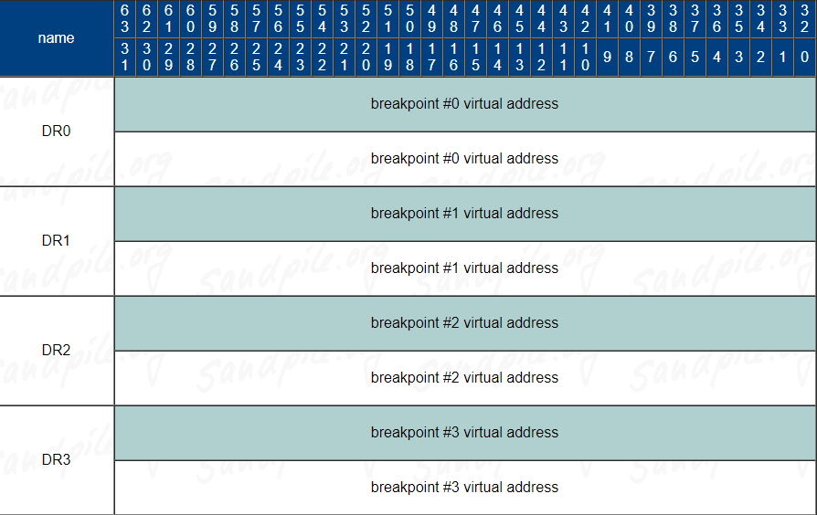
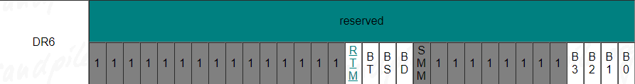
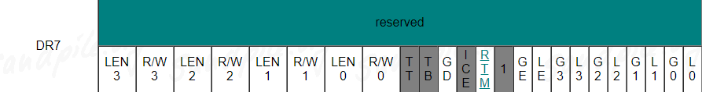

# 基於 ptrace 在 Linux 上打造具體而微的 debugger

## 序言

如果你是和我一樣習慣使用 Linux 進行程式開發的人，GNU Debugger(GDB) 應該會是常用的 GNU 工具鏈(toolchain) 之一。在和臭蟲戰鬥的過程中，透過 GDB 的協助，我們可以讀取甚至修改程式在執行途中的變數/暫存器/記憶體位置的值、將程式透過斷點暫停在執行的中途進行觀察、單步的執行程式、展開函式呼叫的堆疊(function call stack)等等。藉由 GDB，我們可以說是能將一個程式的每寸肌膚都摸個通透，掌握其完整的樣貌。

然而，GDB 是透過甚麼手段而得以追蹤與控制另一支程式的執行呢? 雖然我們都知道編譯時要透過 `-g` 選項讓編譯器產生額外的除錯資訊，但其中究竟到底包含哪些內容呢? 要回答這些問題，最直接的方式也許是鑽研 GDB 的原始程式碼。不過 GDB 支援的指令集架構、作業系統眾多，支援的功能更是五花八門 (試試問問 help GDB 支援哪些命令?)，並且雖著時間的推進存在許多的最佳化，要深入其中是相當不容易的。

不過，假設我們將使用環境鎖定在 Linux / x86\_64 機器上，並且僅支援一小部分最常使用的 debugger 命令的話，其實只要掌握核心的系統呼叫 `ptrace` 和除錯資訊的 DWARF 格式，我們就可以動手打造一款麻雀雖小，但五臟俱全的 debugger! 在本系列文章中，我們就將以一款具體而微的 debugger: [`raid`](https://github.com/RinHizakura/raid-dbg)(啊! 雷達!) 來進行介紹，用精簡的實作展示 GDB 的運作。

## 建立 debugger 的基本環境

### 初探 `ptrace`

在 Linux 上，debugger 要追蹤甚至修改其他行程(process) 只要透過強大的 `ptrace` 系統呼叫就能達成。在我們開始從程式碼解說 `ptrace` 之前，讓我們先看看 `ptrace` 的檔案裡是怎麼說的:

```
$ man 2 ptrace

PTRACE(2)               Linux Programmer's Manual              PTRACE(2)
NAME 
       ptrace - process trace
       
SYNOPSIS
       #include <sys/ptrace.h>

       long ptrace(enum __ptrace_request request, pid_t pid,
                   void *addr, void *data);

DESCRIPTION
       The ptrace() system call provides a means by which one process
       (the "tracer") may observe and control the execution of another
       process (the "tracee"), and examine and change the tracee's
       memory and registers.  It is primarily used to implement
       breakpoint debugging and system call tracing.

...

```

相當有趣的，檔案裡直接告訴我們 ptrace 最主要的運用就是在 debugger 和系統呼叫的追蹤上。一個做為追蹤者(tracer)的 process 可以透過 `ptrace` 去追蹤和控制另一個被追蹤者(tracee) 的 process 之運作。包含我們一直提到的 GDB，或者另一個大名鼎鼎的工具 [strace](https://man7.org/linux/man-pages/man1/strace.1.html)，實際上也就是依賴於 `ptrace` 來實現的。

如果想要從更為精簡的範例窺探 `ptrace` ，而不想聽筆者嘮叨的話，也可以試試從 [ministrace](https://github.com/nelhage/ministrace) 下手 

```

long ptrace(enum __ptrace_request request, pid_t pid,
           void *addr, void *data);

```

`ptrace` 的介面如上所示，透過不同的 `request` 可以讓 `ptrace` 去對特定 `pid` 進行不同的追蹤行為，例如開始追蹤、讀取和寫入暫存器/記憶體等等。 `addr` 則是 tracer 指定去讀寫的位址(如果需要)。根據 `request` 的不同， `data` 則可以傳遞值給 tracee 或用來得到來自 tracee 的返回值。

### 開始追蹤 tracee: `PTRACE_TRACEME` / `PTRACE_ATTACH` / `PTRACE_SEIZE`

要打造一個 debugger，首先當然要從建立起兩個程式之間的追蹤與被追蹤關係開始啦! `ptrace` 提供兩種方法來建立這一關係，一種是 tracer 先透過 `fork` 建立出 child，child 只要透過 `ptrace` request `PTRACE_TRACEME` 後，再使用 `exec` 系列系統呼叫執行目標的可執行檔，就可以讓自己被 parent 追蹤。

作為 `raid_dbg` 建立起追蹤者(tracer)和被追蹤者(tracee)間關聯入口的 `target_lauch` 中就是透過這種方式讓 debugger 可以追蹤目標的可執行檔的。

```
bool target_lauch(target_t *t, char *cmd)

    pid_t pid = fork();
    /* for child process */
    if (pid == 0) {
        // disable address space randomization
        personality(ADDR_NO_RANDOMIZE);
        ptrace(PTRACE_TRACEME, 0, NULL, NULL);
        execl(cmd, cmd, NULL);
    }
    ...

```

這裡額外使用 `personality(ADDR_NO_RANDOMIZE)` 來關閉 child 的 [Address space layout randomization](https://en.wikipedia.org/wiki/Address_space_layout_randomization)，方便我們之後直接把 ELF / DWARF 的地址和實際被載入的位置連結起來。

另一種方式則是能以 `PTRACE_ATTACH` / `PTRACE_SEIZE` 的方式去追蹤 pid 指定的 tracee(兩者最大的區別是使用 `PTRACE_SEIZE` 不會將 tracee 先停住)。

```
    /* for parent process */
    if (!target_wait_sig(t))
        return false;

```

如果是使用 `PTRACE_ATTACH` 或 `PTRACE_TRACEME` ，tracee 將會被暫停下來。tracer 首先需透過 `waitpid` 去得到 tracee 停止的原因。在 `raid_dbg` 中會在 `target_wait_sig` 中進行該行為。

```
static bool target_wait_sig(target_t *t) 
{
    int wstatus;
    if (waitpid(t->pid, &wstatus, __WALL) < 0) {
        perror("waitpid");
        return false;
    }   

    ...
}

```

根據等到的 signal 型別，我們可能還需要相應的處理流程。不過以 `PTRACE_TRACEME` 而言我們只要成功 wait 到 tracee 即可，暫時不需要額外做甚麼。因此 `target_wait_sig` 後半部分的實作就讓我們在稍後再行探討吧!

在成功等到 `waitpid` 返回後，tracer 就可以準備去追蹤與控制 tracee 的執行了!

### 處理使用者的命令(command)

在開始使用 `ptrace` 去追蹤前，既然我們要實作 debugger，自然會需要一個能和使用者互動的介面。如果要尋找可以讓我們輕鬆支援命令列(command line) 功能的函示庫的話，[`linenoise`](https://github.com/antirez/linenoise/tree/master) 是一個很不錯的選擇，這個函式庫雖然程式碼內容不多，但功能相當完整，包含自動補齊(auto completion) 和歷史命令等方便的功能皆有支援。

由於我們主要會聚焦在 `ptrace` 和 DWARF 格式的使用方式上，本文將不會贅述 `linenoise` 相關的使用方式。不過要是你在閱讀 `raid_dbg` 時，對 `linenoise` 的使用方式時有任何疑問，都歡迎留言提出~

## 讓 tracee 繼續執行

### 解除 tracee 的暫停狀態: `PTRACE_CONT`

在 tracee 暫停下來之後，我們就可以任意地透過 `ptrace` 的其他 request 去讀寫其記憶體/暫存器，或者控制 tracee 的執行。首先我們想要實作的是類似 GDB 的 `continue` 命令，讓 tracee 可以解除暫停並繼續往下執行，直到碰到設定的斷點(後續章節會再詳細說明)或結束。

以 `raid_dbg` 而言，當使用者輸入 `cont` 的命令之後， `do_cont` 就會被執行，然後我們就可以藉由 `PTRACE_CONT` 來讓 tracee 繼續運作，可以參考如下的使用方式。同樣的，我們需要在 `continue` 結束後透過 `waitpid` 去等待。

```
bool target_conti(target_t *t)
{   
    if (!t->run) {
        printf("The program is not being run.\n");
        return false;
    }

    if (!target_handle_bp(t))
        return false;

    ptrace(PTRACE_CONT, t->pid, NULL, NULL);

    if (!target_wait_sig(t))
        return false;

    return true;
}

static bool do_cont(__attribute__((unused)) int argc,
                    __attribute__((unused)) char *argv[])
{
    if (!target_conti(&gDbg->target))
        return false;

    ...

    return true;
}

```

在這段程式中，另外可以看到在 continue 之前會有對斷點(breakpoint)的額外處理( `target_handle_bp` )。而在 `waitpid` 結束後， `target_wait_sig` 中也有機會需要對此做相應調整，就讓我們在後續章節再釐清這些部分吧!

### 指令的單步執行: `PTRACE_SINGLESTEP`

如果不想讓程式像 `PTRACE_CONT` 一樣一口氣的進行到觸發斷點或者結束， `ptrace` 中提供另一種可以進展 tracee 執行的 request: `PTRACE_SINGLESTEP` 。

```
bool target_step(target_t *t)
{
    if (!t->run) {
        printf("The program is not being run.\n");
        return false;
    }

    if (!target_handle_bp(t))
        return false;

    ptrace(PTRACE_SINGLESTEP, t->pid, NULL, NULL);
    if (!target_wait_sig(t)) {
        printf("bp handle\n");
        return false;
    }
    return true;
}

```

透過 `PTRACE_SINGLESTEP` 可以讓 tracee 執行下一個指令(instruction)。類似於 `PTRACE_CONT` ，在呼叫完 `ptrace` 之後需要再透過 `waitpid` 去等待 tracee 把對應指令執行之後並暫停。在每次進行 `PTRACE_SINGLESTEP` 之前也同樣會有對斷點(breakpoint)的額外處理，確保每次做指令等級的單步執行不會被已存在的斷點限制。

## 存取 tracee 的記憶體和暫存器

在介紹下一個要為 debugger 實作的功能以前，我們需要先認識一下如何使用 `ptrace` 來存取 tracee 的記憶體和暫存器。一旦掌握了存取 tracee 資料的方法以後，基本上我們就可以隨心所欲的控制 tracee 的執行了!

### 讀取記憶體位置: `PTRACE_PEEKDATA` / `PTRACE_PEEKTEXT` / `process_vm_readv`

```
 size_t data = ptrace(PTRACE_PEEKDATA, pid, addr, NULL);

```

debugger 可以藉由 `PTRACE_PEEKDATA` / `PTRACE_PEEKTEXT` ，來對 tracee 的指定位址 `addr` 讀取一個 word 大小的資料 `data` 。在 Linux 中，由於並沒有區分 text 和 data 在不同的 address space 中，所以這兩個 request 是等價的。

注意到讀取到的內容會從返回值得到，最後一個引數是不需要設定的( `NULL` )。

```
bool target_read_mem(target_t *t, void *buf, size_t len, size_t target_addr)
{
    /* NOTE: maybe we should check the permission first instead of assume
     * all the region could be read. */
    struct iovec local[1];
    struct iovec remote[1];

    local[0].iov_base = buf;
    local[0].iov_len = len;
    remote[0].iov_base = (void *) target_addr;
    remote[0].iov_len = len;

    if (process_vm_readv(t->pid, local, 1, remote, 1, 0) == -1) {
        perror("process_vm_readv");
        return false;
    }

    return true;
}

```

不過，如果仔細看 `raid_dbg` 提供讀取 tracee 記憶體的介面 `target_read_mem` ，會發現這裡我們並不是透過 `ptrace` 來實現的。你沒看錯! 這邊我們使用 Linux 提供的另一種可以讀取另一個 process 的系統呼叫 [`process_vm_readv`](https://man7.org/linux/man-pages/man2/process_vm_readv.2.html) 來達到讀取 tracee 記憶體位置的目的。

考慮到 `raid_dbg` 可能會需要一次讀到超過一個 word 數量的資料，若想透過 `PTRACE_PEEKDATA` 完成，我們就會需要多次的呼叫 `ptrace` ，這可能是很沒效率的。Linux 3.2 時引入了一個稱作 [Cross Memory Attach](https://lwn.net/Articles/415600/) 的機制，可以直接在 tracer 和 tracee 的 userspace 之間直接進行搬動。在兩個 process 間需要共享記憶體的的場景上，這個機制也可以避免需要經過 kernel space 進行資料搬動所帶來的額外成本。

```
ssize_t process_vm_readv(pid_t pid,
                      const struct iovec *local_iov,
                      unsigned long liovcnt,
                      const struct iovec *remote_iov,
                      unsigned long riovcnt,
                      unsigned long flags);

```

`raid_dbg` 則使用該系統呼叫來讀取 tracee 的空間，使用的方式可以直接參考 `target_read_mem` 的程式碼: 提供來源 `remote_iov` 與目的地 `local_iov` 的 `struct iovec` 結構去描述相應的位址和資料長度。搭配 `liovcnt` 和 `riovcnt` 的使用則可以讓 `process_vm_readv` 更彈性的搬動多段不連續的記憶體空間。詳情請看 [`process_vm_readv`](https://man7.org/linux/man-pages/man2/process_vm_readv.2.html) 檔案中的說明。

需注意的是，與 `ptrace` 不同， `process_vm_readv` 並不能讀取 tracee 許可權設定為不可讀的區域。完整的實作上可能需要先確認要讀取的位址之許可權，再判斷是否有必要透過 `PTRACE_PEEKDATA` 進行。只是因為 `raid_dbg` 預期會需要讀取的位置剛好都是可讀的，因此簡化的此部分的設計。

### 寫入記憶體位置: `PTRACE_POKEDATA` / `PTRACE_POKETEXT` / `process_vm_writev`

```
 int ret = ptrace(PTRACE_POKEDATA, pid, addr, data);

```

反之，debugger 可以藉由 `PTRACE_POKEDATA` / `PTRACE_POKETEXT` 來對 tracee 的指定位址 `addr` 寫入一個 word 大小的資料 `data` ，text 和 data 在不同的 address space 中同樣沒有區分。

```
bool target_write_mem(target_t *t, size_t *buf, size_t len, size_t target_addr)
{
    /* TODO: let's see if we can modify the tracee's permission to
     * use process_vm_writev on code region. Or we can check the permission
     * first then deciding the approach. */

    uint8_t unit = sizeof(size_t);

    for (; len > unit; len -= unit) {
        int ret = ptrace(PTRACE_POKEDATA, t->pid, (void *) target_addr, *buf);
        if (ret == -1) {
            perror("ptrace_poke");
            return false;
        }

        buf++;
        target_addr += unit;
    }

    /* If a write size is smaller than a word, we should read memory before
     * rewriting it. */
    if (len > 0) {
        size_t value =
            ptrace(PTRACE_PEEKDATA, t->pid, (void *) target_addr, NULL);
        if (value == (size_t) -1) {
            perror("ptrace_peek");
            return false;
        }

        uint8_t *v = (uint8_t *) &value;
        for (size_t i = 0; i < len; i++) {
            v[i] = *((uint8_t *) buf + i);
        }

        int ret = ptrace(PTRACE_POKEDATA, t->pid, (void *) target_addr, value);
        if (ret == -1) {
            perror("ptrace_poke");
            return false;
        }
    }

    return true;
}

```

由於我們之後會需要寫入到原本許可權為不可寫的 tracee 所執行的指令區域， `target_write_mem` 沒有選擇以 `process_vm_writev` 的方式進行，而是迴圈呼叫 `PTRACE_POKEDATA` 來寫入指定的長度。

注意到每次 `PTRACE_PEEKDATA` / `PTRACE_POKEDATA` 的單位都是一個 `size_t` 大小，因此即便我們想修改的只是特定一個 byte，還是需要讀出整整 `sizeof(size_t)` 數量的 byte，調整其中要更改的部分之後，再覆蓋回去。因此這裡可以看到對不滿一個 word 時的處理。

### 讀取暫存器: `PTRACE_GETREGS`

暫存器和記憶體位置不同，前者是會根據 CPU 的差異而需要以不同的方式支援的。做為示範， `raid_dbg` 鎖定在 x86\_64 的架構，並且我們只會針對通用暫存器(general purpose register)進行存取。此外，x86 還允許我們將一些 64 位元的暫存器作為 32、16 或 8 位元使用，但為求簡化， `raid_dbg` 只會以 64 位元的方式操作記憶體。

```
struct user_regs_struct regs;
int ret = ptrace(PTRACE_GETREGS, pid, NULL, &regs);

```

透過 `ptrace` 的 `PTRACE_GETREGS` 可以讓我們得到一個 `struct user_regs_struct` ，這個架構根據使用 CPU 架構而異，將會是 tracee 中各個通用暫存器當下的內容。我們可以在 `<sys/user.h>` 中找到這個結構的[定義](https://elixir.bootlin.com/linux/latest/source/arch/x86/include/asm/user_64.h#L69)。

```
/* The layout follow usr/include/sys/user.h */
typedef struct {
    enum {
        R15, R14, R13, R12,
        RBP, RBX, R11, R10,
        R9, R8, RAX, RCX,
        RDX, RSI, RDI, ORIG_RAX,
        RIP, CS, EFLAGS, RSP,
        SS, FS_BASE, GS_BASE, DS,
        ES, FS, GS,
        REGS_CNT,
    } idx;
} regs_struct_idx;

bool target_get_reg(target_t *t, size_t idx, size_t *value)
{
    struct user_regs_struct regs;
    ptrace(PTRACE_GETREGS, t->pid, NULL, &regs);

    *value = *(((size_t *) &regs) + idx);
    return true;
}

```

因為大多時候需要的只是某一個暫存器而已，為了讓讀取暫存器的介面變得更加容易一點， `raid_dbg` 實作 `target_get_reg` 來從 `struct user_regs_struct` 中拿到所需的內容。可以看到 `enum` 中故意把暫存器的名稱順序和 `<sys/user.h>` 的暫存器定義成相同的。

### 寫入暫存器: `PTRACE_SETREGS`

```
struct user_regs_struct regs;
int ret = ptrace(PTRACE_SETREGS, pid, NULL, &regs);

```

瞭解瞭如何讀取暫存器之後，寫入就很容易可以理解了。

```
bool target_set_reg(target_t *t, size_t idx, size_t value)
{
    struct user_regs_struct regs;
    ptrace(PTRACE_GETREGS, t->pid, NULL, &regs);

    *(((size_t *) &regs) + idx) = value;

    ptrace(PTRACE_SETREGS, t->pid, NULL, &regs);
    return true;
}

```

同樣的，我們實作一個方便設定 tracee 暫存器的介面 `target_set_reg` 。這邊要注意到因為寫入 `struct user_regs_struct` 是以整個結構為單位，為了不要錯覆蓋掉其他沒有要修改的內容，我們必須先將原本的結構讀出，改掉對應的部分之後，再寫回去。

### PTRACE_PEEKUSER--PTRACE_POKEUSER `PTRACE_PEEKUSER` / `PTRACE_POKEUSER`

與 `PTRACE_PEEKDATA` / `PTRACE_POKEDATA` 類似，我們可以透過 `PTRACE_PEEKUSER` / `PTRACE_POKEUSER` ，去存取 tracee 的 user area。該結構的詳細定義可以在 `<sys/user.h>` 找到。其中的資訊包含通用暫存器，section 的大小等資訊，其中我們會特別關注的是除錯暫存器。

```
struct user
{
  struct user_regs_struct    regs;
  ...
  __extension__ unsigned long long int u_debugreg [8];
};

```

需要注意的是 `PEEKUSER` 的介面用法和 `PEEKDATA` 不同。前者所讀取到的值是返回在 `ptrace` 第四個引數的位址中，而後者則是將讀取的內容已返回值回傳。

```
struct user user;
int ret = ptrace(PTRACE_PEEKUSER, pid, offsetof(struct user, ??), &value))
int ret = ptrace(PTRACE_POKEUSER, pid, offsetof(struct user, ??), value))

```

## 斷點(breakpoint)設定

### 何謂斷點(breakpoint)?

所謂的[斷點(Breakpoint)](https://en.wikipedia.org/wiki/Breakpoint) 是指程式中為了除錯而故意停止或者暫停的地方，可以說是 debugger 中最頻繁被使用的功能。

從功能上區分的話，最常使用的像是指令斷點(instruction breakpoint)，可以使程式在執行到特定處產生中斷而暫停。也有監測點(watchpoint) 這種在讀取或寫入特定記憶體位置或暫存器位置時觸發的型別。或者日誌點(logpoint) 這樣可以在斷點處顯示一段程式的狀態但不用停止其執行。廣義來說，其他像是以時間、按鍵為觸發方式的中斷執行也能算是斷點的一種。

從實作上區份的話，斷點則可以分成軟體斷點和硬體斷點。硬體斷點是由處理器本身支援的。例如，x86 指令集架構就有 [x86 debug register](https://en.wikipedia.org/wiki/X86_debug_register) 可以提供相關功能。硬體斷點可能包括諸多限制，例如不允許在 [branch delay slot](https://en.wikipedia.org/wiki/Delay_slot) 上的指令上設定斷點，並且可設定的數量也會受限於硬體的支援。如果沒有硬體支援，debugger 就需要透過軟體的方式來實現斷點。一種軟體就可以簡單實現的斷點是指令斷點，例如可以將欲設定斷點位置處的指令替換為會觸發 trap 的指令並讓 debugger 收到並處理之。此外我們還可以透過 [instruction set simulator](https://en.wikipedia.org/wiki/Instruction_set_simulator) 等技術實現軟體中斷，更多詳情可參考 [Breakpoint](https://en.wikipedia.org/wiki/Breakpoint) 的介紹。

### 以軟體斷點設定指令斷點(instruction breakpoint)

接著，就讓我們示範如何以軟體方式來設定斷點，讓 tracee 可以停在想暫停之處吧!

在瞭解程式碼前，讓我們先來瞭解一下實作軟體斷點的原理。我們所需要做的是使得 CPU 在執行到斷點想設定的地址時，可以停止並對 debugger 發出 singal，這樣 debugger 就可以攔截到停止的 tracee。而在 x86 上，我們可以透過把 [`INT3`](https://en.wikipedia.org/wiki/INT_(x86_instruction)#INT3) 指令覆蓋目標地址處原本的指令來做到這件事。

INT3 是 x86 提供的一個 1 bytes 長度，opcode 為 `0xCC` 的指令。作業系統中有一個中斷向量表(interrupt vertor table)，可以使用它來註冊各種事件的處理程式，在 Linux 的情況裡，當 x86 的 CPU 執行到 INT3 時，控制權被傳遞給斷點中斷處理程式(breakpoint interrupt handler)，後者會執行 [`do_int3`](https://elixir.bootlin.com/linux/latest/source/arch/x86/kernel/traps.c#L774) 使得 kernel 用 `SIGTRAP` 向 tracer 發出訊號，以達到中斷 tracee 執行的目的。

```
static bool do_break(int argc, char *argv[])
{
    if (argc != 2)
        return false;

    size_t addr;

    ...

    if (!target_set_breakpoint(&gDbg->target, addr))
        return false;

    return true;
}

```

`raid_dbg` 在使用者輸入 `break` 的命令之後會去執行 `do_break` ，後者會根據欲設定的指令位址 `addr` (後面會再說明如何得到指令位址) 來安插 breakpoint，具體的實作在 `target_set_breakpoint` 中

```
bool target_set_breakpoint(target_t *t, size_t addr)
{
    int n = __builtin_ffs(t->bp_bitmap);
    if (n == 0) {
        printf("Only at max 16 breakpoints could be set\n");
        return false;
    }

    n -= 1;
    t->bp_bitmap &= ~(1 << n);

    swbp_init(&t->bp[n], t->pid, addr);
    if (!swbp_set(&t->bp[n]))
        return false;

    ...

```

為求簡單， `raid_dbg` 的結構中會攜帶 16 個 `swbp_t` 型別的 breakpoint instance，然後透過 bitmap 去管理已經哪些是被註冊的。這些 `swbp_t` 在透過 `swbp_init` 初始化之後，軟體斷點的設定關鍵在 `swbp_set` 中:

```
bool swbp_set(swbp_t *bp)
{
    if (bp->is_set)
        return false;

    /* TODO: explicitly prevent calling this function twice on the same addr */
    size_t instr = ptrace(PTRACE_PEEKDATA, bp->pid, (void *) bp->addr, NULL);
    if (instr == (size_t) -1) {
        perror("ptrace_peek");
        return false;
    }

    bp->orig_instr = instr;

    memcpy(&instr, INT3, sizeof(INT3));

    int ret = ptrace(PTRACE_POKEDATA, bp->pid, (void *) bp->addr, instr);
    if (ret == -1) {
        perror("ptrace_poke");
        return false;
    }

    /* FIXME: We should handle error if we fail on the middle process */
    bp->is_set = true;
    return true;
}

```

為了將原本的指令替換掉，此時就是 `ptrace` 派上用場的時候了! 我們之前已經說明過如何藉由 `ptrace` 來讀取或修改 tracee 的記憶體位置。實際的流程是:

1.  首先，我們不能直接就將原本的指令覆蓋過去，需要把替換前的指令保留下。所以我們會先用 `PTRACE_PEEKDATA` 來取出存取該指令位址的內容，並儲存在 debugger 的 context 中
2.  用 `PTRACE_POKEDATA` 把 0xcc 寫入到 tracee 的對應位址之中

之前已經有提到 `PTRACE_PEEKDATA` / `PTRACE_POKEDATA` 的單位都是一個 `size_t` 大小的問題，所以這裡一樣要讀出 `sizeof(size_t)` 數量的 byte，調整其中要更改的部分之後，再覆蓋回去。

而未來若想要取消斷點，則可以透過 `swbp_unset` 把原本的指令再覆寫回去， `ptrace` 的使用方式和 `swbp_set` 大致接近，這邊就不做更多的介紹了~

是不是意外的很容易? 在 tracee 被允許的追蹤狀況下，像是 instruction 的記憶體這種一般其實並非寫合法的區域可以輕易地藉由 `PTRACE_POKEDATA` 寫入。

```
    if (!hashtbl_add(&t->tbl, t->bp[n].addr_key, &t->bp[n]))
        return false;

    printf("Breakpoint %d at 0x%lx\n", n + 1, addr);
    return true;
}

```

為了日後在執行到我們設定的斷點時，可以更有效的找出對應的 `swbp_t` 是哪一個，我們可以註冊一個 hash table 將斷點的地址和對應的 instance 連結起來。 `raid_dbg` 對於 hash table 的實作是直接建構在 Linux 提供的 [`hsearch_r`](https://linux.die.net/man/3/hsearch_r) 等一系列的支援之上，並封裝在 [`hashtbl.c`](https://github.com/RinHizakura/raid-dbg/blob/main/src/hashtbl.c) 中方便使用。

由於並非此文的重點，我們也不會深入探討這部分，不過若是在閱讀原始碼過程中有遇到疑惑還是很歡迎提出~

### 讓 tracee 在碰到斷點後繼續執行

如果我們只是設定好斷點，然後重複進行 `PTRACE_CONT` 的話，你會發現 tracee 會被卡在 INT3 的指令中動彈不得。因為斷點還在最初設定的位置中，我們無法實現和 GDB 的 continue 命令類似的效果。簡單的解決方案是先把指令回復原樣，然後做單步的指令執行，再重新將斷點插入。

還記得在介紹 `cont` 實作時我們跳過的 `target_handle_bp` 以及在收到 signal 後 `target_wait_sig` 的後續處理嗎? 現在該是時候回頭看看他們了

#### target_wait_sig `target_wait_sig`

```
static bool target_wait_sig(target_t *t)
{
     int wstatus;
     if (waitpid(t->pid, &wstatus, __WALL) < 0) {
         perror("waitpid");
         return false;
     }

```

我們之前曾經先提到，每次進行 `PTRACE_CONT` 或 `PTRACE_SINGLESTEP` 之後，都需要 `waitpid` 去等待 tracee 的暫停，這是 `target_wait_sig` 中的第一步驟。

```
    if (WIFSTOPPED(wstatus) && (WSTOPSIG(wstatus) == SIGTRAP)) {
        siginfo_t info;
        memset(&info, 0, sizeof(siginfo_t));

        ptrace(PTRACE_GETSIGINFO, t->pid, 0, &info);

        switch (info.si_signo) {
        case SIGTRAP:
            ret = target_sigtrap(t, info);
            break;
        default:
            /* simply ignore these */
            break;
        }

```

但除次之外，我們還需要確認回傳的 `wstatus` 。 `raid` 主要處理兩種狀況，如果是 `WIFSTOPPED(wstatus) == true` 或是 `WSTOPSIG(wstatus) == SIGTRAP` 的情況，則 debugger 需進一步確認具體的 signal 為何，也就是去檢視 `siginfo_t` 結構，其可以透過 `PTRACE_GETSIGINFO` 去得到。

對 `raid` 而言，造成上述狀況的預期原因有三種:

1.  tracee 在單步執行非 `INT3` 的指令之後暫停
2.  tracee 因為執行到軟體斷點( `INT3` ) 而暫停
3.  tracee 因為硬體斷點設定的 watchpoint 而觸發暫停

這三種情況產生的 signal `si_signo` 都是 `SIGTRAP` ，而 `si_code` 則會有區別。根據 `si_code` 的不同，詳細的處理流程會在 `target_sigtrap` 中去進行。以下展示 `target_sigtrap` 中對應三種情況分別的處理方式:

```
    switch (info.si_code) {
    case TRAP_TRACE:
        /* This is the si_code after single step. Nothing has
         * to be done in such case. */
        return true;
    ...

```

單步執行且並非執行到斷點的狀況下，得到的 `si_code` 會是 `TRAP_TRACE` ，這種狀況下並不需要額外的作為。

```
    case TRAP_BRKPT:
    case SI_KERNEL:
        /* When a breakpoint is hit previously, to keep executing instead of
         * hanging on the trap instruction latter, we first rollback pc to the
         * previous instruction and restore the original instruction
         * temporarily. */
        if (!target_get_reg(t, RIP, &addr))
            return false;

        addr -= 1;
        snprintf(str, 17, "%lx", addr);

        if (hashtbl_fetch(&t->tbl, str, (void **) &bp)) {
            t->hit_bp = bp;
            if (!swbp_unset(bp))
                return false;
        }
        if (!target_set_reg(t, RIP, addr))
            return false;
        return true;

```

如果執行到 `INT3` 而暫停，則有可能會觸發的是 `TRAP_BRKPT` 或是 `SI_KERNEL` 的 signal。此種狀況下，為了避免之後的繼續執行卡在相同的 `INT3` 的指令中，我們可以首先將 PC 歸位到 `INT3` 所在的前一個指令，並且將 `INT3` 所在位址復原成原本的指令 `swbp_unset` 。如此一來，下一次當我們解除 tracee 的暫停繼續執行時，就可以避免再次命中該 `INT3` ，執行到原本的指令。

注意到指令的復原只是 "暫時" 的，其目的只是讓程式可以繼續往下執行。在使用者預期上，斷點始終是存在，因此如果執行流程中回到同一處，我們仍應該將 tracee 暫停下來。也就是說，在復原的指令被執行一次後，事實上我們需要將斷點再次重設回去，這其實就是 `target_handle_bp` 在進行的工作，之後我們也可以看到詳細的實作。

```
    case TRAP_HWBKPT:
        /* We know that hardware breakpoint is only used as watchpoint ourself,
         * so we just handle signal based on this premise directly */
        if (hwbp_handle(&t->hwbp))
            return false;
        return true;
    ...

```

如果是命中硬體斷點，則是會觸發 `TRAP_HWBKPT` 。由於 raid 的設計只會把硬體斷點拿來作為 watchpoint 使用， `hwbp_handle` 簡單的根據命中的是哪一個硬體斷點將除錯狀態暫存器(debug status register) DR6 對應的 bit 清 0 即可。

```
    } else if (WIFEXITED(wstatus)) {
        printf("[Process %d exited]\n", t->pid);
        t->run = false;
    }   

```

`WIFEXITED(wstatus) == true` 則比較易懂，表示 tracee 已經完成了執行， `raid` 會去將狀態記錄下來以避免後續的 command 去進行無效的 `ptrace` 。

#### target_handle_bp `target_handle_bp`

在閱讀 `target_wait_sig` 的實作時我們有提到其會將斷點所在的指令先復原，而 `target_handle_bp` 就負責將復原的指令執行一次，然後再將斷點重設。

詳細的實作邏輯是: `target_handle_bp` 首先會在每次試圖繼續執行 tracee 前(例如 `PTRACE_CONT` 或是 `PTRACE_SINGLESTEP` ) 先檢查之前是否有命中 breakpoint( `t->hit_bp ?== NULL` )。如果有的話，我們不能直接透過 ptrace 去繼續執行的，而是需要進行前面提到的一系列處理。

```
static bool target_handle_bp(target_t *t)
{
    if (!t->hit_bp) {
        return true;
    }

    // We have to take the bp first to avoid infinite loop
    swbp_t *hit_bp = t->hit_bp;
    t->hit_bp = NULL;

    size_t addr;
    if (!target_get_reg(t, RIP, &addr))
        return false;

```

如果命中，首先要去存取 `RIP` 這個暫存器，也就是 x86 中的[程式計數器(Program Counter，PC)](https://en.wikipedia.org/wiki/Program_counter)。

```
    /* If the address isn't at the last breakpoint we hit, it means
     * the user may change pc during this period. We don't execute an extra step
     * of the original instruction in that case. */
    if (addr == hit_bp->addr) {
        if (!target_step(t))
            return false;
    }

    /* restore the trap instruction before we do cont command */
    if (!swbp_set(hit_bp))
        return false;

    return true;
}

```

接著，我們檢測 PC 是否和之前命中的 breakpoint 設定位址相同。如果相同，那意味著 PC 下一個要執行的指令即是此前我們在 `target_sigtrap` 中復原的，我們先呼叫 step 將該復原後的指令執行之後，再藉由 `swbp_set` 斷點重新設定回去。

另一方面，如果 PC 和之前命中的 breakpoint 設定位址不同，這表示在上次暫停到此次嘗試繼續執行的這斷時間，PC 很可能透過設定暫存器等方式被更動了，這種狀況下我們可以直接復原斷點，然後繼續執行 tracee 即可。

綜合來看， `target_wait_sig` 中對軟體斷點的處理流程和 `target_handle_bp` 搭配，避免了 tracee 的執行被 `INT3` 限制住的問題。從使用者的角度來說，斷點的使用就和 GDB 上的習慣一致: 設定的地方會在執行之前被停下，解除暫停之後，斷點設定處可以繼續執行，並且如果在下次執行到之前再次停下。於是我們就可以舒服的控制 tracee 的執行了，好耶!

### 以硬體斷點設定監測點(watchpoint)

在 x86\_64 的架構，我們也可以採用硬體支援的 [x86 除錯暫存器(x86 debug register)](https://en.wikipedia.org/wiki/X86_debug_register) 來進行斷點的設定。這些暫存器可以讓我們很容易的在一段地址被讀、寫、或者執行時觸發系統的中斷，以利於在程式在指定的條件發生時暫停。作為範例，在 `raid` 中我們就透過這些硬體提供的暫存器來實作 watchpoint: 當一段地址中的內容被寫入時，tracee 會被暫停並通知 debugger。

在此之前，我們需要了解各個暫存器的用途。

> [Debug registers 圖源](https://sandpile.org/x86/drx.htm)

#### DR0-3



x86\_64 架構中可用的斷點暫存器有 4 個，DR0-3 是 4 個斷點所要設定在的位址。

#### DR6



DR6 則反映了所指定的 debug 條件是否發生。當條件發生，低位元的 4 個 bits 中之對應 bit 會被設定，因此 debugger 可以藉此知道是哪個斷點被觸發。

#### DR7



DR7 則用來設定斷點觸發的相關條件

- G0/L0 表示 DR0 的 global / local enable bit，兩者的差別在於斷點的設定是否只針對當下的 task
- R/W0: 對於 DR0 斷點的觸發條件
    - 0b00: 執行
    - 0b01: 寫
    - 0b11: 讀+寫
    
- LEN0: 斷點所監測的範圍大小
    - 0b00: 1 byte
    - 0b01: 2 bytes
    - 0b11: 4 bytes
    - 0b10: 8 bytes

可以參考 [Debug Registers](https://pdos.csail.mit.edu/6.828/2004/readings/i386/s12_02.htm) 以得到更多我們暫時不會用到之 bits 的相關資訊~

對於 debug register 的相關 bit 之用途都理解後，設定硬體斷點的方法就很簡單啦。以下就讓我們來看看其中的實作吧!

```
bool target_set_watchpoint(target_t *t, size_t addr, size_t len)
{
    /* TODO */
    HWBP_LEN bp_len;
    switch (len) {
    case 1:
        bp_len = ONE_BYTE;
        break;
    case 2:
        bp_len = TWO_BYTE;
        break;
    case 4: 
        bp_len = FOUR_BYTE;
        break;
    case 8:
        bp_len = EIGHT_BYTE;
        break;
    default:
        return false;
    }

    hwbp_init(&t->hwbp, t->pid, addr, bp_len, Write);
    if (!hwbp_set(&t->hwbp))
        return false;

    return true;
}   

```

`target_set_watchpoint` 是設定硬體 watchpoint 的介面，首先會根據所要設定 watchpoint 的大小等資訊利用 `hwbp_init` 去初始化出一個硬體斷點的 instance。可以看到由於我們只想監視相關位置被改動的情況，因此 R/W 的設定上是使用 `Write` 。初始化完成之後，就可以透過 `hwbp_set` 去把 debugger register 相關的幾個 bit 進行設定。

```
bool hwbp_set(hwbp_t *bp)
{
    if (bp->is_set)
        return false;

    // take the debug controll register(DR7)
    size_t dr7;
    if (ptrace(PTRACE_PEEKUSER, bp->pid, offsetof(struct user, u_debugreg[7]),
               &dr7))
        return false;

    int index = bp->index;
    unsigned int enable_bit = 1 << (2 * index);
    unsigned int rw_shift = 16 + index * 4;
    unsigned int len_shift = 18 + index * 4;
    unsigned int rw_bit = 0b11 << rw_shift;
    unsigned int len_bit = 0b11 << len_shift;

    // check if the local enable bit has been raised already
    if (dr7 & enable_bit)
        return false;

```

之前我們曾經介紹到 debug register 可以透過 `PTRACE_PEEKUSER` / `PTRACE_POKEUSER` 去存取。 `hwbp_set` 首先透過 `PTRACE_PEEKUSER` 拿到目前的 DR7，並確認 `hwbp_t` 結構所對應之斷點是尚未被使用的。

```
    // set address to breakpoint register according to index
    if (ptrace(PTRACE_POKEUSER, bp->pid,
               offsetof(struct user, u_debugreg[index]), bp->addr))
        return false;

```

若可以使用，根據 watchpoint 所欲設定的位置填入相關的 DRn。

```
    // update the debug controll register
    dr7 &= ~(rw_bit | len_bit);
    dr7 |= enable_bit | (bp->rw << rw_shift) | (bp->len << len_shift);
    if (ptrace(PTRACE_POKEUSER, bp->pid, offsetof(struct user, u_debugreg[7]),
               dr7))
        return false;

```

並且修改 DR7 以 enable 對應斷點，並設定除錯相關之條件。

```
    // clear DR6 immediately before returning.
    if (ptrace(PTRACE_POKEUSER, bp->pid, offsetof(struct user, u_debugreg[6]),
               0))
        return false;

    /* FIXME: We should handle error if we fail on the middle process */
    bp->is_set = true;
    

```

最後，避免系統沒有將觸發時所會設定的 bit 事先清除，我們可以總是手動在啟動斷點以前將其歸零，這樣就大功告成啦。可以看到在 x86\_64 架構上的硬體斷點並不複雜，但卻可以兼顧許多型別的除錯功能，而透過強大的 ptrace 我們就可以直接使用這一系列的除錯暫存器了，實在是太方便啦!

## DWARF 格式

### 簡介

[DWARF](https://en.wikipedia.org/wiki/DWARF) 是一種在 Linux 上被廣泛使用的除錯資料格式(debugging data format) 標準，最初是跟著 [ELF(Executable and Linkable Format)](https://en.wikipedia.org/wiki/Executable_and_Linkable_Format) 格式一起被設計的。根據維基百科的說法，DWARF 這個名稱的由來其實只是跟 Elf ("精靈")相呼應的 Dwarf("矮人") 的概念，並非始於某個名稱的縮寫，雖然後來也有人將名稱逆向成 "Debugging With Arbitrary Record Formats"。

這個格式讓編譯器可以告訴 debugger 原始程式碼和編譯出的 CPU 指令/機器碼(machine code)之間的關聯。詳細的制定標準可以參考 [DWARF 官方網站](https://dwarfstd.org/)。在本章節中，我們使用 `dwarfdump` 來觀察 DWARF 中的除錯訊息，主要會把焦點放在實做的功能所需要的部分，包含 `.debug_info` 、 `.debug_line` 兩個 section 。

### debug_info `.debug_info`

`.debug_info` 中將程式中的型別、函式、變數的等符號透過樹狀的結構進行描述。這個樹由多個名為 DWARF Information Entry，簡稱為 DIE 的節點所組成。其中每個節點可以具有孩子(child)或兄弟(sibling)的節點。

每個 DIE 都會有一個 tag( `DW_TAG_*` )，表示這個單元所描述的型別為何，可能是某個函式或是變數等，而 DIE 之中還會包含多個屬性 ( `DW_AT_*` ) 欄位來描述該單元的一些特徵，像是符號的名字，位於的檔案與行數，被載入記憶體的位置等等，屬性中的值可以連結其他的 DIE。

#### CU DIE

讓我們更深入探討在 `raid_dbg` 中會需要在此 section 中尋找的目標，我們可以用 `dwarfdump --print-info <binary>` 來鎖定此 section。首先會看到作為 DWARF 中根節點(root) 的 DIE，其一般而言都是屬於 Compilation unit(CU) 的型別( `DW_TAG_compile_unit` )。可以看到其中包含了使用的語言規格，編譯器版本等資訊。

```
COMPILE_UNIT<header overall offset = 0x00000000>:
< 0><0x0000000b>  DW_TAG_compile_unit
                    DW_AT_producer              GNU C17 9.4.0 -mtune=generic -march=x86-64 -g -fasynchronous-unwind-tables -fstack-protector-strong -fstack-clash-protection -fcf-protection
                    DW_AT_language              DW_LANG_C99
                    DW_AT_name                  bin/hello.c
                    DW_AT_comp_dir              /home/rin/GitHub/raid-dbg
                    DW_AT_low_pc                0x00001149
                    DW_AT_high_pc               <offset-from-lowpc>302
                    DW_AT_stmt_list             0x00000000

```

#### Function DIE

在 compilation unit 的 DIE 之下會有多個 child DIE，這些 child DIE 彼此之間的關係則稱為 sibling，當然這些 DIE 也可以再往下有自己的 child。在這群 DIE，一種我們所會關注的型別是函式的 DIE，其 tag 會屬於 `DW_TAG_subprogram` 。如下所示為 `add` 函式所對應的 DIE 描述:

```
< 1><0x00000431>    DW_TAG_subprogram
                      DW_AT_external              yes(1)
                      DW_AT_name                  add
                      DW_AT_decl_file             0x00000001 /home/rin/GitHub/raid-dbg/bin/hello.c
                      DW_AT_decl_line             0x00000003
                      DW_AT_decl_column           0x00000005
                      DW_AT_prototyped            yes(1)
                      DW_AT_type                  <0x00000065>
                      DW_AT_low_pc                0x00001149
                      DW_AT_high_pc               <offset-from-lowpc>24
                      DW_AT_frame_base            len 0x0001: 9c: DW_OP_call_frame_cfa
                      DW_AT_GNU_all_call_sites    yes(1)

```

可以看到其中的屬性(attribute) 會包含函式的名稱( `DW_AT_name` )、所宣告的檔案( `DW_AT_decl_file` )、所在行數( `DW_AT_decl_line` )等資訊。而其中最重要的就屬其位於的位址 `DW_AT_low_pc` 。該位址就是如果要在函式的入口設定斷點時，所需插入 INT3 的地方。

#### Variable DIE

```
< 2><0x00000375>      DW_TAG_formal_parameter
                        DW_AT_name                  a
                        DW_AT_decl_file             0x00000001 /home/rin/GitHub/raid-dbg/bin/hello.c
                        DW_AT_decl_line             0x00000012
                        DW_AT_decl_column           0x0000000e
                        DW_AT_type                  <0x00000065>
                        DW_AT_location              len 0x0002: 915c: DW_OP_fbreg -36

< 2><0x0000039c>      DW_TAG_variable
                        DW_AT_name                  x
                        DW_AT_decl_file             0x00000001 /home/rin/GitHub/raid-dbg/bin/hello.c
                        DW_AT_decl_line             0x00000014
                        DW_AT_decl_column           0x00000009
                        DW_AT_type                  <0x00000065>
                        DW_AT_location              len 0x0002: 9168: DW_OP_fbreg -24

```

接著展示的另一個需要關注的重點： 變數的 DIE。這裡可以看到包含了宣告變數的型別 `DW_TAG_variable` 和屬於函式引數的型別 `DW_TAG_formal_parameter` 。而除了變數名稱和宣告的檔案這些函式也同樣具有的屬性之外，這裡想關注的是兩個不那麼直接可以理解，但卻相當重要的屬性: `DW_AT_location` 和 `DW_AT_type` 。

一個變數所處的地址會透過 `DW_AT_location` 屬性來表示。實際上，相較於函式，變數的讀取可以說是更加的複雜。首先，它們有時位於暫存器中，有時候放置在記憶體中(e.g. stack)，甚至是可以隨著執行而移動的，或者是直接被最佳化掉等等。面對各種各樣的位置資訊，DWARF 該如何用統一的格式去表達呢? 又應該如何描述隨著生命週期移動的變數?

這裡首先得提到 DWARF 表達 `DW_AT_location` 的方式: **DWARF expression**。DWARF expression 可以看成是在一個 stack-based 的計算機上的一系列運算，會有一至多道指令可以將計算結果推入 stack 中，或者從 stack 中取值。因此，按照 DWARF expression 對應的動作(operation) 計算，我們就可以得到變數所在位置。

而對於變數位置會隨生命週期移動的問題，DWARF 格式中分成 Single location descriptions，Composite location descriptions 和 Location lists 三種表達方式解決:

- Single location descriptions: 例如上面展示的 DIE `DW_OP_fbreg -24` ，表達變數在一個固定且連續的位置上，位在距離 stack frame 底部的 -24 的偏移處
- Composite location descriptions: 例如 `DW_OP_reg3 DW_OP_piece 4 DW_OP_reg10 DW_OP_piece 2` ，表達變數在一個固定但非連續的位置上，前 4 個 bytes 在 reg3 而後 2 個 bytes 在 reg10
- Location lists: 例如以下的資訊，表達變數在一個非固定的位置上，根據 low\_pc 和 high\_pc 的範圍，可能位於不同的 register 中

```
<loclist with 3 entries follows>
    [ 0]<lowpc=0x2e00><highpc=0x2e19>DW_OP_reg0
    [ 1]<lowpc=0x2e19><highpc=0x2e3f>DW_OP_reg3
    [ 2]<lowpc=0x2ec4><highpc=0x2ec7>DW_OP_reg2

```

不過 stack frame 到底是什麼? 又或者我們又該如何知道 stack frame 所在? 詳細的內容我們會留在 [`.debug_frame`](#.debug_frame) 單元中進行解答~

另一個重要的屬性是描述變數型別的 `DW_AT_type` ，以前面的範例而言，可以看到 `DW_AT_type` 是 `0x00000065` ，這個數字所代表的涵義是甚麼呢?

```
< 1><0x00000065>    DW_TAG_base_type
                      DW_AT_byte_size             0x00000004
                      DW_AT_encoding              DW_ATE_signed
                      DW_AT_name                  int

```

其實該數字代表的是變數型別對應之 DIE 在 `.debug_info` 中的 offset。根據 offset 可以找到的 DIE tag 標示為 `DW_TAG_base_type` ，而底下的屬性則包含了 type 的名稱以及佔用 bytes 大小的資訊。可以看到 DWARF 格式中明確標示了 int 佔用的空間大小是 4 bytes。這也代表 debugger 可以在 DWARF 等級就得知 int 的大小，而不需間接依賴於系統對於基礎型別的大小之定義。

如果是 struct 型別所定義的型別，DWARF 也會產生對應的 DIE，以下面的 struct 為例:

```
struct s { 
    int member_a;
    int member_b;
};

```

產生出的 DIE 結構為:

```
< 1><0x000002e2>    DW_TAG_structure_type
                      DW_AT_name                  s
                      DW_AT_byte_size             0x00000008
                      DW_AT_decl_file             0x00000001 /home/rin/Github/raid-gdb/bin/hello.c
                      DW_AT_decl_line             0x00000003
                      DW_AT_decl_column           0x00000008
                      DW_AT_sibling               <0x00000308>
< 2><0x000002ed>      DW_TAG_member
                        DW_AT_name                  member_a
                        DW_AT_decl_file             0x00000001 /home/rin/Github/raid-gdb/bin/hello.c
                        DW_AT_decl_line             0x00000004
                        DW_AT_decl_column           0x00000009
                        DW_AT_type                  <0x00000065>
                        DW_AT_data_member_location  0
< 2><0x000002fa>      DW_TAG_member
                        DW_AT_name                  member_b
                        DW_AT_decl_file             0x00000001 /home/rin/Github/raid-gdb/bin/hello.c
                        DW_AT_decl_line             0x00000005
                        DW_AT_decl_column           0x00000009
                        DW_AT_type                  <0x00000065>

```

第一層的 DIE 描述了一個 struct 型別( `DW_TAG_structure_type` )的結構 `s` 。而 struct 的 child DIE 則為 `DW_TAG_member` 型別，以此為例可以看到 struct 的兩個成員分別是 `member_a` 和 `member_b` ，且他們的 `DW_AT_type` 是 `0x00000065` ，由於是和前面的 DIE 在同一檔案下描述，也就知道兩個成員都是 int 型別。透過解析 struct 在 `.debug_info` 中的呈現樹狀結構，debugger 就可以知道該 struct 型別變數的每一個成員之值。

以上就是我們之後所會重點關注的 DIE 型別。你將可以在 [從使用者輸入獲得斷點位址](#%E5%BE%9E%E4%BD%BF%E7%94%A8%E8%80%85%E8%BC%B8%E5%85%A5%E7%8D%B2%E5%BE%97%E6%96%B7%E9%BB%9E%E4%BD%8D%E5%9D%80) 與 [原始碼等級(source-level) 的單步執行](#%E5%8E%9F%E5%A7%8B%E7%A2%BC%E7%AD%89%E7%B4%9A(source-level)-%E7%9A%84%E5%96%AE%E6%AD%A5%E5%9F%B7%E8%A1%8C) 二章看到 `raid` 如何善用 funcion DIE 來實作對應功能。而對於 variable DIE 的使用，敬請期待 [存取 tracee 的變數](#%E5%AD%98%E5%8F%96-tracee-%E7%9A%84%E8%AE%8A%E6%95%B8) 一章的說明~

### debug_line `.debug_line`

如果要把程式碼的行數和對應指令所載入的位址連結起來，或者反過來，要從一個位址去推算相對應的程式碼的話，我們可以透過查詢 DWARF 的 `.debug_line` 得知。

```

int main()
{
    return 0;
}

```

```
0000000000001129 <main>:
    1129:	f3 0f 1e fa          	endbr64 
    112d:	55                   	push   %rbp
    112e:	48 89 e5             	mov    %rsp,%rbp
    1131:	b8 00 00 00 00       	mov    $0x0,%eax
    1136:	5d                   	pop    %rbp
    1137:	c3                   	retq   
    1138:	0f 1f 84 00 00 00 00 	nopl   0x0(%rax,%rax,1)
    113f:	00 

```

```
.debug_line: line number info for a single cu
Source lines (from CU-DIE at .debug_info offset 0x0000000b):

            NS new statement, BB new basic block, ET end of text sequence
            PE prologue end, EB epilogue begin
            IS=val ISA number, DI=val discriminator value
<pc>        [lno,col] NS BB ET PE EB IS= DI= uri: "filepath"
0x00001129  [   2, 1] NS uri: "/tmp/a.c"
0x00001131  [   3,12] NS
0x00001136  [   4, 1] NS
0x00001138  [   4, 1] NS ET

```

如上展示了一個簡單的 return 0 程式，以及所產生的 assembly code 與 `.debug_line` 。從 `.debug_line` 中我們看到，假設我們要將斷點設定在 return 0 的表示式，也就是原始程式碼的第三列 `lno=3` ，對應的 entry 是:

```
0x00001131  [   3,12] NS

```

則斷點需設定於的地址是 `0x1131` 。對照 assembly code 可以看到 instruction 是 `mov $0x0,%eax` ，確實是將 return 的值 0 載入暫存器 `eax` 的操作。反之，如果我們想知道一個位址對應到原始程式碼的哪一行，也可以透過 `.debug_line` 進行查詢，我們可以透過位址座落的範圍找到對應的 entry，再得知相關的 `lno` 為何。

在 [從使用者輸入獲得斷點位址](#%E5%BE%9E%E4%BD%BF%E7%94%A8%E8%80%85%E8%BC%B8%E5%85%A5%E7%8D%B2%E5%BE%97%E6%96%B7%E9%BB%9E%E4%BD%8D%E5%9D%80) 與 [原始碼等級(source-level) 的單步執行](#%E5%8E%9F%E5%A7%8B%E7%A2%BC%E7%AD%89%E7%B4%9A(source-level)-%E7%9A%84%E5%96%AE%E6%AD%A5%E5%9F%B7%E8%A1%8C) 二章中我們也會再看到例項上的使用方式~

### 豆…豆頁痛

也許你已經開始被上述的 DWARF 格式格式搞得暈頭轉向了，不幸的是，這些還只是 DWARF 中包含的訊息中的冰山一角而已。另一方面，這些我們透過像是 `dwarfdump` 等工具所得到的結果，其實是從更複雜的編碼方式中解析出來的。實際的 DWARF 編碼上還需要考量資料的緊湊性，避免用過多的位元來表達除錯訊息。這意味著如果我們要從無到有的從原始的二進位編碼得到所需的資訊，其實是需要透過很多關卡的。

也因此，本文中並不會從如何自行設計程式來解析可執行檔中之除錯資訊開始說起。取而代之的，我們會使用 [`elfutils`](https://sourceware.org/elfutils/) 中的 **`libdw`** 函式庫，後者提供了更高階的抽象來讓我們可以存取除錯資訊，再搭配前面對 DWARF 中內容的基礎認識後，我們就可以更簡單的讓我們的 debugger 深入載入執行檔與原始碼之間的關係啦!

## 從使用者輸入獲得斷點位址

我們在此前設定軟體指令斷點的章節中，刻意省略了 `raid` 是如何解析使用者輸入的字串，以得到最終需要透過 `ptrace` 替換的 `INT3` 。在我們引入對 DWARF 格式的解析後，是時候回頭看看這些方法了! 讓我們看向 `do_break` 的完整實作:

```
static bool do_break(int argc, char *argv[])
{
    if (argc != 2)
        return false;

    size_t addr;
    char *bp_name = argv[1];

    if (!(dbg_set_addr_bp(gDbg, bp_name, &addr)) &&
        !(dbg_set_src_line_bp(gDbg, bp_name, &addr)) &&
        !(dbg_set_func_symbol_bp(gDbg, bp_name, &addr))) {
        fprintf(stderr, "Invalid breakpoint name '%s'\n", bp_name);
        return false;
    }

    if (!target_set_breakpoint(&gDbg->target, addr))
        return false;

    return true;
}

```

從中可以看到， `raid` 提供了三種方法來設定斷點:

- ```
    dbg_set_addr_bp
    ```
    : 直接輸入要設定斷點的位址
- ```
    dbg_set_src_line_bp
    ```
    : 輸入要設定斷點的檔案名稱和行數
- ```
    dbg_set_func_symbol_bp
    ```
    : 輸入要設定斷點的函式名稱

以下讓我們一一來分析。

### 透過地址設定斷點

```
static bool dbg_set_addr_bp(__attribute__((unused)) dbg_t *dbg,
                            char *bp_name,
                            size_t *addr)
{
    int pos, ret;
    ret = sscanf(bp_name, "0x%lx%n", addr, &pos);
    if ((ret == 0) || ((size_t) pos != strlen(bp_name)))
        return false;
    return true;
}

```

`dbg_set_addr_bp` 將斷點直接設定在使用者輸入地址上。為求簡化，預期使用者的輸入必需要是以 `break 0x???` 的方式，即用 16 進位制的位址。

### 透過原始碼行數設定斷點

```
static bool dbg_set_src_line_bp(dbg_t *dbg, char *bp_name_base, size_t *addr)
{
    /* FIXME: This is a very naive implementation. It could be unsafe! */
    bool ret = false;
    char *bp_name = strdup(bp_name_base);

    char *file_name = strtok(bp_name, ":");
    if (file_name == NULL)
        goto get_src_line_bp_end;

    char *line_str = strtok(NULL, ":");
    if (line_str == NULL)
        return false;
    
    int ret2, pos, line;
    ret2 = sscanf(line_str, "%d%n", &line, &pos);
    if ((ret2 == 0) || ((size_t) pos != strlen(line_str)))
        goto get_src_line_bp_end;

```

`dbg_set_src_line_bp` 則嘗試將斷點設定在給定檔案的某行數上之對應指令。預期使用者的輸入必須要是以 `break XXX:NN` ( `XXX` = 檔案名稱 / `NN` = 行數) 的方式。這邊我們首先用了有點投機的方式來拿到檔案的名稱字串 `file_name` 和行數的 `line` 。

```
    if (!dwarf_get_line_addr(&dbg->dwarf, file_name, line, addr))
        goto get_src_line_bp_end;

    *addr += dbg->base_addr;
    ret = true;

get_src_line_bp_end:
    free(bp_name);
    return ret;
}

```

`dwarf_get_line_addr` 會將此二訊息轉換為對應的地址，以下是其中的實作。

```
bool dwarf_get_line_addr(dwarf_t *dwarf,
                         const char *fname,
                         int line,
                         size_t *addr)
{
    Dwarf_Line **line_info;
    size_t nsrcs = 0;
    dwarf_getsrc_file(dwarf->inner, fname, line, 0, &line_info, &nsrcs);

    /* FIXME: In what scenario will the nsrcs > 1? */
    if (nsrcs != 1)
        return false;

    if (dwarf_lineaddr(line_info[0], addr))
        return false;

    return true;
}

```

我們首先使用 `libdw` 提供的 `dwarf_getsrc_file` ，後者會根據檔案的名稱和行數去搜尋 `.debug_line` 這樣的 section。得到對應的 `Dwarf_Line` 結構之後，可以再交由 `dwarf_lineaddr` 去解析出最後對應的位址。

### 透過函式符號(symbol) 設定斷點

```
static bool dbg_set_func_symbol_bp(dbg_t *dbg, char *bp_name, size_t *addr)
{
    if (!dwarf_get_func_symbol_addr(&dbg->dwarf, bp_name, addr))
        return false;

    *addr += dbg->base_addr;
    return true;
}

```

如果以上的 pattern 都不符合，我們直接把 break 之後的整個字串當成是函式符號的名稱，使用 `dwarf_get_func_symbol_addr` 來嘗試將函式名稱轉換為 DWARF 中所描述的對應位址。

```
/* FIXME: consider if there are many static functions with same
 * names, what will happend? */
bool dwarf_get_func_symbol_addr(dwarf_t *dwarf, char *sym, size_t *addr)
{
    cu_t cu;
    dwarf_iter_t iter;
    Dwarf_Die die_result;
    struct dwarf_get_symbol_addr_args args = {.symbol = sym, .addr = addr};
    dwarf_iter_start(&iter, dwarf);

    while (dwarf_iter_next(&iter, &cu)) {
        dwarf_cu_get_die(dwarf, &cu, &die_result);

        if (dwarf_tag(&die_result) == DW_TAG_compile_unit) {
            ptrdiff_t ret =
                dwarf_getfuncs(&die_result, dwarf_get_symbol_addr_cb, &args, 0);
            if (ret != 0) {
                return true;
            }
        }
    }

    return false;
}

```

實作的邏輯其實很簡單，我們要做的就是逐一查詢 DWARF 中的每個 CU(compilation unit) 對應的 DIE 下的每個 function DIE。

在遍歷 CU DIE 這一層來說，我們在 `libdw` 之上實作了 `dwarf_iter_start` 和 `dwarf_iter_next` 來達成，詳細的作法讀者可以直接參考原始程式碼。

而對於每個 CU DIE，後續可以再利用 `libdw` 提供的 `dwarf_getfuncs` 來遍歷其中的所有函式之 DIE。 `dwarf_getfuncs` 會以這些 DIE 和給定的 `args` 為輸入的引數呼叫註冊的 callback( `dwarf_get_symbol_addr_cb` )。如果這次的 DIE 並不是我們所有尋找的，就讓 callback 回傳 `DWARF_CB_OK` ， `libdw` 就會再讓下一個 function DIE 執行此 callback，如果找到了，則可以回傳 `DWARF_CB_ABORT` ，不需要再去測試其他 DIE 的內容。

```
static int dwarf_get_symbol_addr_cb(Dwarf_Die *die, void *arg)
{
    Dwarf_Attribute attr_result;
    Dwarf_Addr addr;
    char *symbol = ((struct dwarf_get_symbol_addr_args *) arg)->symbol;
    size_t *ret_addr = ((struct dwarf_get_symbol_addr_args *) arg)->addr;

    if (dwarf_tag(die) != DW_TAG_subprogram)
        return DWARF_CB_OK;

    if (!dwarf_attr(die, DW_AT_name, &attr_result))
        return DWARF_CB_OK;

    const char *str = dwarf_formstring(&attr_result);
    if (str == NULL || strcmp(str, symbol) != 0) {
        return DWARF_CB_OK;
    }

    if (!dwarf_attr(die, DW_AT_low_pc, &attr_result))
        return DWARF_CB_OK;

    if (dwarf_formaddr(&attr_result, &addr))
        return DWARF_CB_OK;

    *ret_addr = addr;
    return DWARF_CB_ABORT;
}

```

對於每個 DIE，首先確定一下 tag 是正確的( `DW_TAG_subprogram` )，接著我們就可以取出名稱相關的 attribute( `DW_AT_name` ) 並比較其是否和我們要搜尋的函示名稱相同。如果一致，則可以從另一個 attribute `DW_AT_low_pc` 得到該函示所載入位址是從何開始的，也就是我們應該要設定斷點的位置了。

### 印出 tracee 所執行的原始碼

當 tracee 因為斷點而暫停時，使用者可能會想知道具體暫停的位置落在原始程式碼的哪一行。為此，我們需要設計可以藉由目前的 PC 位置，找出其對應的程式碼之功能。具體的實作是 `dbg_print_source_line` ，該函式會在 `cont` / `step` / `next` 這些可以進展 tracee 執行的命令最後被呼叫。

```
static bool dbg_print_source_line(dbg_t *dbg, size_t addr)
{
    /* check target status first to avoid to query the invalid address */
    if (!target_runnable(&dbg->target))
        return false;

    const char *file_name;
    int linep;
    if (!dwarf_get_addr_src(&dbg->dwarf, addr - gDbg->base_addr, &file_name,
                            &linep))
        return false;

    /* FIXME: We can't assume that we are always hitting a breakpoint if we
     * called dbg_print_source_line. */
    printf("\nHit breakpoint at addr %lx file %s: line %d.\n", addr, file_name,
           linep);

```

實作上其實相當容易，首先，呼叫 `dwarf_get_addr_src` ，其說穿了就是一系列 `libdw` 中 API 的組合，來把地址對應到所在的行數與檔案名稱。

- ```
    dwarf_addrdie
    ```
     根據地址拿到 CU DIE
- ```
    dwarf_getsrc_die `: 根據 CU DIE 和地址，拿到描述地址與原始碼中對應行數資訊之 entry (` Dwarf_Line `結構)，即在` .debug_line
    ```
     中可以得到的資訊
- ```
    dwarf_linesrc `: 如果也需要拿到對應的檔案名稱的話，` dwarf_linesrc `可以從` Dwarf_Line `結構拿到該訊息，並把` name
    ```
     指標導向之
- ```
    dwarf_lineno `:` dwarf_lineno `可以從` Dwarf_Line
    ```
     結構拿到行數資訊

```
    char *line = NULL;
    size_t len = 0;

    FILE *stream = fopen(file_name, "r");
    if (stream == NULL) {
        perror("fopen");
        return false;
    }

    for (int i = 0; i < linep; i++) {
        if (getline(&line, &len, stream) == -1) {
            perror("getline");
            return false;
        }
    }

    printf("%d\t%s", linep, line);
    free(line);
    fclose(stream);

    return true;
}

```

有了相關的資訊，就可以藉由標準函式庫中提供的操作檔案之 API，把 tracee 停止時所位於的表示式(statement) 給顯示在出來啦!

### tracee 被載入的位址

在進入下一章節以前，你可能有注意到一項我們尚未說明清楚的細節: 在透過一系列的 `libdw` API 拿到在 DWARF 中的地址後 `addr` 後，實際設定斷點的位置卻是 `addr + dbg->base_addr` ，這是為何呢?

原因是，tracee 使用的地址是基於作業系統選擇的載入位置，而原始的可執行檔中展示的位址資訊只是簡單的假設以 0 為基底載入。因此，我們需要知道 tracee 被載入位置的基底，將可執行檔中的位址作為 offset 使用，才能將斷點設定在真正預期的位置上。

`dbg->base_addr` 即為 `raid` 所記錄到的 tracee 載入位址，相關的初始化在 `dbg_init_debuggee_base` 中被完成。 `dbg_init_debuggee_base` 所為其實很簡單。在 Linux 上，我們可以透過存取 `proc` 檔案系統中的 `/proc/<pid>/maps` 來得知 process pid 的記憶體排列(layout)，取得可執行檔被載入的位置以及每段空間的存取許可權(可否讀/寫/執行)等資訊。有了 tracee 被載入的基底位置後，搭配 DWARF 資訊中的地址才可以設定斷點在正確的位置上。

另外提醒到， `dbg_init_debuggee_base` 的實作上，我們很天真的假設檔案的第一個地址即是 tracee 載入位置的起點。在 ASLR 關閉的情況下，這個假設大部分時候會成立。不過嚴格來說，應當去深入分析 `/proc/<pid>/maps` 的細節才能應付其他不同的狀況。

### 小結

綜合來看，其實只要掌握 `libdw` 的使用方式和背後讀取 DWARF 的原理，無論使用者是使用地址、符號、或是檔案 + 行數來指定斷點，要找到其對應的指令之載入位址並不算太困難。現在我們無須自行深入可執行檔的組語，而可以直接從原始碼的角度將斷點設定在 `raid` 的任何地方了，讚讚!

## 原始碼等級(source-level) 的單步執行

在之前的章節中，我們曾介紹到 `PTRACE_SINGLESTEP` 這個 request，可以讓 tracee 進行指令等級的單步執行。然而，一個原始碼的表示式(expression) 可能是由多個指令組成的，而對於使用者來說，以原始碼的表示式或者行數做為區分每個步驟的單位可能更加直觀一些。所幸有 DWARF 所提供的原始程式碼資訊，將單步執行推廣到更實用的原始碼等級的需求得以被實現。

我們將為 `raid_dbg` 實現兩種原始碼等級的單步執行: `step` 和 `next` 。兩個命令的功能和 GDB 中對應的命令類似: `step` 和 `next` 都會執行 tracee 直到下一個不同的原始碼行數，但兩者的差異是，如果執行的該行程式碼是一個函式呼叫， `step` 會進入函式中，而 `next` 則不會。

在一切都開始前，需要先提及的是 `raid` 採用的實作可能存在諸多瑕疵。除了難免因為作者思慮不周而可能出現的實作錯誤之外，也有很多刻意為之(作者太廢)而出現的簡化，導致執行效率不彰或者結果和 GDB 有差異。在講解的過程中，作者會盡量把這些問題也提出來，不過也歡迎大家幫忙找碴，多多提出 issue 譴責作者 XD

以下就讓我們來看看如何實作這兩個命令吧!

### step 命令

在接收到 step 命令後， `raid` 會透過 `do_step` 去進行對應的行為:

```
static bool do_step(__attribute__((unused)) int argc,
                    __attribute__((unused)) char *argv[])
{
    size_t addr;
    int prev_linep = 0;
    int linep = 0;

    target_get_reg(&gDbg->target, RIP, &addr);
    /* FIXME: The actually behavior of 'step' now is keeping going until the
     * next line of the input executable. In other words, we won't stop at any
     * line under shared library. To implement this, we intentionally ignore the
     * return error of dwarf_get_addr_src and use linep = 0 to represent when
     * the address is at unknown line (i.e. shared library in our assumption).
     */
    dwarf_get_addr_src(&gDbg->dwarf, addr - gDbg->base_addr, NULL, &prev_linep);
    ...

```

首先，呼叫 `dwarf_get_addr_src` ，之前曾經介紹該函式的用途，可以把給定的地址對應到所在的行數或者檔案。這裡用來攜帶檔案名稱的指標被設定為 NULL，因此會去獲取的只有相關的行數。

```
    /* FIXME: This is a also a very naive implementation: we keep doing stepi
     * until meeting the next line. We should have to try other better
     * algorithms for this. */
    do {
        if (!target_step(&gDbg->target))
            return false;
        target_get_reg(&gDbg->target, RIP, &addr);
        dwarf_get_addr_src(&gDbg->dwarf, addr - gDbg->base_addr, NULL, &linep);
    } while ((linep == 0) || (prev_linep == linep));

    ...
}

```

接著，要實作出和 GDB 的 step 類似的行為，我們只要不斷進行指令的單步執行( `target_step` )，一直到 RIP 對應的行數落在不同處就可以了!

不過這樣的實作中，我們可以看到許多瑕疵。其一是: 因為 `raid` 並沒有匯入標準函式庫或是其他外部函式庫的 DWARF 資訊，我們選擇讓程式不能停在其中，否則 debugger 就會因為沒有相關的除錯資訊而迷失 tracee 的所在了。為此，我們將 `linep` 初始為 0，並很單純的忽視 `dwarf_get_addr_src` 回傳錯誤的情形。於是，當 `linep` 沒有被改成非 0 時，表示 tracee 還沒有執行到下一個非外部函式庫的指令，要繼續迴圈的內容。

其二則是為求程式碼的邏輯簡化，目前這個實作沒有考慮雖然行數沒有變動，但其實已經執行到另一原始碼檔案的情況。這一部分倒是相對容易去進行修正，因為我們本就可以透過 `dwarf_get_addr_src` 取得地址對應之檔案名稱，大致來說是加上起始地址與後續單步執行所至地址之檔案名稱差異即可，也許以後會再把這個坑洞填上(?)。

### next 命令

`next` 的實作邏輯可能遠比你想像的複雜。與 `step` 不同， `next` 命令如果接下來將要執行的是函式呼叫，其並不會進入函式之中。這意味著即使判斷到所執行的行數與起點不同，如果該行是屬於執行函式中的一環， `next` 還是要繼續前進。另一方面，直接把斷點設定在目前的行數 + 1 的位址也不正確，比如我們可能處於 loop 中，有機會回到前面的行數去執行;或者某些 if 中，在條件不符時並不會去執行下一行;甚至有 goto 的使用讓下一步可能前進到任何地方。

一種可行且有效的方法是會檢查正在執行的指令，並模擬指令可能的結果以計算出所有可能的分支，然後在所有這些預測上設定斷點，用 `PTRACE_CONT` 前進，但這種方法意味著我們需要深入到指令等級，實現難度較高。與之相對的，一種簡單的解決方案是重複單步執行 `PTRACE_SINGLESTEP` ，每次停止時，除了檢查行數是否改變外，還要確認位於的函式為何，直到我們在當前函式的新行處再停止，不過該方法仰賴大量的 `PTRACE_SINGLESTEP` 呼叫，未免又過於沒效率了些。

取捨之下， `raid` 選用的是第三種方法: 我們在當前函式的除了目前行數的每一行處都設定斷點，如此一來，雖然相對方法一設定了比較多沒必要的斷點，但至少可以在設定斷點之後用一次的 `PTRACE_CONT` 呼叫就完成 `next` 命令。

```
static bool do_next(__attribute__((unused)) int argc,
                    __attribute__((unused)) char *argv[])
{
    func_t func;
    size_t addr;

    target_get_reg(&gDbg->target, RIP, &addr);
    if (!dwarf_get_addr_func(&gDbg->dwarf, addr - gDbg->base_addr, &func))
        return false;

    size_t len = func.high_pc - func.low_pc;
    size_t *buf = malloc(len);

    /* Backup the whole function block first. Then, we'll inject INT3 in every
     * line except the current one */
    target_read_mem(&gDbg->target, buf, len, func.low_pc + gDbg->base_addr);

```

為此，邏輯上，我們可以比對 `RIP` 的位址與每個 function DIE 的 `DW_AT_low_pc` 與 `DW_AT_high_pc` 的範圍，來知道目前執行到的 function 與對應的 DIE 為何。

而 `libdw` 的 API 則提供更高階的抽象，我們可以透過 `dwarf_get_addr_func` 來完成一系列的操作，最終從 `RIP` 取得對應 function 所在的 PC 範圍。

- ```
    dwarf_get_scope_die
    ```
    : 根據地址拿到 funtion DIE  -   ```
          dwarf_addrdie
          ```
          : 根據地址拿到 CU DIE
    - ```
          dwarf_getscopes
          ```
          : 根據地址和 CU DIE 拿到 function DIE
    
- ```
    dwarf_attr `: 拿到` DW_AT_low_pc `、` DW_AT_high_pc `和` DW_AT_name
    ```
     等屬性

接著，我們將整個 function 的內容都儲存在 buffer 中。這麼做的原因是我們之後會藉由如前所述的方式，設定暫時的斷點。但由於這些斷點都只是暫時的，我們不想透過之前在軟體斷點時使用的 `swbp_*` 來進行管理。取而代之，一種比較粗暴但簡單的方式是將整份函式的指令保留下來，可以藉由 `target_read_mem` 來完成。等 `next` 結束之後再將其回歸原貌。

```
    /* The function should be placed in the same file, so we just get it at the
     * first time we call dwarf_get_addr_src */
    const char *file_name;
    int linep, start_linep, end_linep;
    if (!dwarf_get_addr_src(&gDbg->dwarf, addr - gDbg->base_addr, &file_name,
                            &linep))
        return false;
    if (!dwarf_get_addr_src(&gDbg->dwarf, func.low_pc, NULL, &start_linep))
        return false;
    if (!dwarf_get_addr_src(&gDbg->dwarf, func.high_pc, NULL, &end_linep))
        return false; 

```

然後，透過 `dwarf_get_addr_src` 知道函式位在的行數範圍，以及目前停在的行數範圍。由於一般而言整個函式都是在同一檔案之中(雖然設計上可以製造出特例)，這裡只有第一次呼叫 `dwarf_get_addr_src` 順便去取得檔案名稱。

```
    size_t int3 = INT3[0];
    for (int l = start_linep; l < end_linep; l++) {
        if (l == linep)
            continue;

        size_t bp_addr;
        if (!dwarf_get_line_addr(&gDbg->dwarf, file_name, l, &bp_addr))
            return false;

        target_write_mem(&gDbg->target, &int3, sizeof(int3),
                         bp_addr + gDbg->base_addr);
    }

```

接著，我們就可以對函式除了原本停止的該行之外的逐行，透過 `dwarf_get_line_addr` 取得對應的地址，並在其上設定一個 `INT3` 。

```
    /* We also need to set breakpoint at return address */
    size_t ra, ra_instr;
    if (!dbg_get_ra(gDbg, addr, &ra))
        return false;
    target_read_mem(&gDbg->target, &ra_instr, sizeof(size_t), ra);
    target_write_mem(&gDbg->target, &int3, sizeof(int3), ra);

```

在此之外，有一個需要停在非當前函式的特例是 `next` 的下一行是返回的狀況，該狀況下我們必須在返回地址處設定斷點。這裡 `dbg_get_ra` 可以幫我們取得返回之後將要執行的指令位置，我們將該處也設定一個 `INT3` 。

`dbg_get_ra` 的實作略為複雜，容我在[堆疊展開](#%E5%A0%86%E7%96%8A%E5%B1%95%E9%96%8B(stack-unwinding))一章再深入探討~

```
    if (!target_conti(&gDbg->target))
        return false;

```

接著就可以直接做 `PTRACE_CONT` 直到再次停下來啦~

```
    target_write_mem(&gDbg->target, buf, len, func.low_pc + gDbg->base_addr);
    target_write_mem(&gDbg->target, &ra_instr, sizeof(size_t), ra);
    free(buf);

```

停下來之後，記得要去做最後的善後，把有更改到的函式和返回處部分進行復原。這樣就大功告成啦! 雖然整個實作不大漂亮，設定了比較多已知不會踩到的斷點之外，在記憶體空間上也有明顯可以節省的成本，硬要說好處的話也許是整體的程式碼邏輯不會太複雜吧XD

## 堆疊回溯(stack backtracking)

### DWARF register

對於在 x86\_64 上產生的 DWARF 資訊， [x86\_64\_abi](https://refspecs.linuxfoundation.org/elf/x86_64-abi-0.95.pdf) 中定義了每個暫存器和返回地址(Return Address, RA) 所對應的編號 (Figure 3.36: DWARF Register Number Mapping)。方便起見， `raid` 中建立了可以將該編號與存取 `user_regs_struct` 的 offset 進行轉換的 map。

```
#define R_PAIR(n) PAIR(n, R##n)
#define REG_PAIR      \
    PAIR(0, RAX),     \
    PAIR(1, RDX),     \
    PAIR(2, RCX),     \
    PAIR(3, RBX),     \
    PAIR(4, RSI),     \
    PAIR(5, RDI),     \
    PAIR(6, RBP),     \
    PAIR(7, RSP),     \
    R_PAIR(8),        \
    R_PAIR(9),        \
    R_PAIR(10),       \
    R_PAIR(11),       \
    R_PAIR(12),       \
    R_PAIR(13),       \
    R_PAIR(14),       \
    R_PAIR(15),

/* clang-format on */

/* FIXME: There's some register index which aren't map */
const int regno_map[16] = {
#define PAIR(a, b) [a] = b
    REG_PAIR
#undef PAIR
};

const int reverse_regno_map[REGS_CNT] = {
#define PAIR(a, b) [b] = a
    REG_PAIR
#undef PAIR
};

```

### debug_frame--eh_frame `.debug_frame` / `.eh_frame`

在 debug 的過程中，我們可能會想要知道目前暫停處的函式是來自哪個函式的呼叫，此時我們會需要仰賴堆疊回溯(stack backtracking)的技巧: 因為每一層的函式呼叫會把本地變數(local variables)或是暫存器值等記錄在 stack，其中包含每次呼叫後的返回地址。因此，我們可以往前回朔被存入的返回地址，來得知一連串的函式呼叫鏈是如何依序發生的。

#### Stack base pointer register

要進行堆疊回溯，最大的關鍵是我們該如何知道上一層的 stack frame 範圍。以 x86\_64 的架構而言，一種不需仰賴 DWARF 資訊而便利的方法是透過 RBP 暫存器的協助，其又名為 Stack base pointer register。顧名思義，與 RSP 指向 stack 的頂部相對，RBP 則指向 stack 底部。

有了 RSP 與 RBP 兩個暫存器，首先我們能知道 RBP 位置 - 8(因為 64 bits = 8 bytes) 顯然是上一層函式的 stack pointer 所在，且根據規範該位置中會儲存的是 return address。另外，x86\_64 的 stack frame 也規範了 RBP 指向的地方所儲存的是上一層函式 RBP 的位址。如此一來，這些資訊足以讓我們向前層層找出每個函式呼叫所佔用的 stack 範圍。

這種方式雖然簡單，不過這也代表每次函式呼叫需要儲存額外的 RBP 資訊，且處理器架構同時需要支援類似 RBP 功能的暫存器，這些帶來額外的開銷。若考量最佳化，編譯器可能會忽視 frame pointer 的使用。當然啦，要是你堅持，你也可以選擇在編譯時透過 `-fno-omit-frame-pointer` 引數強制 frame pointer 的產生。

#### DWARF call frame table

雖然若鎖定在 x86\_64 架構上，選擇上述的技巧來進行堆疊回溯也未嘗不可，不過，既然都談到 DWARF 格式，不如稍微來挑戰一下怎麼從可執行檔中解析出 stack frame 的資訊吧! 在 DWARF 標準中有定義 `.debug_frame` section，可以提供在除錯時進行堆疊回溯所需之資訊。而 GCC 中甚至會編譯出類似的 `.eh_frame` section，後者和 `.debug_frame` 的用途相近，但可以隨可執行檔一起被作業系統在執行時載入，以支援程式在異常處理等流程中自行進行堆疊展開(stack unwinding)，而不需另外仰賴 debugger 來得知觸發錯誤的函式為何。

兩個 section 背後的資訊相當於是以下的大表。舉例來說，我們可以透過 `readelf -wF <bin>` 去看到 `.eh_frame` 的內容如下:

注意到表格中有許多重複之處，實際上 raw binary 會依此特性將表格以緊湊的方式編碼，避免編譯出的二進致檔案過大

```
Contents of the .eh_frame section:

...

00000148 0000000000000044 0000014c FDE cie=00000000 pc=0000000000001290..00000000000012f5
   LOC           CFA      rbx   rbp   r12   r13   r14   r15   ra    
0000000000001290 rsp+8    u     u     u     u     u     u     c-8   
0000000000001296 rsp+16   u     u     u     u     u     c-16  c-8   
000000000000129f rsp+24   u     u     u     u     c-24  c-16  c-8   
00000000000012a4 rsp+32   u     u     u     c-32  c-24  c-16  c-8   
00000000000012a9 rsp+40   u     u     c-40  c-32  c-24  c-16  c-8   
00000000000012ad rsp+48   u     c-48  c-40  c-32  c-24  c-16  c-8   
00000000000012b5 rsp+56   c-56  c-48  c-40  c-32  c-24  c-16  c-8   
00000000000012bc rsp+64   c-56  c-48  c-40  c-32  c-24  c-16  c-8   
00000000000012ea rsp+56   c-56  c-48  c-40  c-32  c-24  c-16  c-8   
00000000000012eb rsp+48   c-56  c-48  c-40  c-32  c-24  c-16  c-8   
00000000000012ec rsp+40   c-56  c-48  c-40  c-32  c-24  c-16  c-8   
00000000000012ee rsp+32   c-56  c-48  c-40  c-32  c-24  c-16  c-8   
00000000000012f0 rsp+24   c-56  c-48  c-40  c-32  c-24  c-16  c-8   
00000000000012f2 rsp+16   c-56  c-48  c-40  c-32  c-24  c-16  c-8   
00000000000012f4 rsp+8    c-56  c-48  c-40  c-32  c-24  c-16  c-8   

```

讓我們解釋一下這個表格中對我們之後要實作的功能而言重要的地址:

- LOC: 程式被載入的地址，根據地址我們要去看不同列的規則
- CFA: 全名為 Canonical Frame Address，事實上也就是 RBP 會指向的位置，以表格中為例都是 rsp 中的直接加上一個 offset

後面的每一行都是上一級的暫存器狀態，因此透過規則所描述就可以復原暫存器在呼叫前的內容。舉例來說，我們可以從 `ra` 得到返回位址。

更多與此 section 相關的說明可以參考以下長文，這裡就不深入過多:

- [Unwind 堆疊回溯詳解](https://blog.csdn.net/pwl999/article/details/107569603)

雖然要從 DWARF 的 raw binary 中提取出表格的訊息並不容易，所幸 `libdw` 已經提供了更容易使用的 API 來讓我們查詢 call frame table 中的資訊。接下來就讓我們深入更多的細節吧~

### backtrace 命令

`raid` 中實做了 backtrace 命令，其可以透過堆疊的展開來告訴使用者目前身處函式的 call chain。

```
static bool do_backtrace(__attribute__((unused)) int argc,
                         __attribute__((unused)) char *argv[])
{
    size_t addr;
    func_t f;
    int frame_no = 0;

    target_get_reg(&gDbg->target, RIP, &addr);

    do {
        size_t ra; 
        if (!dbg_get_ra(gDbg, addr, &ra))
            return false;

        if (!dwarf_get_addr_func(&gDbg->dwarf, ra - gDbg->base_addr, &f))
            return false;

        printf("frame #%d: %s\n", frame_no, f.name);
        addr = ra; 
        frame_no++;
    } while (strcmp(f.name, "main") != 0 && frame_no < 5); 
    return true;
}

```

實做的邏輯是，我們可以迴圈展開堆疊:

1.  首先用 `dbg_get_ra` 來取得返回的地址，得知上一層呼叫的來源
2.  再使用之前介紹過的 `dwarf_get_addr_func` ，可以從該地址得知函式的名稱

重複這兩個動作，我們就可以一層一層的得知目前的函式是如何被呼叫的了。但這裡還未說明清楚的細節是， `dbg_get_ra` 究竟是如何取得返回地址資訊的呢? 下面就讓我們更深入得來探討。

### 取得當前函式的返回地址

```
static bool dbg_get_ra(dbg_t *dbg, size_t addr, size_t *ra)
{
    int reg_no, offset;
    if (!dwarf_get_frame_reg(&gDbg->dwarf, addr - dbg->base_addr,
                             DWARF_RA_REGNO, &reg_no, &offset))
        return false;

    size_t ra_addr;
    target_get_reg(&gDbg->target, regno_map[reg_no], &ra_addr);
    target_read_mem(&gDbg->target, ra, sizeof(size_t), ra_addr + offset);

    return true;
}

```

`dwarf_get_frame_reg` 會解析之前介紹過的 call frame table，以返回地址而言就是查詢其中的 `ra` column(雖然我們已經提前知道都會是 CFA - 8 XD)。返回的 `reg_no` 是要讀取的地址之基底所被存放的暫存器，於是根據其中的內容加上 offset 後的位置中可以得到返回地址。

我們假設取得 CFA 的方式總是暫存器中的值加上特定 offset，但這可能並非一定

```
static bool dwarf_get_frame(dwarf_t *dwarf, size_t addr, Dwarf_Frame **frame)
{
    /* FIXME: Only the CFI in the ELF file(.eh_frame) is supported now. */
    Elf *elf = dwarf_getelf(dwarf->inner);
    Dwarf_CFI *cfi = dwarf_getcfi_elf(elf);
    if (cfi == NULL)
        return false;

    if (dwarf_cfi_addrframe(cfi, addr, frame))
        return false;

    return true;
}

bool dwarf_get_frame_reg(dwarf_t *dwarf,
                         size_t addr,
                         int req_reg,
                         int *reg_no,
                         int *offset)
{
    Dwarf_Frame *frame;
    if (!dwarf_get_frame(dwarf, addr, &frame))
        return false;

    Dwarf_Op *ops;
    Dwarf_Op ops_mem[3];
    size_t nops = 0;
    if (dwarf_frame_register(frame, req_reg, ops_mem, &ops, &nops) != 0)
        return false;
    ...

```

雖然從執行的中的 DWARF 格式去建構出最後 `readelf` 展示的 call frame table 稍嫌複雜，但我們能使用 `libdw` 提供的更方便之 API 抽象來達到該目的。

`dwarf_get_frame_reg` 中首先透過 `dwarf_get_frame` 來從 ELF 中的 CFI(call frame information)(即 `.eh_frame` section) 取得 PC 地址所對應的 `Dwarf_Frame` 結構。 `dwarf_frame_register` 則將以結構查詢所想回朔的暫存器，來取得進行回朔需要的一系列 DWARF expression `ops` 。

```
    ...
    /* FIXME: The following is the only case we will handle now */
    if (nops != 2 || ops[0].atom != DW_OP_call_frame_cfa ||
        ops[1].atom != DW_OP_plus_uconst)
        return false;

    if (!__dwarf_get_frame_cfa(frame, reg_no, offset))
        return false;

    *offset = *offset + ops[1].number;

    return true;
}

```

因為我們暫且不打算實作完整的 DWARF expression 之分析，這裡偷懶只處理第一個 expression 是 `DW_OP_call_frame_cfa` 而第二個是 `DW_OP_plus_uconst` 的情形。在此情況下， `__dwarf_get_frame_cfa` 首先去取得 CFA 的所在位置，然後再根據 `ops[1].number` 就可以找到呼叫時所要求查詢的暫存器該回朔之值所存放的位置了。

### 小結

結合對 call frame table 的認識和 ptrace 去操作 tracee 中的資料，我們得以實現簡單的 backtrace 功能。目前我們只回朔了函式的名稱，不過要是再深入 call frambe table 與平臺相關的函式呼叫規範(calling convention)之細節，像是呼叫函式時的引數，區域變數的值都是有機會能夠回朔的，不得不說堆疊展開的水可是很深的XD

## 存取 tracee 的變數

在介紹 DWARF 的 `.debug_info` section 的章節中，我們花了很多的篇幅解釋如何理解 variable DIE 的資訊。我們可以看到要得到一個變數的內容需要考慮許多複雜的議題，在 `raid` 之中，目前還尚未考量種種的情境去完善存取變數的實作，不過相信展示最常見的幾種存取方式後，讀者應該可以很容易的推想該如何去支援其他尚未處理的情況。下面就讓我們一起深入其中的實作吧!

```
static bool do_print(__attribute__((unused)) int argc,
                     __attribute__((unused)) char *argv[])
{
    if (argc != 2)
        return false;

    bool ret;
    char *str = argv[1];
    /* A register name should be prefixed with '$' */
    if (str[0] == '$') {
        ret = dbg_print_reg(gDbg, str + 1);
    } else {
        ret = dbg_print_var(gDbg, str);
    }

    return ret;
}

```

我們設計 print 這個 command 來印出使用者感興趣的內容，簡單假設字首為 `$` 的狀況下目的是要印出暫存器值而呼叫 `dbg_print_reg` ，後者就是透過之前介紹過的藉由 `ptrace` 存取暫存器的方式來的到對應內容。

 x86\_64 架構下另會定義 64 bits register 的低位元知名稱，不過 `raid` 目前並沒有考量該型別之名稱

而此章節重點要關注的是字首不為 `$` 的狀況下，此時假設輸入的字串是變數的名稱， `dbg_print_var` 是整個印出變數內容實做的起點。

### 獲得變數所在的記憶體位址

```
static bool dbg_print_var(dbg_t *dbg, char *var_name)
{
    size_t scope_pc;

    target_get_reg(&dbg->target, RIP, &scope_pc);

    var_t var;
    if (!dwarf_get_var_symbol_addr(&dbg->dwarf, scope_pc - dbg->base_addr,
                                   var_name, &var)) {
        fprintf(stderr, "No symbol \"%s\" in current context.\n", var_name);
        return false;
    }
    ...

```

`dbg_print_var` 首先呼叫 `dwarf_get_var_symbol_addr` 來嘗試解析 DWARF，以得到與讀取變數相關的資訊，例如此時是位在暫存器中或記憶體中，與對應的暫存器名稱或是記憶體位址。

```
    size_t addr;
    size_t value = 0;
    switch (var.type) {
    case VAR_TYPE_REG_OFF:
        target_get_reg(&dbg->target, regno_map[var.reg_no], &addr);
        target_read_mem(&dbg->target, &value, var.bytes, addr + var.offset);
        break;
    case VAR_TYPE_ADDR:
        target_read_mem(&dbg->target, &value, var.bytes,
                        dbg->base_addr + var.addr);
        break;
    default:
        break;
    }

    printf("$%ld = %ld\n", ++dbg->print_cnt, value);
  

```

有了以上所說的資訊，只要搭配 ptrace 去讀取對應的記憶體或暫存器，就能取得變數的值了! 關鍵是 `dwarf_get_var_symbol_addr` 到底是怎麼分析 DWARF 來知道該去何處讀取使用者所要求印出的變數呢，以下就讓我們再深入更細節的實作去了解。

```
bool dwarf_get_var_symbol_addr(dwarf_t *dwarf,
                               Dwarf_Addr scope_pc,
                               char *name,
                               var_t *var)
{
    bool found = false;
    Dwarf_Die die_result;
    Dwarf_Attribute attr_result;

    /* We need to consider the current scope to pick only
     * the visible variable, so the input parameters including scope_pc. */
    found = dwarf_get_local_var_symbol_addr(dwarf, scope_pc, name, &die_result);

    if (!found && !dwarf_get_global_var_symbol_addr(dwarf, name, &die_result))
        return false;
    ...

```

雖然我們不打算處理每一種型別變數狀況，但 `dwarf_get_var_symbol_addr` 的實作比起之前實作過的各項功能仍然複雜了些。一種簡單的設計思維是，我們可以考慮目前 tracee 所暫停的 PC 位置，然後逐一搜尋此時可能存取到所有 global 變數與 local 變數所對應的 DIE。

而對於 local 變數， `dwarf_get_local_var_symbol_addr` 首先根據 PC 找出所在函式所對應的 function DIE( `dwarf_get_scope_die` )，然後和 global 變數的做法類似，逐一對該 function DIE 的所有直屬 child 進行搜尋，確認是否有 variable DIE 且名稱相同者。

對於 global 變數， `dwarf_get_global_var_symbol_addr` 會逐一檢查 CU DIE 的所有直屬 child，看看是否有是 variable DIE 且名稱相同者。

```
    if (!dwarf_attr(&die_result, DW_AT_location, &attr_result))
        return false;

    Dwarf_Op *ops;
    size_t nops = 0;
    if (dwarf_getlocation(&attr_result, &ops, &nops))
        return false;

```

如果找到使用者想知道的變數所對應的 DIE，則可以去存取其 `DW_AT_location` 屬性中的描述。使用 `libdw` 提供的 `dwarf_getlocation` 會將該屬性下描述的 DWARF expression 返回至給 `ops` ，則 debugger 可以藉由 DWARF expression 所描述的操作來得到變數所處的位置。

```
    ...
        
    /* FIXME: This is the only dwarf location operation we consider now. */
    if ((ops->atom != DW_OP_fbreg && ops->atom != DW_OP_addr) || nops != 1)
        return false;

    switch (ops->atom) {
    case DW_OP_fbreg:
        dwarf_expr_fbreg(dwarf, ops, scope_pc, var);
        break;
    case DW_OP_addr:
        dwarf_expr_addr(ops, var);
        break;
    default:
        break;ops->number
     }
    ...

```

作為具體而微的展示，我們並不打算處理所有的 DWARF expression，這裡只考慮在程式碼很簡單的狀況下常見的兩種 pattern，分別都只用了 1 個 expression 就描述了變數( `nops == 1` ):

- ```
    DW_OP_fbreg x `: 表示變數在距 stack frame base(CFA) 偏移` x
    ```
     處
- ```
    DW_OP_addr x `: 表示變數在` x
    ```
     的地址上

因此我們可以透過 expression 來設定 `var` ，後者是返回給 debugger 去知道該讀取哪個暫存器或地址以得到變數。

雖然顯然這兩種 case 下只會處理到變數在 memory 上的情形QQ

```
    ...
    if (!dwarf_get_var_type(&die_result, &var->bytes))
        return false;

    return true;
}

```

最後，雖然我們已經知道變數所在的位置，但我們還需要搭配變數本身佔據的 bytes 大小才能正確地讀出變數之內容。 `dwarf_get_var_type` 實作了對應的行為，具體的流程只是一系列的 `libdw` API 之使用:

- ```
    dwarf_attr `: 取得 variable DIE 的` DW_AT_type
    ```
     屬性
- ```
    dwarf_formref_die
    ```
    : 取得 attribute 對應的 DIE
- ```
    dwarf_tag `: 目前 raid 只處理為` DW_TAG_base_type
    ```
     型別的變數
- ```
    dwarf_attr `: 取得 type DIE 的` DW_AT_byte_type
    ```
     屬性
- ```
    dwarf_formudata
    ```
    : 取得 attribute 對應的 unsigned int

自此， `dwarf_get_var_symbol_addr` 完成了從變數名稱到獲得其位址與佔用空間大小的資訊，搭配 `dbg_print_var` ，我們就實作出一個簡單的印出變數的功能啦!

### 小結

如果你在試圖印出變數時發現了任何錯誤，不要緊張，目前的實作上確實有很多缺失XD。比方說 struct 型別變數的印出尚未支援，又或者沒有考量指標變數、字串型別( `char *` ) 變數狀況下使用者對於輸出的期待。但相信在以上對 DWARF 格式中描述變數的方式之基礎介紹下，你應該有能力著手修改解析 DWARF 的方式的不足之處，來得到正確的變數值，這些就留給有興趣的讀者去玩玩囉~

## 後記

TODO

## 雜七雜八

- [Writing a Linux Debugger](https://blog.tartanllama.xyz/writing-a-linux-debugger-setup/)
- [How debuggers work](https://eli.thegreenplace.net/2011/01/23/how-debuggers-work-part-1)
- [Exploring the DWARF debug format information](https://developer.ibm.com/articles/au-dwarf-debug-format/)
