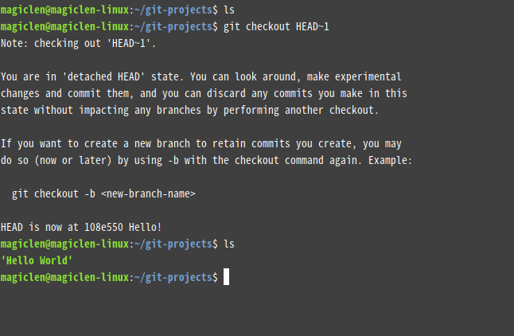
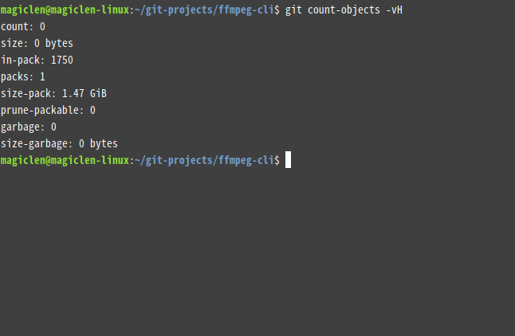
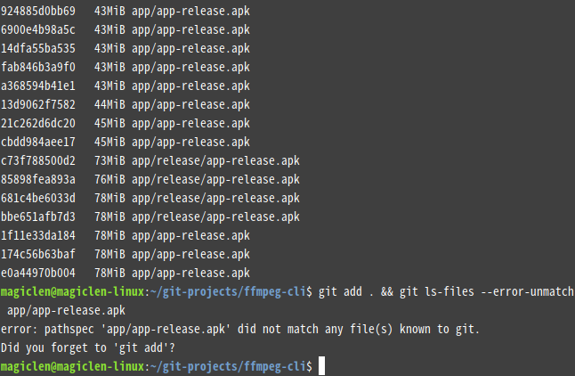
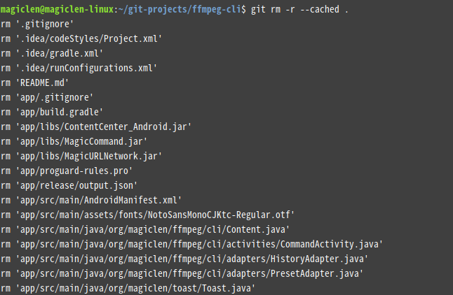
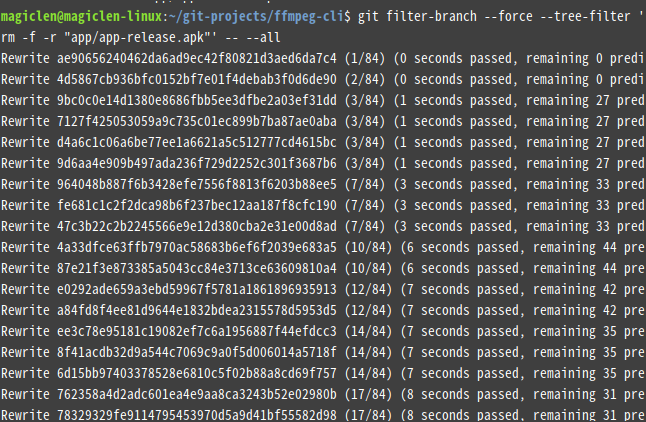

出處： https://magiclen.org/git-remove-commited-files/

在使用Git進行程式專案或是其它任何專案的版本控制時，通常會使用`.gitignore`檔案來讓Git在使用`add`將檔案納入Git的版本控制清單的時，過濾掉指定的目錄或檔案。通常這些被過濾的檔案是由專案在進行建置時所產生出來的任何檔案，以及一些使用者需要自行修改或是建立的設定檔(例如存放資料庫登入資訊的設定檔)。但我們都是人，難免會忘記把要過濾掉的檔案加進`.gitignore`中，而使得該檔案不小心被commit進我們的倉庫之中。有時候不小心commit進去的甚至是大小超過數十MB的檔案，或是一些存放著帳號密碼、金鑰等與安全性直接相關的設定檔，這可就不太妙了。

一旦Git中的大檔愈多，在進行`git clone`的時候就會變得愈來愈慢，而且GitHub、BitBucket等主流的Git遠端倉庫服務商，通常會限制倉庫中單一檔案的大小與整個倉庫的大小。

您可能會問：難道不小心commit進Git的檔案，不是直接在專案底下刪掉後，再重新commit就好了嗎？……OK，我們來做個小小的實驗吧！

假設有個專案，只有`Hello World`這個二進制檔，存在於專案的根目錄中。我們先將目前工作目錄移動到這個專案的根目錄，接著使用以下指令來初始化Git。

> git init

然後使用以下指令，將`Hello World`檔案加進Git的版本控制清單中。

> git add Hello\ World

接著使用以下指令來進行commit。

> git commit -m 'Hello!'


然後用以下指令將`Hello World`檔案從專案中刪除。

> rm Hello\ World

然後再次使用以下指令，將專案的根目錄加進Git的版本控制清單中。

> git add .

接著使用以下指令來進行commit。

> git commit -m 'Delete Hello World'


然後執行以下指令，暫時回到前一個commit時的狀態。

> git checkout HEAD~1

最後執行`ls`指令，列出目前專案根目錄底下有哪些檔案。



如上圖，看到沒？原本被我們的刪除的`Hello World`檔案又跑出來了！它根本就沒有被刪除嘛！

### 刪除Git中已經被commit的檔案

#### 顯示目前專案的Git倉庫究竟佔用了多少空間

以下指令，可以顯示目前專案的Git倉庫所佔用的檔案空間：

> git count-objects -vH

`size`欄位加上`size-pack`欄位所顯示的值就是Git倉庫所佔用的檔案空間。





如上圖，可知目前筆者這個Android專案的Git倉庫居然佔用了1.47 GiB的空間。

#### 將Git倉庫中的檔案依照大小排序並顯示出來

以下指令，可以列出目前Git倉庫中的所有檔案，並且按照檔案大小來排序：

```bash
git rev-list --objects --all | git cat-file --batch-check='%(objecttype) %(objectname) %(objectsize) %(rest)' | sed -n 's/^blob //p' | sort --numeric-sort --key=2 | cut -c 1-12,41- | $(command -v gnumfmt || echo numfmt) --field=2 --to=iec-i --suffix=B --padding=7 --round=nearest
```


[](https://img.magiclen.org/albums/git-remove-commited-files/shot-07.png)

如上圖，基本上可以看出筆者的這個Git倉庫把Android所建置出來的APK檔也加進來了，所以才會那麼肥大。

這個指令有個要注意的地方是，如果有同樣的檔案但儲存在不同的路徑，只會顯示出其中一個路徑哦！在之後要刪除的時候必須要把每個路徑的該檔案都刪除，該檔案才會真正地從Git倉庫中移除。

#### 確認要排除在Git之外的檔案，是否已經在`.gitignore`中

以下指令，可以檢查要排除在Git之外的檔案，是否已經在`.gitignore`中：

> git add . && git ls-files --error-unmatch 檔案路徑

這邊的`檔案路徑`是指檔案在Git倉庫中的路徑。




如果在執行指令後，看到螢幕上顯示：

> error: pathspec '檔案路徑' did not match any file(s) known to git.

表示目前那個檔案已經在`.gitignore`中了。

#### 將要排除在Git之外的檔案加進`.gitignore`中

Git倉庫底下的`.gitignore`檔案可以設定要排除加入的檔案或是目錄。如果您不知道怎麼設定，可以在以下這個網站搜尋到很多針對不同程式語言和IDE用的`.gitignore`模板。

> https://www.gitignore.io/

在修改完`.gitignore`後，執行以下指令來重新套用：

> git rm -r --cached .



如果有需要的話，可以立刻再重新將專案根目錄加進版本控制清單中，並再commit一次，指令如下：

> git add . && git commit -m 'update .gitignore'


#### 將已經被commit進Git倉庫的檔案刪除

以下指令，可以把已經被commit進Git倉庫的檔案或整個目錄給刪除：

> git filter-branch --force --tree-filter 'rm -f -r "檔案路徑"' -- --all

這邊的`檔案路徑`是指檔案在Git倉庫中的路徑，不支援wildcard寫法。注意這個指令會直接將有包含指定檔案的commit進行修改，而導致該commit的雜湊值以及這個commit之後的所有commit的雜湊值都會發生變化。




另外還一點要注意的是，在執行一次以上指令之後，就算有確實將指定的檔案刪除掉，再次使用這篇文章先前提到的將Git倉庫中的檔案顯示出來的指令，也可能還是會看到那個應該已經要被刪除掉的檔案仍然出現在清單中，它會在這個Git倉庫有其它變動(例如建立新的commit)後，檔案列表才會跟著刷新。

如果要立刻刷新檔案列表，可以執行以下指令：

> git filter-branch --force

#### 清除Git的Reflog並手動調用垃圾回收機制

以下指令，可以清除Git的Reflog並手動調用垃圾回收機制，來即時讓Git倉庫將可用空間釋放出來。如果並非迫切地需要釋出空間，建議不要執行這個指令。

> git reflog expire --expire=now --expire-unreachable=now --all && git gc --prune=all --aggressive

#### 覆蓋遠端的Git倉庫

若您已經不幸地將要排除在Git倉庫之外的檔案給上傳到遠端的Git倉庫，那麼就在處理好本地端的Git倉庫之後，使用以下指令來覆蓋遠端的commit吧！

> git push --force --all