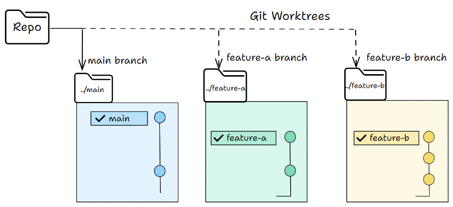
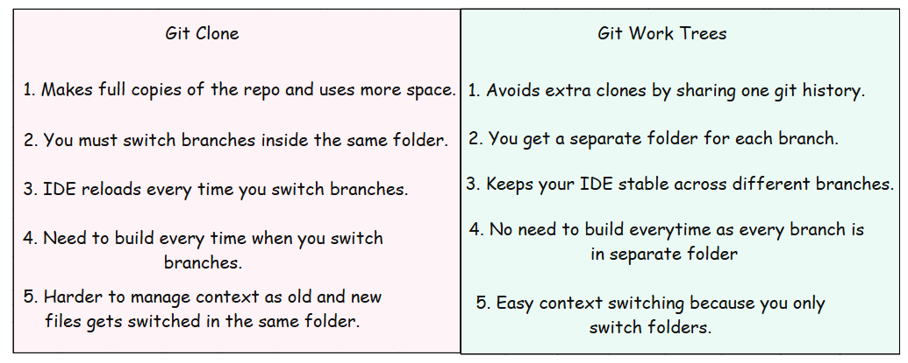
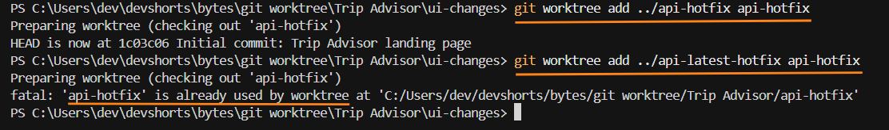
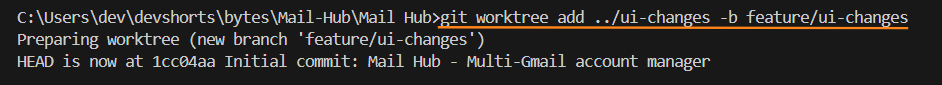
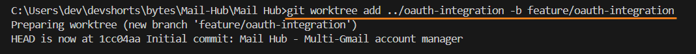
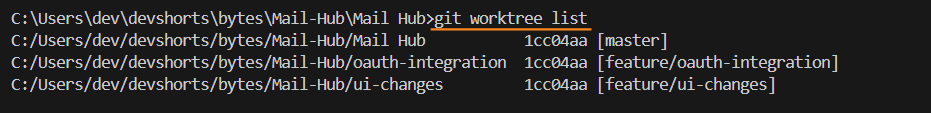
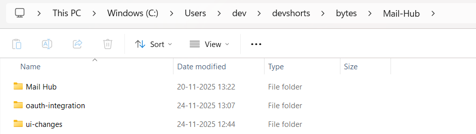
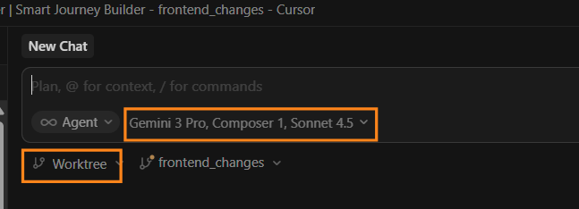
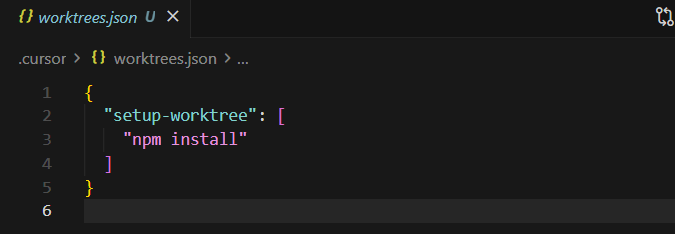
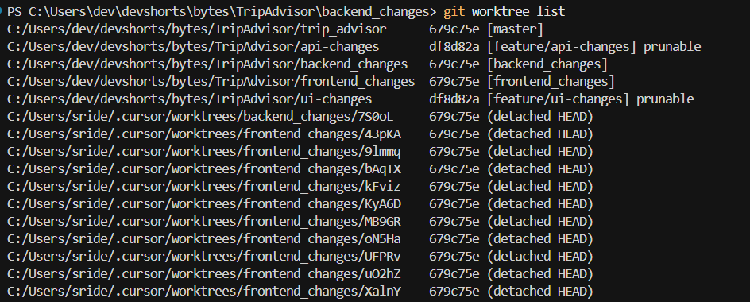

# 使用 Git Worktree 進行平行代理編程

大多數人每天都會使用 AI 代理。很多時候，我們甚至沒有注意到它。代理現在在程式設計中已經很常見，它們幫助我們完成許多任務。

我們現在正在邁向下一個基於代理編程的階段。我們可以使用平行代理，在同一個儲存庫中同時處理多個功能和修復。

Claude Code 和 Cursor 支援平行代理。它們使用 Git worktree 為每個代理提供自己的工作空間。您可以通過在專案中建立 worktree 來遵循相同的方法。

讓我們先了解什麼是 Git worktree，以及它們如何幫助平行編程。

## 大綱

1. 什麼是 Git worktree
2. Git worktree 與 Git Clone 的比較
3. Git worktree 指令
4. Claude Code 的 Git worktree 平行代理
5. Cursor 的 Git worktree 平行代理
6. CodeRabbit 的 Git worktree runner

## 什麼是 Git worktree

[Git worktree](https://git-scm.com/docs/git-worktree) 是 Git 中的一項功能。在我們了解 Git worktree 之前，讓我們先看看一般的 Git 流程。

- 您有一個工作目錄。
- 您有一個作用中的分支。
- 切換分支會改變該目錄中的所有檔案

```
my-app/
├── src/
├── README.md
└── .git/
```

當您執行 `git checkout "feature-abc"` 時，整個目錄會切換到該分支。

- Worktree 讓您可以從同一個儲存庫擁有多个工作目錄。
- 每個目錄可以有自己的分支。
- 您可以同時在所有這些目錄中工作，而無需切換任何東西。

> 簡單來說，您可以在不切換分支的情況下平行工作。

```
my-app/                    
├── src/
├── README.md
└── .git/

my-app-feature-a/          ← Worktree 1 (feature-a 分支)
├── src/
├── README.md
└── .git                   ← 檔案指向主儲存庫

my-app-feature-b/          ← Worktree 2 (feature-b 分支)
├── src/
├── README.md
└── .git                   ← 檔案指向主儲存庫
```



上圖解釋了這個概念。但指令會讓它更加清晰。

這是我們在一般克隆和使用 work tree 時所做的比較。



## Git worktree 指令

以下是您會經常使用的一些基本 Git worktree 指令。

```bash
# 建立 worktree 和新分支
git worktree add <worktree路徑> -b <新分支名稱>

# 範例
git worktree add ../add-header -b feature/add-header


# 從現有分支建立 worktree
git worktree add <worktree路徑> <分支名稱>

# 範例
git worktree add ../ui-changes feature/ui-changes
```

```bash
# 列出所有作用中的 worktree
git worktree list
```

```bash
# 移除 worktree
git worktree remove <worktree路徑>

# 範例
git worktree remove ../add-header
```

Git 對 worktree 有一個簡單的規則：一個分支只能同時存在於一個 worktree 中。

如果分支已經在某個 worktree 中使用，Git 會阻止您再次使用它。請參見下圖。



## Claude Code 的平行代理

當您使用 Git worktree 時，[Claude Code 可以執行平行代理](https://code.claude.com/docs/en/common-workflows#run-parallel-claude-code-sessions-with-git-worktrees)。每個 worktree 都有自己獨立的目錄和分支，因此 Claude 可以同時處理多個任務。

當時我正在建立一個個人使用的 Gmail 郵件中心。同時有 UI 變更和 OAuth 工作在進行。

以下是我如何使用 Claude Code 搭配 worktree 同時建立兩個功能。

```bash
git worktree add ../ui-changes -b feature/ui-changes
```



```bash
git worktree add ../oauth-integration -b feature/oauth-integration
```



建立它们之後，我列出 worktree 以確保一切都設定正確：



您也可以查看每個分支的獨立目錄。



現在 Claude Code 可以在這些分支上工作，而無需切換，因為我們有獨立的目錄。

我使用 Claude Code 透過 worktree 同時處理 UI 變更和 OAuth 整合。

下面的影片展示了它如何即時運作。

## Cursor 的平行代理

Cursor 讓您可以輕鬆地透過在背景[使用 Git worktree](https://cursor.com/docs/configuration/worktrees) 來執行平行代理。

您可以先選擇一個 worktree 並為同一任務選擇多個模型，如下圖所示。Cursor 將同時在所有選定的模型上執行相同的提示。



提交提示後，Cursor 會為每個模型顯示一張卡片。您可以點擊這些卡片，查看每個模型如何變更程式碼。

當您喜歡某個版本時，可以點擊 [Apply](https://cursor.com/docs/configuration/worktrees#apply-functionality)。Cursor 會將那些編輯帶入您已checkout 的分支。

您也可以透過編輯 `.cursor/worktrees.json` 檔案來自訂 worktree。

您在 setup-worktree 下新增的所有指令將在設定期間在 worktree 內執行。



您隨時可以透過執行 `git worktree list` 來查看所有作用中的 worktree。如果想在 SCM 面板中查看 Cursor 建立的 worktree，可以啟用 `git.showCursorWorktrees` 設定。



## CodeRabbit 的 Git Worktree Runner

如果您想要更簡單的方式來處理 worktree，CodeRabbit 提供了一個名為 Git Worktree Runner 的輔助工具。它讓建立、開啟和管理 worktree 變得容易，透過簡短的指令。如果您經常使用 worktree，這個工具可以節省大量打字時間。

您可以在這裡找到它：[CodeRabbit 的 Git Worktree Runner](https://github.com/coderabbitai/git-worktree-runner)

以下是安裝和使用方法。

```bash
# 安裝
git clone https://github.com/coderabbitai/git-worktree-runner.git
cd git-worktree-runner
sudo ln -s "$(pwd)/bin/git-gtr" /usr/local/bin/git-gtr

# 使用方式
cd ~/your-repo                              # 導航到 git 儲存庫
git gtr config set gtr.editor.default cursor    # 一次性設定
git gtr config set gtr.ai.default claude        # 一次性設定

# 日常工作流程
git gtr new my-feature                          # 建立 worktree
git gtr editor my-feature                       # 在編輯器中開啟
git gtr ai my-feature                           # 啟動 AI 工具
git gtr rm my-feature                           # 完成後移除
```

這張表格快速比較了 Git worktree 指令和相應的 gtr 指令。

## 實際操作範例

### 傳統工作流程的痛點

```bash
# 情境：同時開發兩個功能
# 傳統做法：來回切換分支

cd myapp
git checkout feature/auth      # 切到 auth 分支
# ... 做 auth 工作 ...
git checkout feature/ui         # 切回 ui 分支  
# ... 做 ui 工作 ...
git checkout feature/auth      # 又要切回 auth
# → 每次切換都會改動目錄中的所有檔案
# → 可能遇到 stash/unstash 的麻煩
# → 編輯器也需要重新載入專案
```

### Worktree 的做法

```bash
# 一次建立，永久隔離

# 主專案 (假設在 myapp/)
cd myapp

# 建立第一個 worktree 做 auth
git worktree add ../myapp-auth -b feature/auth

# 建立第二個 worktree 做 ui  
git worktree add ../myapp-ui -b feature/ui

# 查看所有 worktree
git worktree list
# 輸出:
# /path/to/myapp             (HEAD -> main)
# /path/to/myapp-auth        (feature/auth)
# /path/to/myapp-ui          (feature/ui)
```

### 平行終端機操作示意

```bash
# 終端機 1: 在 auth worktree 工作
cd ../myapp-auth
git status        # 只看到 auth 相關的變更
npm test          # 跑 auth 測試

# 終端機 2: 在 ui worktree 工作 (完全獨立)
cd ../myapp-ui
git status        # 只看到 ui 相關的變更
npm test          # 跑 ui 測試

# 兩個終端機同時運行，互不干擾！
```

### 整合 AI 代理實戰

```bash
# 讓 Claude Code 在獨立的 worktree 中工作

# 終端 1: Claude 處理 auth
cd ../myapp-auth
claude "實作 OAuth2 登入功能"

# 終端 2: Claude 處理 ui
cd ../myapp-ui  
claude "更新登入頁面的 UI"
```

### 完成後的合併流程

```bash
# 假設兩個功能都完成了
# 回到主專案
cd myapp

# 合併 auth
git merge feature/auth

# 合併 ui
git merge feature/ui

# 清理不需要的 worktree
git worktree remove ../myapp-auth
git worktree remove ../myapp-ui

# 刪除已合併的分支
git branch -d feature/auth
git branch -d feature/ui
```

---

## Worktree 的核心優點

| 維度 | 無 Worktree | 有 Worktree |
|------|-------------|-------------|
| **分支切換** | `git checkout` 替換整個目錄 | 各 worktree 獨立 |
| **同時工作** | 只能一個分支 | 多個分支同時 |
| **狀態污染** | 切換時需 stash/reset | 完全隔離 |
| **AI 代理整合** | 共享空間會衝突 | 每個代理獨立目錄 |
| **測試隔離** | 混在一起 | 各自乾淨環境 |

---

## 什麼情況下特別有感？

### 情境 1: 同時修 Bug + 做功能

```bash
# 正在開發新功能，突然發現 production bug
# 傳統做法：stash 目前工作 → 切分支修 bug → merge → unstash
# Worktree 做法：

# 直接開一個 worktree 修 bug
git worktree add ../hotfix -b hotfix/critical-login-bug

# 在 hotfix worktree 快速修復
cd ../hotfix
# ... fix the bug ...

# 主目錄完全不受影響，繼續開發新功能
cd ../myapp
git status  # 乾淨的 working directory
```

### 情境 2: Code Review 時對照

```bash
# 需要 review 同事的 PR，同時做自己的工作
git worktree add ../review-pr-123 -b review/pr-123

# review-pr-123 可以看程式碼
cd ../review-pr-123
git log --oneline -10
# 自己分支完全不動
```

### 情境 3: 大型重構測試

```bash
# 重構核心模組，怕搞砸
git worktree add ../refactor-core -b refactor/core-module

# 在 refactor 分支大刀闊斧
# 主分支隨時可以切過去看舊版對比
```

### 情境 4: 平行代理編程 (本文重點)

```bash
# Claude Code + Cursor + Gemini 同時在同個 repo 工作
# 每個 AI 獨立目錄，不會覆蓋彼此的檔案

git worktree add ../agent-1 -b feature/part-a
git worktree add ../agent-2 -b feature/part-b
git worktree add ../agent-3 -b feature/part-c

# 每個終端機啟動一個 AI
# agent-1: "實作登入 API"
# agent-2: "實作使用者資料模組"  
# agent-3: "實作通知服務"
```

---

## 與 CodeRabbit Git Worktree Runner 整合

```bash
# 使用 gtr 簡化日常工作

# 設定一次
git gtr config set gtr.editor.default cursor
git gtr config set gtr.ai.default claude

# 快速建立 worktree
git gtr new auth-feature
# 等同於: git worktree add ../auth-feature -b feature/auth

# 在編輯器開啟
git gtr editor auth-feature

# 啟動 AI 幫你寫 code
git gtr ai auth-feature

# 完成後移除
git gtr rm auth-feature
# 等同於: git worktree remove ../auth-feature && git branch -d feature/auth
```

---

## 常見問題與解決方案

### Q: 分支已經被使用？

```bash
# Git 拒絕你，因為該分支已在某 worktree 中
git worktree add ../test -b feature/same-branch
# 輸出: fatal: 'feature/same-branch' is already being used by worktree at '/path/to/other'

# 解決方案：建立新分支
git worktree add ../test -b feature/same-branch-copy
```

### Q: 需要同步多個 worktree 的依賴？

```bash
# 每個 worktree 需要各自安裝依賴
cd ../myapp-auth && npm install
cd ../myapp-ui && npm install

# 或者寫腳本一次搞定
for wt in ../myapp-*; do
  (cd "$wt" && npm install)
done
```

### Q: 主分支落後了？

```bash
# 在主 worktree 更新
cd myapp
git fetch origin
git merge origin/main

# 其他 worktree 不受影響
# 各分支 maintainer 自行決定何時 merge main
```

---

## 結語

我們探討了 Git worktree 以及它們如何幫助平行代理編程。

Worktree 讓您可以同時建立多個功能，而無需切換分支或建立額外的克隆。

像 Claude Code、Cursor 這樣的工具讓它變得更好，它們將每個代理連結到自己的 worktree。這樣可以保持工作整潔、安全、快速。

一旦您開始使用 worktree，就很回到舊的單一目錄流程了。您將獲得更多專注、更快的速度，以及更少的錯誤。嘗試為您的下一個專案建立一些 worktree，看看同時處理多個功能是多麼簡單。

如果您使用任何基於代理的編碼工具，worktree 將成為您日常工作中很自然的一部分。

現在就試試看，讓我知道它如何幫助您的工作流程！

祝您學習愉快！

感謝您閱讀 Dev Shorts！這篇文章是公開的，所以請自由分享。

[分享](https://www.devshorts.in/p/coding-with-parallel-agents-and-git?utm_source=substack&utm_medium=email&utm_content=share&action=share)
