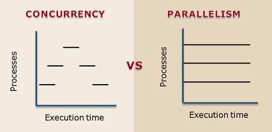

# 程序(進程)、執行緒(線程)、協程，傻傻分得清楚！

要成為一個優秀的軟體工程師，進程（process）、線程（thread）是一定要搞懂與掌握的知識點，不僅是因為它們是電腦科學根本的知識，更是因為懂得在適當的時機善用它們，可以增進程式的執行效率，也就是提升效能。

## 程式 Program

在瞭解進程與線程之前，得先談談 program 這個東西，其實所謂的 program 就是工程師撰寫的程式碼的集合，例如 Line、 Chrome 就個別是 program，而他們的特點是**還沒有被執行**，因此也就還沒有被載入至記憶體中，而是存放在[次級儲存裝置](https://zh.wikipedia.org/wiki/次級儲存裝置)中。

## 進程 Process

**Process 進程則是指被執行且載入記憶體的 program****。**Process 也是 OS 分配資源的最小單位，可以從 OS 得到如 CPU Time、Memory…等資源，意思是這個 process 在運行時會消耗多少 CPU 與記憶體。文章一開始放了一張 MacOS 活動監視器的截圖，相信不管是使用哪種作業系統的讀者都有看過類似的介面，而監視器中列出的是你的電腦正在執行的應用程式，而它們其實就是一個個 process，可以從圖片中看出每一個 process 消耗的 CPU、CPU 時間與每個 process 的獨立 ID (PID)。

## 進程的優缺點與小結

- 優點：每個進程有自己獨立的系統資源分配空間，不同進程之間的資源不共享，因此不需要特別對進程做互斥存取的處理。
- 缺點：建立進程以及進程的上下文切換（Context Switch）都較消耗資源，進程間若有通訊的需求也較為複雜。

小結：程式 (Program)是寫好尚未執行的 code，程式被執行後才會變成進程 (Process)。

## 線程 Thread

線程可以想像成存在於 process 裡面，而一個進程裡至少會有一個線程，前面有說 process 是 OS 分配資源的最小單位，而 thread 則是作業系統能夠進行運算排程的最小單位，也就是說實際執行任務的並不是進程，而是進程中的線程，一個進程有可能有多個線程，其中多個線程可以共用進程的系統資源，可以把進程比喻為一個工廠，線程則是工廠裡面的工人，負責任務的實際執行。

## MultiProcessing 多進程 & MultiThreading 多線程

這兩個概念我想繼續利用工廠與工人的比喻會比較好理解與記憶。

Multiprocessing 好比建立許多工廠（通常會取 CPU 的數量），每個工廠中會分配ㄧ名員工(thread)執行工作，因此優勢在於同一時間內可以完成較多的事。

Multithreading 則是將許多員工聚集到同一個工廠內，它的優勢則是**有機會讓相同的工作在比較短的時間內完成。**

## 多線程的 Race Condition

剛剛有提到在多執行緒中 (Multithreading)，不同 thread 是可以共享資源的，而若兩個 thread 若同時存取或改變全域變數，可能會發生同步 (Synchronization) 問題。若執行緒之間互搶資源，則可能產生死結 (Deadlock)，因此使用多線程時必須特別注意避免這些狀況發生。

## Concurrent & Parallel 並發與並行

這兩個是許多人容易誤解的概念，然而透過上面的圖就可以一目瞭然，Parallel 並行是利用多個 CPU 達到同時並行處理任務的需求（也就是同一個時間點有許多任務在同時執行），Concurrent 則是許多任務在爭搶同一個 CPU 的資源，因此一個時間點只會有一個任務正在執行，只是因為切換非常快，使用者通常不會感覺到任務實際上一直在切換。

## 協程 Coroutine

大部分的文章討論的都是 process 與 thread 的概念，直到最近在學 golang，碰到了 goroutine，才知道原來還有 coroutine 協程的存在。

先講重點

> 協程是一種使用者態的輕量級執行緒，協程的排程完全由使用者控制。

可以想像進程中有線程，而線程中則又有協程。***而協程的調度完全由用戶控制\***，協程也會有自己的 registers、context、stack 等等，並且由協程的調度器來控制目前由哪個協程執行，哪個協程要被 block 。process 及 thread 的調度，是由 CPU 內核去進行調度，而協程卻不ㄧ樣，OS 甚至不知道協程的存在，如果 coroutine 被卡住，則會在用戶端直接切換另外一個 coroutine 給此 thread 繼續執行，這樣其他 coroutine 就不會被block住，讓資源能夠有效的被利用，藉此實現 Concurrent 的概念。

相較於建立一個線程需要花費 MB 等級的記憶體，建立一個協程可以壓到 KB 等級，協程間的切換也絕對快於線程間的切換。

如果有興趣，真的非常推薦去學[ Go 語言的 goroutine](https://gobyexample.com/goroutines)，相信你也會被它的強大給深深吸引的。

## 小結

透過這篇文章快速帶過進程、線程、協程的概念，然而實際上要使用多進程、多線程開發時要考慮的因素真的很多，一不小心可能會造成上面提過的 race condition 或是性能不升反降的囧境，因此在使用上仍須經過謹慎考慮與效能驗證囉！

## 補充：名詞對照

其實本篇文章所提及的進程與線程都是對岸的用語，為了避免讀者誤解，下面整理了一些臺灣與對岸的名詞對照表：

process:

- 臺灣：程序、處理程序
- 對岸：進程

thread:

- 臺灣：執行緒
- 對岸：線程

concurrent:

- 臺灣：並行
- 大陸：並發

parallel:

- 臺灣：平行
- 大陸：並行

可以看到兩個地區對並行的定義是不一樣的，因此建議讀者已英文記比較不會搞混喔～

## 出處

https://oldmo860617.medium.com/%E9%80%B2%E7%A8%8B-%E7%B7%9A%E7%A8%8B-%E5%8D%94%E7%A8%8B-%E5%82%BB%E5%82%BB%E5%88%86%E5%BE%97%E6%B8%85%E6%A5%9A-a09b95bd68dd

