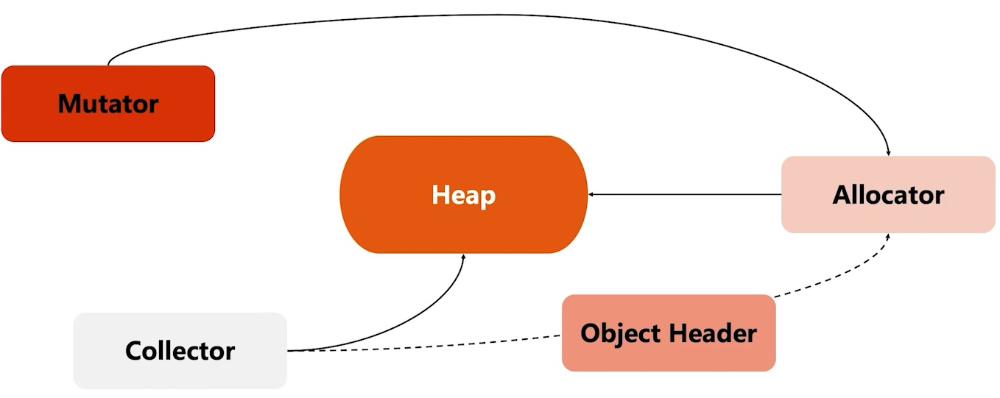
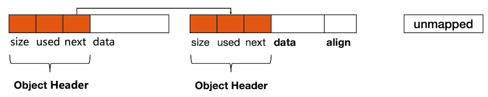
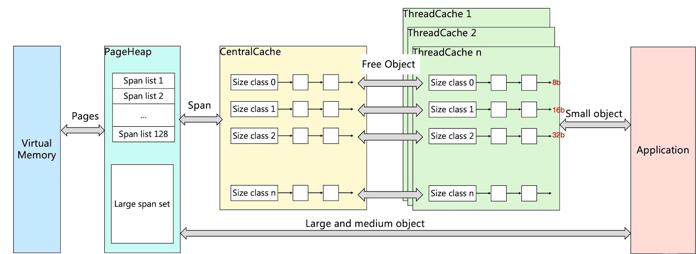
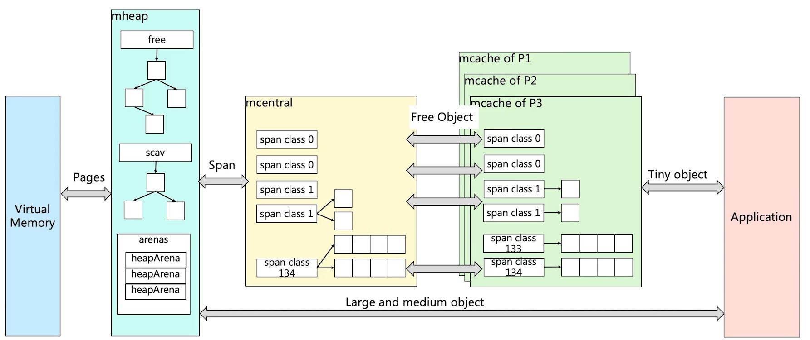
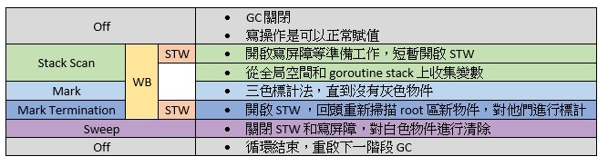

# Go Runtime 完整指南

本指南整合了 Go Runtime 的核心概念、記憶體管理機制、垃圾回收原理、網路 I/O 模型，以及使用 GDB 調試 Runtime 內部的實戰技巧，為讀者提供一份從概念到實踐的完整參考資料。

---

## 目錄

- [第一章：Runtime 總覽](#第一章runtime-總覽)
  - [什麼是 Go Runtime？](#什麼是-go-runtime)
  - [Runtime 的核心組件](#runtime-的核心組件)
  - [Runtime 的生命周期](#runtime-的生命周期)
  - [Runtime 的來源和形式](#runtime-的來源和形式)
  - [Runtime 和編譯器的關係](#runtime-和編譯器的關係)
  - [編譯和連結的完整流程](#編譯和連結的完整流程)
  - [查看 Runtime 信息](#查看-runtime-信息)
- [第二章：調度器](#第二章調度器)
  - [G-M-P 三層模型](#g-m-p-三層模型)
  - [關鍵數據結構](#關鍵數據結構)
  - [調度相關 Runtime 函數](#調度相關-runtime-函數)
  - [Runtime 原始碼檔案結構](#runtime-原始碼檔案結構)
  - [核心檔案學習順序建議](#核心檔案學習順序建議)
- [第三章：記憶體管理與分配](#第三章記憶體管理與分配)
  - [記憶體管理的爭論](#記憶體管理的爭論)
  - [Heap 記憶體管理的挑戰](#heap-記憶體管理的挑戰)
  - [Heap 記憶體管理](#heap-記憶體管理)
  - [TCMalloc](#tcmalloc)
  - [Golang 記憶體分配](#golang-記憶體分配)
  - [Runtime 中的記憶體管理概述](#runtime-中的記憶體管理概述)
  - [性能優化技巧](#性能優化技巧)
- [第四章：垃圾回收 GC](#第四章垃圾回收-gc)
  - [GC 概述](#gc-概述)
  - [常見記憶體回收策略](#常見記憶體回收策略)
  - [Golang GC 工作流程](#golang-gc-工作流程)
  - [三色標記法](#三色標記法)
  - [Golang 垃圾回收觸發機制](#golang-垃圾回收觸發機制)
  - [GC 相關 Runtime 函數](#gc-相關-runtime-函數)
  - [Runtime 原始碼中的 GC 檔案](#runtime-原始碼中的-gc-檔案)
- [第五章：網路與 I/O](#第五章網路與-io)
  - [網路 IO](#網路-io)
  - [文件 IO](#文件-io)
  - [系統調用的特殊處理](#系統調用的特殊處理)
  - [Channel 和同步原語](#channel-和同步原語)
  - [Panic 和 Recover](#panic-和-recover)
- [第六章：GDB 調試 Runtime 內部](#第六章gdb-調試-runtime-內部)
  - [快速開始](#快速開始)
  - [調試用程式說明](#調試用程式說明)
  - [GDB 基本操作](#gdb-基本操作)
  - [關鍵 Runtime 函數斷點](#關鍵-runtime-函數斷點)
  - [完整調試流程示範](#完整調試流程示範)
  - [實用技巧](#實用技巧)
- [附錄：重要設計文件與資源](#附錄重要設計文件與資源)
- [附錄：參考資料](#附錄參考資料)

---

## 第一章：Runtime 總覽

本章從全局視角介紹 Go Runtime 的定義、組成以及它在程式生命周期中扮演的角色，為後續各章的深入探討奠定基礎。

### 什麼是 Go Runtime？

Go Runtime 是 Go 語言的執行時系統，負責在操作系統和用戶代碼之間進行交互。它是一個內嵌在每個 Go 程序中的系統層，提供語言運行所需的基礎設施。

### Runtime 的核心組件

| 組件 | 作用 |
|------|------|
| Scheduler | 管理 goroutine 的執行和切換 |
| GC | 自動回收不使用的內存 |
| Memory Manager | 分配和管理內存 |
| Networking | 支持高效的網絡 IO |
| Synchronization | 提供 channel、mutex 等同步原語 |

Go Runtime 的設計使得開發者可以輕鬆編寫高效的並發程序，而不需要手動管理線程和內存。

### Runtime 的生命周期

#### 程序啟動

```
1. 操作系統加載可執行檔案
2. 執行引導代碼（bootstrap code）
3. 初始化 runtime
   - 初始化全局變量
   - 啟動 GC 工作線程
   - 初始化調度器
4. 執行 init() 函數
5. 執行 main() 函數
```

#### 程序運行

```
Runtime 在後台運行：
├─ Scheduler：調度 goroutine 執行
├─ GC：定期掃描堆內存
├─ Signal handler：處理操作系統信號
└─ Timer：管理 time.Timer 和 time.Ticker
```

#### 程序退出

```
1. main() 函數返回
2. defer 語句執行（逆序）
3. goroutine 逐個終止
4. GC 最後一次運行
5. 釋放所有資源
6. 進程退出
```

### Runtime 的來源和形式

在源碼層面，**Go Runtime 是用 Go 和 C 混寫的代碼**，存在 Go 標準庫的 `runtime` 包中。當你編譯 Go 程序時，Runtime 會被**靜態連結進去**，最終成為可執行檔案的一部分。

**Runtime 不是一個獨立的執行檔案**，而是代碼和數據結構的集合，包括：
- 調度器（Scheduler）
- 垃圾回收器（GC）
- 內存管理器
- goroutine 管理
- Channel 實現
- 同步原語實現
- 異常處理

### Runtime 和編譯器的關係

#### 編譯器的職責

- 將 Go 源碼編譯成機器碼
- 識別 `go` 語句，生成對 `runtime.newproc` 的調用
- 插入棧溢出檢查代碼
- 插入邊界檢查代碼

#### Runtime 的職責

- 執行調度算法
- 管理內存和垃圾回收
- 處理並發原語（channel、mutex）
- 處理異常和恢復

### 編譯和連結的完整流程

#### 三個關鍵階段

```
Go 源碼文件                    Runtime 源碼
    │                            │
    │  (runtime 包在標準庫中)     │
    │                            │
    └────────────┬───────────────┘
                 │
            ┌────▼──────────────────┐
            │   編譯器 (go build)    │
            │  - 編譯用戶代碼         │
            │  - 編譯 runtime 代碼    │
            │  - 生成目標文件         │
            └────┬──────────────────┘
                 │
            ┌────▼────────────────────────┐
            │   目標文件 (.o)             │
            │  - 用戶代碼的機器碼          │
            │  - Runtime 的機器碼          │
            │  - 標準庫的機器碼            │
            └────┬─────────────────────────┘
                 │
            ┌────▼──────────────────┐
            │   Linker（連結器）    │
            │  - 連結所有目標文件    │
            │  - 連結 runtime       │
            │  - 解析符號引用        │
            │  - 生成最終可執行檔案  │
            └────┬──────────────────┘
                 │
       ┌─────────▼──────────────────────────┐
       │   可執行檔案（自包含）              │
       │  ┌──────────────────────────────┐ │
       │  │ 用戶代碼的機器碼              │ │
       │  ├──────────────────────────────┤ │
       │  │ Go Runtime 的機器碼           │ │
       │  │ - Scheduler                   │ │
       │  │ - GC                          │ │
       │  │ - Memory Manager              │ │
       │  │ - goroutine 管理              │ │
       │  │ - Channel 實現                │ │
       │  ├──────────────────────────────┤ │
       │  │ 標準庫的機器碼                │ │
       │  │ (fmt, io, sync 等)            │ │
       │  ├──────────────────────────────┤ │
       │  │ 其他必要資源                  │ │
       │  └──────────────────────────────┘ │
       └────────────────────────────────────┘
```

#### 階段 1：編譯（go build）

**輸入**：Go 源碼文件 + Runtime 源碼

**處理**：
- 編譯器分別編譯用戶代碼和 runtime 代碼
- 每個 Go 文件（`.go`）都被編譯成目標文件（`.o`）
- Runtime 中的 C 代碼也被編譯成機器碼

**輸出**：多個目標文件，包含編譯後的機器碼

```bash
$ go build myprogram.go

# 在編譯過程中，編譯器會：
# 1. 編譯 myprogram.go → myprogram.o
# 2. 編譯 runtime/*.go → runtime_*.o
# 3. 編譯 runtime/*.c → runtime_*.o
# 4. 編譯標準庫 → stdlib_*.o
```

#### 階段 2：連結（Linker）

**輸入**：所有目標文件和庫文件

**處理**：
- 將所有 `.o` 文件中的代碼和數據合併
- 解析符號引用（Symbol Resolution）
- 重定位地址（Relocation）
- 創建可執行檔案頭部

**輸出**：單個可執行檔案

#### 階段 3：結果 - 自包含的可執行檔案

最終生成的可執行檔案包含：

1. **用戶代碼** - 你寫的所有函數和邏輯
2. **Go Runtime** - 核心部分，包括：
   - Scheduler（調度器）
   - GC（垃圾回收器）
   - Memory Manager（內存管理）
   - goroutine 管理機制
   - Channel 實現
3. **標準庫** - fmt、io、sync 等所有依賴的包
4. **元數據和資源** - 符號表、重定位信息等

#### 為什麼是靜態連結？

Go 選擇靜態連結而不是動態連結的原因：

1. **跨平台部署**：生成的二進制可以直接在目標系統運行，不需要安裝依賴
2. **性能**：避免動態連結的開銷，啟動更快
3. **簡化分發**：只需分發一個檔案，使用者無需配置環境
4. **版本穩定性**：不會因為系統庫版本不同而導致問題

#### 驗證靜態連結

你可以用以下命令查看編譯結果：

```bash
# 檢查檔案類型和依賴
$ file ./myprogram
./myprogram: ELF 64-bit LSB executable, x86-64, version 1 (GNU/Linux),
statically linked, Go BuildID=...

# 查看動態依賴（如果有的話）
$ ldd ./myprogram
    not a dynamic executable

# 查看檔案大小（包含 runtime）
$ ls -lh ./myprogram
-rwxr-xr-x 1 user group 5.2M Nov 26 12:34 myprogram

# 檢查編譯時包含的 runtime 信息
$ strings ./myprogram | grep "runtime\." | head -20
```

#### Runtime 在編譯過程中的集成

```
┌────────────────────────────────────────────┐
│      編譯器看到的 Go 代碼                    │
├────────────────────────────────────────────┤
│                                            │
│  package main                              │
│                                            │
│  func main() {                             │
│      go doWork()  ◄── 識別 go 語句         │
│      time.Sleep(1 * time.Second)           │
│  }                                         │
│                                            │
│  func doWork() { ... }                     │
│                                            │
└────────────────────────────────────────────┘
                    │
                    │ 編譯器處理
                    │
                    ▼
┌────────────────────────────────────────────┐
│         生成的機器碼（偽代碼）              │
├────────────────────────────────────────────┤
│                                            │
│  main:                                     │
│      ... 初始化代碼 ...                    │
│      call runtime.newproc  ◄── 創建 G    │
│      ... sleep 代碼 ...                    │
│                                            │
│  doWork:                                   │
│      ... 函數體 ...                        │
│                                            │
│  runtime.newproc:       ◄── Runtime 代碼  │
│      ... scheduler 代碼 ...                │
│      ... 管理 goroutine ...                │
│                                            │
└────────────────────────────────────────────┘
```go

#### 實際編譯例子

```go
// main.go
package main

import "fmt"

func main() {
    go func() {
        fmt.Println("Hello from goroutine")
    }()

    fmt.Println("Hello from main")
}
```

編譯時會發生：

```bash
$ go build main.go

1. 編譯階段（go build）：
   - 編譯 main.go：
     * 編譯 main() 函數
     * 識別 go func(){...}，生成 runtime.newproc 調用

   - 編譯 fmt 包：
     * 編譯所有 fmt 函數

   - 編譯 runtime：
     * 編譯 scheduler（newproc、schedule 等）
     * 編譯 GC
     * 編譯 memory allocator
     * 編譯所有 runtime 包的代碼

   輸出：多個 .o 目標文件

2. 連結階段（Linker）：
   - 合併所有 .o 目標文件
   - 解析符號引用：
     * fmt.Println → fmt 包中的實現
     * newproc → runtime.newproc 的實現
   - 重定位地址
   - 生成可執行檔案

   輸出：main（可執行檔案，約 3-6 MB）
```go

### 查看 Runtime 信息

```go
package main

import (
    "fmt"
    "runtime"
)

func main() {
    // 獲取運行時信息
    var m runtime.MemStats
    runtime.ReadMemStats(&m)

    fmt.Printf("Goroutines: %d\n", runtime.NumGoroutine())
    fmt.Printf("Memory Alloc: %v MB\n", m.Alloc/1024/1024)
    fmt.Printf("GC Runs: %d\n", m.NumGC)
    fmt.Printf("GOMAXPROCS: %d\n", runtime.GOMAXPROCS(-1))
}
```

---

## 第二章：調度器

Go 的調度器是 Runtime 中最核心的組件之一，它透過 G-M-P 三層模型實現了高效的並發調度。本章深入剖析調度器的設計原理、關鍵數據結構，以及 Runtime 原始碼中的相關檔案。

### G-M-P 三層模型

**目的**：管理 goroutine 的執行，實現並發編程模型。

**三層模型（G-M-P）**：
- **G（Goroutine）**：輕量級線程，用戶創建的並發任務
- **M（Machine）**：映射到操作系統線程，執行實際代碼
- **P（Processor）**：邏輯處理器，每個 P 管理一個本地 goroutine 隊列

**調度策略**：
- Work-stealing 算法：空閒的 P 會從其他 P 的隊列中竊取任務
- 協作式調度：goroutine 在系統調用、IO 操作或明確讓出時觸發調度
- 搶佔式調度（1.14+）：定期檢查點強制調度

```
┌─────────────────────────────────────────────┐
│              Go 程序                         │
├─────────────────────────────────────────────┤
│  Go Code                                    │
│  ├─ go func1() ──┐                          │
│  ├─ go func2() ──┼─→ G (Goroutines)        │
│  └─ go func3() ──┘                          │
├─────────────────────────────────────────────┤
│  Scheduler                                  │
│  ├─ P0 [G1, G2, G3, ...]                   │
│  ├─ P1 [G4, G5, ...]                       │
│  └─ P2 [...]                               │
├─────────────────────────────────────────────┤
│  OS Threads (M)                             │
│  ├─ M0 ─→ 執行 P0 的 goroutine             │
│  ├─ M1 ─→ 執行 P1 的 goroutine             │
│  └─ M2 ─→ 執行 P2 的 goroutine             │
├─────────────────────────────────────────────┤
│  操作系統                                    │
└─────────────────────────────────────────────┘
```go

### 關鍵數據結構

#### G（Goroutine）結構體

```go
type g struct {
    stack       stack           // goroutine 的棧空間
    stackguard0 uintptr         // 棧溢出檢查
    m           *m              // 關聯的 M
    goid        uint64          // goroutine ID
    waiting     *sudog          // 阻塞在 channel 或 lock 上
    waitreason  waitReason      // 等待原因
    status      uint32          // goroutine 狀態
    // ... 更多字段
}
```

**Goroutine 狀態**：
- Gidle：未使用
- Grunnable：等待運行
- Grunning：正在運行
- Gsyscall：執行系統調用
- Gwaiting：阻塞（IO、channel、lock）
- Gdead：已終止

#### M（Machine）結構體

```go
type m struct {
    p           puintptr        // 關聯的 P
    curg        *g              // 當前執行的 G
    id          int64
    procid      uint64          // 操作系統線程 ID
    // ... 更多字段
}
```go

#### P（Processor）結構體

```go
type p struct {
    id          int32
    runq        [256]guintptr   // 本地隊列
    runnext     guintptr        // 下一個要運行的 G
    // ... 更多字段
}
```

### 調度相關 Runtime 函數

```go
runtime.Gosched()           // 讓出 CPU，允許其他 goroutine 運行
runtime.NumGoroutine()      // 獲取當前 goroutine 數量
runtime.GOMAXPROCS(n)       // 設置最大 P 數量
runtime.LockOSThread()      // 將當前 goroutine 綁定到 OS 線程
runtime.UnlockOSThread()    // 解除綁定
```

### Runtime 原始碼檔案結構

Runtime 原始碼路徑：
```
/home/shihyu/go/src/runtime/
```

本目錄包含約 507 個 Go 原始碼檔案，以及多個子目錄。以下是核心關鍵檔案的分類介紹。

#### 一、核心結構與型別定義

##### runtime2.go (核心資料結構)
- **路徑**: `/home/shihyu/go/src/runtime/runtime2.go`
- **說明**: 定義 runtime 最核心的資料結構
- **包含內容**:
  - `g` (goroutine) 結構體定義
  - `m` (machine/OS thread) 結構體定義
  - `p` (processor) 結構體定義
  - goroutine 狀態常數 (_Gidle, _Grunnable, _Grunning, _Gsyscall 等)
  - 各種核心型別和常數定義

##### type.go
- **路徑**: `/home/shihyu/go/src/runtime/type.go`
- **說明**: 型別系統的 runtime 表示

#### 二、排程器 (Scheduler)

##### proc.go (核心排程邏輯)
- **路徑**: `/home/shihyu/go/src/runtime/proc.go`
- **說明**: goroutine 排程器的核心實作
- **關鍵功能**:
  - goroutine 的建立、執行、停止
  - M-P-G 排程模型實作
  - Work-stealing 演算法
  - 系統呼叫的處理
  - 執行緒停放與喚醒機制
- **設計文件**: https://golang.org/s/go11sched

##### runtime1.go
- **路徑**: `/home/shihyu/go/src/runtime/runtime1.go`
- **說明**: runtime 初始化相關功能

#### 三、記憶體管理 (Memory Management)

##### malloc.go (記憶體分配器)
- **路徑**: `/home/shihyu/go/src/runtime/malloc.go`
- **說明**: 記憶體分配的主要邏輯
- **關鍵功能**:
  - 物件記憶體分配 (small/large objects)
  - span 管理
  - size class 定義

##### mheap.go (堆記憶體管理)
- **路徑**: `/home/shihyu/go/src/runtime/mheap.go`
- **說明**: 堆記憶體的管理
- **關鍵功能**:
  - mheap 結構體與操作
  - span 的分配與回收
  - 記憶體頁管理

##### mcache.go (執行緒快取)
- **路徑**: `/home/shihyu/go/src/runtime/mcache.go`
- **說明**: 每個 P 的本地記憶體快取
- **關鍵功能**:
  - 小物件快速分配
  - 減少鎖競爭

##### mcentral.go (中央快取)
- **路徑**: `/home/shihyu/go/src/runtime/mcentral.go`
- **說明**: 中央 span 快取，連接 mcache 和 mheap

##### mprof.go (記憶體 profiling)
- **路徑**: `/home/shihyu/go/src/runtime/mprof.go`
- **說明**: 記憶體分配追蹤與 profiling

##### msize.go
- **路徑**: `/home/shihyu/go/src/runtime/msize.go`
- **說明**: 記憶體 size class 計算

##### mstats.go
- **路徑**: `/home/shihyu/go/src/runtime/mstats.go`
- **說明**: 記憶體統計資訊

##### mmap*.go
- **路徑**: `/home/shihyu/go/src/runtime/mmap*.go`
- **說明**: 不同平台的記憶體映射實作

#### 四、垃圾回收 (Garbage Collection)

##### mgc.go (垃圾回收主邏輯)
- **路徑**: `/home/shihyu/go/src/runtime/mgc.go`
- **說明**: GC 的核心實作
- **關鍵功能**:
  - 並行標記清除 (concurrent mark-sweep)
  - GC 觸發條件
  - STW (stop-the-world) 控制
  - Write barrier

##### mgcmark.go (標記階段)
- **路徑**: `/home/shihyu/go/src/runtime/mgcmark.go`
- **說明**: GC 標記階段實作
- **關鍵功能**:
  - 物件掃描與標記
  - Work buffer 管理
  - 協助標記 (assist marking)

##### mgcsweep.go (清除階段)
- **路徑**: `/home/shihyu/go/src/runtime/mgcsweep.go`
- **說明**: GC 清除階段實作

##### mgcscavenge.go (記憶體歸還)
- **路徑**: `/home/shihyu/go/src/runtime/mgcscavenge.go`
- **說明**: 將未使用記憶體歸還給作業系統

##### mgcstack.go (堆疊掃描)
- **路徑**: `/home/shihyu/go/src/runtime/mgcstack.go`
- **說明**: GC 掃描 goroutine 堆疊

##### mgcwork.go (GC 工作佇列)
- **路徑**: `/home/shihyu/go/src/runtime/mgcwork.go`
- **說明**: GC 工作佇列管理

##### mbarrier.go (Write Barrier)
- **路徑**: `/home/shihyu/go/src/runtime/mbarrier.go`
- **說明**: Write barrier 實作

##### mbitmap.go (記憶體 bitmap)
- **路徑**: `/home/shihyu/go/src/runtime/mbitmap.go`
- **說明**: 記憶體標記 bitmap，用於追蹤指標

#### 五、並發原語 (Concurrency Primitives)

##### chan.go (Channel)
- **路徑**: `/home/shihyu/go/src/runtime/chan.go`
- **說明**: channel 的實作
- **關鍵功能**:
  - send/receive 操作
  - 緩衝管理
  - goroutine 阻塞與喚醒

##### select.go (Select)
- **路徑**: `/home/shihyu/go/src/runtime/select.go`
- **說明**: select 語句的實作

##### sema.go (Semaphore)
- **路徑**: `/home/shihyu/go/src/runtime/sema.go`
- **說明**: semaphore 與 sync 原語的底層實作

##### lock*.go (鎖機制)
- **路徑**: `/home/shihyu/go/src/runtime/lock_*.go`
- **說明**: mutex 等鎖機制的實作

##### rwmutex.go
- **路徑**: `/home/shihyu/go/src/runtime/rwmutex.go`
- **說明**: 讀寫鎖

#### 六、堆疊管理 (Stack Management)

##### stack.go (堆疊管理)
- **路徑**: `/home/shihyu/go/src/runtime/stack.go`
- **說明**: goroutine 堆疊管理
- **關鍵功能**:
  - 堆疊分配與釋放
  - 堆疊增長 (stack growth)
  - 堆疊收縮 (stack shrinking)
  - 堆疊複製

#### 七、錯誤處理 (Error Handling)

##### panic.go (Panic/Recover)
- **路徑**: `/home/shihyu/go/src/runtime/panic.go`
- **說明**: panic 與 recover 機制
- **關鍵功能**:
  - panic 處理流程
  - defer 執行
  - recover 機制

##### error.go
- **路徑**: `/home/shihyu/go/src/runtime/error.go`
- **說明**: runtime error 型別

#### 八、訊號處理 (Signal Handling)

##### signal_unix.go
- **路徑**: `/home/shihyu/go/src/runtime/signal_unix.go`
- **說明**: Unix/Linux 訊號處理

##### os_*.go
- **路徑**: `/home/shihyu/go/src/runtime/os_*.go`
- **說明**: 不同作業系統的底層介面

##### sys_*.go
- **路徑**: `/home/shihyu/go/src/runtime/sys_*.go`
- **說明**: 系統呼叫相關

#### 九、組合語言實作 (Assembly)

##### asm_*.s
- **路徑**: `/home/shihyu/go/src/runtime/asm_*.s`
- **平台**:
  - `asm_amd64.s` - x86-64 架構
  - `asm_arm64.s` - ARM64 架構
  - `asm_386.s` - x86 架構
  - 等各平台組語實作
- **說明**: runtime 核心功能的組語實作
- **包含**:
  - context switch
  - 系統呼叫
  - goroutine 啟動
  - 堆疊操作

#### 十、介面與反射 (Interface & Reflection)

##### iface.go (介面)
- **路徑**: `/home/shihyu/go/src/runtime/iface.go`
- **說明**: interface 的 runtime 實作
- **關鍵功能**:
  - interface value 表示
  - 型別斷言 (type assertion)
  - 型別轉換

##### alg.go (演算法)
- **路徑**: `/home/shihyu/go/src/runtime/alg.go`
- **說明**: 雜湊、比較等演算法

#### 十一、除錯與追蹤 (Debugging & Tracing)

##### debug.go
- **路徑**: `/home/shihyu/go/src/runtime/debug.go`
- **說明**: runtime 除錯支援

##### debuglog.go
- **路徑**: `/home/shihyu/go/src/runtime/debuglog.go`
- **說明**: runtime 內部日誌

##### trace.go
- **路徑**: `/home/shihyu/go/src/runtime/trace.go`
- **說明**: 執行追蹤 (execution tracing)

##### traceback.go
- **路徑**: `/home/shihyu/go/src/runtime/traceback.go`
- **說明**: 堆疊回溯 (stack traceback)

#### 十二、效能分析 (Profiling)

##### cpuprof.go
- **路徑**: `/home/shihyu/go/src/runtime/cpuprof.go`
- **說明**: CPU profiling

##### profbuf.go
- **路徑**: `/home/shihyu/go/src/runtime/profbuf.go`
- **說明**: Profiling buffer 管理

#### 十三、CGO 支援

##### cgocall.go
- **路徑**: `/home/shihyu/go/src/runtime/cgocall.go`
- **說明**: Go 呼叫 C 程式碼的支援

##### cgo*.go
- **路徑**: `/home/shihyu/go/src/runtime/cgo*.go`
- **說明**: CGO 相關支援檔案

#### 十四、計時器與時間 (Timer & Time)

##### time.go
- **路徑**: `/home/shihyu/go/src/runtime/time.go`
- **說明**: 計時器管理
- **關鍵功能**:
  - timer 實作
  - ticker 實作
  - time.Sleep 支援

#### 十五、競態檢測與記憶體檢測

##### race.go / race/
- **路徑**:
  - `/home/shihyu/go/src/runtime/race.go`
  - `/home/shihyu/go/src/runtime/race/`
- **說明**: 資料競態檢測器 (race detector)

##### msan.go / msan/
- **路徑**:
  - `/home/shihyu/go/src/runtime/msan.go`
  - `/home/shihyu/go/src/runtime/msan/`
- **說明**: Memory Sanitizer 支援

##### asan.go / asan/
- **路徑**:
  - `/home/shihyu/go/src/runtime/asan.go`
  - `/home/shihyu/go/src/runtime/asan/`
- **說明**: Address Sanitizer 支援

#### 十六、重要子目錄

##### internal/
- **路徑**: `/home/shihyu/go/src/runtime/internal/`
- **說明**: runtime 內部套件
- **子套件**:
  - `atomic/` - 原子操作
  - `sys/` - 系統參數與常數
  - `math/` - 數學函數

##### pprof/
- **路徑**: `/home/shihyu/go/src/runtime/pprof/`
- **說明**: pprof profiling 工具介面

##### debug/
- **路徑**: `/home/shihyu/go/src/runtime/debug/`
- **說明**: runtime/debug 套件

##### trace/
- **路徑**: `/home/shihyu/go/src/runtime/trace/`
- **說明**: runtime/trace 套件

##### metrics/
- **路徑**: `/home/shihyu/go/src/runtime/metrics/`
- **說明**: runtime/metrics 套件

##### coverage/
- **路徑**: `/home/shihyu/go/src/runtime/coverage/`
- **說明**: 程式碼覆蓋率支援

#### 統計資訊

- **總 Go 檔案數**: 約 507 個
- **核心行數**: 超過 23,000 行 (僅計算關鍵檔案)
- **支援平台**: linux, darwin, windows, freebsd, openbsd, netbsd, dragonfly, solaris, aix
- **支援架構**: amd64, 386, arm, arm64, ppc64, ppc64le, mips, mips64, riscv64, s390x, wasm

#### 備註

- 所有 `*_test.go` 檔案為測試檔案
- 平台特定檔案使用 `_<os>_<arch>.go` 命名規則
- 組語檔案使用 `.s` 副檔名
- runtime 程式碼屬於 Go 編譯器的內部實作，API 可能會改變

### 核心檔案學習順序建議

如果要深入學習 Go runtime，建議按以下順序閱讀:

#### 階段一：基礎結構
1. `runtime2.go` - 理解核心資料結構 (g, m, p)
2. `type.go` - 理解型別系統

#### 階段二：排程器
3. `proc.go` - 理解 goroutine 排程
4. `runtime1.go` - runtime 初始化

#### 階段三：記憶體管理
5. `malloc.go` - 記憶體分配
6. `mheap.go` - 堆記憶體
7. `mcache.go` - 執行緒快取
8. `mcentral.go` - 中央快取

#### 階段四：垃圾回收
9. `mgc.go` - GC 主邏輯
10. `mgcmark.go` - 標記階段
11. `mgcsweep.go` - 清除階段
12. `mbarrier.go` - Write barrier

#### 階段五：並發原語
13. `chan.go` - channel 實作
14. `select.go` - select 實作
15. `sema.go` - semaphore

#### 階段六：其他重要主題
16. `stack.go` - 堆疊管理
17. `panic.go` - panic/recover
18. `iface.go` - interface
19. `signal_unix.go` - 訊號處理

#### 階段七：組語深入
20. `asm_amd64.s` - 組語實作 (依你的平台選擇)

---

## 第三章：記憶體管理與分配

記憶體管理是 Runtime 中另一個關鍵子系統。本章首先從記憶體管理的設計哲學談起，接著介紹 TCMalloc 的原理，最後深入 Go 語言基於 TCMalloc 所設計的多層級記憶體分配器。

### 記憶體管理的爭論

出處 : https://alanzhan.dev/post/2022-02-13-golang-memory-management/

關於記憶體管理，往往都會討論到一個持續很久的爭論，就是記憶體到底要給誰管？給機器管？還是給人管？不管是機器管或者是人管，大家的初衷都是一致的，認為記憶體管理是非常重要的，但大家的意見還是分歧了：

- c / c++ ：認為記憶體管理如此重要，所以我希望把記憶體管理的自由交付給工程師，因為這些人我相信他的技能非常的強，他知道甚麼時候該申請記憶體，甚麼時候該釋放記憶體。
- Java / .Net(C#) / golang / etc ：它們觀點卻站在反面，目的雖然一樣，認為記憶體管理如此重要，但是我們不能相信人，我希望通過自動化的方式管理記憶體。

我們可以思考一下這兩者的差異，當然 c / c++ 記憶體使用與釋放的效率非常的高，因為工程師知道我的記憶體甚麼時候不用，我直接把他 free 掉，但是人總是會犯錯，如果有人忘記釋放記憶體，那麼就會導致記憶體洩漏，最終導致程式崩潰。

在越是年輕的語言，在追求的反而是開發的效率，希望可以通過一種自動化的方式管理記憶體，減少人為的錯誤，使得開發的效率變高，所以記憶體的管理反而變得十分的重要，那麼記憶體管理會面臨哪些挑戰呢？

### Heap 記憶體管理的挑戰

- 記憶體分配需要系統調用，在頻繁記憶體分配的時候，系統性能較低。
- 多線程共享相同的記憶體空間時，同時申請記憶體，需要加鎖，否則會產生同一塊記憶體被多個線程訪問的狀況。
- 記憶體碎片化的問題，經過不斷的記憶體分配與回收，記憶體碎片會比較嚴重，記憶體的使用效率會降低。

所以這是 c / c++ 這些比較傳統的語言，假如自己去申請 heap 記憶體，如果不做處理，可能會引發的問題。

### Heap 記憶體管理

那麼現在的語言要怎麼解決這種問題呢？



假設 heap 是目前的所擁有的 heap 記憶體，針對這個 heap 的管理主要會有三個角色跟次要輔助用的 Header：

- Allocator ： 記憶體的分配器，主要動態處理記憶體的分配請求，程式啟動時 Allocator 會在初始化的時候，預先向操作系統申請記憶體，接下來可能會先記憶體做一定的格式化。
- Mutator ： Mutator 可以理解為我們的程式，Mutator 只要負責跟 Allocator 申請記憶體就好，他不需要顯式的去釋放(回收)記憶體。
- Collector ： 垃圾回收器，回收記憶體空間，他會去掃描整的 heap 記憶體，哪些是活躍物件，那些是非活耀物件，當發現非活耀，就會回收記憶體。
- Object Header ： 當記憶體分配出去時，同時會對這塊記憶體做標記，用來標記物件的， Collector 和 Allocator 會來同步物件 Metadata。

大家可以根據上面的敘述稍微順一下，那麼我們就來看看 golang 怎麼處理的：

- 初始化連續記憶體作為 heap 。
- 有記憶體申請的時候，Allocator 從 heap 記憶體的未分配區塊切割小記憶體塊。
- 用鏈表將以分配的記憶體連接起來。
- 需要描述每個記憶體塊的 metadata ，大小、是否使用、下一塊記憶體位置等。



### TCMalloc

golang 這門語言的記憶體管理是基於 TCMalloc 基礎上進行設計的，所以在認識 golang 記憶體管理之前，先梳理一下 TCMalloc (Thread Cache Malloc) 的原理。



我們先回想剛剛所講述的記憶體管理會面臨哪些挑戰，[Heap 記憶體管理的挑戰](https://alanzhan.dev/post/2022-02-13-golang-memory-management/#heap-記憶體管理的挑戰)

- 記憶體分配需要系統調用，在頻繁記憶體分配的時候，系統性能較低。
  - 所以 TCMalloc 會先去申請記憶體並且預分配記憶體。
- 多線程共享相同的記憶體空間時，同時申請記憶體，需要加鎖，否則會產生同一塊記憶體被多個線程訪問的狀況。
  - 可以看到 ThreadCache 那個區塊，他為了每一個 thread 維護了一塊 ThreadCache ，而且每一個都是線程獨立的記憶體空間，也就是說，當 application 要申請記憶體的時候，他會優先向 ThreadCache 申請，也因為 ThreadCache 各自維護了各自的記憶體，所以 application 要申請記憶體的時候，不需要加鎖去申請。
  - 如果 ThreadCache 把記憶體用盡了怎魔辦？他會去向 CentralCache 申請記憶體，但是這個時候需要加鎖，但是聰明的你已經發現，加鎖的可能性已經變低了。
  - 如果 CentralCache 也沒有空間了，他就會向 PageHeap 申請空間。
  - 如果 PageHeap 也沒有空間了，他就會向 VirtualMemory 申請更多記憶體。

所以 TCMalloc 解決了記憶體管理會面臨的挑戰以及記憶體的逐級申請機制，那我們在想一下，假設 application 都向 ThreadCache 申請記憶體，而且都不管物件大小，拿來就用，那這不就意味著記憶體管理是很混亂的嗎？

TCMalloc 對於這種混亂的場景又做了增強，他把記憶體分為不同等級 (Size Class)，首先他申請記憶體的動作還按照一個頁一個頁去申請的，但是這個頁的大小是 8K，他會把申請的記憶體，按照不同的 Size Class (每個 Size Class 都會對應一個大小，譬如 8 byte、16 byte) 劃分，總共劃分了 128 種，而相同的大小 Size Class 會組成 Span list，假如 application 去申請一個 byte ，TCMalloc 就會從 Size Class 0 分配記憶體給 application，這是小物件的狀態，但是如果申請大物件的時候，會跳過 ThreadCache 與 CentralCache 去跟 PageHeap 申請記憶體，這就是 TCMalloc 的實現原理。

- page : 記憶體頁，一塊 8K 大小。 golang 與操作系統之間的記憶體申請與釋放，都是以 page 為單位。
- span : 記憶塊，一個或多個連續的 page 組成一個 span。
- sizeclass : 空間規格，每個 span 都會帶有一個 sizeclass，標記 span 中的 page 應該如何使用。
- object : 物件，用來存儲一個變數數據的記憶體空間，一個 span 在初始化的時候，就會被切割成一堆等大的物件。假設 object 的大小為 16B ， span 大小為 8K ，那麼 span 中的 page 就會被初始化為 8K / 16B = 512 個 object，當 application 來申請的時候，就是分配一個 object 出去。
- 物件大小定義
  - 小物件 : 0 ~ 256KB
  - 中物件 : 256KB ~ 1MB
  - 大物件 : > 1MB
- 小物件分配流程 ： ThreadCache -> CentralCache -> HeapPage，大部分時候， ThreadCache 的緩存都是足夠的，不需要去訪問 CentralCache 和 HeapPage，無須加鎖，所以分配效率是很高的。
- 中物件分配流程 ： 直接在 PageHeap 中挑選適當大小的即可，128 Page 的 Span 保存的就是最大的 1MB。
- 大物件分配流程 ： 從 large span set 選擇合適數量頁面組成 span ，用來存儲數據。

### Golang 記憶體分配

golang 記憶體分配基本上與 TCMalloc 一致，它是在 TCMalloc 在原型上修改與增強，看下面這張圖會看起來很像 TCMalloc，但是還是有一些差異的。

- 在 mcache 內一個 span class 對應兩個 span class ，一個是用來存指針的，一個是用來存直接引用的，存直接引用的 span 無須 GC。
- 當 mcache 記憶體不夠的時候，會向 mcentral 申請，會優先去 nonempty 的鏈找，因為 nonempty 保存的是這邊有可用的 page，如果還是找不到，就會去 mheap 申請。
  - 補充 ： mcache 從 mcentral 獲取和歸還 span 。
    - 獲取時，上鎖，從 nonempty 鏈表找到一個可用的 span，並且將其從 nonempty 鏈表刪除，將取出的 span 加入到 empty 鏈，將 span 返回給工作線程，解鎖。
    - 歸還時，上鎖，將 span 從 empty 鏈中刪除，將 span 加入到 nonempty 鏈，解鎖。
- 在 meap 內依照 Span Class 維護了一個 Binary Sort Tree ，但是他維護了兩棵樹。
  - free ： free 中保存的 span 是空閒的，非垃圾回收的 span。
  - scav ： scav 中保存的是空閒的，並且已經垃圾回收的 span。
  - 如果是垃圾回收導致 span 的是放，sapn 會被加入到 scav 中，否則會被加入到 free ，比如剛從 Virtual Memory 申請的記憶體。



- mcache : 小物件的記憶體分配。
  - size class 總共有 67 個，而 class = 0 是特殊的 span，用於大於 32 kb 的物件，每個 class 兩個 span 。
  - span 大小是按照 8KB ，按照 span class 大小切分。
- mcentral
  - 當 mcache 的 span 內所有記憶體塊都被佔用的時候， mcache 會向 mcentral 申請一個 span， mache 拿到 span 後繼續分配物件。
  - 當 mcentral 向 mcache 提供 span 時，如果沒有符合的 span ， mcentral 會向 mheap 申請 span。
- mheap
  - 當 mheap 沒有足夠的記憶體時，mheap 會向 OS 申請記憶體。
  - mheap 維護 span 不再是鏈表了，而是 Binary Sort Tree 。
  - heap 會進行 span 的維護，它包含了地址 mapping 和 span 是否包含指針 metadata，目的是為了更高效的分配、回收與再利用。

### Runtime 中的記憶體管理概述

在 Go Runtime 層面，記憶體管理的設計可以簡單歸納如下：

**堆（Heap）**：
- 用於分配動態內存
- 由 GC 管理

**棧（Stack）**：
- 每個 goroutine 有自己的棧
- 棧空間自動增長（segmented stack）

**內存分配器**：
- 基於 TCMalloc 設計
- 多層級結構：小對象、中對象、大對象的不同分配策略

以下 ASCII 圖展示了 Go 程式執行時的記憶體分層結構：

```
    ┌─────────────────────────────────────────────────────────────┐
    │                      Application (Mutator)                  │
    │         go func()    ch <- val    var x = new(T)            │
    └────────────────────────────┬────────────────────────────────┘
                                 │ 記憶體申請
                                 ▼
    ┌─────────────────────────────────────────────────────────────┐
    │  mcache (Per-P Thread Cache)      ◄── 無鎖，快速分配小物件  │
    │  ┌────────┐ ┌────────┐ ┌────────┐                           │
    │  │ span 0 │ │ span 1 │ │ span N │  (67 size classes x 2)   │
    │  └────────┘ └────────┘ └────────┘                           │
    └────────────────────────────┬────────────────────────────────┘
                                 │ mcache 不足時
                                 ▼
    ┌─────────────────────────────────────────────────────────────┐
    │  mcentral (Central Cache)         ◄── 需加鎖               │
    │  ┌──────────────┐ ┌──────────────┐                          │
    │  │  nonempty    │ │    empty     │  (按 size class 分類)    │
    │  │  span list   │ │  span list   │                          │
    │  └──────────────┘ └──────────────┘                          │
    └────────────────────────────┬────────────────────────────────┘
                                 │ mcentral 不足時
                                 ▼
    ┌─────────────────────────────────────────────────────────────┐
    │  mheap (Heap)                     ◄── 全局堆               │
    │  ┌──────────────┐ ┌──────────────┐                          │
    │  │  free spans  │ │  scav spans  │  (Binary Sort Tree)      │
    │  │  (未回收)    │ │  (已GC回收)  │                           │
    │  └──────────────┘ └──────────────┘                          │
    └────────────────────────────┬────────────────────────────────┘
                                 │ mheap 不足時
                                 ▼
    ┌─────────────────────────────────────────────────────────────┐
    │  OS Virtual Memory (mmap/sbrk)    ◄── 系統調用             │
    └─────────────────────────────────────────────────────────────┘
```go

### 性能優化技巧

#### 1. 調整 GOMAXPROCS

```go
import "runtime"

// 充分利用多核
runtime.GOMAXPROCS(runtime.NumCPU())
```

#### 2. 減少 GC 壓力

```go
// 複用對象，減少分配
var buffer bytes.Buffer
buffer.WriteString("hello")
buffer.Reset()  // 復用 buffer

// 使用對象池
var pool = sync.Pool{
    New: func() interface{} {
        return make([]byte, 0, 1024)
    },
}
```

#### 3. 避免頻繁的系統調用

```go
// 不好：每次都調用系統調用
for i := 0; i < 1000; i++ {
    syscall.Write(fd, data)
}

// 好：批量操作
syscall.Write(fd, largeData)
```

#### 4. 合理使用 goroutine

```go
// 不好：創建過多 goroutine
for i := 0; i < 1000000; i++ {
    go doSomething()
}

// 好：使用 worker pool
const numWorkers = 100
for i := 0; i < numWorkers; i++ {
    go worker(jobChan)
}
```

---

## 第四章：垃圾回收 GC

垃圾回收（Garbage Collection）與記憶體分配密切相關。本章整合了 GC 的概念說明、業界常見回收策略的比較，以及 Go 語言所採用的並發三色標記清除演算法的詳細流程。

### GC 概述

**目的**：自動管理內存，回收不再使用的對象。

**特性**：
- 並發 GC：與用戶代碼並行運行，減少 STW（Stop The World）時間
- 三色標記法：黑、灰、白三種顏色追蹤對象狀態
- 寫屏障：記錄堆上對象的修改

**GC 階段**：
1. Mark Setup - 啟用寫屏障
2. Marking - 並發標記活對象
3. Mark Termination - 完成標記（需要 STW）
4. Sweep - 並發清掃死對象

### 常見記憶體回收策略

在深入 Go 的 GC 之前，先了解業界常見的幾種記憶體回收策略，有助於理解 Go 為何選擇標記清除的方式。

#### 引用計數

- 常見語言 ： Python 、 PHP 、 Swift
- 特性 ： 對每一個物件維護一個引用計數，當引用該物件的物件被銷毀時，引用計數就減 1 ，當引用計數為 0 時，就回收該物件。
- 優點 ： 物件可以很快的被回收，不會出現記憶體耗盡或者達到某個閥值才回收。
- 缺點 ： 不能很好的處理循環引用，而且維護引用計數，也有一定的代價。

#### 標記清除

- 常見語言 ： golang
- 特性 ： 從根變數開始遍歷檢查所有引用物件，引用物件被標計為「被引用」，沒有被標記的就進行回收。
- 優點 ： 解決引用技術的缺點。
- 缺點 ： 需要 STW (Stop the world)，即要暫停程式運行。

#### 分代收集

- 常見語言 ： Java 、 .Net(C#) 、 Nodejs (Javascript)
- 按照生命週期進行劃分不同代空間，生命週期較長的放入老生代，短的放入新生代，新生代的回收頻率會高於老生代的頻率，通常會被分為三代。
  - Young ： 或者被稱為 eden ，存放新創的物件，物件生命週期非常的短，幾乎用完就可以被回收。
  - Tenured ：或者被稱為 old ， 在 Young 區多次回收後存活下來的物件，將被移轉到 Tenured 區。
  - Perm ： 永久代，主要存加載類的資訊，生命週期較長，幾乎不會被回收。
- 優點 ： 大部分的物件都是朝生夕死的，所以可以更高效的清除用完即丟的物件。
- 缺點 ： 演算法較為複雜，執行的步驟較多。

### Golang GC 工作流程

golang GC 的大部分處理是和用戶程式碼並行的，大致上分為四個步驟，基本上就是標記與清除 Mark 與 Sweep。

- Mark
  - Mark Prepare : 初始化 GC 任務，包括開啟屏障 (WB : write barrier) 和輔助 GC (mutator assis)，和統計 root 物件的任務數量等，這時候需要 STW (stop the world)。
  - GC Drains : 掃描所有的 root 物件，包括全局指針和 goroutine (G) stack 上的指針 (掃描對應的 G 時，需要停止該 G)，將其加入標計對列 (灰色對列)，並循環處理灰色對列的物件，直到灰色對列為空，這個過程是背景並行處理的。
- Mark Termination : 完成標計工作，重新掃描全局指針和 stack。因為 Mark 和用戶的程式是併行的，所以在 Mark 過程中也有可能會有新的物件和指針賦值，這個時候需要通過屏障記錄下來，然後在 rescan 檢查一下，這個過程也是會 STW 的。
- Sweep : 按照標記結果回收所有白色對象，這個過程是背景平行處理的。
- Sweep Termination : 對未清理的 span 進行清理，只有上一輪的 GC 清理完畢，才會開始新一輪的 GC 。




### 三色標記法

- GC 開始時，默認所有的 object 都是垃圾，所以都是白色。
- 從 root 區開始遍歷查找，被找到的物件會被標計為灰色。
- 從所有灰色的 物件，將他們內部引用的變數標記為灰色，自己則標計為黑色。
- 循環上面的步驟，直到沒有灰色的物件，只剩下黑白兩種，白色的都是垃圾。
- 對於黑色的物件，如果在標記期間發生寫操作，寫屏障會在真正賦值前將物件標計為灰色。
- 標記過程中，mallocgc 新分配的物件，會先被標計為黑色再返回。

### Golang 垃圾回收觸發機制

- 記憶體分配量達到閥值觸發 GC
  - 每次記憶體分配都會檢查當前記憶體分配量，是否已經達到閥值，如果達到閥值則會立即啟動 GC。
    - 閥值 = 上次 GC 記憶體分配量 * 記憶體增長量。
    - 記憶體增長量，由環境變數 GOGC 控制，默認為 100，即每當記憶體擴大一倍的時候，啟動 GC。
- 定期觸發 GC
  - 默認情況下，每兩分鐘觸發一次 gc，這個間隔在 src/rumtime/proc.go:forcegcperiod 變數中被宣告。
- 手動觸發
  - 程式代碼中，也可以使用 runtime.GC() 來手動觸發GC。這個主要用於測試 GC 性能和統計。

### GC 相關 Runtime 函數

```go
runtime.GC()                // 手動觸發垃圾回收
runtime.ReadMemStats(m)     // 讀取內存統計信息
runtime.SetGCPercent(p)     // 設置 GC 觸發阈值
```

### Runtime 原始碼中的 GC 檔案

以下是 Runtime 原始碼中與垃圾回收直接相關的檔案，供深入閱讀時參考：

| 檔案 | 說明 |
|------|------|
| `mgc.go` | GC 主邏輯：並行標記清除、觸發條件、STW 控制、Write barrier |
| `mgcmark.go` | 標記階段：物件掃描與標記、Work buffer 管理、協助標記 |
| `mgcsweep.go` | 清除階段實作 |
| `mgcscavenge.go` | 將未使用記憶體歸還給作業系統 |
| `mgcstack.go` | GC 掃描 goroutine 堆疊 |
| `mgcwork.go` | GC 工作佇列管理 |
| `mbarrier.go` | Write barrier 實作 |
| `mbitmap.go` | 記憶體標記 bitmap，用於追蹤指標 |

---

## 第五章：網路與 I/O

Go Runtime 對網路和 I/O 操作做了精心的封裝，讓開發者可以用同步的寫法享受非同步的效能。本章介紹 Runtime 在這一層的設計，以及 Channel、同步原語和異常處理機制。

### 網路 IO

- 使用非阻塞 socket 和 epoll/kqueue/IOCP
- Runtime 監控 IO 事件，自動喚醒相關 goroutine

### 文件 IO

- 包裝操作系統的文件 API
- 支持異步操作

### 系統調用的特殊處理

- 當 M 執行阻塞系統調用時，會自動分配新 M 給 P
- 系統調用完成後，goroutine 回到隊列

### Channel 和同步原語

**Channel**：
- 內置的消息傳遞機制
- 實現 goroutine 間的通信和同步

**同步原語**：
- Mutex
- RWMutex
- Cond
- WaitGroup
- Semaphore

### Panic 和 Recover

**運行時異常處理**：
- nil 指針解引用檢查
- 數組邊界檢查
- 類型斷言檢查
- panic/recover 機制

---

## 第六章：GDB 調試 Runtime 內部

前面幾章從概念和原始碼層面介紹了 Runtime 的各個子系統。本章則提供一條實踐路線，透過 GDB 設置斷點、單步跟蹤，直接觀察 goroutine 創建、channel 收發等 Runtime 函數的執行過程。

### 快速開始

```bash
# 編譯程式（帶 debug symbols）
make build

# 啟動 GDB 調試（自動設置所有關鍵斷點）
make debug

# 清理建置產物
make clean
```go

**`make debug` 會自動設置以下斷點：**
- `main.main` - 程式入口
- `runtime.makechan` - channel 創建
- `runtime.newproc` - goroutine 創建
- `runtime.chansend1` - channel 發送
- `runtime.chanrecv1` - channel 接收

啟動後直接執行 `run` 即可開始調試！

### 調試用程式說明

`test.go` 是一個簡單的 Go 程式，包含：
- **Channel 創建**：`make(chan int, 2)`
- **Goroutine 啟動**：`go worker(ch, id)`
- **Channel 發送**：`ch <- 100`
- **Channel 接收**：`val := <-ch`

#### test.go 完整程式碼

```go
package main

import (
	"fmt"
	"time"
)

func main() {
	fmt.Println("Hello, GDB!")

	// 創建 channel
	ch := make(chan int, 2)

	// 啟動 goroutine
	go worker(ch, 1)
	go worker(ch, 2)

	// 發送數據到 channel
	ch <- 100
	ch <- 200

	// 等待一下讓 goroutine 執行
	time.Sleep(time.Second)

	fmt.Println("Main finished")
}

func worker(ch chan int, id int) {
	val := <-ch
	fmt.Printf("Worker %d received: %d\n", id, val)
}
```

#### Makefile 完整內容

```makefile
.PHONY: help build debug clean

# 預設目標：顯示說明
.DEFAULT_GOAL := help

help:  ## 顯示此說明訊息
	@echo "可用目標："
	@echo "  make build   - 編譯程式（帶 debug symbols）"
	@echo "  make debug   - 啟動 GDB 調試"
	@echo "  make clean   - 清理建置產物"
	@echo ""
	@echo "使用範例："
	@echo "  make build"
	@echo "  make debug"

build:  ## 編譯程式（禁用優化和內聯）
	@echo "編譯 test.go..."
	go build -gcflags="all=-N -l" -o test test.go
	@echo "編譯完成: ./test"

debug:  ## 啟動 GDB 調試（自動設置斷點）
	@echo "啟動 GDB（自動設置斷點）..."
	@{ \
		echo "break main.main"; \
		echo "break runtime.makechan"; \
		echo "break runtime.newproc"; \
		echo "break runtime.chansend1"; \
		echo "break runtime.chanrecv1"; \
		echo "info breakpoints"; \
	} > /tmp/gdb_cmds_test_go.txt && \
	gdb -x /tmp/gdb_cmds_test_go.txt ./test; \
	rm -f /tmp/gdb_cmds_test_go.txt

clean:  ## 清理建置產物
	@echo "清理建置產物..."
	rm -f test
	@echo "清理完成"
```

### GDB 基本操作

#### 啟動 GDB

```bash
gdb ./test
```

#### 常用命令

| 命令 | 簡寫 | 說明 |
|------|------|------|
| `break <location>` | `b` | 設置斷點 |
| `run` | `r` | 執行程式 |
| `continue` | `c` | 繼續執行到下個斷點 |
| `step` | `s` | 單步執行（進入函數） |
| `next` | `n` | 下一行（不進入函數） |
| `list` | `l` | 顯示源碼 |
| `backtrace` | `bt` | 顯示調用棧 |
| `info locals` | | 顯示局部變數 |
| `info args` | | 顯示函數參數 |
| `info breakpoints` | `i b` | 顯示所有斷點 |
| `print <var>` | `p` | 打印變數值 |
| `quit` | `q` | 退出 GDB |

### 關鍵 Runtime 函數斷點

#### Goroutine 相關

```gdb
# Goroutine 創建（go 關鍵字觸發）
break runtime.newproc

# Goroutine 創建的底層實現
break runtime.newproc1

# Goroutine 退出
break runtime.goexit

# Goroutine 阻塞/掛起
break runtime.gopark

# Goroutine 喚醒
break runtime.goready

# 調度器選擇下一個 goroutine
break runtime.schedule
```

#### Channel 相關

```gdb
# Channel 創建（make(chan T) 觸發）
break runtime.makechan

# Channel 發送（ch <- value 觸發）
break runtime.chansend
break runtime.chansend1

# Channel 接收（<-ch 觸發）
break runtime.chanrecv
break runtime.chanrecv1
break runtime.chanrecv2

# Channel 關閉
break runtime.closechan
```

### 完整調試流程示範

#### 方法 1：使用 make debug（推薦，最簡單）

```bash
$ make debug
啟動 GDB（自動設置斷點）...
(gdb) info breakpoints
Num     Type           Disp Enb Address            What
1       breakpoint     keep y   0x4b3cb3          in main.main at test.go:8
2       breakpoint     keep y   0x40d12e          in runtime.makechan at chan.go:75
3       breakpoint     keep y   <MULTIPLE>        runtime.newproc
4       breakpoint     keep y   0x40d364          in runtime.chansend1 at chan.go:160
5       breakpoint     keep y   0x40de84          in runtime.chanrecv1 at chan.go:505

(gdb) run
Starting program: /home/shihyu/test_go/test

Breakpoint 1, main.main () at test.go:8
8       func main() {
(gdb) continue
Hello, GDB!

Breakpoint 2, runtime.makechan (t=0x..., size=2) at chan.go:75
75      func makechan(t *chantype, size int) *hchan {
(gdb) list
...
(gdb) continue

Breakpoint 3.1, runtime.newproc () at proc.go:5077
(gdb) continue
# 依序在各個斷點停止...
```go

#### 方法 2：手動設置斷點，逐步跟蹤

```gdb
$ gdb ./test
(gdb) break main.main
Breakpoint 1 at 0x4b3cb3: file /home/shihyu/test_go/test.go, line 8.

(gdb) run
Starting program: /home/shihyu/test_go/test
[Thread debugging using libthread_db enabled]
Using host libthread_db library "/lib/x86_64-linux-gnu/libthread_db.so.1".
[New Thread 0x7ffff7c79640 (LWP xxxxx)]

Breakpoint 1, main.main () at /home/shihyu/test_go/test.go:8

(gdb) list
8       func main() {
9           fmt.Println("Hello, GDB!")
10
11          // 創建 channel
12          ch := make(chan int, 2)
13
14          // 啟動 goroutine
15          go worker(ch, 1)
16          go worker(ch, 2)

(gdb) next
Hello, GDB!

(gdb) next  # 執行到 ch := make(chan int, 2)

(gdb) step  # 進入 runtime.makechan
runtime.makechan (t=0x..., size=2) at .../src/runtime/chan.go:75

(gdb) list
70      func makechan(t *chantype, size int) *hchan {
71          elem := t.Elem
72
73          // compiler checks this but be safe.
74          if elem.Size_ >= 1<<16 {
75              throw("makechan: invalid channel element type")
76          }
...

(gdb) backtrace
#0  runtime.makechan (t=0x..., size=2) at .../src/runtime/chan.go:75
#1  0x00000000004b3cd8 in main.main () at /home/shihyu/test_go/test.go:12

(gdb) continue
```

#### 方法 3：手動設置多個 runtime 斷點

```gdb
$ gdb ./test
(gdb) break main.main
(gdb) break runtime.makechan
(gdb) break runtime.newproc
(gdb) break runtime.chansend1
(gdb) break runtime.chanrecv1

(gdb) info breakpoints
Num     Type           Disp Enb Address            What
1       breakpoint     keep y   0x4b3cb3          in main.main at test.go:8
2       breakpoint     keep y   0x40d12e          in runtime.makechan at chan.go:75
3       breakpoint     keep y   <MULTIPLE>
4       breakpoint     keep y   0x40d364          in runtime.chansend1 at chan.go:160
5       breakpoint     keep y   0x40de84          in runtime.chanrecv1 at chan.go:505

(gdb) run
# 程式會在各個斷點停下，可以查看 runtime 源碼和變數
```

#### 觀察執行順序

執行程式時，會依序觸發以下斷點：

1. `main.main` → 程式入口
2. `runtime.makechan` → 創建 channel (line 12)
3. `runtime.newproc` → 創建 goroutine 1 (line 15)
4. `runtime.newproc` → 創建 goroutine 2 (line 16)
5. `runtime.chansend1` → 發送 100 到 channel (line 19)
6. `runtime.chansend1` → 發送 200 到 channel (line 20)
7. `runtime.chanrecv1` → worker 1 接收數據
8. `runtime.chanrecv1` → worker 2 接收數據

### 實用技巧

#### 1. 查看 Runtime 源碼位置

斷點觸發後，使用 `list` 查看 runtime 源碼：

```gdb
(gdb) list
75      func makechan(t *chantype, size int) *hchan {
76          elem := t.Elem
77          ...
```

#### 2. 查看函數參數

```gdb
(gdb) info args
t = 0x4e2a80
size = 2
```

#### 3. 查看調用棧

```gdb
(gdb) backtrace
#0  runtime.makechan (...) at .../runtime/chan.go:75
#1  main.main () at test.go:12
```

#### 4. 條件斷點

只在特定條件下停止：

```gdb
break runtime.chansend1 if size > 100
```

#### 5. 臨時斷點

執行一次後自動刪除：

```gdb
tbreak runtime.makechan
```

### Runtime 源碼位置

Go runtime 源碼位於 `$GOROOT/src/runtime/`，主要檔案：

- `chan.go` - Channel 實現
- `proc.go` - Goroutine 和調度器
- `runtime2.go` - 資料結構定義
- `select.go` - Select 實現

### 驗收檢查清單

- [x] 程式可正常編譯執行
- [x] GDB 可正確載入 debug symbols
- [x] 可在 `main.main` 設置斷點
- [x] 可在 `runtime.makechan` 設置斷點（channel 創建）
- [x] 可在 `runtime.newproc` 設置斷點（goroutine 創建）
- [x] 可在 `runtime.chansend1` 設置斷點（channel 發送）
- [x] 可在 `runtime.chanrecv1` 設置斷點（channel 接收）
- [x] 使用 step 可進入 runtime 程式碼

---

## 附錄：重要設計文件與資源

1. **Go Scheduler Design Doc**
   https://golang.org/s/go11sched

2. **Go Memory Allocator**
   https://golang.org/s/go-memory-allocator

3. **Go GC Design Doc**
   https://golang.org/s/go15gcpacing

4. **Go Runtime 原始碼**
   https://github.com/golang/go/tree/master/src/runtime

## 附錄：參考資料

### Debug 和分析相關 Runtime 函數

```go
runtime.Stack(buf, all)     // 獲取棧信息
runtime.Caller(skip)        // 獲取調用者信息
runtime.SetMutexProfileFraction(r)  // 設置 mutex 分析
```

### 記憶體管理參考

- [Writing a Memory Allocator](http://dmitrysoshnikov.com/compilers/writing-a-memory-allocator/)
- [TCMalloc : Thread-Caching Malloc](http://goog-perftools.sourceforge.net/doc/tcmalloc.html)
- [tcmalloc 介紹](http://legendtkl.com/2015/12/11/go-memory/)
- [圖解 TCMalloc](https://zhuanlan.zhihu.com/p/29216091)
- [年度最佳【golang】內存分配詳解](https://studygolang.com/articles/30505)
- [常見的幾種垃圾回收演算法，背就完了~](https://www.gushiciku.cn/pl/arPC/zh-tw)

### GDB 調試參考

- [GDB 官方文檔](https://sourceware.org/gdb/current/onlinedocs/gdb/)
- [Go Runtime Source](https://github.com/golang/go/tree/master/src/runtime)
- [Debugging Go Code with GDB](https://go.dev/doc/gdb)
