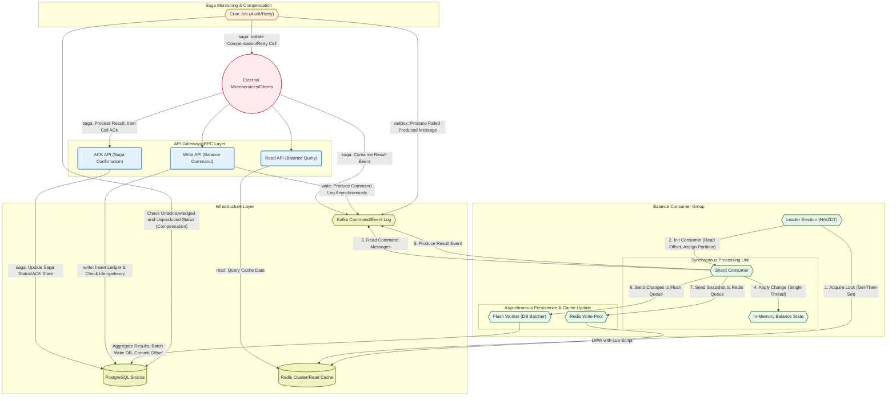

[](LICENSE)


AXS — A High-Performance, Highly Available, and Scalable Event-Driven Balance Engine
===

AXS (Account eXecution Service) is a high-throughput balance engine designed for systems where correctness and performance cannot be compromised—such as cryptocurrency exchanges, trading platforms, payment systems, and real-time financial applications.

It processes balance mutations in-memory, persists them via Kafka-backed event logs, and writes them to storage using batched atomic commits. AXS guarantees idempotency, ordering, and durability while providing gRPC APIs for safe ingestion and Kafka topics for downstream integration.

Architecture
----------------



The architecture is explained in detail in this [article.](https://vicxu.medium.com/designing-a-high-throughput-balance-system-for-exchanges-handling-millions-of-tps-fa647adc5d70?sk=26c7eb3365b46ac18c73b9fb78f65ccb)


Key Implementations
----------------
### Batch Consumer (Zero-Goroutine Aggregation)

AXS provides a deterministic batch consumer built on Kafka’s poll timeout. When idle, it uses a long timeout to avoid excessive polling; once a message arrives, it switches to a short batching delay to quickly accumulate follow-up messages and prevent backlog.

Batches flush when either batchSize is reached or batchingDelay expires, ensuring low latency and in-order processing without extra goroutines. This design reduces concurrency overhead by eliminating extra goroutines and avoiding locks on shared buffers.

### High Performance, High Availability, and Scalability (Zero-GC Cache, Leader Election, Liveness Probe)

AXS updates balances in an in-memory cache first and flushes them to the database asynchronously.
It uses a zero-GC cache (BigCache-style byte-array store) that can hold millions of entries without causing garbage-collection overhead, enabling ultra-low-latency balance updates.

A lightweight leader-election mechanism allows multiple consumers to run for the same partition while ensuring only one actively processes events.
This supports zero-downtime rolling upgrades and automatic failover.
If a leader detects that another node has taken ownership, it immediately reports unavailable through a liveness probe, triggering a controlled restart.


### Memory Model (Lazy Loading & Long-Lived Balance Residency)

AXS loads a user’s balance from the database on first use and keeps it resident in memory for subsequent updates.
This eliminates repeated DB lookups, enabling microsecond-level update performance even under extreme load.

### Atomic Batch Database Flush (One SQL for Many Updates)

AXS applies balance updates using periodic batched SQL writes.
A dedicated flush worker aggregates update requests (e.g., every 500ms) and commits them in a single atomic SQL statement.
This reduces database contention, improves throughput, and guarantees correctness under load.


### Data Durability and Consistency (Idempotency, Offset Management in DB, LWW Lua Script)

AXS follows a Kafka-based event sourcing / WAL design:

- Producer idempotency: implemented via the outbox pattern and DB-level unique keys

- Consumer idempotency: each event carries an event-status record; the flush worker updates this status using optimistic locking

- Offset consistency: Kafka offsets are committed inside the same database transaction as the batch flush, ensuring exactly-once semantics at the application level

For reads, balances are served from Redis. Redis updates use Lua scripts with Last-Write-Wins (LWW) timestamps to guarantee eventual consistency under concurrent updates across worker threads.

### Elegant Sharding Strategy (Shard ID for DB Partitioning, Kafka Partitioning, and Redis Hash-Tagging)

AXS uses an explicit `shard_id` column to drive all sharding dimensions:

- Database range partitions

- Kafka partition keys

- Redis Cluster hash tags ({shard_id})

This unified sharding model provides clear operability, flexible re-sharding, and predictable data locality across storage layers.


Repository layout
-----------------
```
.
├── cmd/                 # Cobra commands: grpc, consumer (placeholders for http/cron)
├── config/              # TOML configs (copy config.example.toml to your env)
├── deployment/          # Includes Docker Compose (local) and Helm charts (Kubernetes) for deployment
├── pb/                  # Protobuf definitions + generated Go code (api + event schemas)
├── pkg/                 # Application code (app wiring, handlers, repositories, services, utils)
│   ├── app/             # Fx bootstrap helpers for grpc + consumer apps
│   ├── handler/         # gRPC handler and Kafka batch consumer abstraction
│   ├── infra/           # Config loading, DB/Redis/Kafka clients
│   ├── repository/      # dbdao (Postgres), redisdao, cachedao (BigCache)
│   ├── service/         # Event processor, leader election, result publisher
│   └── utils/           # Worker pool, retry helpers, etc.
├── setup/               # goose migrations, Kafka topic specs, seed tool + Dockerfile
└── stresstest/          # k6 based stress test harness (TypeScript + webpack)
```

Getting started
---------------
### Prerequisites
- Go `1.24.x` (per `go.mod`)
- Docker & Docker Compose (for local infra)
- `protoc`, `protoc-gen-go`, `protoc-gen-go-grpc` (only if you need to regenerate protobufs)
- Optional for stress tests: Node 20+, npm, `go install go.k6.io/xk6@latest`

### How to use
1. Copy config/config.example.toml to config/config.toml and update the values as needed.
2. Use the provided Makefile to build, run, and manage the service.

### Stress Test

Stress testing is performed using k6. See the [stress test documentation](./stresstest/README.md) for details.


To-Do 
---------------
- Implement robust failure-handling mechanisms
(e.g., introduce a Dead Letter Queue and add safeguards for resolving data inconsistencies between the database and in-memory cache when two consumers accidentally process requests for the same user).

- Add comprehensive unit tests across all layers
(SQL, Redis, cache, event processing logic, etc.).

- Add request signature verification
to prevent unauthorized internal requests and ensure message integrity.

- Add a cron job to resend failed produced messages
(for cases where Kafka or network issues prevent successful publishing).

- Introduce an acknowledgment (ACK) mechanism
to eliminate the need for separate cron jobs in individual microservices.
AXS would centrally manage callback delivery and retry logic when ACKs are lost.

- Provide Helm charts for Kubernetes deployment.

- Add MySQL repository implementation
(alternative persistence layer to PostgreSQL).

- Include more comments to enhance clarity and readability.

Disclaimer
---------------

This project is a beta-stage prototype, designed primarily to demonstrate the performance characteristics of an event-driven architecture.
Before using it in any production environment, please review the entire codebase thoroughly and conduct extensive testing to ensure it meets your system’s reliability, safety, and compliance requirements.