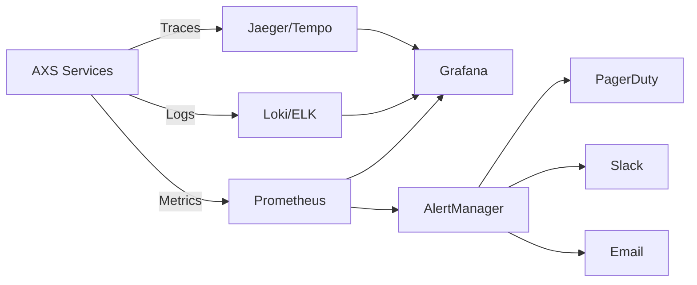

# AXS 系統監控指南 (Monitoring Guide)

**最後更新**：2025-12-11

本指南提供 AXS 系統的完整監控方案，包含核心指標、Prometheus 查詢、Grafana Dashboard 設計和告警規則。

---

## 目錄

1. [監控架構概覽](#監控架構概覽)
2. [核心監控指標](#核心監控指標)
3. [Prometheus 配置與查詢](#prometheus-配置與查詢)
4. [Grafana Dashboard 設計](#grafana-dashboard-設計)
5. [告警規則配置](#告警規則配置)
6. [日誌收集與分析](#日誌收集與分析)
7. [Tracing 追蹤](#tracing-追蹤)

---

## 監控架構概覽



---

## 核心監控指標

### 1. 業務指標 (Business Metrics)

#### 1.1 吞吐量指標

| 指標名稱 | 類型 | 說明 | 正常範圍 | 告警閾值 |
|---------|------|------|---------|---------|
| `axs_requests_total` | Counter | 總請求數 | - | - |
| `axs_requests_success_total` | Counter | 成功請求數 | - | - |
| `axs_requests_failed_total` | Counter | 失敗請求數 | - | rate > 100/s |
| `axs_tps` | Gauge | 當前 TPS | 8K-15K | < 5K or > 20K |
| `axs_batch_processed_total` | Counter | 批次處理總數 | - | - |

**Prometheus 查詢範例**：

```promql
# 計算每秒成功請求數 (TPS)
rate(axs_requests_success_total[1m])

# 計算成功率
(
  rate(axs_requests_success_total[5m]) /
  rate(axs_requests_total[5m])
) * 100

# 計算每分鐘失敗請求數
increase(axs_requests_failed_total[1m])
```

#### 1.2 延遲指標

| 指標名稱 | 類型 | 說明 | 正常範圍 | 告警閾值 |
|---------|------|------|---------|---------|
| `axs_request_duration_seconds` | Histogram | 端到端請求延遲 | P95 < 200ms | P95 > 500ms |
| `axs_grpc_duration_seconds` | Histogram | gRPC 處理延遲 | P95 < 50ms | P95 > 100ms |
| `axs_kafka_publish_duration_seconds` | Histogram | Kafka 發送延遲 | P95 < 10ms | P95 > 50ms |
| `axs_db_query_duration_seconds` | Histogram | DB 查詢延遲 | P95 < 20ms | P95 > 100ms |
| `axs_batch_process_duration_seconds` | Histogram | 批次處理延遲 | P95 < 150ms | P95 > 300ms |

**Prometheus 查詢範例**：

```promql
# P50 延遲
histogram_quantile(0.50, rate(axs_request_duration_seconds_bucket[5m]))

# P95 延遲
histogram_quantile(0.95, rate(axs_request_duration_seconds_bucket[5m]))

# P99 延遲
histogram_quantile(0.99, rate(axs_request_duration_seconds_bucket[5m]))
```

### 2. 系統指標 (System Metrics)

#### 2.1 Consumer 指標

| 指標名稱 | 類型 | 說明 | 正常範圍 | 告警閾值 |
|---------|------|------|---------|---------|
| `axs_consumer_lag` | Gauge | Kafka Consumer Lag | < 1000 | > 5000 |
| `axs_consumer_active` | Gauge | 活躍 Consumer 數 | = Partition 數 | < Partition 數 |
| `axs_leader_elections_total` | Counter | Leader 選舉次數 | < 10/day | > 50/hour |
| `axs_fencing_token_mismatch_total` | Counter | 腦裂偵測次數 | 0 | > 0 |
| `axs_batch_size` | Histogram | 實際批次大小 | 150-200 | < 50 or > 300 |
| `axs_batch_rollback_total` | Counter | 批次回滾次數 | < 100/hour | > 500/hour |

**Prometheus 查詢範例**：

```promql
# Consumer Lag 趨勢
sum by (partition) (axs_consumer_lag)

# Leader 選舉頻率
rate(axs_leader_elections_total[1h])

# 批次回滾率
rate(axs_batch_rollback_total[5m]) / rate(axs_batch_processed_total[5m]) * 100
```

#### 2.2 資料庫指標

| 指標名稱 | 類型 | 說明 | 正常範圍 | 告警閾值 |
|---------|------|------|---------|---------|
| `pg_stat_database_xact_commit` | Gauge | DB 提交次數 | - | - |
| `pg_stat_database_xact_rollback` | Gauge | DB 回滾次數 | - | rate > 100/s |
| `pg_stat_database_numbackends` | Gauge | DB 連線數 | 40-60 | > 180 |
| `pg_stat_database_deadlocks` | Counter | 死鎖次數 | 0 | > 0 |
| `pg_locks_count` | Gauge | 鎖等待數 | < 10 | > 50 |

**Prometheus 查詢範例**：

```promql
# DB 連線數
pg_stat_database_numbackends{datname="axs"}

# DB 回滾率
rate(pg_stat_database_xact_rollback{datname="axs"}[5m])

# 鎖等待
pg_locks_count{mode="ExclusiveLock"}
```

#### 2.3 Kafka 指標

| 指標名稱 | 類型 | 說明 | 正常範圍 | 告警閾值 |
|---------|------|------|---------|---------|
| `kafka_server_brokertopicmetrics_messagesin_total` | Counter | 訊息寫入數 | - | - |
| `kafka_controller_kafkacontroller_activecontrollercount` | Gauge | Active Controller | 1 | != 1 |
| `kafka_server_replicamanager_underreplicatedpartitions` | Gauge | 副本不足的 Partition | 0 | > 0 |
| `kafka_network_requestmetrics_totaltimems` | Histogram | 請求處理延遲 | P95 < 50ms | P95 > 200ms |

### 3. 資源指標 (Resource Metrics)

#### 3.1 CPU & Memory

| 指標名稱 | 說明 | 正常範圍 | 告警閾值 |
|---------|------|---------|---------|
| `container_cpu_usage_seconds_total` | Container CPU 使用率 | 40-70% | > 85% |
| `container_memory_usage_bytes` | Container Memory 使用 | < 80% limit | > 90% limit |
| `go_memstats_heap_alloc_bytes` | Go Heap 分配 | < 500MB | > 1GB |
| `go_gc_duration_seconds` | GC 停頓時間 | P99 < 20ms | P99 > 50ms |

**Prometheus 查詢範例**：

```promql
# Container CPU 使用率
rate(container_cpu_usage_seconds_total{pod=~"axs-consumer.*"}[5m]) * 100

# Memory 使用率
(container_memory_usage_bytes / container_spec_memory_limit_bytes) * 100

# GC Pause P99
histogram_quantile(0.99, rate(go_gc_duration_seconds[5m]))
```

---

## Prometheus 配置與查詢

### Prometheus 配置檔 (prometheus.yml)

```yaml
global:
  scrape_interval: 15s
  evaluation_interval: 15s

scrape_configs:
  # AXS gRPC API
  - job_name: 'axs-grpc-api'
    kubernetes_sd_configs:
      - role: pod
    relabel_configs:
      - source_labels: [__meta_kubernetes_pod_label_app]
        action: keep
        regex: axs-grpc-api
      - source_labels: [__meta_kubernetes_pod_annotation_prometheus_io_scrape]
        action: keep
        regex: true
      - source_labels: [__meta_kubernetes_pod_annotation_prometheus_io_port]
        action: replace
        target_label: __address__
        regex: ([^:]+)(?::\d+)?;(\d+)
        replacement: $1:$2

  # AXS Consumer
  - job_name: 'axs-consumer'
    kubernetes_sd_configs:
      - role: pod
    relabel_configs:
      - source_labels: [__meta_kubernetes_pod_label_app]
        action: keep
        regex: axs-consumer

  # PostgreSQL Exporter
  - job_name: 'postgres'
    static_configs:
      - targets: ['postgres-exporter:9187']

  # Kafka Exporter
  - job_name: 'kafka'
    static_configs:
      - targets: ['kafka-exporter:9308']

  # Redis Exporter
  - job_name: 'redis'
    static_configs:
      - targets: ['redis-exporter:9121']
```

### 高級查詢範例

#### 查詢 1：計算「端到端延遲」分解

```promql
# gRPC 階段
histogram_quantile(0.95, rate(axs_grpc_duration_seconds_bucket[5m]))

# Kafka 發送階段
histogram_quantile(0.95, rate(axs_kafka_publish_duration_seconds_bucket[5m]))

# Consumer 處理階段
histogram_quantile(0.95, rate(axs_batch_process_duration_seconds_bucket[5m]))

# DB 寫入階段
histogram_quantile(0.95, rate(axs_db_query_duration_seconds_bucket{query_type="batch_write"}[5m]))
```

#### 查詢 2：錯誤率趨勢（過去 24 小時）

```promql
(
  rate(axs_requests_failed_total[24h]) /
  rate(axs_requests_total[24h])
) * 100
```

#### 查詢 3：預測 Consumer Lag 何時會達到閾值

```promql
predict_linear(axs_consumer_lag[1h], 3600) > 5000
```

---

## Grafana Dashboard 設計

### Dashboard 1：業務監控總覽 (Business Overview)

**面板配置**：

```json
{
  "dashboard": {
    "title": "AXS Business Metrics",
    "panels": [
      {
        "title": "Real-time TPS",
        "targets": [{
          "expr": "rate(axs_requests_success_total[1m])"
        }],
        "type": "graph"
      },
      {
        "title": "Success Rate",
        "targets": [{
          "expr": "(rate(axs_requests_success_total[5m]) / rate(axs_requests_total[5m])) * 100"
        }],
        "type": "singlestat",
        "thresholds": "95,99"
      },
      {
        "title": "Request Latency (P50/P95/P99)",
        "targets": [
          {"expr": "histogram_quantile(0.50, rate(axs_request_duration_seconds_bucket[5m]))", "legendFormat": "P50"},
          {"expr": "histogram_quantile(0.95, rate(axs_request_duration_seconds_bucket[5m]))", "legendFormat": "P95"},
          {"expr": "histogram_quantile(0.99, rate(axs_request_duration_seconds_bucket[5m]))", "legendFormat": "P99"}
        ],
        "type": "graph"
      }
    ]
  }
}
```

### Dashboard 2：Consumer 健康監控 (Consumer Health)

**關鍵面板**：
1. Consumer Lag（按 Partition 分組）
2. Batch 處理速度
3. Leader Election 次數
4. Fencing Token Mismatch（應永遠為 0）
5. Memory 使用趨勢
6. GC Pause 時間

### Dashboard 3：資料庫效能監控 (Database Performance)

**關鍵面板**：
1. 活躍連線數
2. Transaction Rate (Commit/Rollback)
3. Query Latency (P95/P99)
4. Lock Waits
5. Buffer Cache Hit Rate
6. Disk I/O

---

## 告警規則配置

### AlertManager 配置 (alertmanager.yml)

```yaml
global:
  resolve_timeout: 5m

route:
  group_by: ['alertname', 'severity']
  group_wait: 10s
  group_interval: 10s
  repeat_interval: 12h
  receiver: 'default'

  routes:
    - match:
        severity: critical
      receiver: 'pagerduty'
    - match:
        severity: warning
      receiver: 'slack'

receivers:
  - name: 'default'
    email_configs:
      - to: 'sre-team@example.com'

  - name: 'pagerduty'
    pagerduty_configs:
      - service_key: '<your-pagerduty-key>'

  - name: 'slack'
    slack_configs:
      - api_url: '<your-slack-webhook>'
        channel: '#axs-alerts'
```

### 告警規則 (prometheus-rules.yml)

```yaml
groups:
  - name: axs_critical_alerts
    interval: 30s
    rules:
      # 腦裂偵測（P0 - 立即告警）
      - alert: FencingTokenMismatch
        expr: increase(axs_fencing_token_mismatch_total[5m]) > 0
        labels:
          severity: critical
        annotations:
          summary: "Fencing token mismatch detected (brain split)"
          description: "Consumer {{ $labels.instance }} detected fencing token mismatch"

      # TPS 異常低（P1）
      - alert: LowTPS
        expr: rate(axs_requests_success_total[5m]) < 5000
        for: 2m
        labels:
          severity: critical
        annotations:
          summary: "TPS dropped below 5000"
          description: "Current TPS: {{ $value }}"

      # Consumer Lag 過高（P1）
      - alert: HighConsumerLag
        expr: axs_consumer_lag > 5000
        for: 5m
        labels:
          severity: critical
        annotations:
          summary: "Consumer lag exceeded 5000"
          description: "Partition {{ $labels.partition }} lag: {{ $value }}"

      # DB 連線池耗盡（P0）
      - alert: DBConnectionPoolExhausted
        expr: pg_stat_database_numbackends{datname="axs"} > 180
        for: 1m
        labels:
          severity: critical
        annotations:
          summary: "PostgreSQL connection pool near exhaustion"
          description: "Current connections: {{ $value }}/200"

  - name: axs_warning_alerts
    interval: 1m
    rules:
      # 錯誤率偏高（P2）
      - alert: HighErrorRate
        expr: |
          (
            rate(axs_requests_failed_total[5m]) /
            rate(axs_requests_total[5m])
          ) * 100 > 5
        for: 5m
        labels:
          severity: warning
        annotations:
          summary: "Error rate exceeded 5%"
          description: "Current error rate: {{ $value }}%"

      # P95 延遲偏高（P2）
      - alert: HighLatency
        expr: histogram_quantile(0.95, rate(axs_request_duration_seconds_bucket[5m])) > 0.5
        for: 10m
        labels:
          severity: warning
        annotations:
          summary: "P95 latency exceeded 500ms"
          description: "Current P95: {{ $value }}s"

      # Memory 使用率高（P2）
      - alert: HighMemoryUsage
        expr: |
          (container_memory_usage_bytes{pod=~"axs-consumer.*"} /
           container_spec_memory_limit_bytes) * 100 > 85
        for: 10m
        labels:
          severity: warning
        annotations:
          summary: "Container memory usage > 85%"
          description: "Pod {{ $labels.pod }}: {{ $value }}%"
```

---

## 日誌收集與分析

### 推薦架構：Loki + Promtail

```yaml
# promtail-config.yaml
server:
  http_listen_port: 9080

positions:
  filename: /tmp/positions.yaml

clients:
  - url: http://loki:3100/loki/api/v1/push

scrape_configs:
  - job_name: kubernetes-pods
    kubernetes_sd_configs:
      - role: pod
    relabel_configs:
      - source_labels: [__meta_kubernetes_pod_label_app]
        target_label: app
      - source_labels: [__meta_kubernetes_pod_name]
        target_label: pod
```

### 有用的 LogQL 查詢

```logql
# 查詢所有錯誤日誌
{app="axs-consumer"} |= "ERROR"

# 查詢慢查詢（假設有結構化日誌）
{app="axs-consumer"} | json | latency > 1000

# 統計錯誤類型
sum by (error_type) (rate({app="axs-consumer"} |= "ERROR" [5m]))
```

---

## Tracing 追蹤

### 使用 Jaeger 進行分散式追蹤

**程式碼範例** (Go):

```go
import (
    "github.com/opentracing/opentracing-go"
    "github.com/uber/jaeger-client-go"
)

// 初始化 Tracer
func initTracer() {
    cfg := jaegercfg.Configuration{
        ServiceName: "axs-consumer",
        Sampler: &jaegercfg.SamplerConfig{
            Type:  "const",
            Param: 1, // 100% 取樣（生產環境建議 0.01 = 1%）
        },
        Reporter: &jaegercfg.ReporterConfig{
            LogSpans: true,
            LocalAgentHostPort: "jaeger-agent:6831",
        },
    }
    tracer, closer, _ := cfg.NewTracer()
    opentracing.SetGlobalTracer(tracer)
    defer closer.Close()
}

// 在業務邏輯中使用
func ProcessBatch(ctx context.Context, messages []Message) error {
    span := opentracing.StartSpan("process_batch")
    defer span.Finish()

    // ... 業務邏輯 ...

    childSpan := opentracing.StartSpan("db_write", opentracing.ChildOf(span.Context()))
    defer childSpan.Finish()
    // ... DB 寫入 ...
}
```

---

## 監控 Checklist

### 日常檢查 ✅

- [ ] TPS 在正常範圍內
- [ ] P95 延遲 < 200ms
- [ ] Consumer Lag < 1000
- [ ] 錯誤率 < 1%
- [ ] DB 連線數 < 100
- [ ] 無 Fencing Token Mismatch

### 每週檢查 ✅

- [ ] 查看 DLQ 訊息（應為 0）
- [ ] 檢查 Memory Leak 趨勢
- [ ] 分析慢查詢日誌
- [ ] 檢視 GC Pause 趨勢

### 每月檢查 ✅

- [ ] 容量規劃評估
- [ ] 效能基準測試
- [ ] 告警規則調整
- [ ] Dashboard 優化

---

**最後更新**：2025-12-11
**維護者**：AXS SRE Team
