# AXS 系統故障排查指南 (Troubleshooting Guide)

**最後更新**：2025-12-11

本指南提供 AXS 系統常見問題的診斷與解決方案，按組件分類。

---

## 目錄

1. [快速診斷流程圖](#快速診斷流程圖)
2. [Kafka 相關問題](#kafka-相關問題)
3. [PostgreSQL 相關問題](#postgresql-相關問題)
4. [Consumer 相關問題](#consumer-相關問題)
5. [gRPC API 相關問題](#grpc-api-相關問題)
6. [Redis 相關問題](#redis-相關問題)
7. [網路與連線問題](#網路與連線問題)
8. [效能問題診斷](#效能問題診斷)
9. [緊急處理流程](#緊急處理流程)

---

## 快速診斷流程圖

```mermaid
graph TD
    A[發現異常] --> B{服務可存取?}
    B -->|否| C[檢查基礎設施]
    B -->|是| D{TPS 正常?}

    C --> C1[Kubernetes Pod 狀態]
    C --> C2[Load Balancer 健康檢查]
    C --> C3[網路連通性]

    D -->|否，過低| E[檢查 Consumer Lag]
    D -->|否，過高| F[檢查 DB/Kafka 負載]
    D -->|是| G{延遲正常?}

    E --> E1{Lag > 1000?}
    E1 -->|是| E2[Consumer 處理能力不足]
    E1 -->|否| E3[檢查是否有 Leader 選舉失敗]

    F --> F1[DB CPU/IO 使用率]
    F --> F2[Kafka Broker 健康度]

    G -->|否| H[延遲分解分析]
    G -->|是| I{錯誤率正常?}

    H --> H1[gRPC → Kafka 延遲]
    H --> H2[Kafka → Consumer 延遲]
    H --> H3[Consumer → DB 延遲]

    I -->|否| J[檢查 DLQ 訊息]
    I -->|是| K[系統正常，持續監控]

    J --> J1[餘額不足 - 業務正常]
    J --> J2[資料格式錯誤 - 程式 Bug]
    J --> J3[腦裂偵測 - 緊急調查]
```



---

## Kafka 相關問題

### 問題 1：Kafka Consumer Lag 持續增加

**症狀**：
```bash
# 查詢 Consumer Lag
kafka-consumer-groups.sh --bootstrap-server localhost:9092 \
  --group balance-consumer-group --describe

# 輸出顯示 LAG 持續增長
TOPIC           PARTITION  CURRENT-OFFSET  LOG-END-OFFSET  LAG
balance_change  0          1000000         1050000         50000  # 持續增長
```

**可能原因**：
1. Consumer 處理速度跟不上生產速度
2. Consumer 實例數不足
3. DB 寫入速度成為瓶頸
4. 某個 Partition 的 Consumer 卡住

**診斷步驟**：

```bash
# 1. 檢查 Consumer 實例數
kubectl get pods -l app=axs-consumer

# 2. 檢查 Consumer 日誌中的錯誤
kubectl logs axs-consumer-0 | grep -i error

# 3. 檢查 DB 連線池狀態
psql -h localhost -U root -d axs -c "SELECT count(*) FROM pg_stat_activity WHERE state = 'active';"

# 4. 查看各 Partition 的 Lag 分佈
kafka-consumer-groups.sh --bootstrap-server localhost:9092 \
  --group balance-consumer-group --describe | sort -k6 -rn
```

**解決方案**：

1. **臨時方案（緊急）**：
   ```bash
   # 增加 Consumer 實例數
   kubectl scale deployment axs-consumer --replicas=12
   ```

2. **長期方案**：
   - 優化 DB 寫入效能（檢查索引、增加 shared_buffers）
   - 增加 Kafka Partition 數量（需重新分配數據）
   - 調整 `batch_size` 參數，提高單批次處理量

---

### 問題 2：Kafka Broker 頻繁 Leader 選舉

**症狀**：
```
[Controller] Broker 1 heartbeat timeout, starting leader election
```

**可能原因**：
1. Broker 網路不穩定
2. Broker GC Pause 過長
3. Disk I/O 瓶頸（日誌寫入慢）

**診斷步驟**：

```bash
# 1. 檢查 Broker 日誌
docker logs broker | grep "leader election"

# 2. 檢查網路延遲
ping <broker-ip>

# 3. 檢查 Disk I/O
iostat -x 1 10
```

**解決方案**：

```bash
# 調整 Broker 配置（server.properties）
replica.lag.time.max.ms=30000  # 增加容忍度
zookeeper.session.timeout.ms=18000  # 增加 Zookeeper 超時時間
```

---

## PostgreSQL 相關問題

### 問題 3：DB 連線池耗盡

**症狀**：
```
ERROR: FATAL: sorry, too many clients already (max_connections = 200)
```

**可能原因**：
1. Consumer 沒有正確釋放連線
2. `max_connections` 設置過小
3. 連線洩漏（Connection Leak）

**診斷步驟**：

```sql
-- 1. 查看當前連線數
SELECT count(*) AS total_connections,
       state,
       application_name
FROM pg_stat_activity
GROUP BY state, application_name;

-- 2. 找出長時間處於 idle 狀態的連線
SELECT pid, state, state_change, query
FROM pg_stat_activity
WHERE state = 'idle'
  AND state_change < NOW() - INTERVAL '10 minutes';

-- 3. 檢查是否有鎖等待
SELECT
    l.pid,
    l.mode,
    l.granted,
    a.query
FROM pg_locks l
JOIN pg_stat_activity a ON l.pid = a.pid
WHERE NOT l.granted;
```

**解決方案**：

1. **緊急處理**：
   ```sql
   -- 殺掉長時間 idle 的連線（小心操作！）
   SELECT pg_terminate_backend(pid)
   FROM pg_stat_activity
   WHERE state = 'idle'
     AND state_change < NOW() - INTERVAL '30 minutes'
     AND application_name != 'psql';  -- 不要殺掉自己！
   ```

2. **調整配置**：
   ```bash
   # postgresql.conf
   max_connections = 300  # 增加連線數上限
   shared_buffers = 10GB  # 同步增加 shared_buffers
   ```

3. **程式碼修復**：
   - 檢查 Consumer 程式碼中的 `defer db.Close()`
   - 使用 Connection Pool 並設置合理的 `max_idle_conns` 和 `max_lifetime`

---

### 問題 4：查詢速度突然變慢

**症狀**：
```bash
# P95 延遲從 120ms 飆升到 2000ms
```

**可能原因**：
1. 缺少索引或索引失效
2. Autovacuum 正在執行
3. 統計資訊過期，執行計劃錯誤
4. Disk I/O 瓶頸

**診斷步驟**：

```sql
-- 1. 檢查是否有長時間執行的查詢
SELECT pid, state, query_start, query
FROM pg_stat_activity
WHERE state = 'active'
  AND query_start < NOW() - INTERVAL '5 seconds'
ORDER BY query_start;

-- 2. 檢查是否有 Autovacuum 在執行
SELECT pid, state, query
FROM pg_stat_activity
WHERE query LIKE '%autovacuum%';

-- 3. 檢查慢查詢（需先啟用 log_min_duration_statement）
-- 查看 PostgreSQL 日誌
SHOW log_min_duration_statement;  -- 應設置為 1000 (1秒)

-- 4. 檢查表膨脹 (Table Bloat)
SELECT
    schemaname,
    tablename,
    pg_size_pretty(pg_total_relation_size(schemaname||'.'||tablename)) AS size,
    n_dead_tup
FROM pg_stat_user_tables
ORDER BY n_dead_tup DESC
LIMIT 10;
```

**解決方案**：

1. **如果是 Autovacuum 造成**：
   ```sql
   -- 調整 Autovacuum 參數
   ALTER TABLE account_balances SET (autovacuum_vacuum_cost_delay = 10);
   ALTER TABLE account_balances SET (autovacuum_naptime = 300);  -- 5 分鐘
   ```

2. **如果是缺少索引**：
   ```sql
   -- 檢查查詢計劃
   EXPLAIN ANALYZE
   SELECT * FROM account_balances
   WHERE user_id = 12345 AND currency_code = 'BTC';

   -- 如果看到 Seq Scan，考慮新增索引
   CREATE INDEX CONCURRENTLY idx_user_currency
   ON account_balances(user_id, currency_code);
   ```

3. **如果是統計資訊過期**：
   ```sql
   -- 手動更新統計資訊
   ANALYZE account_balances;
   ```

---

## Consumer 相關問題

### 問題 5：Consumer 不斷重啟 (CrashLoopBackOff)

**症狀**：
```bash
kubectl get pods
NAME              READY   STATUS             RESTARTS   AGE
axs-consumer-0    0/1     CrashLoopBackOff   10         5m
```

**可能原因**：
1. Leader Election 失敗
2. 無法連線到 DB/Kafka/Redis
3. Panic 未被捕獲
4. OOM (Out of Memory)

**診斷步驟**：

```bash
# 1. 查看最近的日誌
kubectl logs axs-consumer-0 --tail=100

# 2. 查看上一次崩潰的日誌
kubectl logs axs-consumer-0 --previous

# 3. 檢查資源使用
kubectl top pod axs-consumer-0

# 4. 查看事件
kubectl describe pod axs-consumer-0
```

**解決方案**：

根據日誌中的錯誤類型：

1. **如果是 Leader Election 失敗**：
   ```bash
   # 檢查 Redis 連線
   redis-cli -h redis-host ping

   # 檢查 partition_leader_locks 表
   psql -h db-host -U root -d axs -c "SELECT * FROM partition_leader_locks;"
   ```

2. **如果是 OOM**：
   ```yaml
   # 增加 Memory Limit (deployment.yaml)
   resources:
     limits:
       memory: "2Gi"  # 從 1Gi 增加到 2Gi
     requests:
       memory: "1Gi"
   ```

3. **如果是 Panic**：
   - 查看 stack trace，定位程式碼問題
   - 確保所有 goroutine 都有 recover 機制

---

### 問題 6：Fencing Token Mismatch (腦裂偵測)

**症狀**：
```
ERROR: fencing token mismatch, expected 12345, got 12344
Consumer gracefully shutting down...
```

**可能原因**：
1. 正常的 Leader 切換（舊 Leader 還在處理時，新 Leader 已接手）
2. 時鐘偏移導致租約提前過期
3. Network Partition 導致舊 Leader 被隔離

**診斷步驟**：

```sql
-- 查看當前 Leader 狀態
SELECT
    topic,
    partition,
    leader_svc_id,
    fencing_token,
    lease_expired_msec,
    EXTRACT(EPOCH FROM (to_timestamp(lease_expired_msec/1000) - NOW())) AS seconds_until_expire
FROM partition_leader_locks;
```

**解決方案**：

1. **如果是正常切換**：
   - 這是系統設計預期行為，無需處理
   - 舊 Consumer 會自動停止，新 Consumer 繼續工作

2. **如果頻繁發生**：
   ```bash
   # 增加租約時間（pkg/config/config.yaml）
   lease_duration: 60s  # 從 30s 增加到 60s
   heartbeat_interval: 10s  # 從 5s 增加到 10s
   ```

3. **如果懷疑時鐘偏移**：
   ```bash
   # 檢查 NTP 同步狀態
   timedatectl status

   # 強制同步時間
   sudo ntpdate -s time.nist.gov
   ```

---

## gRPC API 相關問題

### 問題 7：gRPC 請求大量超時

**症狀**：
```
GRPC Error: context deadline exceeded (code = DeadlineExceeded)
```

**可能原因**：
1. Kafka Producer 阻塞
2. DB 寫入 Init Log 過慢
3. Worker Pool 滿載
4. 網路延遲過高

**診斷步驟**：

```bash
# 1. 檢查 gRPC 延遲分佈
# 透過 Prometheus 查詢
grpc_server_handling_seconds_bucket{grpc_service="BalanceService"}

# 2. 檢查 Kafka Producer Lag
# 查看 producer metrics (需在程式碼中暴露)

# 3. 檢查 DB 連線狀態
psql -h db-host -U root -d axs -c \
  "SELECT state, count(*) FROM pg_stat_activity GROUP BY state;"
```

**解決方案**：

1. **調整 gRPC Timeout**：
   ```go
   // client 端增加 timeout
   ctx, cancel := context.WithTimeout(context.Background(), 5*time.Second)
   defer cancel()
   ```

2. **增加 Worker Pool 大小**：
   ```yaml
   # config.yaml
   worker_pool_size: 100  # 從 50 增加到 100
   ```

3. **優化 Kafka Producer**：
   ```yaml
   kafka_producer:
     linger_ms: 5  # 允許小幅批次化
     batch_size: 16384  # 增加批次大小
     compression_type: "lz4"  # 啟用壓縮
   ```

---

## Redis 相關問題

### 問題 8：Redis 記憶體不足

**症狀**：
```
OOM command not allowed when used memory > 'maxmemory'
```

**可能原因**：
1. 快取未設置 TTL
2. `maxmemory-policy` 設置不當
3. 資料膨脹

**診斷步驟**：

```bash
# 1. 檢查記憶體使用
redis-cli INFO memory

# 2. 查看最大的 Key
redis-cli --bigkeys

# 3. 檢查 Eviction 策略
redis-cli CONFIG GET maxmemory-policy
```

**解決方案**：

```bash
# 1. 調整 Eviction 策略
redis-cli CONFIG SET maxmemory-policy allkeys-lru

# 2. 增加記憶體上限
redis-cli CONFIG SET maxmemory 8gb

# 3. 為 Key 設置 TTL
# 修改程式碼，在寫入時設置過期時間
redis-cli SETEX balance:user:12345:BTC 3600 "100.5"  # 1 小時後過期
```

---

## 效能問題診斷

### 問題 9：TPS 突然下降 50%

**快速診斷 Checklist**：

```bash
# 1. DB CPU 使用率
psql -h db-host -U root -d axs -c \
  "SELECT * FROM pg_stat_activity WHERE state = 'active';"

# 2. Kafka Lag
kafka-consumer-groups.sh --bootstrap-server localhost:9092 \
  --group balance-consumer-group --describe

# 3. Consumer 實例數
kubectl get pods -l app=axs-consumer

# 4. 網路流量
iftop -i eth0

# 5. GC 壓力
# 查看 Consumer 日誌中的 GC 資訊
kubectl logs axs-consumer-0 | grep "GC pause"
```

---

## 緊急處理流程

### 等級 1：系統完全不可用（P0）

**立即行動**：

1. **啟動事故響應流程**
   ```bash
   # 發送告警
   curl -X POST https://pagerduty.com/api/incidents \
     -d '{"incident": {"type": "P0", "title": "AXS System Down"}}'
   ```

2. **檢查基礎設施**
   ```bash
   # Kubernetes Pods 狀態
   kubectl get pods --all-namespaces

   # Load Balancer
   curl -I https://api.axs.example.com/health
   ```

3. **快速回滾**（如果是部署引起）
   ```bash
   kubectl rollout undo deployment/axs-consumer
   kubectl rollout undo deployment/axs-grpc-api
   ```

### 等級 2：部分功能異常（P1）

**診斷步驟**：
1. 查看 DLQ 訊息數量
2. 檢查錯誤率趨勢
3. 定位問題組件

**mitigation**：
- 啟用降級模式（如停用部分非核心功能）
- 限流保護核心流程

### 等級 3：效能下降（P2）

**優化行動**：
- 增加 Consumer 實例數
- 調整 Batch Size
- 優化 DB 查詢

---

## 日誌分析技巧

### 有用的日誌查詢範例

```bash
# 找出所有錯誤
kubectl logs axs-consumer-0 | grep -i "error\|fail\|panic"

# 找出慢查詢（假設日誌有記錄延遲）
kubectl logs axs-consumer-0 | grep "latency" | awk '$NF > 1000'

# 統計錯誤類型
kubectl logs axs-consumer-0 | grep "ERROR" | awk '{print $5}' | sort | uniq -c | sort -rn

# 追蹤特定 Request ID
kubectl logs axs-consumer-0 | grep "request_id=abc123"
```

---

## 聯絡資訊

**緊急聯絡**：
- On-call SRE: [PagerDuty](https://company.pagerduty.com)
- Slack Channel: #axs-incidents
- Email: sre-team@example.com

**相關文件**：
- [監控指南](MONITORING_GUIDE.md)
- [效能基準](PERFORMANCE_BENCHMARK.md)
- [架構分析](axs_architecture_analysis.md)

---

**最後更新**：2025-12-11
**維護者**：AXS SRE Team
