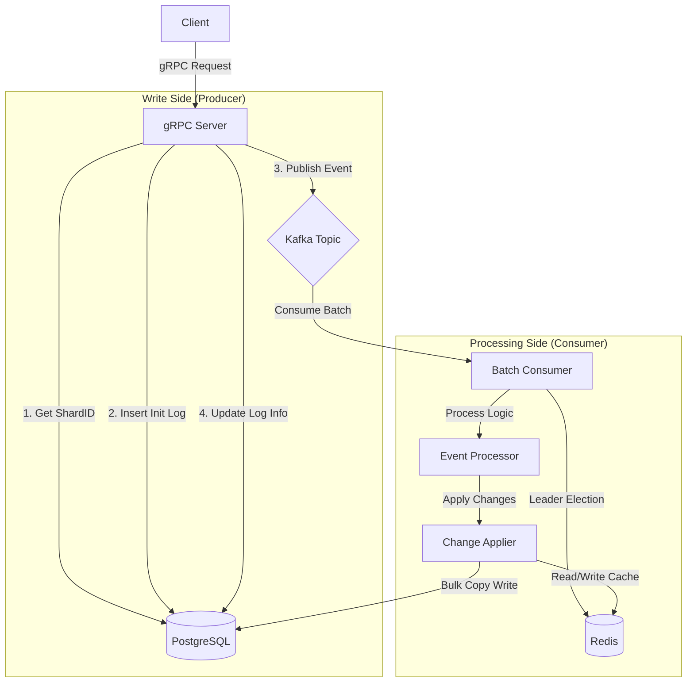

# AXS 系統架構分析報告

本報告從程式入口 `main.go` 出發，分析 `axs` 專案的模組組裝、核心業務流程以及關鍵程式碼路徑。該系統採用了經典的 **CQRS (Command Query Responsibility Segregation)** 與 **Event Sourcing** 架構模式，專為高吞吐量的餘額變更場景設計。

## 1. 系統入口與模組組裝 (Entry Point & Wiring)

系統使用 **Cobra** 進行命令列管理，並使用 **Uber FX** 進行依賴注入 (Dependency Injection)。

### 1.1 入口點 (`main.go`)
`main.go` 是單一執行檔的入口，根據傳入的參數決定啟動哪種角色的服務：

- **`main.go`**: 初始化 `rootCmd` 並註冊子命令。
- **`cmd/`**: 定義了具體的命令邏輯。
  - **`consumer`**: 啟動事件消費服務 (負責處理餘額變更)。
  - **`grpc`**: 啟動 gRPC API 服務 (負責接收請求)。

### 1.2 模組依賴注入 (`pkg/app/module.go`)
`pkg/app/module.go` 是依賴注入的核心設定檔，定義了系統各層級的依賴關係：

| 層級 | Provider 名稱 | 職責 | 關鍵組件 |
| :--- | :--- | :--- | :--- |
| **Config** | `ConfigProvider` | 載入設定檔 | `infra.Config`, `infra.ServerConfig` |
| **Infra** | `InfraProvider` | 基礎建設連線 | `Sqlx` (DB), `RedisClient`, `KafkaProducer` |
| **Repo** | `RepoProvider` | 資料存取層 | `CacheDao`, `DBRepository`, `RedisRepository` |
| **Service** | `EventProcessor` | 業務邏輯與處理 | `processor.NewEventProcessor` (Consumer 核心) |
| **API** | `GrpcAPI` | 外部介面 | `grpcapi.NewGrpcApi` (Server 核心) |

---

## 2. 邏輯架構圖 (Architecture Overview)

系統分為「寫入側 (Write Side)」與「處理側 (Processing Side)」，透過 Kafka 進行解耦。

---

## 3. 關鍵流程詳解

### 3.1 寫入流程 (Write Path) - `grpc`
**目標**：接收外部餘額變更請求，並確保事件被可靠地送入 Kafka。

- **檔案**: `pkg/handler/grpcapi/balance_change_grpc.go`
- **函數**: `BatchSubmitBalanceChanges` & `processReq`

1.  **Validation**: 檢查請求並查詢 Account 對應的 `ShardID`。
2.  **Persistence (Init)**: 在發送 Kafka 前，先將變更記錄 (`BalanceChangeLog`) 寫入 DB，狀態為初始狀態。這確保了即使 Kafka 發送失敗，也有據可查 (Transaction Outbox Pattern 的變體)。
3.  **Async Publish**:
    - 將發送 Kafka 的動作放入 `WorkerPool` 非同步執行。
    - 成功發送後，更新 DB 中的 Log，補上 Kafka Partition 與 Offset 資訊。

### 3.2 處理流程 (Process Path) - `consumer`
**目標**：從 Kafka 消費事件，計算餘額變更，並高效寫入 DB。

- **檔案**: `pkg/service/processor/event_processor.go`
- **檔案**: `pkg/repository/dbdao/pg/pg_dao.go`

1.  **Batch Consumption**: `BatchEventConsumer` 累積一批訊息或達到超時後才觸發處理。
2.  **Leader Election**: 每個 Partition 的消費者會嘗試在 Redis 搶鎖 (`LeaderElector`)，確保同一時間只有一個消費者處理該 Partition，避免併發衝突。
3.  **Core Logic (`ChangeApplier`)**:
    - **Deduplication**: 檢查 `IdempotencyKey` 防止重複消費。
    - **In-Memory Simulation**: 在記憶體中計算餘額變化 (Delta)。
    - **Redis Sync**: 更新 Redis 快取。
4.  **Bulk Persistence (`PGDao`)**:
    - 使用 `COPY FROM` 將整批變更寫入 PostgreSQL 的 `UNLOGGED TEMP TABLE`。
    - 使用 SQL `UPDATE ... FROM temp_table` 一次性更新主表。
    - **優勢**: 這種寫法比傳統的逐筆 `INSERT/UPDATE` 快數十倍，大幅減少 DB 鎖定時間。

---

## 4. 關鍵程式碼檔案索引

| 功能模組 | 檔案路徑 | 用途 |
| :--- | :--- | :--- |
| **啟動入口** | `main.go` | 程式入口，命令分派 |
| **依賴注入** | `pkg/app/module.go` | 定義所有元件的依賴關係 |
| **API 實作** | `pkg/handler/grpcapi/balance_change_grpc.go` | gRPC 介面，負責寫入 Log 並發送 Kafka |
| **消費與調度** | `pkg/service/processor/event_processor.go` | 消費者核心，協調驗證、計算與寫入 |
| **資料庫優化** | `pkg/repository/dbdao/pg/pg_dao.go` | 實作高效能的 Batch Copy 寫入邏輯 |
| **批次消費** | `pkg/handler/consumer/batch_consumer.go` | 實作 Kafka 訊息的批次讀取機制 |
