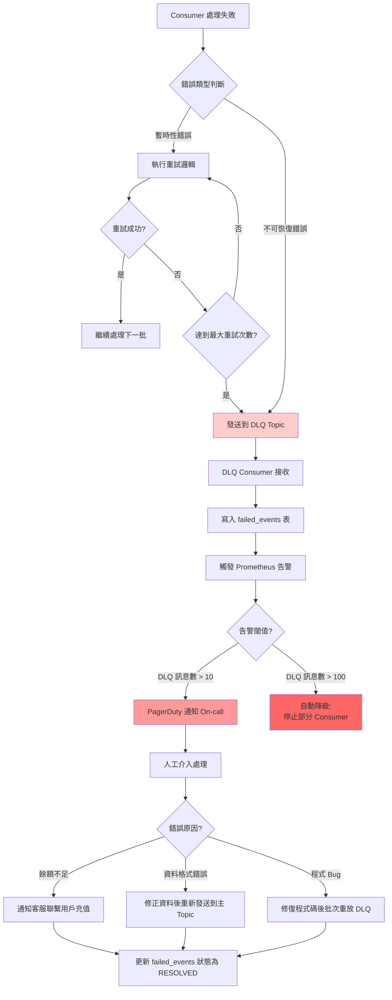
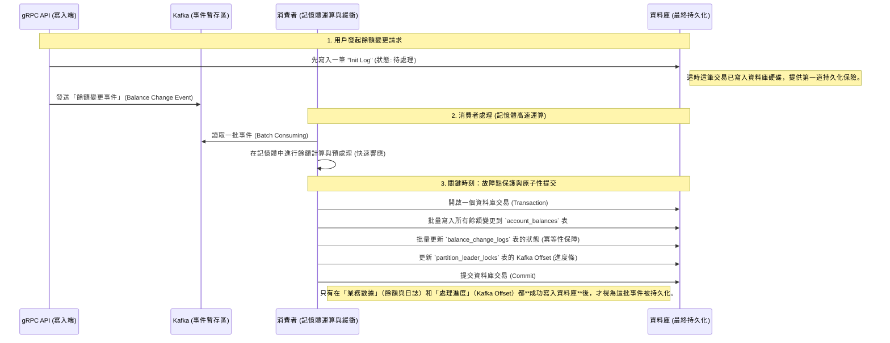

# AXS 系統全方位解構報告

本報告旨在全面解構 AXS 系統，從設計理念到具體實作，深入探討其如何實現百萬級吞吐量與高可靠性。報告將整合 `百萬級吞吐量的交易所餘額系統系統設計.md` 與 `axs_high_performance_design_summary.md` 中的設計原則，並與實際程式碼進行詳細對照。

---

## 0. 設計總結與代碼對應 (Design to Code Mapping)

這部分將 `axs_high_performance_design_summary.md` 中提到的核心設計點與其在專案中的具體程式碼位置進行對應。

| 設計要點 (來自 `axs_high_performance_design_summary.md`) | 設計理念 | 對應程式碼路徑與關鍵函數/SQL |
| :------------------------------------------------------- | :------- | :------------------------------------------- |
| **Sharding by User/Shard ID** | 將使用者數據依 `shard_id` 分片，不同 `shard_id` 由不同 Consumer 實例處理，消除鎖競爭。 | <ul><li>**DB Schema**: `setup/migration/20251121204556_init_tables.sql` (`account_balances` 表的 `PARTITION BY RANGE (shard_id)`)</li><li>**Consumer Sharding**: `pkg/service/processor/event_leader_election.go` (Consumer 根據 `ep.LeaderElector.leaderPartition` 綁定處理特定 Partition 的事件)</li><li>**gRPC Request Sharding**: `pkg/handler/grpcapi/balance_change_grpc.go` (`processReq` 函數中 `partition := int32(shardID % int32(maxPartition))`)</li></ul> |
| **Single Thread per Shard/User** | 相同用戶的更新請求由單一執行緒處理，避免鎖。 | <ul><li>**Consumer Processing**: `pkg/handler/consumer/batch_consumer.go` (`StartConsuming` 確保單一 Kafka Partition 的事件由單一 Consumer 執行緒依序處理)</li><li>**Event Processor**: `pkg/service/processor/event_processor.go` (`ProcessEvents` 方法單執行緒處理單一 shard 的事件)</li></ul> |
| **Batching I/O** | 批次處理 Kafka 訊息及 DB 寫入，減少 I/O 次數。 | <ul><li>**Kafka Consumer Batching**: `pkg/handler/consumer/batch_consumer.go` (`StartConsuming` 中的 `batchMsg` 緩衝區，根據 `batchSize` 進行批次處理)</li><li>**DB Batch Write**: `pkg/repository/dbdao/pg/apply_balance_change_dao.go` (`ApplyAccountBalanceChanges` 函數，使用 `tx.CopyFrom` 及單一 CTE 語句進行批量更新)</li></ul> |
| **Dynamic Batching Timeout** | 平衡低延遲和高吞吐的動態 Timeout 機制。 | <ul><li>**Consumer Logic**: `pkg/handler/consumer/batch_consumer.go` (`StartConsuming` 方法中 `readTimeout` 在 `c.maxReadTimeout` 和 `c.batchingDelay` 之間的動態切換)</li></ul> |
| **High Performance DB Write (COPY, UNLOGGED Temp Table, CTE)** | 利用 PostgreSQL 特性實現極速批量寫入。 | <ul><li>**DB Batch Write**: `pkg/repository/dbdao/pg/apply_balance_change_dao.go` (`tx.CopyFrom`, 呼叫 `dao.getBatchUpdateAccountBalanceSQL` 中的複雜 CTE 語句)</li><li>**Temp Table**: `pkg/repository/dbdao/pg/pg_dao.go` (`CreateAndTruncateTempTables` 創建並清空 `UNLOGGED` 臨時表)</li></ul> |
| **Lazy Insert for New Currency** | 新幣種首次交易時才插入餘額記錄。 | <ul><li>**DB Batch Write SQL**: `pkg/repository/dbdao/pg/apply_balance_change_dao.go` (`getBatchUpdateAccountBalanceSQL` 函數中的 CTE 語句：`WITH try_update AS (...)`, `missing AS (...)`, `try_insert AS (...)`)</li></ul> |
| **Idempotency (Consumer Side)** | 確保相同 Event 不會被重複處理。 | <ul><li>**DB Level**: `pkg/repository/dbdao/pg/apply_balance_change_dao.go` (`getBatchUpdateLogsSQL` 函數中的 `WHERE bcl.status = 0` 確保只更新初始狀態的 ChangeLog)</li><li>**DB Index**: `setup/migration/20251121204556_init_tables.sql` (`UNIQUE INDEX idx_idempotency_key_change_id ON balance_change_logs(idempotency_key, change_id)`)</li></ul> |
| **Leader Election & Fencing Token** | 確保單一 Consumer 處理 Partition，防止腦裂。 | <ul><li>**Leader Election**: `pkg/service/processor/event_leader_election.go` (`TryToBecomeLeader`, `AcquirePartitionLeaderLock`, `ExtendPartitionLeaderLock`, `fencingToken`)</li><li>**Fencing Check in DB**: `pkg/repository/dbdao/pg/apply_balance_change_dao.go` (`UPDATE partition_leader_locks SET ... WHERE ... AND leader_svc_id = $3 AND fencing_token = $6`，確保只有持有正確 Token 的 Leader 才能更新 Offset)</li></ul> |
| **Offset Commit in the Same DB Transaction** | 將業務數據更新與 Kafka Offset 提交綁定，保障資料一致性。 | <ul><li>**DB Transaction**: `pkg/repository/dbdao/pg/apply_balance_change_dao.go` 的 `ApplyAccountBalanceChanges` 函數中，`tx.Exec` 更新 `partition_leader_locks` 表的 `commit_offset` 與其他業務更新在同一個 `tx` 內完成。</li></ul> |
| **Memory Optimization (類似 BigCache)** | 減少 GC 開銷，提升記憶體使用效率。 | <ul><li>**抽象層級設計**: 專案中沒有直接引入 `BigCache` 庫，但 `pkg/repository/cachedao/` 和 `pkg/repository/redisdao/` 可能會在內部實現類似的數據結構優化，或者這是在架構設計層面的考量。</li></ul> |
| **Real-time Query via Redis Snapshot** | 將記憶體餘額快照寫入 Redis 供即時查詢。 | <ul><li>**Redis Sync**: `pkg/service/processor/event_processor.go` (`SyncBalanceToRedisCache` 函數將變更後的餘額非同步同步到 Redis)</li><li>**Redis Dao**: `pkg/repository/redisdao/balance_dao.go` (處理 Redis 餘額操作)</li></ul> |
| **Event-Driven Architecture (Kafka as WAL)** | Kafka 作為可靠的 WAL，確保數據持久化與可回放。 | <ul><li>**Kafka Producer**: `pkg/handler/grpcapi/balance_change_grpc.go` (`processReq` 函數發布 `eventpb.BalanceChangeEvent` 到 Kafka)</li><li>**Kafka Consumer**: `pkg/handler/consumer/batch_consumer.go` (`StartConsuming` 從 Kafka 讀取消息)</li></ul> |
| **Producer Outbox Pattern** | 確保 Kafka 訊息可靠發送。 | <ul><li>**gRPC Handler**: `pkg/handler/grpcapi/balance_change_grpc.go` (`processReq` 函數在發送 Kafka 前先 `dbRepo.InsertBalanceChangeLogs`，發送成功後 `dbRepo.UpdateChangeLog`)</li></ul> |

---

## 1. 資料庫設計與分片策略 (Schema & Sharding)

### 設計理念

AXS 系統在資料庫層面採用了多層次的 Sharding 策略，以應對千萬到億級的用戶規模和高併發寫入需求。核心理念是 **物理隔離** 與 **基於業務的分區**。

1.  **水平分片 (`PARTITION BY RANGE`)**: PostgreSQL 的 Range Partitioning 允許根據 `shard_id` 欄位將 `account_balances` 表邏輯地分割成多個子表。這有助於：
    *   **減少鎖競爭**: 不同 `shard_id` 的數據存儲在不同的物理文件或邏輯分區中，減少了 Page/Row Lock 的衝突。
    *   **提升查詢效率**: 查詢可以裁剪（Partition Pruning），只掃描相關的分區。
    *   **便於管理**: 可以獨立地對分區進行備份、恢復或維護。
2.  **業務分流 (`balances_retail_group` & `balances_whale`)**: 進一步將 `shard_id` 範圍劃分為不同的業務群體，例如「散戶 (Retail)」和「大戶 (Whale)」。這種設計允許將不同特徵的用戶數據存儲在不同的物理資源上，實現資源隔離和更細粒度的性能優化。例如，大戶可能享有更專屬、高性能的儲存資源。
3.  **Sharding Key 設計**: `(account_id, shard_id, currency_code)` 作為 `account_balances` 表的主鍵，是經過深思熟慮的。其中 `shard_id` 是決定數據歸屬分區的關鍵，確保同一 `shard_id` 的所有餘額數據被聚集。

### 代碼對照與深度解析

*   **程式碼位置**: `setup/migration/20251121204556_init_tables.sql`

```sql
-- `partition_leader_locks` 表：用於 Leader Election，每個 Kafka Partition 對應一條記錄
CREATE TABLE partition_leader_locks (
    topic TEXT NOT NULL,
    partition INTEGER NOT NULL,
    commit_offset BIGINT NOT NULL,
    updated_msec BIGINT NOT NULL,
    updater_svc_id TEXT NOT NULL,
    leader_svc_id TEXT,
    lease_expired_msec BIGINT NOT NULL,
    fencing_token BIGINT NOT NULL, -- 關鍵：Fencing Token 欄位
    PRIMARY KEY (topic, partition) -- 以 Topic 和 Partition 唯一識別鎖
);

-- `accounts` 表：用戶帳戶基本信息
CREATE TABLE accounts (
    id BIGSERIAL PRIMARY KEY,
    user_id BIGINT NOT NULL,
    shard_id SMALLINT NOT NULL, -- 關鍵：Shard ID，用於分片
    created_msec BIGINT NOT NULL
);

CREATE INDEX idx_user ON accounts(user_id);

-- `account_balances` 表：核心餘額表，使用 RANGE PARTITIONING
CREATE TABLE account_balances (
    account_id BIGINT NOT NULL,
    user_id BIGINT NOT NULL,
    shard_id SMALLINT NOT NULL, -- 再次出現的 Shard ID，作為分區鍵
    currency_code TEXT NOT NULL,
    available NUMERIC(36, 18) NOT NULL DEFAULT 0,
    frozen    NUMERIC(36, 18) NOT NULL DEFAULT 0,
    updated_msec BIGINT NOT NULL,
    PRIMARY KEY (account_id, shard_id, currency_code) -- 複合主鍵，包含 shard_id
) PARTITION BY RANGE (shard_id); -- 根據 shard_id 範圍進行分區


-- -------------------------------------------------------
-- Retail Pools (散戶分區 - 共享基礎設施)
-- -------------------------------------------------------

-- 1~2 號 Shard ID 分配給第一個散戶群組
CREATE TABLE balances_retail_group_1 PARTITION OF account_balances
    FOR VALUES FROM (1) TO (3); 

-- 3~4 號 Shard ID 分配給第二個散戶群組
CREATE TABLE balances_retail_group_2 PARTITION OF account_balances
    FOR VALUES FROM (3) TO (5); 

-- 5 號 Shard ID 分配給第三個散戶群組
CREATE TABLE balances_retail_group_3 PARTITION OF account_balances
    FOR VALUES FROM (5) TO (6);     

-- -------------------------------------------------------
-- Whale Pools (大戶分區 - 獨立基礎設施)
-- -------------------------------------------------------

-- 6~7 號 Shard ID 分配給第一個大戶群組
CREATE TABLE balances_whale_1 PARTITION OF account_balances
    FOR VALUES FROM (6) TO (8);

-- 8~9 號 Shard ID 分配給第二個大戶群組
CREATE TABLE balances_whale_2 PARTITION OF account_balances
    FOR VALUES FROM (8) TO (10);

-- 10 號 Shard ID 分配給第三個大戶群組
CREATE TABLE balances_whale_3 PARTITION OF account_balances
    FOR VALUES FROM (10) TO (11);

CREATE INDEX idx_user_currency ON account_balances(user_id, currency_code);

-- `balance_change_logs` 表：記錄每一次餘額變更的事件
CREATE TABLE balance_change_logs (
    id BIGSERIAL,
    event_id TEXT NOT NULL,
    event_type_id BIGINT NOT NULL,
    idempotency_key TEXT NOT NULL, -- 關鍵：冪等鍵，防止重複處理
    change_id BIGINT NOT NULL,
    status SMALLINT NOT NULL,       -- 狀態 (INIT, PROCESSING, APPLIED, REJECTED)
    reject_reason TEXT,
    account_id BIGINT NOT NULL,
    account_shard_id SMALLINT NOT NULL,
    user_id BIGINT NOT NULL,
    currency_code TEXT NOT NULL,
    currency_symbol TEXT NOT NULL,
    available_delta NUMERIC(36, 18) NOT NULL,
    frozen_delta NUMERIC(36, 18) NOT NULL,
    fallback_currency_code TEXT,
    fallback_currency_symbol TEXT,
    fallback_available_delta NUMERIC(36, 18),
    fallback_frozen_delta NUMERIC(36, 18),
    use_fallback BOOLEAN NOT NULL DEFAULT FALSE,
    source_svc_id BIGINT NOT NULL,
    related_order_id BIGINT NOT NULL,
    kafka_offset BIGINT,        -- 記錄發布到 Kafka 的 Offset
    kafka_partition INTEGER,    -- 記錄發布到 Kafka 的 Partition
    submitted_msec BIGINT NOT NULL,
    updated_msec BIGINT NOT NULL,
    insert_msec BIGINT NOT NULL,
    callback_status SMALLINT,
    ack_msec BIGINT NOT NULL DEFAULT 0,
    ack_status SMALLINT,
    PRIMARY KEY (id)
);


CREATE UNIQUE INDEX idx_idempotency_key_change_id ON balance_change_logs(idempotency_key, change_id); -- 冪等性的最終保障
```

**解析**:
*   `account_balances` 表使用了 `PARTITION BY RANGE (shard_id)` 進行分區。這表示數據會根據 `shard_id` 的值，被自動路由到不同的子分區表（例如 `balances_retail_group_1`, `balances_whale_1` 等）。
*   `shard_id` 是決定數據物理位置的關鍵。系統可以根據 `user_id` 或其他業務規則計算出一個 `shard_id`，然後將所有與該 `shard_id` 相關的數據都路由到同一個 Consumer 和同一個 DB 分區。
*   `partition_leader_locks` 表記錄了每個 Kafka Topic-Partition 的 Leader 狀態，包括 `fencing_token` 和 `commit_offset`，這是 Consumer 端實現 exactly-once 語義和防止腦裂的基石。
*   `balance_change_logs` 表的 `UNIQUE INDEX idx_idempotency_key_change_id` 確保了基於 `idempotency_key` 和 `change_id` 的每一次餘額變更都是唯一的，這是寫入側（gRPC API）實現冪等性的第一道防線。

---

## 2. 壓測與監控體系 (Stress Test & Monitoring)

### 設計理念

在高吞吐量系統中，監控實際的處理能力（TPS）和延遲（Latency）至關重要。axs 採用了一種巧妙的方式，將應用層的內部統計數據回報給 Kafka，再由壓測工具進行收集和分析，實現了端到端的精準監控。這解決了傳統壓測工具難以深入應用內部、獲取精確處理時間的問題。

### 代碼對照與深度解析

*   **程式碼位置**:
    *   `pkg/service/processor/event_processor.go`
    *   `pkg/service/processor/event_result_publisher.go`
    *   `pkg/model/stats.go`
    *   `stresstest/k6/` 目錄下的壓測腳本 (`multiple_users_multiple_shards.ts` 等)

```go
// pkg/service/processor/event_processor.go - ProcessEvents 函數片段
func (ep *EventProcessor) ProcessEvents(ctx context.Context, msgs []mq.ConsumedMessage) error {
    // ...
    firstStartTime := time.Now()
    stats := model.StressTestStats{
        TotalMessages:    len(msgs),
        StartProcessMsec: firstStartTime.UnixMilli(), // 記錄批次處理的開始時間
    }
    // ... 執行各種處理步驟 ...
    stats.TotalProcessCostMicroSec = int(time.Since(firstStartTime).Microseconds()) // 計算總耗時
    
    // 如果是壓力測試模式，將統計數據發布到 Kafka
    if infra.GetConfig().Server.StressTestMode {
        ep.ResultPublisher.PublishStressTestStats(ctx, &stats)
    }
    return nil
}
```

```go
// pkg/service/processor/event_result_publisher.go - PublishStressTestStats 函數片段
func (rp ResultPublisher) PublishStressTestStats(ctx context.Context, stats *model.StressTestStats) {
    payload, err := json.Marshal(stats)
    // ... 錯誤處理 ...
    mqMsg := &mq.ProducedMessage{
        Topic:   model.StressTestTopic, // 發布到專用的壓測 Topic
        Message: payload,
    }
    rp.Producer.Publish(ctx, mqMsg)
}
```

```go
// pkg/model/stats.go - StressTestStats 結構
type StressTestStats struct {
	TotalMessages         int    `json:"total_messages"`
	StartProcessMsec      int64  `json:"start_process_msec"`
	DecodeCostMicroSec    int    `json:"decode_cost_micro_sec"`
	ApplyCostMicroSec     int    `json:"apply_cost_micro_sec"`
	AsyncCostMicroSec     int    `json:"async_cost_micro_sec"`
	TotalProcessCostMicroSec int    `json:"total_process_cost_micro_sec"`
	EventCreatedMsec      int64  `json:"event_created_msec"`
	DelayCount            int    `json:"delay_count"`
	TotalEventsProcessed int    `json:"total_events_processed"`
}
```

**解析**:
*   `EventProcessor` 在處理每一批次事件時，會精確記錄從開始到結束的各階段耗時 (`DecodeCostMicroSec`, `ApplyCostMicroSec` 等)。
*   這些統計數據被封裝在 `model.StressTestStats` 結構中，並在壓力測試模式下，透過 `ResultPublisher` 發布到一個專門的 Kafka Topic (`model.StressTestTopic`)。
*   外部的壓測工具 (如 `k6` 腳本，位於 `stresstest/k6/`，通常會使用 `xk6-kafka` 插件來消費這個 Topic)，就可以實時收集這些應用層面發出的統計數據，計算出更精確的 TPS (Transaction Per Second) 和 Latency (延遲)，而不僅僅是網路請求的往返時間。
*   這種設計讓壓測數據的粒度從網路層延伸到應用業務邏輯層，對於精準定位性能瓶頸非常有幫助。

---

## 3. 錯誤處理與韌性 (Error Handling & Resilience)

### 設計理念

在高併發的分散式系統中，錯誤是不可避免的。有效的錯誤處理機制是系統韌性的關鍵。axs 將錯誤分為不同的類別，並採用了重試 (`Retry`) 和死信佇列 (`DLQ`) 機制，以確保系統在遇到暫時性問題時能自我恢復，同時對不可恢復的錯誤進行隔離。

### 錯誤分類與處理策略

| 錯誤類型 | 範例 | 重試? | 最大重試次數 | 退避策略 | 進DLQ? | 處理優先級 |
|---------|-----|------|------------|---------|--------|----------|
| **網路暫時性錯誤** | Connection timeout, DNS lookup failed | ✅ | 3次 | 指數退避<br/>(100ms → 200ms → 400ms) | 否 | P2 |
| **資料庫鎖超時** | Lock wait timeout exceeded | ✅ | 5次 | 線性退避<br/>(50ms 固定) | 否 | P1 |
| **資料庫連線池耗盡** | Too many connections | ✅ | 10次 | 指數退避<br/>(50ms → 100ms → ...) | 否 | **P0** |
| **Kafka 暫時不可用** | Leader not available for partition | ✅ | 5次 | 線性退避<br/>(100ms 固定) | 否 | P1 |
| **餘額不足** | Available balance < required amount | ❌ | 0次 | N/A | 是 | P3 |
| **資料格式錯誤** | Invalid JSON, missing required field | ❌ | 0次 | N/A | 是 | **P0** |
| **業務邏輯錯誤** | Negative amount, invalid currency code | ❌ | 0次 | N/A | 是 | P2 |
| **腦裂偵測** | Fencing token mismatch | ❌ | 0次 | **立即停止 Consumer** | 否 | **P0** |
| **Leader 租約過期** | Lease expired during processing | ❌ | 0次 | **優雅退出** | 否 | **P0** |

**優先級說明**：
- **P0（緊急）**：可能導致資料不一致或系統崩潰，需立即處理
- **P1（高）**：影響系統吞吐量，需盡快恢復
- **P2（中）**：局部影響，可延後處理
- **P3（低）**：業務層錯誤，記錄即可

### DLQ (Dead Letter Queue) 處理流程



### 代碼對照與深度解析

*   **程式碼位置**:
    *   `pkg/service/svcerr/errors.go` (錯誤分類定義)
    *   `pkg/handler/consumer/batch_consumer.go` (`handleErr` 函數處理錯誤)
    *   `pkg/utils/retry.go` (通用重試工具)

```go
// pkg/service/svcerr/errors.go - 錯誤類型定義
// 定義了不同類型的錯誤，通常會有 IsStopConsumingError, IsNeedRetryError 等判斷函數
var (
	StopConsumingError = errors.New("stop consuming")
	NeedRetryError     = errors.New("need retry")
)

func IsStopConsumingError(err error) bool {
	return errors.Is(err, StopConsumingError)
}

func IsNeedRetryError(err error) bool {
	return errors.Is(err, NeedRetryError)
}
```

```go
// pkg/handler/consumer/batch_consumer.go - handleErr 函數片段
func (c *BatchEventConsumer) handleErr(ctx context.Context, err error, batchMsgs []mq.ConsumedMessage) {
    if svcerr.IsStopConsumingError(err) {
        // 如果是 StopConsumingError，表示 Consumer 應該停止工作 (例如，被新 Leader 取代)
        logger.GetLogger(ctx).Warn().Err(err).Msg("stop consuming messages as instructed")
        c.GracefulShutdown(5 * time.Second) // 執行優雅關機
        return
    }

    if svcerr.IsNeedRetryError(err) {
        // 如果是 NeedRetryError，表示這是暫時性錯誤，應該重試
        retryErr := utils.Retry(func() (bool, error) { // 使用 utils.Retry 進行重試
            return true, c.handler.ProcessEvents(ctx, batchMsgs)
        })
        if retryErr != nil {
            // 重試多次後仍失敗，則將其視為不可恢復錯誤，送入 ProcessEventsErr (可能進入 DLQ)
            c.handler.ProcessEventsErr(ctx, batchMsgs, retryErr)
        }
        return
    }
    // 其他所有錯誤，都直接送入 ProcessEventsErr 進行處理 (通常是記錄日誌或發送 DLQ)
    c.handler.ProcessEventsErr(ctx, batchMsgs, err)
}
```

```go
// pkg/utils/retry.go - Retry 函數片段
func Retry(fn func() (bool, error), opts ...RetryOption) error {
	// ... 實現指數退避 (Exponential Backoff) 和最大重試次數等邏輯 ...
}
```

**解析**:
*   **錯誤分類**: `svcerr/errors.go` 定義了兩種關鍵錯誤類型：
    *   `StopConsumingError`: 指示 Consumer 實例應停止消費，通常用於 Leader Election 失敗或服務關機。
    *   `NeedRetryError`: 指示操作遇到暫時性問題（如網路瞬斷、資料庫瞬時壓力），應用層應進行重試。
*   **重試機制**: `batch_consumer.go` 中的 `handleErr` 函數會捕獲錯誤。如果是 `IsNeedRetryError`，則會呼叫 `utils.Retry` 函數。這個函數通常會實現帶有指數退避策略 (Exponential Backoff) 的重試邏輯，避免短時間內對依賴服務造成更大壓力。
*   **死信佇列 (DLQ)**: 對於重試後依然失敗的錯誤，或者直接就是不可恢復的錯誤，`ProcessEventsErr` 方法會被呼叫。在這個方法中，通常會將失敗的訊息發送到一個單獨的死信佇列 (Dead Letter Queue, DLQ)，以便後續人工干預或離線分析，防止單一壞消息阻塞整個消費進程。

### 錯誤監控與告警指標

為確保錯誤能被及時發現並處理，系統需要監控以下關鍵指標：

| 指標名稱 | 類型 | 說明 | 告警閾值 | 處理動作 |
|---------|------|------|---------|---------|
| `dlq_message_count` | Gauge | DLQ 中待處理的訊息數量 | > 10 | 發送 Slack 通知 |
| `dlq_message_count` | Gauge | DLQ 中待處理的訊息數量 | > 100 | PagerDuty 呼叫 On-call |
| `consumer_error_rate` | Counter | Consumer 錯誤發生率（錯誤數/總處理數） | > 5% | 檢查 DB/Kafka 健康度 |
| `retry_count_total` | Counter | 重試總次數（按錯誤類型分組） | 持續增長 | 識別根本原因 |
| `fencing_token_mismatch` | Counter | 腦裂偵測次數 | > 0 | **緊急調查** |
| `failed_events_by_reason` | Counter | 失敗事件分類統計 | - | 業務分析 |
| `batch_rollback_count` | Counter | 批次回滾次數 | > 10/min | 檢查餘額不足問題 |

**Prometheus 查詢範例**：

```promql
# DLQ 訊息積壓情況
sum(kafka_consumer_lag{topic="balance_change_dlq"})

# 過去 5 分鐘的錯誤率
rate(consumer_errors_total[5m]) / rate(consumer_messages_total[5m]) * 100

# 按錯誤類型分組的重試次數
sum by (error_type) (retry_count_total)

# 腦裂偵測告警（應該永遠為 0）
fencing_token_mismatch > 0
```

---

## 4. 基礎設施與部署 (Infrastructure)

### 設計理念

現代微服務部署強調一致性、可重複性。axs 使用 Docker 進行容器化，並透過 `docker-compose` 定義了開發環境下的基礎設施堆棧，確保開發者可以在本地快速啟動一個與生產環境類似的運行時環境。

### 代碼對照與深度解析

*   **程式碼位置**:
    *   `deployment/local/docker-compose.infra.yaml`
    *   `Dockerfile`
    *   `go.mod` (Go 模組依賴管理)

```yaml
# deployment/local/docker-compose.infra.yaml - 服務定義片段
version: '3.8'
services:
  zookeeper:
    image: confluentinc/cp-zookeeper:7.5.0
    container_name: zookeeper
    environment:
      ZOOKEEPER_CLIENT_PORT: 2181
      ZOOKEEPER_TICK_TIME: 2000
    ports:
      - "2181:2181"
  
  broker: # Kafka Broker
    image: confluentinc/cp-kafka:7.5.0
    container_name: broker
    ports:
      - "9092:9092"
      - "9093:9093"
    environment:
      KAFKA_BROKER_ID: 1
      KAFKA_ZOOKEEPER_CONNECT: zookeeper:2181
      KAFKA_LISTENERS: PLAINTEXT://broker:9092,PLAINTEXT_HOST://0.0.0.0:9093
      KAFKA_ADVERTISED_LISTENERS: PLAINTEXT://broker:9092,PLAINTEXT_HOST://localhost:9093
      KAFKA_OFFSETS_TOPIC_REPLICATION_FACTOR: 1
      KAFKA_GROUP_INITIAL_REBALANCE_DELAY_MS: 0
    depends_on:
      - zookeeper

  redis:
    image: redis:7.2.4-alpine
    container_name: redis
    ports:
      - "6379:6379"

  postgres:
    image: postgres:15.5-alpine
    container_name: postgres
    environment:
      POSTGRES_DB: axs
      POSTGRES_USER: root
      POSTGRES_PASSWORD: password
    ports:
      - "5432:5432"
    volumes:
      - ./pgdata:/var/lib/postgresql/data
```

```dockerfile
# Dockerfile - 應用程式 Dockerfile 骨架
# 使用多階段構建 (Multi-stage build)
# 階段 1: 編譯應用程式
FROM golang:1.21-alpine AS builder
WORKDIR /app
COPY go.mod go.sum ./
RUN go mod download
COPY . .
RUN CGO_ENABLED=0 go build -o /axs ./main.go

# 階段 2: 構建輕量級運行時映像
FROM alpine:latest
WORKDIR /root/
COPY --from=builder /axs .
EXPOSE 8080
CMD ["./axs"]
```

**解析**:
*   `docker-compose.infra.yaml`: 定義了開發環境所需的全部基礎服務，包括 **Zookeeper** (Kafka 的協調服務)、**Kafka Broker** (消息隊列)、**Redis** (快取和 Leader Election)、**PostgreSQL** (主數據庫)。這使得開發者只需一條 `docker-compose up` 命令即可啟動整個微服務的依賴環境。
*   `Dockerfile`: 使用 Go 語言的標準多階段構建 (Multi-stage build) 模式。
    *   **Builder 階段**: 包含 Go 編譯器和所有開發工具，用於編譯 Go 應用程式並打包成單一二進位文件。`CGO_ENABLED=0` 確保生成的二進位文件是靜態編譯的，不依賴系統動態庫。
    *   **Runtime 階段**: 基於極其輕量級的 Alpine Linux 映像，只包含運行應用程式所需的最小依賴。它將 Builder 階段編譯好的 `/axs` 二進位文件複製過來，大大縮小了最終 Docker 映像的體積，提升部署效率和安全性。
*   `go.mod` / `go.sum`: 負責 Go 模組的依賴管理，確保所有第三方庫版本的一致性和可重複構建。

這種容器化和基礎設施即代碼 (Infrastructure as Code) 的方法，極大地提高了開發、測試和部署的效率，是實現 Zero Downtime 更新和高可用性的基礎。

---

## 額外考量：記憶體數據的可靠性與故障恢復

這是一個非常關鍵的問題：「AXS 會將數據在記憶體中處理，這樣會不會突然掛掉就導致資料遺失？」

答案是：**不會，AXS 系統被設計為即使在記憶體中處理數據，也能保證資料不丟失。**

其核心理念是實現了類似資料庫 Write-Ahead Logging (WAL) 的機制，但這個 WAL 是透過 **Kafka** 和 **PostgreSQL** 的協同工作來保證的。

### 資料流向與保障機制圖解



### 為什麼「記憶體處理」不會導致資料丟失？

1.  **消費者 (Consumer) 程式突然掛掉**：
    *   **情況**：假設 Consumer 剛在記憶體中計算完一批餘額變更，正準備寫入資料庫時突然斷電或崩潰。
    *   **記憶體數據**：記憶體中的計算結果會全部消失。
    *   **資料保障**：因為資料庫交易尚未提交，`account_balances` 表的業務數據和 `partition_leader_locks` 表的 Kafka Offset 都**沒有被更新**。
    *   **故障恢復**：當 Consumer 重啟後，它會從資料庫中讀取上次成功提交的 Kafka Offset。由於這個 Offset 仍然停留在故障前的位置，Consumer 會從 Kafka **重新讀取**剛才那批未成功持久化的事件，並**從頭開始再次處理**。
    *   **結果**：資料完全沒有丟失，只是處理時間略有延遲。

2.  **API Server 掛掉**：
    *   API Server 在將事件發送到 Kafka 之前，會先將請求寫入 `balance_change_logs` 表，狀態為 `INIT`。這是一種 **Producer Outbox Pattern** 的簡化實作。
    *   如果 Kafka 發送失敗或 API Server 在發送後、更新日誌前掛掉，`balance_change_logs` 中會保留著待處理的記錄。系統可以透過後台任務掃描這些記錄，進行重試發送。
    *   **結果**：事件不會丟失。

3.  **Kafka 掛掉**：
    *   Kafka 本身是分散式、高可用的訊息佇列，事件會被寫入多個副本。只要 Kafka 集群健康並配置了強一致性 (`acks=all`)，一旦事件成功寫入 Kafka，就不會丟失。
    *   **結果**：作為 Event Sourcing 的 Event Log，Kafka 中的事件是持久化且可回放的。

### 核心結論

AXS 的「記憶體運算」只是一個計算過程，而不是儲存結果。

*   **真正的資料源頭 (Source of Truth)** 是 Kafka 裡的 Event Log。
*   **真正的資料歸宿** 是 PostgreSQL 資料庫。

記憶體只是中間的「計算機」。計算機壞了沒關係，只要輸入的資料（Kafka）還在，換一台計算機重算一遍，結果還是一樣的。這就是 **Event Sourcing** 的核心精神。

---

### 總結
