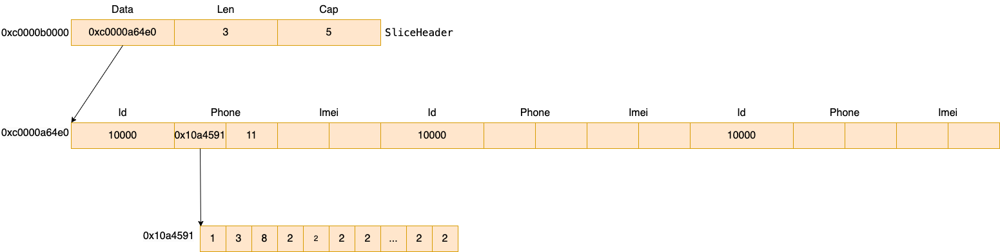

# slice 的內存佈局

```
type SliceHeader struct {
	Data uintptr
	Len  int
	Cap  int
}
```

例如對於下面的實例代碼

```
s := make([]Device, 0, 5)
s = append(s, Device{
    Id:    10000,
    Phone: "13822222222",
    Imei:  "967029040684350",
})

s = append(s, Device{
    Id:    10000,
    Phone: "13822222222",
    Imei:  "967029040684350",
})

s = append(s, Device{
    Id:    10000,
    Phone: "18938303322",
    Imei:  "879718719874831738",
})
```

其內存佈局如下圖所示



## slice的強制轉換
可以使用 unsafe.Slice 將一段連續的內存空間強制轉換為 slice。

這個操作原理是給這一段內存空間申請一個 SliceHeader 結構體，然後將這段內存空間的首地址賦值給 SliceHeader.Data 字段，
這樣就實現了將一段連續的內存空間強制轉換為 slice 的操作。

下面是一個例子

```
var a1 = [16]int{1, 2, 3, 4, 5, 1, 2, 3, 4, 5, 1, 2, 3, 4, 5}
a2 := unsafe.Slice((*MyStruct)(unsafe.Pointer(&a1)), 8)
fmt.Printf("a1: (%v) (%v)\n", unsafe.Pointer(&a1), a1)
fmt.Printf("a2: (%v) (%v)\n", unsafe.Pointer(&a2), a2)

sliceHeader = (*reflect.SliceHeader)(unsafe.Pointer(&a2))
fmt.Printf("%+v\n", sliceHeader)
fmt.Println(unsafe.Pointer(sliceHeader.Data))
```

輸出結果如下

```shell
a1: (0x1400013e080) ([1 2 3 4 5 1 2 3 4 5 1 2 3 4 5 0])
a2: (0x1400011e048) ([{1 2} {3 4} {5 1} {2 3} {4 5} {1 2} {3 4} {5 0}])
&{Data:1374390837376 Len:8 Cap:8}
0x1400013e080
```

可見a1數組的地址是0x1400013e080，使用 unsafe.Slice 創建出來的 sliceHeader.Data 的地址也是0x1400011e048。
這個操作在實際開發中非常有用，可以避免大塊數組的內存拷貝。
