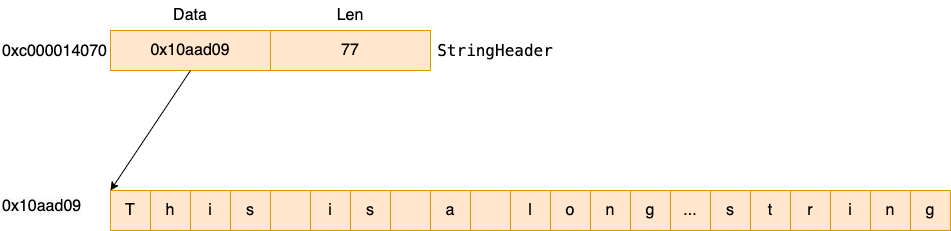

# 字符串類型
`var a string = 'I am a string!'`


# 字符串內存佈局

一個字符串是由兩個部分組成，一個是StringHeader，

```
type StringHeader struct {
	Data uintptr
	Len  int
}
```

例如對於以下字符串：

```
func main() {
	s := "Thiis is a long long long long long long long long long long long long string"
}
```



其StringHeader的值為
- Data：0x10aad09   指向數據段中的字符串
- Len：77


# []byte和string的轉換
一般來說轉換方式是採用string() 進行轉換，但是這種方式會導致拷貝開銷。
```
Res := string(bytes)
```

如果想避免拷貝開銷，可以直接將[]byte,強制類型轉換成string。

原理是切片的元數據header和string的元數據header是對齊的。所以可以這麼hack地操作。

```
type SliceHeader struct {
	Data uintptr
	Len  int
	Cap  int
  }
type StringHeader struct {
	Data uintptr
	Len  int
}
```

具體轉換代碼如下：

```
var s = []byte("this is a string")
Res := *(*string)(unsafe.Pointer(&s))
fmt.Println(Res)
```

## 字符串淺拷貝

普通的字符串拷貝只是淺拷貝
s := "Thiis is a long long long long long long long long long long long long string"

```
s1 := ""
p_s1 := &s1
*p_s1 = s
```

此時查看 s 和 s1 兩個字符串雖然在棧中的地址不一樣，但是其Header內容是一模一樣的，指向同一塊堆地址
```
舊字符串的展示
0xc000014070
&{Data:17478129 Len:77}

淺拷貝字符串的展示
0xc000014080
&{Data:17478129 Len:77}
```

# 字符串深拷貝
在通過 []byte 轉換成 string 的時候，會進行深拷貝。所以我們可以利用它來完成。

```
a := "12345"
b := make([]byte, len(a))
copy(b, a)
c := string(b)
fmt.Println(c)
```

我們的需求是講一個指針指向的字符串深拷貝到另一個指針指向的字符串。採用兩步法
- 1. 先將字符串轉換成 []byte
- 2. 將 []byte 轉換成 string

```

```


# 參考
- [Go源碼學習: string的內部數據結構](https://blog.frognew.com/2021/11/read-go-sources-string.html)