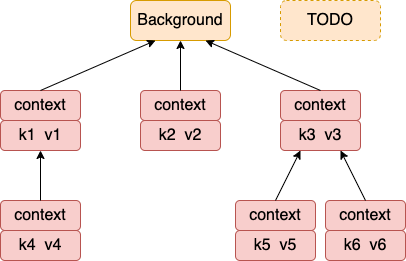

context 主要用來在 goroutine 之間傳遞上下文信息，包括：取消信號、超時時間、截止時間、k-v 等。

## 一、context 包的使用

### 1.1 取消用法
```golang
func main(){
	ctx1, cancel1 := context.WithCancel(context.Background())
	ctx2, cancel2:= context.WithTimeout(context.Background(), 2*time.Second)

	defer cancel1()
	defer cancel2()

	//Do something
	go func(ctx1)
	go func(ctx2)}
```

### 1.2 傳值取值

```golang
func main(){
	ctx := context.WithValue(context.Background(), "userid", "1234567")

}
func handler(ctx context.Context){

}
```

接下來我們來看 context 包的內部工作原理

## 二、所定義的接口

### 2.1  Context 相關的接口

Context 接口定義

```golang
type Context interface {
	Deadline() (deadline time.Time, ok bool)

	//這個 Done方法最重要
	Done() <-chan struct{}

	Err() error

	//Context 接口也定義了 Value 方法
	Value(key interface{}) interface{}
}
```

canceler 接口定義

```golang
//file: context/context.go
type canceler interface {
	cancel(removeFromParent bool, err error)
	Done() <-chan struct{}
}
```

### 2.2 emptyCtx 類型

其中 emptyCtx 實現了 Context 接口，不過所有的方法都是空實現。 

```golang
type emptyCtx int
func (*emptyCtx) Deadline() (deadline time.Time, ok bool) {
	return
}
func (*emptyCtx) Done() <-chan struct{} {
	return nil
}
func (*emptyCtx) Err() error {
	return nil
}
func (*emptyCtx) Value(key interface{}) interface{} {
	return nil
}
```

我們平時所用的 background 和 todo 都是 emptyCtx 的實例。

```golang
var (
	background = new(emptyCtx)
	todo       = new(emptyCtx)
)
func Background() Context {
	return background
}
func TODO() Context {
	return todo
}
```


### 2.3 cancelCtx 類型

cancelCtx 採用匿名嵌套的方式申明瞭一個 context 成員

> 匿名成員的不代表沒有字段名，而是默認會採命名的類型名字作為成員的字段名。在一個結構體中對於每一種數據類型只能有一個匿名字段。


```golang
type cancelCtx struct {
	Context

	mu       sync.Mutex            // protects following fields
	done     chan struct{}         // created lazily, closed by first cancel call
	children map[canceler]struct{} // set to nil by the first cancel call
	err      error                 // set to non-nil by the first cancel call
}
```

同時，它還實現了 Value、Done、Err 中定義的方法。由於沒有實現 Deadline， 所以調用這個方法會調用到它的成員 Context 下的 Deadline。 **所以它實現了 Context 接口**。

```golang
func (c *cancelCtx) Value(key interface{}) interface{} {
	if key == &cancelCtxKey {
		return c
	}
	return c.Context.Value(key)
}

func (c *cancelCtx) Done() <-chan struct{} {
	c.mu.Lock()
	if c.done == nil {
		c.done = make(chan struct{})
	}
	d := c.done
	c.mu.Unlock()
	return d
}

func (c *cancelCtx) Err() error {
	c.mu.Lock()
	err := c.err
	c.mu.Unlock()
	return err
}
```

前面看到 cancelCtx 實現了 Done，這裡也實現了 cancel。**所以它也實現了 canceler 接口**。 

```golang
// cancel closes c.done, cancels each of c's children, and, if
// removeFromParent is true, removes c from its parent's children.
func (c *cancelCtx) cancel(removeFromParent bool, err error) {
	if err == nil {
		panic("context: internal error: missing cancel error")
	}
	c.mu.Lock()
	if c.err != nil {
		c.mu.Unlock()
		return // already canceled
	}
	c.err = err
	if c.done == nil {
		c.done = closedchan
	} else {
		close(c.done)
	}
	for child := range c.children {
		// NOTE: acquiring the child's lock while holding parent's lock.
		child.cancel(false, err)
	}
	c.children = nil
	c.mu.Unlock()

	if removeFromParent {
		removeChild(c.Context, c)
	}
}
```

### 2.4 timerCtx 類型

```golang
// A timerCtx carries a timer and a deadline. It embeds a cancelCtx to
// implement Done and Err. It implements cancel by stopping its timer then
// delegating to cancelCtx.cancel.
type timerCtx struct {
	cancelCtx
	timer *time.Timer // Under cancelCtx.mu.

	deadline time.Time
}
```

它實現了 Deadline（context接口定義） 、cancel（canceler 接口定義） 等方法。 其它的方法都會進入到匿名成員 cancelCtx 中來調用。

```golang
func (c *timerCtx) Deadline() (deadline time.Time, ok bool) {
	return c.deadline, true
}

func (c *timerCtx) String() string {
	return contextName(c.cancelCtx.Context) + ".WithDeadline(" +
		c.deadline.String() + " [" +
		time.Until(c.deadline).String() + "])"
}

func (c *timerCtx) cancel(removeFromParent bool, err error) {
	c.cancelCtx.cancel(false, err)
	if removeFromParent {
		// Remove this timerCtx from its parent cancelCtx's children.
		removeChild(c.cancelCtx.Context, c)
	}
	c.mu.Lock()
	if c.timer != nil {
		c.timer.Stop()
		c.timer = nil
	}
	c.mu.Unlock()
}
```

### 2.5 cancel 方法調用鏈


對於 timerCtx 的 cancel 來說，它不但會取消自己，還會取消其內嵌的 cancelCtx 的 cancel 方法。

```golang
func (c *timerCtx) cancel(removeFromParent bool, err error) {
	c.cancelCtx.cancel(false, err)
	if removeFromParent {
		// Remove this timerCtx from its parent cancelCtx's children.
		removeChild(c.cancelCtx.Context, c)
	}
	c.mu.Lock()
	if c.timer != nil {
		c.timer.Stop()
		c.timer = nil
	}
	c.mu.Unlock()
}
```

顯示執行 cancelCtx 的 cancel。執行完後， 把自己從其父 context 中的 children 列表中取消 `removeChild(c.cancelCtx.Context, c)`

再看cancelCtx 的 cancel 方法實現如下。

```golang

// cancel closes c.done, cancels each of c's children, and, if
// removeFromParent is true, removes c from its parent's children.
func (c *cancelCtx) cancel(removeFromParent bool, err error) {
	if err == nil {
		panic("context: internal error: missing cancel error")
	}
	c.mu.Lock()
	if c.err != nil {
		c.mu.Unlock()
		return // already canceled
	}
	c.err = err
	if c.done == nil {
		c.done = closedchan
	} else {
		close(c.done)
	}
	for child := range c.children {
		// NOTE: acquiring the child's lock while holding parent's lock.
		child.cancel(false, err)
	}
	c.children = nil
	c.mu.Unlock()

	if removeFromParent {
		removeChild(c.Context, c)
	}
}
```

在 cancelCtx 的 cancel 方法下做了三件事

-1. close 自己的 chanel
-2. 遞歸地調用它的所有子節點 cancel，進而讓它們也能 close 自己的 chanel
-3. 把自己在其父的 context 下取消。`removeChild(c.Context, c)`


### 2.6 valueCtx 類型

用來存儲 KV 對兒。其內嵌了一個 Context 類型。

```golang 
type valueCtx struct {
	Context
	key, val interface{}
}
```

其實現了 String 和 Value 兩個方法。

```golang
func (c *valueCtx) String() string {
	return contextName(c.Context) + ".WithValue(type " +
		reflectlite.TypeOf(c.key).String() +
		", val " + stringify(c.val) + ")"
}

func (c *valueCtx) Value(key interface{}) interface{} {
	if c.key == key {
		return c.val
	}
	return c.Context.Value(key)
}
```


## 三、函數實現
### 3.1 context.Background 和 context.Todo

直接返回前面定義的兩個 emptyCtx 。

```golang
func Background() Context {
	return background
}
func TODO() Context {
	return todo
}
```

### 3.2 WithCancel

它用來創建一個 cancelCtx， 其 parent 是所傳入的參數，一般來說，是 BackGround 或者是 Todo。

- 通過調用 newCancelCtx 來創建了一個 cancelCtx 對象。
- 通過調用 propagateCancel 來設置取消鏈
- 返回 cancelCtx 對象，以及一個匿名函數

**注意：**目測返回的這個 cancelCtx 下面的 done 和 children 元素全部都是 nil。

```golang
func WithCancel(parent Context) (ctx Context, cancel CancelFunc) {
	c := newCancelCtx(parent)
	propagateCancel(parent, &c)
	return &c, func() { c.cancel(true, Canceled) }
}
```

在 newCancelCtx 中創建一個空的 cancelCtx 出來，將 cancelCtx 的成員 Context 設置為了其 parent。

```golang
// newCancelCtx returns an initialized cancelCtx.
func newCancelCtx(parent Context) cancelCtx {
	return cancelCtx{Context: parent}
}
```

根據註釋來看， propagateCancel 這個函數是為了做一些準備工作。方便當 parent 取消的時候，新創建出來的 cancelCtx 能夠正常取消。 不過如果 parent 是 Background 或者 Todo 的話，這個函數會直接返回。

```golang

// propagateCancel arranges for child to be canceled when parent is.
func propagateCancel(parent Context, child canceler) {

	// parent 為空的話，這裡就返回了
	done := parent.Done()
	if done == nil {
		return // parent is never canceled
	}
	...
}
```

最後返回的匿名函數，其實就是下面這個。 defer以後，這個將會執行。

```golang
// cancel closes c.done, cancels each of c's children, and, if
// removeFromParent is true, removes c from its parent's children.
func (c *cancelCtx) cancel(removeFromParent bool, err error) {
	if err == nil {
		panic("context: internal error: missing cancel error")
	}
	c.mu.Lock()
	if c.err != nil {
		c.mu.Unlock()
		return // already canceled
	}
	c.err = err

	//1. 如果有 done channel， 則 close 它一遍。
	if c.done == nil {
		c.done = closedchan
	} else {
		close(c.done)
	}

	//2. 把所有的 child 也都 cancel 一遍（close chan）
	for child := range c.children {
		// NOTE: acquiring the child's lock while holding parent's lock.
		child.cancel(false, err)
	}
	c.children = nil
	c.mu.Unlock()

	// 3. 把自己從 parent 中的 children 列表中摘出來
	//    其中 c.Context 記錄著是 parent 指針
	if removeFromParent {
		removeChild(c.Context, c)
	}
}
```


### 3.3 WithTimeout 函數

用法如下。

```golang
//file: main.go
func main(){
	ctx, cancel := context.WithTimeout(context.Background(), 2*time.Second)
	go handle(ctx)
}
```

我們來看看這個函數的內部實現。

```golang
func WithTimeout(parent Context, timeout time.Duration) (Context, CancelFunc) {
	return WithDeadline(parent, time.Now().Add(timeout))
}
```

注意，這裡傳入的 parent 是 Background， 它並沒有 Deadline。所以 parent.Deadline 不會返回 ok 的。

```golang
func WithDeadline(parent Context, d time.Time) (Context, CancelFunc) {
	//1. 先看看 parent 的 Deadline 到了沒有
	if cur, ok := parent.Deadline(); ok && cur.Before(d) {
		// The current deadline is already sooner than the new one.
		return WithCancel(parent)
	}

	//2. 初始化一個 timerCtx 對象出來
	//   使用 newCancelCtx 初始化 cancelCtx，deadline 就設置為過期時間
	c := &timerCtx{
		cancelCtx: newCancelCtx(parent),
		deadline:  d,
	}

	//3. 由於 parent 的 Done 方法為空，所以這個函數啥也沒幹
	propagateCancel(parent, c)

	//4. 獲取還有多長時間過期，
	dur := time.Until(d)

	//4.1 如果過期就調用 c.cancel
	//    關於 timerCtx 的 cancel 函數參見下文
	if dur <= 0 {
		c.cancel(true, DeadlineExceeded) // deadline has already passed
		return c, func() { c.cancel(false, Canceled) }
	}

	//4.2 開啟timer， 到期後還是調用 timerCtx.cancel 函數
	c.mu.Lock()
	defer c.mu.Unlock()
	if c.err == nil {
		c.timer = time.AfterFunc(dur, func() {
			c.cancel(true, DeadlineExceeded)
		})
	}
	return c, func() { c.cancel(true, Canceled) }
}
```


注意，這裡的 c.cancel 方法是 timerCtx 自己重新定義的。

```golang
func (c *timerCtx) cancel(removeFromParent bool, err error) {
	//1. 顯式調用內嵌對象的 cancel 方法。
	c.cancelCtx.cancel(false, err)

	//2. 把自己從 parent 的 children 列表中拿出來
	//   其中 c.cancelCtx.Context 記錄的是它的 parent
	if removeFromParent {
		// Remove this timerCtx from its parent cancelCtx's children.
		removeChild(c.cancelCtx.Context, c)
	}

	//3. 停止 timer
	c.mu.Lock()
	if c.timer != nil {
		c.timer.Stop()
		c.timer = nil
	}
	c.mu.Unlock()
}
```


### 3.4 WithValue 函數

使用方法

```golang
func main(){
	valueCtx := context.WithValue(context.Background(), "userid", "11111111")
}
```

```golang
func WithValue(parent Context, key, val interface{}) Context {
	if key == nil {
		panic("nil key")
	}
	if !reflectlite.TypeOf(key).Comparable() {
		panic("key is not comparable")
	}
	return &valueCtx{parent, key, val}
}
```

回憶一下 valueCtx 的定義，它是內嵌了一個 Context 對象的。

```golang 
type valueCtx struct {
	Context
	key, val interface{}
}
```

這樣返回的對象就是生成一個 valueCtx 對象出來，並用傳入的 parent、key、value 來初始化。

如果進行多次的 WithValue 調用，就會把值串成了樹形結構。



我們再回顧一下 Value 查看函數的實現。

```golang
func (c *valueCtx) Value(key interface{}) interface{} {
	if c.key == key {
		return c.val
	}
	return c.Context.Value(key)
}
```

先對比當前節點，如果不是自己存著的，就調用父節點進行查找。 如果最後仍然找不到，則調用到根節點 Background 或者 TODO 以後返回 nil。

```golang
func (*emptyCtx) Value(key interface{}) interface{} {
	return nil
}
```