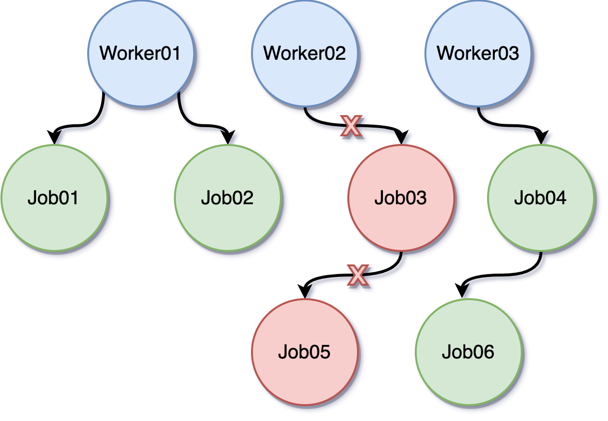

# Go goroutine 控制方式指南：`WaitGroup`、`channel`、`context` 與 `errgroup`


[context](https://pkg.go.dev/context) 在 Go 1.7 才正式納入標準函式庫。初學 Go、開始撰寫 API 或處理併發程式時，常會在 `http handler` 或 service function 的第一個參數看到：

```go
ctx context.Context
```

很多人學 Go 併發時，會先碰到 goroutine，接著遇到幾個常見問題：

- 怎麼等一批 goroutine 全部做完？
- 怎麼通知 goroutine 停止？
- 怎麼讓一整串流程在 timeout 時一起取消？
- 怎麼做到「其中一個失敗，其他也跟著停」？

這篇文章不只談 `context`，而是用實際例子把 `WaitGroup`、`channel`、`context` 與 `errgroup` 放在一起比較。你可以把它當成一份 goroutine 控制方式的入門地圖，先理解每種工具解決的問題，再決定實務上該怎麼組合使用。

## 先看結論：怎麼選比較快

如果你現在手上就有 goroutine 控制需求，可以先看這張速查表：

```text
我要解決的問題                      優先考慮
---------------------------------------------------------
等全部 goroutine 做完                WaitGroup
goroutine 之間傳資料                 channel
通知單一或少量 worker 停止           channel
整條呼叫鏈一起取消                   context
限制執行時間                         context.WithTimeout
任一 goroutine 失敗就全停            errgroup
限制同時最多 N 個 goroutine 執行      buffered channel / semaphore
程式關機時收尾                       signal.NotifyContext + WaitGroup
```

實務上最常見的組合通常不是四選一，而是：

- `channel` 傳資料。
- `context` 控制取消。
- `WaitGroup` 等待收尾。
- `errgroup` 處理平行任務的錯誤傳播。

## 這篇怎麼讀

這篇文章會照下面的順序走：

1. 先看 goroutine 控制到底分成哪幾類問題。
2. 再理解 `context` 為什麼跟 `channel` 不完全一樣。
3. 最後分別看 `WaitGroup`、`channel`、`context`、`errgroup` 的範例。

如果你是初學者，照順序看會最好懂；如果你只是想選工具，看到上面的速查表就可以先做第一輪判斷。

## 先把 goroutine 控制問題分好類

先不要急著背 API，先把問題拆開看：

```text
goroutine 控制其實分成幾類：

1. 等待完成       -> WaitGroup
2. 傳遞資料/訊號  -> channel
3. 取消/逾時      -> context
4. 錯誤傳播       -> errgroup
5. 限制併發數     -> buffered channel / semaphore
```

如果你先分清楚你要控制的是哪一種問題，後面選工具就會很快。

## 先用一張圖理解 `context` 在解決什麼問題

這裡說的「整條呼叫鏈」，意思不是只有一個 goroutine，而是同一次任務從上到下會經過的整串呼叫流程，例如：

```text
Client Request
    │
    v
HTTP Handler
    │
    v
Service
    │
    ├── Query DB
    ├── Call Redis
    └── Call External API
```

上面這整串就是一條呼叫鏈。

- `Handler` 是入口。
- `Service` 是業務邏輯。
- `DB / Redis / External API` 是下游依賴。

如果 `Handler` 拿到的 `ctx` 被取消，這個取消訊號就可以一路往下傳到 `Service`、`DB`、`Redis`、外部 API。這就是「整條呼叫鏈一起取消」。

很多人第一次看到 `context.Context`，會以為它只是另一種 `channel`。其實它真正解決的是「跨函式、跨 goroutine 傳遞控制訊號」這件事，尤其適合 request-based 或多層呼叫的流程。

```text
HTTP Request
    │
    v
Handler
    │  建立 request context
    v
Service
    │  往下傳遞同一個 ctx
    v
Repository
    │
    v
DB / RPC / 外部 API

取消來源可能是：
1. 使用者中斷連線
2. Server 主動 shutdown
3. Timeout 到期

一旦上層 ctx 被取消，下面整串流程都能收到通知。
```

再看一次取消是怎麼往下傳的：

```text
Client disconnect / timeout
           │
           v
      cancel ctx
           │
           v
HTTP Handler
           │
           v
Service
     ┌─────┼───────────┐
     v     v           v
    DB   Redis    External API

結果：
- Handler 不再等結果
- Service 停止後續處理
- DB / Redis / API 收到 ctx.Done() 後盡快中止
```

如果只靠函式回傳值，你得一層一層手動處理停止條件；如果只靠單一 `channel`，當流程跨了好幾層函式或好幾組 worker，管理成本就會快速變高。`context` 的價值就在這裡。

## 實務情境：交易系統或訂票系統會長怎樣

很多人看到「整條呼叫鏈」時，會立刻想到這種問題：

- 如果很多使用者同時下單，會不會全部混在同一個 `context`？
- 如果很多人同時搶票，系統是不是把所有訂單集中在一起處理？

答案是：

- `context` 通常是「每一次請求一份」。
- 訂單或票務資料可以「集中處理」，但那是業務資料流，不是把所有請求共用同一個 `context`。

### 先分清楚兩件事

```text
層次 A：請求控制
- 誰發起請求
- 這次請求多久 timeout
- 使用者是否斷線
- 這次請求要不要取消

層次 B：業務資料處理
- 訂單要不要進 queue
- 庫存要不要鎖定
- 撮合引擎怎麼排序
- 哪些 worker 負責處理
```

`context` 管的是層次 A，不是層次 B。

### 交易系統的常見樣子

假設很多使用者同時送出買賣單：

```text
User A ---- HTTP/gRPC Request A ----> Handler A ----> Service A ----> Order API / DB / Queue
User B ---- HTTP/gRPC Request B ----> Handler B ----> Service B ----> Order API / DB / Queue
User C ---- HTTP/gRPC Request C ----> Handler C ----> Service C ----> Order API / DB / Queue

每個 Request 都有自己的 ctxA / ctxB / ctxC
```

這裡要注意兩件事：

1. `ctxA`、`ctxB`、`ctxC` 是分開的，因為它們代表不同使用者、不同請求的生命週期。
2. 這些請求最後可以把訂單寫進同一個集中式系統，例如同一個 queue、同一個 order book、同一個資料庫。

也就是說：

- `context` 不會把所有訂單「集中成一份」。
- 訂單資料可以被系統「集中管理」。

這兩件事不能混在一起看。

### 交易系統裡 `context` 真正管什麼

假設使用者 A 下單後，流程可能是：

```text
Request A
  │
  v
Create Order Handler
  │
  v
Order Service
  ├── 驗證使用者餘額
  ├── 寫入 Order DB
  ├── 發送到 Matching Queue
  └── 記錄審計日誌
```

如果這時候：

- 使用者連線斷掉
- API gateway timeout
- server 正在 shutdown

那 `Request A` 對應的 `ctxA` 就可以通知這條流程停止，避免：

- DB 查詢還在白跑
- 外部風控 API 還在等
- queue publish 一直卡住

但是，已經成功寫入 queue 的訂單，之後要不要繼續被撮合，這是業務規則問題，不是 `context` 自己決定。

### 訂票系統也是一樣

很多人搶同一場演唱會門票時，系統常常會把「搶票請求」跟「庫存處理」拆開。

```text
User A Request ----> Ticket Handler ----> Ticket Service ----> Lock Seat / Create Order
User B Request ----> Ticket Handler ----> Ticket Service ----> Lock Seat / Create Order
User C Request ----> Ticket Handler ----> Ticket Service ----> Lock Seat / Create Order

                    下游可能共用：
                    - 同一個庫存系統
                    - 同一個訂單資料庫
                    - 同一個排隊機制
```

每個人搶票時，都有自己的 request context。某一個使用者頁面關掉，不代表其他人的請求也該取消。

但在業務層面上，大家可能會一起競爭：

- 同一批座位庫存
- 同一個訂票 queue
- 同一張活動場次表

所以「請求是分開的」，但「資源可能是共享的」。

### 一張圖看懂：request context 跟集中處理不是同一層

```text
                    每個使用者都有自己的 request context

User A -- ctxA --> Handler A --> Service A --+
                                             |
User B -- ctxB --> Handler B --> Service B --+--> Shared DB / Queue / Inventory
                                             |
User C -- ctxC --> Handler C --> Service C --+

左邊：
- ctxA / ctxB / ctxC 各自控制各自的請求生命週期

右邊：
- Shared DB / Queue / Inventory 是集中管理的共享資源
```

這是實務上最常見的樣子。

### 什麼時候會用「全系統共用」的 context

也不是完全沒有共享 `context`，只是共享的通常不是「所有使用者訂單共用一個 request context」，而是像這樣：

```text
serverCtx
  ├── background matching engine
  ├── settlement worker
  ├── notification worker
  └── metrics reporter
```

這種 `serverCtx` 通常是用來表示：

- 整個服務正在 shutdown
- 背景 worker 要一起停止
- 程式生命週期結束

也就是說：

- `request ctx`：控制單次請求
- `server ctx`：控制整個服務或某一批背景工作

## 一句話記住

在交易系統或訂票系統裡，通常不是「所有訂單共用一個 `context`」，而是「每個請求有自己的 `context`，但它們可能共同操作同一批集中管理的資源」。

## 幾個工具的定位差在哪裡

先記一個簡單判斷方式：

- `WaitGroup`：等工作全部做完。
- `channel`：傳資料或傳單一協調訊號。
- `context`：傳遞取消、逾時、截止時間與 request 範圍內資訊。
- `errgroup`：幫一組 goroutine 收錯誤，並在需要時一起取消。

```text
需求類型                     建議工具
--------------------------------------------------
等 3 個 goroutine 全部結束    WaitGroup
通知 1 個 worker 停止         channel
通知一整串流程停止            context
其中 1 個 goroutine 失敗就全停 errgroup
限制請求最多執行 2 秒         context.WithTimeout
夾帶 request id 往下傳遞      context.WithValue
```

這三者不是互斥關係。實務上常見的組合是：

- 用 `WaitGroup` 等待 goroutine 收尾。
- 用 `context` 發出取消訊號。
- 用 `channel` 傳遞結果或工作內容。
- 用 `errgroup` 把錯誤處理與取消控制整合起來。

## 教學影片

如果你對課程內容有興趣，可以參考以下資源：

- [Go 語言基礎實戰（開發、測試及部署）](https://www.udemy.com/course/golang-fight/?couponCode=202004)
- [一天學會 DevOps 自動化測試及部署](https://www.udemy.com/course/devops-oneday/?couponCode=202004)
- [DOCKER 容器開發部署實戰](https://www.udemy.com/course/docker-practice/?couponCode=202004)

如果需要搭配購買，請直接透過 [FB 聯絡我](http://facebook.com/appleboy46)。

## 1. 等全部做完：`WaitGroup`

學 Go 時一定會碰到 goroutine，而 goroutine 的協調方式常見有兩種：一種是 [WaitGroup](https://pkg.go.dev/sync#WaitGroup)，另一種是 `context`。

那什麼時候該用 `WaitGroup`？很簡單，當你把同一件事拆成多個 job 並行執行，而且主程式必須等所有 job 都完成之後才能繼續，這時候就很適合使用 `WaitGroup`。

```go
package main

import (
	"fmt"
	"sync"
	"time"
)

func main() {
	var wg sync.WaitGroup

	wg.Add(2)

	go func() {
		time.Sleep(2 * time.Second)
		fmt.Println("job 1 done.")
		wg.Done()
	}()

	go func() {
		time.Sleep(1 * time.Second)
		fmt.Println("job 2 done.")
		wg.Done()
	}()

	wg.Wait()
	fmt.Println("all done.")
}
```

上面的例子中，主程式透過 `wg.Wait()` 等待所有 job 執行完成，最後才印出訊息。

不過會有另一種情境：工作雖然拆成多個 job 丟到背景執行，但如果使用者想透過 UI 上的「停止」按鈕，或透過其他外部事件主動終止正在執行的 goroutine，該怎麼做？這時可以先用 `channel + select` 來處理。

### `WaitGroup` 的角色

`WaitGroup` 很適合「等結束」，但它本身不負責「叫別人停下來」。也就是說，它解決的是同步收尾問題，不是取消控制問題。

```text
main goroutine
    │
    ├── worker 1
    ├── worker 2
    └── worker 3

main 只做一件事：
等待所有 worker 都呼叫 Done()
```

如果你的需求是「工作做到一半也可能被外部取消」，那 `WaitGroup` 通常還不夠。

## 2. 通知停止或傳資料：`channel + select`

```go
package main

import (
	"fmt"
	"time"
)

func main() {
	stop := make(chan bool)

	go func() {
		for {
			select {
			case <-stop:
				fmt.Println("got the stop channel")
				return
			default:
				fmt.Println("still working")
				time.Sleep(1 * time.Second)
			}
		}
	}()

	time.Sleep(5 * time.Second)
	fmt.Println("stop the goroutine")
	stop <- true
	time.Sleep(5 * time.Second)
}
```

透過 `select + channel`，可以很直接地通知背景 goroutine 停止工作。只要在任何地方把值送進 `stop channel`，背景工作就會收到訊號並結束。

### 這種寫法什麼時候夠用

當流程簡單、worker 數量少，而且停止訊號只在單一區域內使用時，`channel` 非常直接。

```text
main ----stop----> worker
```

但如果背景不只一個 goroutine，而是很多個 goroutine，甚至 goroutine 裡面還會再啟動新的 goroutine，事情就會變得很複雜。像下圖這種層層展開的 worker 結構，就不太適合只靠單一 `channel` 來管理：



這時候就輪到 `context` 登場了。

## 3. 控制取消與逾時：`context`

從上圖可以看到，主程式先建立一個根 `context.Background()`，接著讓每個 worker 依照需要延伸出自己的子 context。這樣一來，只要取消某個 context，就能讓該 context 之下的工作一併收到停止通知。

先把前面的 `channel` 範例改寫成 `context`：

```go
package main

import (
	"context"
	"fmt"
	"time"
)

func main() {
	ctx, cancel := context.WithCancel(context.Background())

	go func() {
		for {
			select {
			case <-ctx.Done():
				fmt.Println("got the stop channel")
				return
			default:
				fmt.Println("still working")
				time.Sleep(1 * time.Second)
			}
		}
	}()

	time.Sleep(5 * time.Second)
	fmt.Println("stop the goroutine")
	cancel()
	time.Sleep(5 * time.Second)
}
```

可以看到，邏輯幾乎沒變，只是把原本的 `stop channel` 改成監聽 `ctx.Done()`。而這裡最關鍵的是：

```go
ctx, cancel := context.WithCancel(context.Background())
```

`context.WithCancel` 會回傳一個新的 `context`，以及對應的 `cancel func`。這代表每個 worker 都可以有自己的取消控制點，開發者能在合適的地方呼叫 `cancel()`，決定要停止哪一段工作。

### 父子 `context` 的關係

`context` 最實用的地方，是它天然適合表達「父流程帶著子流程一起走」。

```text
context.Background()
        │
        └── requestCtx
             │
             ├── dbCtx
             ├── cacheCtx
             └── rpcCtx

只要 requestCtx 被取消：
- dbCtx 會收到取消
- cacheCtx 會收到取消
- rpcCtx 會收到取消
```

這很適合 HTTP request、批次任務、背景同步流程，因為你通常希望上層任務失效時，下游工作也同步停止，不要繼續浪費資源。

## `context` 範例：一次停止多個 worker

下面這個範例示範如何用同一個 `context` 同步停止多個 worker：

```go
package main

import (
	"context"
	"fmt"
	"time"
)

func main() {
	ctx, cancel := context.WithCancel(context.Background())

	go worker(ctx, "node01")
	go worker(ctx, "node02")
	go worker(ctx, "node03")

	time.Sleep(5 * time.Second)
	fmt.Println("stop the goroutine")
	cancel()
	time.Sleep(5 * time.Second)
}

func worker(ctx context.Context, name string) {
	for {
		select {
		case <-ctx.Done():
			fmt.Println(name, "got the stop channel")
			return
		default:
			fmt.Println(name, "still working")
			time.Sleep(1 * time.Second)
		}
	}
}
```

透過同一個 `context`，可以一次停止多個 worker。實務上我通常會把這種模式搭配 graceful shutdown 一起使用，例如停止背景 job、關閉資料庫連線，或中止正在等待的外部請求。

## 4. 錯誤傳播加取消：`errgroup`

如果你的需求是「開幾個 goroutine 並行做事，只要其中一個失敗，就取消其他 goroutine，最後把錯誤收斂回來」，那 `errgroup` 會比手動組合 `WaitGroup + channel + context` 更省事。

`errgroup` 來自 `golang.org/x/sync/errgroup`，常見於 fan-out/fan-in、平行查詢、聚合外部服務結果這類場景。

```go
package main

import (
	"context"
	"fmt"
	"time"

	"golang.org/x/sync/errgroup"
)

func main() {
	g, ctx := errgroup.WithContext(context.Background())

	g.Go(func() error {
		return fetch(ctx, "db", 1*time.Second, false)
	})

	g.Go(func() error {
		return fetch(ctx, "cache", 2*time.Second, true)
	})

	g.Go(func() error {
		return fetch(ctx, "api", 3*time.Second, false)
	})

	if err := g.Wait(); err != nil {
		fmt.Println("group failed:", err)
	}
}

func fetch(ctx context.Context, name string, d time.Duration, fail bool) error {
	select {
	case <-time.After(d):
		if fail {
			return fmt.Errorf("%s failed", name)
		}
		fmt.Println(name, "done")
		return nil
	case <-ctx.Done():
		return ctx.Err()
	}
}
```

上面這段程式的重點是：

- `cache` 失敗後，`g.Wait()` 會回傳錯誤。
- 同一時間，其它 goroutine 會因為共享的 `ctx` 被取消。
- 你不需要自己再額外維護錯誤 channel。

```text
errgroup
   │
   ├── task 1 成功
   ├── task 2 失敗 ----+
   └── task 3 執行中   |
                      v
                cancel shared ctx
                      │
                      v
                 其他 task 收到停止
```

### 什麼時候用 `errgroup`

適合場景：

- 同時查多個外部服務，任一失敗就整體失敗。
- 一次併發處理多個步驟，但只接受全部成功。
- 希望錯誤與取消邏輯寫得比 `WaitGroup` 更簡潔。

不一定適合的場景：

- 你只是單純想等所有 goroutine 結束，沒有錯誤傳播需求。
- 任務彼此獨立，就算某個失敗也不需要取消其他人。

## 進一步理解 `context` 的實務用法

前面的例子是 `WithCancel`，也就是手動取消。實務上還有兩種常見用法，理解後會更容易看懂 production code。

### 1. 用 `WithTimeout` 控制最長執行時間

當你呼叫外部 API、資料庫，或任何可能卡住的操作時，通常都不該無限等待。

```go
package main

import (
	"context"
	"fmt"
	"time"
)

func main() {
	ctx, cancel := context.WithTimeout(context.Background(), 2*time.Second)
	defer cancel()

	if err := callRemoteAPI(ctx); err != nil {
		fmt.Println("request failed:", err)
	}
}

func callRemoteAPI(ctx context.Context) error {
	select {
	case <-time.After(3 * time.Second):
		fmt.Println("remote api done")
		return nil
	case <-ctx.Done():
		return ctx.Err()
	}
}
```

這段程式裡，外部呼叫需要 3 秒才完成，但 `context` 只給它 2 秒，所以最後會提早返回 `context deadline exceeded`。

```text
main
  │
  └── callRemoteAPI
        │
        ├── 2 秒內完成 -> 回傳結果
        └── 超過 2 秒 -> ctx.Done() -> 中止
```

適合場景：

- HTTP client 請求外部服務。
- SQL 查詢不希望卡太久。
- 背景 job 中某個步驟必須有限時。

### 2. 用 `WithValue` 傳遞 request-scoped 資訊

`WithValue` 常用來往下傳遞 request id、trace id、登入使用者資訊等「跟這次請求綁定」的資料。

```go
package main

import (
	"context"
	"fmt"
)

type contextKey string

const requestIDKey contextKey = "request-id"

func main() {
	ctx := context.WithValue(context.Background(), requestIDKey, "req-123")
	handle(ctx)
}

func handle(ctx context.Context) {
	requestID, _ := ctx.Value(requestIDKey).(string)
	fmt.Println("request id:", requestID)
}
```

不過這裡要特別注意：`context` 不是萬用資料袋。不要把它拿來傳 service、database connection 或一堆可選參數，否則程式會變得很難維護。

建議只放這類資料：

- request id
- trace id
- 使用者身份資訊
- 語系或權限這種 request 範圍資訊

不建議放這類資料：

- logger 以外的大型依賴物件
- repository 或 service instance
- 業務邏輯輸入參數

## 常見誤用

初學者最容易踩到的不是語法，而是用法。

### 1. 忘記呼叫 `cancel`

像 `WithCancel`、`WithTimeout`、`WithDeadline` 這些 API 都會回傳 `cancel`。如果生命周期已經結束，通常要記得呼叫，讓內部資源能及早釋放。

```go
ctx, cancel := context.WithTimeout(context.Background(), 5*time.Second)
defer cancel()
```

### 2. 把 `context` 存進 struct

通常不建議這樣做：

```go
type Service struct {
	ctx context.Context
}
```

比較好的方式是把 `ctx` 當成每次呼叫的參數傳入，因為 `context` 代表的是一次操作的生命週期，不是物件本身的固定狀態。

### 3. 用 `context` 取代正常函式參數

下面這種就不是好用法：

```go
ctx := context.WithValue(context.Background(), "limit", 10)
ctx = context.WithValue(ctx, "offset", 20)
```

如果 `limit`、`offset` 是業務邏輯必要參數，就應該直接寫在函式簽名裡，而不是塞進 `context`。

## 最後用一個完整例子串起來

假設你正在寫一個 HTTP API：

1. Handler 收到請求後拿到 `r.Context()`。
2. Handler 呼叫 service，並把 `ctx` 往下傳。
3. Service 用 `errgroup` 同時打 DB 與第三方 API。
4. 如果使用者提前中斷連線，或 API timeout，整串流程都會收到取消訊號。

```text
Client
  │
  v
HTTP Handler
  │ r.Context()
  v
Service
  │
  └── errgroup
      ├── Query DB
      └── Call External API

Client disconnect / timeout
  └── cancel ctx
        ├── DB query stop
        └── API call stop
```

如果再加上 `errgroup`，就能把「平行執行」、「錯誤回收」與「取消傳遞」放在同一套模型裡。這也是為什麼現在很多 Go 專案會把 `ctx context.Context` 放在函式第一個參數，因為它不是多餘樣板，而是在明確傳遞這次操作的生命週期控制權。

## 快速複習

如果只記一句話，可以記這個版本：

- 要等大家做完，用 `WaitGroup`。
- 要傳資料或簡單停止訊號，用 `channel`。
- 要讓一整串流程一起取消，用 `context`。
- 要做到「一個失敗全部收掉」，用 `errgroup`。

## 心得

剛開始學 Go、還不常用 goroutine 時，通常很難立刻理解 `context` 的價值。等到你開始寫背景工作、需要控制生命週期，或要處理一整串可以被取消的流程時，就會慢慢體會到 `context` 的重要性。

當然，`context` 不只用在取消工作，也常拿來傳遞 deadline、timeout 與 request-scoped value。這些主題之後還可以再分開深入討論。

## 延伸閱讀

- [用 Google 團隊推出的 Wire 工具解決 Dependency Injection](https://blog.wu-boy.com/2022/09/dependency-injection-in-go/)
- [三種好用的 gRPC 測試工具](https://blog.wu-boy.com/2022/08/three-grpc-testing-tool/)
- [監控服務 Gatus 系統架構](https://blog.wu-boy.com/2022/07/gatus-system-architecture/)
- [在 Go 語言測試使用 Setup 及 Teardown](https://blog.wu-boy.com/2022/07/setup-and-teardown-with-unit-testing-in-golang/)
- [優化重構 Worker Pool 程式碼](https://blog.wu-boy.com/2022/06/refactor-worker-pool-source-code/)
- [在 Go 語言內使用 bytes.Buffer 注意事項](https://blog.wu-boy.com/2022/06/reuse-the-bytes-buffer-in-go/)
- [用 10 分鐘了解 Go 語言如何從 Channel 讀取資料](https://blog.wu-boy.com/2022/05/read-data-from-channel-in-go/)
- [用 Go 語言實作 Pub-Sub 模式](https://blog.wu-boy.com/2022/04/simple-publish-subscribe-pattern-in-golang/)
- [Go 語言實作 Graceful Shutdown 套件](https://blog.wu-boy.com/2022/04/new-package-graceful-shutdown-in-golang/)
- [使用 AWS IAM Policy 設定 S3 Bucket 底下特定目錄權限](https://blog.wu-boy.com/2022/04/grant-access-to-user-specific-folders-in-amazone-s3-bucket/)
