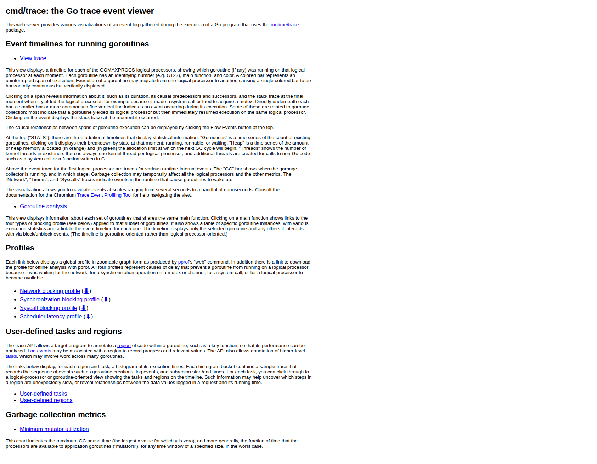
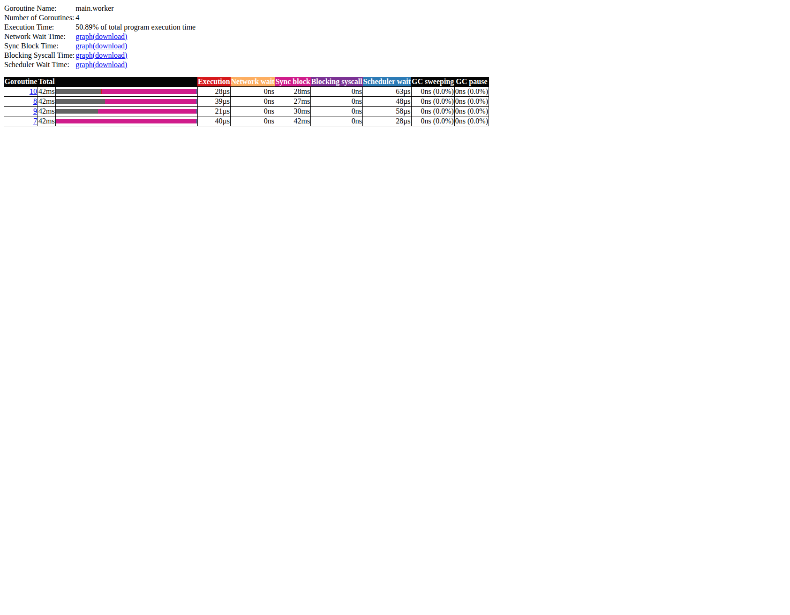
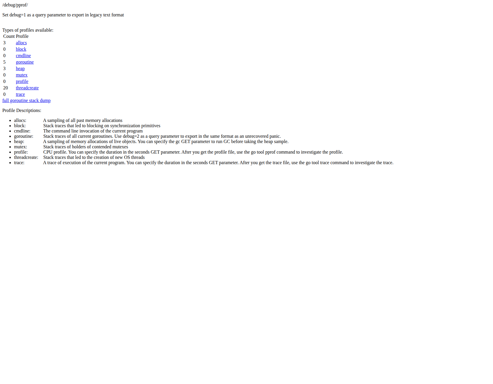
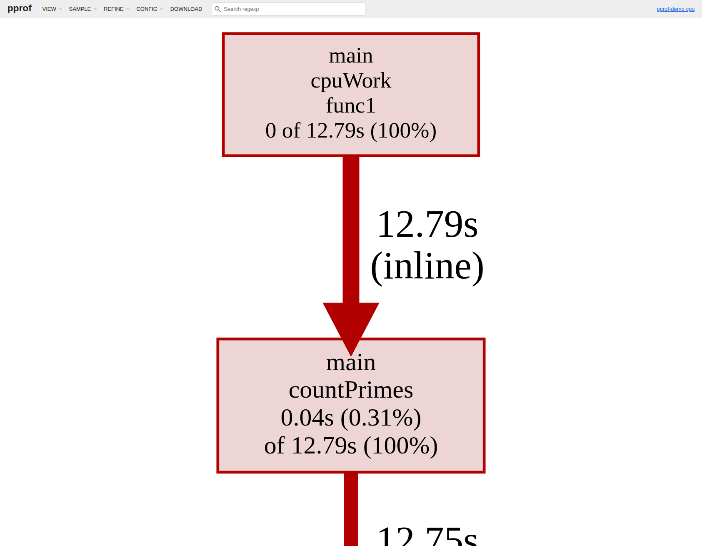
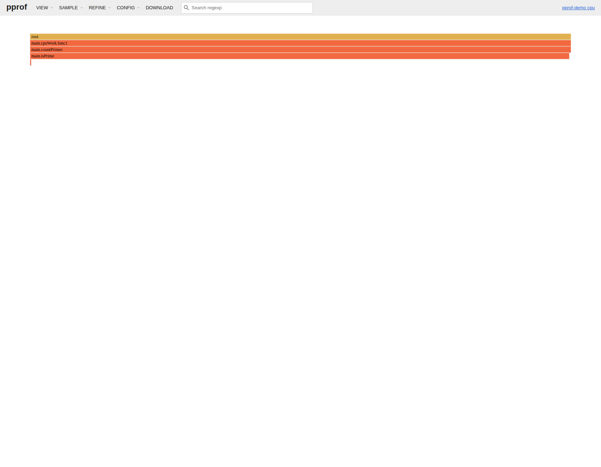
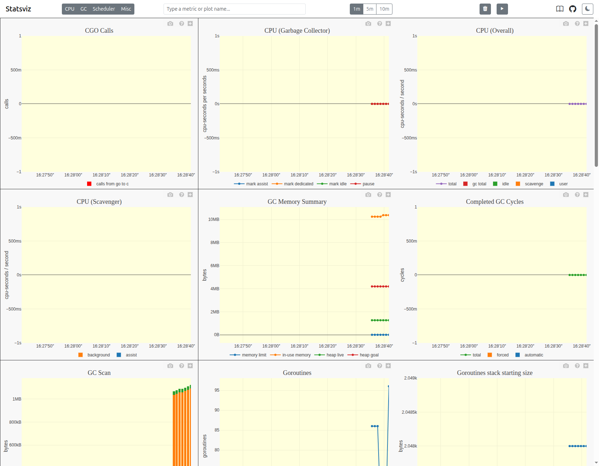
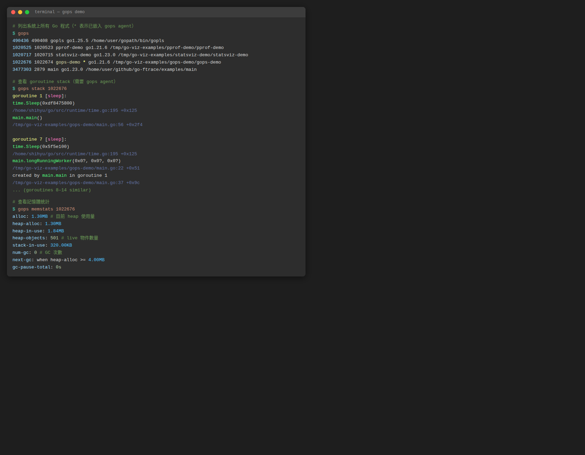
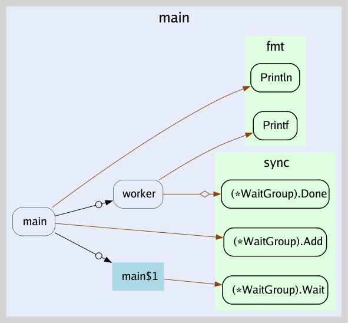
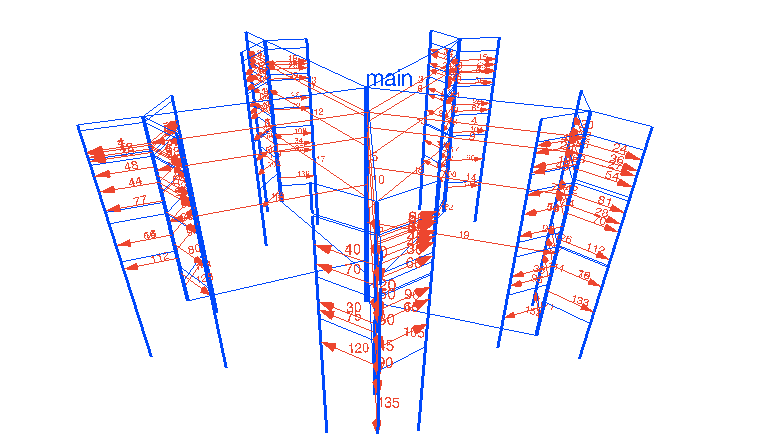

# Go 並發視覺化工具整理

Go 官方的 `go tool trace`、`go tool pprof`，加上社群的 `statsviz`、`gops`、`go-callvis`、`gotrace`，可以從不同角度觀察 goroutine 與並發結構。

---

## `go tool trace`

`runtime/trace` 搭配 `go tool trace` 產生時間軸，顯示每個 goroutine 何時執行、阻塞、等待排程，以及 GC、channel、syscall 等事件。

### 範例程式

```go
package main

import (
	"fmt"
	"os"
	"runtime/trace"
	"sync"
	"time"
)

func producer(ch chan<- int, n int) {
	for i := 0; i < n; i++ {
		ch <- i
		time.Sleep(1 * time.Millisecond)
	}
	close(ch)
}

func worker(id int, ch <-chan int, wg *sync.WaitGroup) {
	defer wg.Done()
	for v := range ch {
		time.Sleep(time.Duration(v%3) * time.Millisecond)
		_ = v * v
	}
	fmt.Printf("worker %d done\n", id)
}

func main() {
	f, _ := os.Create("trace.out")
	defer f.Close()
	trace.Start(f)
	defer trace.Stop()

	ch := make(chan int, 10)
	var wg sync.WaitGroup
	for i := 0; i < 4; i++ {
		wg.Add(1)
		go worker(i, ch, &wg)
	}
	producer(ch, 40)
	wg.Wait()
}
```

### 使用步驟

```bash
# 步驟 1：執行程式，產生 trace.out
go run main.go

# 步驟 2：用瀏覽器開啟 trace UI
go tool trace trace.out
# → 自動開啟 http://localhost:PORT/

# 步驟 3：也可以指定 port 手動開啟
go tool trace -http=:8080 trace.out
```

在測試中收集 trace：

```bash
go test -run TestXXX -trace trace.out ./pkg
go tool trace trace.out
```

### UI 畫面

**首頁**：列出可用的視圖（時間軸、goroutine 分析、blocking profile 等）



**Goroutine analysis**：點選 `main.worker` 可以看到每個 goroutine 的執行時間、Channel 阻塞時間、Scheduler 等待時間明細



### 適合用來找

- goroutine 排程延遲
- channel、鎖、syscall 導致的阻塞
- GC pause 時間

---

## `go tool pprof`

pprof 是 Go 官方 profiling 工具，收集 CPU、記憶體、goroutine、mutex 等 profile，並以火焰圖或呼叫圖呈現。

### 範例程式

在程式中加入 `_ "net/http/pprof"` 即可開啟 `/debug/pprof/` endpoint：

```go
package main

import (
	"math"
	"net/http"
	_ "net/http/pprof"
	"runtime"
	"sync"
	"time"
)

func isPrime(n int) bool {
	if n < 2 { return false }
	for i := 2; i <= int(math.Sqrt(float64(n))); i++ {
		if n%i == 0 { return false }
	}
	return true
}

func countPrimes(start, end int) int {
	count := 0
	for i := start; i < end; i++ {
		if isPrime(i) { count++ }
	}
	return count
}

func cpuWork() {
	for {
		var wg sync.WaitGroup
		step := 50000
		for i := 0; i < runtime.NumCPU(); i++ {
			wg.Add(1)
			s := i * step
			go func(s int) {
				defer wg.Done()
				_ = countPrimes(s, s+step)
			}(s)
		}
		wg.Wait()
		time.Sleep(50 * time.Millisecond)
	}
}

func main() {
	go cpuWork()
	http.ListenAndServe(":6060", nil)
}
```

### 使用步驟

```bash
# 步驟 1：執行程式
go run main.go

# 步驟 2：瀏覽器開啟 pprof 端點，確認可用的 profile 類型
# http://localhost:6060/debug/pprof/

# 步驟 3a：收集 CPU profile 並開啟互動式火焰圖 Web UI（採樣 10 秒）
go tool pprof -http=:8081 http://localhost:6060/debug/pprof/profile?seconds=10

# 步驟 3b：收集 heap profile
go tool pprof -http=:8081 http://localhost:6060/debug/pprof/heap

# 步驟 3c：查看 goroutine stack（不需要 Web UI）
curl http://localhost:6060/debug/pprof/goroutine?debug=2
```

在測試中收集 profile：

```bash
go test -run TestXXX -cpuprofile cpu.out ./pkg
go tool pprof -http=:8081 cpu.out
```

### UI 畫面

**`/debug/pprof/` 端點**：列出所有可用的 profile 類型



**呼叫圖（Graph view）**：方框大小代表 CPU 佔用比例，箭頭粗細代表呼叫頻率



**火焰圖（Flamegraph view）**：橫軸代表 CPU 時間佔比，縱軸代表呼叫深度



### 適合用來找

- CPU 熱點函式
- heap 記憶體洩漏
- goroutine leak（goroutine 數量異常增長）
- mutex 競爭

---

## `statsviz`

[statsviz](https://github.com/arl/statsviz) 是輕量套件，整合後即可在瀏覽器即時看到 Go runtime 指標折線圖，無需主動觸發 profile。

> **需要 Go 1.23+**

### 安裝

```bash
go get github.com/arl/statsviz@latest
```

### 範例程式

```go
package main

import (
	"fmt"
	"net/http"
	"runtime"
	"sync"
	"time"

	"github.com/arl/statsviz"
)

func spawnWorkers(n int) func() {
	var wg sync.WaitGroup
	quit := make(chan struct{})
	for i := 0; i < n; i++ {
		wg.Add(1)
		go func() {
			defer wg.Done()
			for {
				select {
				case <-quit:
					return
				default:
					data := make([]byte, 512)
					_ = data
					time.Sleep(10 * time.Millisecond)
				}
			}
		}()
	}
	return func() { close(quit); wg.Wait() }
}

func main() {
	mux := http.NewServeMux()
	statsviz.Register(mux)
	go http.ListenAndServe(":6060", mux)

	fmt.Println("statsviz at http://localhost:6060/debug/statsviz/")

	var stops []func()
	for round := 0; ; round++ {
		n := (round%5 + 1) * 10
		stop := spawnWorkers(n)
		stops = append(stops, stop)
		fmt.Printf("round %d: goroutines=%d\n", round, runtime.NumGoroutine())
		time.Sleep(3 * time.Second)
		if len(stops) > 2 {
			stops[0]()
			stops = stops[1:]
		}
	}
}
```

### 使用步驟

```bash
# 步驟 1：執行程式
go run main.go

# 步驟 2：瀏覽器開啟
# http://localhost:6060/debug/statsviz/
# → 圖表自動更新，不需要其他操作
```

### UI 畫面

即時顯示 Goroutines 數量、GC Memory Summary、CPU 使用率、Heap 等多個指標



### 適合用來

- 長時間觀察 goroutine 數量趨勢（是否洩漏）
- 監控 GC 頻率與 heap 大小變化
- 快速確認程式 runtime 健康狀況

---

## `gops`

[gops](https://github.com/google/gops) 是 Google 開發的命令列工具，列出系統上所有 Go 程式，並可即時查看其 goroutine stack 與記憶體狀態。

### 安裝

```bash
go install github.com/google/gops@latest
```

### 使用步驟（不需要修改程式）

```bash
# 步驟 1：列出所有 Go 程式（* 表示已嵌入 gops agent）
gops
```

不需要嵌入 agent 就能看到程式清單。

### 深層查看（需嵌入 agent）

在程式中加入 agent：

```go
package main

import (
	"log"
	"net/http"
	_ "net/http/pprof"
	"sync"
	"time"

	"github.com/google/gops/agent"
)

func longRunningWorker(id int, quit <-chan struct{}, wg *sync.WaitGroup) {
	defer wg.Done()
	for {
		select {
		case <-quit:
			return
		default:
			time.Sleep(100 * time.Millisecond)
		}
	}
}

func main() {
	// 啟動 gops agent
	if err := agent.Listen(agent.Options{}); err != nil {
		log.Fatal(err)
	}

	quit := make(chan struct{})
	var wg sync.WaitGroup
	for i := 0; i < 8; i++ {
		wg.Add(1)
		go longRunningWorker(i, quit, &wg)
	}
	go http.ListenAndServe(":6060", nil)
	time.Sleep(60 * time.Second)
	close(quit)
	wg.Wait()
}
```

```bash
# 步驟 1：執行程式
go run main.go

# 步驟 2：找到 PID（帶 * 的就是有 agent 的程式）
gops

# 步驟 3：查看 goroutine stack
gops stack <PID>

# 步驟 4：查看記憶體統計
gops memstats <PID>

# 步驟 5：觸發 CPU profile
gops pprof-cpu <PID>
```

### 輸出範例



### 適合用來

- 快速確認某個程式的 goroutine 數量
- 不重啟程式就能取得 goroutine stack snapshot
- 排查 goroutine leak 的第一步

---

## `go-callvis`

`go-callvis` 透過 pointer analysis 建構 call graph，以 Graphviz 產生互動式 SVG 圖，適合理解專案結構與找 goroutine 啟動點。需要先安裝 [Graphviz](https://graphviz.org/download/)。

### 安裝

```bash
# 安裝 go-callvis
go install github.com/ofabry/go-callvis@latest

# 安裝 Graphviz（Ubuntu/Debian）
sudo apt install graphviz
```

### 使用步驟

```bash
# 步驟 1：在專案目錄執行，自動開啟瀏覽器顯示互動式圖表
go-callvis .

# 步驟 2：或輸出成 PNG 靜態圖檔
go-callvis -format=png -file=callgraph <module-name>

# 步驟 3：指定特定 package
go-callvis github.com/your/project/cmd/server
```

### 輸出範例

以下是一個 worker pool 程式的 call graph，圓形箭頭（`o→`）代表 goroutine 啟動：



### 適合用來

- 理解大型專案的函式呼叫關係
- 找出哪些地方啟動了 goroutine
- 確認 concurrent call 路徑

---

## `gotrace`

`gotrace` 是 3D WebGL 視覺化工具，把 goroutine 與 channel 互動轉成動畫，偏教學與展示用途。



> ⚠️ **相容性警告**：gotrace 使用 Go 1.5-1.7 時代的 trace 格式，與 Go 1.8+ 產生的 trace.out **不相容**，且不支援 Go modules。目前**無法在現代 Go 環境中實際執行**，僅作為概念參考。若需要視覺化效果，建議改用 `go tool trace`。

適合說明 worker pool、fan-out、fan-in 等並發模式，讓團隊直觀理解 goroutine 的建立與阻塞。

---

## 選擇建議

| 工具 | 類型 | 適合用途 | 可用狀態 |
|---|---|---|---|
| `go tool trace` | 官方時間軸 | 排查 goroutine 排程延遲、channel/鎖阻塞、GC pause | ✅ |
| `go tool pprof` | 火焰圖 / 呼叫圖 | CPU 熱點、記憶體洩漏、goroutine leak 深層分析 | ✅ |
| `statsviz` | 即時折線圖 | 長時間監控 goroutine 數量、GC、heap 趨勢（需 Go 1.23+） | ✅ |
| `gops` | 命令列 | 快速診斷任意 Go 程式，不需事先埋點 | ✅ |
| `go-callvis` | 呼叫圖 | 理解大型專案結構、找 goroutine 啟動點 | ✅ |
| `gotrace` | 3D 動畫 | 教學、展示並發模式 | ❌ 不相容現代 Go |

**建議使用順序：**

1. `gops`：不需改程式，先確認 goroutine 數量是否異常
2. `statsviz`：嵌入後長時間觀察 runtime 指標趨勢
3. `go tool pprof`：發現異常時深挖 CPU 或記憶體熱點
4. `go tool trace`：需要時間軸細節時使用
5. `go-callvis`：要理解整體呼叫結構時補充
