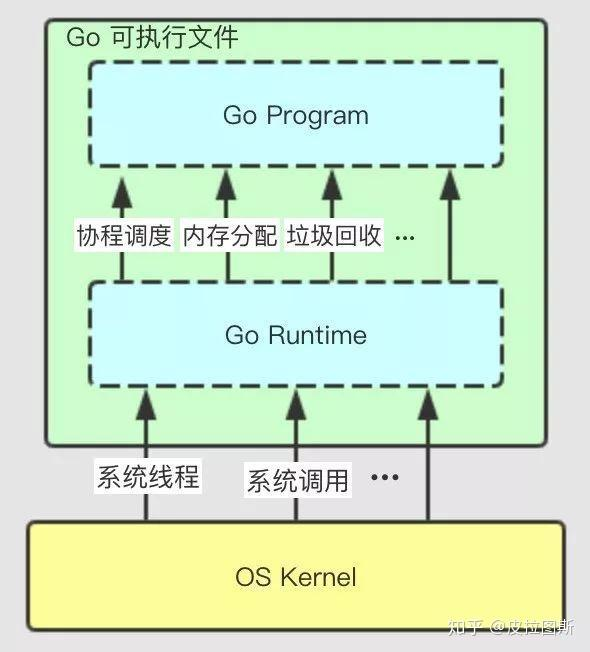
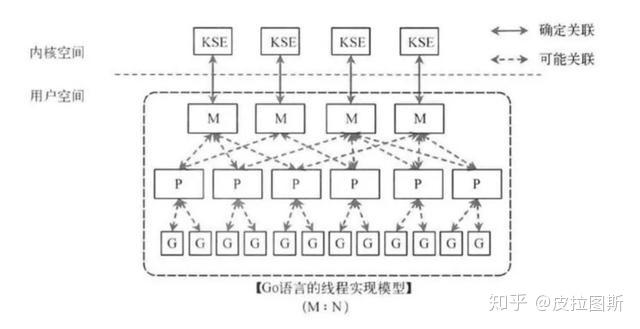
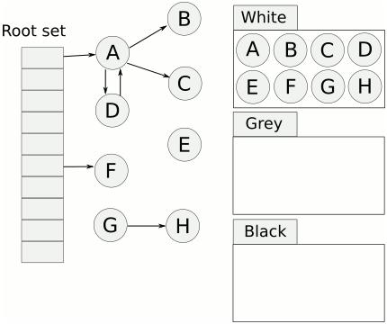
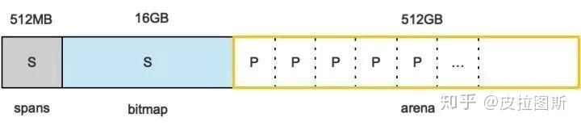

# Go Runtime 簡析

> Golang 為什麼效率高？goroutine 是怎麼執行的？Go runtime 是什麼？本文從調度、GC 與記憶體配置三個角度做快速整理。

Go 的 runtime 在語言中的地位有點像 Java 的虛擬機器，但它本身不是虛擬機器。Go 程式會被編譯成對應平台的原生可執行檔，執行時不需要額外安裝 VM。原因在於編譯階段已經把 runtime 的關鍵能力一併連結進去。

Go runtime 的核心功能包括：

1. goroutine 調度與並發執行模型
2. 垃圾回收（GC）
3. 記憶體配置
4. 支援 `pprof`、`trace`、`race` 等執行期能力
5. 實作 `channel`、`map`、`slice`、`string` 等內建型別

下圖說明 Go 程式、runtime、可執行檔與作業系統之間的關係。相較於 Java 需要仰賴 JVM，Go 的可執行檔已經包含 runtime，因此可以直接與作業系統互動，並提供調度、記憶體管理與垃圾回收能力。

## 協程調度模型

調度一直是作業系統的核心能力。從單工、多工、併發到平行，再到今天的分散式調度，整個演進都在追求更高的資源利用率。Go 的特別之處在於它把一部分調度責任從作業系統抽回 runtime，自行管理 goroutine。

Go 原生支援 goroutine。它比傳統執行緒更輕量，調度主要由 runtime 負責，這也是 Go 在高併發場景下效率突出的原因之一。

Go 在協程執行上採用的是 GMP 調度模型。核心是把 goroutine、邏輯處理器與系統執行緒做 M:N 對映，以降低切換成本並提升 CPU 利用率。

- **G**：goroutine，保存執行上下文的輕量級任務。
- **P**：processor，邏輯處理器，提供執行 goroutine 所需的本地執行環境，例如 `mcache` 與本地任務佇列。
- **M**：machine，真正對應到作業系統執行緒的運算資源。
- **全域佇列（Global Run Queue）**：尚未綁定到某個 P 的 goroutine 會放在這裡。
- **本地佇列（Local Run Queue）**：每個 P 都有自己的佇列，可優先執行本地 goroutine。
- **sysmon**：runtime 背景監控協程，定期檢查 goroutine 與 processor 狀態，避免長時間佔用 CPU。

## 垃圾回收（GC）

垃圾回收是語言執行期的重要能力，直接影響程式的穩定性與長時間運作表現。像 Java、Python 都有自己的垃圾回收機制，Go 也不例外，因此開發者不需要像 C 或 C++ 那樣手動管理大部分記憶體生命週期。

### 常見垃圾回收算法

1. **引用計數（Reference Counting）**：每個物件都維護引用次數，當引用數降到 0 時就能回收。Python 主要使用這種方式，但需要額外處理循環參照問題。
2. **標記清除（Mark and Sweep）**：從根物件出發追蹤所有可達物件，未被引用的物件稍後再清除。這種方法能處理循環參照，但常伴隨 STW（Stop The World）成本。
3. **複製收集（Copying Collection）**：把記憶體分成兩塊，每次只使用其中一塊，回收時把存活物件複製到另一塊，以減少碎片並整理空間。

### Go 的三色標記法

Go 的 GC 建立在標記清除法之上，並透過三色標記與寫屏障降低 STW 對延遲的影響。

三色標記會把物件分成白、灰、黑三種狀態：

1. 白色：尚未被存取的物件，可能成為回收目標。
2. 灰色：已被存取，但其參照的子物件還沒掃描完成。
3. 黑色：已被存取，且其子物件都已完成掃描。

典型流程如下：

1. 起始時所有物件都是白色。
2. 從 root 出發，把可達物件標記成灰色。
3. 逐步掃描灰色物件，將其參照到的物件標記成灰色，自己轉成黑色。
4. 當灰色佇列清空後，剩下的白色物件就是不可達物件，可進入回收階段。

相較於傳統標記清除，三色標記能把大部分標記工作改成與應用程式併行執行，因此 STW 時間更短。

### 寫屏障

標記與程式執行併行時，若黑色物件新增了一個指向白色物件的參照，就可能出現誤回收。寫入屏障的作用，就是在記憶體寫入時維持三色不變性，避免黑色物件直接持有未被正確追蹤的白色物件。

### GC 觸發條件

1. 當前記憶體配置量達到觸發比例。
2. 一段時間內沒有發生 GC 時，runtime 會主動觸發。
3. 手動呼叫 `runtime.GC()`。

## 記憶體配置

### TCMalloc 概念

TCMalloc（Thread Caching Malloc）是 Google 為 C/C++ 場景設計的高效記憶體配置器。它透過多級快取降低鎖競爭，而 Go runtime 的記憶體配置設計也借鏡了這種分層管理思路。

### Go 記憶體配置概念

Go 程式啟動後，會先向作業系統申請一段虛擬位址空間，再由 runtime 自行切分與管理。整體可分成三個主要區域：`spans`、`bitmap`、`arena`。

1. **arena**：堆區，動態配置的物件主要位於這裡。runtime 會把記憶體切成 8 KB 頁，並組合成 `mspan` 作為基本管理單位。
2. **bitmap**：記錄堆中哪些位置存放物件、物件是否含有指標，以及 GC 標記資訊。
3. **spans**：保存 `mspan` 的指標，讓 runtime 能快速定位實際管理的記憶體區塊。

## 參考資料

1. [深入淺出 Golang Runtime](https://zhuanlan.zhihu.com/p/95056679)
2. [golang 中的 runtime 包教程](https://studygolang.com/articles/13994?fr=sidebar)
3. [Go 垃圾回收机制剖析](http://www.pianshen.com/article/168671039/)
4. [12 Go 并发调度器模型](https://www.jianshu.com/p/5df0a7e118d8)
5. [三色标记](https://studygolang.com/articles/12062)
6. [图解 Go 语言内存分配](https://zhuanlan.zhihu.com/p/59125443)
7. [图解 TCMalloc](https://zhuanlan.zhihu.com/p/29216091)
8. [Visualizing memory management in Golang](https://deepu.tech/memory-management-in-golang/)
9. [Go: What Does a Goroutine Switch Actually Involve?](https://medium.com/a-journey-with-go/go-what-does-a-goroutine-switch-actually-involve-394c202dddb7)
