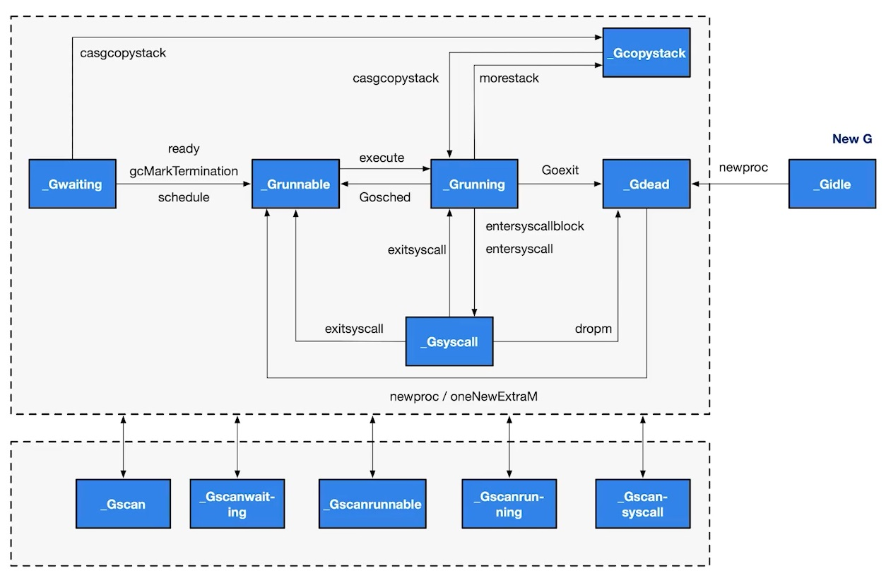

# Golang Goroutine 與 GMP 原理全面分析

最近在研讀 Kubernetes ，所以得好好地跟 golang 這個語言當朋友，看著看著看到了 goroutine ，但是始終不解 goroutine 是哪來幹嘛、為何而生的？所以我們在開始深入認識 goroutine 之前，我們可能要先來認識一下歷史，這樣我們才能更全面的認識 goroutine 的原理與設計思想。

# Golang 調度器的由來

## 單進程時代

我們都知道軟體是跑在操作系統之上的，真正來計算的人是 CPU，早期的操作系統每個程序就是一個進程，直到一個程序運行完畢之後，才能運行下一個進程。

假設有三個進程，分別為 A 、 B 與 C ，那麼在 CPU 上的調度就是依照執行順序執行。

```
Example: A -> B -> C
```

但是在這樣的單進程操作系統時代，會面臨以下的問題：

1. 每次只能執行一個進程，計算機只能一個任務一個任務的執行。
2. 若進程發生了 IO 操作堵塞時，容易造成 CPU 資源的浪費。

於是就誕生了多進程 / 多線程 的操作系統。

## 多進程 / 多線程時代

在多進程 / 多線程德操作系統中，就解決掉了阻塞的問題，因為一個進程阻塞 CPU 就可以立刻切換到其他進程中去執行，而且調度 CPU 的算法可以保證運行的進程，都可以分配到 CPU 的運行分片，從宏觀的角度來看，似乎多個進程是同時在運行的，相信會有同學不清楚 CPU 的調度原理不清楚的話，可以查看一下 [CPU 調度原理](https://bbs.huaweicloud.com/blogs/288296)。

多個進程在分配 CPU 的運行時間片的時候，一切看起來沒問題的，但是工程師們又發現了新的問題，進程在創建、切換、銷毀，都會佔用很長得時間，CPU 的利用率雖然起來了，但是進程過多時，CPU 會有很大一部分的時間都會被用來運行切換進程。

那麼進程在切換的時候，會造成那些開銷呢？

### 進程切換開銷

- 直接開銷
  - 切換頁表全域性目錄 (PGD)
  - 切換 Kernel 堆疊
  - 切換硬體上下文 (進程恢復之前，必須裝入戰存器的資料，統稱為硬體上下文)
  - 重新整理 TLB
  - 系統調度器的代碼執行
- 間接開銷
  - CPU 緩存失效導致進程需要用到內存直接訪問的 IO 操作變多

所以我們該如何才能提高 CPU 的利用率呢？

## 協程來提高 CPU 利用率

聰明的工程師們就發現，其實線程分為內核態線程 (Kernel Thread) 與用戶態線程 (User Thread)，而一個「用戶態線程」必須綁定一個「內核態線程」，但是 CPU 不會知道有「用戶態線程」的存在，他只知道他運行的是一個「內核態線程」 (Linux PCB 進程控制塊)。

那麼我們能不能在用戶態創建維護一個輕量級的協程 (co-routine)，讓多個輕量級的線程綁定到同一個內核態線程上？如果一個內核態線程分到一個運行的時間片之後，那我是不是能在有效的時間內，把用戶態堆積的所有協程都執行完成呢？然後再把 CPU 交出去，那這樣是不是整個執行效率會高很多呢？

所以這就是 Go 語言線程調度遵循的一些原則，那我們來看看 Goroutine。

## Goroutine

Goroutine 就是 Go 語言的協程概念，Go 語言基於 GMP 模型實現用戶態線程

- Goroutine ： 表示 goroutine ，每個 goroutine 都有自已的 stack 空間、定時器，初始化的 stack 大小在 2k 左右，空間會隨著需求增長。
- Machine ： 抽象化代表內核線程，紀錄內核線程 stack 信息，當 goroutine 調度到線程時候，使用該 goroutine 自己的 stack 信息。
- Process ： 表示調度器，負責調度 goroutine ，維護一個本地 goroutine 對列，並且把對列跟 M 綁定，讓 M 從 P 上獲得 goroutine 並執行，同時還負責部分記憶體管理。


### MPG 的對應關係

- KSE: Kernel Scheduling Entity
- M 我們可以理解跟 Kernel Task 一對一對應
- 一個 P 上面可以有多個 G，P 會去識當前狀態來決定要跟哪個 M 來綁定，比如說一個 M 已經陷入到內核態，而 P 就有可能換主，去找其他 M 執行。


###  GMP 模型細節


- LRQ： local run queue
- GRQ： global run queue
- sudog： 阻塞 queue
- gFree： 全局自由 G 列表
- pidle： 全局空閒 P 列表

以下真的上圖的一些細節展開贅述：

- 假設 go 語言在主程序，起了多個 goroutine ，那麼在啟動的過程中，會有一個參數可以設定， go 可以運行多少個併發的現程，一般而言，會看你的節點上有多少個 CPU 併發數就是多少，所以在初始化的過程中，就會按照你的設定數量去初始化 P 。
- 當 go 語言開始執行了，那其實 go 語言的 main 方法，本身也是一個 goroutine ，所以他就會被落到一個 P 上，那麼這個 main 方法又起了很多個 goroutine ，那麼他就會在當前的 P 上掛載多個 G ，所以在這一刻， P 上會有一堆排隊的 G ，這時候，還沒充分的利用多核心的優勢，因為 G 都掛載在同一個 P 上，但是其他的 P 不可能空手啥事都不幹，這樣未免也太浪費 CPU 了吧！
- 如果 P 已經空手了，那麼他就會去看 GRQ ，如果還是沒有，他就會去看看其他的 P 是不是有 G 可以執行，假設他發現第一個 P 有正在對列的 G ，那麼他就會拿取一半的 G 過來運行，但是所有的 P 都有這個機制，所以很快的堆積的 G 就被消化完畢。
- 但是會不會有一種狀況發生，我創建了一堆 G ，超出了 LRQ 的長度 (默認 256)，那麼這個 G 就會放到 GRQ 內。
- 如果 M 陷入內核態了，那麼 P 就會跟 M 斷開綁定關係， P 就會取找說 哪個 M 是空閒的，並且跟他綁定在一起。
- 如果一個 G 產生了阻塞，那處於 wait 狀態的 G ，就會被丟到 sudog 阻塞對列裡，他不跟任何的 P 產生綁定關係。
- 如果 G 已經完成運行後，他會把自己放到 gFree 去，這樣就可以重複使用 G ，減少開銷。

#### P 的狀態


- _Pidle： 處理器沒有運行用戶代碼或者調度器，被空閒對列或者改變其狀態的結構持有，運行對列為空。
- _Prunning： 被線程 M 持有，並且正在執行用戶代碼或者調度器。
- _Psyscall： 沒有執行用戶代碼，當前線程陷入系統調用。
- _Pgcstop： 被線程 M 持有，當前處理器於垃圾回收被停止。
- _Pdead： 當前處理器已經不被使用。

#### G 的狀態



- _Gidle： 剛剛被分配，並且還沒被初始化，值為 0 ，為創建 goroutine 後的默認值。
- _Grunnable： 沒有執行代碼，沒有 stack 的所有權，存儲在運行對列中，可能在某個 P 的本地對列或者全局對列中。
- _Grunning： 正在執行代碼的 goroutine，擁有 stack 的所有權。
- _Gsyscall： 正在執行系統調用，擁有 stack 的所有權，與 P 脫離，但是與某個 M 綁定，會在調用結束後，被分配到運行對列。
- _Gwaiting： 被阻塞的 goroutine，阻塞在某個 channel 的發送或者接收對列。
- _Gdead： 當前 goroutine 未被使用，沒有執行代碼，可能有分配的 stack ，分佈在空閒列表，可能是一個剛初始化 goroutine ，也可能是執行 goexit 退出的 goroutine。
- _Gcopystac： stack 正在被拷貝，沒有執行代碼，不在運行對列上，執行權在。
- _Gscan： GC 正在掃描 stack 空間，沒有執行代碼，可以與其他狀態同時存在。

### 調度器行為

- 為了保證公平，當 GRQ 中有待執行的 G 時候，通過 schedtick 保證有一定的機率 (1/61)，會從 GRQ 中查找 G。
- 從 P 的 LRQ 中查找待處理的 G。
- 如果前面兩種都沒找到 G，會通過 runtime.findrunnable 進行阻塞查找 G。
  - 從 LRQ 、 GRQ 中查找。
  - 從網路輪詢器中查找是否有 G 等待運行。
  - 通過 runtime.runqsteal 嘗試從其他隨機的 P 中竊取一半的 G。

# 總結

好久沒看那麼硬的知識了，但我總覺得我今天會消化不良，我需要反反覆覆在看個好幾次，看完之後你的心得如何呢？

歡迎到我的 Facebook [Alan 的筆記本](https://www.facebook.com/alanzhan0513) 留言，順手給我個讚吧！你的讚將成為我持續更新的動力，感謝你的閱讀，讓我們一起學習成為更好的自己。

## 參考

- [Golang的協程調度器原理及GMP設計思想？](https://github.com/aceld/golang/blob/main/2、Golang的協程調度器原理及GMP設計思想？.md)

## 