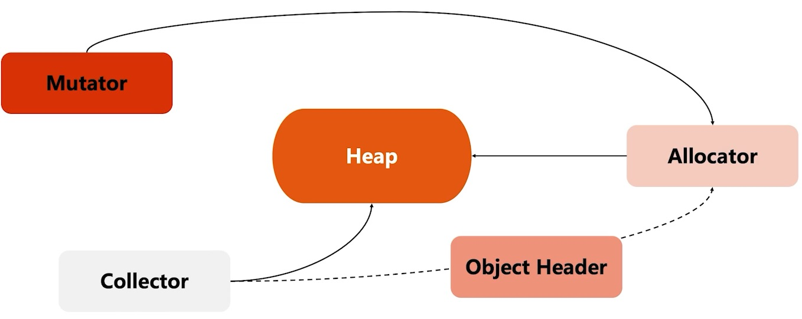
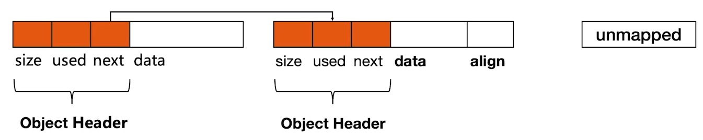
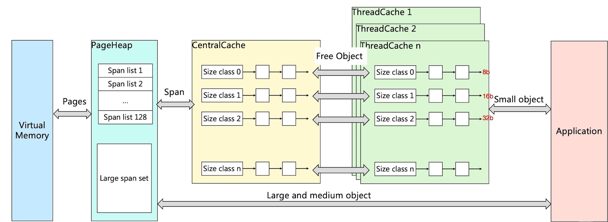
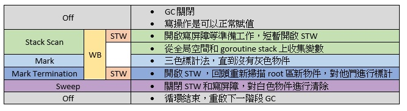

# Golang 記憶體管理 GC 全面解析

出處 : https://alanzhan.dev/post/2022-02-13-golang-memory-management/

# 記憶體管理的爭論

關於記憶體管理，往往都會討論到一個持續很久的爭論，就是記憶體到底要給誰管？給機器管？還是給人管？不管是機器管或者是人管，大家的初衷都是一致的，認為記憶體管理是非常重要的，但大家的意見還是分歧了：

- c / c++ ：認為記憶體管理如此重要，所以我希望把記憶體管理的自由交付給工程師，因為這些人我相信他的技能非常的強，他知道甚麼時候該申請記憶體，甚麼時候該釋放記憶體。
- Java / .Net(C#) / golang / etc ：它們觀點卻站在反面，目的雖然一樣，認為記憶體管理如此重要，但是我們不能相信人，我希望通過自動化的方式管理記憶體。

我們可以思考一下這兩者的差異，當然 c / c++ 記憶體使用與釋放的效率非常的高，因為工程師知道我的記憶體甚麼時候不用，我直接把他 free 掉，但是人總是會犯錯，如果有人忘記釋放記憶體，那麼就會導致記憶體洩漏，最終導致程式崩潰。

在越是年輕的語言，在追求的反而是開發的效率，希望可以通過一種自動化的方式管理記憶體，減少人為的錯誤，使得開發的效率變高，所以記憶體的管理反而變得十分的重要，那麼記憶體管理會面臨哪些挑戰呢？

# Heap 記憶體管理的挑戰

- 記憶體分配需要系統調用，在頻繁記憶體分配的時候，系統性能較低。
- 多線程共享相同的記憶體空間時，同時申請記憶體，需要加鎖，否則會產生同一塊記憶體被多個線程訪問的狀況。
- 記憶體碎片化的問題，經過不斷的記憶體分配與回收，記憶體碎片會比較嚴重，記憶體的使用效率會降低。

所以這是 c / c++ 這些比較傳統的語言，假如自己去申請 heap 記憶體，如果不做處理，可能會引發的問題。

# Heap 記憶體管理

那麼現在的語言要怎麼解決這種問題呢？

假設 heap 是目前的所擁有的 heap 記憶體，針對這個 heap 的管理主要會有三個角色跟次要輔助用的 Header：

- Allocator ： 記憶體的分配器，主要動態處理記憶體的分配請求，程式啟動時 Allocator 會在初始化的時候，預先向操作系統申請記憶體，接下來可能會先記憶體做一定的格式化。
- Mutator ： Mutator 可以理解為我們的程式，Mutator 只要負責跟 Allocator 申請記憶體就好，他不需要顯式的去釋放(回收)記憶體。
- Collector ： 垃圾回收器，回收記憶體空間，他會去掃描整的 heap 記憶體，哪些是活躍物件，那些是非活耀物件，當發現非活耀，就會回收記憶體。
- Object Header ： 當記憶體分配出去時，同時會對這塊記憶體做標記，用來標記物件的， Collector 和 Allocator 會來同步物件 Metadata。

大家可以根據上面的敘述稍微順一下，那麼我們就來看看 golang 怎麼處理的：

- 初始化連續記憶體作為 heap 。
- 有記憶體申請的時候，Allocator 從 heap 記憶體的未分配區塊切割小記憶體塊。
- 用鏈表將以分配的記憶體連接起來。
- 需要描述每個記憶體塊的 metadata ，大小、是否使用、下一塊記憶體位置等。

##  TCMalloc

golang 這門語言的記憶體管理是基於 TCMalloc 基礎上進行設計的，所以在認識 golang 記憶體管理之前，先梳理一下 TCMalloc (Thread Cache Malloc) 的原理。

我們先回想剛剛所講述的記憶體管理會面臨哪些挑戰，[Heap 記憶體管理的挑戰](https://alanzhan.dev/post/2022-02-13-golang-memory-management/#heap-記憶體管理的挑戰)

- 記憶體分配需要系統調用，在頻繁記憶體分配的時候，系統性能較低。
  - 所以 TCMalloc 會先去申請記憶體並且預分配記憶體。
- 多線程共享相同的記憶體空間時，同時申請記憶體，需要加鎖，否則會產生同一塊記憶體被多個線程訪問的狀況。
  - 可以看到 ThreadCache 那個區塊，他為了每一個 thread 維護了一塊 ThreadCache ，而且每一個都是線程獨立的記憶體空間，也就是說，當 application 要申請記憶體的時候，他會優先向 ThreadCache 申請，也因為 ThreadCache 各自維護了各自的記憶體，所以 application 要申請記憶體的時候，不需要加鎖去申請。
  - 如果 ThreadCache 把記憶體用盡了怎魔辦？他會去向 CentralCache 申請記憶體，但是這個時候需要加鎖，但是聰明的你已經發現，加鎖的可能性已經變低了。
  - 如果 CentralCache 也沒有空間了，他就會向 PageHeap 申請空間。
  - 如果 PageHeap 也沒有空間了，他就會向 VirtualMemory 申請更多記憶體。

所以 TCMalloc 解決了記憶體管理會面臨的挑戰以及記憶體的逐級申請機制，那我們在想一下，假設 application 都向 ThreadCache 申請記憶體，而且都不管物件大小，拿來就用，那這不就意味著記憶體管理是很混亂的嗎？

TCMalloc 對於這種混亂的場景又做了增強，他把記憶體分為不同等級 (Size Class)，首先他申請記憶體的動作還按照一個頁一個頁去申請的，但是這個頁的大小是 8K，他會把申請的記憶體，按照不同的 Size Class (每個 Size Class 都會對應一個大小，譬如 8 byte、16 byte) 劃分，總共劃分了 128 種，而相同的大小 Size Class 會組成 Span list，假如 application 去申請一個 byte ，TCMalloc 就會從 Size Class 0 分配記憶體給 application，這是小物件的狀態，但是如果申請大物件的時候，會跳過 ThreadCache 與 CentralCache 去跟 PageHeap 申請記憶體，這就是 TCMalloc 的實現原理。

- page : 記憶體頁，一塊 8K 大小。 golang 與操作系統之間的記憶體申請與釋放，都是以 page 為單位。
- span : 記憶塊，一個或多個連續的 page 組成一個 span。
- sizeclass : 空間規格，每個 span 都會帶有一個 sizeclass，標記 span 中的 page 應該如何使用。
- object : 物件，用來存儲一個變數數據的記憶體空間，一個 span 在初始化的時候，就會被切割成一堆等大的物件。假設 object 的大小為 16B ， span 大小為 8K ，那麼 span 中的 page 就會被初始化為 8K / 16B = 512 個 object，當 application 來申請的時候，就是分配一個 object 出去。
- 物件大小定義
  - 小物件 : 0 ~ 256KB
  - 中物件 : 256KB ~ 1MB
  - 大物件 : > 1MB
- 小物件分配流程 ： ThreadCache -> CentralCache -> HeapPage，大部分時候， ThreadCache 的緩存都是足夠的，不需要去訪問 CentralCache 和 HeapPage，無須加鎖，所以分配效率是很高的。
- 中物件分配流程 ： 直接在 PageHeap 中挑選適當大小的即可，128 Page 的 Span 保存的就是最大的 1MB。
- 大物件分配流程 ： 從 large span set 選擇合適數量頁面組成 span ，用來存儲數據。

## Golang 記憶體分配

golang 記憶體分配基本上與 TCMalloc 一致，它是在 TCMalloc 在原型上修改與增強，看下面這張圖會看起來很像 TCMalloc，但是還是有一些差異的。

- 在 mcache 內一個 span class 對應兩個 span class ，一個是用來存指針的，一個是用來存直接引用的，存直接引用的 span 無須 GC。
- 當 mcache 記憶體不夠的時候，會向 mcentral 申請，會優先去 nonempty 的鏈找，因為 nonempty 保存的是這邊有可用的 page，如果還是找不到，就會去 mheap 申請。
  - 補充 ： mcache 從 mcentral 獲取和歸還 span 。
    - 獲取時，上鎖，從 nonempty 鏈表找到一個可用的 span，並且將其從 nonempty 鏈表刪除，將取出的 span 加入到 empty 鏈，將 span 返回給工作線程，解鎖。
    - 歸還時，上鎖，將 span 從 empty 鏈中刪除，將 span 加入到 nonempty 鏈，解鎖。
- 在 meap 內依照 Span Class 維護了一個 Binary Sort Tree ，但是他維護了兩棵樹。
  - free ： free 中保存的 span 是空閒的，非垃圾回收的 span。
  - scav ： scav 中保存的是空閒的，並且已經垃圾回收的 span。
  - 如果是垃圾回收導致 span 的是放，sapn 會被加入到 scav 中，否則會被加入到 free ，比如剛從 Virtual Memory 申請的記憶體。

- mcache : 小物件的記憶體分配。
  - size class 總共有 67 個，而 class = 0 是特殊的 span，用於大於 32 kb 的物件，每個 class 兩個 span 。
  - span 大小是按照 8KB ，按照 span class 大小切分。
- mcentral
  - 當 mcache 的 span 內所有記憶體塊都被佔用的時候， mcache 會向 mcentral 申請一個 span， mache 拿到 span 後繼續分配物件。
  - 當 mcentral 向 mcache 提供 span 時，如果沒有符合的 span ， mcentral 會向 mheap 申請 span。
- mheap
  - 當 mheap 沒有足夠的記憶體時，mheap 會向 OS 申請記憶體。
  - mheap 維護 span 不再是鏈表了，而是 Binary Sort Tree 。
  - heap 會進行 span 的維護，它包含了地址 mapping 和 span 是否包含指針 metadata，目的是為了更高效的分配、回收與再利用。

# 記憶體回收

## 常見記憶體回收策略

### 引用計數

- 常見語言 ： Python 、 PHP 、 Swift
- 特性 ： 對每一個物件維護一個引用計數，當引用該物件的物件被銷毀時，引用計數就減 1 ，當引用計數為 0 時，就回收該物件。
- 優點 ： 物件可以很快的被回收，不會出現記憶體耗盡或者達到某個閥值才回收。
- 缺點 ： 不能很好的處理循環引用，而且維護引用計數，也有一定的代價。

### 標記清除

- 常見語言 ： golang
- 特性 ： 從根變數開始遍歷檢查所有引用物件，引用物件被標計為「被引用」，沒有被標記的就進行回收。
- 優點 ： 解決引用技術的缺點。
- 缺點 ： 需要 STW (Stop the world)，即要暫停程式運行。

### 分代收集

- 常見語言 ： Java 、 .Net(C#) 、 Nodejs (Javascript)
- 按照生命週期進行劃分不同代空間，生命週期較長的放入老生代，短的放入新生代，新生代的回收頻率會高於老生代的頻率，通常會被分為三代。
  - Young ： 或者被稱為 eden ，存放新創的物件，物件生命週期非常的短，幾乎用完就可以被回收。
  - Tenured ：或者被稱為 old ， 在 Young 區多次回收後存活下來的物件，將被移轉到 Tenured 區。
  - Perm ： 永久代，主要存加載類的資訊，生命週期較長，幾乎不會被回收。
- 優點 ： 大部分的物件都是朝生夕死的，所以可以更高效的清除用完即丟的物件。
- 缺點 ： 演算法較為複雜，執行的步驟較多。

## Golang GC 工作流程

golang GC 的大部分處理是和用戶程式碼並行的，大致上分為四個步驟，基本上就是標記與清除 Mark 與 Sweep。

- Mark
  - Mark Prepare : 初始化 GC 任務，包括開啟屏障 (WB : write barrier) 和輔助 GC (mutator assis)，和統計 root 物件的任務數量等，這時候需要 STW (stop the world)。
  - GC Drains : 掃描所有的 root 物件，包括全局指針和 goroutine (G) stack 上的指針 (掃描對應的 G 時，需要停止該 G)，將其加入標計對列 (灰色對列)，並循環處理灰色對列的物件，直到灰色對列為空，這個過程是背景並行處理的。
- Mark Termination : 完成標計工作，重新掃描全局指針和 stack。因為 Mark 和用戶的程式是併行的，所以在 Mark 過程中也有可能會有新的物件和指針賦值，這個時候需要通過屏障記錄下來，然後在 rescan 檢查一下，這個過程也是會 STW 的。
- Sweep : 按照標記結果回收所有白色對象，這個過程是背景平行處理的。
- Sweep Termination : 對未清理的 span 進行清理，只有上一輪的 GC 清理完畢，才會開始新一輪的 GC 。

## 三色標計法

- GC 開始時，默認所有的 object 都是垃圾，所以都是白色。
- 從 root 區開始遍歷查找，被找到的物件會被標計為灰色。
- 從所有灰色的 物件，將他們內部引用的變數標記為灰色，自己則標計為黑色。
- 循環上面的步驟，直到沒有灰色的物件，只剩下黑白兩種，白色的都是垃圾。
- 對於黑色的物件，如果在標記期間發生寫操作，寫屏障會在真正賦值前將物件標計為灰色。
- 標記過程中，mallocgc 新分配的物件，會先被標計為黑色再返回。

## Golang 垃圾回收觸發機制

- 記憶體分配量達到閥值觸發 GC
  - 每次記憶體分配都會檢查當前記憶體分配量，是否已經達到閥值，如果達到閥值則會立即啟動 GC。
    - 閥值 = 上次 GC 記憶體分配量 * 記憶體增長量。
    - 記憶體增長量，由環境變數 GOGC 控制，默認為 100，即每當記憶體擴大一倍的時候，啟動 GC。
- 定期觸發 GC
  - 默認情況下，每兩分鐘觸發一次 gc，這個間隔在 src/rumtime/proc.go:forcegcperiod 變數中被宣告。
- 手動觸發
  - 程式代碼中，也可以使用 runtime.GC() 來手動觸發GC。這個主要用於測試 GC 性能和統計。

# 總結

從[上一篇](https://alanzhan.dev/post/2022-01-24-golang-goroutine)讀了那麼硬的知識後，今天來挑戰記憶體管理的歷史到 golang 的記憶體管理相關知識，讀完之後覺得有點痛苦，但是這將會化身成為我們成長的一大養分不是嗎？看完之後你的感想為何呢？

歡迎到我的 Facebook [Alan 的筆記本](https://www.facebook.com/alanzhan0513) 留言，順手給我個讚吧！你的讚將成為我持續更新的動力，感謝你的閱讀，讓我們一起學習成為更好的自己。

## 參考

- [Writing a Memory Allocator](http://dmitrysoshnikov.com/compilers/writing-a-memory-allocator/)
- [TCMalloc : Thread-Caching Malloc](http://goog-perftools.sourceforge.net/doc/tcmalloc.html)
- [tcmalloc 介紹](http://legendtkl.com/2015/12/11/go-memory/)
- [圖解 TCMalloc](https://zhuanlan.zhihu.com/p/29216091)
- [年度最佳【golang】內存分配詳解](https://studygolang.com/articles/30505)
- [常見的幾種垃圾回收演算法，背就完了~](https://www.gushiciku.cn/pl/arPC/zh-tw)