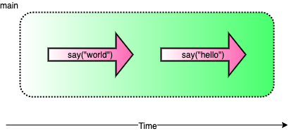
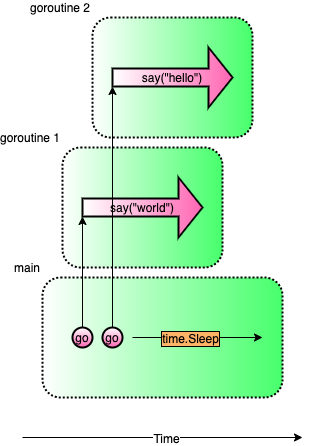
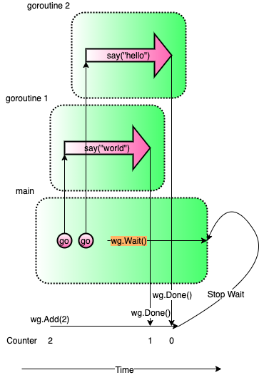
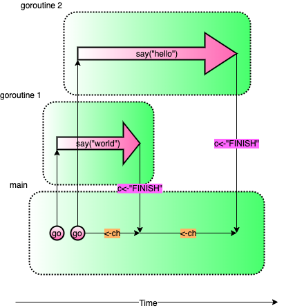
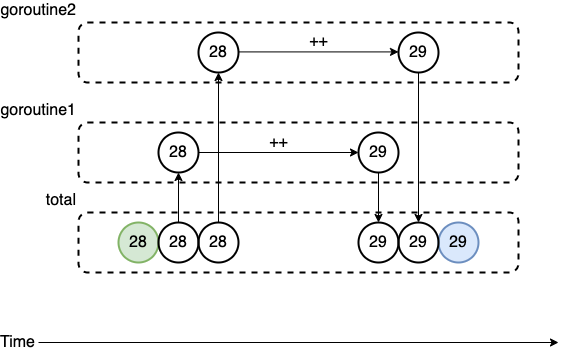
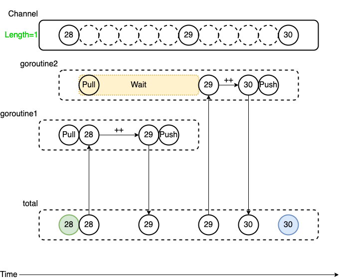
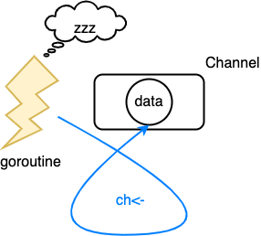
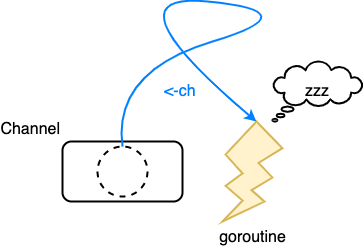
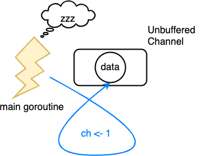
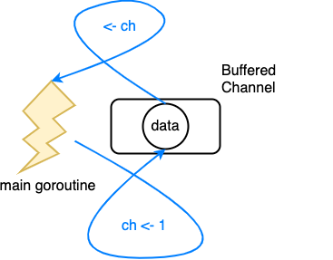

# Go 的並發：Goroutine 與 Channel 介紹

Goroutine 像是 Go 語言的 thread, 使 Go 建立多工處理, 搭配 Channel 使 Goroutine 操作簡單化, 本文介紹 Goroutine 及 Channel 的使用方式。

> 範例程式碼可以在 [golang-concurrency-example](https://github.com/peterhpchen/golang-concurrency-example) 中找到，每個程式第一行可以找到其範例檔名。

## 單執行緒

在單執行緒下，每行程式碼都會依照順序執行。

```go
// single-thread.go
func say(s string) {
    for i := 0; i < 5; i++ {
        time.Sleep(100 * time.Millisecond)
        fmt.Println(s)
    }
}

func main() {g
    say("world")
    say("hello")
}
world
world
world
world
world
hello
hello
hello
hello
hello
```

上例會先執行完 `say("world")` 後再執行 `say("hello")`。



但有時個別方法的處理是沒有先後順序的，這時善用多執行緒就可以大大的提升效率。

## 多執行緒

在多執行緒下，最多可以同時執行與 CPU 數相等的 Goroutine。

```go
// multi-thread.go
func main() {
    go say("world")
    say("hello")
}
world
hello
hello
world
world
hello
hello
world
world
hello
```

如此一來, `say("world")`會跑在另一個執行緒(Goroutine)上，使其並行執行。


> CPU 數可以使用 `runtime.NumCPU()` 取得。

## Goroutine 介紹

可以想成建立了一個 Goroutine 就是建立了一個新的 Thread。

```go
go f(x, y, z)
```

- 以 `go` 開頭的函式叫用可以使 `f` 跑在另一個 Goroutine 上
- `f`, `x`, `y`, `z` 取自目前的 goroutine
- `main` 函式也是跑在 Goroutine 上
- Main Goroutine 執行結束後, 其他的 Goroutine 會跟著強制關閉

## 等待

多執行緒下，經常需要處理的是執行緒之間的狀態管理，其中一個經常發生的事情是**等待**，例如A執行緒需要等B執行緒計算並取得資料後才能繼續往下執行，在這情況下**等待**就變得十分重要。

### 應該等待的時機

```go
func main() {
    go say("world")
    go say("hello")
}
```

這個狀態下會有三個 Goroutine:

- `main`
- `say("world")`
- `say("hello")`

這裡的問題發生在 `main` Goroutine 結束時，另外兩個 `say` Goroutine 會被強制關閉導致結果錯誤，這時就需要等待其他的 Goroutine 結束後 `main` Goroutine 才能結束。

接下來會介紹三種等待的方式，並且分析其利弊：

- `time.Sleep`: 休眠指定時間
- `sync.WaitGroup`: 等待直到指定數量的 `Done()` 叫用
- Channel 阻塞: 使用 Channel 阻塞機制，使用接收時等待的特性避免執行緒繼續執行

#### time.Sleep

使 Goroutine 休眠，讓其他的 Goroutine 在 main 結束前有時間執行完成。

```go
// sleep.go
func main() {
    go say("world")
    go say("hello")

    time.Sleep(5 * time.Second)
}
```



缺點：

- 休息指定時間可能會比 Goroutine 需要執行的時間長或短，**太長會耗費多餘的時間，太短會使其他 Goroutine 無法完成**

#### sync.WaitGroup

```go
// wait-group.go
func say(s string, wg *sync.WaitGroup) {
    defer wg.Done()

    for i := 0; i < 5; i++ {
        time.Sleep(100 * time.Millisecond)
        fmt.Println(s)
    }
}

func main() {
    wg := new(sync.WaitGroup)
    wg.Add(2)

    go say("world", wg)
    go say("hello", wg)

    wg.Wait()
}
```



- 產生與想要等待的 Goroutine 同樣多的 `WaitGroup` Counter
- 將 `WaitGroup` 傳入 Goroutine 中，在執行完成後叫用 `wg.Done()` 將 Counter 減一
- `wg.Wait()` 會等待直到 Counter 減為零為止

優點

- 避免時間預估的錯誤

缺點

- 需要手動配置對應的 Counter

#### Channel

最後介紹的是使用 Channel 等待, 原為 Goroutine 溝通時使用的，但因其阻塞的特性，使其可以當作等待 Goroutine 的方法。

```go
// channel-wait.go
func say(s string, c chan string) {
    for i := 0; i < 5; i++ {
        time.Sleep(100 * time.Millisecond)
        fmt.Println(s)
    }
    c <- "FINISH"
}

func main() {
    ch := make(chan string)

    go say("world", ch)
    go say("hello", ch)

    <-ch
    <-ch
}
```



起了兩個 Goroutine(`say("world", ch)`, `say("hello", ch)`) ，因此需要等待兩個 `FINISH` 推入 Channel 中才能結束 Main Goroutine。

優點

- 避免時間預估的錯誤
- 語法簡潔

> Channel 阻塞的方法為 Go 語言中等待的主要方式。

## 多執行緒下的共享變數

在執行緒間使用同樣的變數時，最重要的是確保變數在當前的正確性，在沒有控制的情況下極有可能發生問題，下面有個例子：

```go
// total-error.go
func main() {
    total := 0
    for i := 0; i < 1000; i++ {
        go func() {
            total++
        }()
    }
    time.Sleep(time.Second)
    fmt.Println(total)
}
```



假設目前加到28，在多執行緒的情況下：

- `goroutine1` 取值 28 做運算
- `goroutine2` 有可能在 `goroutine1` 做 `total++` 前就取 `total` 的值，因此有可能取到 28
- 這樣的情況下做兩次加法的結果會是 29 而非 30

在多個 goroutine 裡對同一個變數`total`做加法運算，在賦值時無法確保其為安全的而導致運算錯誤，此問題稱為 **Race Condition**。

### 互斥鎖(sync.Mutex)

在這種狀況下，可以使用互斥鎖(`sync.Mutex`)來保證變數的安全：

```go
// total-mutex.go
type SafeNumber struct {
    v   int
    mux sync.Mutex // 互斥鎖
}

func main() {
    total := SafeNumber{v: 0}
    for i := 0; i < 1000; i++ {
        go func() {
            total.mux.Lock()
            total.v++
            total.mux.Unlock()
        }()
    }
    time.Sleep(time.Second)
    total.mux.Lock()
    fmt.Println(total.v)
    total.mux.Unlock()
}
```


互斥鎖使用在資料結構(`struct`)中，用以確保結構中變數讀寫時的安全，它提供兩個方法：

- `Lock`
- `Unlock`

在 `Lock` 及 `Unlock` 中間，會使其他的 Goroutine 等待，確保此區塊中的變數安全。

### 藉由 Channel 保證變數的安全性

```go
// total-channel.go
func main() {
    total := 0
    ch := make(chan int, 1)
    ch <- total
    for i := 0; i < 1000; i++ {
        go func() {
            ch <- <-ch + 1
        }()
    }
    time.Sleep(time.Second)
    fmt.Println(<-ch)
}
```



- goroutine1 拉出 `total` 後，Channel 中沒有資料了
- 因為 Channel 中沒有資料，因此造成 goroutine2 等待
- goroutine1 計算完成後，將 `total` 推入 Channel
- goroutine2 等到 Channel 中有資料，拉出後結束等待，繼續做運算

因為 Channel 推入及拉出時等待的特性，被拉出來做計算的值會保證是安全的。

> > 因為此範例一定要拉出 Channel 資料才能做運算，所以使用非立即阻塞的 Buffered Channel ，與 Unbuffered Channel 的差別等下會說明。

> > 上述的三個例子在 main goroutine 中都使用 `time.Sleep` 避免程式提前結束。

## Channel 介紹

上面藉由兩個在多執行緒中重要的議題：**等待**及**變數的共享**，帶出 Channel 強大的處理能力，接著來深入瞭解一下 Channel。

Channel 可以想成一條管線，這條管線可以推入數值，並且也可以將數值拉取出來。

因為 Channel 會等待至另一端完成推入/拉出的動作後才會繼續往下處理，這樣的特性使其可以在 Goroutines 間同步的處理資料，而不用使用明確的 `lock`, `unlock` 等方法。

建立 Channel

```go
ch := make(chan int) // 建立 int 型別的 Channel
```

推入/拉出 Channel 內的值，使用 `<-` 箭頭運算子：

- Channel 在 `<-` 左邊：將箭頭右邊的數值推入 Channel 中

```go
ch <- v    // Send v to channel ch.
v := <-ch  // Receive from ch, and assign value to v.
```

### Channel 的阻塞

Goroutine 使用 Channel 時有兩種情況會造成阻塞：

- 將資料推入 Channel，但其他 Goroutine 還未拉取資料時，將資料推入的 Goroutine 會被迫等待其他 Goroutine 拉取資料才能往下執行



- 當 Channel 中沒有資料，但要從中拉取時，想要拉取資料的 Goroutine 會被迫等待其他 Goroutine 推入資料並自己完成拉取後才能往下執行

  

#### Goroutine 推資料入 Channel 時的等待情境

```go
// channel-block-push.go
func main() {
    ch := make(chan string)

    go func() { // calculate goroutine
        fmt.Println("calculate goroutine starts calculating")
        time.Sleep(time.Second) // Heavy calculation
        fmt.Println("calculate goroutine ends calculating")

        ch <- "FINISH" // goroutine 執行會在此被迫等待

        fmt.Println("calculate goroutine finished")
    }()

    time.Sleep(2 * time.Second) // 使 main 比 goroutine 慢
    fmt.Println(<-ch)
    time.Sleep(time.Second)
    fmt.Println("main goroutine finished")
}
```

```sh
calculate goroutine starts calculating
calculate goroutine ends calculating
FINISH
calculate goroutine finished
main goroutine finished
```


此例使用 `time.Sleep` 強迫 main 執行慢於 calculate，現在來觀察輸出的結果：

- calculate 會先執行並且計算完成
- calculate 將 `FINISH` 訊號推入 Channel
- 但由於目前 main 還未拉取 Channel 中的資料，所以 calculate 會被迫等待，因此 calculate 的最後一行 `fmt.Println("main goroutine finished")` 沒有馬上輸出在畫面上
- main 拉取了 Channel 中的資料
- calculate 執行`fmt.Println("main goroutine finished")` 並結束
- main 執行完成

#### Goroutine 拉資料出 Channel 時的等待情境

```go
// channel-block-pull.go
func main() {
    ch := make(chan string)

    go func() {
        fmt.Println("calculate goroutine starts calculating")
        time.Sleep(time.Second) // Heavy calculation
        fmt.Println("calculate goroutine ends calculating")

        ch <- "FINISH"

        fmt.Println("calculate goroutine finished")
    }()

    fmt.Println("main goroutine is waiting for channel to receive value")
    fmt.Println(<-ch) // goroutine 執行會在此被迫等待
    fmt.Println("main goroutine finished")
}
```

```sh
main goroutine is waiting for channel to receive value
calculate goroutine starts calculating
calculate goroutine ends calculating
calculate goroutine finished
FINISH
main goroutine finished
```

- main 因拉取的時候 calculate 還沒將資料推入 Channel 中，因此 main 會被迫等待，因此 main 的最後一行 `fmt.println` 沒有馬上輸出在畫面上
- calculate 執行並且計算完成
- calculate 將 `FINISH` 推入 Channel
- calculate 執行完成
- main 拉取了 Channel 中的資料並且執行完成

### Unbuffered Channel

前面一直提到的是 Unbuffered Channel，此種 Channel 只要

- 推入一個資料會造成推入方的等待
- 拉出時沒有資料會造成拉出方的等待

使用 Unbuffered Channel 的壞處是：如果推入方的執行一次的時間較拉取方短，會造成推入方被迫等待拉取方才能在做下一次的處理，這樣的等待是不必要並且需要被避免的。

為瞭解決推入方等待問題，可以使用另一種 Channel：Buffered Channel。

### Buffered Channel

```go
ch: make(chan int, 100)
```

Buffered Channel 的宣告會在第二個參數中定義 buffer 的長度，它只會在 Buffered 中資料填滿**以後**才會阻塞造成等待，以上例來說：第101個資料推入的時候，推入方的 Goroutine 才會等待。


下面的例子分別使用 Buffered Channel 跟 Unbuffered Channel 的差別：

```go
// unbuffered-channel-error.go
func main() {
    ch := make(chan int)
    ch <- 1 // 等到天荒地老
    fmt.Println(<-ch)
}
```

```sh
fatal error: all goroutines are asleep - deadlock!

goroutine 1 [chan send]:
main.main()
        /go/unbuffered-channel-error.go:9 +0x59
exit status 2
```

上例使用 Unbuffered Channel：

- 只有一條 Goroutine：main
- 推入 1 後因為還沒有其他 Goroutine 拉取 Channel 中的資料，所以進入阻塞狀態
- 因為 main 已經在推入資料時阻塞，所以拉取的程式永遠不會被執行，造成死結



在相同的情況下，Buffered Channel 並不會被阻塞：

```go
// buffered-channel.go
func main() {
    ch := make(chan int, 1)
    ch <- 1
    fmt.Println(<-ch)
}
```

原因是：

- 推入 1 後 Channel 內的資料數為1並沒有超過 Buffer 的長度1，所以不會被阻塞
- 因為沒有阻塞，所以下一行拉取的程式碼可以被執行，並且完成執行



### Loop 中的 Channel

在迴圈中的 Channel 可以藉由第二個回傳值 `ok` 確認 Channel 是否被關閉，如果被關閉的話代表此 Channel 已經不再使用，可以結束巡覽。

```go
// for-loop.go
func main() {
    c := make(chan int)
    go func() {
        for i := 0; i < 10; i++ {
            c <- i
        }
        close(c) // 關閉 Channel
    }()
    for {
        v, ok := <-c
        if !ok { // 判斷 Channel 是否關閉
            break
        }
        fmt.Println(v)
    }
}
```

```sh
0
1
2
3
4
5
6
7
8
9
```


如果對 Closed Channel 推入資料的話會造成 Panic：

```go
// closed-channel-panic.go
func main() {
    c := make(chan int)
    close(c)
    c <- 0 // Panic!!!
}
panic: send on closed channel
```

> 為了避免將資料推入已關閉的 Channel 中造成 Panic，Channel 的關閉應該由推入的 Goroutine 處理。

### range 中的 Channel

`range` 是可以巡覽 Channel 的，終止條件為 Channel 的狀態為已關閉的(Closed)：

```go
// range.go
func main() {
    c := make(chan int, 10)
    go func() {
        for i := 0; i < 10; i++ {
            c <- i
        }
        close(c) // 關閉 Channel
    }()
    for i := range c { // 在 close 後跳出迴圈
        fmt.Println(i)
    }
}
```

### 使用 select 避免等待

在 Channel 推入/拉取時，會有一段等待的時間而造成 Goroutine 無法回應，如果此 Goroutine 是負責處理畫面的，使用者就會看到畫面 lag 的情況，這是我們不想見的情況。

例如之前提到的例子：

```go
// block.go
func main() {
    ch := make(chan string)

    go func() {
        fmt.Println("calculate goroutine starts calculating")
        time.Sleep(time.Second) // Heavy calculation
        fmt.Println("calculate goroutine ends calculating")

        ch <- "FINISH"

        fmt.Println("calculate goroutine finished")
    }()

    fmt.Println("main goroutine is waiting for channel to receive value")
    fmt.Println(<-ch) // goroutine 執行會在此被迫等待
    fmt.Println("main goroutine finished")
}
```

```sh
main goroutine is waiting for channel to receive value # main goroutine 阻塞
calculate goroutine starts calculating
calculate goroutine ends calculating
calculate goroutine finished
FINISH # main goroutine 解除阻塞
main goroutine finished
```

main goroutine 要拉取 `ch` 的資料時，會被迫等待，這時會無法回饋目前的狀態給使用者，造成卡頓的清況。

這時可以使用 Go 提供的 `select` 語法，讓開發者可以很輕鬆的處理 Channel 的多種情況，包括阻塞時的處理。

```go
// select.go
func main() {
    ch := make(chan string)

    go func() {
        fmt.Println("calculate goroutine starts calculating")
        time.Sleep(time.Second) // Heavy calculation
        fmt.Println("calculate goroutine ends calculating")

        ch <- "FINISH"
        time.Sleep(time.Second)
        fmt.Println("calculate goroutine finished")
    }()

    for {
        select {
        case <-ch: // Channel 中有資料執行此區域
            fmt.Println("main goroutine finished")
            return
        default: // Channel 阻塞的話執行此區域
            fmt.Println("WAITING...")
            time.Sleep(500 * time.Millisecond)
        }
    }
}
```

```sh
WAITING... # main goroutine 在阻塞時可以回應
calculate goroutine starts calculating
WAITING... # main goroutine 在阻塞時可以回應
WAITING... # main goroutine 在阻塞時可以回應
calculate goroutine ends calculating
main goroutine finished # main goroutine 解除阻塞並結束程式
```


將剛剛的例子改為 `select` 來處理，可以使 Channel 的推入/拉取不會阻塞：

- 會在沒有阻塞的情況下才會執行對應的區塊
- `case <-ch:`: 會等到沒有阻塞情況時(`ch` 內有資料)才會執行
- `default:`: 在所有的 `case` 都阻塞的情況下執行

因為有 `default` 可以設置，當 Channel 阻塞時也可以藉由 `default` 輸出資訊讓使用者知道。

## 總結

一開始提到了單執行緒跟多執行緒的差別，接著帶出 Goroutine ，並介紹各種等待方式(`time.Sleep`, `sync.WaitGroup` 及 Channel)和執行緒間分享變數的問題(Race Condition)及解決方法(`sync.Mutex` 及 Channel)，從而帶出 Channel 在執行緒中方便強大的能力。

再來講述 Channel 的使用方式，及其阻塞的時機(推入阻塞及拉取阻塞)，接著說明 Unbuffered 及 Buffered Channel 的差別，並且說明可以藉由 Unbuffered Channel 降低效能上的損失。

Channel 傳回的第二個參數：`ok`，可以判斷此 Channel 是否已經關閉，並被 `range` 用在結束巡覽的判斷中。

最後說明瞭 `select` 可以 Channel 在阻塞時讓 Goroutine 保持非阻塞的狀態避免卡頓。

藉由 Goroutine 及 Channel 簡單的語法但是強大的能力使工程師開發多工程式的時候可以寫出優雅又易於維護的代碼，是 Go 語言的優勢之一。

## 參考資料

- [A tour of Go - Goroutines](https://tour.golang.org/concurrency)
- [Trevor Forrey - Learning Go’s Concurrency Through Illustrations](https://medium.com/@trevor4e/learning-gos-concurrency-through-illustrations-8c4aff603b3)


## 出處

https://peterhpchen.github.io/2020/03/08/goroutine-and-channel.html