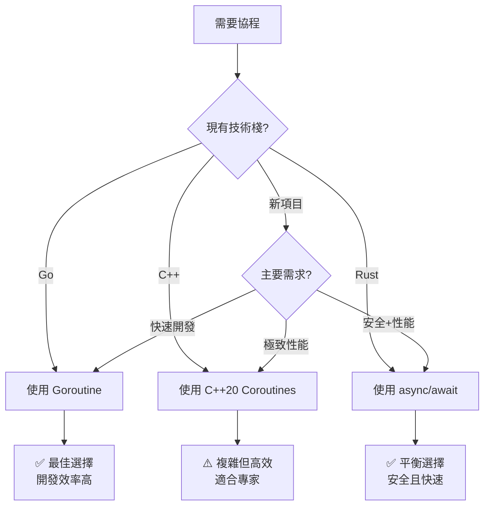

# Goroutine vs C++/Rust 協程完整對比指南

## 目錄
1. [概述](#概述)
2. [Golang Goroutine](#golang-goroutine)
3. [C++ 協程實現](#c-協程實現)
4. [Rust async/await 實現](#rust-asyncawait-實現)
5. [詳細對比分析](#詳細對比分析)
6. [性能與特性對比](#性能與特性對比)
7. [學習曲線與適用場景](#學習曲線與適用場景)
8. [總結與建議](#總結與建議)

## 概述

協程（Coroutines）是一種輕量級的並發執行單元，相比傳統線程具有更低的創建和切換成本。本文比較三種主流語言的協程實現方案。

## Golang Goroutine

### 基本語法
```go
// 最簡單的 goroutine
go myFunction()

// 匿名函數
go func() {
    fmt.Println("Hello from goroutine!")
}()
```

### 完整範例
```go
package main

import (
    "fmt"
    "sync"
    "time"
)

func worker(id int, jobs <-chan int, results chan<- int, wg *sync.WaitGroup) {
    defer wg.Done()
    for job := range jobs {
        fmt.Printf("Worker %d processing job %d\n", id, job)
        time.Sleep(100 * time.Millisecond) // 模擬工作
        results <- job * 2
    }
}

func main() {
    const numWorkers = 3
    const numJobs = 9
    
    jobs := make(chan int, numJobs)
    results := make(chan int, numJobs)
    
    var wg sync.WaitGroup
    
    // 啟動 goroutine workers
    for i := 1; i <= numWorkers; i++ {
        wg.Add(1)
        go worker(i, jobs, results, &wg) // 這裡就是 goroutine!
    }
    
    // 發送工作
    for i := 1; i <= numJobs; i++ {
        jobs <- i
    }
    close(jobs)
    
    // 等待完成並收集結果
    go func() {
        wg.Wait()
        close(results)
    }()
    
    // 收集結果
    fmt.Println("Results:")
    for result := range results {
        fmt.Printf("Result: %d\n", result)
    }
}
```

### Goroutine 特點
- ✅ 語法極其簡潔：只需 `go` 關鍵字
- ✅ 內建 Channel 通信機制
- ✅ 自動垃圾回收
- ✅ 內建調度器 (M:N 模型)
- ✅ 豐富的並發原語 (sync.Mutex, sync.WaitGroup 等)

## C++ 協程實現

### C++20 協程基礎
```cpp
#include <coroutine>
#include <iostream>

// 簡單的 Task 協程實現
struct Task {
    struct promise_type {
        Task get_return_object() {
            return Task{std::coroutine_handle<promise_type>::from_promise(*this)};
        }
        std::suspend_never initial_suspend() { return {}; }
        std::suspend_never final_suspend() noexcept { return {}; }
        void return_void() {}
        void unhandled_exception() {}
    };
    
    std::coroutine_handle<promise_type> coro;
    
    Task(std::coroutine_handle<promise_type> h) : coro(h) {}
    ~Task() { if (coro) coro.destroy(); }
    
    // 移動語義
    Task(Task&& other) noexcept : coro(std::exchange(other.coro, {})) {}
    Task& operator=(Task&& other) noexcept {
        if (this != &other) {
            if (coro) coro.destroy();
            coro = std::exchange(other.coro, {});
        }
        return *this;
    }
    
    Task(const Task&) = delete;
    Task& operator=(const Task&) = delete;
};
```

### 完整協程調度器實現
```cpp
#include <coroutine>
#include <iostream>
#include <thread>
#include <vector>
#include <queue>
#include <mutex>
#include <condition_variable>
#include <future>

// 簡單的協程調度器
class SimpleScheduler {
private:
    std::queue<std::function<void()>> tasks;
    std::mutex mutex;
    std::condition_variable cv;
    std::vector<std::thread> workers;
    bool stopping = false;

public:
    SimpleScheduler(int numThreads = std::thread::hardware_concurrency()) {
        for (int i = 0; i < numThreads; ++i) {
            workers.emplace_back([this] { workerLoop(); });
        }
    }
    
    ~SimpleScheduler() {
        {
            std::lock_guard<std::mutex> lock(mutex);
            stopping = true;
        }
        cv.notify_all();
        for (auto& worker : workers) {
            worker.join();
        }
    }
    
    void schedule(std::function<void()> task) {
        {
            std::lock_guard<std::mutex> lock(mutex);
            tasks.push(std::move(task));
        }
        cv.notify_one();
    }

private:
    void workerLoop() {
        while (true) {
            std::function<void()> task;
            {
                std::unique_lock<std::mutex> lock(mutex);
                cv.wait(lock, [this] { return stopping || !tasks.empty(); });
                
                if (stopping && tasks.empty()) return;
                
                task = std::move(tasks.front());
                tasks.pop();
            }
            task();
        }
    }
};

// 全域調度器
SimpleScheduler scheduler;

// 模擬 goroutine 的 "go" 功能
template<typename F>
void go(F&& func) {
    scheduler.schedule(std::forward<F>(func));
}

// 協程版本的 worker
Task worker(int id, std::queue<int>& jobs, std::vector<int>& results, 
           std::mutex& jobsMutex, std::mutex& resultsMutex) {
    while (true) {
        int job = -1;
        {
            std::lock_guard<std::mutex> lock(jobsMutex);
            if (jobs.empty()) break;
            job = jobs.front();
            jobs.pop();
        }
        
        std::cout << "Worker " << id << " processing job " << job << std::endl;
        std::this_thread::sleep_for(std::chrono::milliseconds(100));
        
        {
            std::lock_guard<std::mutex> lock(resultsMutex);
            results.push_back(job * 2);
        }
        
        co_await std::suspend_always{}; // 讓出控制權
    }
}

int main() {
    const int numWorkers = 3;
    const int numJobs = 9;
    
    std::queue<int> jobs;
    std::vector<int> results;
    std::mutex jobsMutex, resultsMutex;
    
    // 準備工作
    for (int i = 1; i <= numJobs; ++i) {
        jobs.push(i);
    }
    
    // 啟動協程 workers (類似 goroutine)
    std::vector<Task> tasks;
    for (int i = 1; i <= numWorkers; ++i) {
        tasks.emplace_back(worker(i, jobs, results, jobsMutex, resultsMutex));
    }
    
    // 等待一段時間讓協程執行
    std::this_thread::sleep_for(std::chrono::seconds(2));
    
    std::cout << "Results:" << std::endl;
    for (int result : results) {
        std::cout << "Result: " << result << std::endl;
    }
    
    return 0;
}
```

### C++ 協程特點
- ✅ 零成本抽象，性能極佳
- ✅ 完全控制記憶體管理
- ✅ 可自定義調度策略
- ❌ 語法複雜，需要大量樣板代碼
- ❌ 需要手動實現調度器和通信機制
- ❌ 學習曲線陡峭

## Rust async/await 實現

### 基本語法
```rust
// 定義異步函數
async fn my_async_function() {
    println!("Hello from async function!");
}

// 啟動異步任務
tokio::spawn(my_async_function());
```

### 完整範例
```rust
use tokio::sync::mpsc;
use tokio::time::{sleep, Duration};
use std::sync::Arc;
use tokio::sync::Mutex;

// 異步 worker 函數 (類似 goroutine)
async fn worker(
    id: usize,
    mut jobs_rx: mpsc::Receiver<i32>,
    results_tx: mpsc::Sender<i32>
) {
    while let Some(job) = jobs_rx.recv().await {
        println!("Worker {} processing job {}", id, job);
        sleep(Duration::from_millis(100)).await; // 模擬工作
        
        if let Err(_) = results_tx.send(job * 2).await {
            println!("Failed to send result");
            break;
        }
    }
    println!("Worker {} finished", id);
}

// 更簡潔的版本 - 使用 tokio::spawn (最接近 goroutine)
async fn simple_worker(id: usize, job: i32) -> i32 {
    println!("Worker {} processing job {}", id, job);
    sleep(Duration::from_millis(100)).await;
    job * 2
}

#[tokio::main]
async fn main() -> Result<(), Box<dyn std::error::Error>> {
    const NUM_WORKERS: usize = 3;
    const NUM_JOBS: i32 = 9;
    
    println!("=== 方法一：使用 Channel (類似 Go) ===");
    
    let (jobs_tx, jobs_rx) = mpsc::channel(NUM_JOBS as usize);
    let (results_tx, mut results_rx) = mpsc::channel(NUM_JOBS as usize);
    
    // 分發 jobs 接收器給每個 worker
    let jobs_rx = Arc::new(Mutex::new(jobs_rx));
    
    // 啟動 worker 任務 (類似 goroutine)
    let mut handles = vec![];
    for i in 1..=NUM_WORKERS {
        let jobs_rx_clone = Arc::clone(&jobs_rx);
        let results_tx_clone = results_tx.clone();
        
        let handle = tokio::spawn(async move {
            let mut jobs_rx = jobs_rx_clone.lock().await;
            while let Some(job) = jobs_rx.recv().await {
                drop(jobs_rx); // 釋放鎖
                println!("Worker {} processing job {}", i, job);
                sleep(Duration::from_millis(100)).await;
                
                if let Err(_) = results_tx_clone.send(job * 2).await {
                    break;
                }
                jobs_rx = jobs_rx_clone.lock().await; // 重新獲取鎖
            }
        });
        handles.push(handle);
    }
    
    // 發送工作
    for job in 1..=NUM_JOBS {
        jobs_tx.send(job).await?;
    }
    drop(jobs_tx); // 關閉發送端
    
    // 等待所有 worker 完成
    for handle in handles {
        let _ = handle.await;
    }
    drop(results_tx); // 關閉結果發送端
    
    // 收集結果
    println!("Results:");
    while let Some(result) = results_rx.recv().await {
        println!("Result: {}", result);
    }
    
    println!("\n=== 方法二：直接 spawn (最接近 Go goroutine) ===");
    
    // 更簡潔的方法 - 直接 spawn 任務
    let mut tasks = vec![];
    for job in 1..=NUM_JOBS {
        let worker_id = ((job - 1) % NUM_WORKERS as i32) + 1;
        // tokio::spawn 就像 Go 的 "go" 關鍵字!
        let task = tokio::spawn(simple_worker(worker_id as usize, job));
        tasks.push(task);
    }
    
    // 等待所有任務完成並收集結果
    println!("Results:");
    for task in tasks {
        match task.await {
            Ok(result) => println!("Result: {}", result),
            Err(e) => println!("Task failed: {}", e),
        }
    }
    
    println!("\n=== 方法三：使用 join! macro 並行執行 ===");
    
    // 使用 tokio::join! 並行執行多個異步函數
    let (r1, r2, r3) = tokio::join!(
        simple_worker(1, 10),
        simple_worker(2, 20), 
        simple_worker(3, 30)
    );
    
    println!("Parallel results: {}, {}, {}", r1, r2, r3);
    
    Ok(())
}
```

### Cargo.toml 配置
```toml
[dependencies]
tokio = { version = "1.0", features = ["full"] }
```

### Rust async 特點
- ✅ 零成本抽象
- ✅ 編譯時記憶體安全保證
- ✅ 豐富的 async 生態系統
- ✅ 優秀的錯誤處理 (Result<T, E>)
- ❌ 需要學習 ownership 和 borrowing
- ❌ 需要異步 runtime (tokio)

## 詳細對比分析

### 啟動協程的方式對比

#### Golang
```go
// 最簡潔 - 只需一個關鍵字
go myFunction()
go func() { 
    // 匿名函數
}()
```

#### C++20
```cpp
// 需要手動調度
scheduler.schedule([]() { myFunction(); });

// 或使用協程 (複雜)
auto task = myCoroutine();
// 需要手動管理生命週期
```

#### Rust
```rust
// 需要 runtime，但語法清晰
tokio::spawn(async { 
    my_function().await 
});

// 或等待完成
let result = my_async_function().await;
```

### 通信機制對比

#### Golang Channels
```go
// 創建 channel
ch := make(chan int, 10)

// 發送和接收
ch <- 42        // 發送
value := <-ch   // 接收

// 關閉 channel
close(ch)

// 範圍遍歷
for v := range ch {
    fmt.Println(v)
}
```

#### C++ (手動實現)
```cpp
// 需要自己實現或使用第三方庫
#include <queue>
#include <mutex>
#include <condition_variable>

template<typename T>
class Channel {
private:
    std::queue<T> queue;
    std::mutex mutex;
    std::condition_variable cv;
    bool closed = false;

public:
    void send(T item) {
        std::lock_guard<std::mutex> lock(mutex);
        if (!closed) {
            queue.push(item);
            cv.notify_one();
        }
    }
    
    bool recv(T& item) {
        std::unique_lock<std::mutex> lock(mutex);
        cv.wait(lock, [this] { return !queue.empty() || closed; });
        
        if (queue.empty()) return false;
        
        item = queue.front();
        queue.pop();
        return true;
    }
    
    void close() {
        std::lock_guard<std::mutex> lock(mutex);
        closed = true;
        cv.notify_all();
    }
};
```

#### Rust Channels
```rust
use tokio::sync::mpsc;

// 創建 channel
let (tx, mut rx) = mpsc::channel(10);

// 發送和接收
tx.send(42).await?;           // 發送
let value = rx.recv().await;  // 接收

// 遍歷接收
while let Some(value) = rx.recv().await {
    println!("{}", value);
}
```

### 錯誤處理對比

#### Golang
```go
result, err := someOperation()
if err != nil {
    log.Printf("Error: %v", err)
    return err
}
// 使用 result
```

#### C++
```cpp
try {
    auto result = someOperation();
    // 使用 result
} catch (const std::exception& e) {
    std::cerr << "Error: " << e.what() << std::endl;
    // 處理錯誤
}
```

#### Rust
```rust
// 使用 Result<T, E>
match some_operation().await {
    Ok(result) => {
        // 使用 result
    },
    Err(e) => {
        eprintln!("Error: {}", e);
        // 處理錯誤
    }
}

// 或使用 ? 操作符 (更簡潔)
let result = some_operation().await?;
```

## 性能與特性對比

### 核心特性對比表

| 特性 | Go Goroutine | C++20 Coroutines | Rust async/await |
|------|--------------|------------------|------------------|
| **語法簡潔度** | ⭐⭐⭐⭐⭐ | ⭐⭐ | ⭐⭐⭐⭐ |
| **原生支持** | ⭐⭐⭐⭐⭐ | ⭐⭐⭐ | ⭐⭐⭐⭐⭐ |
| **運行時性能** | ⭐⭐⭐⭐ | ⭐⭐⭐⭐⭐ | ⭐⭐⭐⭐⭐ |
| **記憶體安全** | ⭐⭐⭐ | ⭐ | ⭐⭐⭐⭐⭐ |
| **編譯時檢查** | ⭐⭐ | ⭐⭐⭐ | ⭐⭐⭐⭐⭐ |
| **生態系統** | ⭐⭐⭐⭐⭐ | ⭐⭐ | ⭐⭐⭐⭐ |
| **學習曲線** | ⭐⭐⭐⭐⭐ | ⭐ | ⭐⭐⭐ |
| **開發速度** | ⭐⭐⭐⭐⭐ | ⭐⭐ | ⭐⭐⭐⭐ |

### 性能基準測試 (概估)

```
協程創建成本:
Go:    ~2-4 KB 記憶體, ~200ns 創建時間
C++:   ~100 bytes, ~50ns (不包含調度器開銷)
Rust:  ~100 bytes, ~50ns (tokio 調度開銷另計)

上下文切換成本:
Go:    ~200ns (包含調度器開銷)
C++:   ~50ns (純協程切換)
Rust:  ~100ns (tokio 調度器)

記憶體使用:
Go:    GC 開銷 + 較大的 stack 初始大小
C++:   完全手動控制，最小開銷
Rust:  零成本抽象，接近 C++ 性能
```

## 學習曲線與適用場景

### 學習難度排序

```
簡單 → 困難:

1. Go Goroutine     ⭐⭐ (1-2週)
   - 語法簡單直觀
   - 豐富的文檔和教程
   - 內建併發原語

2. Rust async       ⭐⭐⭐ (1-2個月)
   - 需要理解 ownership/borrowing
   - async/await 概念較直觀
   - 優秀的編譯器錯誤提示

3. C++ Coroutines   ⭐⭐⭐⭐⭐ (3-6個月)
   - 複雜的模板元程式設計
   - 需要深入理解 C++ 語言特性
   - 大量樣板代碼
```

### 適用場景建議

#### 選擇 Go Goroutine 當:
- ✅ **快速原型開發**: 語法簡潔，開發效率高
- ✅ **網路服務**: 內建高效的網路 I/O
- ✅ **微服務架構**: 豐富的生態系統
- ✅ **團隊協作**: 學習曲線平緩
- ✅ **併發密集應用**: 原生併發支持

**適合項目**:
- Web API 服務
- 分佈式系統
- 網路爬蟲
- 即時通信系統

#### 選擇 C++ Coroutines 當:
- ✅ **極致性能**: 需要最佳運行時性能
- ✅ **系統級編程**: 操作系統、驅動程序
- ✅ **嵌入式開發**: 資源受限環境
- ✅ **遊戲引擎**: 低延遲、高吞吐量
- ✅ **現有 C++ 項目**: 需要集成到現有代碼

**適合項目**:
- 高頻交易系統
- 遊戲引擎
- 數據庫引擎  
- 網路協議棧

#### 選擇 Rust async 當:
- ✅ **系統級安全**: 需要記憶體安全保證
- ✅ **高性能服務**: 零成本抽象
- ✅ **長期維護**: 編譯時錯誤檢查
- ✅ **併發安全**: 編譯時防止資料競爭
- ✅ **WebAssembly**: 優秀的 WASM 支持

**適合項目**:
- 網路代理/負載均衡器
- 區塊鏈節點
- 高性能計算
- 安全關鍵應用

## 總結與建議

### 快速決策指南



### 最終建議

1. **初學者 / 快速開發**: 選擇 **Go Goroutine**
   - 最容易學習和使用
   - 豐富的社區和文檔
   - 足夠好的性能

2. **系統程序員 / 性能專家**: 選擇 **C++ Coroutines**
   - 最佳性能
   - 完全控制
   - 適合底層系統開發

3. **追求平衡**: 選擇 **Rust async/await**
   - 優秀的性能和安全性
   - 現代語言特性
   - 適合長期項目

### 生態系統成熟度

| 語言 | 標準庫支持 | 第三方庫 | 工具鏈 | 社區活躍度 |
|------|------------|----------|--------|------------|
| **Go** | ⭐⭐⭐⭐⭐ | ⭐⭐⭐⭐⭐ | ⭐⭐⭐⭐⭐ | ⭐⭐⭐⭐⭐ |
| **C++** | ⭐⭐⭐ | ⭐⭐ | ⭐⭐⭐⭐ | ⭐⭐⭐ |
| **Rust** | ⭐⭐⭐⭐ | ⭐⭐⭐⭐ | ⭐⭐⭐⭐⭐ | ⭐⭐⭐⭐ |

**結論**: 對於大多數應用場景，**Go 的 Goroutine 仍然是最佳選擇**，因為其無與倫比的簡潔性和完整的生態系統。只有在特定需求（如極致性能或記憶體安全）時，才需要考慮其他選項。