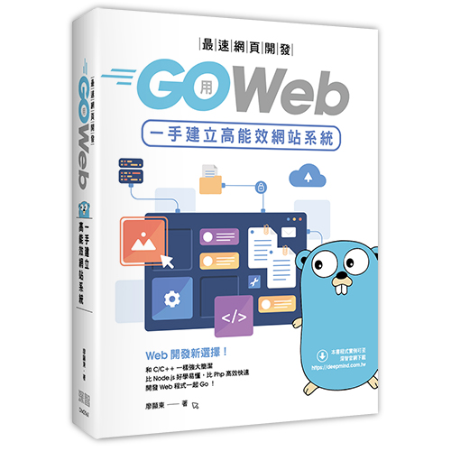
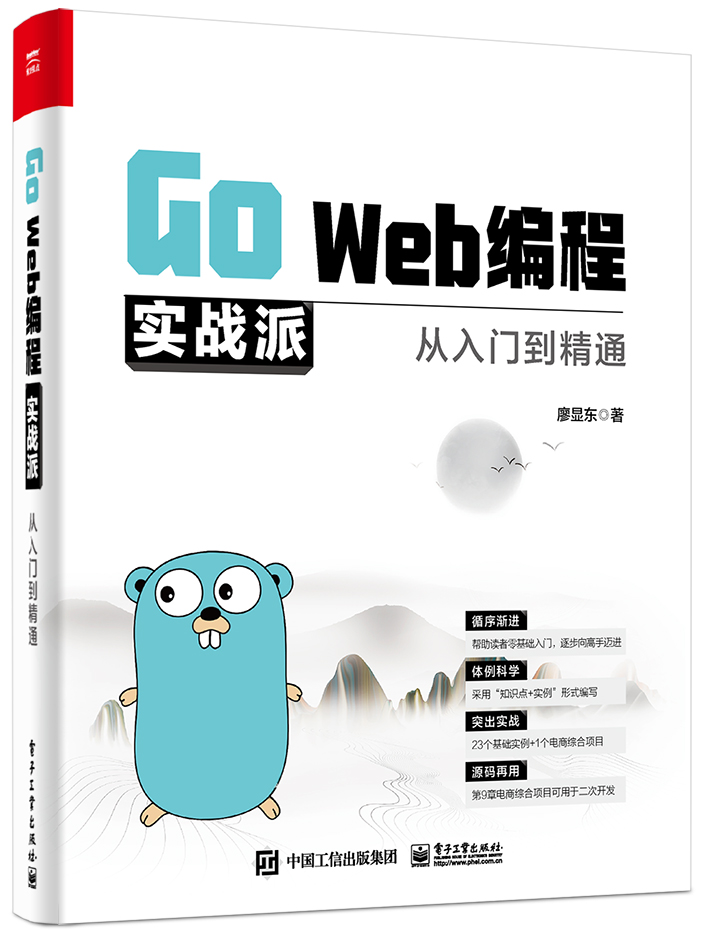
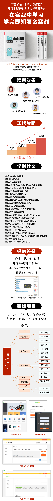
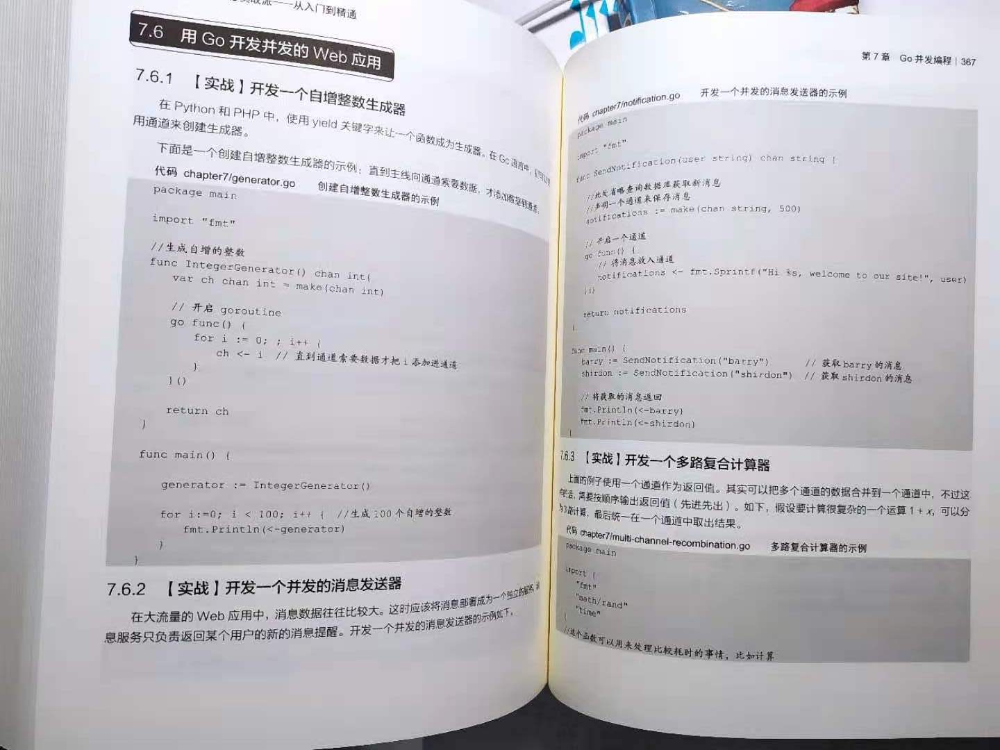
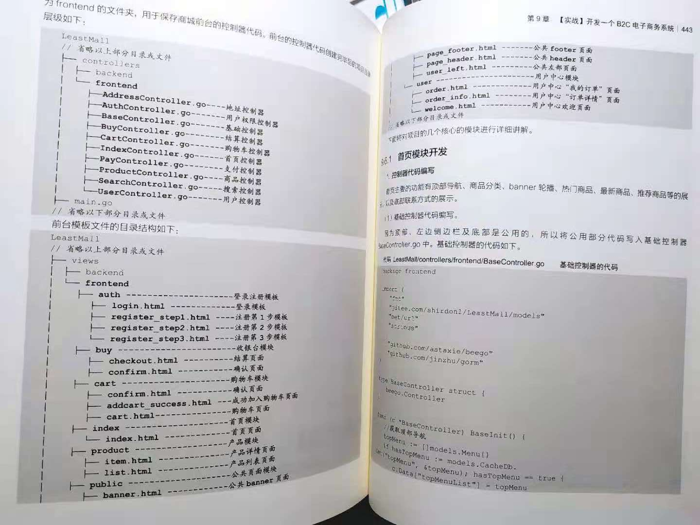
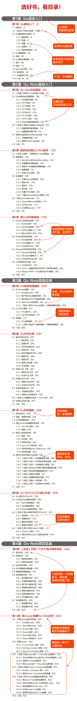

#  🔥🔥拒絕內卷！拒絕內卷！拒絕內卷！
#  🔥🔥Go語言這麼火，再不學Go語言，你就Out了！一起學習挑戰30天拿到高薪offer！！
####  先看看拉鉤上Go語言薪資，你心動嗎？心動就一起學習Go語言吧～

#  源碼說明
#### （1）作者歷時1年多編寫的代碼免費開源啦！
#### （2）代碼採用目前go最新版本編寫。
#### （3）所有的代碼都是經過反覆測試過，精益求精，下載下來即可運行！
#### （4）實例代碼是絕大部分都是來自於最新的企業實戰項目。
#### （5）配套圖書內容豐富，全書536頁！零基礎入門，循序漸進，實現快速從菜鳥向實戰派高手邁進！精品教程，實力說話，已經被引進到🔥🔥🔥 臺灣銷售！
#### （6）歡迎購買紙質圖書，進行更加系統地學習，快速從小白向頂尖高手邁進，購買鏈接如下：
#### 噹噹（🔥🔥🔥🔥🔥🔥 活動搶購中......）：http://product.dangdang.com/29225055.html
#### 京東（🔥🔥🔥🔥🔥🔥 活動搶購中......）：https://item.jd.com/13200972.html

#### 天貓（🔥🔥🔥🔥🔥🔥 活動搶購中......）：https://detail.tmall.com/item.htm?id=643246918641

#### 🔥🔥🔥 精品教程，實力說話，臺灣繁體版正式出版銷售：

#### 京東（🔥🔥🔥🔥🔥🔥 臺灣繁體版......）：https://item.jd.com/10040646929728.html
# 拒絕純理論，直接實戰！實戰！實戰！乾貨如下：
#### 系統學習Go語言基礎知識；
#### 掌握HTTP基本原理；
#### 掌握Go Web 底層原理；
#### 掌握Go訪問MySQL、Redis、MongoDB的方法和技巧；
#### 掌握Gorm、Beego ORM的使用方法和技巧；
#### 掌握Go Socket編程的方法和技巧；
#### 掌握用gRPC實現微服務調用；
#### 掌握Go 文件處理的方法和技巧；
#### 掌握Go JSON、XML生成與解析方法和技巧；
#### 掌握Go正則表達式的處理方法和技巧；
#### 掌握Go 日誌處理的方法和技巧；
#### 掌握從數據庫中導出一個csv文件的實戰法；
#### 掌握Go併發編程的底層原理
#### 掌握常見Go併發Web應用的實戰開發方法和技巧
#### 掌握Go開發併發的Web爬蟲的方法和技巧
#### 掌握Gin框架、Beego框架的使用方法和技巧；
#### 掌握流行架構風格RESTful API接口開發；
#### 掌握用Go開發OAuth2.0接口技巧；
#### 掌握Elasticsearch的使用方法；
#### 掌握微信支付、支付寶支付接口對接方法；
#### 掌握Go語言開發的B2C電子商務系統開發的整個流程方案及源碼；
#### 掌握Docker實戰部署方法；
#### 掌握Docker Compose實戰部署方法。
# 《Go Web編程實戰派從入門到精通》介紹

## 1.本書特色
本書聚焦Go Web開發領域，對Go Web知識進行全面深入地講解。本書有如下特色：
#### （1）一線技術，突出實戰；
本書以實戰為核心，貫穿整本書。所有代碼採用Go最新版本編寫。
#### （2）精雕細琢，閱讀性強；
全書的語言經過多次打磨，力求精確。同時注重閱讀體驗，讓沒有任何基礎的讀者也可以很輕鬆的讀懂書中的知識。
#### （3）零基礎入門，循序漸進，實現快速從菜鳥向實戰派高手邁進；
本書以Go入門級程序員為主要對象，初、中、高級程序員都可以從書中學到乾貨。先從Go的基礎學起，然後學習Go核心的技術，再學Go的高級應用，然後再進行項目實戰，最後介紹應用程序的Docker實戰部署。全書從最基礎的知識講解一步一步到最核心的B2C電子商務系實戰開發，真正幫助讀者從基礎入門向開發高手邁進。
#### （4）極客思維，極致效率；
本書以極客思維、深入Go語言底層進行探究，幫助讀者瞭解背後原理。全書言簡意賅，以幫助讀者提升開發效率為導向，同時儘可能幫助讀者縮短閱讀本書的時間。
#### （5）由易到難，重難點標註並重點解析；
本書編排由易到難，內容基本覆蓋Go Web的主流前沿技術。同時對重難點進行重點講解，對易錯點和注意點進行了提示說明，幫助讀者克服學習過程中的困難。
#### （6）突出實戰，快速突擊；
本書的實例代碼是絕大部分都是來自於最新的企業實戰項目。對於購買本書的讀者，所有的源代碼均可以通過網上下載，直接下載即可運行，讓讀者通過實踐來加深理解。
#### （7）實戰方案，可直接二次開發進行實戰部署；
本書全書以實戰為主，所有的示例代碼，拿來即可運行。特別是第9章，購買本書的讀者可以直接獲得B2C電子商務系統的全部源代碼。可以直接作為電商項目進行二次開發，用於讀者的項目。讀者購買本書不僅可以學習本書的各種知識，也相當於購買一個最新版的Go語言電商系統解決方案及項目源碼。
## 2.閱讀本書，您能學到什麼
#### 系統學習Go語言基礎知識；
#### 掌握HTTP基本原理；
#### 掌握Go Web 底層原理；
#### 掌握Go訪問MySQL、Redis、MongoDB的方法和技巧；
#### 掌握Gorm、Beego ORM的使用方法和技巧；
#### 掌握Go Socket編程的方法和技巧；
#### 掌握用gRPC實現微服務調用；
#### 掌握Go 文件處理的方法和技巧；
#### 掌握Go JSON、XML生成與解析方法和技巧；
#### 掌握Go正則表達式的處理方法和技巧；
#### 掌握Go 日誌處理的方法和技巧；
#### 掌握從數據庫中導出一個csv文件的實戰法；
#### 掌握Go併發編程的底層原理
#### 掌握常見Go併發Web應用的實戰開發方法和技巧
#### 掌握Go開發併發的Web爬蟲的方法和技巧
#### 掌握Gin框架、Beego框架的使用方法和技巧；
#### 掌握流行架構風格RESTful API接口開發；
#### 掌握用Go開發OAuth2.0接口技巧；
#### 掌握Elasticsearch的使用方法；
#### 掌握微信支付、支付寶支付接口對接方法；
#### 掌握Go語言開發的B2C電子商務系統開發的整個流程方案及源碼；
#### 掌握Docker實戰部署方法；
#### 掌握Docker Compose實戰部署方法。
希望通過本書的學習，能夠讓讀者快速、系統地掌握Go Web開發的各種方法和技巧，幫助讀者在Go 語言Web開發中，快速從基礎入門向精通級的實戰派高手邁進。
## 讀者對象
本書從Go語言基礎開始，從基礎原理到高級項目實戰，既適合Go語言初學者，也適合想進一步提升的中高級開發者，初級、中級、高級開發人員都能學到乾貨。
本書讀者對象如下：
#### 1.初學編程的自學者；	
#### 2.Go語言初學者；	
#### 3.Go語言中高級開發人員；	
#### 4.Web開發工程師；	
#### 5.編程愛好者；	
#### 6.大中專院校的老師和學生；
#### 7.培訓機構的老師和學員；
#### 8.相關專業的大學畢業學生；
#### 9.Web前端開發人員；
#### 10.測試工程師；
#### 11.DevOps運維人員；
#### 12.Web中高級開發人員。

## 3.技術交流
假如讀者在閱讀本書的過程中有任何疑問，請用手機微信掃描下方二維碼，

關注“源碼大數據”公眾號，輸入讀者遇到的問題，作者會第一時間與讀者進行交流回復。

讀者也可以添加QQ:823923263進行交流反饋。

儘管作者在本書寫作過程中儘可能地保持嚴謹，但難免有紕漏之處，歡迎讀者通過“源碼大數據”公眾號或者QQ群等方式批評指正。

注意：本倉庫不包含商城項目，要獲取商城項目源碼，請購買本書通過前言的說明獲取。
