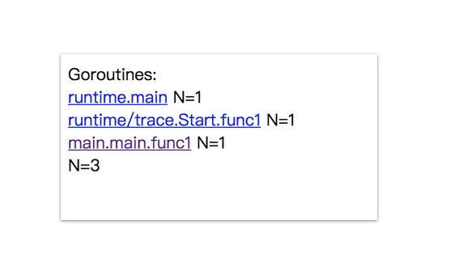
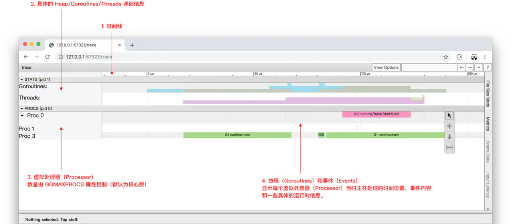
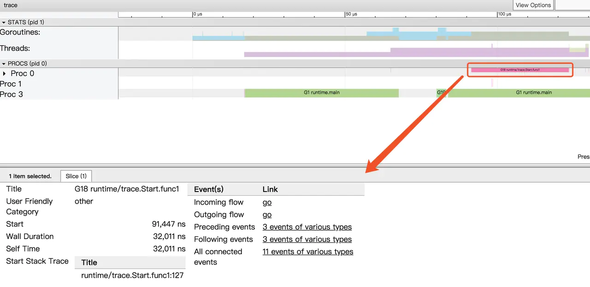

# Golang大殺器之跟蹤剖析trace


在 Go 中有許許多多的分析工具，在之前我有寫過一篇 《Golang 大殺器之性能剖析 PProf》 來介紹 PProf，如果有小夥伴感興趣可以去我博客看看。

但單單使用 PProf 有時候不一定足夠完整，因為在真實的程序中還包含許多的隱藏動作，例如 Goroutine 在執行時會做哪些操作？執行/阻塞了多長時間？在什麼時候阻止？在哪裡被阻止的？誰又鎖/解鎖了它們？GC 是怎麼影響到 Goroutine 的執行的？這些東西用 PProf 是很難分析出來的，但如果你又想知道上述的答案的話，你可以用本文的主角 `go tool trace` 來打開新世界的大門。目錄如下：


- 1. 初步瞭解

  - [1.1. Scheduler latency profile](https://codertw.com/程式語言/733765/#outline__1_1)
  - [1.2. Goroutine analysis](https://codertw.com/程式語言/733765/#outline__1_2)
  - [1.3. View trace](https://codertw.com/程式語言/733765/#outline__1_3)
  - [1.4. View Events](https://codertw.com/程式語言/733765/#outline__1_4)

- 2. 結合實戰

  - [2.1. View trace](https://codertw.com/程式語言/733765/#outline__2_1)
  - [2.2. Network blocking profile](https://codertw.com/程式語言/733765/#outline__2_2)
  - [2.3. Syscall blocking profile](https://codertw.com/程式語言/733765/#outline__2_3)

- [3. 總結](https://codertw.com/程式語言/733765/#outline__3)

- 4. 參考

  - [4.1. 相關文章](https://codertw.com/程式語言/733765/#outline__4_1)

## 初步瞭解

```go
import (
"os"
"runtime/trace"
)
func main() {
trace.Start(os.Stderr)
defer trace.Stop()
ch := make(chan string)
go func() {
ch <- "EDDYCJY"
}()
<-ch
}
```

生成跟蹤文件：

```
$ go run main.go 2> trace.out
```

啟動可視化界面：

```
$ go tool trace trace.out
2019/06/22 16:14:52 Parsing trace...
2019/06/22 16:14:52 Splitting trace...
2019/06/22 16:14:52 Opening browser. Trace viewer is listening on http://127.0.0
```


- View trace：查看跟蹤
- Goroutine analysis：Goroutine 分析
- Network blocking profile：網絡阻塞概況
- Synchronization blocking profile：同步阻塞概況
- Syscall blocking profile：系統調用阻塞概況
- Scheduler latency profile：調度延遲概況
- User defined tasks：用戶自定義任務
- User defined regions：用戶自定義區域
- Minimum mutator utilization：最低 Mutator 利用率

### Scheduler latency profile

在剛開始查看問題時，除非是很明顯的現象，否則不應該一開始就陷入細節，因此我們一般先查看 “Scheduler latency profile”，我們能通過 Graph 看到整體的調用開銷情況，如下：


演示程序比較簡單，因此這裡就兩塊，一個是 `trace` 本身，另外一個是 `channel` 的收發。

### Goroutine analysis

第二步看 “Goroutine analysis”，我們能通過這個功能看到整個運行過程中，每個函數塊有多少個有 Goroutine 在跑，並且觀察每個的 Goroutine 的運行開銷都花費在哪個階段。如下：





通過上圖我們可以看到共有 3 個 goroutine，分別是 `runtime.main`、`runtime/trace.Start.func1`、`main.main.func1`，那麼它都做了些什麼事呢，接下來我們可以通過點擊具體細項去觀察。如下：


同時也可以看到當前 Goroutine 在整個調用耗時中的佔比，以及 GC 清掃和 GC 暫停等待的一些開銷。如果你覺得還不夠，可以把圖表下載下來分析，相當於把整個 Goroutine 運行時掰開來看了，這塊能夠很好的幫助我們**對 Goroutine 運行階段做一個的剖析，可以得知到底慢哪，然後再決定下一步的排查方向**。如下：

| 名稱                  | 含義         | 耗時   |
| :-------------------- | :----------- | :----- |
| Execution Time        | 執行時間     | 3140ns |
| Network Wait Time     | 網絡等待時間 | 0ns    |
| Sync Block Time       | 同步阻塞時間 | 0ns    |
| Blocking Syscall Time | 調用阻塞時間 | 0ns    |
| Scheduler Wait Time   | 調度等待時間 | 14ns   |
| GC Sweeping           | GC 清掃      | 0ns    |
| GC Pause              | GC 暫停      | 0ns    |

### View trace

在對當前程序的 Goroutine 運行分佈有了初步瞭解後，我們再通過 “查看跟蹤” 看看之間的關聯性，如下：





這個跟蹤圖粗略一看，相信有的小夥伴會比較懵逼，我們可以依據註解一塊塊查看，如下：

1. 時間線：顯示執行的時間單元，根據時間維度的不同可以調整區間，具體可執行 `shift` + `?` 查看幫助手冊。
2. 堆：顯示執行期間的內存分配和釋放情況。
3. 協程：顯示在執行期間的每個 Goroutine 運行階段有多少個協程在運行，其包含 GC 等待（GCWaiting）、可運行（Runnable）、運行中（Running）這三種狀態。
4. OS 線程：顯示在執行期間有多少個線程在運行，其包含正在調用 Syscall（InSyscall）、運行中（Running）這兩種狀態。
5. 虛擬處理器：每個虛擬處理器顯示一行，虛擬處理器的數量一般默認為系統內核數。
6. 協程和事件：顯示在每個虛擬處理器上有什麼 Goroutine 正在運行，而連線行為代表事件關聯。




點擊具體的 Goroutine 行為後可以看到其相關聯的詳細信息，這塊很簡單，大家實際操作一下就懂了。文字解釋如下：

- Start：開始時間
- Wall Duration：持續時間
- Self Time：執行時間
- Start Stack Trace：開始時的堆棧信息
- End Stack Trace：結束時的堆棧信息
- Incoming flow：輸入流
- Outgoing flow：輸出流
- Preceding events：之前的事件
- Following events：之後的事件
- All connected：所有連接的事件

### View Events

我們可以通過點擊 View Options-Flow events、Following events 等方式，查看我們應用運行中的事件流情況。如下：


通過分析圖上的事件流，我們可得知這程序從 `G1 runtime.main` 開始運行，在運行時創建了 2 個 Goroutine，先是創建 `G18 runtime/trace.Start.func1`，然後再是 `G19 main.main.func1` 。而同時我們可以通過其 Goroutine Name 去了解它的調用類型，如：`runtime/trace.Start.func1` 就是程序中在 `main.main` 調用了 `runtime/trace.Start` 方法，然後該方法又利用協程創建了一個閉包 `func1` 去進行調用。


在這裡我們結合開頭的代碼去看的話，很明顯就是 `ch` 的輸入輸出的過程了。

## 結合實戰

今天生產環境突然出現了問題，機智的你早已埋好 `_ "net/http/pprof"` 這個神奇的工具，你麻利的執行了如下命令：

- curl http://127.0.0.1:6060/debug/pprof/trace?seconds=20 > trace.out
- go tool trace trace.out

### View trace

你很快的看到了熟悉的 List 界面，然後不信邪點開了 View trace 界面，如下：


完全看懵的你，穩住，對著合適的區域執行快捷鍵 `W` 不斷地放大時間線，如下：


經過初步排查，你發現上述絕大部分的 G 竟然都和 `google.golang.org/grpc.(*Server).Serve.func` 有關，關聯的一大串也是 `Serve` 所觸發的相關動作。


這時候有經驗的你心裡已經有了初步結論，你可以繼續追蹤 View trace 深入進去，不過我建議先鳥瞰全貌，因此我們再往下看 “Network blocking profile” 和 “Syscall blocking profile” 所提供的信息，如下：

### Network blocking profile


### Syscall blocking profile


通過對以上三項的跟蹤分析，加上這個洩露，這個阻塞的耗時，這個涉及的內部方法名，很明顯就是哪位又忘記關閉客戶端連接了，趕緊改改改。

## 總結

通過本文我們習得了 `go tool trace` 的武林秘籍，它能夠跟蹤捕獲各種執行中的事件，例如 Goroutine 的創建/阻塞/解除阻塞，Syscall 的進入/退出/阻止，GC 事件，Heap 的大小改變，Processor 啟動/停止等等。

希望你能夠用好 Go 的兩大殺器 pprof + trace 組合，此乃排查好搭檔，誰用誰清楚，即使他並不萬能。