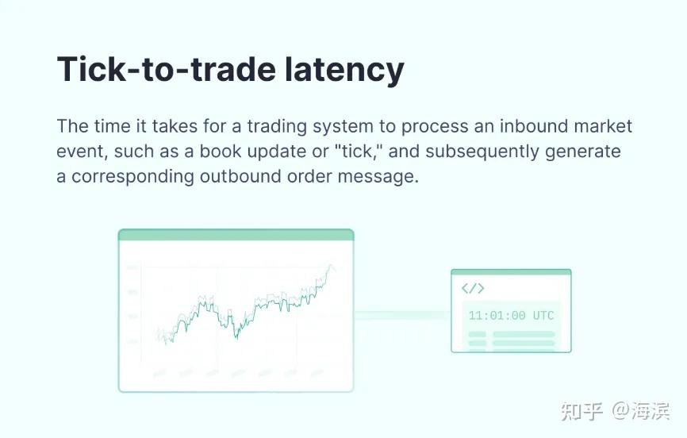
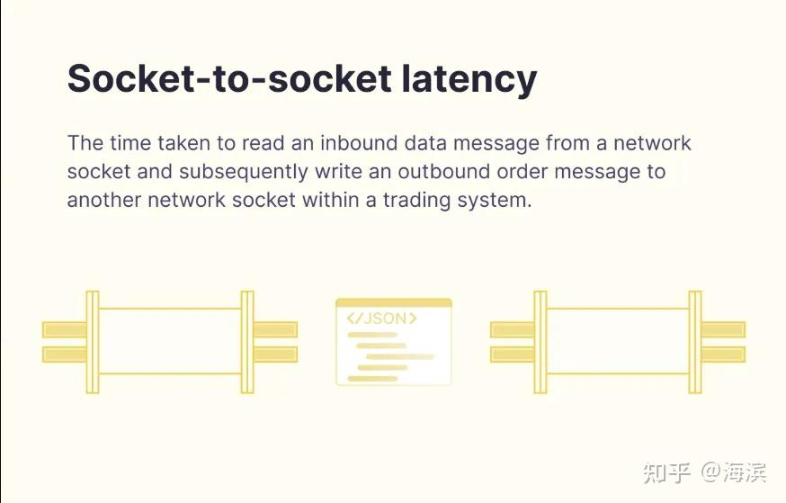
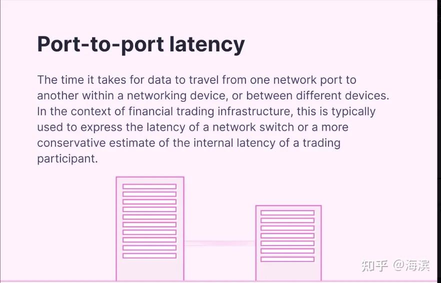

# 高頻交易系統（1）：低延遲交易系統設計

這是 "[Meeting C++ 2022](https://meetingcpp.com/)" 中 Optiver 技術負責人 David Gross 關於 latency 的主題演講：**Trading at light speed: designing low latency systems in C++**。

## 核心要點

Making a trading system “fast” cannot be an afterthought. While low latency programming is sometimes seen under the umbrella of “code optimization”, the truth is that most of the work needed to achieve such latency is done upfront, at the design phase. How to translate our knowledge about the CPU and hardware into C++? How to use multiple CPU cores, handle concurrency issues and cost, and stay fast?

一個「光速（極速）交易系統」的構建應該是事先設計出來，而不是「亡羊補牢」的結果。

雖然說在實際編碼中，對量化開發人員的「編程素養」要求比較高，在代碼上需要按照類似「編程規範」一樣來編寫代碼，以便提高系統性能，但對低延遲交易系統來說，很多極致的性能點還是需要在設計階段完成。

比如如何把對 CPU 和硬體的理解應用到代碼中？如何有效地利用多核心 CPU？如何處理並發及減少系統開銷、且保證系統的低延遲要求？

## 系統級優化建議

從 CPU 流水線利用率（通過 `perf stat` 分析 IPC 指標）、快取命中率（`perf record -e cache-misses`）、到執行緒調度延遲（`cyclictest` 測量）。這種系統級優化需要將硬體特性深度融入軟體設計 DNA，而非簡單的後期性能調優。

### 1. 記憶體層級意識 (Memory Hierarchy)
*   通過 `alignas` 強制資料結構快取行對齊，避免偽共享 (False Sharing)。
*   使用 `std::hardware_destructive_interference_size` 指導資料結構佈局。
*   優先選擇連續記憶體容器（如 `std::vector`），利用快取局部性。

### 2. 並發架構設計 (Concurrency Architecture)
*   採用執行緒綁定（`pthread_setaffinity_np`）減少核心遷移開銷。
*   使用無鎖 (Lock-free) 資料結構避免互斥鎖的上下文切換代價。

### 3. 指令級優化 (Instruction Level Optimization)
*   通過 `__builtin_expect` 指導分支預測。
*   使用 SIMD 指令集（如 AVX2）進行資料並行處理。

### 4. 零拷貝架構 (Zero Copy)
*   使用 DMA 技術實現網路封包直接寫入使用者空間（如 DPDK）。
*   通過 `mmap` 實現磁碟記憶體映射，避免資料二次拷貝。

### 5. 即時性保障 (Real-time Assurance)
*   採用 `SCHED_FIFO` 即時調度策略。
*   使用使用者態中斷處理（如 Linux 的 `io_uring`）。

---

## 演講核心觀點

### 1. Importance of Low Latency in Trading Systems
**Low latency is crucial in automated trading due to the high volume of trades and the need to respond quickly to market changes.**
高頻交易場景下，系統需在百萬級訂單洪流中瞬時響應市場異動。例如當黑天鵝事件觸發時，延遲 1 微秒的撤單操作可能意味著數百萬美元的風險敞口。

### 2. Designing for Performance
**Performance should be a primary consideration from the beginning of the system design process.**
不同於傳統軟體「先功能後優化」的模式，極速交易系統需將「性能基因」寫入「架構 DNA」。如同建造 F1 賽車，空氣動力學設計必須在藍圖階段就深度融入，而非後期加裝尾翼。

### 3. Strategy vs Tactics in System Design
*   **Strategy (戰略層規劃)**: 確立系統能力基線，例如構建支撐 10 萬 QPS 的行情解析引擎，要求 99.9% 的訂單處理延遲低於 50 微秒。
*   **Tactics (戰術層執行)**: 在實現過程中選擇性採用無鎖隊列、SIMD 指令優化等具體技術手段，避免陷入「為優化而優化」的陷阱。

### 4. Building Blocks of Low Latency Systems
低延遲系統設計的 4 個核心要點：
*   **資料模型的典範**: 通過記憶體對齊、快取親和的資料結構設計，將 L1/L2 快取命中率提升至 98%+。
*   **系統調優**: 採用 CPU 綁核、NUMA 感知的記憶體分配策略，將執行緒切換開銷壓縮至納秒級。
*   **事件處理機制**: 實現基於環形緩衝區的零拷貝傳輸，將網路報文到業務處理的延遲降低到 5 微秒以內。
*   **性能監控**: 通過 eBPF 即時採集 LLC（最後一級快取）未命中率，結合 PMU（性能監控單元）資料進行熱點分析。

### 5. Evolution of Exchange Speeds
**Exchange speeds in financial markets have evolved, with the current focus on achieving microsecond-level latencies.**
金融市場的交易速度持續進化，如今的重點在於實現微秒級的低延遲。

### 6. Trigger to Target Latency
**"Trigger to target latency" is a key performance indicator.**
從交易所行情觸達 (Trigger) 到策略引擎發出目標訂單 (Target) 的全鏈路時延，包含：
*   網路傳輸延遲（光速物理限制）
*   協議解析耗時（優化空間最大）
*   策略計算耗時（演算法效率核心）
*   風控校驗耗時（合規性剛需）

## 低延遲的四個細分概念

1.  **tick-to-trade latency**: 這是一個大家比較通用的延遲指標。
    

2.  **socket-to-socket latency**:
    

3.  **port-to-port latency**:
    

4.  **wire to wire latency**:
    

## 系統的延遲多少合適？

關於高頻交易中，系統的延遲到底多少合適？這個問題如果不談前提條件就沒有標準答案。

### 低延遲的演進路徑
*   **2000年代**: 百毫秒級延遲 → 採用普通 TCP 協議堆疊
*   **2010年代**: 微秒級突破 → FPGA 加速 + 核心旁路技術
*   **2020年代**: 向納秒級逼近 → 光子傳輸 + ASIC 晶片客製化

目前國外造市商系統可實現 1.2 微秒的端到端延遲。但在國內量化高頻實操中，談延遲必須談場景（股票數量、因子數量、模型複雜度、風控等）。

### 基礎設施的影響
國內股票市場的基礎設施（如行情延遲、券商櫃台現狀）是談低延遲的前提。證券行業目前的信創任務（計算層、網路層、存儲層）也是重要考量因素。

### 交易所的速度演進
國外交易所（如 NYSE Pillar）已將往返延遲大幅降低（FIX 約 32μs，Binary 約 26μs）。
國內上期所 NGES3.0 系統也採用了主從備三節點架構，報單容量提升 3 倍，業務處理性能提升 40%。

## 總結

在國內股票市場從事高頻交易，我們不但要構建自身低延遲的高頻交易全流程系統，同時也要關注市場基礎設施的建設情況，確保我們在高頻交易上的投入是有切切實實的回報。
