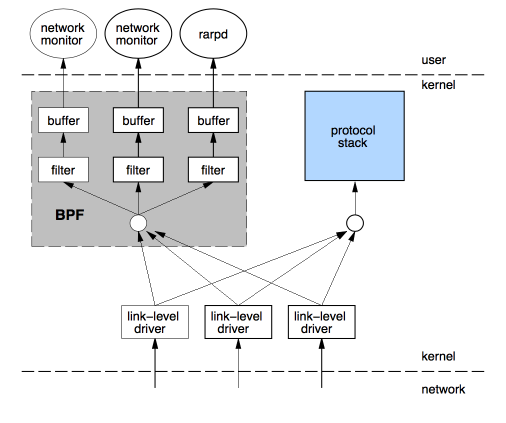
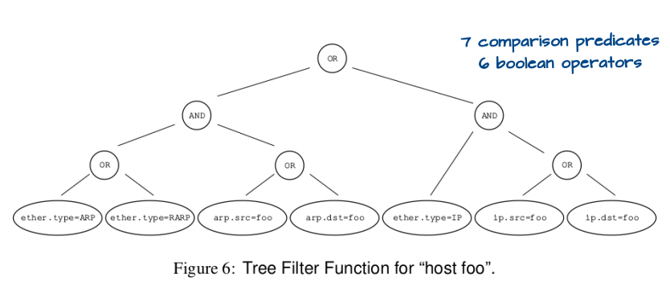
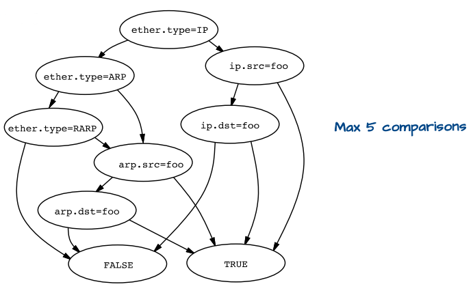
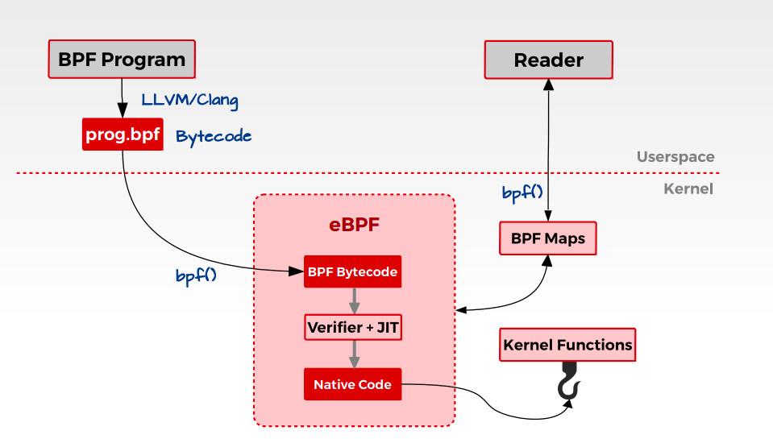

# Linux 核心設計: eBPF

[Linux 核心設計: 透過 eBPF 觀察作業系統行為](https://hackmd.io/@sysprog/linux-ebpf?type=view)

## 什麼是 BPF？

傳統的封包過濾方法，需要先將 kernel 的封包複製進 userspace，再進一步於 userspace 分析封包(使用 tap)。然而這個複製的過程 cost 是很高的。此外，傳統的封包過濾演算法效能也欠佳。

直到 1992 年 Steven McCanne 和 Van Jacobson 發表的論文 [The BSD Packet Filter: A New Architecture for User-level Packet Capture](https://www.tcpdump.org/papers/bpf-usenix93.pdf) 中，提出了 [Berkeley Packet Filter (BPF)](https://en.wikipedia.org/wiki/Berkeley_Packet_Filter)，避免了把無用的封包複製到 userspace 的過程。形式上說來，BPF 就是一個跑在 kernel 中的虛擬機。因此，我們得以把 userspace 的程式轉換成 byte code(一個虛擬的指令集) 注入到 kernel space 中執行。

 一些無聊的事:

這裡也可以看到 BPF 的原本應該是叫 BSD Packet Filter，也就是說機制原本是實現在 BSD 系統上的。不過似乎隨著 BPF 漸漸被不同作業系統納入，名稱就輾轉變成了 Berkeley Packet Filter 了 XD

後來 Linux 也引入了 BPF，在某些應用上被使用(例如 [tcpdump](https://en.wikipedia.org/wiki/Tcpdump))。並且，BPF 也有了加速用的 Just-In-Time (jit) 編譯器。

之後，BPF 被擴展至網路以外的領域，而可以被應用在 kernel 效能分析，那便是 eBPF(extended BPF)，而原本我們所說的 BPF 則被可以被改稱為 cBPF(classic BPF)

### BPF 的設計

BPF 的設計如圖。經過 [data link layer](https://en.wikipedia.org/wiki/Data_link_layer) 層的封包會額外傳遞一份給 BPF，在 kernel 先行過濾後再複製所要求的封包到 userspace。  



除了在 kernel space 就先行過濾來提升效能以外，BPF 的 filter 架構也有學問。一般而言，filter 架構可以分成 boolean expression tree 或者 directed acyclic control flow graph(或稱 CFG) 兩種。在樹狀結構中，每個節點都表示一個 boolean operaiton(and、or 等，如下圖所示)  

  
在 CFG 中，節點則是表示對一個封包欄位的判別(若為 true 就往右分支走，反之向左)，並用兩個終點的 leaves 表示通過 filter 或否。(等價於前面 boolean expression tree 的 CFG 如下圖)  


可以從圖中看到 CFG 會需要較少的 parsing 次數，因此 BPF 透過 CFG 的 filter 設計來提升效能。

BPF 的詳細請參照 reference，暫時只先研究部份內容。

另外，我感覺自己有些一知半解，因此如果有發現用詞不精準的地方都歡迎指教! 

## 什麼是 eBPF？

eBPF 基於 BPF 可將使用者定義的程式注入 kernel 中的架構做出了更多改進，其設計得以利用現代硬體的優勢。

-   eBPF virtual machine 更接近於現代的處理器，因此 eBPF 的虛擬指令集可以緊密地映射到真實硬體的 [ISA](https://en.wikipedia.org/wiki/Instruction_set_architecture)，提高性能
-   eBPF 使用 64 位元的暫存器，並且可用的暫存器數量也從 2 個提昇到 10 個
-   cBPF 和核心溝通的機制是 recv()，而 eBPF 則引入全新的 map 機制。透過 map 達成 kernel 和 user 間的資料交換，減少 system call 耗費的時間成本
-   考量安全性，eBPF 有 verifier 機制，在注入程式之前，先進行一系列的檢查，避免注入危險的程序損壞到 kernel

其整體架構大致可以如下表示:  



### eBPF 有何用途?

eBPF 理所當然的可以如 cBPF 做到過濾封包。然而實際上 eBPF 可以做得還遠遠不只這些! eBPF 可以把你的程式注入到 kernel 中，將其嵌入到任何的目標程式路徑上，一旦這些路徑被走過，便會執行注入的程式。因此 eBPF 可以做到:

-   Kprobes (追蹤 kernel functions)
-   Uprobes (追蹤 user functions)
-   Linux Tracepoints
-   USDT (Userland Statically Defined Tracing)

等等更多

### bpf system call

要在 linux 中實現 bpf，可以通過 [bpf()](https://man7.org/linux/man-pages/man2/bpf.2.html) 這個 system call

```


int bpf(int cmd, union bpf_attr *attr, unsigned int size);


```

```


union bpf_attr {
       struct {    /* Used by BPF_MAP_CREATE */
           __u32         map_type;
           __u32         key_size;    /* size of key in bytes */
           __u32         value_size;  /* size of value in bytes */
           __u32         max_entries; /* maximum number of entries
                                         in a map */
       };

       struct {    /* Used by BPF_MAP_*_ELEM and BPF_MAP_GET_NEXT_KEY
                      commands */
           __u32         map_fd;
           __aligned_u64 key;
           union {
               __aligned_u64 value;
               __aligned_u64 next_key;
           };
           __u64         flags;
       };

       struct {    /* Used by BPF_PROG_LOAD */
           __u32         prog_type;
           __u32         insn_cnt;
           __aligned_u64 insns;      /* 'const struct bpf_insn *' */
           __aligned_u64 license;    /* 'const char *' */
           __u32         log_level;  /* verbosity level of verifier */
           __u32         log_size;   /* size of user buffer */
           __aligned_u64 log_buf;    /* user supplied 'char *'
                                        buffer */
           __u32         kern_version;
                                     /* checked when prog_type=kprobe
                                        (since Linux 4.1) */
       };
} __attribute__((aligned(8)));


```

-   attr 允許數據在 kernel 和 user space 間的交換
-   cmd 決定 bpf 對應的相關操作
-   size 是指向 attr 的 union 大小

在 linux/bpf.h 中有定義 cmd 的 macro

-   BPF\_PROG\_LOAD
-   BPF\_MAP\_CREATE

等等

### eBPF data structure

由於 eBPF 需要追蹤並統計 kernel 中的統計資訊，因此需要一個 eBPF Maps 資料結構來記錄。eBPF Maps 使用 **key-value** 的方式儲存數據， 可以透過 cmd = BPF\_MAP\_CREATE 建立，並得到一個 file descriptor 的回傳。

map 會有以下 member:

-   map type(hash, array…)
-   maximum number of elements
-   key size in bytes
-   value size in bytes

透過 map 機制，無論是從使用者層級抑或核心內部都可存取，進而提升了效率。

### 建立 eBPF bytecode

直接撰寫 eBPF 的虛擬指令(bytecode)並非易事，所幸 LLVM Clang compiler 支援將 C 編譯成 byte code，再透過 bfs system call(cmd = BPF\_PROG\_LOAD) 將 byte code 載入。你可以透過 Clang 的 
```
-target = bpf
```
 參數將 C 編成 elf 格式，再透過 libbpf 函式庫解析並注入 kernel。

在 [/samples/bpf](https://elixir.bootlin.com/linux/v4.12.6/source/samples/bpf) 中有許多範例程式。

## 透過 BCC 撰寫 BPF 程式碼

[BPF Compiler Collection (BCC)](https://github.com/iovisor/bcc) 作為 IOVisor 子計畫被提出，讓進行 BPF 的開發只需要專注於 C 語言注入於核心的邏輯和流程，剩下的工作，包括編譯、解析 ELF、載入 BPF 代碼塊以及建立 map 等等基本可以由 BCC 一力承擔，無需多勞開發者費心。

### 安裝

在 Ubuntu 系統上安裝 BCC 相關工具可參考以下步驟。

```
$ git clone https://github.com/iovisor/bcc.git
$ cd bcc
$ mkdir build; cd build
$ cmake ..
$ make -j$(nproc)
$ sudo make install

```

安裝途中可能會碰到缺少套件的問題。

-   "Unable to find clang libraries": 
    ```
    sudo apt-get install libclang-dev
    ```
    
-   根據使用的 llvm 版本，可能需要安裝特定版本的 clang libraries: 
    ```
    sudo apt-get install libclang-18-dev
    ```
    
-   "No rule to make target '/usr/lib/llvm-18/lib/libPolly.a": 
    ```
    sudo apt-get install libpolly-18-dev
    ```
    
-   "Could NOT find LibElf": 
    ```
    sudo apt-get install libelf-dev
    ```

步驟過程如果遇到其他問題，也可以對照此[筆記](https://hackmd.io/@0xff07/HyrLVSZ78/https%3A%2F%2Fhackmd.io%2F%400xff07%2FBJ6vxInlU)。其他系統或者詳細的安裝方式，請直接參考官方文件 [Installing BCC](https://github.com/iovisor/bcc/blob/master/INSTALL.md)。

### 執行程式

#### Kprobes 範例

執行以下程式:

```


from bcc import BPF 
prog = """ 
int hello(void *ctx) {
 bpf_trace_printk("Hello, World!\\n");
 return 0;
}
"""
b = BPF(text=prog)
b.attach_kprobe(event="__x64_sys_clone", fn_name="hello")
print ("PID MESSAGE")
b.trace_print(fmt="{1} {5}")


```

如果跟原本的程式相比，你會注意到 
```
attach_kprobe
```
 的 
```
event
```
 有做一些調整，這是因為原本的 
```
sys_clone
```
 在新的 Linux 版本中有[更換命名](https://github.com/torvalds/linux/commit/d5a00528b58cdb2c71206e18bd021e34c4eab878)，如果照原本的寫法會找不到 symbol。

```
證據是，如果輸入
> sudo  cat /boot/System.map-`uname -r` | grep " sys_clone"

會看到沒有東西印出來，而
> sudo  cat /boot/System.map-`uname -r` | grep "  __x64_sys_clone"

則會有相同的 symbol。(注意 sys_clone 有個空白XD)

```

或者透過以下指令看看是否存在 
```
sys_clone
```
 這個 kernel symbol

```
$ cat /proc/kallsyms | grep sys_clone

```

程式的內容很淺顯易懂，就是每次 
```
__x64_sys_clone
```
 被執行的時候，印出 PID 跟 "Hello World" 訊息。

## CO-RE

見文 [BPF 的可移植性: Good Bye BCC! Hi CO-RE!](https://hackmd.io/@RinHizakura/HynIEOD7n)。

## 透過 libbpf 撰寫 BPF 程式碼

BCC 雖然一定程度簡化了 BPF 的開發，但使用上仍有一些缺點。例如可移植性的限制、高度依賴 Clang/LLVM 帶來的負擔等，因此社群會更建議透過使用 CO-RE 技術的 libbpf 來進行 BPF 程式的開發。

一般而言，使用 CO-RE 進行的 BPF program 可區分為兩部份。一部份會編譯成 BPF bytecode，之後被載入至 kernel space 運行;另一部份則是執行於 userspace 的 BPF loader。其依賴於 libbpf，被用來將 BPF bytecode 載入到 kernel，並監視其狀態以在 userspace 進行對應行為。

其中要載入至核心的部份只能用 C 撰寫( \* )，更嚴謹的說是受限制的 C 語法。其透過可以支援編譯出 BPF bytecode 的編譯器編譯後，產生 ELF 格式的二進位檔。而執行在 user space 的程式則有較多選擇，可以用 C/Python/Rust 等等語言撰寫。

### 使用 C

可以參考以下文章

-   [Develop a Hello World level eBPF program from scratch using C](https://www.sobyte.net/post/2022-07/c-ebpf/)

### 使用 Rust

在開始前，需要安裝一些 dependency:

```
$ apt install clang llvm libelf1 libelf-dev zlib1g-dev

```

此外也會需要 bpftool:

```
$ git clone https://github.com/libbpf/bpftool.git
$ cd bpftool
$ git submodule update --init
$ cd src
$ make
$ sudo make install

```

接著，假設我們要建立一個簡單專案 
```
hello
```
，可以遵循以下的步驟:

1.  建立專案的資料夾: 
    ```
    $ cargo new hello
    ```
    
2.  在建立出來的 
    ```
    hello
    ```
     底下的 
    ```
    Cargo.toml
    ```
     中添加 [libbpf-cargo](https://crates.io/crates/libbpf-cargo) 和 [libbpf-rs](https://crates.io/crates/libbpf-rs) 的 dependency

```
[dependencies]
libbpf-rs = "0.19"

[build-dependencies]
libbpf-cargo = "0.13"

```

3.  在 hello 底下建立檔案 
    ```
    build.rs
    ```
    (檔案名稱必須是 
    ```
    build.rs
    ```
    ，參見 [The Cargo Book - Build Scripts](https://doc.rust-lang.org/cargo/reference/build-scripts.html))

```
use std::fs::create_dir_all;
use std::path::Path;

use libbpf_cargo::SkeletonBuilder;

const SRC: &str = "./src/bpf/hello.bpf.c";

/* Reference:
 * - https://github.com/libbpf/libbpf-bootstrap/blob/master/examples/rust/tracecon/build.rs
 */
fn main() {
    // FIXME: Is it possible to output to env!("OUT_DIR")?
    std::env::set_var("BPF_OUT_DIR", "src/bpf/.output");

    create_dir_all("src/bpf/.output").unwrap();
    let skel = Path::new("src/bpf/.output/hello.skel.rs");
    SkeletonBuilder::new()
        .source(SRC)
        .build_and_generate(&skel)
        .expect("bpf compilation failed");
    println!("cargo:rerun-if-changed={}", SRC);
}

```

4.  要被 hook 至核心的 BPF program 中總是要 include 
    ```
    vmlinux.h
    ```
    ，我們可以透過 
    ```
    bpftool
    ```
     來產生，或者仿效 [libbpf-rs 的範例](https://github.com/libbpf/libbpf-rs/tree/master/examples/tproxy/src/bpf) 直接複製一份，但這作法可能須注意相容性的問題(?)
-   [What is vmlinux.h and Why is It Important for Your eBPF Programs?](https://blog.aquasec.com/vmlinux.h-ebpf-programs)
-   [聊聊對 BPF 程序至關重要的 vmlinux.h 文件](https://www.gushiciku.cn/pl/aEyZ/zh-hk)

```
bpftool btf dump file /sys/kernel/btf/vmlinux format c > src/bpf/vmlinux.h

```

5.  我們通過 C 來撰寫一個簡單的 BPF program 
    ```
    src/bpf/hello.bpf.c
    ```
    :
-   ```
    SEC
    ```
     用來將每個編譯出的 object 放到給定的 ELF section 中，這會影響 bytecode 被載入 kernel 的行為，例如 
    ```
    SEC("tracepoint/syscalls/sys_enter_execve")
    ```
    ，
    ```
    tracepoint
    ```
     表示 BPF program 會追蹤 kernel 的特定事件，而具體的事件是 
    ```
    syscalls/sys_enter_execve
    ```
    ，我們可以透過 
    ```
    cat /sys/kernel/debug/tracing/available_events
    ```
     知道有哪些事件是可以追蹤的

```
$ sudo cat /sys/kernel/debug/tracing/available_events | grep sys_enter_execve
syscalls:sys_enter_execveat
syscalls:sys_enter_execve

```

-   kernel 會提供 API 以供更容易的撰寫 BPF program，一系列的 API 在 [
    ```
    tools/lib/bpf
    ```
    ](https://elixir.bootlin.com/linux/latest/source/tools/lib/bpf) 這個路徑底下，例如 [
    ```
    bpf_printk
    ```
    ](https://elixir.bootlin.com/linux/latest/source/tools/lib/bpf/bpf_helpers.h#L287) 可以用來印出 debug message

```
// We must include this
#include "vmlinux.h"
#include <bpf/bpf_helpers.h>

SEC("tracepoint/syscalls/sys_enter_execve")

int bpf_prog(void *ctx) {
  char msg[] = "Hello, World!";
  bpf_printk("invoke bpf_prog: %s\n", msg);
  return 0;
}

char LICENSE[] SEC("license") = "GPL";

```

6.  執行 
    ```
    cargo build
    ```
    ，之後我們應該可以在 
    ```
    src/bpf/.output
    ```
     路徑中找到 
    ```
    skel.rs
    ```
    
7.  再來要準備 BPF loader 的部分，我們在 
    ```
    src
    ```
     路徑下建立一個 
    ```
    main.rs
    ```
    ，透過 
    ```
    cargo build
    ```
     再編譯一次

```
use anyhow::Result;
use std::sync::atomic::{AtomicBool, Ordering};
use std::sync::Arc;
use std::{thread, time};

#[path = "bpf/.output/hello.skel.rs"]
mod hello;
use hello::*;

/* Reference: https://www.sobyte.net/post/2022-07/c-ebpf/ */
fn main() -> Result<()> {
    let hello_builder = HelloSkelBuilder::default();
    /* Open BPF application */
    let open_skel = hello_builder.open()?;
    /* Load & verify BPF programs */
    let mut skel = open_skel.load()?;

    /* Attach tracepoint handler */
    let _tracepoint = skel
        .progs_mut()
        .bpf_prog()
        .attach_tracepoint("syscalls", "sys_enter_execve")?;

    /* Run `sudo cat /sys/kernel/debug/tracing/trace_pipe` to
     * see output of the BPF programs */

    let running = Arc::new(AtomicBool::new(true));
    let r = running.clone();
    ctrlc::set_handler(move || {
        r.store(false, Ordering::SeqCst);
    })?;

    let ten_millis = time::Duration::from_millis(10);
    while running.load(Ordering::SeqCst) {
        /* trigger our BPF program */
        eprint!(".");
        thread::sleep(ten_millis);
    }

    Ok(())
}

```

8.  自此，我們終於可以載入 BPF bytcode 了，執行 
    ```
    sudo ./target/debug/hello-libbpf-rs
    ```
    (需要 root 權限因為其會需要 [
    ```
    setrlimit
    ```
    ](https://linux.die.net/man/2/setrlimit))後，在另一個 shell 執行 
    ```
    sudo cat /sys/kernel/debug/tracing/trace_pipe
    ```
     就可以找到我們注入的信息！

```
$ sudo cat /sys/kernel/debug/tracing/trace_pipe
[sudo] password for rin: 
            sudo-11688   [004] d..31  1404.417057: bpf_trace_printk: invoke bpf_prog: Hello, World!

           <...>-11690   [005] d..31  1408.100552: bpf_trace_printk: invoke bpf_prog: Hello, World!

^C


```

與 C 相比，使用 Rust 撰寫 eBPF code 的好處是得易於其完善的 build system，在專案管理上相對容易。例如 [
```
ebpf-strace
```
](https://github.com/RinHizakura/ebpf-strace) 這個專案只需藉由 cargo 就可以取得所有依賴的套件、完整編譯並運行。

## Reference

-   [intro-ebpf](https://github.com/byoman/intro-ebpf/blob/master/notes.md)
-   [Notes on BPF & eBPF](https://jvns.ca/blog/2017/06/28/notes-on-bpf---ebpf/)
-   [Develop a Hello World level eBPF program from scratch using C](https://www.sobyte.net/post/2022-07/c-ebpf/)
-   [Writing eBPF tracing tools in Rust](https://jvns.ca/blog/2018/02/05/rust-bcc/)
-   [Writing BPF code in Rust](https://blog.redsift.com/labs/writing-bpf-code-in-rust/)
-   [foniod/redbpf](https://github.com/foniod/redbpf)
-   [aya-rs/aya](https://github.com/aya-rs/aya)
-   [libbpf](https://libbpf.readthedocs.io/en/latest/index.html)
-   [张亦鸣 : eBPF 简史](https://cloud.tencent.com/developer/article/1006317)
-   [BPF, docs: libbpf Overview Document](https://lwn.net/Articles/925848/)
-   [Libbpf: A Beginners Guide](https://www.containiq.com/post/libbpf)
-   [ebpf/libbpf 程序使用 tracepoint 的常见问题](https://mozillazg.com/2022/05/ebpf-libbpf-tracepoint-common-questions.html)
-   [BPF 进阶笔记](https://arthurchiao.art/blog/bpf-advanced-notes-1-zh/)
-   [BPF ring buffer](https://nakryiko.com/posts/bpf-ringbuf/)
-   [BPF CO-RE reference guide](https://nakryiko.com/posts/bpf-core-reference-guide/#bpf-core-read)
-   [awesome-ebpf](https://github.com/zoidbergwill/awesome-ebpf)
