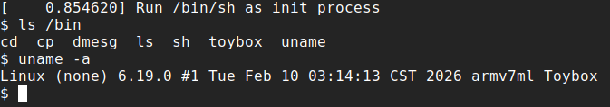

# Linux on STM32H750
> My note: https://hackmd.io/@rota1001/stm32h750-linux

In this project, I successfully run **Linux 6.19** on STM32H750, which only has **1MB of RAM**, and run toybox with uClibc support.



## Features
- A **QEMU SoC model** with a core peripheral subset (UART, Memory and Timer), successfully booted Linux kernel and run a user program (With some function hooking in the gdb script)
- A **minimal bootloader (only 12KB)** to load the linux kernel
- Used **SPARSEMEM memory model** to utilize non-contiguous memory regions
- POSIX library function support with **uClibc**
- **Execute-in-Place** user program, running without loading readonly segments to RAM
- Run toybox, which is a lightweight busybox

## How to Play the Pre-build Binary
I provide a pre-build binary, if you trust me.

First, you should have `gdb-multiarch`.

Second, download the pre-build binary, and have fun!
```
wget https://github.com/rota1001/stm32h7-linux/raw/refs/heads/main/pre-build.tar.gz
tar zxvf pre-build.tar.gz
cd pre-build
chmod +x run.sh
./run.sh
```

## Build it in one click
I provide a simple build script, you can run it directly:
```
git clone --depth 1 https://github.com/rota1001/stm32h7-linux.git
cd stm32h7-linux
./build.sh
```

## How to Build it Step by Step
If you are curious about the compile process, here it is.

It is a little bit complex, you can see [my note](https://hackmd.io/@rota1001/stm32h750-linux) for the details.

Here is the process:
- Build the qemu
  
  ```
  cd qemu-10.2.0
  ninja -C build
  ```
- Build the bootloader
  ```
  cd bootloader
  make
  ```
- Get kernel source and patch it
  ```
  wget https://cdn.kernel.org/pub/linux/kernel/v6.x/linux-6.19.tar.xz
  tar xvf linux-6.19.tar.xz
  cd linux-6.19
  patch -p1  < ../linux-6.19.patch
  ```
- Build the kernel
  ```
  make linux
  ```
- Create the rootfs directory
  ```
  mkdir -p rootfs
  mkdir -p rootfs/dev
  mkdir -p rootfs/bin
  sudo mknod rootfs/dev/console c 5 1
  sudo mknod rootfs/dev/null c 1 3
  ```
- Build the uClibc and the toybox
  ```
  cd user
  wget https://buildroot.org/downloads/buildroot-2025.02.tar.gz
  tar xvf buildroot-2025.02.tar.gz
  ./build.sh
  cd ..
  cp user/toybox/generated/unstripped/toybox rootfs/bin/toybox
  make rootfs
  ```
- Build the kernel image
  ```
  make kernel
  ```
- Run it
  ```
  make debug
  ```
## How to Play it on the Real Board
First, you should have a board with STM32H750 SoC and the QSPI external flash.

Second, flash the kernel image (build/kernel.bin) to QSPI external flash, you can use tools like CH341 or T48 programmer. You can also program a firmware to write the flash directly.

Third, use tools like ST-LINK or J-Link to flash the bootloader to the internal flash.

Last, connect USART1 to your computer through a TTL-to-USB module, and use tools like `minicon`, `neocon` to get a console.

If you do these perfectly, it will work.
