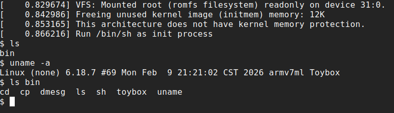
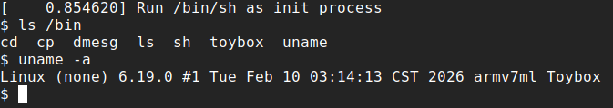

# Running Linux 6.19 on STM32H750

> Github:
> [<https://github.com/rota1001/stm32h7-linux>](https://github.com/rota1001/stm32h7-linux)

這個專題，我在僅有 1MB SRAM 的 STM32H750VBT6 平臺上，運行了 Linux
6.19。本來是 6.18.7 的，但是當我快完成時，發現兩天前發布了
6.19，為了跟緊時事就升級了。

原訂計畫是要加一塊 PSRAM，但出了一點意外，最後還是在只有 1MB SRAM
情況下做了這個專題。

## 使用 qemu 進行模擬

由於硬體還沒到，還有方便 debug 的緣故，我決定使用 qemu 對 stm32h750
進行有限度的模擬（只模擬 UART 與記憶體讀寫），修改的 qemu 版本是
10.2.0。

### 第一次的編譯

    $ wget https://download.qemu.org/qemu-10.2.0.tar.xz
    $ tar xvf qemu-10.2.0.tar.xz

如果只想編譯我們選擇的東西的話，可以用

    --without-default-devices

參數，以下是編譯命令：

    $ ./configure --target-list=arm-softmmu --without-default-devices
    $ ninja -C build

這樣編出來，如果去看看他有哪些機器的話，會發現是空的：

    $ build/qemu-system-arm -M help
    Supported machines are:
    none                 empty machine

### 創建開發板與 SOC

在 [How to add a new architecture to
QEMU](https://fgoehler.com/blog/adding-a-new-architecture-to-qemu-01/)
這篇文章中說明瞭怎麼為 QEMU
引入一個新的架構的機器，然而在這裡我只需要創建開發板和 SOC 就好了，CPU
的部份 qemu 裡面已經實現了。

SOC 的部份就是定義微控制器中的東西，包括
USART、RCC、SPI、記憶體映射等，但在這裡我只實現 USART
與記憶體映射，實際做了什麼可以看看這個
[commit](https://github.com/rota1001/stm32h7-linux/commit/2a5bac10fea4a43303ca70e4a065f1e68ffdb0b1)。

QEMU 使用一個叫做 QOM（QEMU Object
Model）的模式來進行物件導向程式設計，使用

    TypeInfo

結構體定義一個類別，包括名稱、親代類別、類別大小、建構子與類別初始化函式等：

    static const TypeInfo stm32h750_soc_info = {
        .name          = TYPE_STM32H750_SOC,
        .parent        = TYPE_SYS_BUS_DEVICE,
        .instance_size = sizeof(STM32H750State),
        .instance_init = stm32h750_soc_initfn,
        .class_init    = stm32h750_soc_class_init,
    };

此外需要使用一個結構體來定義這個類別中的成員，其中開頭會是這個類別繼承自哪個類別，如以下就是建立了一個叫做

    STM32H750State

的類別，來儲存這個微控制器所要儲存的所有狀態，包括記憶體、CPU、USART
和時鐘，而它繼承自

    SysBusDevice

類別：

    struct STM32H750State {
        SysBusDevice parent_obj;
        ARMv7MState armv7m;
        Stm32l4x5UsartBaseState usart1;
        
        MemoryRegion flash;
        MemoryRegion dtcmram;
        ...
        MemoryRegion flash_alias;
        Clock *sysclk;
    };

建構子的部份會去呼叫各個成員類別的建構子：

    static void stm32h750_soc_initfn(Object *obj)
    {
        STM32H750State *s = STM32H750_SOC(obj);
        object_initialize_child(obj, "armv7m", &s->armv7m, TYPE_ARMV7M);
        object_initialize_child(obj, "usart1", &s->usart1, TYPE_STM32L4X5_USART);
        s->sysclk = qdev_init_clock_in(DEVICE(s), "sysclk", NULL, NULL, 0);
    }

在類別初始化的部份會設定一個叫

    realize

的函式，每個類別都會有一個這樣的函式，它做的事情是去初始化每個成員，譬如說設定記憶體地址、USART
地址或是遞迴的呼叫更多

    realize

之類的。

    stm32h750_soc_realize

的部份有點多，只挑部份敘述，初始化 flash 使用

    memory_region_init_rom

，而初始化 ram 使用

    memory_region_init_ram

：

    memory_region_init_rom(&s->flash, OBJECT(dev_soc), "flash", FLASH_SIZE, &error_fatal);
    memory_region_add_subregion(system_memory, FLASH_BASE, &s->flash);

    memory_region_init_ram(&s->dtcmram, OBJECT(dev_soc), "dtcmram", DTCMRAM_SIZE, &error_fatal);
    memory_region_add_subregion(system_memory, DTCMRAM_BASE, &s->dtcmram);
    ...

USART 部份是將 USART1 連接到第 0 個 serial port，再呼叫 USART 對應類別的
realize：

    DeviceState *dev = DEVICE(&s->usart1);
    qdev_prop_set_chr(dev, "chardev", serial_hd(0));
    if (!sysbus_realize(SYS_BUS_DEVICE(&s->usart1), errp))
        return;

這個 USART 我沒有自己寫的原因是因為我發現 STM32L4x5 的 USART
暫存器的排列與 STM32H750 的排列是相同的，而 QEMU 中有 STM32L4x5 的 USART
實作，就不自己寫了。這裡也可以觀察一下 QEMU
中是怎麼實現暫存器的寫入的。在 \[

    stm32l4x5_usart_base_write

\](<https://github.com/rota1001/stm32h7-linux/blob/006a13852110f7f6db65b8a16cc73267892ac682/qemu-10.2.0/hw/char/stm32l4x5_usart.c#L462>)
中可以看到，QEMU 將暫存器的寫入變成了一個 callback
function，在其中判斷要對哪個暫存器寫入什麼值，再進行對應的操作，譬如用
USART 進行 putchar 的時候，會去對

    TDR

進行寫入，此時它會將 TXE bit 清除，呼叫

    usart_transmit

進行輸出，當確認 CR1-\>TE 是開啟的狀態時，就會使用對應的 chardev
進行輸出：

    switch (addr) {
    ...
    case A_TDR:
        s->tdr = value;
        s->isr &= ~R_ISR_TXE_MASK;
        usart_transmit(NULL, G_IO_OUT, s);
    ...

然後是可以使用

    create_unimplemented_device

來映射未實現的裝置，讓韌體中對未實現裝置對應的暫存器做寫入時，不會跳
hardfault，以下是 RCC 的部份：

    create_unimplemented_device("RCC", 0x58024400, 0x400);

創建 SOC
完後要創建一塊開發板，實際上這塊開發板上只有這塊微控制器，沒有其他週邊了，就創建一個繼承自

    MachineState

的類別，其中有一個成員是上述的

    STM32H750State

類別，在初始化函式中呼叫子類別建構子與 realize，接上時鐘即可。

### 編譯與測試

修改

    hw/arm/Kconfig

：

    +config STM32H750_SOC
    +    bool
    +    select ARM_V7M
    +    select UNIMP
    +    select STM32L4X5_USART
    +
    +config STM32H750_BOARD
    +    bool
    +    default y
    +    depends on TCG && ARM
    +    select STM32H750_SOC
    +    select GENERIC_LOADER

修改

    hw/arm/meson.build

：

    +arm_common_ss.add(when: 'CONFIG_STM32H750_SOC', if_true: files('stm32h750_soc.c'))
    +arm_common_ss.add(when: 'CONFIG_STM32H750_BOARD', if_true: files('stm32h750_board.c'))

在

    configs/devices/arm-softmmu/default.mak

中設定 config 來編譯必要原始碼：

    CONFIG_ARM_V7M=y
    CONFIG_STM32H750_SOC=y
    CONFIG_STM32H750_BOARD=y

然後編譯：

    $ ./configure --target-list=arm-softmmu --without-default-devices
    $ ninja -C build

測試部份就寫了個簡單的 helloworld 來測試，可以使用以下命令來執行：

    $ qemu-10.2.0/build/qemu-system-arm -machine stm32h750 -s \
            -kernel firmware.bin -serial stdio -display none

它就成功輸出東西了。

### 完整啟動 Linux 核心

下面[在開發板上驗證](https://hackmd.io/@rota1001/stm32h750-linux#%E7%AC%AC%E4%B8%80%E6%94%AF%E4%BD%BF%E7%94%A8%E8%80%85%E7%A8%8B%E5%BC%8F)後，我又回過頭來推進軟體模擬進度，讓
Linux 核心可以完整的在我 patch 過的 QEMU 上跑起來。

首先是使用 gdb script 去 hook 一些函式，跳過一些我沒有實現的週邊初始化。

這之後，我發現他的行為是開始執行

    /init

之後，就卡住了，這是因為 timer interrupt 沒有觸發，於是我在 SOC 中加入了
timer，這個 timer 和 STM32F2 的 timer
是一樣的，可以直接用，但加了之後還是在同樣的地方卡住。此時，我發現如果在
gdb 裡面用寫入

    NVIC_ISPR1

的方式觸發 IRQ 會進 scheduler，而且如果去看 timer
的數值會發現他的數字是有增加的，代表問題是在 timer 不會觸發 IRQ。

於是我在 QEMU 裡去監控

    stm32f2xx_timer_read

與

    stm32f2xx_timer_read

兩個函式，看看 Linux 核心在啟動過程中對 timer
的暫存器做了哪些讀寫。發現他在卡住前對

    CCR1

與

    DIER

這兩個暫存器做了寫入。

STM32F2 的 timer 行為是這樣的，

    ARR

和

    CRR1

是他的兩個暫存器，每次數到

    ARR

會歸零重新數。

    DIER

的其中兩個 bit 是

    UIE

和

    CC1IE

，可以分別控制數到

    ARR

和

    CRR1

的時候會不會觸發中斷。

在 QEMU 的實作中，只有實現

    ARR

的中斷，而沒有實現

    CRR1

的部份，於是我將它實現了，然後它就正常啟動了，且成功的開始執行使用者程式：

    [    1.181620] devtmpfs: mounted
    [    1.190161] Freeing unused kernel image (initmem) memory: 12K
    [    1.191654] This architecture does not have kernel memory protection.
    [    1.193469] Run /init as init process
    Hello from userspace! (with write)

### gdb script

我寫了一個 gdb script 來輔助我做 kernel debug，做了以下幾件事：

- 自動載入所有執行檔的所有區段到特定位置
- 跳過我指定的函式
- 連上 gdb server

實作細節就不講了。

## 硬體到了，但是…

本來預計使用的 PSRAM 是 APS6404L，它最高時脈可以到 133MHz 且支援 QSPI
的讀寫模式。然而，實際開始做時發現，STM32H750 的 QSPI 在 Memory Map
模式的時候是唯獨的，也就代表著它不能當 RAM
來使用。當然如果只是要把東西跑起來的話，實際上可以做到讓它寫入時跳
hardfault，再用 Indirect Mode
去進行寫入，然而這很明顯是不能被接受的事情。所以我的決定是：就試試看只用
1MB 的 RAM 吧！

稍微 google 了一下，找到了這篇 [Spreading the disease: Linux on
microcontrollers](https://elinux.org/images/c/ca/Spreading.pdf)，他只使用了
256KB 的 RAM 就將 Linux
跑起來了，雖然沒有公佈實作細節，但讓我知道這是可能的了。

## 手做 Bootloader

我看了一下
[afboot-stm32](https://github.com/mcoquelin-stm32/afboot-stm32)，發現自己寫個
bootloader 其實不難，而且 u-boot
有點肥，就自己寫了。要做的事情就只是初始化時鐘和 QSPI，然後跳到 kernel
image 的入口點就好，上次[跑
DOOM](https://hackmd.io/@rota1001/stm32-doom) 的時候就做過了，不多贅述。

要注意的是，跳到 XIP image 的入口點的時候要代參數，其中第三個參數是
device tree（dtb）所在的地址，dtb 是什麼後面會講：

    void (*kernel)(unsigned long, unsigned long, unsigned long)

## Linux 運行驗證

### 第一次的編譯

我使用的核心版本是 Linux 6.18.7，是目前最新的穩定版本：

    $ wget https://cdn.kernel.org/pub/linux/kernel/v6.x/linux-6.18.7.tar.xz
    $ tar xvf linux-6.18.7.tar.xz

參考 [Running Linux 6.14 on
stm32f429](https://hackmd.io/@yawu/HkZ2pm22yx)，先用以下的方法去編了一個
Linux 核心：

    $ make ARCH=arm stm32_defconfig
    $ make ARCH=arm menuconfig

menuconfig 的部份要設定 DRAM 的基址、DRAM 的大小 和 XIP image
base，以下是我的設定：

- System Type -\> DRAM Base Address: 0x24000000
- System Type -\> DRAM SIZE: 0x80000
- Boot options -\> XIP Kernel Physical Location: 0x90000000

然後編譯：

    $ make ARCH=arm CROSS_COMPILE=arm-linux-gnueabi- -j$(nproc)

它編譯出來的 image 會在

    arch/arm/boot/xipImage

，我們可以看看 vmlinux 各區段的大小：

    $ arm-linux-gnueabi-size vmlinux
       text   data     bss     dec     hex  filename
    2818596 305889  100504  3224989 31359d  vmlinux

可以看到 .data 加上 .bss 差不多 400KB，其實挺多的。

### Device Tree

如果針對不同的硬體週邊的組合，都要在覈心中用一份程式碼來實現的話，會造成核心中出現一堆垃圾程式碼，譬如說對於某個特定機器來說，他的
USART 在哪裡，他有哪些記憶體之類的。Device Tree
就是把這些沒必要的細節從核心中抽離，核心只要在啟動時去讀取對應的 Device
Tree 就好了。

Device Tree 可以分為原始碼形式的 dts 與 binary 形式的 dtb，在編譯 linux
核心時同時會把原始碼形式的 dts 轉換成 binary 形式的
dtb，而核心在執行期間要讀取的是 binary 形式的 dtb。上述 bootloader
中需要的地址其實就是 dtb 載入到記憶體中之後的地址。

這裡就是去寫一個 stm32h750vbt6 的 dts，這部份學會語法再模仿其他 dts
就寫得出來了，不多贅述。

### 在 qemu 中啟動

qemu 中可以使用 loader 在啟動時將特定 binary
載入到特定的地址，不過要先修改

    hw/arm/Kconfig

加入特定功能：

    config STM32H750_BOARD
        bool
        default y
        depends on TCG && ARM
        select STM32H750_SOC
    +   select GENERIC_LOADER

接下來可以用以下的命令去啟動 qemu：

    $ qemu-10.2.0/build/qemu-system-arm -machine stm32h750 -s  \
        -kernel $(BOOTLOADER_BIN) -serial stdio -display none \
        -device loader,file=linux-6.18.7/arch/arm/boot/xipImage,addr=0x90000000 \
        -device loader,file=linux-6.18.7/arch/arm/boot/dts/st/stm32h750vbt6.dtb,addr=0x90400000

因為我將 dtb 載入到 0x90400000 這個地址，所以可以在 bootloader
中這樣呼叫 kernel：

    kernel(0, ~0UL, 0x90400000);

預料之中的，沒有成功啟動，但有成功的跳到核心的進入點了，且 dtb
正確載入了（用記憶體判斷的），是個好預兆。

於是直接上 gdb 看看發生了什麼事，看到它 panic 了，原因是記憶體不足：

     ► 0 0x90000e9e vpanic+334
       1 0x90000f2a panic+26
       2 0x902a6f18 __memblock_alloc_or_panic+32
       3 0x90195642 __unflatten_device_tree+82
       4 0x902add00 unflatten_device_tree+78
       5 0x902a10ce setup_arch+328
       6 0x9029ef7c start_kernel+46
       7      0x0 None

而且這是在很初期就 panic
了，大概是跑到[這個位置](https://github.com/torvalds/linux/blob/master/init/main.c#L1027)。

### 使用 tinyconfig

我先用 tinyconfig 建立一個很小的核心 config，再把 stm32_defconfig
裡的東西放進去，custom_config 是我把 stm32_defconfig 和一些我在
menuconfig 裡設定的東西融合起來所寫出的東西。

    $ make ARCH=arm tinyconfig
    $ ./scripts/kconfig/merge_config.sh -m .config ./custom_config
    $ make ARCH=arm olddefconfig
    $ make ARCH=arm CROSS_COMPILE=arm-linux-gnueabi- -j$(nproc) 

再看看大小，加起來降到 100KB 左右：

    $  arm-linux-gnueabi-size vmlinux
       text   data     bss     dec     hex  filename
    1140728  83837   17488  1242053 12f3c5  vmlinux

另外發現的一件事情是，在設定 config 的時候會設定一個 DRAM_BASE，而 .data
和 .bss 預設會從 DRAM_BASE + 0x8000 開始長，可以透過修改

    arch/arm/Makefile

來修改設定：

    - textofs-y := 0x00008000
    + textofs-y := 0x0

### SPARSEMEM_EXTREME 記憶體模型

做了以上事情之後，會發現記憶體仍然不足，這是因為我在 dts
裡面還只有設定一塊記憶體，也就是 AXISRAM：

        memory@24000000 {
            device_type = "memory";
            reg = <0x24000000 0x80000>;
        };

以下要去啟用其他塊記憶體。

Linux 中的 [Physical Memory
Model](https://docs.kernel.org/mm/memory-model.html) 可以大致分為
FLATMEM 與
SPARSEMEM（其實這只是其中的兩種設定，只是概念上我想可以這樣分類），FLATMEM
需要初始記憶體是一整塊連續的，相對應的好處是實體記憶體位置（PFN）與它所對應的
page
結構體可以直接使用偏移量計算出來。然而，我們沒有那麼長的連續記憶體，如果使用
FLATMEM 模式的話，它會將記憶體區塊與記憶體區塊間的空隙都用一些沒用的
page 結構體來描述。

舉個實際的例子，如果在 0x24000000 有大小為 0x80000 的 AXISRAM、在
0x30000000 有大小為 0x48000 的 SRAM1，在 0x24080000 到 0x30000000
之間會用 page 結構體來填滿，每個 page 結構體是 64 bytes 可以表示一個
page（4KB），所以總共會多花
(0x30000000-0x24080000)/(4\*1024)\*64B，也就是差不多 3MB
的空間，很明顯這不是個可行的方案。所以，我轉而使用 SPARSEMEM 模式。

SPARSEMEM 模式不要求初始記憶體是連續的，而是把初始記憶體分成好幾個
sections，每個 section
內部是連續的，所以很適合有多塊不連續記憶體的裝置。然而 SPARSEMEM
有個缺點是他有多少個 section
是寫死的，我們實際上不會用到那麼多，所以有了另一個 Memory Model，叫做
SPARSEMEM_EXTREME。

在 SPARSEMEM_EXTREME 中，section
是動態分配的，所以不會佔那麼多空間，以下說明如何配置它，首先設定以下
config：

    CONFIG_SPARSEMEM_MANUAL=y
    CONFIG_SPARSEMEM=y
    # CONFIG_SPARSEMEM_STATIC is not set
    CONFIG_SPARSEMEM_EXTREME=y
    CONFIG_ARCH_SPARSEMEM_ENABLE=y
    # CONFIG_FLATMEM is not set

這樣做之後，會發現做完

    make ARCH=arm olddefconfig

之後，

    CONFIG_SPARSEMEM_EXTREME=y

的設定不會套用，讀一下

    arch/arm/Kconfig

之後會知道原因：

    config ARCH_SPARSEMEM_ENABLE
        def_bool !ARCH_FOOTBRIDGE
        select SPARSEMEM_STATIC if SPARSEMEM

    config SPARSEMEM_EXTREME
        def_bool y
        depends on SPARSEMEM && !SPARSEMEM_STATIC

看以上這兩條設定會發現在邏輯上

    CONFIG_SPARSEMEM_EXTREME

是絕對不可能設成

    y

的，於是我做了以下修改：

    config ARCH_SPARSEMEM_ENABLE
        def_bool !ARCH_FOOTBRIDGE
    -   select SPARSEMEM_STATIC if SPARSEMEM

成功啟用 SPARSEMEM_EXTREME 之後修改 dts 並進行測試，發現在

    bootmem_init

時記憶體不夠：

     ► 0 0x90000b94 vpanic+268
       1 0x90000c2c kmalloc_array_noprof.constprop
       2 0x90111b12 __populate_section_memmap+58
       3 0x90111bfc sparse_init_nid+148
       4 0x90111cd2 sparse_init+114
       5 0x9010d690 bootmem_init+44
       6 0x9010d788 paging_init+36
       7 0x9010d276 setup_arch+156

這是因為它預設的 section 太大了，可以在

    arch/arm/include/asm/sparsemem.h

中看到：

    #define MAX_PHYSMEM_BITS    36
    #define SECTION_SIZE_BITS   28

第一個數字代表的是最大的實體記憶體有幾個 bit，第二個數字代表一個 section
有幾個 bit。28 的話代表一個 section 是 256 MB，所以 page
結構體需要的空間是

bytes，也就是 4 MB，這很明顯又太大了。

這個案例裡，最高的記憶體地址是

    0x38000000

，只要 30 bits 就足夠了，SECTION_SIZE_BITS 的下限取決於 subsection
的大小 21 bits，為了只修改極小量的程式碼，我就暫時設 21 bits。

    - #define MAX_PHYSMEM_BITS  36
    - #define SECTION_SIZE_BITS 28
    + #define MAX_PHYSMEM_BITS  30
    + #define SECTION_SIZE_BITS 21

這時候要去調整一下

    ARCH_FORCE_MAX_ORDER

這個設定，它可以決定核心可以分配的最大連續 page 數是 2
的多少次方個，預設是 10，代表最多一次可以分配

KB 的空間，也就是 4 MB。這個數字不能超過 section
的大小，所以我把它調整成了 4。

做完調整後，下一個卡在的點就不是記憶體問題了：

     ► 0 0x9000310a __invalid_entry+62
       1 0x900034dc unwind_frame+96
       2 0x900034dc unwind_frame+96
       3 0x2400c8e0 stm32_dmamux_driver+20

而且更重要的是，如果把斷點下在

    schedule

的話，會發現它成功的開始排程了：

     ► 0x900bc6a4 <schedule>       push   {r4, r5, r7, lr}
       0x900bc6a6 <schedule+2>     ldr    r5, [pc, #0x40]      R5, [schedule+68]
       0x900bc6a8 <schedule+4>     add    r7, sp, #0           R7 => 0x24053f78 (0x24053f78 + 0x0)
       0x900bc6aa <schedule+6>     ldr    r4, [r5]             R4, [__current]
       0x900bc6ac <schedule+8>     ldr.w  r3, [r4, #0x170]     R3, [0x24048770]

## 在開發板上測試

由於一些週邊要在 QEMU
上實現的成本太高了，我開始直接到開發板上測試，軟體模擬部份配合 gdb
script 跳過一些會出問題的部份來輔助 debug。

我發現之前沒有輸出訊息是因為我 config 裡面沒有把 printk 和 early_printk
開啟，於是開啟後就可以看到由 USART1 輸出的訊息了：

    [    1.383449] Out of memory and no killable processes...
    [    1.394809] Kernel panic - not syncing: System is deadlocked on memory
    [    1.408505] ---[ end Kernel panic - not syncing: System is deadlocked on memory ]---

看起來是記憶體不足，調了一些參數後就解決了，現在看起來成功的到達要找
init 程式去跑的步驟了：

    [    1.131774] Run /sbin/init as init process
    [    1.141600] Run /etc/init as init process
    [    1.151503] Run /bin/init as init process
    [    1.161402] Run /bin/sh as init process
    [    1.171173] Kernel panic - not syncing: No working init found.  Try passing init= option to kernel. Se.
    [    1.197423] ---[ end Kernel panic - not syncing: No working init found.  Try passing init= option to k-

下一步就是要想辦法弄個 rootfs 上去，但 RAM
已經有點不夠了，要想辦法繼續壓縮核心或是看看 user program 有沒有辦法
XIP。

## rootfs

### 再壓一些空間

我一開始選用的是 initramfs，這是需要載入進 RAM
的，所以需要再壓一些空間。看看 boot log 會發現有一塊 128KB
的低位空間被忽略了：

    [    0.000000] OF: fdt: Ignoring memory block 0x20000000 - 0x20020000

這是因為它低於我在 config 裡面設定的

    CONFIG_DRAM_BASE

而在
[early_init_dt_add_memory_arch](https://github.com/torvalds/linux/blob/5fd0a1df5d05ad066e5618ccdd3d0fa6cb686c27/drivers/of/fdt.c#L1177)
中被丟棄了。於是隻要去改一下

    DRAM_BASE

，再修改一下

    textofs-y

就能同時滿足可以使用那 128KB 的空間和將 .data 與 .bss 區段載入到
0x24000000 起始的記憶體中。

    -CONFIG_DRAM_BASE=0x24000000
    -CONFIG_DRAM_SIZE=0x80000
    +CONFIG_DRAM_BASE=0x20000000
    +CONFIG_DRAM_SIZE=0x20000

然而，我發現 128KB 其實很適合放 .bss 和 .data，去看

    System.map

之後，發現快可以壓進 128KB（0x20000 bytes）了，而將 .bss 和 .data 移到
128KB 的區塊就意味著我們在 memory pool
中一開始有更大的連續區塊（512KB）：

    24020fc8 B _end 

所以我開始找哪裡可以壓，發現 STM32 預設最大可以有 9 個
USART，所以用了固定長度為 9 的陣列來存結構體，共使用了 4KB 的空間：

    2001faf0 b stm32_ports
    20020af8 b base_crng

我只要使用一個，就把它改掉了：

    -#define STM32_MAX_PORTS 9
    +#define STM32_MAX_PORTS 1

再看看

    System.map

，發現裡面有一堆 STM32F4 的相關結構體，這是因為我的 config 是由
stm32defconfig 微調過來的，有些東西沒關掉，於是我將他們去掉了。

    # CONFIG_MACH_STM32F429 is not set
    # CONFIG_MACH_STM32F469 is not set
    # CONFIG_MACH_STM32F746 is not set
    # CONFIG_MACH_STM32F769 is not set

    # CONFIG_PINCTRL_STM32F429 is not set
    # CONFIG_PINCTRL_STM32F469 is not set
    # CONFIG_PINCTRL_STM32F746 is not set
    # CONFIG_PINCTRL_STM32F769 is not set

最後壓進 0x20000 了：

    2001e170 B _end

再看看 boot log，所有記憶體都成功的加進來了：

    [    0.000000] Zone ranges:
    [    0.000000]   Normal   [mem 0x0000000020000000-0x000000003800ffff]
    [    0.000000] Movable zone start for each node
    [    0.000000] Early memory node ranges
    [    0.000000]   node   0: [mem 0x0000000020000000-0x000000002001ffff]
    [    0.000000]   node   0: [mem 0x0000000024000000-0x000000002407ffff]
    [    0.000000]   node   0: [mem 0x0000000030000000-0x0000000030047fff]
    [    0.000000]   node   0: [mem 0x0000000038000000-0x000000003800ffff]

### initramfs

建好一個 rootfs 的目錄之後，使用以下命令可以生出一個

    initramfs.cpio

：

    $ cd rootfs
    $ find . | cpio -o -H newc > ../initramfs.cpio

在 config 中帶入參數指定 initramfs 的路徑，然後就可以編譯了：

    CONFIG_INITRAMFS_SOURCE="/home/rota1001/side-project/stm32h7-linux/initramfs.cpio"

### 第一支使用者程式

看 boot log 會發現它無法開啟 initial console：

    [    1.029492] Warning: unable to open an initial console.

追進去
[init/main.c#L1645](https://github.com/torvalds/linux/blob/master/init/main.c#L1645)
看會發現在覈心啟動時會去開啟

    /dev/console

，並且將 0、1、2 這三個 file descriptor 都導到上面，而它現在找不到

    /dev/console

：

    void __init console_on_rootfs(void)
    {
        struct file *file = filp_open("/dev/console", O_RDWR, 0);

        if (IS_ERR(file)) {
            pr_err("Warning: unable to open an initial console.\n");
            return;
        }
        init_dup(file);
        init_dup(file);
        init_dup(file);
        fput(file);
    }

可以手動在 rootfs 中創建 dev 目錄，並且使用 mknod
去創建節點，這樣可以透過 devtmpfs 去和裝置互動。

mknod 要帶入四個參數：

- 創建的節點路徑
- 裝置類型
- major number
- minor number

這些參數可以在
[devices.txt](https://www.kernel.org/doc/Documentation/admin-guide/devices.txt)
裡面找到，於是分別創建 console 與 null：

    $ mkdir -p rootfs/dev
    $ sudo mknod rootfs/dev/console c 5 1
    $ sudo mknod rootfs/dev/null c 1 3

重新打包會發現，

    /dev/console

成功被開啟來了。

下一步是跑一個簡單的程式，它要使用 bFLT 執行檔格式，這是一種 linux 在
NOMMU 的環境下使用的執行檔格式。

要編譯出這個格式的執行檔要先搞工具鏈，以下使用 pre-build 的
binary，好習慣檢查一下 hash：

    $ wget https://toolchains.bootlin.com/downloads/releases/toolchains/armv7m/tarballs/armv7m--uclibc--bleeding-edge-2025.08-1.tar.xz
    $ sha256sum armv7m--uclibc--bleeding-edge-2025.08-1.tar.xz
    13ebf698a4bfcdbb41d8e619cf76fbeb15224fe7c5239436a7e9c558ed7852db  armv7m--uclibc--bleeding-edge-2025.08-1.tar.xz
    $ tar xvf armv7m--uclibc--bleeding-edge-2025.08-1.tar.xz

編譯執行檔，將它放進 rootfs 中，我先編譯一個[直接用 syscall
輸出一個字串的程式](https://gist.github.com/rota1001/4a5e061653c034ed75c26b1322659e9c)：

    $ armv7m--uclibc--bleeding-edge-2025.08-1/bin/arm-linux-gcc \
        -mcpu=cortex-m7 -mthumb -static -nostdlib -fno-pic -fno-pie \
        -fomit-frame-pointer -Wl,-elf2flt="-s 128" -o init init.c
    $ cp init rootfs

然後在 device tree 中的 bootargs 中帶入

    rdinit=/init

，啟動核心。  
會發現成功啟動了，但是輸出亂碼，這是因為在 [stm32 的 usart
driver](https://github.com/torvalds/linux/blob/5fd0a1df5d05ad066e5618ccdd3d0fa6cb686c27/drivers/tty/serial/stm32-usart.c#L1957)
中，初始化一個 console 時設定的 baud rate 預設是 9600，我直接把它改成
115200：

    static int stm32_usart_console_setup(struct console *co, char *options)
    {
        struct stm32_port *stm32port;
    -    int baud = 9600;
    +    int baud = 115200;
    ...

再次啟動後，成功執行第一個 user program 了：

    [    1.065759] Run /init as init process
    Hello from userspace! (with write)

### romfs

考慮到使用者程式的可移植性，下一步是我要使用 libc 而非直接的 syscall
實現使用者程式。然而，這樣的情況會使得執行檔的體積顯著的增加，以下這個程式編譯出來的大小將近
100KB：

    #include <stdio.h>

    int main() {
        printf("Hello from userspace! (with printf)\n");
    }

可想而知，根本沒有連續的 100KB 可以用：

    [    1.104774] Run /init as init process
    [    1.115493] nommu: Allocation of length 102400 from process 1 (init) failed
    ...
    [    1.353224] binfmt_flat: Unable to allocate RAM for process text/data, errno -12

於是接下來要去實現的就是使用者程式的 XIP 執行。

要實現這件事首先要用 romfs 替代 initramfs，因為在 initramfs
中即使使用者程式是 XIP 了還是會佔 RAM 的空間，而 romfs 則是一直在 flash
中的檔案系統，這樣 XIP 纔有較大的效益。

開啟 romfs 首先需要先開一些 config：

    # CONFIG_BLOCK is not set
    CONFIG_MTD=y
    # CONFIG_MTD_BLOCK is not set
    # CONFIG_MTD_BLKDEVS is not set
    CONFIG_MTD_PHRAM=y

    CONFIG_MISC_FILESYSTEMS=y
    CONFIG_ROMFS_FS=y
    CONFIG_ROMFS_BACKED_BY_MTD=y
    CONFIG_ROMFS_ON_MTD=y

這裡

    MTD_PHRAM

可以讓我們透過 bootargs 來直接指定格式化為 romfs
的記憶體區塊的地址在哪裡，不在 device tree 裡面建立 block
是因為那需要額外的 driver。於是可以在 bootargs 加入以下參數：

    phram.phram=romfs,0x90600000,0x80000 root=mtd:romfs rootfstype=romfs init=/init

這會將 0x90600000 開始的記憶體以 romfs
的形式解析，並掛載到根目錄上，然後以

    /init

作為第一個使用者程式。

此時，

    init

仍不是 XIP 的，但可以成功執行了。

### 使用者程式 XIP 執行

XIP 的意思是隻要是唯讀的東西都在 flash 中執行，只有 bss 和 data 在 RAM
中執行，要做到這件事必須要以 PIC （Position Independent
Code）的方式來編譯，執行過程中，除了唯獨的區域是以 pc
的相對位置取以外，data 與 bss 都是以在 RAM 中放的 GOT table
的相對位置來取，而 GOT table 所在的位置則由固定的暫存器來定義。gcc
預設是使用 r9，但是如果追進去看看 Linux 核心中 flat binary loader
的實現的話，會發現它使用的是 r10，這件事雖然在這裡以一句話帶過，但我用
gdb
追了一整個晚上（[arch/arm/include/asm/processor.h#L69](https://github.com/torvalds/linux/blob/master/arch/arm/include/asm/processor.h#L69)）：

    #define start_thread(regs,pc,sp)                    \
    ({                                  \
        ...
        if (IS_ENABLED(CONFIG_BINFMT_ELF_FDPIC) &&          \
            ...
        } else if (!IS_ENABLED(CONFIG_MMU))             \
            regs->ARM_r10 = current->mm->start_data;        \
        ...
    })

知道這件事後就可以這樣的去進行編譯：

    $ armv7m--uclibc--bleeding-edge-2025.08-1/bin/arm-linux-gcc       \
        -mcpu=cortex-m7 -mthumb -static -nostdlib -fpic               \
        -mpic-register=r10 -fomit-frame-pointer -Wl,-elf2flt="-s 128" \
        -o init init.c

然後就成功了。

### uclibc

下一步就是要引入 libc 了，我當然無法使用 glibc
那樣的方案，隨便一個小程式編起來在 data 和 bss 都會多出幾百
KB，所以我使用的是對嵌入式平臺較友善的 uclibc。以下是直接以 toybox
作為編譯的範例的，講完 uclibc 再回過頭來講 toybox。

由於我的執行檔必須是 PIC 的，這件事在編譯 libc
的時候就要決定，所以我需要從頭編譯，這裡使用 buildroot
來建構工具鏈與進行編譯工作。

    wget https://buildroot.org/downloads/buildroot-2025.02.tar.gz
    tar xzf buildroot-2025.02.tar.gz

寫好 config 就可以進行編譯：

    make ARCH=arm toolchain

摸索了一下發現 buildroot 沒有任何只用 config 就能修改 uclibc
編譯參數的方式，於是我直接去進行 patch：

    # package/uclibc/uclibc.mk
    -UCLIBC_EXTRA_CFLAGS = $(TARGET_ABI) $(TARGET_DEBUGGING)
    +UCLIBC_EXTRA_CFLAGS = $(TARGET_ABI) $(TARGET_DEBUGGING) -fpic -mpic-register=r10

編好後，執行發現它跳到奇怪的地址了，看看執行了什麼程式碼：

    0x90604ce4 <__uClibc_main>: stmdb   sp!, {r7, r11, lr}
    0x90604ce8 <__uClibc_main+4>:   mov r8, r3
    ...
    0x90604da2 <__uClibc_main+190>: blx r8

看起來他是跳到

    r8

的位置，且他是由一開始的 r3 來的，依照 arm 的 calling convention
來看，他是以下程式碼中的

    app_fini

：

    void __uClibc_main(int (*main)(int, char **, char **), int argc,
                char **argv, void (*app_init)(void), void (*app_fini)(void),
                void (*rtld_fini)(void),
                void *stack_end attribute_unused) attribute_noreturn;

往前追一下，發現在

    _stext

，也就是 CRT 中，會從一個相對於 PC 的位置取出值作為

    app_fini

的地址，而這個取出的值很明顯的不是正確的值，而這個存取方式看起來很像在存取
GOT，只是它以為 GOT 在 .text 的相對位置：

       0x906000da <_stext+22>:  ldr.w   r10, [pc, #44]  @ 0x90600108 <_stext+68>
       0x906000de <_stext+26>:  addw    r3, pc, #40 @ 0x28
       0x906000e2 <_stext+30>:  add r10, r3
       ...
       0x906000f4 <_stext+48>:  ldr.w   r3, [r10, r12]
       ...
       0x90600100 <_stext+60>:  b.w 0x90604ce4 <__uClibc_main>

在

    0x906000f4

下斷點分析一下當時的情況，當時的 GOT 是在

    0x30010020

，r12 是

    0x5c

，r10 是一個 pc 的相對位置

    0x906109c0

，很顯然不是我要的。看一下正確的情況，

    0x30010020 + r12

放的是什麼值：

    pwndbg> x/x 0x30010020+$r12
    0x3001007c: 0x90610851
    pwndbg> x/5i 0x90610851
       0x90610851 <_init>:          push    {r3, r4, r5, r6, r7, lr}
       0x90610853 <_init+2>:    nop
       0x90610855 <_init+4>:    pop {r3, r4, r5, r6, r7}
       0x90610857 <_init+6>:    pop {r3}
       0x90610859 <_init+8>:    mov lr, r3

他是 init 函式，剛好是

    __uClibc_main

的第 3 個參數（0-index）。

由這點可以發現，問題出在 CRT 的部份，看一下

    libc/sysdeps/linux/arm/crt1.S

會發現它雖然將

    sl

（

    r10

的別名）當作基址來存取 GOT，但卻在一開始將

    sl

變為一個

    pc

附近的地址（結論上，.L_GOT 是

    pc

附近的地址，這個表上面放的是相對於 GOT 的偏移）：

    ldr sl, .L_GOT
    adr a4, .L_GOT
    add sl, sl, a4
    ldr ip, .L_GOT+4    /* _fini */
    ldr a1, [sl, ip]

於是，只要把前三行去掉，讓

    sl

保留初始值，也就是 GOT 的 base 就好，做完這個修改就成功了。

### toybox

先把大部分功能關掉，並且把 buffer 調小，使用前面編譯的 uclibc
與相關工具鏈進行編譯：

    $ CROSS_COMPILE=../buildroot-2025.02/output/host/bin/arm-linux- \
    CFLAGS="-Os -mthumb -mcpu=cortex-m7 -fpic -mpic-register=r10" \
    LDFLAGS="-Wl,--gc-sections" make

然後放進 romfs 裡，啟動：

    [    0.990850] Run /bin/toybox as init process
    cat cp dmesg echo ls mkdir mv pwd rm sync [    1.337727] Kernel panic - not syncing: Attempted to kill init! exitcode=0x00000000
    [    1.343256] ---[ end Kernel panic - not syncing: Attempted to kill init! exitcode=0x00000000 ]---                                   qemu-system-arm: terminating on signal 2moved

成功了，當然因為它馬上就停了，所以 exit 之後會 kernel panic。  
接下來再壓一些核心空間，在 toybox 的 config
裡面多開啟一些功能，我成功開一個 shell 了：

## Migrate to Linux 6.19

做到這裡時，我發現兩天前發布了最新版本 Linux
6.19，於是我決定來升級一下。  
沒有改太多東西，patch
在[這裡](https://github.com/rota1001/stm32h7-linux/blob/main/linux-6.19.patch)。

