# 什麼是 eBPF？An Introduction and Deep Dive into eBPF Technology
eBPF 是一項革命性的技術，起源於 Linux 核心，它可以在特權上下文中（如作業系統核心）運行沙盒程序。它用於安全有效地擴展核心的功能，而無需通過更改核心原始碼或載入核心模組的方式來實現。

從歷史上看，由於核心具有監督和控制整個系統的特權，作業系統一直是實現可觀測性、安全性和網路功能的理想場所。同時，由於作業系統核心的核心地位和對穩定性和安全性的高要求，作業系統核心很難快速迭代發展。因此在傳統意義上，與在作業系統本身之外實現的功能相比，作業系統等級的創新速度要慢一些。
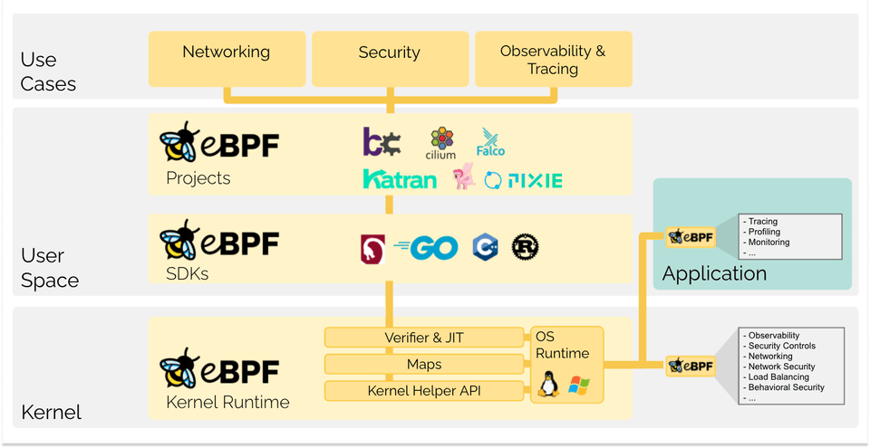
eBPF 從根本上改變了這個方式。通過允許在作業系統中運行沙盒程序的方式，應用程式開發人員可以運行 eBPF 程序，以便在執行階段向作業系統加入額外的功能。然後在 JIT 編譯器和驗證引擎的幫助下，作業系統確保它像本地編譯的程序一樣具備安全性和執行效率。這引發了一股基於 eBPF 的項目熱潮，它們涵蓋了廣泛的用例，包括下一代網路實現、可觀測性和安全功能等領域。

如今，eBPF 被廣泛用於驅動各種用例：在現代資料中心和雲原生環境中提供高性能網路和負載平衡，以低開銷提取細粒度的安全可觀測性資料，幫助應用程式開發人員跟蹤應用程式，為性能故障排查、預防性的安全策略執行(包括應用層和容器執行階段)提供洞察，等等。可能性是無限的，eBPF 開啟的創新才剛剛開始。

eBPF.io 是學習和協作 eBPF 的地方。eBPF 是一個開放的社區，每個人都可以參與和分享。無論您是想閱讀第一個介紹 eBPF 文件，或是尋找進一步的閱讀材料，還是邁出成為大型 eBPF 項目貢獻者的第一步，eBPF.io 將一路幫助你。

BPF 最初代表伯克利包過濾器 (Berkeley Packet Filter)，但是現在 eBPF(extended BPF) 可以做的不僅僅是包過濾，這個縮寫不再有意義了。eBPF 現在被認為是一個獨立的術語，不代表任何東西。在 Linux 原始碼中，術語 BPF 持續存在，在工具和文件中，術語 BPF 和 eBPF 通常可以互換使用。最初的 BPF 有時被稱為 cBPF(classic BPF)，用以區別於 eBPF。

蜜蜂是 eBPF 的官方標誌，最初是由 Vadim Shchekoldin 設計的。在第一屆 [eBPF 峰會](https://ebpf.io/summit-2020)上進行了投票，並將蜜蜂命名為 eBee。(有關徽標可接受使用的詳細資訊，請參閱 Linux 基金會[品牌指南](https://linuxfoundation.org/brand-guidelines/)。)

下面的章節是對 eBPF 的快速介紹。如果您想瞭解更多關於 eBPF 的資訊，請參閱 [eBPF & XDP 參考指南](https://cilium.readthedocs.io/en/stable/bpf/)。無論您是希望建構 eBPF 程序的開發人員，還是對 eBPF 的解決方案感興趣，瞭解這些基本概念和體系結構都是有幫助的。

eBPF 程序是事件驅動的，當核心或應用程式通過某個鉤子點時運行。預定義的鉤子包括系統呼叫、函數入口/退出、核心跟蹤點、網路事件等。
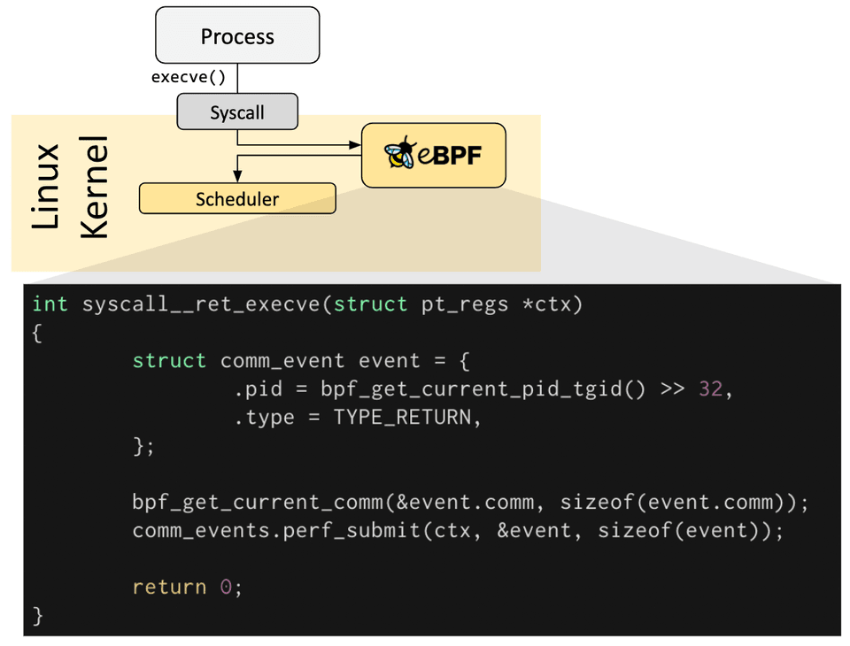
如果預定義的鉤子不能滿足特定需求，則可以建立核心探針（kprobe）或使用者探針（uprobe），以便在核心或使用者應用程式的幾乎任何位置附加 eBPF 程序。
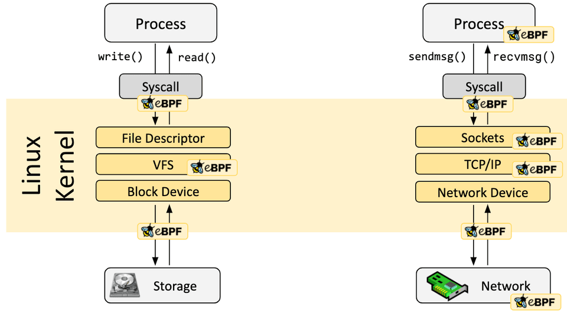
在很多情況下，eBPF 不是直接使用，而是通過像 [Cilium](https://ebpf.io/projects/#cilium)、[bcc](https://ebpf.io/projects/#bcc) 或 [bpftrace](https://ebpf.io/projects/#bpftrace) 這樣的項目間接使用，這些項目提供了 eBPF 之上的抽象，不需要直接編寫程序，而是提供了指定基於意圖的來定義實現的能力，然後用 eBPF 實現。

如果不存在更高層次的抽象，則需要直接編寫程序。Linux 核心期望 eBPF 程序以位元組碼的形式載入。雖然直接編寫字節碼當然是可能的，但更常見的開發實踐是利用像 [LLVM](https://llvm.org/) 這樣的編譯器套件將偽 c 程式碼編譯成 eBPF 位元組碼。

確定所需的鉤子後，可以使用 bpf 系統呼叫將 eBPF 程序載入到 Linux 核心中。這通常是使用一個可用的 eBPF 庫來完成的。下一節將介紹一些開發工具鏈。
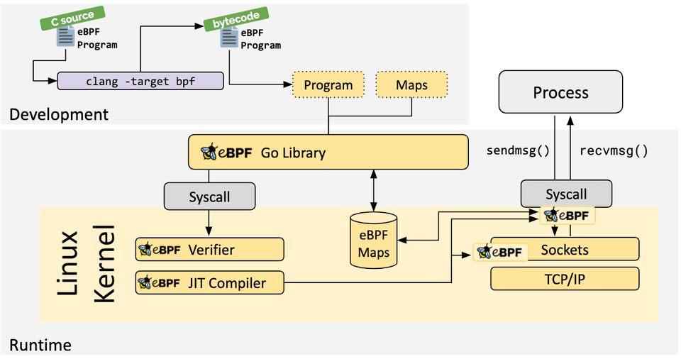
當程序被載入到 Linux 核心中時，它在被附加到所請求的鉤子上之前需要經過兩個步驟：

驗證步驟用來確保 eBPF 程序可以安全運行。它可以驗證程序是否滿足幾個條件，例如：
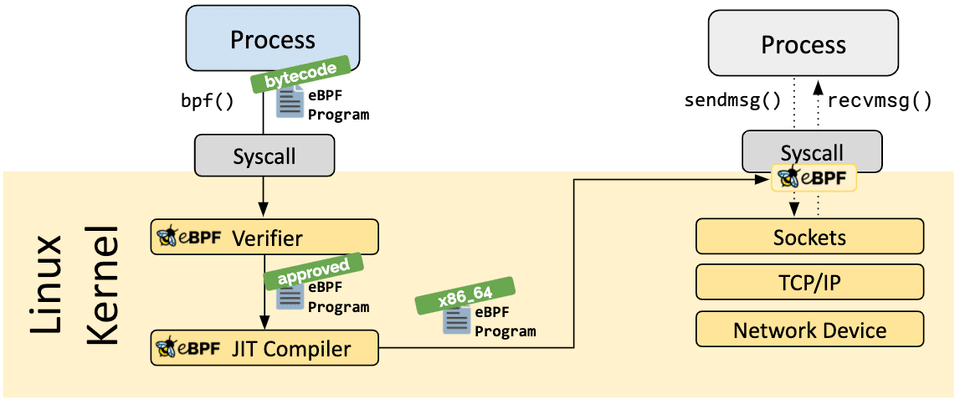
- 載入 eBPF 程序的處理程序必須有所需的能力（特權）。除非啟用非特權 eBPF，否則只有特權處理程序可以載入 eBPF 程序。
- eBPF 程序不會崩潰或者對系統造成損害。
- eBPF 程序一定會運行至結束（即程序不會處於循環狀態中，否則會阻塞進一步的處理）。

JIT (Just-in-Time) 編譯步驟將程序的通用位元組碼轉換為機器特定的指令集，用以最佳化程序的執行速度。這使得 eBPF 程序可以像本地編譯的核心程式碼或作為核心模組載入的程式碼一樣高效地運行。

eBPF 程序的其中一個重要方面是共享和儲存所收集的資訊和狀態的能力。為此，eBPF 程序可以利用 eBPF maps 的概念來儲存和檢索各種資料結構中的資料。eBPF maps 既可以從 eBPF 程序訪問，也可以通過系統呼叫從使用者空間中的應用程式訪問。
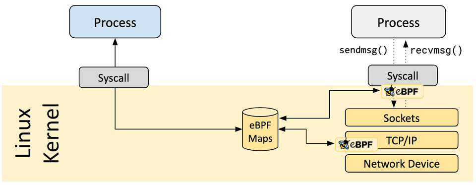
下面是支援的 map 類型的不完整列表，它可以幫助理解資料結構的多樣性。對於各種 map 類型，共享的或 per-CPU 的變體都支援。

- 雜湊表，陣列
- LRU (Least Recently Used) 演算法
- 環形緩衝區
- 堆疊跟蹤 LPM (Longest Prefix match)演算法
- ...

eBPF 程序不直接呼叫核心函數。這樣做會將 eBPF 程序繫結到特定的核心版本，會使程序的相容性複雜化。而對應地，eBPF 程序改為呼叫 helper 函數達到效果，這是核心提供的通用且穩定的 API。
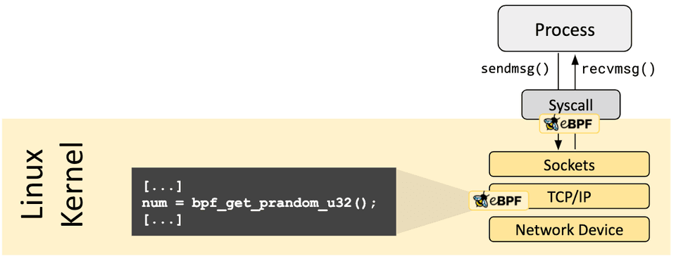
可用的 helper 呼叫集也在不斷髮展迭代中。一些 helper 呼叫的示例:

- 生成隨機數
- 獲取當前時間日期
- eBPF map 訪問
- 獲取處理程序 / cgroup 上下文
- 操作網路封包及其轉發邏輯

eBPF 程序可以通過尾呼叫和函數呼叫的概念來組合。函數呼叫允許在 eBPF 程序內部完成定義和呼叫函數。尾呼叫可以呼叫和執行另一個 eBPF 程序並替換執行上下文，類似於 execve() 系統呼叫對常規處理程序的操作方式。
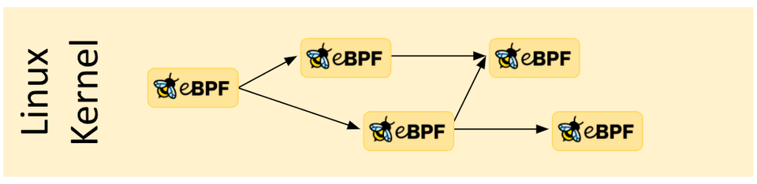
_能力越大責任越大。_

eBPF 是一項非常強大的技術，並且現在運行在許多關鍵軟體基礎設施元件的核心位置。在 eBPF 的開發過程中，當考慮將 eBPF 包含到 Linux 核心中時，eBPF 的安全性是最關鍵的方面。eBPF 的安全性是通過幾層來保證的：

#### 需要的特權

除非啟用了非特權 eBPF，否則所有打算將 eBPF 程序載入到 Linux 核心中的處理程序必須以特權模式 (root) 運行，或者需要授予 CAP\_BPF 權限 (capability)。這意味著不受信任的程序不能載入 eBPF 程序。

如果啟用了非特權 eBPF，則非特權處理程序可以載入某些 eBPF 程序，這些程序的功能集減少，並且對核心的訪問將會受限。

#### 驗證器

如果一個處理程序被允許載入一個 eBPF 程序，那麼所有的程序仍然要通過 eBPF 驗證器。eBPF 驗證器確保程序本身的安全性。這意味著，例如：

- 程序必須經過驗證以確保它們始終運行到完成，例如一個 eBPF 程序通常不會阻塞或永遠處於循環中。eBPF 程序可能包含所謂的有界循環，但只有當驗證器能夠確保循環包含一個保證會變為真的退出條件時，程序才能通過驗證。
- 程序不能使用任何未初始化的變數或越界訪問記憶體。
- 程序必須符合系統的大小要求。不可能載入任意大的 eBPF 程序。
- 程序必須具有有限的複雜性。驗證器將評估所有可能的執行路徑，並且必須能夠在組態的最高複雜性限制範圍內完成分析。

驗證器是一種安全工具，用於檢查程序是否可以安全運行。它不是一個檢查程序正在做什麼的安全工具。

#### 加固

在成功完成驗證後，eBPF 程序將根據程序是從特權處理程序還是非特權處理程序載入而運行一個加固過程。這一步包括：

- **程序執行保護**： 核心中保存 eBPF 程序的記憶體受到保護並變為唯讀。如果出於任何原因，無論是核心錯誤還是惡意操作，試圖修改 eBPF 程序，核心將會崩潰，而不是允許它繼續執行損壞/被操縱的程序。
- **緩解 Spectre 漏洞**： 根據推斷，CPU 可能會錯誤地預測分支並留下可觀察到的副作用，這些副作用可以通過旁路（side channel）提取。舉幾個例子: eBPF 程序可以遮蔽記憶體訪問，以便在臨時指令下將訪問重新導向到受控區域，驗證器也遵循僅在推測執行（speculative execution）下可訪問的程序路徑，JIT 編譯器在尾呼叫不能轉換為直接呼叫的情況下發出 Retpoline。
- **常數盲化（Constant blinding）**：程式碼中的所有常數都是盲化的，以防止 JIT 噴射攻擊。這可以防止攻擊者將可執行程式碼作為常數注入，在存在另一個核心錯誤的情況下，這可能允許攻擊者跳轉到 eBPF 程序的記憶體部分來執行程式碼。

#### 抽象出來的執行階段上下文

eBPF 程序不能直接訪問任意核心記憶體。必須通過 eBPF helper 函數來訪問程序上下文之外的資料和資料結構。這保證了一致的資料訪問，並使任何此類訪問受到 eBPF 程序的特權的約束，例如，如果可以保證修改是安全的，則允許運行的 eBPF 程序修改某些資料結構的資料。eBPF 程序不能隨意修改核心中的資料結構。

讓我們從一個類比開始。你還記得 GeoCities 嗎? 20 年前，網頁幾乎完全由靜態標記語言（HTML）編寫。網頁基本上是一個文件，有一個應用程式（瀏覽器）可以顯示它。看看今天的網頁，網頁已經成為成熟的應用程式，基於 web 的技術已經取代了絕大多數用需要編譯的語言所編寫的應用程式。是什麼促成了這種演進 ？
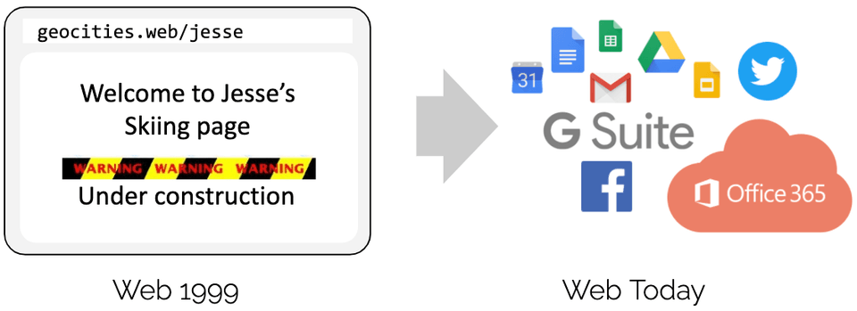
簡短的回答是通過引入 JavaScript 實現可程式設計性。它開啟了一場巨大的革命，導致瀏覽器幾乎演變成一個獨立的作業系統。

為什麼會發生這個演進 ？程式設計師不再受制於運行特定瀏覽器版本的使用者。提升必要建構模組的可用性，將底層瀏覽器的創新速度與運行在其上的應用程式解耦開來，而不是去說服標準機構需要一個新的 HTML 標籤。這當然有點過於簡化這個過程中的變化了，因為 HTML 確實隨著時間的推移而一直髮展，並對這個演進的成功做出了貢獻，但 HTML 本身的發展還不足夠滿足需求。

在將這個示例應用於 eBPF 之前，讓我們先看一下在引入 JavaScript 過程中的幾個關鍵方面：

- **安全**：不受信任的程式碼在使用者的瀏覽器中運行。這個問題通過沙箱 JavaScript 程序和抽象對瀏覽器資料的訪問來解決。
- **持續交付**：程序邏輯的演進必須能夠在不需要不斷髮布新瀏覽器版本的情況下實現。通過提供適當的底層建構模組來建構任意邏輯，解決了這個問題。
- **性能**：必須以最小的開銷提供可程式設計性。這個問題通過引入即時（JIT）編譯器得到瞭解決。由於同樣的原因，上述所有方面都可以在 eBPF 中找到完全對應的內容。

現在讓我們回到 eBPF。為了理解 eBPF 對 Linux 核心的可程式設計性的影響，有必要對 Linux 核心的體系結構及其與應用程式和硬體的互動方式有一個高層次的瞭解。
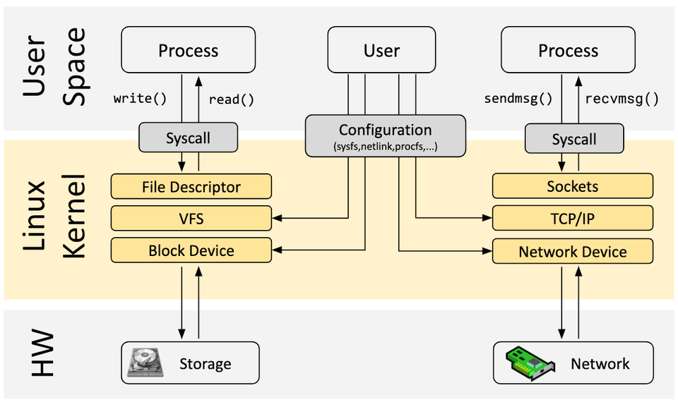
Linux 核心的主要目的是對硬體或虛擬硬體進行抽象，並提供一致的 API（系統呼叫），允許應用程式運行和共享資源。為了實現這一點，核心維護了一組廣泛的子系統和層來分配這些職責。每個子系統通常允許某種等級的組態，以滿足使用者的不同需求。如果無法組態所需的行為，則需要更改核心，從歷史上看，只剩下兩個選項：

### 原生支援

1. 更改核心原始碼並使 Linux 核心社區相信改動是有必要的。
2. 等待幾年後，新的核心才會成為一個通用版本。

### 核心模組

1. 編寫一個核心模組
2. 定期修復它，因為每個核心版本都可能破壞它
3. 由於缺乏安全邊界，有可能損壞 Linux 核心

有了 eBPF，就有了一個新的選項，它允許重新程式設計 Linux 核心的行為，而不需要更改核心原始碼或載入核心模組。在許多方面，這與 JavaScript 和其他指令碼語言解鎖系統演進的方式非常相像，對這些系統進行改動的原有方式已經變得困難或昂貴。

已經有幾個開發工具可以幫助開發和管理 eBPF 程序。它們對應滿足使用者的不同需求:

#### bcc

BCC 是一個框架，它允許使用者編寫 python 程序，並將 eBPF 程序嵌入其中。該框架主要用於應用程式和系統的分析/跟蹤等場景，其中 eBPF 程序用於收集統計資料或生成事件，而使用者空間中的對應程序收集資料並以易理解的形式展示。運行 python 程序將生成 eBPF 位元組碼並將其載入到核心中。
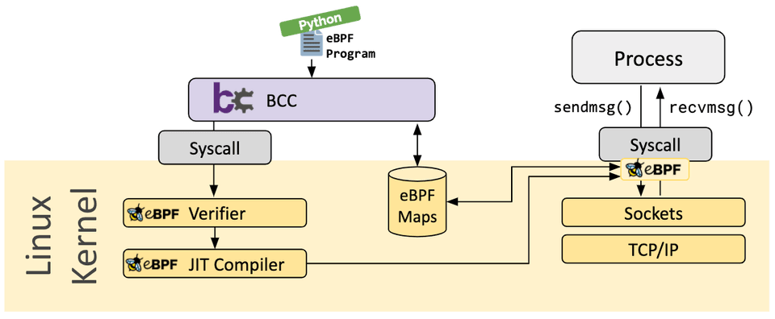
#### bpftrace

bpftrace 是一種用於 Linux eBPF 的高級跟蹤語言，可在較新的 Linux 核心（4.x）中使用。bpftrace 使用 LLVM 作為後端，將指令碼編譯為 eBPF 位元組碼，並利用 BCC 與 Linux eBPF 子系統以及現有的 Linux 跟蹤功能（核心動態跟蹤（kprobes）、使用者級動態跟蹤（uprobes）和跟蹤點）進行互動。bpftrace 語言的靈感來自於 awk、C 和之前的跟蹤程序，如 DTrace 和 SystemTap。
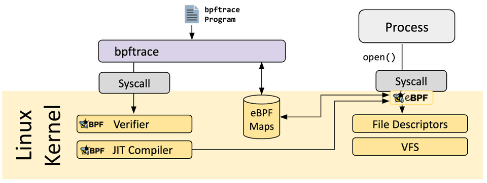
#### eBPF Go 語言庫

eBPF Go 語言庫提供了一個通用的 eBPF 庫，它將獲取 eBPF 位元組碼的過程與 eBPF 程序的載入和管理進行瞭解耦。eBPF 程序通常是通過編寫高級語言，然後使用 clang/LLVM 編譯器編譯成 eBPF 位元組碼來建立的。

#### libbpf C/C++ 庫

libbpf 庫是一個基於 C/ c++ 的通用 eBPF 庫，它可以幫助解耦將 clang/LLVM 編譯器生成的 eBPF 對象檔案的載入到核心中的這個過程，並通過為應用程式提供易於使用的庫 API 來抽象與 BPF 系統呼叫的互動。
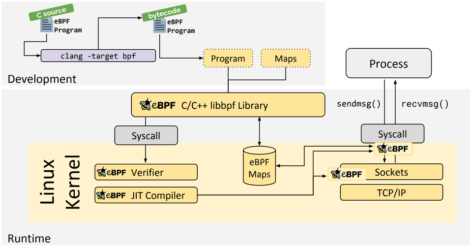
如果您想瞭解更多有關 eBPF 的資訊，請使用以下附加材料繼續閱讀：

- [eBPF Docs](https://docs.ebpf.io/), Technical documentation for eBPF
- [BPF & XDP Reference Guide](https://cilium.readthedocs.io/en/stable/bpf/), Cilium Documentation, Aug 2020
- [BPF Documentation](https://www.kernel.org/doc/html/latest/bpf/index.html), BPF Documentation in the Linux Kernel
- [BPF Design Q&A](https://git.kernel.org/pub/scm/linux/kernel/git/torvalds/linux.git/tree/Documentation/bpf/bpf_design_QA.rst), FAQ for kernel-related eBPF questions

- [Learn eBPF Tracing: Tutorial and Examples](http://www.brendangregg.com/blog/2019-01-01/learn-ebpf-tracing.html), Brendan Gregg's Blog, Jan 2019
- [XDP Hands-On Tutorials](https://github.com/xdp-project/xdp-tutorial), Various authors, 2019
- [BCC, libbpf and BPF CO-RE Tutorials](https://facebookmicrosites.github.io/bpf/blog/), Facebook's BPF Blog, 2020
- [eBPF Tutorial: Learning eBPF Step by Step with Examples](https://github.com/eunomia-bpf/bpf-developer-tutorial), Various authors, 2024

#### 入門

- [eBPF and Kubernetes: Little Helper Minions for Scaling Microservices](https://www.youtube.com/watch?v=99jUcLt3rSk) ([Slides](https://kccnceu20.sched.com/event/ZemQ/ebpf-and-kubernetes-little-helper-minions-for-scaling-microservices-daniel-borkmann-cilium)), Daniel Borkmann, KubeCon EU, Aug 2020
- [eBPF - Rethinking the Linux Kernel](https://www.infoq.com/presentations/facebook-google-bpf-linux-kernel/) ([Slides](https://docs.google.com/presentation/d/1AcB4x7JCWET0ysDr0gsX-EIdQSTyBtmi6OAW7bE0jm0)), Thomas Graf, QCon London, April 2020
- [BPF as a revolutionary technology for the container landscape](https://www.youtube.com/watch?v=U3PdyHlrG1o&t=7) ([Slides](https://fosdem.org/2020/schedule/event/containers_bpf/attachments/slides/4122/export/events/attachments/containers_bpf/slides/4122/BPF_as_a_revolutionary_technology_for_the_container_landscape.pdf)), Daniel Borkmann, FOSDEM, Feb 2020
- [BPF at Facebook](https://www.youtube.com/watch?v=ZYBXZFKPS28), Alexei Starovoitov, Performance Summit, Dec 2019
- [BPF: A New Type of Software](https://youtu.be/7pmXdG8-7WU?t=8) ([Slides](https://www.slideshare.net/brendangregg/um2019-bpf-a-new-type-of-software)), Brendan Gregg, Ubuntu Masters, Oct 2019
- [The ubiquity but also the necessity of eBPF as a technology](https://www.youtube.com/watch?v=mFxs3VXABPU), David S. Miller, Kernel Recipes, Oct 2019

#### 深入研究

- [BPF and Spectre: Mitigating transient execution attacks](https://www.youtube.com/watch?v=6N30Yp5f9c4) ([Slides](https://ebpf.io/summit-2021-slides/eBPF_Summit_2021-Keynote-Daniel_Borkmann-BPF_and_Spectre.pdf)) , Daniel Borkmann, eBPF Summit, Aug 2021
- [BPF Internals](https://www.usenix.org/conference/lisa21/presentation/gregg-bpf) ([Slides](https://www.usenix.org/system/files/lisa21_slides_gregg_bpf.pdf)), Brendan Gregg, USENIX LISA, Jun 2021

#### Cilium

- [Advanced BPF Kernel Features for the Container Age](https://www.youtube.com/watch?v=PJY-rN1EsVw) ([Slides](https://fosdem.org/2021/schedule/event/containers_ebpf_kernel/attachments/slides/4358/export/events/attachments/containers_ebpf_kernel/slides/4358/Advanced_BPF_Kernel_Features_for_the_Container_Age_FOSDEM.pdf)), Daniel Borkmann, FOSDEM, Feb 2021
- [Kubernetes Service Load-Balancing at Scale with BPF & XDP](https://www.youtube.com/watch?v=UkvxPyIJAko&t=21s) ([Slides](https://linuxplumbersconf.org/event/7/contributions/674/attachments/568/1002/plumbers_2020_cilium_load_balancer.pdf)), Daniel Borkmann & Martynas Pumputis, Linux Plumbers, Aug 2020
- [Liberating Kubernetes from kube-proxy and iptables](https://www.youtube.com/watch?v=bIRwSIwNHC0) ([Slides](https://docs.google.com/presentation/d/1cZJ-pcwB9WG88wzhDm2jxQY4Sh8adYg0-N3qWQ8593I/edit#slide=id.g7055f48ba8_0_0)), Martynas Pumputis, KubeCon US 2019
- [Understanding and Troubleshooting the eBPF Datapath in Cilium](https://www.youtube.com/watch?v=Kmm8Hl57WDU) ([Slides](https://static.sched.com/hosted_files/kccncna19/20/eBPF%20and%20the%20Cilium%20Datapath.pdf)), Nathan Sweet, KubeCon US 2019
- [Transparent Chaos Testing with Envoy, Cilium and BPF](https://www.youtube.com/watch?v=gPvl2NDIWzY) ([Slides](https://static.sched.com/hosted_files/kccnceu19/54/Chaos%20Testing%20with%20Envoy%2C%20Cilium%20and%20eBPF.pdf)), Thomas Graf, KubeCon EU 2019
- [Cilium - Bringing the BPF Revolution to Kubernetes Networking and Security](https://www.youtube.com/watch?v=QmmId1QEE5k) ([Slides](https://www.slideshare.net/ThomasGraf5/cilium-bringing-the-bpf-revolution-to-kubernetes-networking-and-security)), Thomas Graf, All Systems Go!, Berlin, Sep 2018
- [How to Make Linux Microservice-Aware with eBPF](https://www.youtube.com/watch?v=_Iq1xxNZOAo) ([Slides](https://www.slideshare.net/InfoQ/how-to-make-linux-microserviceaware-with-cilium-and-ebpf)), Thomas Graf, QCon San Francisco, 2018
- [Accelerating Envoy with the Linux Kernel](https://www.youtube.com/watch?v=ER9eIXL2_14), Thomas Graf, KubeCon EU 2018
- [Cilium - Network and Application Security with BPF and XDP](https://www.youtube.com/watch?v=ilKlmTDdFgk) ([Slides](https://www.slideshare.net/ThomasGraf5/dockercon-2017-cilium-network-and-application-security-with-bpf-and-xdp)), Thomas Graf, DockerCon Austin, Apr 2017

#### Hubble

- [Hubble - eBPF Based Observability for Kubernetes](https://static.sched.com/hosted_files/kccnceu20/1b/Aug19-Hubble-eBPF_Based_Observability_for_Kubernetes_Sebastian_Wicki.pdf), Sebastian Wicki, KubeCon EU, Aug 2020

- [Learning eBPF](https://isovalent.com/books/learning-ebpf/?utm_source=website-ebpf&utm_medium=referral&utm_campaign=partner), Liz Rice, O'Reilly, 2023
- [Security Observability with eBPF](https://isovalent.com/books/ebpf-security/?utm_source=website-ebpf&utm_medium=referral&utm_campaign=partner), Natália Réka Ivánkó and Jed Salazar, O'Reilly, 2022
- [What is eBPF?](https://isovalent.com/books/ebpf/?utm_source=website-ebpf&utm_medium=referral&utm_campaign=partner), Liz Rice, O'Reilly, 2022
- [Systems Performance: Enterprise and the Cloud, 2nd Edition](http://www.brendangregg.com/systems-performance-2nd-edition-book.html), Brendan Gregg, Addison-Wesley Professional Computing Series, 2020
- [BPF Performance Tools](http://www.brendangregg.com/bpf-performance-tools-book.html), Brendan Gregg, Addison-Wesley Professional Computing Series, Dec 2019
- [Linux Observability with BPF](https://www.oreilly.com/library/view/linux-observability-with/9781492050193/), David Calavera, Lorenzo Fontana, O'Reilly, Nov 2019

- [BPF for security - and chaos - in Kubernetes](https://lwn.net/Articles/790684/), Sean Kerner, LWN, Jun 2019
- [Linux Technology for the New Year: eBPF](https://thenewstack.io/linux-technology-for-the-new-year-ebpf/), Joab Jackson, Dec 2018
- [A thorough introduction to eBPF](https://lwn.net/Articles/740157/), Matt Fleming, LWN, Dec 2017
- [Cilium, BPF and XDP](https://opensource.googleblog.com/2016/11/cilium-networking-and-security.html), Google Open Source Blog, Nov 2016
- [Archive of various articles on BPF](https://lwn.net/Kernel/Index/#Berkeley_Packet_Filter), LWN, since Apr 2011
- [Various articles on BPF by Cloudflare](https://blog.cloudflare.com/tag/ebpf/), Cloudflare, since March 2018
- [Various articles on BPF by Facebook](https://facebookmicrosites.github.io/bpf/blog/), Facebook, since August 2018
