# 什麼是 eBPF？

> 本文翻譯自 [eBPF.io](https://ebpf.io/what-is-ebpf/) 官方文檔

## 什麼是 eBPF？

eBPF 是一項革命性的技術，起源於 Linux 核心，可以在作業系統核心等特權環境中執行沙盒程式。它被用來安全且高效地擴展核心的功能，而無需更改核心原始碼或載入核心模組。

從歷史上看，作業系統一直是實現可觀察性、安全性和網路功能的理想場所，因為核心具有監督和控制整個系統的特權能力。同時，作業系統核心由於其核心角色和對穩定性和安全性的高要求，很難發展。因此，與作業系統以外的功能相比，作業系統層級的創新速度傳統上較低。

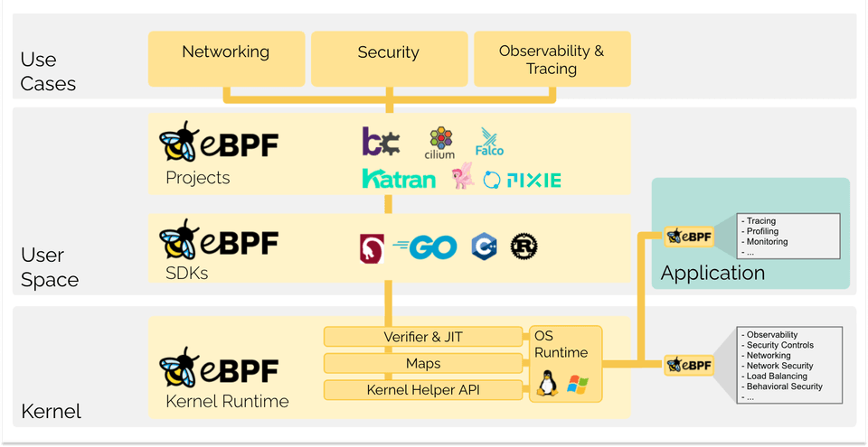

eBPF 從根本上改變了這個公式。它允許沙盒程式在作業系統內執行，這意味著應用程式開發人員可以執行 eBPF 程式來為作業系統添加額外的功能。然後，作業系統保證安全性和執行效率，就像在即時編譯 (JIT) 編譯器和驗證引擎的幫助下進行本機編譯一樣。這導致了一波基於 eBPF 的專案，涵蓋了廣泛的使用案例，包括下一代網路、可觀察性和安全功能。

今天，eBPF 被廣泛用於驅動各種使用案例：在現代資料中心和雲原生環境中提供高效能網路和負載平衡，以低開銷提取細粒度的安全可觀察性資料，幫助應用程式開發人員追蹤應用程式，為效能故障排除、預防性應用程式和容器執行時安全執行提供見解等等。可能性是無限的，eBPF 開啟的創新才剛剛開始。

### eBPF.io 是什麼？

eBPF.io 是每個人學習和協作 eBPF 主題的地方。eBPF 是一個開放的社區，每個人都可以參與和分享。無論您是想閱讀 eBPF 的第一個介紹、尋找更多閱讀材料，還是邁出成為主要 eBPF 專案貢獻者的第一步，eBPF.io 都會為您提供幫助。

### eBPF 和 BPF 代表什麼？

BPF 最初代表 Berkeley Packet Filter，但現在 eBPF（擴展 BPF）可以做的不僅僅是封包過濾，這個縮寫詞不再有意義。eBPF 現在被認為是一個獨立的術語，不代表任何東西。在 Linux 原始碼中，術語 BPF 仍然存在，在工具和文檔中，術語 BPF 和 eBPF 通常可以互換使用。最初的 BPF 有時被稱為 cBPF（經典 BPF），以區別於 eBPF。

### 蜜蜂的名字是什麼？

蜜蜂是 eBPF 的官方標誌，最初由 Vadim Shchekoldin 創建。在第一屆 eBPF 峰會上進行了投票，蜜蜂被命名為 eBee。（有關 eBPF 蜜蜂可接受用途的詳細資訊，請參閱 Linux 基金會品牌指南。）

## eBPF 簡介

以下章節是對 eBPF 的快速介紹。如果您想了解更多關於 eBPF 的資訊，請參閱 eBPF & XDP 參考指南。無論您是希望構建 eBPF 程式的開發人員，還是對該技術本身更感興趣，了解基本概念和架構都是有用的。

### Hook 概述

eBPF 程式是事件驅動的，當核心或應用程式通過某個掛鉤點時執行。預定義的掛鉤包括系統呼叫、函式進入/退出、核心追蹤點、網路事件等。

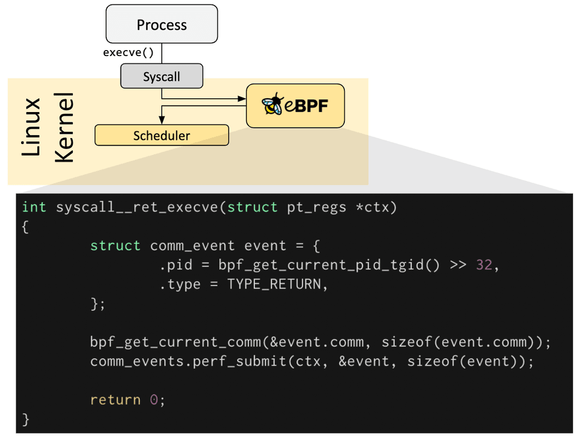

如果特定需求不存在預定義的掛鉤，則可以建立核心探針 (kprobe) 或使用者探針 (uprobe)，將 eBPF 程式附加到核心或使用者應用程式的幾乎任何地方。

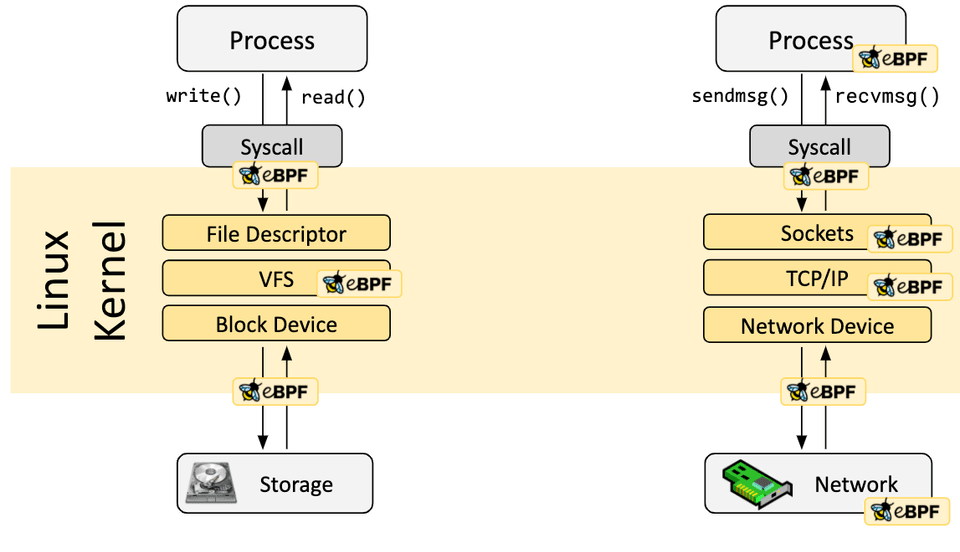

### 如何編寫 eBPF 程式？

在許多場景中，eBPF 不是直接使用，而是透過 Cilium、bcc 或 bpftrace 等專案間接使用，這些專案在 eBPF 之上提供了抽象，不需要直接編寫程式，而是提供了指定基於意圖的定義的能力，然後使用 eBPF 實現。

如果不存在更高級別的抽象，則需要直接編寫程式。Linux 核心期望 eBPF 程式以字節碼的形式載入。雖然當然可以直接編寫字節碼，但更常見的開發實踐是利用像 LLVM 這樣的編譯器套件將偽 C 程式碼編譯成 eBPF 字節碼。

### 載入器和驗證架構

當確定了所需的掛鉤後，可以使用 bpf 系統呼叫將 eBPF 程式載入到 Linux 核心中。這通常是使用其中一個可用的 eBPF 函式庫來完成的。下一節提供了可用的開發工具鏈的介紹。

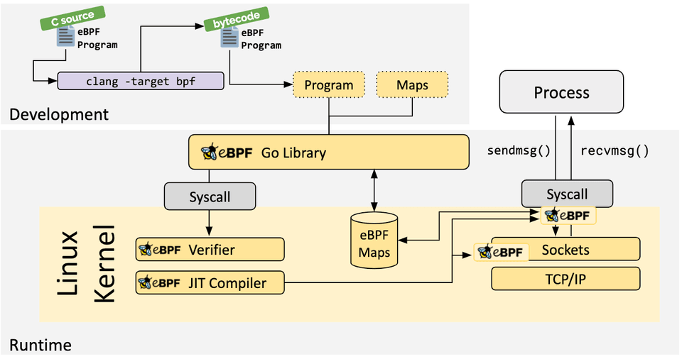

當程式載入到 Linux 核心時，在附加到請求的掛鉤之前，它會經過兩個步驟：

### 驗證

驗證步驟確保 eBPF 程式可以安全執行。它驗證程式是否滿足幾個條件，例如：

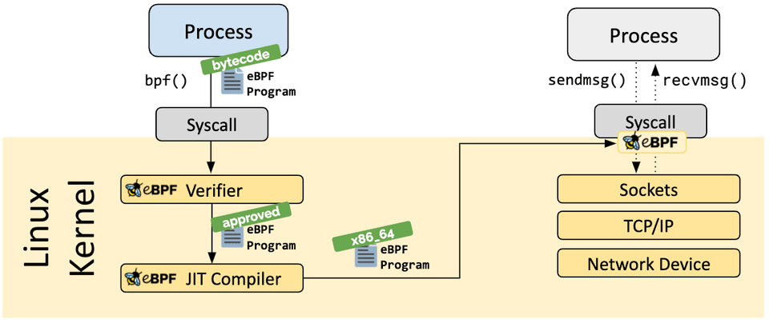

載入 eBPF 程式的過程需要特權，除非啟用了非特權 eBPF。這意味著非特權進程可以載入 eBPF 程式，但功能集會減少，並且無法存取核心。

驗證器確保程式可以安全執行。它驗證程式是否滿足幾個條件，例如：
- 載入 eBPF 程式的進程具有所需的功能（特權）
- 程式不會崩潰或以其他方式損害系統
- 程式總是執行到完成（即程式不會永遠循環，從而阻礙進一步處理）

### JIT 編譯

即時 (JIT) 編譯步驟將程式的通用字節碼轉換為機器特定的指令集，以優化程式的執行速度。這使得 eBPF 程式的執行效率與本機編譯的核心程式碼或作為核心模組載入的程式碼一樣高效。

### Maps

eBPF 程式的一個重要方面是能夠共享收集的資訊並將狀態儲存起來。為此，eBPF 程式可以利用 eBPF maps 的概念來儲存和檢索各種資料結構中的資料。eBPF maps 可以從 eBPF 程式以及透過系統呼叫從使用者空間中的應用程式存取。

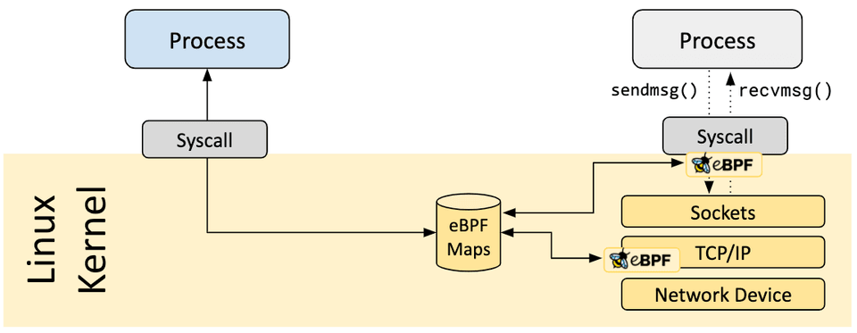

以下是支援的 map 類型的不完整列表，以幫助理解資料結構的多樣性：
- 雜湊表、陣列
- LRU（最近最少使用）
- 環形緩衝區
- 堆疊追蹤
- LPM（最長前綴匹配）
- ...

### Helper 呼叫

eBPF 程式不能呼叫任意的核心函式。允許這樣做會將 eBPF 程式綁定到特定的核心版本，並會使程式的相容性複雜化。相反，eBPF 程式可以呼叫 helper 函式，這是核心提供的眾所周知且穩定的 API。

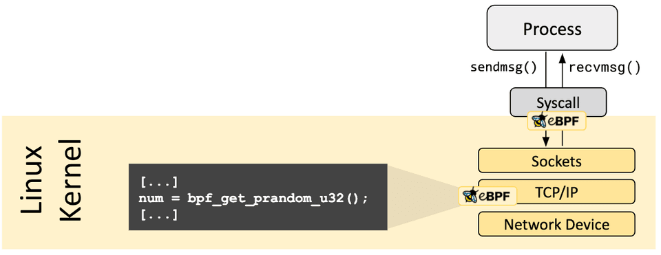

可用的 helper 呼叫集合不斷發展。可用 helper 呼叫的範例：
- 產生隨機數
- 取得目前時間和日期
- eBPF map 存取
- 取得進程/cgroup 上下文
- 操作網路封包及其轉發邏輯

### Tail 和函式呼叫

eBPF 程式可以透過 tail 和函式呼叫的概念進行組合。函式呼叫允許在 eBPF 程式中定義和呼叫函式。Tail 呼叫可以呼叫和執行另一個 eBPF 程式並替換執行上下文，類似於 execve() 系統呼叫對常規進程的操作方式。

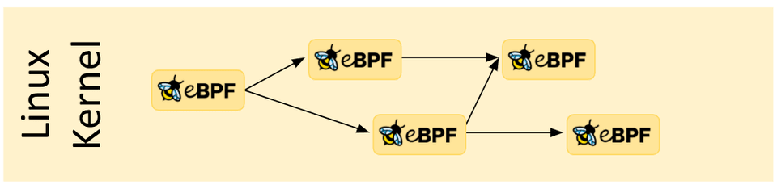

### eBPF 安全性

eBPF 是一項令人難以置信的強大技術，現在執行在許多關鍵軟體基礎設施元件的核心。在 eBPF 的開發過程中，當考慮將 eBPF 包含到 Linux 核心中時，eBPF 的安全性是最重要的方面。eBPF 的安全性透過幾個層面來確保：

#### 所需權限

除非啟用了非特權 eBPF，否則所有打算載入 eBPF 程式的進程都需要以特權模式（root）執行，或者需要 CAP_BPF 功能。這意味著不受信任的程式無法載入 eBPF 程式。

如果啟用了非特權 eBPF，非特權進程可以載入某些 eBPF 程式，但功能集會減少，並且無法存取核心。

#### 驗證器

如果允許進程載入 eBPF 程式，所有程式仍然會通過 eBPF 驗證器。eBPF 驗證器確保程式本身的安全性。這意味著，例如：
- 程式經過驗證以確保它們總是執行到完成，例如，eBPF 程式可能永遠不會阻塞或永遠坐在循環中。eBPF 程式可能包含所謂的有界循環，但程式驗證器只有在能夠確保循環包含保證為真的退出條件時才會接受它們。
- 程式不得使用任何未初始化的變數或存取超出界限的記憶體。
- 程式必須符合系統的大小要求。不可能載入任意大的 eBPF 程式。
- 程式必須具有有限的複雜性。驗證器將評估所有可能的執行路徑，並且必須能夠在配置的複雜性上限範圍內完成分析。

驗證器是一種安全工具，檢查程式是否可以安全執行。它不是一個檢查程式正在做什麼的安全工具。

#### 強化

成功完成驗證後，eBPF 程式會根據程式是從特權進程還是非特權進程載入而執行強化過程。此步驟包括：
- 程式執行保護：保存 eBPF 程式的核心記憶體受到保護並變為唯讀。如果出於任何原因，無論是核心錯誤還是惡意操作，試圖修改 eBPF 程式，核心將崩潰而不是允許它繼續執行損壞/被操縱的程式。
- 針對 Spectre 的緩解措施：在推測下，CPU 可能會錯誤預測分支並留下可透過側通道提取的可觀察副作用。舉幾個例子：eBPF 程式屏蔽記憶體存取，以便在推測執行下將瞬態指令重定向到受控區域，驗證器也遵循僅在推測執行下可存取的程式路徑，JIT 編譯器在尾部呼叫無法轉換為直接呼叫時發出 Retpolines。
- 常數致盲：程式碼中的所有常數都被致盲，以防止 JIT 噴射攻擊。這可以防止攻擊者將可執行程式碼作為常數注入，在存在另一個核心錯誤的情況下，可能允許攻擊者跳轉到 eBPF 程式的記憶體部分來執行程式碼。

#### 抽象的執行時上下文

eBPF 程式無法直接存取任意核心記憶體。必須透過 eBPF helper 存取程式上下文之外的資料和資料結構。這保證了一致的資料存取，並使任何此類存取都受到 eBPF 程式特權的約束，例如，只有與程式類型相關的資料結構才能被讀取，並且只有在驗證器批准資料存取時才能被讀取。例如，執行中的 eBPF 程式如果被確定為受信任的，可以修改某些資料結構的資料。

## 為什麼選擇 eBPF？

### 可程式設計的力量

讓我們從一個類比開始。您還記得 GeoCities 嗎？20 年前，網頁幾乎完全由靜態標記語言 (HTML) 編寫。網頁基本上是一個文件（具有應用程式樣式和圖像），但實質上，允許使用者查看的仍然是一個文件。查看網頁的唯一方法是更新它。

然後出現了 JavaScript，一切都改變了。JavaScript 使網頁變得互動；它不僅解鎖了現在已成為可能的各種豐富的應用程式，而且還導致了大規模的演變，瀏覽器幾乎演變成了基於作業系統的作業系統。

### 為什麼是現在？

讓我們回顧一下 JavaScript 最初為瀏覽器實現可程式設計性的旅程，並將其與 eBPF 對 Linux 核心所做的事情聯繫起來。顯然，Linux 核心的可程式設計性以多種形式存在已經幾十年了。您可以編寫核心模組，或者與現有的呼叫介面一起使用。當滿足以下幾個重要方面時，eBPF 從根本上是不同的：

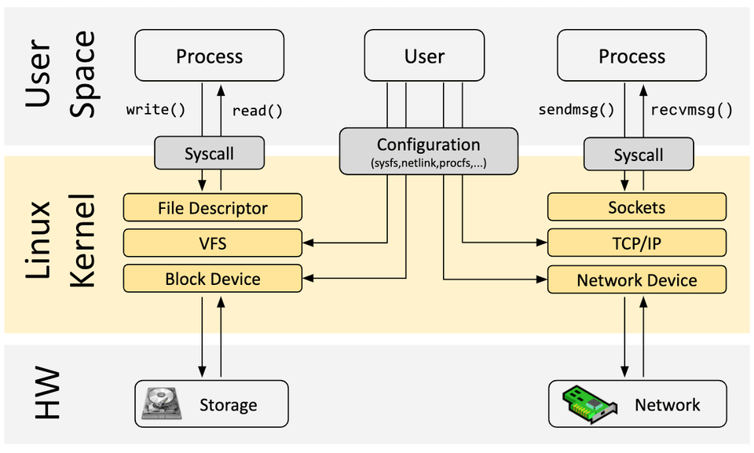

- 可程式設計而無需更改核心原始碼：修改 Linux 核心很困難。對於幾乎每個希望與 Linux 整合的組織來說，維護核心更改或將它們納入上游都是昂貴且耗時的。多年來，一些創新無法產生影響或需要很長時間才能變得普遍可用。
- 在不干預應用程式或容器的情況下啟用基礎設施軟體：eBPF 程式在作業系統內部工作，允許保證任何應用程式的完全透明度。
- 確保安全性和穩定性：eBPF 程式經過驗證器。它們不能崩潰、掛起或導致核心以任何方式流動。它們具有資源限制（例如，最大複雜性）並且不能阻塞。
- 以最小的開銷持續監控：經過 JIT 編譯並直接執行，無需在核心/使用者空間邊界之間來回切換。已經證明可以在生產工作負載上實現極其高效和事件驅動。
- eBPF 程式與核心一起工作：它們利用現有的層（例如，網路堆疊、套接字、路由）並且不會繞過它們。它們豐富了這些層的功能。

### eBPF 對 Linux 核心的影響

現在讓我們回到 JavaScript。JavaScript 的引入導致了瀏覽器演變的大規模革命。

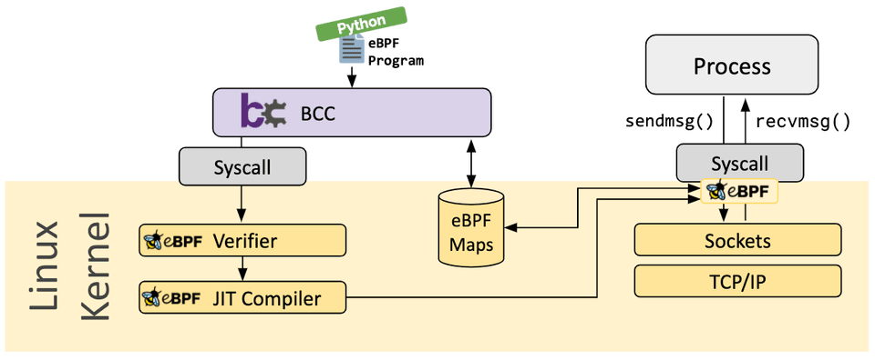

## 開發工具鏈

有幾個開發工具鏈可幫助開發和管理 eBPF 程式。它們都滿足使用者的不同需求：

### bcc

BCC 是一個框架，使使用者能夠編寫嵌入了 eBPF 程式的 Python 程式。該框架主要針對涉及應用程式和系統分析/追蹤的使用案例，其中 eBPF 程式用於收集統計資料或產生事件，而使用者空間中的對應部分收集資料並以人類可讀的形式顯示。執行 Python 程式將產生 eBPF 字節碼並將其載入到核心中。

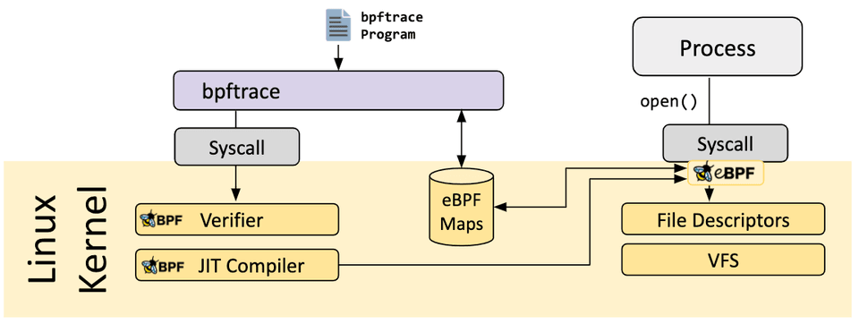

### bpftrace

bpftrace 是 Linux eBPF 的高階追蹤語言，可在較新的 Linux 核心（4.x）中使用。bpftrace 使用 LLVM 作為後端將腳本編譯為 eBPF 字節碼，並利用 BCC 作為與 Linux eBPF 子系統以及現有 Linux 追蹤功能和附加點進行互動的函式庫。

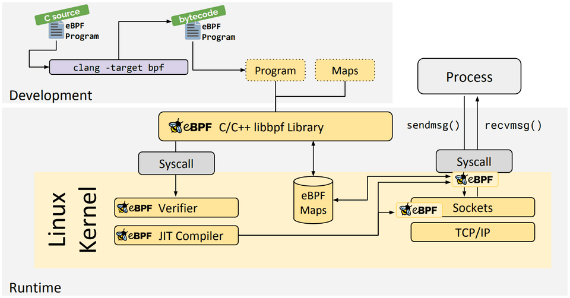

### eBPF Go 函式庫

eBPF Go 函式庫提供了一個通用的 eBPF 函式庫，它將獲取 eBPF 字節碼的過程與 eBPF 程式的載入和管理解耦。eBPF 程式通常是透過編寫更高級別的語言建立的，然後使用 clang/LLVM 編譯器編譯為 eBPF 字節碼。

### libbpf C/C++ 函式庫

libbpf 函式庫是一個基於 C/C++ 的通用 eBPF 函式庫，它有助於將從 clang/LLVM 編譯器產生的 eBPF 物件檔案載入到核心中，並透過為應用程式提供易於使用的函式庫 API 來抽象與 BPF 系統呼叫的互動。

## 延伸閱讀

如果您想了解更多關於 eBPF 的資訊，請繼續閱讀使用以下其他材料：

### 文檔
- [BPF & XDP Reference Guide](https://docs.cilium.io/en/stable/bpf/), Cilium Documentation, Aug 2020
- [BPF Documentation](https://www.kernel.org/doc/html/latest/bpf/index.html), BPF Documentation in the Linux Kernel
- [BPF Design Q&A](https://git.kernel.org/pub/scm/linux/kernel/git/torvalds/linux.git/tree/Documentation/bpf/bpf_design_QA.rst), FAQ for kernel-related eBPF questions

### 教程
- [Learn eBPF Tracing: Tutorial and Examples](http://www.brendangregg.com/blog/2019-01-01/learn-ebpf-tracing.html), Brendan Gregg's Blog, Jan 2019
- [XDP Hands-On Tutorials](https://github.com/xdp-project/xdp-tutorial), Various authors, 2019
- [BCC, libbpf and BPF CO-RE Tutorials](https://facebookmicrosites.github.io/bpf/blog/), Facebook's BPF Blog, 2020

### 演講
- [eBPF and Kubernetes: Little Helper Minions for Scaling Microservices](https://www.youtube.com/watch?v=99jUcLt3rSk) ([Slides](https://kccnceu20.sched.com/event/ZemQ/ebpf-and-kubernetes-little-helper-minions-for-scaling-microservices-daniel-borkmann-cilium)), Daniel Borkmann, KubeCon EU, Aug 2020
- [eBPF - Rethinking the Linux Kernel](https://www.infoq.com/presentations/facebook-google-bpf-linux-kernel/) ([Slides](https://docs.google.com/presentation/d/1AcB4x7JCWET0ysDr0gsX-EIdQSTyBtmi6OAW7bE0jm0)), Thomas Graf, QCon London, April 2020
- [BPF as a revolutionary technology for the container landscape](https://www.youtube.com/watch?v=U3PdyHlrG1o&t=7) ([Slides](https://fosdem.org/2020/schedule/event/containers_bpf/attachments/slides/4122/export/events/attachments/containers_bpf/slides/4122/BPF_as_a_revolutionary_technology_for_the_container_landscape.pdf)), Daniel Borkmann, FOSDEM, Feb 2020

### 書籍
- [Systems Performance: Enterprise and the Cloud, 2nd Edition](http://www.brendangregg.com/systems-performance-2nd-edition-book.html), Brendan Gregg, Addison-Wesley Professional Computing Series, 2020
- [BPF Performance Tools](http://www.brendangregg.com/bpf-performance-tools-book.html), Brendan Gregg, Addison-Wesley Professional Computing Series, Dec 2019
- [Linux Observability with BPF](https://www.oreilly.com/library/view/linux-observability-with/9781492050193/), David Calavera, Lorenzo Fontana, O'Reilly, Nov 2019

### 文章和部落格
- [BPF for security - and chaos - in Kubernetes](https://lwn.net/Articles/790684/), Sean Kerner, LWN, Jun 2019
- [Linux Technology for the New Year: eBPF](https://thenewstack.io/linux-technology-for-the-new-year-ebpf/), Joab Jackson, Dec 2018
- [A thorough introduction to eBPF](https://lwn.net/Articles/740157/), Matt Fleming, LWN, Dec 2017
- [Cilium, BPF and XDP](https://opensource.googleblog.com/2016/11/cilium-networking-and-security.html), Google Open Source Blog, Nov 2016
- [Archive of various related articles](https://lwn.net/Kernel/Index/#Berkeley_Packet_Filter), LWN, since Apr 2011
- [Various posts by Brendan Gregg on eBPF](http://www.brendangregg.com/blog/2019-01-01/learn-ebpf-tracing.html), Brendan Gregg's Blog