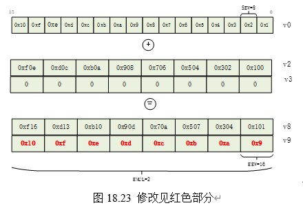

# 

親愛的小夥伴:  
感謝您選購和閱讀《RISC-V體系結構編程與實踐》，感謝您對奔跑吧Linux社區的長期支持！由於我們水平有限，出書時間倉促，難免有不少勘誤，我們深感歉意，也懇請大家多多包涵，也歡迎給我們提出批評和建議！我們會不久的將來第2版中繼續完善和優化！如果發現有新的勘誤或者有好建議，請通過如下方式與我們聯繫：
郵件：runninglinuxkernel@126.com   
微信公眾號：奔跑吧linux社區   
微信號：runninglinuxkernel   
請讀者在閱讀本書之前，一定要先閱讀書最前面的“本書約定”一文。

PDF版本的勘誤 下載方法：
關注“奔跑吧linux社區”微信公眾號，在微信公眾號裡輸入“risc-v”獲取下載地址。

訂閱配套視頻課程：        
1. 微信打開：https://appv6qgydb09376.h5.xiaoeknow.com      
2. 關注“奔跑吧Linux社區”微信公眾號，輸入“risc-v”進入在線學習平臺    

# 勘誤

勘誤按照發現的時間為順序, 其中Fixed表示在第幾次印刷中修復了。

| 頁碼 | 位置 | 原內容                             | 修改後的內容                         | Fixed  |
| ---- | -------- | ---------------------------------- | ------------------------------------ | ------ |
| 375    | 圖18.23 | -  | 修改見紅色部分    | 3|
|383-384|  註釋 | - | 代碼45行註釋改成：計算C2   代碼56行註釋改成：計算C3| 3|
| 386 | 圖18.30| - | 圖上最上方v9改成v8，如下所示：vfmacc.vf v8, ft2, v2| 3| 
|406| - | hlv{x}.{b\|\|h\|w\|d}{u} rd,  offset(rs1) | b和h之間應該用“\|” | 3|
|411| 圖20.16| - | 圖中的SGEIP改成SGEIE，VSEIP改成VSEIE | 3|
|427| 圖20.21 | - | 圖中的imm[11:0] 更正為 imm[11:5] | 3|
|436 | - | 例如，Mem8 addr表示內存地址addr中的8位數據。| Mem8 addr 改成 Mem8(addr) | 3|
| 139| 第8.4章| spec寄存器的值| sepc寄存器的值 | 3|
| 74| - |根據ra寄存器的返回地址，跳轉到上一級函數（即func1()函數通過JAR指令調用add_c()函數的下一條指令）。| JAR指令改成JAL指令|3|
| 30| -| 表2.1的信息都可以在NEMU配置菜單中配置。| 表2.1 改成 表2.3| 3|
| 38| 表2.5中第4行| 0b0001  預分頻寄存器中的高8位| 0b0001 改成 0b001| 3|
|61| 倒數第二段|在第1行中，交換tp和sscratch寄存器的值，即讀取sscratch寄存器的舊值| "交換tp和sscratch寄存器的值"半句去掉| 3| 
| 386| 圖18.31| - | 修改見紅色加粗部分   | 3|  
| 65| 實驗3-3 | 從0x802 0000地址複製32字節到0x8021 0000地址處 | 0x802 0000 改成 0x8020 0000 | 3|
|132| 第二段| mpec：記錄發生異常的指令地址。| mpec 改成 mepc| 3|

# 補充

這裡列出的不是勘誤，是有益的補充，可能會對讀者理解有幫助。

| 頁碼 |   位置   |         原內容    |                補充的內容           | 
| ---- | -------- | ------------------| ------------------------------------|
| 262    | 14.2章 | -  | 在14.2章補充如下內容     LR和SC指令是配對使用，SC指令成功的條件，一是當前保留集有效，二是保留集中包含的數據被成功更新或者寫入。無論SC指令執行成功與否，當前CPU包含的保留集都被無效掉。      有如下情況SC指令會失敗。   1. 如果SC寫入的地址，不在與之配對的LR指令組成的保留集範圍內。   2. 如果在LR和SC指令範圍內，執行了另外一條SC指令,不管寫入任何地址，都會導致SC指令執行失敗.   3. 如果在LR和SC指令範圍內，執行了另外一條store指令。這相當於是在LR/SC配對的序列中，又插入了一條store指令，並且這條store指令是對LR的加載地址進行store的話，那SC指令會執行失敗。如果這條store指令不是對LR加載地址進行store的話，SC指令不會失敗。   4. 如果另外一個CPU對當前LR和SC的保留集地址進行寫入操作。   5. 如果另外一個外設（不是CPU）對LR加載的數據進行寫入     RISC-V架構對LR/SC序列做了一些約束，不符合這些約束的LR/SC序列不能保證在所有RISC-V處理器中都能成功。   1. LR/SC的循環loop中最多包含16條指令   2. LR/SC序列包括RV64I指令或者壓縮指令，但是不包括加載、存儲、向後跳轉、向後分支、JALR、FENCE、以及SYSTEM指令。   3. LR/SC序列可以包含向後跳轉的retry重試。   4. SC指令的地址必須與同一個CPU執行的最新LR的有效地址和數據大小相同。| 
| 262  | 14.2章 | - |  如果在LR和SC序列中發生了進程切換，那麼LR/SC還能成功嗎?     目前不少RISC-V芯片採用類似arm的exclusive monitor的方式，那麼在異常返回時，RTL可以清除local監視器。一個進程的切換，必定發生了一次時鐘中斷。中斷也是異常的一種。所以，這樣就可以保證進程切換時，LR申請的reservation set被作廢了。     另外還可以採用軟件方式來清除local監視器。例如最新的Linux內核，在異常返回的時候， 對異常返回地址執行了一條SC指令（讀異常返回地址的值，然後用SC指令往異常返回地址裡寫 剛才讀回來的內容），這樣就可以無效掉LR/SC組成的保留集，達到清除reservation set的目的.     在RISC-V架構手冊卷1的第8.2章裡有提到，使用SC指令對一塊可以被抓破的內存進行寫入 (也可以是任何地址。Linux內核異常返回時的做法是：讀異常返回地址的值，然後用SC指令往異常返回地址裡寫 剛才讀回來的內容)，用來無效掉已經加載的保留集，主要用途：   1. 進程切換   2. 修改了VA->PA映射，並且這頁面包含了一個活躍的保留集。|
