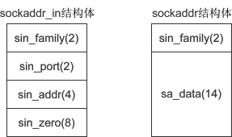

## 1天玩轉c++ socket通信技術 


socket是什麼意思
在計算機通信領域，socket 被翻譯為“套接字”，它是計算機之間進行通信的一種約定或一種方式。通過 socket 這種約定，一臺計算機可以接收其他計算機的數據，也可以向其他計算機發送數據。

socket 的典型應用就是 Web 服務器和瀏覽器：瀏覽器獲取用戶輸入的URL，向服務器發起請求，服務器分析接收到的URL，將對應的網頁內容返回給瀏覽器，瀏覽器再經過解析和渲染，就將文字、圖片、視頻等元素呈現給用戶。

**學習 socket，也就是學習計算機之間如何通信，並編寫出實用的程序。**

IP地址（IP Address）

計算機分佈在世界各地，要想和它們通信，必須要知道確切的位置。確定計算機位置的方式有多種，IP 地址是最常用的，例如，114.114.114.114 是國內第一個、全球第三個開放的 DNS 服務地址，127.0.0.1 是本機地址。

其實，我們的計算機並不知道 IP 地址對應的地理位置，當要通信時，只是將 IP 地址封裝到要發送的數據包中，交給路由器去處理。路由器有非常智能和高效的算法，很快就會找到目標計算機，並將數據包傳遞給它，完成一次單向通信。

目前大部分軟件使用 IPv4 地址，但 IPv6 也正在被人們接受，尤其是在教育網中，已經大量使用。
端口（Port）

有了 IP 地址，雖然可以找到目標計算機，但仍然不能進行通信。一臺計算機可以同時提供多種網絡服務，例如Web服務、FTP服務（文件傳輸服務）、SMTP服務（郵箱服務）等，僅有 IP 地址，計算機雖然可以正確接收到數據包，但是卻不知道要將數據包交給哪個網絡程序來處理，所以通信失敗。

為了區分不同的網絡程序，計算機會為每個網絡程序分配一個**獨一無二的端口號（Port Number）**，例如，Web服務的端口號是 80，FTP 服務的端口號是 21，SMTP 服務的端口號是 25。

**端口（Port）是一個虛擬的、**邏輯上的概念。可以將端口理解為一道門，數據通過這道門流入流出，每道門有不同的編號，就是端口號。如下圖所示：


協議（Protocol）

協議（Protocol）就是網絡通信的約定，通信的雙方必須都遵守才能正常收發數據。協議有很多種，例如 TCP、UDP、IP 等，通信的雙方必須使用同一協議才能通信。協議是一種規範，由計算機組織制定，規定了很多細節，例如，如何建立連接，如何相互識別等。
協議僅僅是一種規範，必須由計算機軟件來實現。例如 IP 協議規定了如何找到目標計算機，那麼各個開發商在開發自己的軟件時就必須遵守該協議，不能另起爐灶。
所謂協議族（Protocol Family），就是一組協議（多個協議）的統稱。最常用的是 TCP/IP 協議族，它包含了 TCP、IP、UDP、Telnet、FTP、SMTP 等上百個互為關聯的協議，由於 TCP、IP 是兩種常用的底層協議，所以把它們統稱為 TCP/IP 協議族。
數據傳輸方式

計算機之間有很多數據傳輸方式，各有優缺點，常用的有兩種：SOCK_STREAM 和 SOCK_DGRAM。

1) SOCK_STREAM 表示面向連接的數據傳輸方式。數據可以準確無誤地到達另一臺計算機，如果損壞或丟失，可以重新發送，但效率相對較慢。常見的 http 協議就使用 SOCK_STREAM 傳輸數據，因為要確保數據的正確性，否則網頁不能正常解析。

2) SOCK_DGRAM 表示無連接的數據傳輸方式。計算機只管傳輸數據，不作數據校驗，如果數據在傳輸中損壞，或者沒有到達另一臺計算機，是沒有辦法補救的。也就是說，數據錯了就錯了，無法重傳。因為 SOCK_DGRAM 所做的校驗工作少，所以效率比 SOCK_STREAM 高。

QQ 視頻聊天和語音聊天就使用 SOCK_DGRAM 傳輸數據，因為首先要保證通信的效率，儘量減小延遲，而數據的正確性是次要的，即使丟失很小的一部分數據，視頻和音頻也可以正常解析，最多出現噪點或雜音，不會對通信質量有實質的影響。
注意：SOCK_DGRAM 沒有想象中的糟糕，不會頻繁的丟失數據，數據錯誤只是小概率事件。
有可能多種協議使用同一種數據傳輸方式，所以在 socket 編程中，需要同時指明數據傳輸方式和協議。

綜上所述：IP地址和端口能夠在廣袤的互聯網中定位到要通信的程序，協議和數據傳輸方式規定了如何傳輸數據，有了這些，兩臺計算機就可以通信了。

網路程式設計就是編寫程序使兩臺聯網的電腦相互交換資料。這就是全部內容了嗎？是的！網路程式設計要比想像中的簡單許多。

那麼，這兩臺電腦之間用什麼傳輸資料呢？首先需要物理連接。如今大部分電腦都已經連接到網際網路，因此不用擔心這一點。

在此基礎上，只需要考慮如何編寫資料傳輸程序。但實際上這點也不用愁，因為作業系統已經提供了 [socket](http://c.biancheng.net/socket/)。即使對網路資料傳輸的原理不太熟悉，我們也能通過 socket 來程式設計。

## 什麼是 socket？

socket 的原意是“插座”，在電腦通訊領域，socket 被翻譯為“套接字”，它是電腦之間進行通訊的一種約定或一種方式。通過 socket 這種約定，一臺電腦可以接收其他電腦的資料，也可以向其他電腦傳送資料。

我們把插頭插到插座上就能從電網獲得電力供應，同樣，為了與遠端電腦進行資料傳輸，需要連接到網際網路，而 socket 就是用來連接到網際網路的工具。


socket 的典型應用就是 Web 伺服器和瀏覽器：瀏覽器獲取使用者輸入的 URL，向伺服器發起請求，伺服器分析接收到的 URL，將對應的網頁內容返回給瀏覽器，瀏覽器再經過解析和渲染，就將文字、圖片、視訊等元素呈現給使用者。

學習 socket，也就是學習電腦之間如何通訊，並編寫出實用的程序。

## UNIX/Linux 中的 socket 是什麼？

在 UNIX/Linux 系統中，為了統一對各種硬體的操作，簡化介面，不同的硬體裝置也都被看成一個檔案。對這些檔案的操作，等同於對磁碟上普通檔案的操作。

你也許聽很多高手說過，UNIX/Linux 中的一切都是檔案！那個傢伙說的沒錯。

為了表示和區分已經打開的檔案，UNIX/Linux 會給每個檔案分配一個 ID，這個 ID 就是一個整數，被稱為檔案描述符（File Descriptor）。例如：

- 通常用 0 來表示標準輸入檔案（stdin），它對應的硬體裝置就是鍵盤；
- 通常用 1 來表示標準輸出檔案（stdout），它對應的硬體裝置就是顯示器。


UNIX/Linux 程序在執行任何形式的 I/O 操作時，都是在讀取或者寫入一個檔案描述符。一個檔案描述符只是一個和打開的檔案相關聯的整數，它的背後可能是一個硬碟上的普通檔案、FIFO、管道、終端、鍵盤、顯示器，甚至是一個網路連線。

請注意，網路連線也是一個檔案，它也有檔案描述符！你必須理解這句話。

我們可以通過 socket() 函數來建立一個網路連線，或者說打開一個網路檔案，socket() 的返回值就是檔案描述符。有了檔案描述符，我們就可以使用普通的檔案操作函數來傳輸資料了，例如：

- 用 read() 讀取從遠端電腦傳來的資料；
- 用 write() 向遠端電腦寫入資料。


你看，只要用 socket() 建立了連接，剩下的就是檔案操作了，網路程式設計原來就是如此簡單！

## Window 系統中的 socket 是什麼？

Windows 也有類似“檔案描述符”的概念，但通常被稱為“檔案控制代碼”。因此，本教學如果涉及 Windows 平臺將使用“控制代碼”，如果涉及 Linux 平臺則使用“描述符”。

與 UNIX/Linux 不同的是，Windows 會區分 socket 和檔案，Windows 就把 socket 當做一個網路連線來對待，因此需要呼叫專門針對 socket 而設計的資料傳輸函數，針對普通檔案的輸入輸出函數就無效了。


# 套接字有哪些類型？socket有哪些類型？

這個世界上有很多種套接字（[socket](http://c.biancheng.net/socket/)），比如 DARPA Internet 地址（Internet 套接字）、本地節點的路徑名（Unix套接字）、CCITT X.25地址（X.25 套接字）等。但本教學只講第一種套接字——Internet 套接字，它是最具代表性的，也是最經典最常用的。以後我們提及套接字，指的都是 Internet 套接字。

根據資料的傳輸方式，可以將 Internet 套接字分成兩種類型。通過 socket() 函數建立連接時，必須告訴它使用哪種資料傳輸方式。

> Internet 套接字其實還有很多其它資料傳輸方式，但是我可不想嚇到你，本教學只講常用的兩種。

## 流格式套接字（SOCK_STREAM）

流格式套接字（Stream Sockets）也叫“面向連接的套接字”，在程式碼中使用 SOCK_STREAM 表示。

SOCK_STREAM 是一種可靠的、雙向的通訊資料流，資料可以精準無誤地到達另一臺電腦，如果損壞或丟失，可以重新傳送。

> 流格式套接字有自己的糾錯機制，在此我們就不討論了。

SOCK_STREAM 有以下幾個特徵：

- 資料在傳輸過程中不會消失；
- 資料是按照順序傳輸的；
- 資料的傳送和接收不是同步的（有的教學也稱“不存在資料邊界”）。


可以將 SOCK_STREAM 比喻成一條傳送帶，只要傳送帶本身沒有問題（不會斷網），就能保證資料不丟失；同時，較晚傳送的資料不會先到達，較早傳送的資料不會晚到達，這就保證了資料是按照順序傳遞的。


為什麼流格式套接字可以達到高品質的資料傳輸呢？這是因為它使用了 TCP 協議（The Transmission Control Protocol，傳輸控制協議），TCP 協議會控制你的資料按照順序到達並且沒有錯誤。

你也許見過 TCP，是因為你經常聽說“TCP/IP”。TCP 用來確保資料的正確性，IP（Internet Protocol，網路協議）用來控制資料如何從源頭到達目的地，也就是常說的“路由”。

那麼，“資料的傳送和接收不同步”該如何理解呢？

假設傳送帶傳送的是水果，接收者需要湊齊 100 個後才能裝袋，但是傳送帶可能把這 100 個水果分批傳送，比如第一批傳送 20 個，第二批傳送 50 個，第三批傳送 30 個。接收者不需要和傳送帶保持同步，只要根據自己的節奏來裝袋即可，不用管傳送帶傳送了幾批，也不用每到一批就裝袋一次，可以等到湊夠了 100 個水果再裝袋。

流格式套接字的內部有一個緩衝區（也就是字元陣列），通過 socket 傳輸的資料將保存到這個緩衝區。接收端在收到資料後並不一定立即讀取，只要資料不超過緩衝區的容量，接收端有可能在緩衝區被填滿以後一次性地讀取，也可能分成好幾次讀取。

也就是說，不管資料分幾次傳送過來，接收端只需要根據自己的要求讀取，不用非得在資料到達時立即讀取。傳送端有自己的節奏，接收端也有自己的節奏，它們是不一致的。

流格式套接字有什麼實際的應用場景嗎？瀏覽器所使用的 http 協議就基於面向連接的套接字，因為必須要確保資料精準無誤，否則載入的 HTML 將無法解析。

## 資料報格式套接字（SOCK_DGRAM）

資料報格式套接字（Datagram Sockets）也叫“無連接的套接字”，在程式碼中使用 SOCK_DGRAM 表示。

電腦只管傳輸資料，不作資料校驗，如果資料在傳輸中損壞，或者沒有到達另一臺電腦，是沒有辦法補救的。也就是說，資料錯了就錯了，無法重傳。

因為資料報套接字所做的校驗工作少，所以在傳輸效率方面比流格式套接字要高。

可以將 SOCK_DGRAM 比喻成高速移動的摩托車快遞，它有以下特徵：

- 強調快速傳輸而非傳輸順序；
- 傳輸的資料可能丟失也可能損毀；
- 限制每次傳輸的資料大小；
- 資料的傳送和接收是同步的（有的教學也稱“存在資料邊界”）。


眾所周知，速度是快遞行業的生命。用摩托車發往同一地點的兩件包裹無需保證順序，只要以最快的速度交給客戶就行。這種方式存在損壞或丟失的風險，而且包裹大小有一定限制。因此，想要傳遞大量包裹，就得分配傳送。


另外，用兩輛摩托車分別傳送兩件包裹，那麼接收者也需要分兩次接收，所以“資料的傳送和接收是同步的”；換句話說，接收次數應該和傳送次數相同。

總之，資料報套接字是一種不可靠的、不按順序傳遞的、以追求速度為目的的套接字。

資料報套接字也使用 IP 協議作路由，但是它不使用 TCP 協議，而是使用 UDP 協議（User Datagram Protocol，使用者資料報協議）。

QQ 視訊聊天和語音聊天就使用 SOCK_DGRAM 來傳輸資料，因為首先要保證通訊的效率，儘量減小延遲，而資料的正確性是次要的，即使丟失很小的一部分資料，視訊和音訊也可以正常解析，最多出現噪點或雜音，不會對通訊質量有實質的影響。

# OSI網路七層模型

如果你讀過電腦專業，或者學習過網路通訊，那你一定聽說過 OSI 模型，它曾無數次讓你頭大。OSI 是 Open System Interconnection 的縮寫，譯為“開放式系統互聯”。

OSI 模型把網路通訊的工作分為 7 層，從下到上分別是物理層、資料鏈路層、網路層、傳輸層、會話層、表示層和應用層。

OSI 只是存在於概念和理論上的一種模型，它的缺點是分層太多，增加了網路工作的複雜性，所以沒有大規模應用。後來人們對 OSI 進行了簡化，合併了一些層，最終只保留了 4 層，從下到上分別是介面層、網路層、傳輸層和應用層，這就是大名鼎鼎的 TCP/IP 模型。


圖1：OSI 七層網路模型和 TCP/IP 四層網路模型的對比


這個網路模型究竟是幹什麼呢？簡而言之就是進行資料封裝的。

我們平常使用的程序（或者說軟體）一般都是通過應用層來訪問網路的，程序產生的資料會一層一層地往下傳輸，直到最後的網路介面層，就通過網線傳送到網際網路上去了。資料每往下走一層，就會被這一層的協議增加一層包裝，等到傳送到網際網路上時，已經比原始資料多了四層包裝。整個資料封裝的過程就像俄羅斯套娃。

當另一臺電腦接收到封包時，會從網路介面層再一層一層往上傳輸，每傳輸一層就拆開一層包裝，直到最後的應用層，就得到了最原始的資料，這才是程序要使用的資料。

給資料加包裝的過程，實際上就是在資料的頭部增加一個標誌（一個資料區塊），表示資料經過了這一層，我已經處理過了。給資料拆包裝的過程正好相反，就是去掉資料頭部的標誌，讓它逐漸現出原形。

你看，在網際網路上傳輸一份資料是多麼地複雜啊，而我們卻感受不到，這就是網路模型的厲害之處。我們只需要在程式碼中呼叫一個函數，就能讓下面的所有網路層為我們工作。

我們所說的 [socket](http://c.biancheng.net/socket/) 程式設計，是站在傳輸層的基礎上，所以可以使用 TCP/UDP 協議，但是不能幹「訪問網頁」這樣的事情，因為訪問網頁所需要的 http 協議位於應用層。

兩臺電腦進行通訊時，必須遵守以下原則：

- 必須是同一層次進行通訊，比如，A 電腦的應用層和 B 電腦的傳輸層就不能通訊，因為它們不在一個層次，資料的拆包會遇到問題。
- 每一層的功能都必須相同，也就是擁有完全相同的網路模型。如果網路模型都不同，那不就亂套了，誰都不認識誰。
- 資料只能逐層傳輸，不能躍層。
- 每一層可以使用下層提供的服務，並向上層提供服務。

# TCP/IP協議族

上節《OSI網路七層模型》中講到，目前實際使用的網路模型是 TCP/IP 模型，它對 OSI 模型進行了簡化，只包含了四層，從上到下分別是應用層、傳輸層、網路層和鏈路層（網路介面層），每一層都包含了若干協議。

協議（Protocol）就是網路通訊過程中的約定或者合同，通訊的雙方必須都遵守才能正常收發資料。協議有很多種，例如 TCP、UDP、IP 等，通訊的雙方必須使用同一協議才能通訊。協議是一種規範，由電腦組織制定，規定了很多細節，例如，如何建立連接，如何相互識別等。

> 協議僅僅是一種規範，必須由電腦軟體來實現。例如 IP 協議規定了如何找到目標電腦，那麼各個開發商在開發自己的軟體時就必須遵守該協議，不能另起爐灶。

TCP/IP 模型包含了 TCP、IP、UDP、Telnet、FTP、SMTP 等上百個互為關聯的協議，其中 TCP 和 IP 是最常用的兩種底層協議，所以把它們統稱為“TCP/IP 協議族”。

也就是說，“TCP/IP模型”中所涉及到的協議稱為“TCP/IP協議族”，你可以區分這兩個概念，也可以認為它們是等價的，隨便你怎麼想。

本教學所講的 [socket](http://c.biancheng.net/socket/) 程式設計是基於 TCP 和 UDP 協議的，它們的層級關係如下圖所示：


## 【擴展閱讀】開放式系統（Open System）

把協議分成多個層次有哪些優點？協議設計更容易？當然這也足以成為優點之一。但是還有更重要的原因，就是為了通過標準化操作設計成開放式系統。

標準本身就是對外公開的，會引導更多的人遵守規範。以多個標準為依據設計的系統稱為開放式系統（Open System），我們現在學習的 TCP/IP 協議族也屬於其中之一。

接下來瞭解一下開放式系統具有哪些優點。

路由器用來完成 IP 層的互動任務。某個網路原來使用 A 公司的路由器，現要將其替換成 B 公司的，是否可行？這並非難事，並不一定要換成同一公司的同一型號路由器，因為所有生產商都會按照 IP 層標準製造。

再舉個例子。大家的電腦是否裝有網路介面卡，也就是所謂的網路卡？尚未安裝也無妨，其實很容易買到，因為所有網路卡製造商都會遵守鏈路層的協議標準。這就是開放式系統的優點。

標準的存在意味著高速的技術發展，這也是開放式系統設計最大的原因所在。實際上，軟體工程中的“物件導向（Object Oriented）”的誕生背景中也有標準化的影子。也就是說，標準對於技術發展起著舉足輕重的作用。

# IP、MAC和連接埠號——網路通訊中確認身份資訊的三要素

在茫茫的網際網路海洋中，要找到一臺電腦非常不容易，有三個要素必須具備，它們分別是 IP 地址、MAC 地址和連接埠號。

## IP地址

IP地址是 Internet Protocol Address 的縮寫，譯為“網際協議地址”。

目前大部分軟體使用 IPv4 地址，但 IPv6 也正在被人們接受，尤其是在教育網中，已經大量使用。

一臺電腦可以擁有一個獨立的 IP 地址，一個區域網路也可以擁有一個獨立的 IP 地址（對外就好像只有一臺電腦）。對於目前廣泛使用 IPv4 地址，它的資源是非常有限的，一臺電腦一個 IP 地址是不現實的，往往是一個區域網路才擁有一個 IP 地址。

在網際網路上進行通訊時，必須要知道對方的 IP 地址。實際上封包中已經附帶了 IP 地址，把封包傳送給路由器以後，路由器會根據 IP 地址找到對方的地裡位置，完成一次資料的傳遞。路由器有非常高效和智能的演算法，很快就會找到目標電腦。

## MAC地址

現實的情況是，一個區域網路往往才能擁有一個獨立的 IP；換句話說，IP 地址只能定位到一個區域網路，無法定位到具體的一臺電腦。這可怎麼辦呀？這樣也沒法通訊啊。

其實，真正能唯一標識一臺電腦的是 MAC 地址，每個網路卡的 MAC 地址在全世界都是獨一無二的。電腦出廠時，MAC 地址已經被寫死到網路卡裡面了（當然通過某些“奇巧淫技”也是可以修改的）。區域網路中的路由器/交換機會記錄每臺電腦的 MAC 地址。

> MAC 地址是 Media Access Control Address 的縮寫，直譯為“媒體存取控制地址”，也稱為區域網路地址（LAN Address），乙太網路地址（Ethernet Address）或實體位址（Physical Address）。

封包中除了會附帶對方的 IP 地址，還會附帶對方的 MAC 地址，當封包達到區域網路以後，路由器/交換機會根據封包中的 MAC 地址找到對應的電腦，然後把封包轉交給它，這樣就完成了資料的傳遞。

## 連接埠號

有了 IP 地址和 MAC 地址，雖然可以找到目標電腦，但仍然不能進行通訊。一臺電腦可以同時提供多種網路服務，例如 Web 服務（網站）、FTP 服務（檔案傳輸服務）、SMTP 服務（信箱服務）等，僅有 IP 地址和 MAC 地址，電腦雖然可以正確接收到封包，但是卻不知道要將封包交給哪個網路程序來處理，所以通訊失敗。

為了區分不同的網路程序，電腦會為每個網路程序分配一個獨一無二的連接埠號（Port Number），例如，Web 服務的連接埠號是 80，FTP 服務的連接埠號是 21，SMTP 服務的連接埠號是 25。

連接埠（Port）是一個虛擬的、邏輯上的概念。可以將連接埠理解為一道門，資料通過這道門流入流出，每道門有不同的編號，就是連接埠號。如下圖所示：


# Linux下的socket演示程序

我們從一個簡單的“Hello World!”程序切入 [socket](http://c.biancheng.net/socket/) 程式設計。

本節演示了 Linux 下的程式碼，server.cpp 是伺服器端程式碼，client.cpp 是客戶端程式碼，要實現的功能是：客戶端從伺服器讀取一個字串並列印出來。

伺服器端程式碼 server.cpp：

```cpp
#include <stdio.h>
#include <string.h>
#include <stdlib.h>
#include <unistd.h>
#include <arpa/inet.h>
#include <sys/socket.h>
#include <netinet/in.h>

int main()
{
    //建立套接字
    int serv_sock = socket(AF_INET, SOCK_STREAM, IPPROTO_TCP);

    //將套接字和IP、連接埠繫結
    struct sockaddr_in serv_addr;
    memset(&serv_addr, 0, sizeof(serv_addr));  //每個位元組都用0填充
    serv_addr.sin_family = AF_INET;  //使用IPv4地址
    serv_addr.sin_addr.s_addr = inet_addr("127.0.0.1");  //具體的IP地址
    serv_addr.sin_port = htons(1234);  //連接埠
    bind(serv_sock, (struct sockaddr*)&serv_addr, sizeof(serv_addr));

    //進入監聽狀態，等待使用者發起請求
    listen(serv_sock, 20);

    //接收客戶端請求
    struct sockaddr_in clnt_addr;
    socklen_t clnt_addr_size = sizeof(clnt_addr);
    int clnt_sock = accept(serv_sock, (struct sockaddr*)&clnt_addr,
                           &clnt_addr_size);

    //向客戶端傳送資料
    char str[] = "http://c.biancheng.net/socket/";
    write(clnt_sock, str, sizeof(str));

    //關閉套接字
    close(clnt_sock);
    close(serv_sock);

    return 0;
}
```


客戶端程式碼 client.cpp：

```cpp
#include <stdio.h>
#include <string.h>
#include <stdlib.h>
#include <unistd.h>
#include <arpa/inet.h>
#include <sys/socket.h>

int main()
{
    //建立套接字
    int sock = socket(AF_INET, SOCK_STREAM, 0);

    //向伺服器（特定的IP和連接埠）發起請求
    struct sockaddr_in serv_addr;
    memset(&serv_addr, 0, sizeof(serv_addr));  //每個位元組都用0填充
    serv_addr.sin_family = AF_INET;  //使用IPv4地址
    serv_addr.sin_addr.s_addr = inet_addr("127.0.0.1");  //具體的IP地址
    serv_addr.sin_port = htons(1234);  //連接埠
    connect(sock, (struct sockaddr*)&serv_addr, sizeof(serv_addr));

    //讀取伺服器傳回的資料
    char buffer[40];
    read(sock, buffer, sizeof(buffer) - 1);

    printf("Message form server: %s\n", buffer);

    //關閉套接字
    close(sock);

    return 0;
}
```


啟動一個終端（Shell），先編譯 server.cpp 並運行：

[admin@localhost ~]$ g++ server.cpp -o server
[admin@localhost ~]$ ./server
\#等待請求的到來

正常情況下，程式執行到 accept() 函數就會被阻塞，等待客戶端發起請求。

接下再啟動一個終端，編譯 client.cpp 並運行：

[admin@localhost ~]$ g++ client.cpp -o client
[admin@localhost ~]$ ./client
Message form server: http://c.biancheng.net/socket/

client 接收到從 server傳送過來的字串就運行結束了，同時，server 完成傳送字串的任務也運行結束了。大家可以通過兩個打開的終端來觀察。

client 運行後，通過 connect() 函數向 server 發起請求，處於監聽狀態的 server 被啟動，執行 accept() 函數，接受客戶端的請求，然後執行 write() 函數向 client 傳回資料。client 接收到傳回的資料後，connect() 就運行結束了，然後使用 read() 將資料讀取出來。

> server 只接受一次 client 請求，當 server 向 client 傳回資料後，程序就運行結束了。如果想再次接收到伺服器的資料，必須再次運行 server，所以這是一個非常簡陋的 socket 程序，不能夠一直接受客戶端的請求。

## 原始碼解析

- 先說一下 server.cpp 中的程式碼。
  - 第 11 行通過 socket() 函數建立了一個套接字，參數 AF_INET 表示使用 IPv4 地址，SOCK_STREAM 表示使用面向連接的套接字，IPPROTO_TCP 表示使用 TCP 協議。在 Linux 中，socket 也是一種檔案，有檔案描述符，可以使用 write() / read() 函數進行 I/O 操作，這一點已在《[socket是什麼](http://c.biancheng.net/view/2123.html)》中進行了講解。
  - 第 19 行通過 bind() 函數將套接字 serv_sock 與特定的 IP 地址和連接埠繫結，IP 地址和連接埠都保存在 sockaddr_in 結構體中。
  - socket() 函數確定了套接字的各種屬性，bind() 函數讓套接字與特定的IP地址和連接埠對應起來，這樣客戶端才能連接到該套接字。
  - 第 22 行讓套接字處於被動監聽狀態。所謂被動監聽，是指套接字一直處於“睡眠”中，直到客戶端發起請求才會被“喚醒”。
  - 第 27 行的 accept() 函數用來接收客戶端的請求。程序一旦執行到 accept() 就會被阻塞（暫停運行），直到客戶端發起請求。
  - 第 31 行的 write() 函數用來向套接字檔案中寫入資料，也就是向客戶端傳送資料。
  - 和普通檔案一樣，socket 在使用完畢後也要用 close() 關閉。

- 再說一下 client.cpp 中的程式碼。client.cpp 中的程式碼和 server.cpp 中有一些區別。
  - 第 19 行程式碼通過 connect() 向伺服器發起請求，伺服器的IP地址和連接埠號保存在 sockaddr_in 結構體中。直到伺服器傳回資料後，connect() 才運行結束。
  - 第 23 行程式碼通過 read() 從套接字檔案中讀取資料。

# Windows下的socket演示程序

這節來看一下 Windows 下的 socket 程序。同樣，server.cpp 為伺服器端程式碼，client 為客戶端程式碼。

伺服器端程式碼 server.cpp：

```cpp
#include <stdio.h>
#include <winsock2.h>
#pragma comment (lib, "ws2_32.lib")  //載入 ws2_32.dll

int main()
{
    //初始化 DLL
    WSADATA wsaData;
    WSAStartup(MAKEWORD(2, 2), &wsaData);

    //建立套接字
    SOCKET servSock = socket(PF_INET, SOCK_STREAM, IPPROTO_TCP);

    //繫結套接字
    struct sockaddr_in sockAddr;
    memset(&sockAddr, 0, sizeof(sockAddr));  //每個位元組都用0填充
    sockAddr.sin_family = PF_INET;  //使用IPv4地址
    sockAddr.sin_addr.s_addr = inet_addr("127.0.0.1");  //具體的IP地址
    sockAddr.sin_port = htons(1234);  //連接埠
    bind(servSock, (SOCKADDR*)&sockAddr, sizeof(SOCKADDR));

    //進入監聽狀態
    listen(servSock, 20);

    //接收客戶端請求
    SOCKADDR clntAddr;
    int nSize = sizeof(SOCKADDR);
    SOCKET clntSock = accept(servSock, (SOCKADDR*)&clntAddr, &nSize);

    //向客戶端傳送資料
    char* str = "Hello World!";
    send(clntSock, str, strlen(str) + sizeof(char), NULL);

    //關閉套接字
    closesocket(clntSock);
    closesocket(servSock);

    //終止 DLL 的使用
    WSACleanup();

    return 0;
}
```

客戶端程式碼 client.cpp：

```cpp
#include <stdio.h>
#include <stdlib.h>
#include <WinSock2.h>
#pragma comment(lib, "ws2_32.lib")  //載入 ws2_32.dll

int main()
{
    //初始化DLL
    WSADATA wsaData;
    WSAStartup(MAKEWORD(2, 2), &wsaData);

    //建立套接字
    SOCKET sock = socket(PF_INET, SOCK_STREAM, IPPROTO_TCP);

    //向伺服器發起請求
    struct sockaddr_in sockAddr;
    memset(&sockAddr, 0, sizeof(sockAddr));  //每個位元組都用0填充
    sockAddr.sin_family = PF_INET;
    sockAddr.sin_addr.s_addr = inet_addr("127.0.0.1");
    sockAddr.sin_port = htons(1234);
    connect(sock, (SOCKADDR*)&sockAddr, sizeof(SOCKADDR));

    //接收伺服器傳回的資料
    char szBuffer[MAXBYTE] = {0};
    recv(sock, szBuffer, MAXBYTE, NULL);

    //輸出接收到的資料
    printf("Message form server: %s\n", szBuffer);

    //關閉套接字
    closesocket(sock);

    //終止使用 DLL
    WSACleanup();

    system("pause");
    return 0;
}
```

將 server.cpp 和 client.cpp 分別編譯為 server.exe 和 client.exe，先運行 server.exe，再運行 client.exe，輸出結果為：
Message form server: Hello World!

Windows 下的 socket 程序和 Linux 思路相同，但細節有所差別：

- Windows 下的 socket 程序依賴 Winsock.dll 或 ws2_32.dll，必須提前載入。DLL 有兩種載入方式，請查看：[動態連結庫DLL的載入](http://c.biancheng.net/cpp/html/2754.html)
- Linux 使用“檔案描述符”的概念，而 Windows 使用“檔案控制代碼”的概念；Linux 不區分 socket 檔案和普通檔案，而 Windows 區分；Linux 下 socket() 函數的返回值為 int 類型，而 Windows 下為 SOCKET 類型，也就是控制代碼。
- Linux 下使用 read() / write() 函數讀寫，而 Windows 下使用 recv() / send() 函數傳送和接收。
- 關閉 socket 時，Linux 使用 close() 函數，而 Windows 使用 closesocket() 函數。


# socket()函數用法詳解：建立套接字

不管是 Windows 還是 Linux，都使用 [socket](http://c.biancheng.net/socket/)() 函數來建立套接字。socket() 在兩個平臺下的參數是相同的，不同的是返回值。

在《[socket是什麼](http://c.biancheng.net/view/2123.html)》一節中我們講到了 Windows 和 Linux 在對待 socket 方面的區別。

Linux 中的一切都是檔案，每個檔案都有一個整數類型的檔案描述符；socket 也是一個檔案，也有檔案描述符。使用 socket() 函數建立套接字以後，返回值就是一個 int 類型的檔案描述符。

Windows 會區分 socket 和普通檔案，它把 socket 當做一個網路連線來對待，呼叫 socket() 以後，返回值是 SOCKET 類型，用來表示一個套接字。

## Linux 下的 socket() 函數

在 Linux 下使用 <sys/socket.h> 標頭檔中 socket() 函數來建立套接字，原型為：

```cpp
int socket(int af, int type, int protocol);
```

-  af 為地址族（Address Family），也就是 IP 地址類型，常用的有 AF_INET 和 AF_INET6。AF 是“Address Family”的簡寫，INET是“Inetnet”的簡寫。AF_INET 表示 IPv4 地址，例如 127.0.0.1；AF_INET6 表示 IPv6 地址，例如 1030::C9B4:FF12:48AA:1A2B。

  大家需要記住`127.0.0.1`，它是一個特殊IP地址，表示本機地址，後面的教學會經常用到。

> 你也可以使用 PF 前綴，PF 是“Protocol Family”的簡寫，它和 AF 是一樣的。例如，PF_INET 等價於 AF_INET，PF_INET6 等價於 AF_INET6。

- type 為資料傳輸方式/套接字類型，常用的有 SOCK_STREAM（流格式套接字/面向連接的套接字） 和 SOCK_DGRAM（資料報套接字/無連接的套接字），我們已經在《[套接字有哪些類型](http://c.biancheng.net/view/2124.html)》一節中進行了介紹。

- protocol 表示傳輸協議，常用的有 IPPROTO_TCP 和 IPPTOTO_UDP，分別表示 TCP 傳輸協議和 UDP 傳輸協議。

有了地址類型和資料傳輸方式，還不足以決定採用哪種協議嗎？為什麼還需要第三個參數呢？

正如大家所想，一般情況下有了 af 和 type 兩個參數就可以建立套接字了，作業系統會自動推演出協議類型，除非遇到這樣的情況：有兩種不同的協議支援同一種地址類型和資料傳輸類型。如果我們不指明使用哪種協議，作業系統是沒辦法自動推演的。

本教學使用 IPv4 地址，參數 af 的值為 PF_INET。如果使用 SOCK_STREAM 傳輸資料，那麼滿足這兩個條件的協議只有 TCP，因此可以這樣來呼叫 socket() 函數：

```cpp
int tcp_socket = socket(AF_INET, SOCK_STREAM, IPPROTO_TCP);  //IPPROTO_TCP表示TCP協議
```

這種套接字稱為 TCP 套接字。

如果使用 SOCK_DGRAM 傳輸方式，那麼滿足這兩個條件的協議只有 UDP，因此可以這樣來呼叫 socket() 函數：

```cpp
int udp_socket = socket(AF_INET, SOCK_DGRAM, IPPROTO_UDP);  //IPPROTO_UDP表示UDP協議
```

這種套接字稱為 UDP 套接字。

上面兩種情況都只有一種協議滿足條件，可以將 protocol 的值設為 0，系統會自動推演出應該使用什麼協議，如下所示：

```cpp
int tcp_socket = socket(AF_INET, SOCK_STREAM, 0);  //建立TCP套接字
int udp_socket = socket(AF_INET, SOCK_DGRAM, 0);  //建立UDP套接字
```

後面的教學中多採用這種簡化寫法。

## 在Windows下建立socket

Windows 下也使用 socket() 函數來建立套接字，原型為：

```cpp
SOCKET socket(int af, int type, int protocol);
```

除了返回值類型不同，其他都是相同的。Windows 不把套接字作為普通檔案對待，而是返回 SOCKET 類型的控制代碼。請看下面的例子：

```cpp
SOCKET sock = socket(AF_INET, SOCK_STREAM, 0);  //建立TCP套接字
```

# bind()和connect()函數：繫結套接字並建立連接

[socket](http://c.biancheng.net/socket/)() 函數用來建立套接字，確定套接字的各種屬性，然後伺服器端要用 bind() 函數將套接字與特定的 IP 地址和連接埠繫結起來，只有這樣，流經該 IP 地址和連接埠的資料才能交給套接字處理。類似地，客戶端也要用 connect() 函數建立連接。

## bind() 函數

bind() 函數的原型為：

```cpp
int bind(int sock, struct sockaddr *addr, socklen_t addrlen);  //Linux
int bind(SOCKET sock, const struct sockaddr *addr, int addrlen);  //Windows
```

> 下面以 Linux 為例進行講解，Windows 與此類似。

sock 為 socket 檔案描述符，addr 為 sockaddr 結構體變數的指針，addrlen 為 addr 變數的大小，可由 sizeof() 計算得出。

下面的程式碼，將建立的套接字與IP地址 127.0.0.1、連接埠 1234 繫結：

```cpp
//建立套接字
int serv_sock = socket(AF_INET, SOCK_STREAM, IPPROTO_TCP);

//建立sockaddr_in結構體變數
struct sockaddr_in serv_addr;
memset(&serv_addr, 0, sizeof(serv_addr));  //每個位元組都用0填充
serv_addr.sin_family = AF_INET;  //使用IPv4地址
serv_addr.sin_addr.s_addr = inet_addr("127.0.0.1");  //具體的IP地址
serv_addr.sin_port = htons(1234);  //連接埠

//將套接字和IP、連接埠繫結
bind(serv_sock, (struct sockaddr*)&serv_addr, sizeof(serv_addr));
```

這裡我們使用 sockaddr_in 結構體，然後再強制轉換為 sockaddr 類型，後邊會講解為什麼這樣做。

#### sockaddr_in 結構體

接下來不妨先看一下 sockaddr_in 結構體，它的成員變數如下：

```cpp
struct sockaddr_in {
    sa_family_t
    sin_family;   //地址族（Address Family），也就是地址類型
    uint16_t        sin_port;     //16位的連接埠號
    struct in_addr  sin_addr;     //32位IP地址
    char            sin_zero[8];  //不使用，一般用0填充
};
```

- sin_family 和 socket() 的第一個參數的含義相同，取值也要保持一致。

-  sin_prot 為連接埠號。uint16_t 的長度為兩個位元組，理論上連接埠號的取值範圍為 0~65536，但 0~1023 的連接埠一般由系統分配給特定的服務程序，例如 Web 服務的連接埠號為 80，FTP 服務的連接埠號為 21，所以我們的程序要儘量在 1024~65536 之間分配連接埠號。連接埠號需要用 htons() 函數轉換，後面會講解為什麼。
-  sin_addr 是 struct in_addr 結構體類型的變數，下面會詳細講解。
- sin_zero[8] 是多餘的8個位元組，沒有用，一般使用 memset() 函數填充為 0。上面的程式碼中，先用 memset() 將結構體的全部位元組填充為 0，再給前3個成員賦值，剩下的 sin_zero 自然就是 0 了。

#### in_addr 結構體

sockaddr_in 的第3個成員是 in_addr 類型的結構體，該結構體只包含一個成員，如下所示：

```cpp
struct in_addr {
    in_addr_t  s_addr;  //32位的IP地址
};
```

in_addr_t 在標頭檔 <netinet/in.h> 中定義，等價於 unsigned long，長度為4個位元組。也就是說，s_addr 是一個整數，而IP地址是一個字串，所以需要 inet_addr() 函數進行轉換，例如：

```cpp
unsigned long ip = inet_addr("127.0.0.1");
printf("%ld\n", ip);
```

運行結果：
16777343


圖解 sockaddr_in 結構體


為什麼要搞這麼複雜，結構體中巢狀結構體，而不用 sockaddr_in 的一個成員變數來指明IP地址呢？socket() 函數的第一個參數已經指明瞭地址類型，為什麼在 sockaddr_in 結構體中還要再說明一次呢，這不是囉嗦嗎？

這些繁瑣的細節確實給初學者帶來了一定的障礙，我想，這或許是歷史原因吧，後面的介面總要相容前面的程式碼。各位讀者一定要有耐心，暫時不理解沒有關係，根據教學中的程式碼“照貓畫虎”即可，時間久了自然會接受。

#### 為什麼使用 sockaddr_in 而不使用 sockaddr

bind() 第二個參數的類型為 sockaddr，而程式碼中卻使用 sockaddr_in，然後再強制轉換為 sockaddr，這是為什麼呢？

```cpp
struct sockaddr {
    sa_family_t  sin_family;   //地址族（Address Family），也就是地址類型
    char         sa_data[14];  //IP地址和連接埠號
};
```

下圖是 sockaddr 與 sockaddr_in 的對比（括號中的數字表示所佔用的位元組數）：


sockaddr 和 sockaddr_in 的長度相同，都是16位元組，只是將IP地址和連接埠號合併到一起，用一個成員 sa_data 表示。要想給 sa_data 賦值，必須同時指明IP地址和連接埠號，例如”127.0.0.1:80“，遺憾的是，沒有相關函數將這個字串轉換成需要的形式，也就很難給 sockaddr 類型的變數賦值，所以使用 sockaddr_in 來代替。這兩個結構體的長度相同，強制轉換類型時不會丟失位元組，也沒有多餘的位元組。

可以認為，sockaddr 是一種通用的結構體，可以用來保存多種類型的IP地址和連接埠號，而 sockaddr_in 是專門用來保存 IPv4 地址的結構體。另外還有 sockaddr_in6，用來保存 IPv6 地址，它的定義如下：

```cpp
struct sockaddr_in6 {
    sa_family_t sin6_family;  //(2)地址類型，取值為AF_INET6
    in_port_t sin6_port;  //(2)16位連接埠號
    uint32_t sin6_flowinfo;  //(4)IPv6流資訊
    struct in6_addr sin6_addr;  //(4)具體的IPv6地址
    uint32_t sin6_scope_id;  //(4)介面範圍ID
};
```

正是由於通用結構體 sockaddr 使用不便，才針對不同的地址類型定義了不同的結構體。

## connect() 函數

connect() 函數用來建立連接，它的原型為：

```cpp
int connect(int sock, struct sockaddr *serv_addr, socklen_t addrlen);  //Linux
int connect(SOCKET sock, const struct sockaddr *serv_addr, int addrlen);  //Windows
```

各個參數的說明和 bind() 相同，不再贅述。

# listen()和accept()函數：讓套接字進入監聽狀態並響應客戶端請求

對於伺服器端程序，使用 bind() 繫結套接字後，還需要使用 listen() 函數讓套接字進入被動監聽狀態，再呼叫 accept() 函數，就可以隨時響應客戶端的請求了。

## listen() 函數

通過 listen() 函數可以讓套接字進入被動監聽狀態，它的原型為：

```cpp
int listen(int sock, int backlog);  //Linux
int listen(SOCKET sock, int backlog);  //Windows
```

sock 為需要進入監聽狀態的套接字，backlog 為請求佇列的最大長度。

所謂被動監聽，是指當沒有客戶端請求時，套接字處於“睡眠”狀態，只有當接收到客戶端請求時，套接字才會被“喚醒”來響應請求。

#### 請求佇列

當套接字正在處理客戶端請求時，如果有新的請求進來，套接字是沒法處理的，只能把它放進緩衝區，待當前請求處理完畢後，再從緩衝區中讀取出來處理。如果不斷有新的請求進來，它們就按照先後順序在緩衝區中排隊，直到緩衝區滿。這個緩衝區，就稱為請求佇列（Request Queue）。

緩衝區的長度（能存放多少個客戶端請求）可以通過 listen() 函數的 backlog 參數指定，但究竟為多少並沒有什麼標準，可以根據你的需求來定，並行量小的話可以是10或者20。

如果將 backlog 的值設定為 SOMAXCONN，就由系統來決定請求佇列長度，這個值一般比較大，可能是幾百，或者更多。

當請求佇列滿時，就不再接收新的請求，對於 Linux，客戶端會收到 ECONNREFUSED 錯誤，對於 Windows，客戶端會收到 WSAECONNREFUSED 錯誤。

注意：listen() 只是讓套接字處於監聽狀態，並沒有接收請求。接收請求需要使用 accept() 函數。

## accept() 函數

當套接字處於監聽狀態時，可以通過 accept() 函數來接收客戶端請求。它的原型為：

```cpp
int accept(int sock, struct sockaddr *addr, socklen_t *addrlen);  //Linux
SOCKET accept(SOCKET sock, struct sockaddr *addr, int *addrlen);  //Windows
```

它的參數與 listen() 和 connect() 是相同的：sock 為伺服器端套接字，addr 為 sockaddr_in 結構體變數，addrlen 為參數 addr 的長度，可由 sizeof() 求得。

accept() 返回一個新的套接字來和客戶端通訊，addr 保存了客戶端的IP地址和連接埠號，而 sock 是伺服器端的套接字，大家注意區分。後面和客戶端通訊時，要使用這個新生成的套接字，而不是原來伺服器端的套接字。

最後需要說明的是：listen() 只是讓套接字進入監聽狀態，並沒有真正接收客戶端請求，listen() 後面的程式碼會繼續執行，直到遇到 accept()。accept() 會阻塞程序執行（後面程式碼不能被執行），直到有新的請求到來。

# send()/recv()和write()/read()：傳送資料和接收資料

在 Linux 和 Windows 平臺下，使用不同的函數傳送和接收 [socket](http://c.biancheng.net/socket/) 資料，下面我們分別講解。

## Linux下資料的接收和傳送

Linux 不區分套接字檔案和普通檔案，使用 write() 可以向套接字中寫入資料，使用 read() 可以從套接字中讀取資料。

前面我們說過，兩臺電腦之間的通訊相當於兩個套接字之間的通訊，在伺服器端用 write() 向套接字寫入資料，客戶端就能收到，然後再使用 read() 從套接字中讀取出來，就完成了一次通訊。

write() 的原型為：

```cpp
ssize_t write(int fd, const void *buf, size_t nbytes);
```

fd 為要寫入的檔案的描述符，buf 為要寫入的資料的緩衝區地址，nbytes 為要寫入的資料的位元組數。

> size_t 是通過 typedef 聲明的 unsigned int 類型；ssize_t 在 "size_t" 前面加了一個"s"，代表 signed，即 ssize_t 是通過 typedef 聲明的 signed int 類型。

write() 函數會將緩衝區 buf 中的 nbytes 個位元組寫入檔案 fd，成功則返回寫入的位元組數，失敗則返回 -1。

read() 的原型為：

```cpp
ssize_t read(int fd, void *buf, size_t nbytes);
```

fd 為要讀取的檔案的描述符，buf 為要接收資料的緩衝區地址，nbytes 為要讀取的資料的位元組數。

read() 函數會從 fd 檔案中讀取 nbytes 個位元組並保存到緩衝區 buf，成功則返回讀取到的位元組數（但遇到檔案結尾則返回0），失敗則返回 -1。

## Windows下資料的接收和傳送

Windows 和 Linux 不同，Windows 區分普通檔案和套接字，並定義了專門的接收和傳送的函數。

從伺服器端傳送資料使用 send() 函數，它的原型為：

```cpp
int send(SOCKET sock, const char *buf, int len, int flags);
```

sock 為要傳送資料的套接字，buf 為要傳送的資料的緩衝區地址，len 為要傳送的資料的位元組數，flags 為傳送資料時的選項。

返回值和前三個參數不再贅述，最後的 flags 參數一般設定為 0 或 NULL，初學者不必深究。

在客戶端接收資料使用 recv() 函數，它的原型為：

```cpp
int recv(SOCKET sock, char *buf, int len, int flags);
```

# 使用socket程式設計實現回聲客戶端

所謂“回聲”，是指使用者端向伺服器傳送一條資料，伺服器再將資料原樣返回給使用者端，就像聲音一樣，遇到障礙物會被“反彈回來”。

對！使用者端也可以使用 write() / send() 函數向伺服器傳送資料，伺服器也可以使用 read() / recv() 函數接收資料。

考慮到大部分初學者使用 Windows 作業系統，本節將實現 Windows 下的回聲程式，Linux 下稍作修改即可，不再給出程式碼。

伺服器端 server.cpp：

```cpp
#include <stdio.h>
#include <winsock2.h>
#pragma comment (lib, "ws2_32.lib")  //載入 ws2_32.dll

#define BUF_SIZE 100

int main(){
    WSADATA wsaData;
    WSAStartup( MAKEWORD(2, 2), &wsaData);

    //建立通訊端
    SOCKET servSock = socket(AF_INET, SOCK_STREAM, 0);

    //系結通訊端
    sockaddr_in sockAddr;
    memset(&sockAddr, 0, sizeof(sockAddr));  //每個位元組都用0填充
    sockAddr.sin_family = PF_INET;  //使用IPv4地址
    sockAddr.sin_addr.s_addr = inet_addr("127.0.0.1");  //具體的IP地址
    sockAddr.sin_port = htons(1234);  //埠
    bind(servSock, (SOCKADDR*)&sockAddr, sizeof(SOCKADDR));

    //進入監聽狀態
    listen(servSock, 20);

    //接收使用者端請求
    SOCKADDR clntAddr;
    int nSize = sizeof(SOCKADDR);
    SOCKET clntSock = accept(servSock, (SOCKADDR*)&clntAddr, &nSize);
    char buffer[BUF_SIZE];  //緩衝區
    int strLen = recv(clntSock, buffer, BUF_SIZE, 0);  //接收使用者端發來的資料
    send(clntSock, buffer, strLen, 0);  //將資料原樣返回

    //關閉通訊端
    closesocket(clntSock);
    closesocket(servSock);

    //終止 DLL 的使用
    WSACleanup();

    return 0;
}
```

使用者端 client.cpp：

```cpp
#include <stdio.h>
#include <stdlib.h>
#include <WinSock2.h>
#pragma comment(lib, "ws2_32.lib")  //載入 ws2_32.dll

#define BUF_SIZE 100

int main(){
    //初始化DLL
    WSADATA wsaData;
    WSAStartup(MAKEWORD(2, 2), &wsaData);

    //建立通訊端
    SOCKET sock = socket(PF_INET, SOCK_STREAM, IPPROTO_TCP);

    //向伺服器發起請求
    sockaddr_in sockAddr;
    memset(&sockAddr, 0, sizeof(sockAddr));  //每個位元組都用0填充
    sockAddr.sin_family = PF_INET;
    sockAddr.sin_addr.s_addr = inet_addr("127.0.0.1");
    sockAddr.sin_port = htons(1234);
    connect(sock, (SOCKADDR*)&sockAddr, sizeof(SOCKADDR));
    //獲取使用者輸入的字串並行送給伺服器
    char bufSend[BUF_SIZE] = {0};
    printf("Input a string: ");
    scanf("%s", bufSend);
    send(sock, bufSend, strlen(bufSend), 0);
    //接收伺服器傳回的資料
    char bufRecv[BUF_SIZE] = {0};
    recv(sock, bufRecv, BUF_SIZE, 0);

    //輸出接收到的資料
    printf("Message form server: %sn", bufRecv);

    //關閉通訊端
    closesocket(sock);

    //終止使用 DLL
    WSACleanup();

    system("pause");
    return 0;
}
```

先執行伺服器端，再執行使用者端，執行結果為：
Input a string: c-language java cpp↙
Message form server: c-language

scanf() 讀取到空格時認為一個字串輸入結束，所以只能讀取到“c-language”；如果不希望把空格作為字串的結束符，可以使用 gets() 函數。

通過本程式可以發現，使用者端也可以向伺服器端傳送資料，這樣伺服器端就可以根據不同的請求作出不同的響應，http 伺服器就是典型的例子，請求的網址不同，返回的頁面也不同。

# 如何讓伺服器端持續監聽客戶端的請求？

前面的程序，不管伺服器端還是客戶端，都有一個問題，就是處理完一個請求立即退出了，沒有太大的實際意義。能不能像Web伺服器那樣一直接受客戶端的請求呢？能，使用 while 循環即可。

修改前面的回聲程序，使伺服器端可以不斷響應客戶端的請求。

伺服器端 server.cpp：

```cpp
#include <stdio.h>
#include <winsock2.h>
#pragma comment (lib, "ws2_32.lib") //載入 ws2_32.dll

#define BUF_SIZE 100

int main()
{
    WSADATA wsaData;
    WSAStartup(MAKEWORD(2, 2), &wsaData);

    //建立套接字
    SOCKET servSock = socket(AF_INET, SOCK_STREAM, 0);

    //繫結套接字
    sockaddr_in sockAddr;
    memset(&sockAddr, 0, sizeof(sockAddr)); //每個位元組都用0填充
    sockAddr.sin_family = PF_INET; //使用IPv4地址
    sockAddr.sin_addr.s_addr = inet_addr("127.0.0.1"); //具體的IP地址
    sockAddr.sin_port = htons(1234); //連接埠
    bind(servSock, (SOCKADDR*)&sockAddr, sizeof(SOCKADDR));

    //進入監聽狀態
    listen(servSock, 20);

    //接收客戶端請求
    SOCKADDR clntAddr;
    int nSize = sizeof(SOCKADDR);
    char buffer[BUF_SIZE] = {0}; //緩衝區

    while (1) {
        SOCKET clntSock = accept(servSock, (SOCKADDR*)&clntAddr, &nSize);
        int strLen = recv(clntSock, buffer, BUF_SIZE,
                          0); //接收客戶端發來的資料
        send(clntSock, buffer, strLen, 0); //將資料原樣返回

        closesocket(clntSock); //關閉套接字
        memset(buffer, 0, BUF_SIZE); //重設緩衝區
    }

    //關閉套接字
    closesocket(servSock);

    //終止 DLL 的使用
    WSACleanup();
    return 0;
}
```

客戶端 client.cpp：

```cpp
#include <stdio.h>
#include <WinSock2.h>
#include <windows.h>
#pragma comment(lib, "ws2_32.lib") //載入 ws2_32.dll

#define BUF_SIZE 100

int main()
{
    //初始化DLL
    WSADATA wsaData;
    WSAStartup(MAKEWORD(2, 2), &wsaData);

    //向伺服器發起請求
    sockaddr_in sockAddr;
    memset(&sockAddr, 0, sizeof(sockAddr)); //每個位元組都用0填充
    sockAddr.sin_family = PF_INET;
    sockAddr.sin_addr.s_addr = inet_addr("127.0.0.1");
    sockAddr.sin_port = htons(1234);

    char bufSend[BUF_SIZE] = {0};
    char bufRecv[BUF_SIZE] = {0};

    while (1) {
        //建立套接字
        SOCKET sock = socket(PF_INET, SOCK_STREAM, IPPROTO_TCP);
        connect(sock, (SOCKADDR*)&sockAddr, sizeof(SOCKADDR));
        //獲取使用者輸入的字串並行送給伺服器
        printf("Input a string: ");
        gets(bufSend);
        send(sock, bufSend, strlen(bufSend), 0);
        //接收伺服器傳回的資料
        recv(sock, bufRecv, BUF_SIZE, 0);
        //輸出接收到的資料
        printf("Message form server: %s\n", bufRecv);

        memset(bufSend, 0, BUF_SIZE); //重設緩衝區
        memset(bufRecv, 0, BUF_SIZE); //重設緩衝區
        closesocket(sock); //關閉套接字
    }

    WSACleanup(); //終止使用 DLL
    return 0;
}
```

先運行伺服器端，再運行客戶端，結果如下：
Input a string: c language
Message form server: c language
Input a string: [C語言](http://c.biancheng.net/c/)中文網
Message form server: C語言中文網
Input a string: 學習C/[C++](http://c.biancheng.net/cplus/)程式設計的好網站
Message form server: 學習C/C++程式設計的好網站

while(1) 讓程式碼進入死循環，除非使用者關閉程序，否則伺服器端會一直監聽客戶端的請求。客戶端也是一樣，會不斷向伺服器發起連接。

需要注意的是：server.cpp 中呼叫 closesocket() 不僅會關閉伺服器端的 socket，還會通知客戶端連接已斷開，客戶端也會清理 socket 相關資源，所以 client.cpp 中需要將 socket() 放在 while 循環內部，因為每次請求完畢都會清理 socket，下次發起請求時需要重新建立。後續我們會進行詳細講解。

# socket緩衝區以及阻塞模式詳解

在《socket資料的接收和傳送》一節中講到，可以使用 write()/send() 函數傳送資料，使用 read()/recv() 函數接收資料，本節就來看看資料是如何傳遞的。

## socket緩衝區

每個 socket 被建立後，都會分配兩個緩衝區，輸入緩衝區和輸出緩衝區。

write()/send() 並不立即向網路中傳輸資料，而是先將資料寫入緩衝區中，再由TCP協議將資料從緩衝區傳送到目標機器。一旦將資料寫入到緩衝區，函數就可以成功返回，不管它們有沒有到達目標機器，也不管它們何時被傳送到網路，這些都是TCP協議負責的事情。

TCP協議獨立於 write()/send() 函數，資料有可能剛被寫入緩衝區就傳送到網路，也可能在緩衝區中不斷積壓，多次寫入的資料被一次性傳送到網路，這取決於當時的網路情況、當前執行緒是否空閒等諸多因素，不由程式設計師控制。

read()/recv() 函數也是如此，也從輸入緩衝區中讀取資料，而不是直接從網路中讀取。


圖：TCP套接字的I/O緩衝區示意圖


這些I/O緩衝區特性可整理如下：

- I/O緩衝區在每個TCP套接字中單獨存在；
- I/O緩衝區在建立套接字時自動生成；
- 即使關閉套接字也會繼續傳送輸出緩衝區中遺留的資料；
- 關閉套接字將丟失輸入緩衝區中的資料。


輸入輸出緩衝區的默認大小一般都是 8K，可以通過 getsockopt() 函數獲取：

```cpp
unsigned optVal;
int optLen = sizeof(int);
getsockopt(servSock, SOL_SOCKET, SO_SNDBUF, (char*)&optVal, &optLen);
printf("Buffer length: %d\n", optVal);
```

運行結果：
Buffer length: 8192

> 這裡僅給出示例，後面會詳細講解。

## 阻塞模式

對於TCP套接字（默認情況下），當使用 write()/send() 傳送資料時：

- 首先會檢查緩衝區，如果緩衝區的可用空間長度小於要傳送的資料，那麼 write()/send() 會被阻塞（暫停執行），直到緩衝區中的資料被傳送到目標機器，騰出足夠的空間，才喚醒 write()/send() 函數繼續寫入資料。

- 如果TCP協議正在向網路傳送資料，那麼輸出緩衝區會被鎖定，不允許寫入，write()/send() 也會被阻塞，直到資料傳送完畢緩衝區解鎖，write()/send() 才會被喚醒。

- 如果要寫入的資料大於緩衝區的最大長度，那麼將分批寫入。

- 直到所有資料被寫入緩衝區 write()/send() 才能返回。

當使用 read()/recv() 讀取資料時：

- 首先會檢查緩衝區，如果緩衝區中有資料，那麼就讀取，否則函數會被阻塞，直到網路上有資料到來。

- 如果要讀取的資料長度小於緩衝區中的資料長度，那麼就不能一次性將緩衝區中的所有資料讀出，剩餘資料將不斷積壓，直到有 read()/recv() 函數再次讀取。

- 直到讀取到資料後 read()/recv() 函數才會返回，否則就一直被阻塞。

這就是TCP套接字的阻塞模式。所謂阻塞，就是上一步動作沒有完成，下一步動作將暫停，直到上一步動作完成後才能繼續，以保持同步性。

> TCP套接字默認情況下是阻塞模式，也是最常用的。當然你也可以更改為非阻塞模式，後續我們會講解。

# TCP協議的粘包問題（資料的無邊界性）

上節我們講到了[socket](http://c.biancheng.net/socket/)緩衝區和資料的傳遞過程，可以看到資料的接收和傳送是無關的，read()/recv() 函數不管資料傳送了多少次，都會儘可能多的接收資料。也就是說，read()/recv() 和 write()/send() 的執行次數可能不同。

例如，write()/send() 重複執行三次，每次都傳送字串"abc"，那麼目標機器上的 read()/recv() 可能分三次接收，每次都接收"abc"；也可能分兩次接收，第一次接收"abcab"，第二次接收"cabc"；也可能一次就接收到字串"abcabcabc"。

假設我們希望客戶端每次傳送一位學生的學號，讓伺服器端返回該學生的姓名、住址、成績等資訊，這時候可能就會出現問題，伺服器端不能區分學生的學號。例如第一次傳送 1，第二次傳送 3，伺服器可能當成 13 來處理，返回的資訊顯然是錯誤的。

這就是資料的“粘包”問題，客戶端傳送的多個封包被當做一個封包接收。也稱資料的無邊界性，read()/recv() 函數不知道封包的開始或結束標誌（實際上也沒有任何開始或結束標誌），只把它們當做連續的資料流來處理。

下面的程式碼演示了粘包問題，客戶端連續三次向伺服器端傳送資料，伺服器端卻一次性接收到所有資料。

伺服器端程式碼 server.cpp：

```cpp
#include <stdio.h>
#include <windows.h>
#pragma comment (lib, "ws2_32.lib")  //載入 ws2_32.dll
#define BUF_SIZE 100
int main()
{
    WSADATA wsaData;
    WSAStartup(MAKEWORD(2, 2), &wsaData);
    //建立套接字
    SOCKET servSock = socket(AF_INET, SOCK_STREAM, 0);
    //繫結套接字
    struct sockaddr_in sockAddr;
    memset(&sockAddr, 0, sizeof(sockAddr));  //每個位元組都用0填充
    sockAddr.sin_family = PF_INET;  //使用IPv4地址
    sockAddr.sin_addr.s_addr = inet_addr("127.0.0.1");  //具體的IP地址
    sockAddr.sin_port = htons(1234);  //連接埠
    bind(servSock, (SOCKADDR*)&sockAddr, sizeof(SOCKADDR));
    //進入監聽狀態
    listen(servSock, 20);
    //接收客戶端請求
    SOCKADDR clntAddr;
    int nSize = sizeof(SOCKADDR);
    char buffer[BUF_SIZE] = {0};  //緩衝區
    SOCKET clntSock = accept(servSock, (SOCKADDR*)&clntAddr, &nSize);
    Sleep(10000);  //注意這裡，讓程序暫停10秒
    //接收客戶端發來的資料，並原樣返回
    int recvLen = recv(clntSock, buffer, BUF_SIZE, 0);
    send(clntSock, buffer, recvLen, 0);
    //關閉套接字並終止DLL的使用
    closesocket(clntSock);
    closesocket(servSock);
    WSACleanup();
    return 0;
}

```


客戶端程式碼 client.cpp：

```cpp
#include <stdio.h>
#include <stdlib.h>
#include <WinSock2.h>
#include <windows.h>
#pragma comment(lib, "ws2_32.lib")  //載入 ws2_32.dll

#define BUF_SIZE 100

int main()
{
    //初始化DLL
    WSADATA wsaData;
    WSAStartup(MAKEWORD(2, 2), &wsaData);

    //向伺服器發起請求
    struct sockaddr_in sockAddr;
    memset(&sockAddr, 0, sizeof(sockAddr));  //每個位元組都用0填充
    sockAddr.sin_family = PF_INET;
    sockAddr.sin_addr.s_addr = inet_addr("127.0.0.1");
    sockAddr.sin_port = htons(1234);

    //建立套接字
    SOCKET sock = socket(PF_INET, SOCK_STREAM, IPPROTO_TCP);
    connect(sock, (SOCKADDR*)&sockAddr, sizeof(SOCKADDR));

    //獲取使用者輸入的字串並行送給伺服器
    char bufSend[BUF_SIZE] = {0};
    printf("Input a string: ");
    gets(bufSend);

    for (int i = 0; i < 3; i++) {
        send(sock, bufSend, strlen(bufSend), 0);
    }

    //接收伺服器傳回的資料
    char bufRecv[BUF_SIZE] = {0};
    recv(sock, bufRecv, BUF_SIZE, 0);
    //輸出接收到的資料
    printf("Message form server: %s\n", bufRecv);

    closesocket(sock);  //關閉套接字
    WSACleanup();  //終止使用 DLL

    system("pause");
    return 0;
}
```


先運行 server，再運行 client，並在10秒內輸入字串"abc"，再等數秒，伺服器就會返回資料。運行結果如下：
Input a string: abc
Message form server: abcabcabc

本程序的關鍵是 server.cpp 第31行的程式碼`Sleep(10000);`，它讓程序暫停執行10秒。在這段時間內，client 連續三次傳送字串"abc"，由於 server 被阻塞，資料只能堆積在緩衝區中，10秒後，server 開始運行，從緩衝區中一次性讀出所有積壓的資料，並返回給客戶端。

另外還需要說明的是 client.cpp 第34行程式碼。client 執行到 recv() 函數，由於輸入緩衝區中沒有資料，所以會被阻塞，直到10秒後 server 傳回資料才開始執行。使用者看到的直觀效果就是，client 暫停一段時間才輸出 server 返回的結果。

client 的 send() 傳送了三個封包，而 server 的 recv() 卻只接收到一個封包，這很好的說明瞭資料的粘包問題。

# 圖解TCP資料報結構以及三次握手（非常詳細）

TCP（Transmission Control Protocol，傳輸控制協議）是一種面向連接的、可靠的、基於位元組流的通訊協議，資料在傳輸前要建立連接，傳輸完畢後還要斷開連接。

客戶端在收發資料前要使用 connect() 函數和伺服器建立連接。建立連接的目的是保證IP地址、連接埠、物理鏈路等正確無誤，為資料的傳輸開闢通道。

TCP建立連接時要傳輸三個封包，俗稱三次握手（Three-way Handshaking）。可以形象的比喻為下面的對話：

- [Shake 1] 套接字A：“你好，套接字B，我這裡有資料要傳送給你，建立連接吧。”
- [Shake 2] 套接字B：“好的，我這邊已準備就緒。”
- [Shake 3] 套接字A：“謝謝你受理我的請求。”

## TCP資料報結構

我們先來看一下TCP資料報的結構：


帶陰影的幾個欄位需要重點說明一下：

- 序號：Seq（Sequence Number）序號佔32位，用來標識從電腦A傳送到電腦B的封包的序號，電腦傳送資料時對此進行標記。

- 確認號：Ack（Acknowledge Number）確認號佔32位，客戶端和伺服器端都可以傳送，Ack = Seq + 1。

- 標誌位：每個標誌位佔用1Bit，共有6個，分別為 URG、ACK、PSH、RST、SYN、FIN，具體含義如下：
  - URG：緊急指針（urgent pointer）有效。
  - ACK：確認序號有效。
  - PSH：接收方應該盡快將這個報文交給應用層。
  - RST：重設連接。
  - SYN：建立一個新連接。
  - FIN：斷開一個連接。

> 對英文字母縮寫的總結：Seq 是 Sequence 的縮寫，表示序列；Ack(ACK) 是 Acknowledge 的縮寫，表示確認；SYN 是 Synchronous 的縮寫，願意是“同步的”，這裡表示建立同步連接；FIN 是 Finish 的縮寫，表示完成。

## 連接的建立（三次握手）

使用 connect() 建立連接時，客戶端和伺服器端會相互傳送三個封包，請看下圖：


客戶端呼叫 [socket](http://c.biancheng.net/socket/)() 函數建立套接字後，因為沒有建立連接，所以套接字處於`CLOSED`狀態；伺服器端呼叫 listen() 函數後，套接字進入`LISTEN`狀態，開始監聽客戶端請求。

這個時候，客戶端開始發起請求：

- 當客戶端呼叫 connect() 函數後，TCP協議會組建一個封包，並設定 SYN 標誌位，表示該封包是用來建立同步連接的。同時生成一個隨機數字 1000，填充“序號（Seq）”欄位，表示該封包的序號。完成這些工作，開始向伺服器端傳送封包，客戶端就進入了`SYN-SEND`狀態。

- 伺服器端收到封包，檢測到已經設定了 SYN 標誌位，就知道這是客戶端發來的建立連接的“請求包”。伺服器端也會組建一個封包，並設定 SYN 和 ACK 標誌位，SYN 表示該封包用來建立連接，ACK 用來確認收到了剛才客戶端傳送的封包。伺服器生成一個隨機數 2000，填充“序號（Seq）”欄位。2000 和客戶端封包沒有關係。伺服器將客戶端封包序號（1000）加1，得到1001，並用這個數字填充“確認號（Ack）”欄位。伺服器將封包發出，進入`SYN-RECV`狀態。

- 客戶端收到封包，檢測到已經設定了 SYN 和 ACK 標誌位，就知道這是伺服器發來的“確認包”。客戶端會檢測“確認號（Ack）”欄位，看它的值是否為 1000+1，如果是就說明連接建立成功。接下來，客戶端會繼續組建封包，並設定 ACK 標誌位，表示客戶端正確接收了伺服器發來的“確認包”。同時，將剛才伺服器發來的封包序號（2000）加1，得到 2001，並用這個數字來填充“確認號（Ack）”欄位。客戶端將封包發出，進入`ESTABLISED`狀態，表示連接已經成功建立。

- 伺服器端收到封包，檢測到已經設定了 ACK 標誌位，就知道這是客戶端發來的“確認包”。伺服器會檢測“確認號（Ack）”欄位，看它的值是否為 2000+1，如果是就說明連接建立成功，伺服器進入`ESTABLISED`狀態。

至此，客戶端和伺服器都進入了`ESTABLISED`狀態，連接建立成功，接下來就可以收發資料了。

## 最後的說明

三次握手的關鍵是要確認對方收到了自己的封包，這個目標就是通過“確認號（Ack）”欄位實現的。電腦會記錄下自己傳送的封包序號 Seq，待收到對方的封包後，檢測“確認號（Ack）”欄位，看`Ack = Seq + 1`是否成立，如果成立說明對方正確收到了自己的封包。

# 詳細分析TCP資料的傳輸過程

建立連接後，兩臺主機就可以相互傳輸資料了。如下圖所示：


圖1：TCP 套接字的資料交換過程


上圖給出了主機A分2次（分2個封包）向主機B傳遞200位元組的過程。首先，主機A通過1個封包傳送100個位元組的資料，封包的 Seq 號設定為 1200。主機B為了確認這一點，向主機A傳送 ACK 包，並將 Ack 號設定為 1301。

> 為了保證資料精準到達，目標機器在收到封包（包括SYN包、FIN包、普通封包等）包後必須立即回傳ACK包，這樣傳送方才能確認資料傳輸成功。

此時 Ack 號為 1301 而不是 1201，原因在於 Ack 號的增量為傳輸的資料位元組數。假設每次 Ack 號不加傳輸的位元組數，這樣雖然可以確認封包的傳輸，但無法明確100位元組全部正確傳遞還是丟失了一部分，比如只傳遞了80位元組。因此按如下的公式確認 Ack 號：

Ack號 = Seq號 + 傳遞的位元組數 + 1

與三次握手協議相同，最後加 1 是為了告訴對方要傳遞的 Seq 號。

下面分析傳輸過程中封包丟失的情況，如下圖所示：


圖2：TCP套接字資料傳輸過程中發生錯誤


上圖表示通過 Seq 1301 封包向主機B傳遞100位元組的資料，但中間發生了錯誤，主機B未收到。經過一段時間後，主機A仍未收到對於 Seq 1301 的ACK確認，因此嘗試重傳資料。

為了完成封包的重傳，TCP套接字每次傳送封包時都會啟動定時器，如果在一定時間內沒有收到目標機器傳回的 ACK 包，那麼定時器超時，封包會重傳。

> 上圖演示的是封包丟失的情況，也會有 ACK 包丟失的情況，一樣會重傳。

#### 重傳超時時間（RTO, Retransmission Time Out）

這個值太大了會導致不必要的等待，太小會導致不必要的重傳，理論上最好是網路 RTT 時間，但又受制於網路距離與瞬態時延變化，所以實際上使用自適應的動態演算法（例如 Jacobson 演算法和 Karn 演算法等）來確定超時時間。

> 往返時間（RTT，Round-Trip Time）表示從傳送端傳送資料開始，到傳送端收到來自接收端的 ACK 確認包（接收端收到資料後便立即確認），總共經歷的時延。

#### 重傳次數

TCP封包重傳次數根據系統設定的不同而有所區別。有些系統，一個封包只會被重傳3次，如果重傳3次後還未收到該封包的 ACK 確認，就不再嘗試重傳。但有些要求很高的業務系統，會不斷地重傳丟失的封包，以盡最大可能保證業務資料的正常互動。

最後需要說明的是，傳送端只有在收到對方的 ACK 確認包後，才會清空輸出緩衝區中的資料。