# BPF 與 Go：Linux 中的現代內省形式


每個人都有自己最喜歡的魔術。對一個人來說他是托爾金（Tolkien），對另一個人來說是普拉切特（Pratchett），對於第三個人來說，比如我，是馬克斯·弗雷（Max Frei）。今天我要給大家講的是我最喜歡的 IT 魔術：BPF 以及圍繞它的現代基礎設施。

BPF 目前正處於流行的高峰期。這項技術正在飛速發展，深入到了意想不到的領域，並且越來越容易被普通使用者所接受。現在幾乎每個流行的會議都有關於這個主題的演講，早在 8 月份，我就應邀在 GopherCon Russia 上做了該主題相關的演講。

我在那裡有過非常好的體驗，所以我想與儘可能多的人分享一下。本文將向你介紹為什麼我們需要像 BPF 這樣的東西，並幫助你瞭解何時及如何使用它，以及它是如何幫助作為工程師的你改進你正在進行的專案的。我們還將研究它與 Go 相關的一些詳細資訊。

我真正希望的是，你讀完這篇文章後，就像第一次讀完《哈利波特》的小孩兒那樣，眼睛裡閃著光芒，並且希望你能夠親自去嘗試一下這個新“玩具”。

## 一些背景知識

好吧，讓一個 34 歲、留著大鬍子、眼神灼熱的傢伙來告訴你這個魔術是什麼？

我們生活在 2020 年。開啟推特，你可以看到憤怒的技術人員發來的推文，他們都說今天編寫的軟體質量太差了，需要扔掉，我們需要重新開始。有些人甚至威脅說要徹底離開這個行業，因為他們無法忍受這些，一切都是如此的糟糕、不方便且緩慢。


他們可能是對的：如果不閱讀上千條評論，就無法確定原因。但有一點我絕對同意，那就是現代軟體堆疊比以往任何時候都要複雜：我們有 BIOS、EFI、作業系統、驅動程式、模組、庫、網路互動、資料庫、快取、編排器（如 K8s）、Docker 容器，最後還有我們自己帶有執行時和垃圾收集器的軟體。

一個真正的專業人士可能會花上幾天的時間才能回答這樣一個問題：當在你的瀏覽器中輸入 google.com 後會發生什麼。

要理解你的系統發生了什麼是非常複雜的，尤其是在當前情況下，出現了問題，你正在賠錢的時候。正是由於這個問題，才出現了能夠幫助你瞭解系統內部情況的企業。在大公司裡，有的整個部門都是像夏洛克·福爾摩斯（Sherlock holmes）那樣的偵探，他們知道在哪裡敲敲錘子，知道用什麼擰緊螺栓以節省數百萬美元。

我喜歡問人們如何在最短的時間內調試出突發問題。通常，人們最先想到的方法是 **分析日誌**。但問題在於，唯一可訪問的日誌是開發人員放在他們的系統中的日誌，這是很不靈活的。

第二種最流行的方法是 **研究度量指標**。最流行的三個度量指標處理系統都是用 Go 編寫的。度量指標非常有用，但是，雖然它們確實可以讓你看到症狀，但它們並不總是能夠幫助你定義出問題的根本原因。

第三種方法是所謂的“**可觀察性**”：你可以對系統的行為提出儘可能多的複雜問題，並獲得這些問題的答案。由於問題可能會非常複雜，所以答案可能會需要最廣泛的資訊，而在問題被提出之前，我們並不知道這些資訊是什麼，這意味著可觀察性絕對需要靈活性。

提供一個“動態”更改日誌級別的機會怎麼樣呢？如果使用偵錯程式，在程式執行時連線到程式，並在不中斷程式執行時執行某些操作，又會怎麼樣呢？瞭解哪些查詢會被髮送到系統中，視覺化慢查詢的來源，透過 pprof 檢視記憶體消耗情況，並獲取其隨時間變化的曲線圖呢？如何測量一個函式的延遲以及延遲對引數的依賴性呢？我將所有這些方法都歸為“可觀測性”這一總稱。這是一套實用程式、方法、知識和經驗，它們結合在一起，共同為我們提供了機會，即使不能做到我們想做的任何事，至少在系統工作時，它可以在系統中做很多“現場”工作。它相當於現代 IT 界的一把瑞士軍刀。

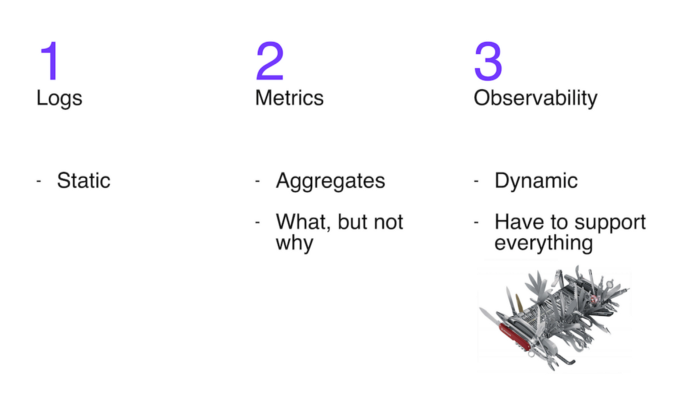

但是我們怎樣才能做到這一點呢？市場上已經有很多現成的工具了：有簡單的、有複雜的、有危險的、也有緩慢的。但是今天這篇文章是關於 BPF 的。

Linux 核心是一個事件驅動系統。實際上，在核心以及整個系統中所發生的一切都可以看作是一組事件。中斷是一個事件；透過網路接收資料包是一個事件；將處理器的控制權轉移到另一個程序是一個事件；執行函式也是一個事件。

是的，所以 BPF 是 Linux 核心的一個子系統，它使你有機會編寫一些由核心執行以響應事件的[小程式](https://cloud.tencent.com/product/tcb?from_column=20065&from=20065)。這些程式既可以幫忙你瞭解系統正在發生什麼，也可以用來控制系統。

現在讓我們來深入瞭解一下詳細細節。

## 什麼是 eBPF？

BPF 的第一個版本於 1994 年問世。有些人在為 tcpdump 實用程式編寫用於檢視或“嗅探”網路資料包的簡單規則時，可能會遇到過它。你可以為 tcpdump 設定過濾器，這樣你就不必檢視所有的內容，只需檢視你感興趣的資料包即可。例如，“只檢視 TCP 協議和 80 埠”。對於每個傳遞的資料包，都會執行一個函式來確定其是否需要儲存有問題的特定資料包。可能會有很多資料包，所以我們的函式必須要很快。實際上，我們的 tcpdump 過濾器被轉換為 BPF 函式。下面是一個例子。

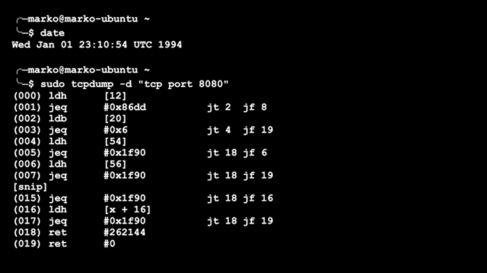

一個簡單的以 BPF 程式形式呈現的 tcpdump 過濾器

最初的 BPF 代表了一個非常簡單帶有多個暫存器的虛擬機器。但是，儘管如此，BPF 還是大大加快了網路資料包的過濾速度。在當時，這是一個很重要的進步。

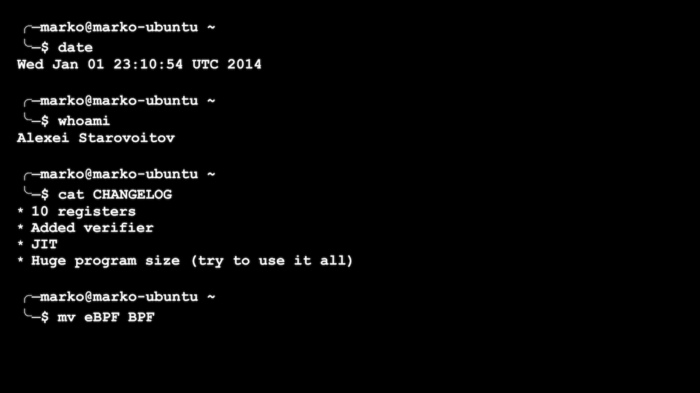

在 2014 年，Alexei Starovoitov，一個非常著名的核心駭客，擴充套件了 BPF 的功能。他增加了暫存器的數量和程式允許的大小，添加了 JIT 編譯，並建立了一個用於檢查程式是否安全的檢查器。然而，最令人印象深刻的是，新的 BPF 程式不僅能夠在處理資料包時執行，而且還能夠響應其他核心事件，並能在核心和使用者空間之間來回傳遞資訊。

這些變化為使用 BPF 的新方法提供了機會。一些過去需要透過編寫複雜而危險的核心模組來實現的功能，現在可以相對簡單地透過 BPF 來實現。為什麼能這麼好呢？是因為在編寫模組時，任何錯誤通常都會導致宕機（panic），不是“溫和”Go 風格的宕機，而是核心宕機，一旦發生，我們唯一能做的就是重啟。

普通的 Linux 使用者突然擁有了一項新的超能力：能夠檢視“引擎蓋下”的情況——這是以前只有核心核心開發人員才能使用的東西，或者根本不會提供給任何人。這個選項可以與為 iOS 或 Android 編寫程式的能力相媲美：在舊手機上，這要麼是不可能的，要麼就是要複雜得多。

Alexei Starovoitov 新版本的 BPF 被稱為 eBPF（e 代表擴充套件，extended）。但是現在它已經取代了所有舊的 BPF 用法，並且已經變得非常流行了，為了簡單起見，它仍然被稱為 BPF。

## BPF 可用於何處？

好了，你可以將 BPF 程式附加到哪些事件或觸發器上呢，人們又是如何開始使用它們以獲取新的能力的呢?

目前，主要有兩大組觸發器。

第一組用於處理網路資料包和管理網路流量。它們是 XDP、流量控制事件及其他幾個事件。

以下情況需要用到這些事件：

-   建立簡單但非常有效的防火牆。Cloudflare 和 Facebook 等公司使用 BPF 程式來過濾掉大量的寄生流量，並打擊最大規模的 DDoS 攻擊。由於處理發生在資料包生命的最早階段，直接在核心中進行（BPF 程式的處理有時甚至可以直接推送到網絡卡中進行），因此可以透過這種方式處理巨量的流量。這些事情過去都是在專門的網路硬體上完成的。
-   建立更智慧、更有針對性、但效能更好的防火牆——這些防火牆可以檢查透過的流量是否符合公司的規則、是否存在漏洞模式等。例如，Facebook 在內部進行這種審計，而一些專案則對外銷售這類產品。
-   建立智慧[負載均衡器](https://cloud.tencent.com/product/clb?from_column=20065&from=20065)。最突出的例子就是 Cilium 專案，它最常被用作 K8s 叢集中的網格網路。Cilium 對流量進行管理、均衡、重定向和分析。所有這些都是在核心執行的小型 BPF 程式的幫助下完成的，以響應這個或那個與網路資料包或套接字相關的事件。

這是第一組與網路問題相關並能夠影響網路通訊行為的觸發器。第二組則與更普遍的可觀察性相關；在大多數情況下，這組的程式無法影響任何事件，而只能“觀察”。這才是我更感興趣的。

這組的觸發器有如下幾個：

-   perf 事件（perf events）——與效能和 perf Linux 分析器相關的事件：硬體處理器計數器、中斷處理、小 / 大記憶體異常攔截等等。例如，我們可以設定一個處理程式，每當核心需要從 swap 讀取記憶體頁時，該處理程式就會執行。例如，想象有這樣一個實用程式，它顯示了當前所有使用 swap 的程式。
-   跟蹤點（tracepoints）——核心原始碼中的靜態（由開發人員定義）位置，透過附加到這些位置，你可以從中提取靜態資訊（開發人員先前準備的資訊）。在這種情況下，靜態似乎是一件壞事，因為我說過，日誌的缺點之一就是它們只包含了程式設計師最初放在那裡的內容。從某種意義上說，這是正確的，但跟蹤點有三個重要的優勢：
-   有相當多的跟蹤點散落在核心中最有趣的地方
-   當它們不“開啟”時，它們不使用任何資源
-   它們是 API 的一部分，它們是穩定的，不會改變。這非常重要，因為我們將提到的其他觸發器缺少穩定的 API。

例如，假設有一個關於顯示的實用程式，核心出於某種原因沒有給它時間執行。你坐著納悶為什麼它這麼慢，而 pprof 卻沒有顯示任何什麼有趣的東西。

-   USDT——與跟蹤點相同，但是它適用於使用者空間的程式。也就是說，作為程式設計師，你可以將這些位置新增到你的程式中。並且許多大型且知名的程式和程式語言都已經採用了這些跟蹤方法：例如 MySQL、或者 PHP 和 Python 語言。通常，它們的預設設定為“關閉”，如果要開啟它們，需要使用 enable-dtrace 引數或類似的引數來重新構建直譯器。是的，我們還可以在 Go 中註冊這種類跟蹤。你可能已經識別出引數名稱中的單詞 DTrace。關鍵在於，這些型別的靜態跟蹤是由 Solaris) 作業系統中誕生的同名系統所推廣的。例如，想象一下，何時建立新執行緒、何時啟動 GC 或與特定語言或系統相關的其他內容，我們都能夠知道是怎樣的一種場景。

這是另一種魔法開始的地方：

-   Ftrace 觸發器為我們提供了在核心的任何函式開始時執行 BPF 程式的選項。這是完全動態的。這意味著核心將在你選擇的任何核心函式或者在所有核心函式開始執行之前，開始執行之前呼叫你的 BPF 函式。你可以連線到所有核心函式，並在輸出時獲取所有呼叫的有吸引力的視覺化效果。
-   kprobes/uprobes 提供的功能與 ftrace 幾乎相同，但在核心和使用者空間中執行函式時，你可以選擇將其附加到任何位置上。如果在函式的中間，變數上有一個“if”，並且能為這個變數建立一個值的直方圖，那就不是問題。
-   kretprobes/uretprobes——這裡的一切都類似於前面的觸發器，但是它們可以在核心函式或使用者空間中的函式返回時觸發。這類觸發器便於檢視函式的返回內容以及測量執行所需的時間。例如，你可以找出“fork”系統呼叫返回的 PID。

我再重複一遍，所有這些最奇妙之處在於，當我們的 BPF 程式為了響應這些觸發器而被呼叫之後，我們可以很好地“環顧四周”：讀取函式的引數，記錄時間，讀取變數，讀取全域性變數，進行堆疊跟蹤，儲存一些內容以備後用，將資料傳送到使用者空間進行處理，和 / 或從使用者空間獲取資料或一些其他控制命令以進行過濾。簡直不可思議！

我不知道你是怎麼想的，但對我來說，這個新的基礎設施就像是一個我很早之間就想要得到的玩具一樣。

## API：怎麼使用它

好了，讓我們開看一下 BPF 程式由什麼組成的，以及如何與它互動。

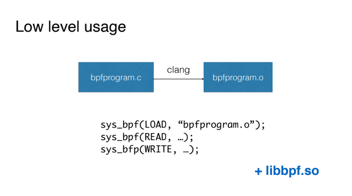

首先，我們有一個 BPF 程式，如果它透過驗證，就會被載入到核心中。在那裡，它將被 JIT 編譯器編譯成機器碼，並在核心模式下執行，這時附加的觸發器將會被啟用。

BPF 程式可以選擇與第二部分互動，即與使用者空間程式互動。有兩種方式可以做到這一點。我們可以向迴圈緩衝區寫入，而使用者空間程式可以從中讀取。我們也可以對鍵值對映（也就是所謂 BPF 對映）進行寫入和讀取，相應地，使用者空間程式也可以做同樣的事情，並且相應地，它們就可以相互傳遞資訊了。

### 基本用法

使用 BPF 最簡單的方法是用 C 語言編寫 BPF 程式，然後用 Clang 編譯器將相關的程式碼編譯成虛擬機器的程式碼（在任何情況下都不應該採用這種從頭開始的方式）。然後，我們直接使用 BPF 系統呼叫載入該程式碼，並同樣採用 BPF 系統呼叫的方式與我們的 BPF 程式進行互動。

第一種可用的簡化方法是使用 libbpf 庫。它是隨核心原始碼一起提供的，允許我們直接使用 BPF 系統呼叫。基本上，它為載入程式碼和使用 BPF 對映將資料從核心傳送到使用者空間並返回提供了方便的包裝器。

### BCC

顯然，這對人們來說一點也不方便。幸運的是，在 iovizor 這個品牌下，BCC 專案出現了，這使我們的生活變得更加輕鬆了。

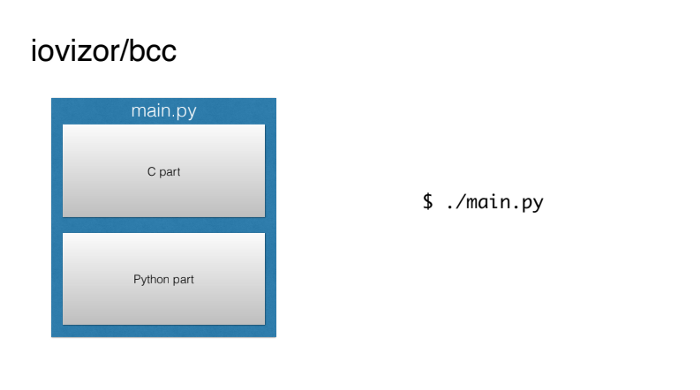

基本上，它為我們準備了整個構建環境，並允許我們編寫單個的 BPF 程式，其中С語言部分會被自動構建並載入到核心中，而使用者空間部分則可以用 Python 來實現，這既簡單又清晰明瞭。

### bpftrace

然而，BCC 似乎在很多方面都很複雜。出於某些原因，人們特別不喜歡用С語言來寫核心的這部分。

同樣那些來自 iovizor 的人也提供了一個工具，bpftrace，它允許我們用類似於 AWK 這樣的簡單指令碼語言（甚至是單行程式碼）來編寫 BPF 指令碼。

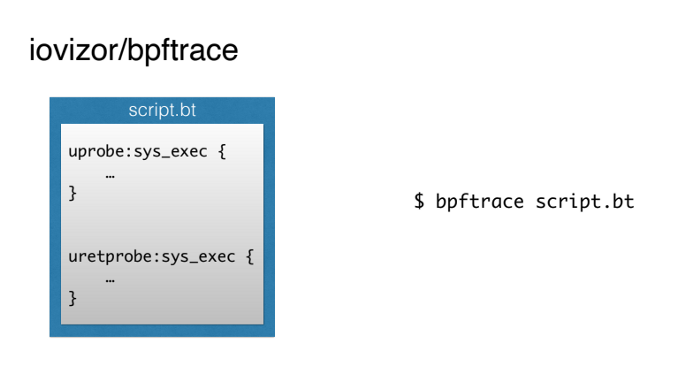

Brendan Gregg 是生產力和可觀察性領域的知名專家，他對 BPF 的可用工作方式進行了視覺化，如下圖所示：

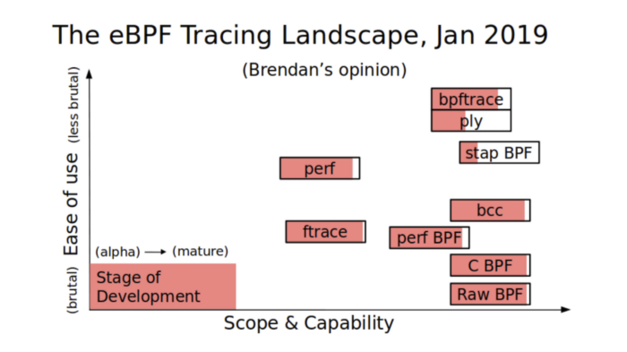

縱軸顯示的是給定工具的易用性，而橫軸顯示則是其功能。我們可以看到，BCC 是一個非常強大的工具，但它並不是一個超級簡單的工具。而 bpftrace 要簡單得多，但同時，它的功能則稍弱一些。

## 使用 BPF 的示例

現在，讓我們來看一些具體的例子，看看這些我們可以利用的神奇的力量。

BCC 和 bpftrace 都包含了一個“工具”目錄，其中包含了大量的有趣且有用的現成指令碼。它們也可以用作本地的 Stack Overflow，你可以從中複製程式碼塊以用於自己的指令碼。

例如，下面是一個顯示 DNS 查詢延遲的指令碼：

```text
╭─marko@marko-home ~
╰─$ sudo gethostlatency-bpfcc
TIME  PID COMM        LATms HOST
16:27:32 21417 DNS Res~ver #93   3.97 live.github.com
16:27:33 22055 cupsd        7.28 NPI86DDEE.local
16:27:33 15580 DNS Res~ver #87   0.40 github.githubassets.com
16:27:33 15777 DNS Res~ver #89   0.54 github.githubassets.com
16:27:33 21417 DNS Res~ver #93   0.35 live.github.com
16:27:42 15580 DNS Res~ver #87   5.61 ac.duckduckgo.com
16:27:42 15777 DNS Res~ver #89   3.81 www.facebook.com
16:27:42 15777 DNS Res~ver #89   3.76 tech.badoo.com :-)
16:27:43 21417 DNS Res~ver #93   3.89 static.xx.fbcdn.net
16:27:43 15580 DNS Res~ver #87   3.76 scontent-frt3-2.xx.fbcdn.net
16:27:43 15777 DNS Res~ver #89   3.50 scontent-frx5-1.xx.fbcdn.net
16:27:43 21417 DNS Res~ver #93   4.98 scontent-frt3-1.xx.fbcdn.net
16:27:44 15580 DNS Res~ver #87   5.53 edge-chat.facebook.com
16:27:44 15777 DNS Res~ver #89   0.24 edge-chat.facebook.com
16:27:44 22099 cupsd        7.28 NPI86DDEE.local
16:27:45 15580 DNS Res~ver #87   3.85 safebrowsing.googleapis.com
^C%
```

這是一個實時顯示 DNS 查詢完成時間的實用程式，因此，你可以捕獲一些意外的異常值（舉個例子）。

如下則是一個“監視”別人在終端上輸入的內容的指令碼：

```text
╭─marko@marko-home ~
╰─$ sudo bashreadline-bpfcc    
TIME  PID COMMAND
16:51:42 24309 uname -a
16:52:03 24309 rm -rf src/badoo
```

這種指令碼可以用來捕獲“壞鄰居”，或者對公司的伺服器執行安全審計。

用於檢視高階語言呼叫流的指令碼如下所示：

```text
╭─marko@marko-home ~/tmp
╰─$ sudo /usr/sbin/lib/uflow -l python 20590
Tracing method calls in python process 20590... Ctrl-C to quit.
CPU PID TID TIME(us) METHOD
5  20590 20590 0.173 -> helloworld.py.hello         
5  20590 20590 0.173  -> helloworld.py.world        
5  20590 20590 0.173  <- helloworld.py.world        
5  20590 20590 0.173 <- helloworld.py.hello         
5  20590 20590 1.174 -> helloworld.py.hello         
5  20590 20590 1.174  -> helloworld.py.world        
5  20590 20590 1.174  <- helloworld.py.world        
5  20590 20590 1.174 <- helloworld.py.hello         
5  20590 20590 2.175 -> helloworld.py.hello         
5  20590 20590 2.176  -> helloworld.py.world        
5  20590 20590 2.176  <- helloworld.py.world        
5  20590 20590 2.176 <- helloworld.py.hello         
6  20590 20590 3.176 -> helloworld.py.hello         
6  20590 20590 3.176  -> helloworld.py.world        
6  20590 20590 3.176  <- helloworld.py.world        
6  20590 20590 3.176 <- helloworld.py.hello         
6  20590 20590 4.177 -> helloworld.py.hello         
6  20590 20590 4.177  -> helloworld.py.world        
6  20590 20590 4.177  <- helloworld.py.world        
6  20590 20590 4.177 <- helloworld.py.hello         
^C%
```

Brendan Gregg 同樣製作了一張圖片，它彙集了所有相關的指令碼，箭頭指向每個實用程式允許你觀察的子系統。正如你所看到的那樣，我們已經擁有了大量的隨時可用的實用程式以供我們使用，實際上它們幾乎已經可以應對任何可能發生的情況了。

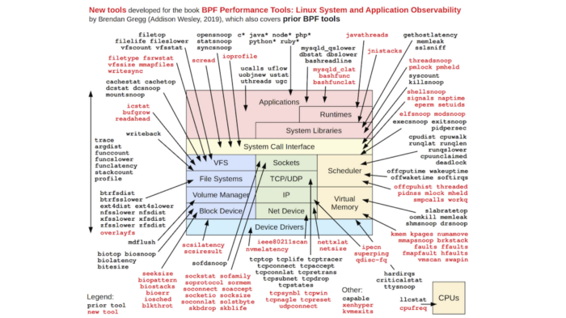

不要試圖閱讀圖片上的任何內容。該 圖片 僅供參考

## 那 Go 呢？

現在我們來談談 Go。我們有兩個基本問題：

-   你能用 Go 編寫 BPF 程式嗎？
-   我們能分析用 Go 編寫的程式嗎？

我們按順序來逐步看下。

目前，唯一能夠編譯成 BPF 機器可以理解的格式的編譯器是 Clang。另一種流行的編譯器 GСС仍然沒有 BPF 後端。而能夠編譯成 BPF 的程式語言，只有 C 語言的一個非常受限的版本。

然而，BPF 程式還有一個在使用者空間中的第二部分。這部分可以用 Go 來編寫。

正如我前面提到的那樣，BCC 允許你用 Python 編寫這一部分，而 Python 是該工具的主要語言。同時，在主庫中，BCC 還支援 Lua 和 C++，並且在輔庫中，它還支援 Go。

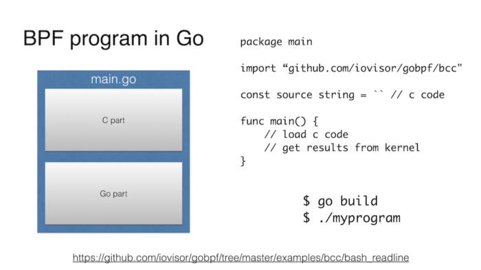

這個程式看起來和 Python 中的程式完全一樣。一開始，它有一個字串，其中的 BPF 程式是 C 語言編寫的，然後我們通訊將給定的程式附加到那裡，並以某種方式與它進行互動，例如，從 BPF 對映中提取資料。

基本上就是這樣。可以在 Github 上檢視這個例子的更多詳細資訊。

主要的缺點可能是，我們使用的是 C 庫、libbcc 或 libbpf，而用 C 庫構建 Go 程式遠非“在公園裡散步”那麼容易。

除了 iovisor/gobpf 之外，我還發現了其他三個最新的專案，它們允許你在 Go 中編寫使用者空間（userland）部分。

-   https://github.com/dropbox/goebpf
-   https://github.com/cilium/ebpf
-   https://github.com/andrewkroh/go-ebpf

Dropbox 的版本不需要任何 C 庫，但你需要自己使用 Clang 構建 BPF 的核心部分，然後使用 Go 程式將其載入到核心中。

Cilium 版本與 Dropbox 版本具有相同的細節。但值得一提的是，它是由來自 Cilium 專案的人制作的，這意味著它只能成功。

出於完整性的考慮，我列出了第三個專案。就像前面兩個專案一樣，它沒有外部的 C 語言依賴項，需要用 C 語言手動構建 BPF 程式，但是，它的前途看起來並不是特別好。

事實上，我們還應該問一個問題：為什麼要用 Go 來編寫 BPF 程式？因為如果你看 BCC 或 bpftrace，那麼 BPF 程式只佔用不到 500 行程式碼。但是，僅僅用 bpftrace 語言編寫一個小指令碼，或者使用一點 Python，不是更簡單嗎？我有兩個理由不支援這樣做。

第一個原因是：你真的很喜歡 Go，並且更願意用 Go 來做所有的事情。此外，將 Go 程式從一臺機器遷移到另一臺機器可能會更簡單：靜態連結、簡單的二進位制檔案等等。但事情遠沒有這麼簡單，因為我們被繫結到一個特定的核心上。我就講到這裡吧，否則，我的文章又要多 50 頁了。

第二個原因是：你編寫的不是一個簡單的指令碼，而是一個大型的系統，它也在內部使用了 BPF。我甚至 在 Go 中看到過一個關於這樣的系統的例子：

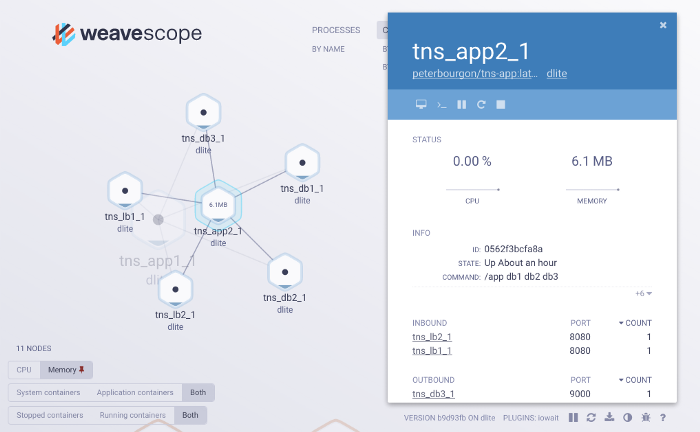

Scope 專案看起來像是一個二進位制檔案，當它在 K8s 或其他的雲基礎設施上執行時，它會分析周圍發生的一切，並顯示有哪些容器和服務，以及它們是如何互動的等等。這些很多都是用 BPF 來實現的。這是一個有趣的專案。

## Go 程式分析

如果你還記得，我們還有一個問題：我們可以用 BPF 來分析用 Go 編寫的程式嗎？我們的第一反應是，“可以，我們可以！”程式用什麼語言編寫又有什麼區別呢？畢竟，它只是編譯後的程式碼，就像其他程式一樣，在處理器中計算一些東西，瘋狂地佔用記憶體，並透過核心與硬體互動，透過系統呼叫與核心互動。原則上這是正確的，但也有一些具體問題——這些問題有不同程度的複雜性。

### 傳遞引數

其中一個問題是，Go 不使用大多數其他語言所使用的 ABI（Application binary interface，應用二進位制介面）。結果是，這位“開創者”決定將 ABI 從它們所熟悉的 Plan 9 系統中移除。

與 API 一樣，ABI 也是一種介面約定——只是在位、位元組和機器碼級別。

我們對 ABI 感興趣的點主要在於它的引數是如何傳遞給函式的，以及響應是如何從函式中返回的。如果在標準的 ABI x86-64 中，處理器的暫存器是用於傳遞引數和響應的，而在 Plan 9 ABI 中，堆疊則是用於實現該目標。

Rob Pike 和他的團隊並沒有打算制定另一個標準；他們已經為 Plan 9 系統提供了一個幾乎隨時可用的 C 編譯器，就像計算 2x2 一樣簡單。在很短的時間內，他們將其改造成了 Go 編譯器。這就是一個工程師的方法。

然而，事實上，這並不是一個關鍵問題。一方面，我們可能很快就會看到引數在 Go 中 透過暫存器來傳遞，其次，從 BPF 中獲取堆疊引數並不複雜：sargX 別名 已經新增到了 bpftrace 中，另一個別名 很可能會在不久的將來出現在 BCC 中。

更新：自從我做了演講之後，Go 官方的 詳細提案 甚至已經出臺，並建議在 ABI 中使用暫存器。

### 唯一執行緒識別符號

第二個具體問題與 Go 的一個深受喜愛的特性相關，即 goroutines。度量函式延遲的方法之一是儲存函式被呼叫的時間，獲取函式的退出時間，並計算其差值。我們需要儲存開始時間以及一個包含函式名和 TID（執行緒 ID）的鍵。執行緒 ID 是必需的，因為同一個函式可以被不同的程式或者被同一個程式的不同執行緒同時呼叫。

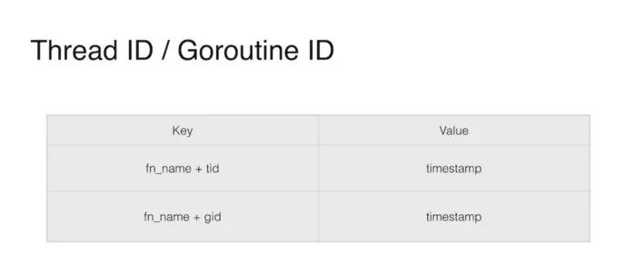

但是，在 Go 中，goroutine 在系統執行緒之間移動：前一分鐘，goroutine 在一個執行緒上執行，下一分鐘，則在另一個執行緒上執行。而且，在 Go 的情況下，最好不要將 TID 放入鍵中，而是將 GID（即 goroutine 的 ID）放入其中，這對我們來說是有好處的，但不幸的是，我們無法獲得它。從純技術的角度來看，這個 ID 確實存在。你甚至可以使用骯髒的駭客攻擊來提取它，因為可以在堆疊中的某個位置找到它，但這樣做是被關鍵開發人員小組建議嚴格禁止的。他們認為這是我們永遠不需要的資訊。對於 goroutine 的本地儲存也是如此，但這是偏離主題的。

### 擴充套件棧

第三個問題是最嚴重的。它是如此嚴重，以至於即使我們以某種方式解決了第二個問題，也無法幫助我們度量 Go 函式的延遲。

大多數讀者可能已經對什麼是棧有了很好的理解。這是同一個棧中，與堆不同，你可以為變數分配記憶體，而不必考慮釋放。

但是對於 C 語言來說，在這種情況下，棧的大小是固定的。如果超出了這個固定的大小，就會出現眾所周知的 堆疊溢位 現象。

在 Go 中，棧是動態的。在舊版本中，它是透過記憶體塊的連結串列實現的。現在，它是一個大小動態變化的連續塊。這意味著，如果分配的記憶體塊對我們來說不夠，我們就擴充套件當前的記憶體塊。如果我們不能擴充套件它，我們就分配一個更大的，然後把所有的資料從舊的位置移動到新的位置。這一點非常吸引人，並且涉及了安全保證、cgo 和垃圾收集等問題，但這是另一篇文章的主題。

重要的是要知道，為了讓 Go 能夠移動棧，它必須能夠呼叫棧，並遍歷棧中的所有指標。

而這就是基本問題的所在之處：uretprobes，用於將 BPF 探測附加到函式返回點，動態地改變棧，以整合對其處理程式的呼叫，也就是所謂的“蹦床”（trampoline）。而且，在大多數情況下，這會改變棧，這是 Go 不期望的事情，它會導致程式的崩潰。糟糕！

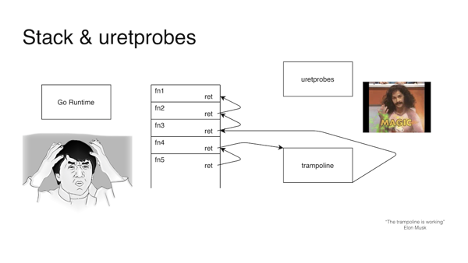

順便說一句，這並不是 Go 所獨有的。當處理異常時，C++ 棧拆分器也會每隔一段時間就崩潰一次。

這個問題沒有解決的辦法。像往常一樣，在這種情況下，雙方都會相互指責對方，並各自都能提出完全有根據的論點。

但是，如果你真的需要設定一個 uretprobe，有一種方法可以繞過這個問題。怎麼用呢？不要設定 uretprobe。你可以在退出函式的所有位置設定一個 uprobe。可能只有一個這樣的位置，也可能有五十個這樣的位置。

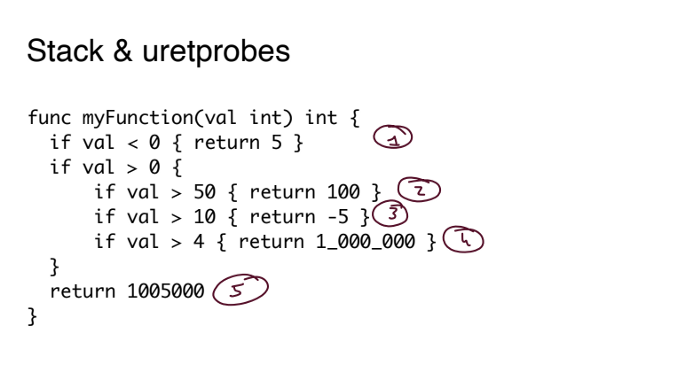

這就是 Go 的獨特之處。

通常情況下，這種伎倆是行不通的。一個足夠聰明的編譯器知道如何執行所謂的 尾部呼叫最佳化，當我們只是簡單地跳到下一個函式的開始處，而不是從函式返回並沿著呼叫棧返回時。這種最佳化對於諸如 Haskell 這樣的函式式語言來說至關重要。如果沒有它，在不發生堆疊溢位的情況下，你就會寸步難行。然而，透過這種最佳化，我們根本不可能找到從函式返回的所有位置。

具體來說，Go 1.14 版本的編譯器還不能執行尾部呼叫最佳化。這意味著，附加到函式的所有顯式退出的技巧都是有效的，即使它非常笨重。

### 示例

不要認為 BPF 對 Go 沒用。遠非如此。我們可以做所有其他不涉及上述問題的事情。而且我們也會這樣做的。

讓我們來看一些例子。

首先，讓我們來看一個簡單的程式。基本上，它是一個監聽 8080 埠的 Web 伺服器，並有一個 HTTP 查詢的處理程式。處理程式從 URL 中獲取名稱引數和年份引數，執行檢查，然後將所有這三個變數（名稱、年份和檢查狀態）傳送到 prepareAnswer() 函式，然後該函式準備一個字串形式的答案。

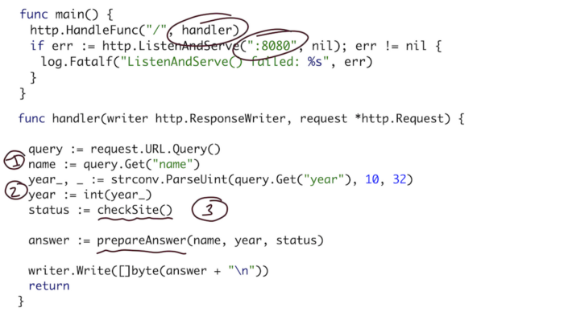

站點檢查（Site check）是一個 HTTP 查詢，透過通道和 goroutines 檢查會議站點是否正常工作。prepare 函式只是簡單地將所有這些引數轉換為一個可讀的字串。

我們將透過 curl 進行簡單的查詢來觸發我們程式：

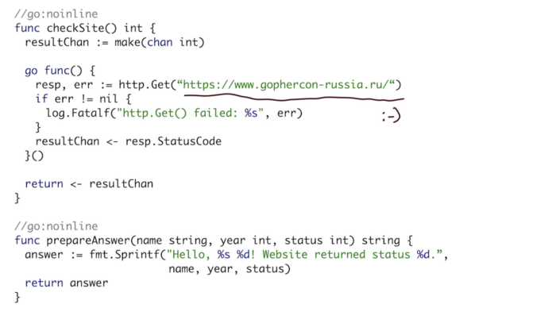

對於我們的第一個示例，我們將使用 bpftrace 列印所有程式的函式呼叫。在這種情況下，我們將對“main”下的所有函式進行附加。在 Go 中，所有函式都有一個符號，其形式如下：包名. 函式名。我們的包是“main”，函式的執行時是“runtime”。

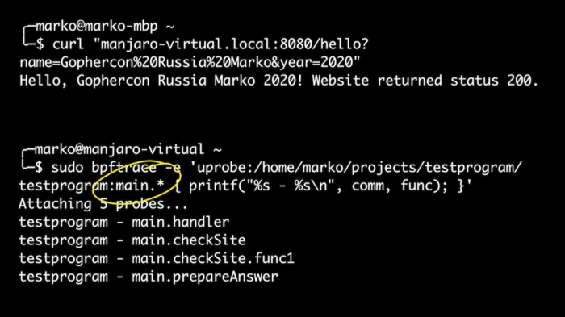

當我使用 curl 時，會執行處理程式、站點檢查函式和 goroutine 子函式，然後執行準備答案函式。太好了！

接下來，我不僅要匯出那些正在執行的函式，還要匯出它們的引數。讓我們以函式 prepareAnswer() 為例。它有三個引數。讓我們試著輸出兩個整數。

讓我們以 bpftrace 為例，只不過這次不是執行單行程式碼，而是執行一個指令碼，我們將其附加到我們的函式上，並使用別名作為堆疊的引數，就像我所說的那樣。

在輸出中，我們可以看到，我們傳送了 2020，獲取的狀態是 200，此外，還發送了一次 2021。

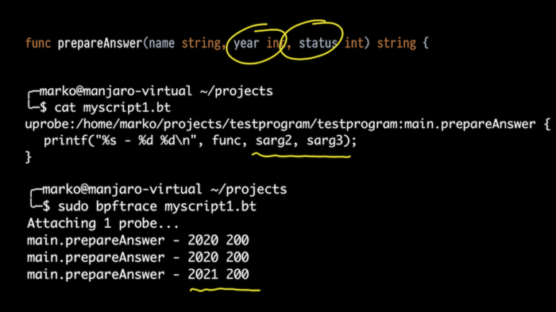

但是這個函式有三個引數。其中第一個引數是字串。那它怎麼處理呢？

讓我們簡單地匯出從 0 到 3 的所有堆疊引數。我們看到了什麼？一個很大的數字，一個稍小點的數字，還有我們原來的數字 2021 年和 200。開頭這些奇怪的數字是什麼呢？

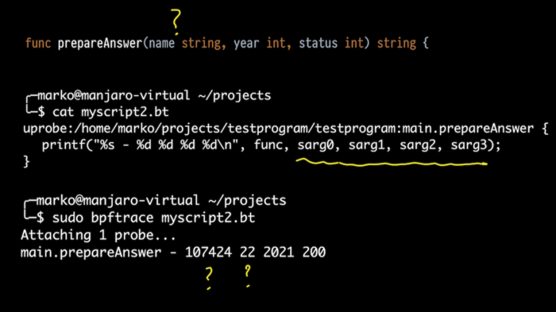

這時，熟悉 Go 的內部結構是很有幫助的。如果在 C 語言中，字串只是一個以 0 結尾的位元組陣列，那麼在 Go 中，字串實際上是一個結構體，它由指向位元組陣列的指標（順便說一句，這它不是以 0 結尾的）和長度組成。

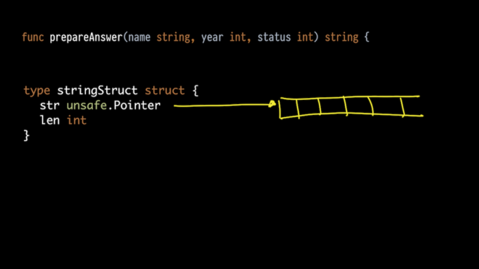

但是 Go 編譯器，當它以引數的形式傳送一個字串時，會展開這個結構體，並將它作為兩個引數傳送。所以，第一個奇怪的數字確實是一個指向我們陣列的指標，第二個是長度。

果然：預期的字串長度是 22。

相應地，我們稍微修正了一下我們的指令碼，以便透過堆疊指標暫存器獲取問題中的兩個值及其正確的偏移量，並且在整合的 str() 函式的幫助下，我們將其匯出為字串。一切順利：

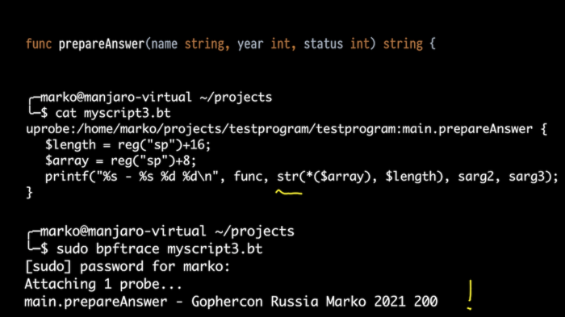

我們也來看看執行時。例如，我想知道我們的程式啟動了哪些 goroutines。我們知道 goroutines 是由函式 newproc() 和 newproc1() 啟動的。讓我們附著一下它們。指向函式結構的指標是 newproc1() 函式的第一個引數。它只有一個欄位，即指向函式的指標：

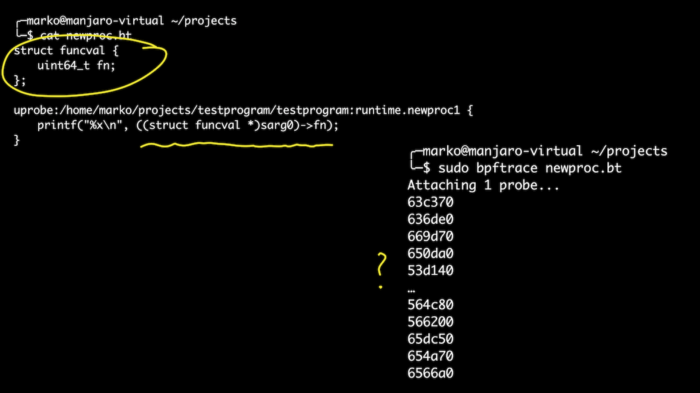

在本例中，我們將使用直接在指令碼中定義結構的功能。這比玩偏移要簡單一些。我們已經匯出了處理程式被呼叫時啟動的所有 goroutines。之後，如果我們想要獲取偏移量的符號名稱，那麼我們就可以在其中看到我們的 checkSite 函數了。歡呼！

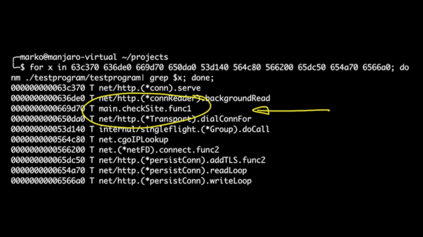

就 BPF、BCC 和 bpftrace 的功能而言，這些示例只是滄海一粟。只要對內部工作原理有了足夠的瞭解和經驗，你就可以從一個正在執行的程式中獲得幾乎所有的資訊，而無需停止或更改它。

## 結論

這就是我想告訴你的全部內容，我希望它對你有所啟發。

BPF 是 Linux 中最流行也是最有前途的領域之一。而且我相信，在未來的幾年裡，我們將會看到更多有趣的東西——不僅是技術本身，還有工具以及它的傳播。

現在開始還不算太晚，並不是每個人都知道 BPF，所以趕快開始學習吧，成為魔術師，解決問題，幫助你的同事。他們都說魔術只有一次效果。

當談到 Go 時，像往常一樣，我們最終會變得非常獨特。我們總是有一些怪癖，無論是不同的編譯器，還是 ABI，需要 GOPATH，有一個你無法 Google 的名字。但我認為，可以說我們已經成為一股不可忽視的力量，在我看來，事情只會變得越來越好。

**原文連結：**

<https://medium.com/bumble-tech/bpf-and-go-modern-forms-of-introspection-in-linux-6b9802682223#e0e4>
