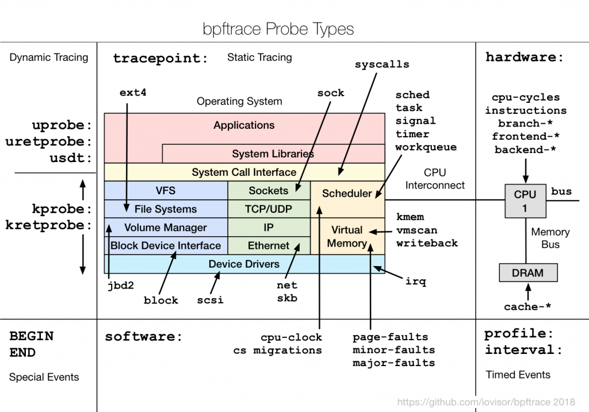

# bpftrace 入門：認識 eBPF 的四種追蹤機制

[`bpftrace`](https://github.com/bpftrace/bpftrace) 是一個讓我們能快速實踐 eBPF 追蹤的工具。它本身是一種高階 eBPF 追蹤語言，具備以下特點：

- 語法簡潔，類似 Linux 上常見的 `awk`，容易上手
- 可即時執行，腳本會自動編譯成 eBPF bytecode，不需要手動編譯
- 支援多種追蹤機制，包含 Tracepoints、Kprobes、Uprobes、USDT
- 內建聚合函式，例如 `count()`、`hist()`、`avg()` 等統計功能

如果不使用 `bpftrace`，又不想直接撰寫 bytecode，那麼以 C 搭配 `libbpf` 函式庫，也是常見的 eBPF 開發方式之一。相較之下，`bpftrace` 語法更精簡、開發速度更快，特別適合用於快速分析與除錯。本文也會以 `bpftrace` 作為 eBPF 操作範例。

## 安裝 bpftrace

詳細的環境需求與安裝步驟，可以參考 [官方安裝文件](https://github.com/bpftrace/bpftrace/blob/master/INSTALL.md)。本文以 Ubuntu 24.04 作為示範環境：

```bash
sudo apt-get install -y bpftrace
```

安裝完成後，就可以先用最簡單的指令確認 `bpftrace` 是否正常運作：

```bash
sudo bpftrace -e 'BEGIN { printf("Hello, bpftrace!\n"); }'
```

執行後，會看到 probe 被動態掛載，並印出 `Hello, bpftrace!`：

```text
Attaching 1 probe...
Hello, bpftrace!
```

## bpftrace 語法參考

`bpftrace` 提供相當完整的語法與內建函式。若想進一步查詢特定語法，可參考：

- [Reference Guide](https://github.com/bpftrace/bpftrace/blob/master/docs/reference_guide.md)

此外，`bpftrace` 本身也提供實用的查詢指令：

```bash
# 查看所有可用的內建函式和變數
man bpftrace

# 列出所有 probe 類型
sudo bpftrace -l

# 查看特定 tracepoint 的參數
sudo bpftrace -lv tracepoint:syscalls:sys_enter_openat
```

## eBPF 的四種追蹤機制

eBPF 提供多種追蹤機制，讓我們能依不同情境選擇合適的追蹤方式：



### 1. Kernel Tracepoint

Kernel Tracepoint 是核心開發者在程式碼中預先埋設的追蹤點。這些追蹤點允許 eBPF 程式掛載到特定的 kernel event，藉此捕獲相關資料，進行分析與監控。

我們也可以透過 `bpftrace` 找出核心中已存在的 tracepoint：

```bash
# 列出所有 tracepoints
sudo bpftrace -l 'tracepoint:*' | head

# 查看 syscalls 相關 tracepoints
sudo bpftrace -l 'tracepoint:syscalls:*' | head
```

### 2. USDT (User Statically Defined Tracing)

USDT 類似 Kernel Tracepoint，只是追蹤點是預先埋設在使用者空間程式中。例如 Python 就內建了一些 USDT probes，可用來追蹤函式呼叫、GC 事件等。

### 3. Kprobes (Kernel Probes)

即使核心內部函式沒有預先埋入 tracepoint，也可以透過 Kprobes，將 eBPF 動態掛載到幾乎任何 kernel 函式上。若要確認有哪些函式可被動態掛載，可執行：

```bash
sudo bpftrace -l 'kprobe:*tcp*' | head
```

這會列出可用於 Kprobes 追蹤的函式，例如：

```text
kprobe:__arm64_sys_getcpu
kprobe:__bpf_tcp_ca_init
kprobe:__bpf_tcp_ca_release
kprobe:__mptcp_check_push
kprobe:__mptcp_clean_una
kprobe:__mptcp_close
kprobe:__mptcp_close_ssk
kprobe:__mptcp_data_acked
kprobe:__mptcp_destroy_sock
kprobe:__mptcp_error_report
```

例如，我們可以把 Kprobe 掛載到 kernel 內部的 `tcp_connect` 函式上，以觀察比 syscall 層更深入的網路行為：

```bash
sudo bpftrace -e '
kprobe:tcp_connect {
    printf("%s (PID %d) initiated TCP connection\n", comm, pid);
}'
```

在另一個終端機使用 `telnet` 發起 TCP 連線後，eBPF 就能捕捉到相關資訊：

```text
Attaching 1 probe...
telnet (PID 2976) initiated TCP connection
```

### 4. Uprobes (User Probes)

Uprobes 與 Kprobes 類似，差別在於 Kprobes 掛載在 kernel space 的函式上，而 Uprobes 掛載在 user space 的函式上。因此，我們可以使用 Uprobes 追蹤應用程式或函式庫。

常見的應用場景包括：

- 追蹤資料庫查詢
- 追蹤 OpenSSL 加密函式，以進行 SSL/TLS 監控
- 追蹤 `malloc`、`free` 等函式，以進行記憶體分析

例如，我們可以使用 Uprobe 追蹤 Bash 的 `readline` 函式，觀察使用者輸入的完整指令：

```bash
sudo bpftrace -e '
uretprobe:/bin/bash:readline {
    printf("Command: %s\n", str(retval));
}'
```

當使用者在另一個終端機輸入指令時，Uprobe 便能成功捕捉：

```text
Attaching 1 probe...
Command: ls
Command: pwd
```

## bpftrace 語法深入

### 基本語法結構

`bpftrace` 的程式結構類似 `awk`，由 **probe** 與 **action** 組成：

```
probe /filter/ {
    action
}
```

- **probe**：指定掛載點（tracepoint、kprobe、uprobe 等）
- **filter**：可選的條件過濾，只有條件為真時才執行 action
- **action**：要執行的操作（列印、聚合、記錄等）

一個 bpftrace 程式可以包含多個 probe 區塊，還有兩個特殊 probe：

```c
BEGIN {
    // 程式開始時執行一次（初始化）
}

probe /filter/ {
    // 每次事件觸發時執行
}

END {
    // 程式結束時執行一次（清理、輸出統計）
}
```

### 變數系統

bpftrace 有三種變數：

```c
// 1. 內建變數（唯讀，由系統提供）
pid, tid, comm, uid, nsecs, kstack, ustack, arg0, arg1, ...

// 2. Scratch 變數（以 $ 開頭，probe 內部的區域變數）
$latency = nsecs;
$filename = str(arg0);

// 3. Map 變數（以 @ 開頭，全域持久化，跨 probe 共享）
@start[pid] = nsecs;              // 以 pid 為 key 儲存時間戳
@bytes = 0;                        // 全域計數器
@hist_latency = hist($latency);   // 直方圖聚合
```

Map 變數是 bpftrace 最強大的功能之一，底層對應到 eBPF map，可以跨 probe 共享資料：

```bash
sudo bpftrace -e '
tracepoint:syscalls:sys_enter_read {
    @start[tid] = nsecs;
}

tracepoint:syscalls:sys_exit_read / @start[tid] / {
    $duration_us = (nsecs - @start[tid]) / 1000;
    @read_latency_us = hist($duration_us);
    delete(@start[tid]);
}

END {
    clear(@start);
}'
```

### 過濾器（Filter）

過濾器用 `/ /` 包裹，支援多種條件：

```c
// 只追蹤特定 process
kprobe:vfs_read / comm == "nginx" / { ... }

// 只追蹤特定 PID
kprobe:vfs_read / pid == 1234 / { ... }

// 只追蹤特定 UID（非 root）
kprobe:vfs_read / uid != 0 / { ... }

// 組合條件
kprobe:vfs_read / comm == "nginx" && arg2 > 4096 / { ... }

// 只在 map 存在對應 key 時觸發
tracepoint:syscalls:sys_exit_read / @start[tid] / { ... }
```

### 聚合函式

bpftrace 內建豐富的聚合函式，適合做統計分析：

```bash
# count() — 計數
sudo bpftrace -e '
tracepoint:syscalls:sys_enter_* {
    @syscall_count[probe] = count();
}'

# hist() — 以 2 的冪次為區間的直方圖
sudo bpftrace -e '
tracepoint:syscalls:sys_exit_read / retval > 0 / {
    @read_size = hist(retval);
}'

# lhist() — 線性直方圖（自訂區間）
sudo bpftrace -e '
tracepoint:syscalls:sys_exit_read / retval > 0 / {
    @read_size = lhist(retval, 0, 10000, 1000);
}'

# sum() — 加總
sudo bpftrace -e '
tracepoint:syscalls:sys_exit_read / retval > 0 / {
    @total_bytes[comm] = sum(retval);
}'

# avg() / min() / max() — 平均值、最小值、最大值
sudo bpftrace -e '
tracepoint:syscalls:sys_exit_read / retval > 0 / {
    @avg_read[comm] = avg(retval);
    @max_read[comm] = max(retval);
}'

# stats() — 同時輸出 count, avg, total
sudo bpftrace -e '
tracepoint:syscalls:sys_exit_read / retval > 0 / {
    @read_stats[comm] = stats(retval);
}'
```

### 字串與格式化輸出

```c
// str() — 將指標轉為字串
printf("filename: %s\n", str(arg0));

// buf() — 讀取指定長度的 buffer
printf("data: %r\n", buf(arg0, 16));

// printf 支援常見格式化
printf("pid=%d comm=%s latency=%lld ns\n", pid, comm, $lat);

// 時間戳記
printf("%s %s\n", strftime("%H:%M:%S", nsecs), comm);
```

---

## bpftrace 內建變數完整指南

### Process 相關

| 變數 | 型別 | 說明 |
|------|------|------|
| `pid` | uint64 | Process ID |
| `tid` | uint64 | Thread ID |
| `uid` | uint64 | User ID |
| `gid` | uint64 | Group ID |
| `nsecs` | uint64 | 當前時間戳（奈秒） |
| `elapsed` | uint64 | 自 bpftrace 啟動以來的奈秒數 |
| `comm` | string | Process 名稱（最長 16 字元） |
| `curtask` | uint64 | 當前 `task_struct` 指標 |
| `cgroup` | uint64 | 當前 cgroup ID |
| `cpu` | uint32 | 當前 CPU 編號 |

### Probe 相關

| 變數 | 型別 | 說明 |
|------|------|------|
| `probe` | string | 當前 probe 的完整名稱 |
| `func` | string | 被追蹤的函式名稱 |
| `arg0` ~ `argN` | uint64 | 函式的第 N 個參數 |
| `retval` | uint64 | 函式的回傳值（僅 `*retprobe` 可用） |
| `args` | struct | Tracepoint 的結構化參數 |

### Stack 相關

| 變數 | 型別 | 說明 |
|------|------|------|
| `kstack` | kstack | Kernel stack trace |
| `ustack` | ustack | User space stack trace |
| `kstack(n)` | kstack | 限制 kernel stack 深度為 n |
| `ustack(n)` | ustack | 限制 user stack 深度為 n |

### 實用範例：用 stack trace 追蹤 kernel 記憶體配置

```bash
sudo bpftrace -e '
kprobe:__kmalloc {
    @alloc_stacks[kstack, comm] = count();
}

END {
    print(@alloc_stacks, 10);
}'
```

### 實用範例：用 ustack 追蹤應用程式的記憶體配置

```bash
sudo bpftrace -e '
uprobe:/lib/x86_64-linux-gnu/libc.so.6:malloc {
    @malloc_stacks[ustack, comm] = count();
}' -c "ls"
```

---

## 實戰範例

### 範例一：系統呼叫統計 — 找出最繁忙的 syscall

```bash
sudo bpftrace -e '
tracepoint:raw_syscalls:sys_enter {
    @syscalls[comm, args.id] = count();
}

interval:s:5 {
    print(@syscalls, 20);
    clear(@syscalls);
}'
```

搭配 syscall 編號對照表，找出哪些 process 發出最多系統呼叫。更直覺的做法：

```bash
# 直接列出每個 process 呼叫了哪些 syscall（以名稱顯示）
sudo bpftrace -e '
tracepoint:syscalls:sys_enter_* {
    @[comm, probe] = count();
}'
```

輸出範例：

```text
@[bash, tracepoint:syscalls:sys_enter_rt_sigprocmask]: 45
@[bash, tracepoint:syscalls:sys_enter_write]: 23
@[nginx, tracepoint:syscalls:sys_enter_epoll_wait]: 1502
@[nginx, tracepoint:syscalls:sys_enter_read]: 1489
@[nginx, tracepoint:syscalls:sys_enter_write]: 1401
```

### 範例二：檔案 I/O 追蹤 — 誰在讀寫哪些檔案

```bash
sudo bpftrace -e '
tracepoint:syscalls:sys_enter_openat {
    printf("%-16s PID:%-6d %s\n", comm, pid, str(args.filename));
}'
```

更進階 — 追蹤 read/write 延遲與大小：

```bash
sudo bpftrace -e '
tracepoint:syscalls:sys_enter_read {
    @start[tid] = nsecs;
    @fd[tid] = args.fd;
}

tracepoint:syscalls:sys_exit_read / @start[tid] / {
    $dur_us = (nsecs - @start[tid]) / 1000;
    @read_latency_us[comm] = hist($dur_us);
    @read_bytes[comm] = sum(retval > 0 ? retval : 0);
    delete(@start[tid]);
    delete(@fd[tid]);
}

END {
    clear(@start);
    clear(@fd);
}'
```

### 範例三：TCP 連線追蹤 — 觀察網路行為

```bash
sudo bpftrace -e '
kprobe:tcp_connect {
    $sk = (struct sock *)arg0;
    $daddr = ntop($sk->__sk_common.skc_daddr);
    $dport = ($sk->__sk_common.skc_dport >> 8) |
             (($sk->__sk_common.skc_dport & 0xff) << 8);
    printf("%-16s PID:%-6d -> %s:%d\n", comm, pid, $daddr, $dport);
}'
```

### 範例四：追蹤 process 的生命週期

```bash
sudo bpftrace -e '
tracepoint:sched:sched_process_exec {
    printf("[EXEC]  %s PID:%-6d %s\n",
        strftime("%H:%M:%S", nsecs), pid, str(args.filename));
}

tracepoint:sched:sched_process_exit {
    printf("[EXIT]  %s PID:%-6d %s\n",
        strftime("%H:%M:%S", nsecs), pid, comm);
}'
```

### 範例五：追蹤 DNS 查詢

```bash
sudo bpftrace -e '
uprobe:/lib/x86_64-linux-gnu/libc.so.6:getaddrinfo {
    printf("%-16s PID:%-6d DNS lookup: %s\n", comm, pid, str(arg0));
}'
```

---

## USDT 實作範例

### 什麼是 USDT

USDT（User Statically Defined Tracing）是應用程式開發者在程式碼中預先埋設的追蹤點。與 Kprobes/Uprobes 不同，USDT 是**靜態定義**的，提供穩定的追蹤介面，不會因為程式碼重構而失效。

### 列出 USDT probes

```bash
# 列出 Python 的 USDT probes
sudo bpftrace -l 'usdt:/usr/bin/python3:*'

# 列出 Node.js 的 USDT probes
sudo bpftrace -l 'usdt:/usr/bin/node:*'

# 列出特定 PID 的 USDT probes（適用於動態語言執行中的 process）
sudo bpftrace -lp <PID>
```

### 範例：追蹤 Python 函式呼叫

Python 3 內建了 USDT probes（需要編譯時啟用 `--with-dtrace`，Ubuntu 預設已啟用）：

```bash
# 確認 Python 是否支援 USDT
sudo bpftrace -l 'usdt:/usr/bin/python3:*'
```

常見的 Python USDT probes：

```text
usdt:/usr/bin/python3:python:function__entry
usdt:/usr/bin/python3:python:function__return
usdt:/usr/bin/python3:python:gc__start
usdt:/usr/bin/python3:python:gc__done
usdt:/usr/bin/python3:python:import__find__load__start
usdt:/usr/bin/python3:python:import__find__load__done
```

追蹤 Python 函式進出：

```bash
sudo bpftrace -e '
usdt:/usr/bin/python3:python:function__entry {
    printf("[CALL]   %s:%s:%d\n", str(arg0), str(arg1), arg2);
}

usdt:/usr/bin/python3:python:function__return {
    printf("[RETURN] %s:%s:%d\n", str(arg0), str(arg1), arg2);
}' -p $(pgrep -f your_script.py)
```

其中 `arg0` 是檔案名稱、`arg1` 是函式名稱、`arg2` 是行號。

### 範例：追蹤 Python GC 事件

```bash
sudo bpftrace -e '
usdt:/usr/bin/python3:python:gc__start {
    @gc_start = nsecs;
    printf("GC started (generation %d)\n", arg0);
}

usdt:/usr/bin/python3:python:gc__done {
    $dur_ms = (nsecs - @gc_start) / 1000000;
    printf("GC finished: collected %lld objects in %lld ms\n", arg0, $dur_ms);
    @gc_duration_ms = hist($dur_ms);
}' -p $(pgrep -f your_script.py)
```

### 範例：追蹤 Node.js HTTP 請求

Node.js 也支援 USDT probes（需使用 `--enable-dtrace` 編譯，或使用帶 USDT 支援的 Node.js 版本）：

```bash
sudo bpftrace -e '
usdt:/usr/bin/node:http:server:request {
    printf("HTTP Request: %s %s\n", str(arg4), str(arg5));
}' -p $(pgrep node)
```

### 在 C 程式中自訂 USDT probes

使用 `sys/sdt.h` 標頭檔在自己的程式中埋設 USDT probes：

```c
// my_app.c
#include <stdio.h>
#include <sys/sdt.h>
#include <unistd.h>

void process_request(int id, const char *data) {
    DTRACE_PROBE2(my_app, request_start, id, data);

    // 處理邏輯...
    usleep(1000 * (id % 10));

    DTRACE_PROBE1(my_app, request_end, id);
}

int main() {
    for (int i = 0; i < 100; i++) {
        process_request(i, "hello");
    }
    return 0;
}
```

編譯時需安裝 `systemtap-sdt-dev`：

```bash
sudo apt-get install -y systemtap-sdt-dev
gcc -o my_app my_app.c
```

追蹤自訂 probes：

```bash
# 列出程式的 USDT probes
sudo bpftrace -l 'usdt:./my_app:*'

# 追蹤 request 延遲
sudo bpftrace -e '
usdt:./my_app:my_app:request_start {
    @start[arg0] = nsecs;
    printf("Request %d started: %s\n", arg0, str(arg1));
}

usdt:./my_app:my_app:request_end / @start[arg0] / {
    $dur_us = (nsecs - @start[arg0]) / 1000;
    printf("Request %d finished in %d us\n", arg0, $dur_us);
    @latency = hist($dur_us);
    delete(@start[arg0]);
}' -c ./my_app
```

---

## 進階用法

### One-liner 集錦

以下是實用的 bpftrace 一行腳本，可以直接複製使用：

```bash
# 1. 統計每秒的 syscall 數量
sudo bpftrace -e 'tracepoint:raw_syscalls:sys_enter { @[comm] = count(); }
  interval:s:1 { print(@, 10); clear(@); }'

# 2. 追蹤所有 open 的檔案
sudo bpftrace -e 'tracepoint:syscalls:sys_enter_openat {
  printf("%-16s %s\n", comm, str(args.filename)); }'

# 3. 統計 read 大小分佈
sudo bpftrace -e 'tracepoint:syscalls:sys_exit_read / retval > 0 / {
  @size = hist(retval); }'

# 4. 追蹤 process 建立（含完整命令列）
sudo bpftrace -e 'tracepoint:syscalls:sys_enter_execve {
  printf("%-6d %s", pid, str(args.filename));
  join(args.argv); }'

# 5. 每秒統計 context switch 次數
sudo bpftrace -e 'tracepoint:sched:sched_switch { @[comm] = count(); }
  interval:s:1 { print(@, 5); clear(@); }'

# 6. 追蹤 block I/O 延遲
sudo bpftrace -e 'tracepoint:block:block_rq_issue { @start[args.dev,
  args.sector] = nsecs; }
  tracepoint:block:block_rq_complete / @start[args.dev, args.sector] / {
  @usecs = hist((nsecs - @start[args.dev, args.sector]) / 1000);
  delete(@start[args.dev, args.sector]); }'

# 7. 統計每個 CPU 的使用率（基於排程器事件）
sudo bpftrace -e 'tracepoint:sched:sched_switch {
  @cpu_usage[cpu, args.next_comm] = count(); }'

# 8. 追蹤 signal 發送
sudo bpftrace -e 'tracepoint:signal:signal_generate {
  printf("%-16s (PID %d) sent signal %d to PID %d\n",
    comm, pid, args.sig, args.pid); }'

# 9. 追蹤 page fault
sudo bpftrace -e 'software:page-faults:1 { @[comm, kstack(3)] = count(); }'

# 10. 追蹤 TCP 重傳
sudo bpftrace -e 'kprobe:tcp_retransmit_skb {
  @retransmits[comm, pid] = count(); }'
```

### 腳本檔案寫法

對於較複雜的追蹤邏輯，建議寫成 `.bt` 腳本檔案：

```c
#!/usr/bin/env bpftrace
// file_io_monitor.bt — 追蹤檔案 I/O 並統計延遲

BEGIN {
    printf("Tracing file I/O... Hit Ctrl+C to stop.\n");
    printf("%-8s %-16s %-6s %-4s %8s %s\n",
           "TIME", "COMM", "PID", "TYPE", "LAT(us)", "FILE");
}

tracepoint:syscalls:sys_enter_openat {
    @filename[tid] = args.filename;
}

tracepoint:syscalls:sys_enter_read,
tracepoint:syscalls:sys_enter_write {
    @start[tid] = nsecs;
}

tracepoint:syscalls:sys_exit_read / @start[tid] / {
    $dur = (nsecs - @start[tid]) / 1000;
    printf("%-8s %-16s %-6d %-4s %8d\n",
           strftime("%H:%M:%S", nsecs), comm, pid, "R", $dur);
    @read_latency = hist($dur);
    @read_bytes[comm] = sum(retval > 0 ? retval : 0);
    delete(@start[tid]);
}

tracepoint:syscalls:sys_exit_write / @start[tid] / {
    $dur = (nsecs - @start[tid]) / 1000;
    printf("%-8s %-16s %-6d %-4s %8d\n",
           strftime("%H:%M:%S", nsecs), comm, pid, "W", $dur);
    @write_latency = hist($dur);
    @write_bytes[comm] = sum(retval > 0 ? retval : 0);
    delete(@start[tid]);
}

END {
    printf("\n--- Read Latency (us) ---\n");
    print(@read_latency);
    printf("\n--- Write Latency (us) ---\n");
    print(@write_latency);
    printf("\n--- Read Bytes by Process ---\n");
    print(@read_bytes, 10);
    printf("\n--- Write Bytes by Process ---\n");
    print(@write_bytes, 10);
    clear(@start);
    clear(@filename);
}
```

執行方式：

```bash
chmod +x file_io_monitor.bt
sudo ./file_io_monitor.bt
# 或
sudo bpftrace file_io_monitor.bt
```

### Brendan Gregg 的 bpftrace 工具集

[bpftrace 官方工具集](https://github.com/bpftrace/bpftrace/tree/master/tools) 包含了 Brendan Gregg 等人開發的實用腳本，安裝 bpftrace 後通常會附帶這些工具：

```bash
# 常用工具一覽（通常安裝在 /usr/share/bpftrace/tools/）
ls /usr/share/bpftrace/tools/

# 熱門工具：
bashreadline.bt    # 追蹤 bash 輸入的命令
biolatency.bt      # Block I/O 延遲直方圖
biosnoop.bt        # Block I/O 事件追蹤
capable.bt         # 追蹤 security capability 檢查
cpuwalk.bt         # 統計 process 在哪些 CPU 上執行
dcsnoop.bt         # 追蹤 directory cache lookup
execsnoop.bt       # 追蹤 process 執行（exec）
gethostlatency.bt  # DNS 查詢延遲
killsnoop.bt       # 追蹤 kill() 信號
oomkill.bt         # 追蹤 OOM killer
opensnoop.bt       # 追蹤 open() syscall
runqlat.bt         # 排程器 run queue 延遲
statsnoop.bt       # 追蹤 stat() syscall
syncsnoop.bt       # 追蹤 sync() syscall
tcpaccept.bt       # 追蹤 TCP accept
tcpconnect.bt      # 追蹤 TCP connect
tcpdrop.bt         # 追蹤 TCP 丟包
tcpretrans.bt      # 追蹤 TCP 重傳
vfsstat.bt         # VFS 操作統計
```

使用範例：

```bash
# Block I/O 延遲分析
sudo bpftrace /usr/share/bpftrace/tools/biolatency.bt

# 追蹤所有新建的 process
sudo bpftrace /usr/share/bpftrace/tools/execsnoop.bt

# 追蹤 TCP 連線建立
sudo bpftrace /usr/share/bpftrace/tools/tcpconnect.bt
```

### 搭配 `-c` 參數追蹤特定命令

```bash
# 追蹤 ls 命令的所有 syscall
sudo bpftrace -e '
tracepoint:raw_syscalls:sys_enter { @[comm] = count(); }
' -c "ls -la /tmp"

# 追蹤 curl 的 DNS 與 TCP 行為
sudo bpftrace -e '
uprobe:/lib/x86_64-linux-gnu/libc.so.6:getaddrinfo {
    printf("DNS: %s\n", str(arg0));
}
kprobe:tcp_connect {
    printf("TCP connect from %s PID %d\n", comm, pid);
}' -c "curl -s https://example.com -o /dev/null"
```

### 時間間隔觸發與定期輸出

```bash
# 每 3 秒輸出一次統計，追蹤 30 秒後自動結束
sudo timeout 30 bpftrace -e '
tracepoint:syscalls:sys_enter_read { @reads[comm] = count(); }
tracepoint:syscalls:sys_enter_write { @writes[comm] = count(); }

interval:s:3 {
    printf("\n--- %s ---\n", strftime("%H:%M:%S", nsecs));
    printf("Top Readers:\n");
    print(@reads, 5);
    printf("Top Writers:\n");
    print(@writes, 5);
    clear(@reads);
    clear(@writes);
}'
```

---

## 效能分析場景

### 場景一：CPU Profiling — 找出 CPU 熱點

使用 `profile` probe 以固定頻率對所有 CPU 取樣 stack trace：

```bash
# 以 99 Hz 取樣（避免與 timer 同步），追蹤 10 秒
sudo bpftrace -e '
profile:hz:99 {
    @cpu_stacks[kstack] = count();
}

interval:s:10 {
    exit();
}

END {
    print(@cpu_stacks, 25);
}'
```

若要以 Flame Graph 視覺化，可搭配 [FlameGraph 工具](https://github.com/brendangregg/FlameGraph)：

```bash
# 輸出 folded stack format，再轉換為 flame graph
sudo bpftrace -e '
profile:hz:99 {
    @[kstack] = count();
}
interval:s:30 { exit(); }
' | awk '/^@\[/{gsub(/\n/,";"); print}' > out.folded

# 或更簡單的做法：使用 bpftrace 的 -f 選項
sudo bpftrace -e 'profile:hz:99 { @[kstack] = count(); }
  interval:s:30 { exit(); }' -f stacks > stacks.out
stackcollapse-bpftrace.pl < stacks.out | flamegraph.pl > flamegraph.svg
```

針對特定 process 的 user space profiling：

```bash
sudo bpftrace -e '
profile:hz:99 / pid == '$TARGET_PID' / {
    @[ustack] = count();
}
interval:s:10 { exit(); }
'
```

### 場景二：記憶體分析 — 追蹤記憶體配置

```bash
# 追蹤 kernel 記憶體配置（kmalloc）
sudo bpftrace -e '
tracepoint:kmem:kmalloc {
    @kmalloc_size = hist(args.bytes_alloc);
    @kmalloc_by_caller[kstack(3)] = sum(args.bytes_alloc);
}'
```

追蹤 user space 的 malloc/free，偵測記憶體洩漏：

```bash
sudo bpftrace -e '
uprobe:/lib/x86_64-linux-gnu/libc.so.6:malloc {
    @malloc_req[tid] = arg0;
}

uretprobe:/lib/x86_64-linux-gnu/libc.so.6:malloc / @malloc_req[tid] / {
    @active[retval] = @malloc_req[tid];
    @malloc_bytes[comm] = sum(@malloc_req[tid]);
    @malloc_sizes = hist(@malloc_req[tid]);
    delete(@malloc_req[tid]);
}

uprobe:/lib/x86_64-linux-gnu/libc.so.6:free / arg0 != 0 / {
    delete(@active[arg0]);
}

END {
    printf("\n=== Potentially leaked allocations ===\n");
    print(@active, 20);
    clear(@malloc_req);
}' -p $TARGET_PID
```

### 場景三：磁碟 I/O 延遲分析

```bash
sudo bpftrace -e '
tracepoint:block:block_rq_issue {
    @io_start[args.dev, args.sector] = nsecs;
}

tracepoint:block:block_rq_complete / @io_start[args.dev, args.sector] / {
    $dur_us = (nsecs - @io_start[args.dev, args.sector]) / 1000;

    @io_latency_us = hist($dur_us);
    @io_by_type[args.rwbs] = hist($dur_us);

    if ($dur_us > 10000) {
        printf("SLOW IO: %s dev=%d sector=%lld dur=%lld us\n",
               args.rwbs, args.dev, args.sector, $dur_us);
    }

    delete(@io_start[args.dev, args.sector]);
}

END {
    printf("\n=== Overall I/O Latency (us) ===\n");
    print(@io_latency_us);
    printf("\n=== I/O Latency by Type ===\n");
    print(@io_by_type);
}'
```

### 場景四：排程器分析 — Run Queue 延遲

追蹤 process 從被喚醒到真正在 CPU 上執行的等待時間：

```bash
sudo bpftrace -e '
tracepoint:sched:sched_wakeup {
    @qstart[args.pid] = nsecs;
}

tracepoint:sched:sched_switch {
    $prev_pid = args.prev_pid;
    $next_pid = args.next_pid;

    if (@qstart[$next_pid]) {
        $wait_us = (nsecs - @qstart[$next_pid]) / 1000;
        @runq_latency_us = hist($wait_us);
        @runq_by_proc[args.next_comm] = hist($wait_us);

        if ($wait_us > 10000) {
            printf("HIGH RUNQ LAT: %s PID:%d waited %lld us\n",
                   args.next_comm, $next_pid, $wait_us);
        }
        delete(@qstart[$next_pid]);
    }
}

END {
    printf("\n=== Run Queue Latency (us) ===\n");
    print(@runq_latency_us);
    clear(@qstart);
}'
```

### 場景五：Lock 競爭分析

追蹤 mutex lock 的等待時間，找出競爭最嚴重的鎖：

```bash
# 追蹤 kernel mutex 競爭
sudo bpftrace -e '
kprobe:mutex_lock {
    @lock_start[tid] = nsecs;
    @lock_addr[tid] = arg0;
}

kretprobe:mutex_lock / @lock_start[tid] / {
    $wait_us = (nsecs - @lock_start[tid]) / 1000;
    @lock_wait_us = hist($wait_us);
    @lock_contention[@lock_addr[tid], kstack(5)] = sum($wait_us);
    delete(@lock_start[tid]);
    delete(@lock_addr[tid]);
}

END {
    printf("\n=== Lock Wait Time (us) ===\n");
    print(@lock_wait_us);
    printf("\n=== Top Lock Contention Points ===\n");
    print(@lock_contention, 10);
}'
```

### 場景六：網路延遲分析 — TCP 連線建立時間

```bash
sudo bpftrace -e '
kprobe:tcp_v4_connect {
    @connect_start[tid] = nsecs;
}

kretprobe:tcp_v4_connect / @connect_start[tid] / {
    $dur_us = (nsecs - @connect_start[tid]) / 1000;
    @connect_latency = hist($dur_us);
    @connect_by_proc[comm] = stats($dur_us);
    delete(@connect_start[tid]);
}

kprobe:tcp_rcv_state_process {
    $sk = (struct sock *)arg0;
    $state = $sk->__sk_common.skc_state;
    // TCP_ESTABLISHED = 1
    if ($state == 1) {
        @tcp_established[comm] = count();
    }
}

END {
    printf("\n=== TCP Connect Latency (us) ===\n");
    print(@connect_latency);
    printf("\n=== Connect Stats by Process (us) ===\n");
    print(@connect_by_proc);
}'
```

---

## 與其他工具比較

### 工具定位概覽

```
┌──────────────────────────────────────────────────────────────────┐
│                     Linux 追蹤工具光譜                           │
│                                                                  │
│  簡單/快速                                          複雜/強大    │
│  ◄─────────────────────────────────────────────────────────►    │
│                                                                  │
│  perf top    ftrace     bpftrace    BCC/libbpf    SystemTap     │
│  perf stat   trace-cmd                             LTTng        │
│                                                                  │
│  [計數/取樣]  [kernel    [腳本式     [C/Python     [完整程式     │
│               內建]      eBPF]       eBPF 開發]    語言追蹤]     │
└──────────────────────────────────────────────────────────────────┘
```

### 詳細比較表

| 特性 | bpftrace | perf | ftrace | BCC | SystemTap |
|------|----------|------|--------|-----|-----------|
| **學習曲線** | 低 | 低~中 | 中 | 中~高 | 高 |
| **語法** | AWK-like | 命令列選項 | 寫入虛擬檔案 | Python + C | 自有語言 |
| **底層機制** | eBPF | PMU + eBPF | kernel ftrace | eBPF | kprobes + 核心模組 |
| **適用場景** | 快速分析、原型驗證 | CPU profiling、PMU 事件 | kernel 函式追蹤 | 生產環境工具 | 複雜追蹤邏輯 |
| **安全性** | 高（eBPF verifier） | 高 | 高 | 高（eBPF verifier） | 中（載入核心模組） |
| **overhead** | 低 | 極低 | 低 | 低 | 中 |
| **可程式化** | 中（腳本） | 低 | 低 | 高（Python + C） | 高 |
| **生產環境** | 適合短期分析 | 非常適合 | 適合 | 非常適合 | 適合 |
| **需要核心標頭** | 否 | 否 | 否 | 是 | 是 |
| **輸出格式** | 文字、直方圖 | 文字、火焰圖 | 文字 | 自訂（Python） | 自訂 |

### 什麼時候用哪個工具？

**選擇 bpftrace 的場景：**
- 需要快速驗證假說（「這個函式被誰呼叫？」「這個 syscall 的延遲分佈？」）
- 一次性的探索式分析
- 想用最少的程式碼獲得追蹤結果
- 教學與學習 eBPF 概念

**選擇 perf 的場景：**
- CPU profiling 與 PMU（Performance Monitoring Unit）事件
- 需要極低 overhead 的取樣
- 硬體效能計數器（cache miss、branch misprediction）
- 已有成熟的 flame graph 工作流

```bash
# perf 典型用法
sudo perf record -g -p $PID -- sleep 10
sudo perf report
# 或產生火焰圖
sudo perf script | stackcollapse-perf.pl | flamegraph.pl > perf.svg
```

**選擇 ftrace 的場景：**
- 需要追蹤 kernel 內部函式呼叫鏈
- 不想安裝額外工具（ftrace 是核心內建）
- 開機早期階段的追蹤（eBPF 尚未初始化）

```bash
# ftrace 典型用法
echo function_graph > /sys/kernel/debug/tracing/current_tracer
echo tcp_sendmsg > /sys/kernel/debug/tracing/set_graph_function
cat /sys/kernel/debug/tracing/trace_pipe
```

**選擇 BCC/libbpf 的場景：**
- 需要建構長期運行的監控工具
- 需要複雜的資料處理邏輯（用 Python 後處理）
- 開發要打包部署的 eBPF 工具
- 需要更精細的 eBPF map 控制

```python
# BCC 典型用法（Python）
from bcc import BPF

b = BPF(text="""
int kprobe__tcp_sendmsg(struct pt_regs *ctx) {
    bpf_trace_printk("tcp_sendmsg called\\n");
    return 0;
}
""")
b.trace_print()
```

**選擇 SystemTap 的場景：**
- 需要非常複雜的追蹤邏輯（類似完整程式語言）
- 已有 SystemTap 的腳本生態
- 在不支援 eBPF 的舊核心上追蹤（SystemTap 可在 3.x 核心上運行）

### 工具組合使用的典型流程

實際排查效能問題時，通常會組合使用多個工具：

```
效能排查典型流程
================

1. perf top / perf stat          ← 快速定位熱點（哪個函式最忙？）
       │
       ▼
2. bpftrace one-liner            ← 驗證假說（這個函式的延遲分佈？）
       │
       ▼
3. bpftrace 腳本                 ← 深入分析（延遲來自哪個路徑？）
       │
       ▼
4. perf record + flame graph     ← 全局視角（整體 CPU 時間花在哪？）
       │
       ▼
5. BCC/libbpf 工具               ← 持續監控（打包成生產環境工具）
```

實際範例 — 排查 Web Server 延遲問題：

```bash
# Step 1: perf stat 看整體概況
sudo perf stat -p $(pgrep nginx) -- sleep 10

# Step 2: bpftrace 看 syscall 延遲分佈
sudo bpftrace -e '
tracepoint:syscalls:sys_enter_read / comm == "nginx" / {
    @start[tid] = nsecs;
}
tracepoint:syscalls:sys_exit_read / @start[tid] && comm == "nginx" / {
    @us = hist((nsecs - @start[tid]) / 1000);
    delete(@start[tid]);
}'

# Step 3: 發現 read 延遲高，進一步看是哪個 fd
sudo bpftrace -e '
tracepoint:syscalls:sys_enter_read / comm == "nginx" / {
    @start[tid] = nsecs;
    @fd[tid] = args.fd;
}
tracepoint:syscalls:sys_exit_read / @start[tid] && comm == "nginx" / {
    $us = (nsecs - @start[tid]) / 1000;
    if ($us > 1000) {
        printf("SLOW: fd=%d lat=%lld us bytes=%lld\n",
               @fd[tid], $us, retval);
    }
    delete(@start[tid]);
    delete(@fd[tid]);
}'

# Step 4: perf record 產生火焰圖做全局分析
sudo perf record -g -p $(pgrep nginx) -- sleep 30
sudo perf script | stackcollapse-perf.pl | flamegraph.pl > nginx.svg
```

---

## 實戰：用 bpftrace + nm 追蹤 Go Runtime 啟動流程

一個簡單的 Go 程式 `fmt.Println("Hello, World!")` 背後，Go runtime 究竟做了多少事？本節透過 `nm`（符號表工具）和 `bpftrace`（uprobe 動態追蹤）完整揭露 Go 程式從進入點到 `main.main` 的每一步。

### 準備工作

#### 步驟 1：建立測試程式

```go
// hello.go
package main

import "fmt"

func main() {
    fmt.Println("Hello, World!")
}
```

#### 步驟 2：編譯（兩個版本）

```bash
# 版本 1：預設編譯
go build -o hello hello.go

# 版本 2：禁止內聯（讓所有函數都出現在符號表中，追蹤更完整）
go build -gcflags='-l' -o hello_noinline hello.go
```

**為什麼需要禁止內聯？** Go 編譯器預設會將小函數內聯（inline），這些函數在執行時不會產生獨立的函數呼叫，bpftrace 的 uprobe 就追蹤不到。禁止內聯後，所有函數都保留獨立的入口點，追蹤結果更完整。

兩個版本的比較：

| 指標 | hello（預設） | hello_noinline（禁止內聯） |
|------|--------------|--------------------------|
| 檔案大小 | 2.2M | 2.2M |
| Text 符號總數 | 1761 | 1762 |
| runtime 符號數 | 1317 | 1317 |

### 步驟 3：用 nm 觀察符號表

`nm` 是 GNU Binutils 中的工具，用來列出目標檔案或可執行檔中的符號。符號類型 `T` 表示位於 text section（程式碼段）的全域函數。

```bash
# 列出所有 text section 的 runtime 符號（前 20 個）
$ nm hello_noinline | grep ' T ' | grep 'runtime\.' | head -20
000000000046da40 T runtime.abort.abi0
0000000000445400 T runtime.acquirep
00000000004396a0 T runtime.acquireSudog
0000000000424de0 T runtime.(*activeSweep).end
000000000043dbc0 T runtime.addExtraM
000000000042a220 T runtime.addfinalizer
0000000000431100 T runtime.(*addrRanges).add
0000000000431640 T runtime.(*addrRanges).cloneInto
0000000000431000 T runtime.(*addrRanges).findAddrGreaterEqual
0000000000430f20 T runtime.(*addrRanges).findSucc
0000000000430e80 T runtime.(*addrRanges).init
0000000000430da0 T runtime.addrRange.subtract
0000000000429e00 T runtime.addspecial
000000000044f600 T runtime.adjustctxt
000000000044f640 T runtime.adjustdefers
000000000044f3e0 T runtime.adjustframe
000000000044f1e0 T runtime.adjustpointers
000000000044c960 T runtime.adjustSignalStack
000000000044cbe0 T runtime.adjustSignalStack2
0000000000409920 T runtime.alginit
```

統計各 package 的符號數量：

```bash
$ nm hello_noinline | grep ' T ' | awk '{print $3}' | sed 's/\..*//' | sort | uniq -c | sort -rn | head -15
   1288 runtime
     78 type:
     75 reflect
     40 fmt
     29 internal/poll
     28 strconv
     28 internal/runtime/maps
     25 syscall
     25 sync
     18 os
     18 internal/sync
     17 internal/godebug
     11 internal/abi
     10 internal/reflectlite
      8 sync/atomic
```

一個 Hello World 程式，光 runtime 就有 **1288 個函數**，其次是 reflect（75）、fmt（40）等。Go 二進位檔是靜態連結的，包含了完整的 runtime 和所有依賴的標準庫。

### 步驟 4：用 bpftrace 追蹤 runtime 啟動流程

使用 `uprobe` 動態掛載到 Go 二進位檔中的所有函數，記錄首次呼叫的順序：

```bash
#!/usr/bin/env bpftrace
// trace_go_runtime.bt — 追蹤 Go 程式的 runtime 啟動流程（去重）

BEGIN
{
    printf("Tracing Go runtime functions (unique, ordered)...\n");
    printf("%-6s %-15s %s\n", "ORDER", "TIME(us)", "FUNCTION");
    @order = 0;
}

uprobe:./hello_noinline:*
{
    if (@seen[func] == 0) {
        @seen[func] = 1;
        @order++;
        printf("%-6d %-15lu %s\n", @order, elapsed / 1000, func);
    }
}

END
{
    printf("\n--- Total unique functions called: %d ---\n", @order);
    clear(@seen);
}
```

執行追蹤：

```bash
$ sudo bpftrace trace_go_runtime.bt -c ./hello_noinline
```

### 進階：顯示函數的原始檔名與行號

bpftrace 的 `func` 變數只能取得函數名稱，無法直接從 DWARF 除錯資訊中取得原始檔名與行號。解決方案是利用 `go tool objdump` 預先建立**函數名稱 → 原始檔名:行號**的對照表，再與 bpftrace 的輸出合併。

#### 步驟 1：建立函數對照表

```bash
# 從 Go 二進位檔的 DWARF 資訊萃取每個函數的定義位置
go tool objdump ./hello_noinline | awk '
/^TEXT / {
    match($0, /TEXT ([^ ]+)\(SB\) (.*)/, a)
    func_name = a[1]
    file_path = a[2]
    want_line = 1
    next
}
want_line && /^  / {
    split($1, parts, ":")
    line_num = parts[length(parts)]
    n = split(file_path, fp, "/")
    print func_name "\t" fp[n] ":" line_num
    want_line = 0
}
' > /tmp/go_func_map.txt
```

產出範例：

```text
internal/abi.NoEscape       escape.go:21
internal/cpu.Initialize     cpu.go:152
runtime.check               runtime1.go:142
runtime.args                runtime1.go:66
main.main                   hello.go:7
fmt.Println                 print.go:313
```

#### 步驟 2：結合 bpftrace 輸出與檔名行號

將 bpftrace 的追蹤結果與對照表合併，使每一行輸出同時顯示函數名稱與定義位置：

```bash
# 執行 bpftrace 並即時合併檔名/行號資訊
sudo bpftrace trace_go_runtime.bt -c ./hello_noinline 2>/dev/null | awk '
BEGIN {
    # 載入函數對照表
    while ((getline line < "/tmp/go_func_map.txt") > 0) {
        split(line, a, "\t")
        gsub(/^ +| +$/, "", a[1])
        gsub(/^ +| +$/, "", a[2])
        loc[a[1]] = a[2]
    }
}
/^[0-9]/ {
    # 輸出格式: ORDER TIME FUNCTION FILE:LINE
    func_name = $3
    file_info = (func_name in loc) ? loc[func_name] : "?"
    printf "%-6s %-15s %-50s %s\n", $1, $2, func_name, file_info
    next
}
{ print }
'
```

輸出範例（包含原始檔名與行號）：

```text
Tracing Go runtime functions (unique, ordered)...
ORDER  TIME(us)        FUNCTION                                           FILE:LINE
1      22927           _rt0_amd64_linux                                   rt0_linux_amd64.s:8
2      22933           _rt0_amd64                                         asm_amd64.s:16
3      22941           runtime.rt0_go.abi0                                asm_amd64.s:161
4      22946           runtime.settls.abi0                                sys_linux_amd64.s:637
5      22949           runtime.check.abi0                                 <autogenerated>:1
6      22951           runtime.check                                      runtime1.go:142
7      22954           runtime.testAtomic64                               runtime1.go:105
8      22956           runtime.checkASM.abi0                              asm_amd64.s:1638
...
450    30473           main.main                                          hello.go:7
451    30478           fmt.Println                                        print.go:313
```

#### 一鍵腳本：trace_go_with_source.sh

將上述流程整合成一個腳本，方便重複使用：

```bash
#!/bin/bash
# trace_go_with_source.sh — 追蹤 Go runtime 並顯示原始碼位置
# 用法: sudo ./trace_go_with_source.sh <go_binary>

BINARY="${1:?用法: $0 <go_binary>}"
MAP_FILE=$(mktemp /tmp/go_func_map.XXXXXX)

echo "=== 建立函數對照表 ==="
go tool objdump "$BINARY" | awk '
/^TEXT / {
    match($0, /TEXT ([^ ]+)\(SB\) (.*)/, a)
    func_name = a[1]
    file_path = a[2]
    want_line = 1
    next
}
want_line && /^  / {
    split($1, parts, ":")
    line_num = parts[length(parts)]
    n = split(file_path, fp, "/")
    print func_name "\t" fp[n] ":" line_num
    want_line = 0
}
' > "$MAP_FILE"

echo "對照表已建立：$(wc -l < "$MAP_FILE") 個函數"
echo ""
echo "=== 開始追蹤 ==="

sudo bpftrace -e '
BEGIN {
    printf("%-6s %-15s %s\n", "ORDER", "TIME(us)", "FUNCTION");
    @order = 0;
}
uprobe:'"$BINARY"':* {
    if (@seen[func] == 0) {
        @seen[func] = 1;
        @order++;
        printf("%-6d %-15lu %s\n", @order, elapsed / 1000, func);
    }
}
END {
    printf("\n--- Total unique functions called: %d ---\n", @order);
    clear(@seen);
}
' -c "$BINARY" 2>/dev/null | awk -v mapfile="$MAP_FILE" '
BEGIN {
    while ((getline line < mapfile) > 0) {
        split(line, a, "\t")
        gsub(/^ +| +$/, "", a[1])
        gsub(/^ +| +$/, "", a[2])
        loc[a[1]] = a[2]
    }
    printf "%-6s %-15s %-50s %s\n", "ORDER", "TIME(us)", "FUNCTION", "SOURCE"
    printf "%-6s %-15s %-50s %s\n", "-----", "--------", "--------", "------"
}
/^ORDER/ { next }
/^[0-9]/ {
    func_name = $3
    file_info = (func_name in loc) ? loc[func_name] : "-"
    printf "%-6s %-15s %-50s %s\n", $1, $2, func_name, file_info
    next
}
/^---/ { print; next }
/^$/ { next }
'

rm -f "$MAP_FILE"
```

> **原理說明**：`go tool objdump` 利用 Go 二進位檔中的 DWARF 除錯資訊，能精確對應每個函數到原始碼的檔名與行號。一般的 `addr2line` 對 Go 的支援不佳（常回傳 `?`），因此使用 Go 自帶的工具鏈更為可靠。如果二進位是用 `go build -ldflags="-s -w"` 編譯的（移除了 DWARF 資訊），則無法取得檔名與行號。

### 補充：ELF 與 DWARF 的關係

在 Linux 上追蹤程式時，經常會碰到 **ELF** 和 **DWARF** 這兩個名詞。它們扮演完全不同的角色，但經常被混淆。

#### ELF — 執行檔的「容器格式」

**ELF**（Executable and Linkable Format）是 Linux 上二進位檔的標準格式，定義了**檔案如何被作業系統載入和執行**。可以把 ELF 想成一個「集裝箱」，裡面裝著程式運行所需的一切：

```text
┌─────────────────────────────────────────────┐
│                 ELF 檔案                     │
├─────────────────────────────────────────────┤
│  ELF Header        檔案類型、目標架構、入口點  │
├─────────────────────────────────────────────┤
│  .text             機器碼（程式的指令）         │
│  .rodata           唯讀資料（字串常量等）       │
│  .data             已初始化的全域變數           │
│  .bss              未初始化的全域變數           │
│  .symtab           符號表（函數名 → 位址）      │
│  .strtab           字串表                     │
├─────────────────────────────────────────────┤
│  .debug_info       ← DWARF 除錯資訊          │
│  .debug_line       ← DWARF 行號對照表        │
│  .debug_abbrev     ← DWARF 縮寫表            │
│  ...               ← 其他 DWARF sections     │
└─────────────────────────────────────────────┘
```

ELF 的核心職責：
- 告訴 kernel 如何將程式載入記憶體（哪些段放在哪裡）
- 提供動態連結器需要的重定位資訊
- 存放符號表（`nm` 讀取的就是這裡的 `.symtab`）

#### DWARF — 除錯用的「元資料」

**DWARF** 是一種除錯資訊格式，**嵌入在 ELF 檔案中**，專門為 debugger（如 GDB）和分析工具提供原始碼級別的對應關係。

> **名稱由來**：DWARF **原本不是縮寫**，純粹是為了和 ELF（精靈）配對而取的奇幻文學雙關——矮人（dwarf）。後來社群才「反推」出 "Debugging With Attributed Record Formats" 這個 backronym（先有名字再湊縮寫），但 DWARF 標準委員會在官方規格書中明確指出：*"The name DWARF is not an acronym."* 目前最新版本是 DWARF 5（2017 年發布）。

DWARF 回答的問題是：「機器碼的這個位址，對應到原始碼的哪一行？」

```text
DWARF 提供的資訊：

  機器碼位址 0x491b40  →  hello.go 第 7 行, main.main 函數
  機器碼位址 0x491b4e  →  hello.go 第 8 行
  機器碼位址 0x491b78  →  hello.go 第 9 行

  變數 "message"       →  型別 string, 存放在 stack offset -24
  函數 "main.main"     →  參數 0 個, 回傳值 0 個
```

DWARF 由多個 section 組成，每個負責不同類型的資訊：

| Section | 用途 | 誰會讀取 |
|---------|------|---------|
| `.debug_info` | 型別、變數、函數的完整描述 | GDB, Delve |
| `.debug_line` | 機器碼位址 ↔ 原始碼行號的對照表 | addr2line, objdump |
| `.debug_frame` | Stack unwinding 資訊（call stack 回溯） | GDB, perf |
| `.debug_abbrev` | `.debug_info` 的壓縮編碼表 | 所有 DWARF 讀取器 |
| `.debug_str` | 共用的字串池（檔名、變數名等） | 所有 DWARF 讀取器 |
| `.debug_ranges` | 非連續位址範圍的描述 | GDB |

#### 一張圖看懂兩者的關係

```text
                    編譯器 (go build / gcc)
                           │
              ┌────────────┼────────────┐
              ▼            ▼            ▼
         原始碼        機器碼      除錯資訊
        (hello.go)   (指令)     (行號、型別)
              │            │            │
              │      ┌─────┴─────┐      │
              │      │   ELF     │      │
              │      │  容器格式  │      │
              │      ├───────────┤      │
              │      │  .text    │◄─────┘ 機器碼
              │      │  .symtab  │ 符號表（函數名→位址）
              │      │  .data    │ 資料段
              │      ├───────────┤
              └─────►│  .debug_* │ DWARF（原始碼→機器碼對照）
                     └───────────┘
                           │
              ┌────────────┼────────────┐
              ▼            ▼            ▼
          nm / objdump   GDB / Delve   bpftrace / perf
          讀 .symtab     讀 DWARF      讀 .symtab
          (函數名)       (行號+變數)    (掛 probe)
```

#### 實際觀察：用 readelf 檢視 ELF 與 DWARF

```bash
# 查看 ELF 的所有 section（包含 DWARF）
$ readelf -S hello_noinline | grep -E "debug|text|symtab"
  [ 1] .text             PROGBITS   0000000000401000  00001000
  [13] .debug_abbrev     PROGBITS   0000000000000000  00162000
  [14] .debug_line       PROGBITS   0000000000000000  00162157
  [15] .debug_frame      PROGBITS   0000000000000000  0018651a
  [17] .debug_info       PROGBITS   0000000000000000  0018d51e
  [18] .debug_loc        PROGBITS   0000000000000000  001d4d8b
  [19] .debug_ranges     PROGBITS   0000000000000000  001f6a02
  [23] .symtab           SYMTAB     0000000000000000  00203e80

# 查看 DWARF 行號表（位址 → 原始碼行號對照）
$ readelf --debug-dump=decodedline hello_noinline | grep "hello.go"
  hello.go                                   7            0x491b40
  hello.go                                   7            0x491b4a
  hello.go                                   8            0x491b4e
  hello.go                                   8            0x491b55
  hello.go                                   9            0x491b78

# 查看各 section 大小（DWARF 佔了不少空間）
$ size --format=sysv hello_noinline | grep -E "debug|\.text|Total"
  .text              592849   4198400
  .debug_abbrev         343         0
  .debug_line        148419         0
  .debug_frame        28565         0
  .debug_info        292973         0
  .debug_loc         138359         0
  .debug_ranges       54395         0
  Total             2249936
```

可以看到 DWARF 的 `.debug_*` sections 合計約 663 KB，佔整個二進位檔的 29%。其中 `.debug_info` 最大（293 KB），存放了所有型別和函數的完整描述。

#### 關鍵差異總結

| 面向 | ELF | DWARF |
|------|-----|-------|
| **是什麼** | 二進位檔的容器格式 | 除錯資訊的資料格式 |
| **關係** | 外層容器 | 嵌入在 ELF 內的 sections |
| **必要性** | 執行程式必須有 | 可選，移除後程式仍能運行 |
| **提供的資訊** | 機器碼、符號表、資料段 | 原始碼行號、變數型別、call frame |
| **讀取工具** | `readelf`, `nm`, `objdump` | `readelf --debug-dump`, `addr2line`, GDB |
| **bpftrace 用到** | `.symtab`（掛 uprobe 用函數名定位位址） | 不直接使用（需外部工具解析） |
| **移除方式** | 無法移除（移除就不是合法執行檔了） | `strip` 或 `go build -ldflags="-s -w"` |

#### 對追蹤工具的影響

```text
                         有 DWARF              無 DWARF
                     (go build)          (go build -ldflags="-s -w")
                    ┌──────────────┐     ┌──────────────┐
  bpftrace uprobe   │ ✅ 正常運作   │     │ ✅ 正常運作   │  ← 只需 .symtab
  nm (符號表)        │ ✅ 函數名     │     │ ✅ 函數名     │  ← 只需 .symtab
  go tool objdump   │ ✅ 檔名+行號  │     │ ❌ 無法解析   │  ← 需要 DWARF
  GDB 設斷點        │ ✅ 原始碼對應  │     │ ⚠️ 只能用位址 │  ← 需要 DWARF
  perf record       │ ✅ 完整 stack  │     │ ⚠️ 部分 stack │  ← frame info
  檔案大小          │ 較大（+30~50%）│     │ 較小          │
                    └──────────────┘     └──────────────┘
```

> **實務建議**：開發和除錯時保留 DWARF（預設行為），正式部署時可用 `go build -ldflags="-s -w"` 移除以縮小二進位檔。但如果需要在生產環境進行 bpftrace 追蹤並想看到原始碼位置，就需要另外保存一份含 DWARF 的二進位檔，搭配本節的對照表方法使用。

### 完整追蹤結果與分析

以下是實際追蹤到的 **496 個不重複函數**，按照執行時間順序排列，劃分為 12 個階段：

#### 階段 1：程式進入點 (#1-#2)

```
#    TIME(us)     FUNCTION
1    22927        _rt0_amd64_linux        ← Linux/amd64 入口
2    22933        _rt0_amd64              ← 跳到通用 amd64 入口
```

這是 Go 程式在 Linux 上的真正入口。ELF 的 entry point 指向 `_rt0_amd64_linux`，它設定好 stack 後跳到 `_rt0_amd64`。

#### 階段 2：硬體與環境檢查 (#3-#8)

```
3    22941        runtime.rt0_go.abi0     ← 核心啟動函數（彙編）
4    22946        runtime.settls.abi0     ← 設定 Thread Local Storage
5    22949        runtime.check.abi0      ← runtime 自我檢查
6    22951        runtime.check           ← 檢查型別大小、原子操作
7    22954        runtime.testAtomic64    ← 測試 64-bit 原子操作
8    22956        runtime.checkASM.abi0   ← 檢查彙編常數正確性
```

`rt0_go` 是 Go 啟動的核心彙編函數，它依序完成：設定 TLS → 自我檢查 → 初始化 → 建立 main goroutine → 啟動排程。

#### 階段 3：系統資訊收集 (#9-#33)

```
9    22958        runtime.args.abi0       ← 保存命令列參數
10   22959        runtime.args
11   22961        runtime.sysargs         ← 解析 auxiliary vector
12   22963        runtime.sysauxv         ← 讀取 Linux aux vector
13   22965        runtime.vdsoauxv        ← 找 vDSO 位址
14   22967        runtime.vdsoInitFromSysinfoEhdr  ← 初始化 vDSO
15   22973        runtime.vdsoFindVersion ← 找 vDSO 版本
16   22978        runtime.findnull        ← 字串操作
17   22979        internal/bytealg.IndexByteString.abi0
18   22981        indexbytebody
19   22983        runtime.memequal
20   22985        memeqbody
21   22989        runtime.vdsoParseSymbols      ← 解析 vDSO 符號表
22   22991        runtime.vdsoParseSymbols.func1
```

**什麼是 vDSO？** Virtual Dynamic Shared Object 是 kernel 映射到 user space 的特殊記憶體區域，讓 `gettimeofday()` 等頻繁使用的系統呼叫不需要 context switch，直接在 user space 執行。Go runtime 啟動時就解析 vDSO，之後 `nanotime()` 等函數直接走 vDSO 快速路徑。

#### 階段 4：OS 初始化 (#23-#33)

```
23   23053        runtime.osinit.abi0     ← OS 層初始化
24   23054        runtime.osinit
25   23057        runtime.getproccount    ← 取得 CPU 核心數
26   23065        runtime.sched_getaffinity.abi0  ← syscall
27   23068        runtime.getHugePageSize ← 讀取 huge page 大小
28   23070        runtime.open.abi0       ← 讀 /sys/kernel/mm/transparent_hugepage
29   23084        runtime.read.abi0
30   23090        runtime.closefd.abi0
31   23095        runtime.atoi64          ← 解析數字
32   23097        runtime.vgetrandomInit  ← 初始化隨機數
33   23099        runtime.vgetrandom1     ← 取得隨機種子
```

Go runtime 需要知道：有幾個 CPU → 決定 P 的數量；hugepage 大小 → 決定記憶體分配策略；隨機數 → 初始化 hash seed 防止 hash DoS。

#### 階段 5：排程器初始化 schedinit (#34-#67)

```
34   23102        runtime.schedinit.abi0  ← 排程器初始化入口
35   23104        runtime.schedinit       ← 排程器初始化
36   23106        runtime.traceLockInit   ← 追蹤鎖初始化
37   23108        runtime.lockVerifyMSize
38   23110        runtime.(*ticksType).init  ← 高精度時鐘
39   23112        runtime.lock2           ← 內部鎖
40   23114        runtime.nanotime1.abi0  ← 取當前時間
41   23124        runtime.cputicks.abi0   ← CPU tick 計數器
42   23126        runtime.unlock2
43   23128        runtime.(*mLockProfile).recordUnlock
44   23131        runtime.moduledataverify1  ← 驗證模組資料
45   23140        runtime.(*moduledata).textAddr
```

`schedinit()` 是 Go runtime 初始化的心臟，它依序完成：鎖初始化 → 模組驗證 → 記憶體分配器初始化 → 排程器設定。

#### 階段 6：記憶體分配器初始化 mallocinit (#46-#67)

```
46   23144        runtime.mallocinit          ← 記憶體分配器初始化
47   23146        runtime.(*mheap).init       ← heap 初始化
48   23149        runtime.(*fixalloc).init    ← 固定大小分配器（×9 個）
49   23174        runtime.(*pageAlloc).init   ← 頁面分配器
50   23176        runtime.(*addrRanges).init  ← 位址範圍管理
51   23178        runtime.persistentalloc     ← 永久記憶體分配
52   23179        runtime.systemstack.abi0    ← 切換到系統棧
53   23180        runtime.persistentalloc.func1
54   23182        runtime.persistentalloc1
55   23186        runtime.sysAlloc            ← 向 OS 申請記憶體
56   23187        runtime.(*sysMemStat).add   ← 記憶體統計
57   23190        runtime.sysAllocOS
58   23191        runtime.mmap                ← 底層 mmap 系統呼叫
59   23192        runtime.sysMmap.abi0
60   23203        runtime.(*pageAlloc).sysInit
61   23206        runtime.sysReserve          ← 預留虛擬位址空間
62   23238        runtime.(*scavengeIndex).init  ← 記憶體回收索引
63   23240        runtime.(*scavengeIndex).sysInit
64   23247        runtime.allocmcache         ← 分配 mcache（per-P 快取）
65   23250        runtime.allocmcache.func1
66   23253        runtime.(*fixalloc).alloc   ← 固定大小記憶體分配
67   23273        runtime.fastexprand         ← 隨機指數分佈
```

Go 的記憶體分配器是三層架構，此時正在建立基礎設施：

```
  ┌──────────────────────────────────────────────┐
  │  mcache (per-P)  ← 無鎖，每個 P 一份快取     │
  ├──────────────────────────────────────────────┤
  │  mcentral        ← 全域 span 管理，需要鎖     │
  ├──────────────────────────────────────────────┤
  │  mheap           ← 向 OS 申請記憶體 (mmap)    │
  └──────────────────────────────────────────────┘
```

#### 階段 7：CPU 偵測 & 隨機數初始化 (#68-#152)

```
68   23491        runtime.getGodebugEarly    ← 讀 GODEBUG 環境變數
69   23565        internal/cpu.Initialize    ← CPU 特性偵測
70   23567        internal/cpu.doinit
...
138  24164        internal/cpu.cpuid.abi0    ← 執行 CPUID 指令
139  24172        internal/cpu.xgetbv.abi0   ← 讀 XCR0（AVX 支援）
140  24180        internal/cpu.processOptions
141  24183        runtime.randinit           ← 隨機數初始化
142  24187        internal/chacha8rand.(*State).Init  ← ChaCha8 PRNG
143  24189        internal/chacha8rand.block
144  24197        runtime.alginit            ← hash 演算法初始化
145  24200        runtime.bootstrapRand
```

Go 會使用 `CPUID` 指令偵測 CPU 支援的指令集（SSE、AVX 等），用來選擇最佳的 hash、memcpy 實作。隨機數使用 ChaCha8 演算法。

#### 階段 8：M/G 建立 & Processor 初始化 (#146-#221)

```
146  24306        runtime.mcommoninit        ← 初始化 M（系統線程）
147  24311        runtime.mReserveID         ← 分配 M 的 ID
148  24313        runtime.checkmcount        ← 檢查 M 數量限制
149  24315        runtime.mrandinit          ← M 的隨機數
153  24358        runtime.malg               ← 建立 G（goroutine）
154  24370        runtime.malg.func1
155  24372        runtime.stackalloc         ← 分配 goroutine 棧
156  24379        runtime.(*mheap).allocManual  ← 手動記憶體分配
158  24441        runtime.modulesinit        ← 模組初始化
162  24698        runtime.typelinksinit      ← 型別連結初始化
163  24701        runtime.itabsinit          ← interface table 初始化
164  24706        runtime.itabAdd
165  24708        runtime.(*itabTableType).add
168  24768        runtime.goargs             ← Go 層參數處理
170  24875        runtime.goenvs_unix        ← 環境變數處理
176  25584        runtime.parsedebugvars     ← 解析 GODEBUG
180  25616        runtime.mapaccess1_faststr ← map 操作
182  25754        runtime.gcinit             ← GC 初始化
185  25795        runtime.(*gcControllerState).init  ← GC 控制器
189  25993        runtime.procresize         ← 建立 P 陣列
192  26133        runtime.(*p).init          ← 初始化每個 P
193  26137        runtime.(*wbBuf).reset     ← 寫屏障 buffer
198  27442        runtime.acquirep           ← M 綁定 P
199  27446        runtime.wirep
```

此階段建立 GMP 排程模型的基礎：

```
  ┌────────┐     ┌────────┐     ┌────────┐
  │   G    │     │   G    │     │   G    │
  │goroutine│     │goroutine│     │goroutine│
  └───┬────┘     └───┬────┘     └───┬────┘
      │              │              │
  ┌───▼────┐     ┌───▼────┐     ┌───▼────┐
  │   P    │     │   P    │     │   P    │
  │processor│     │processor│     │processor│
  │(runqueue)│     │(runqueue)│     │(runqueue)│
  └───┬────┘     └───┬────┘     └───┬────┘
      │              │              │
  ┌───▼────┐     ┌───▼────┐
  │   M    │     │   M    │
  │ thread │     │ thread │
  └────────┘     └────────┘
```

#### 階段 9：建立 main goroutine & 啟動排程 (#208-#249)

```
208  27872        runtime.newproc.abi0       ← 建立新 goroutine
209  27873        runtime.newproc            ← （runtime.main）
210  27874        runtime.newproc.func1
211  27875        runtime.newproc1           ← goroutine 建立核心邏輯
212  27876        runtime.gfget             ← 嘗試取得空閒 G
213  27884        runtime.stackcacherefill  ← 補充棧快取
215  27910        runtime.casgstatus        ← 設定 G 狀態
216  27911        runtime.allgadd           ← 加入全域 G 列表
221  27945        runtime.runqput           ← 放入 P 的本地隊列
222  27946        runtime.mstart.abi0       ← 啟動 M
223  27947        runtime.mstart0.abi0
224  27948        runtime.mstart0
225  27948        runtime.mstart1           ← M 啟動核心
226  27949        runtime.asminit.abi0
227  27950        runtime.minit             ← M 初始化
228  27951        runtime.minitSignals      ← 信號處理初始化
229  27952        runtime.minitSignalStack
230  27953        runtime.sigaltstack.abi0  ← 設定替代信號棧
235  27961        runtime.initsig           ← 安裝信號處理器
239  27964        runtime.setsig            ← 設定每個信號
240  28143        runtime.schedule          ← 進入排程迴圈
241  28145        runtime.findRunnable      ← 尋找可執行的 G
244  28149        runtime.execute           ← 執行 G
245  28150        runtime.gogo.abi0         ← 切換到 G 的上下文
246  28151        gogo                      ← 彙編跳轉
247  28152        runtime.main              ← 進入 runtime.main
```

此時排程器正式運轉，`schedule()` → `findRunnable()` → `execute()` → `gogo()` 切換到 `runtime.main`。

#### 階段 10：runtime.main — 啟動背景服務 (#247-#354)

```
247  28152        runtime.main              ← runtime.main 開始
249  28155        runtime.main.func1        ← 建立 sysmon goroutine
250  28156        runtime.newm              ← 建立新的 M
251  28157        runtime.allocm
256  28258        runtime.newosproc         ← 建立 OS 線程
259  28262        runtime.clone.abi0        ← Linux clone() 系統呼叫
260  28282        runtime.doInit1           ← 執行 init() 函數
278  28371        runtime.sysmon            ← 系統監控 goroutine 啟動
289  28470        runtime.gcenable          ← 啟用 GC
291  28471        runtime.makechan          ← 建立 channel
322  28815        runtime.bgsweep           ← 背景 sweep goroutine
348  29254        runtime.bgscavenge        ← 背景 scavenge goroutine
349  29256        runtime.(*scavengerState).init
```

`runtime.main` 做了三件關鍵的事：
1. **啟動 sysmon** — 獨立線程，負責搶佔式排程、network poller、force GC
2. **執行 init 函數** — 按 import 依賴順序執行所有 package 的 `init()`
3. **啟用 GC** — 啟動 `bgsweep` 和 `bgscavenge` 兩個背景 goroutine

#### 階段 11：package init 鏈 (#359-#450)

```
359  29357        math.init
360  29360        errors.init
363  29364        iter.init
364  29396        sync.init.0
365  29397        sync.runtime_registerPoolCleanup
368  29401        internal/godebug.init.0
371  29434        internal/godebug.update
415  30127        syscall.init
422  30179        time.init
425  30184        internal/poll.init
427  30235        os.init
428  30236        os.NewFile              ← 建立 stdin/stdout/stderr
429  30237        internal/syscall/unix.Fcntl
432  30248        runtime.SetFinalizer    ← 為 File 設定 finalizer
442  30380        unicode.init
448  30466        reflect.init
```

`init()` 函數鏈的執行順序由 import 依賴決定：

```
  fmt.Println("Hello, World!")
       │
       ▼ 依賴
  fmt → os → syscall → sync → errors → math → ...
       │
       ▼ os.init() 做了什麼？
  建立 os.Stdin, os.Stdout, os.Stderr (os.NewFile)
  設定 Finalizer（GC 時自動關閉檔案）
```

#### 階段 12：main.main — 你的程式碼終於執行了 (#451-#482)

```
451  30473        main.main               ← 你的 main() 函數！
452  30474        fmt.Println             ← 呼叫 Println
453  30475        fmt.Fprintln            ← 實際實作
454  30476        fmt.newPrinter          ← 從 sync.Pool 取得 printer
455  30477        sync.(*Pool).Get        ← sync.Pool 操作
456  30478        sync.(*Pool).pin
457  30479        sync.runtime_procPin    ← Pin 到當前 P（避免搶佔）
458  30479        sync.(*Pool).pinSlow
459  30480        sync.runtime_procUnpin
460  30486        runtime.GOMAXPROCS      ← 查詢 P 數量
465  30567        fmt.init.func1          ← 建立新的 pp 物件
466  30582        fmt.(*pp).doPrintln     ← 格式化輸出
467  30586        fmt.(*pp).printArg      ← 處理引數
468  30589        fmt.(*pp).fmtString     ← 格式化字串
469  30591        fmt.(*fmt).fmtS         ← 寫入 buffer
470  30594        fmt.(*fmt).padString    ← padding 處理
471  30614        os.(*File).Write        ← 寫入 stdout
472  30617        internal/poll.(*FD).Write  ← fd 層寫入
473  30619        internal/poll.(*fdMutex).rwlock  ← fd 互斥鎖
                  ─── Hello, World! 在這裡印出 ───
474  30622        internal/poll.(*pollDesc).prepare
475  30625        syscall.write           ← write 系統呼叫
476  30628        syscall.Syscall
477  30629        runtime.entersyscall    ← 通知排程器進入 syscall
478  30631        runtime.getcallerfp
479  30632        runtime.getfp
480  30635        runtime.reentersyscall
481  30636        runtime.save            ← 保存 goroutine 狀態
```

`fmt.Println` 的完整呼叫鏈：

```
  main.main
    └─ fmt.Println("Hello, World!")
         └─ fmt.Fprintln(os.Stdout, ...)
              ├─ fmt.newPrinter()              ← 從 sync.Pool 取得 printer
              │    └─ sync.(*Pool).Get()
              ├─ fmt.(*pp).doPrintln()         ← 格式化
              │    └─ fmt.(*pp).printArg()
              │         └─ fmt.(*pp).fmtString()
              │              └─ fmt.(*fmt).fmtS()
              │                   └─ fmt.(*fmt).padString()
              └─ os.(*File).Write()            ← 寫入
                   └─ internal/poll.(*FD).Write()
                        └─ syscall.write()
                             └─ runtime.entersyscall()
                                  └─ Linux write(1, "Hello, World!\n", 14)
```

### 追蹤統計總結

| 指標 | 數值 |
|------|------|
| nm 中的 runtime 符號總數 | 1288 |
| nm 中的 text 符號總數 | 1762 |
| bpftrace 追蹤到的不重複函數 | 496 |
| runtime 啟動時間（`_rt0_amd64_linux` → `main.main`） | ~7.5 ms |
| `main.main` 執行時間 | ~2.2 ms |
| 各 package init() 函數數量 | ~15 個 |
| 背景 goroutine 數量 | 3 個（sysmon, bgsweep, bgscavenge） |
| mmap 呼叫次數 | 多次（記憶體預留） |

### 自己動手做

#### 快速版：只追蹤 runtime 函數（去重）

```bash
sudo bpftrace -e '
BEGIN { @order = 0; }
uprobe:./hello_noinline:runtime.* {
    if (@seen[func] == 0) {
        @seen[func] = 1;
        @order++;
        printf("%-4d %-12lu %s\n", @order, elapsed/1000, func);
    }
}
END { printf("\n--- Unique: %d ---\n", @order); clear(@seen); }
' -c ./hello_noinline
```

#### 只看 main.main 之後的呼叫鏈

```bash
cat <<'EOF' > trace_after_main.bt
#!/usr/bin/env bpftrace

BEGIN { @order = 0; @started = 0; }

uprobe:./hello_noinline:main.main { @started = 1; }

uprobe:./hello_noinline:fmt.*     / @started == 1 / { @order++; printf("%-4d %s\n", @order, func); }
uprobe:./hello_noinline:sync.*    / @started == 1 / { @order++; printf("%-4d %s\n", @order, func); }
uprobe:./hello_noinline:os.*      / @started == 1 / { @order++; printf("%-4d %s\n", @order, func); }
uprobe:./hello_noinline:syscall.* / @started == 1 / { @order++; printf("%-4d %s\n", @order, func); }
uprobe:./hello_noinline:runtime.* / @started == 1 / { @order++; printf("%-4d %s\n", @order, func); }

END { printf("\n--- Calls after main.main: %d ---\n", @order); }
EOF
sudo bpftrace trace_after_main.bt -c ./hello_noinline
```

#### 統計 runtime 中各子系統的呼叫次數

```bash
sudo bpftrace -e '
uprobe:./hello_noinline:runtime.* {
    @calls[func] = count();
}
' -c ./hello_noinline
```

### 小結

一行 `fmt.Println("Hello, World!")` 的背後，Go runtime 做了這些事：

```
_rt0_amd64_linux (入口)
  │
  ├─ 硬體檢查：TLS、原子操作、彙編常數
  ├─ 系統探測：vDSO、CPU 數量、hugepage、隨機數
  ├─ schedinit：排程器 + 記憶體分配器 + GC 控制器
  │    ├─ mallocinit：mheap → fixalloc → pageAlloc → mcache
  │    ├─ CPU 偵測：CPUID → SSE/AVX 支援
  │    ├─ 模組/型別/itab 初始化
  │    └─ P 陣列建立 (procresize)
  ├─ newproc：建立 main goroutine
  ├─ mstart → schedule → gogo → runtime.main
  │    ├─ 啟動 sysmon（獨立線程）
  │    ├─ 執行 init() 鏈（math → errors → sync → os → reflect）
  │    ├─ 啟用 GC（bgsweep + bgscavenge）
  │    └─ 呼叫 main.main()
  │         └─ fmt.Println → os.Stdout.Write → syscall.write
  └─ exit
```

**496 個函數呼叫**、**~7.5 ms 的 runtime 啟動時間** —— 這就是 Go 為你準備好 goroutine 排程、垃圾回收、記憶體管理所付出的代價。

---

## 結語

透過 `bpftrace`，我們可以用簡潔的語法快速驗證想法，不需要自己寫 C，也不需要手動編譯。理解 eBPF 的各種追蹤機制後，就能根據不同場景選擇合適的方法，進一步分析系統行為。

本文涵蓋了從基礎語法到進階效能分析的完整知識，重點整理如下：

- **語法基礎**：probe/filter/action 結構、三種變數（內建、scratch、map）、聚合函式
- **四種追蹤機制**：Tracepoint（靜態核心）、USDT（靜態使用者）、Kprobes（動態核心）、Uprobes（動態使用者）
- **實戰技巧**：one-liner 集錦、腳本檔案寫法、搭配 Brendan Gregg 工具集
- **效能分析**：CPU profiling、記憶體追蹤、磁碟 I/O、排程器延遲、Lock 競爭、網路延遲
- **工具選擇**：根據場景在 bpftrace / perf / ftrace / BCC / SystemTap 間選擇

下一篇可以接著探討如何把 `bpftrace` 收集到的資料轉換成 OTLP 格式，補上觀測資料輸出的最後一段流程。

## 參考資料

- [bpftrace](https://github.com/bpftrace/bpftrace)
- [bpftrace Reference Guide](https://github.com/bpftrace/bpftrace/blob/master/docs/reference_guide.md)
- [bpftrace One-Liner Tutorial](https://github.com/bpftrace/bpftrace/blob/master/docs/tutorial_one_liners.md)
- [Brendan Gregg's bpftrace Tools](https://github.com/bpftrace/bpftrace/tree/master/tools)
- [Brendan Gregg — BPF Performance Tools](https://www.brendangregg.com/bpf-performance-tools-book.html)
- [eBPF 學習實踐系列（一）: 初識 eBPF](https://xiaodongq.github.io/2024/06/06/ebpf_learn/)
- [eBPF 學習實踐系列（六）: bpftrace 學習與使用](https://xiaodongq.github.io/2024/06/28/ebpf-bpftrace-learn/)
- [Linux Tracing Systems — bpftrace, perf, ftrace, BCC](https://jvns.ca/blog/2017/07/05/linux-tracing-systems/)
