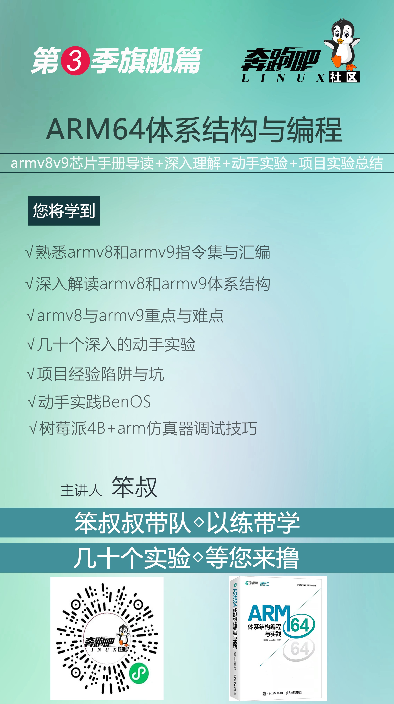
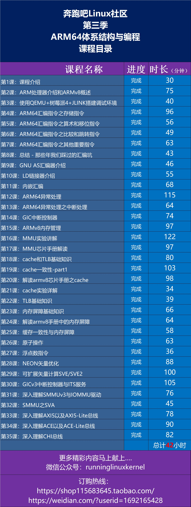
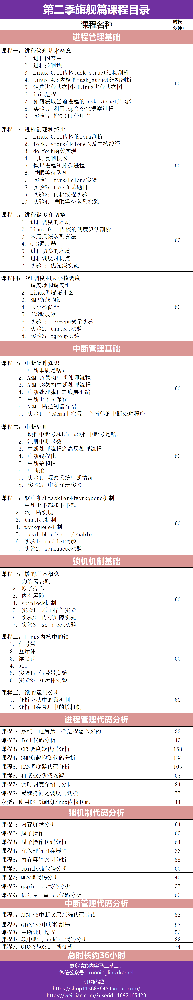

# 新書《ARM64體系結構：編程與實踐》

在芯片被卡脖子，國產芯片大發展的背景下，不瞭解和熟悉ARM64體系結構會被時代浪潮拋棄！

Arm China教育計劃推薦教材，全球首本ARMv8v9體系結構的新書《ARM64體系結構：編程與實踐》.

本書由奔跑吧 Linux 社區策劃，由國內眾多社區小夥伴和工程師採用
社區合作的方式共同完成，參與編寫本書的人有魏漢武、寇朝陽、王樂、王曉華、蔡琛、餘雲波、
牛立群、代祥軍、何花、徐國棟、徐彥飛、鄭律、張馨雨、 Xiao Guangrong、 Gavin Guo、 
Horry Zheng、 Cherry Chen、 Peter Chen、賈獻華等。

面對10000多頁晦澀難懂的英文ARMv8v9手冊，你是否感到無奈，無語，無聊，困惑，煩躁，寂寞，
頭皮發麻，不知所云。有這種感覺就對了！

這是全球首本使用 ***接地氣語言+動手實踐*** 的方式來給你講解ARMv8v9架構，解決你的無奈和寂寞。

# 實驗參考代碼說明

本實驗參考代碼是《ARM64體系結構：編程與實踐》一書的參考代碼，僅供讀者做實驗參考使用。

本參考代碼只提供 ***部分實驗的參考代碼*** ，剩餘部分實驗留給讀者獨立完成。

***關於每個實驗，我們在奔跑吧Linux社區的第三季視頻課程中有詳細的講解和分析。***     
有需要的讀者可以通過淘寶店或者微店進行訂閱。文字不如聲音，聲音不如視頻。視頻課程會比圖書講的更深入和詳細！

<<<<<<< HEAD
本倉庫的另外一個鏡像地址：
https://gitee.com/benshushu/arm64_programming_practice

=======
>>>>>>> d1a6a0b3b7568f8082c0475d82683492a013fa87
# 實驗平臺與實驗環境說明

本書的所有實驗都可以在如下任意一個實驗平臺上完成:    
1）樹莓派4B開發板 (需要讀者自行購買樹莓派4b開發板等配套硬件)  
2）使用定製版QEMU來模擬樹莓派4B (推薦使用我們提供的VMware/VirtualBox鏡像)   
讀者可以根據實際情況來選擇。

注意：本書部分實驗（例如第22和第23章的實驗）可以在基於QEMU+ARM64 Linux系統上實現，可以訪問如下倉庫：    
https://github.com/runninglinuxkernel/runninglinuxkernel_5.0

我們推薦使用我們提供的VMware/VirtualBox鏡像，下載方式：關注“奔跑吧Linux社區”微信公眾號，輸入“arm64”獲取下載地址。   
配置如下：
1. 主機硬件平臺：Intel x86_64處理器兼容主機。
2. 主機操作系統：Ubuntu Linux 20.04。
3. GCC版本：9.3（aarch64-linux-gnu-gcc）。
4. QEMU版本，定製版的QEMU。  

# 本書特色：
1. 講解最新的ARMv8和v9架構
2. 理論和實踐兼顧
3. 突出動手實踐，幾十個有趣和有深度實驗
4. 基於樹莓派4B和QEMU為實驗平臺
5. 總結常見陷阱與項目經驗

# 配套資料下載

1. QEMU實驗平臺 - VMware/VirtualBox鏡像
2. 實驗參考代碼
3. 免費&試看視頻
4. 本書涉及的芯片資料 (包括笨叔註釋版的ARMv8架構手冊)  

關注“奔跑吧Linux社區”微信公眾號，輸入“arm64”獲取下載地址。

# 視頻課程
配套視頻課程由奔跑吧Linux社區錄製完成。   
<<<<<<< HEAD
購買地址：     
https://shop115683645.taobao.com/   
https://weidian.com/?userid=1692165428   

1. 第3季課程海報

2. 第3季課程目錄

3. 第1季課程目錄

4. 第2季課程目錄

5. 線下佈道與培訓

奔跑吧Linux社區可以為廣大企業提供線下線上培訓與佈道，提供兩大部分的課程內容：
1. ARM64（ARMv8和v9架構）體系結構與編程  
2. RISC-V體系結構與編程  
3. Linux內核/驅動開發與調試  

講師：奔跑吧Linux社區金牌講師  
有興趣的可以聯繫：runninglinuxkernel@126.com    
或者微信號: runninglinuxkernel   
=======
https://item.taobao.com/item.htm?spm=a1z10.1-c.w4004-9669165673.6.21286ebf459Ryi&id=628756594037
https://weidian.com/?userid=1692165428

1. 第三季課程海報

2. 課程目錄

3. 線下佈道與培訓

奔跑吧Linux社區可以為廣大企業提供線下線上培訓與佈道，提供兩大部分的課程內容：
1. ARM64（ARMv8和v9架構）體系結構與編程  
2. Linux內核/驅動開發與調試  
講師：奔跑吧Linux社區金牌講師  
有興趣的可以聯繫：runninglinuxkernel@126.com, 或者微信號: runninglinuxkernel
>>>>>>> d1a6a0b3b7568f8082c0475d82683492a013fa87
