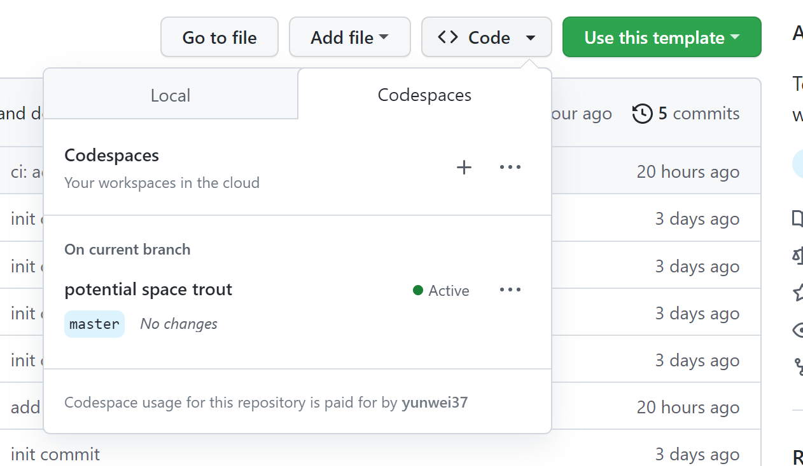
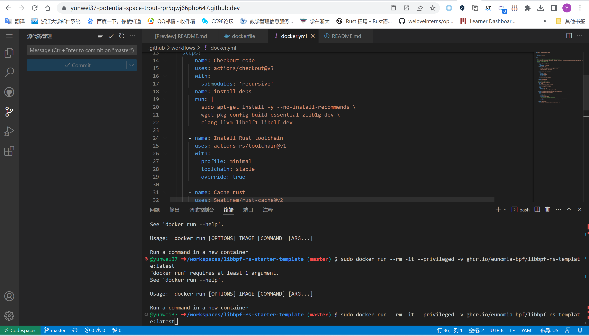
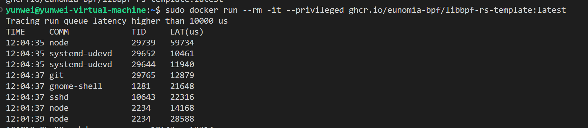
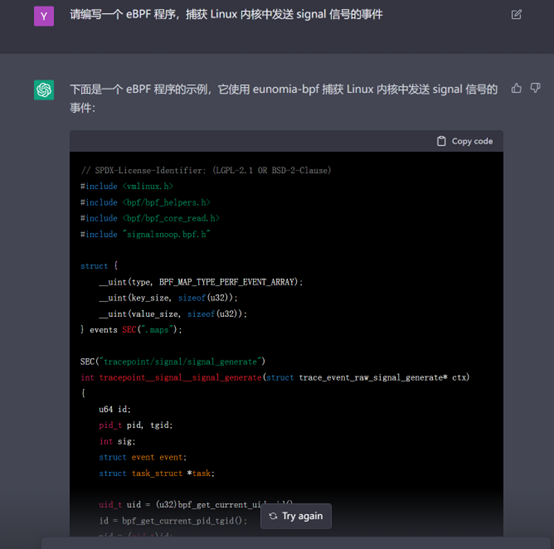

# eBPF 開發者教程與知識庫：eBPF Tutorial by Example

[](https://github.com/eunomia-bpf/bpf-developer-tutorial/actions/workflows/test-libbpf.yml)

[GitHub](https://github.com/eunomia-bpf/bpf-developer-tutorial)
[Gitee 鏡像](https://gitee.com/yunwei37/bpf-developer-tutorial)
[English Version](README_en.md)

#### [**Check out the English version here**](README.md)

這是一個基於 `CO-RE`（一次編譯，到處運行）的 eBPF 的開發教程，提供了從入門到進階的 eBPF 開發實踐，包括基本概念、代碼實例、實際應用等內容。和 BCC 不同的是，我們使用 libbpf、Cilium、libbpf-rs、eunomia-bpf 等框架進行開發，包含 C、Go、Rust 等語言的示例。

本教程不會進行復雜的概念講解和場景介紹，主要希望提供一些 eBPF 小工具的案例（**非常短小，從二十行代碼開始入門！**），來幫助 eBPF 應用的開發者快速上手 eBPF 的開發方法和技巧。教程內容可以在目錄中找到，每個目錄都是一個獨立的 eBPF 工具案例。

教程關注於可觀測性、網絡、安全等等方面的 eBPF 示例。

## 目錄

### 入門示例

這一部分包含簡單的 eBPF 程序示例和介紹。主要利用 `eunomia-bpf` 框架簡化開發，介紹 eBPF 的基本用法和開發流程。

- [lesson 0-introduce](src/0-introduce/README.zh.md) eBPF 示例教程 0：核心概念與工具簡介
- [lesson 1-helloworld](src/1-helloworld/README.zh.md) eBPF 入門開發實踐教程一：Hello World，基本框架和開發流程
- [lesson 2-kprobe-unlink](src/2-kprobe-unlink/README.zh.md) eBPF 入門開發實踐教程二：在 eBPF 中使用 kprobe 監測捕獲 unlink 系統調用
- [lesson 3-fentry-unlink](src/3-fentry-unlink/README.zh.md) eBPF 入門開發實踐教程三：在 eBPF 中使用 fentry 監測捕獲 unlink 系統調用
- [lesson 4-opensnoop](src/4-opensnoop/README.zh.md) eBPF 入門開發實踐教程四：在 eBPF 中捕獲進程打開文件的系統調用集合，使用全局變量過濾進程 pid
- [lesson 5-uprobe-bashreadline](src/5-uprobe-bashreadline/README.zh.md) eBPF 入門開發實踐教程五：在 eBPF 中使用  uprobe 捕獲 bash 的 readline 函數調用
- [lesson 6-sigsnoop](src/6-sigsnoop/README.zh.md) eBPF 入門開發實踐教程六：捕獲進程發送信號的系統調用集合，使用 hash map 保存狀態
- [lesson 7-execsnoop](src/7-execsnoop/README.zh.md) eBPF 入門實踐教程七：捕獲進程執行事件，通過 perf event array 向用戶態打印輸出
- [lesson 8-exitsnoop](src/8-exitsnoop/README.zh.md) eBPF 入門開發實踐教程八：在 eBPF 中使用 exitsnoop 監控進程退出事件，使用 ring buffer 向用戶態打印輸出
- [lesson 9-runqlat](src/9-runqlat/README.zh.md) eBPF 入門開發實踐教程九：捕獲進程調度延遲，以直方圖方式記錄
- [lesson 10-hardirqs](src/10-hardirqs/README.zh.md) eBPF 入門開發實踐教程十：在 eBPF 中使用 hardirqs 或 softirqs 捕獲中斷事件

### 高級文檔和示例

我們開始構建完整的 eBPF 項目，主要基於 `libbpf`，並將其與各種應用場景結合起來，以便實際使用。

- [lesson 11-bootstrap](src/11-bootstrap/README.zh.md) eBPF 入門開發實踐教程十一：在 eBPF 中使用 libbpf 開發用戶態程序並跟蹤 exec() 和 exit() 系統調用
- [lesson 12-profile](src/12-profile/README.zh.md) eBPF 入門實踐教程十二：使用 eBPF 程序 profile 進行性能分析
- [lesson 13-tcpconnlat](src/13-tcpconnlat/README.zh.md) eBPF入門開發實踐教程十三：統計 TCP 連接延時，並使用 libbpf 在用戶態處理數據
- [lesson 14-tcpstates](src/14-tcpstates/README.zh.md) eBPF入門實踐教程十四：記錄 TCP 連接狀態與 TCP RTT
- [lesson 15-javagc](src/15-javagc/README.zh.md) eBPF 入門實踐教程十五：使用 USDT 捕獲用戶態 Java GC 事件耗時
- [lesson 16-memleak](src/16-memleak/README.zh.md) eBPF 入門實踐教程十六：編寫 eBPF 程序 Memleak 監控內存洩漏
- [lesson 17-biopattern](src/17-biopattern/README.zh.md) eBPF 入門實踐教程十七：編寫 eBPF 程序統計隨機/順序磁盤 I/O
- [lesson 18-further-reading](src/18-further-reading/README.zh.md) 更多的參考資料：論文、項目等等
- [lesson 19-lsm-connect](src/19-lsm-connect/README.zh.md) eBPF 入門實踐教程：使用 LSM 進行安全檢測防禦
- [lesson 20-tc](src/20-tc/README.zh.md) eBPF 入門實踐教程二十：使用 eBPF 進行 tc 流量控制
- [lesson 21-xdp](src/21-xdp/README.zh.md) eBPF 入門實踐教程二十一： 使用 XDP 進行可編程數據包處理

### 深入主題

這一部分涵蓋了與 eBPF 相關的高級主題，包括在 Android 上使用 eBPF 程序、利用 eBPF 程序進行的潛在攻擊和防禦以及複雜的追蹤。結合用戶模式和內核模式的 eBPF 可以帶來強大的能力（也可能帶來安全風險）。

Android:

- [lesson 22-android](src/22-android/README.zh.md) 在 Android 上使用 eBPF 程序
網絡:

- [lesson 23-http](src/23-http/README.zh.md) 通過 eBPF socket filter 或 syscall trace 追蹤 HTTP 請求等七層協議 - eBPF 實踐教程
- [lesson 29-sockops](src/29-sockops/README.zh.md) eBPF 開發實踐：使用 sockops 加速網絡請求轉發
- [lesson 41-xdp-tcpdump](src/41-xdp-tcpdump/README.zh.md) eBPF 示例教程：使用 XDP 捕獲 TCP 信息
- [lesson 42-xdp-loadbalancer](src/42-xdp-loadbalancer/README.zh.md) eBPF 開發者教程： 簡單的 XDP 負載均衡器
安全:

- [lesson 24-hide](src/24-hide/README.zh.md) eBPF 開發實踐：使用 eBPF 隱藏進程或文件信息
- [lesson 25-signal](src/25-signal/README.zh.md) eBPF 入門實踐教程：用 bpf_send_signal 發送信號終止惡意進程
- [lesson 26-sudo](src/26-sudo/README.zh.md) 使用 eBPF 添加 sudo 用戶
- [lesson 27-replace](src/27-replace/README.zh.md) 使用 eBPF 替換任意程序讀取或寫入的文本
- [lesson 28-detach](src/28-detach/README.zh.md) 在應用程序退出後運行 eBPF 程序：eBPF 程序的生命週期
- [lesson 34-syscall](src/34-syscall/README.zh.md) eBPF 開發實踐：使用 eBPF 修改系統調用參數
調度器:

- [lesson 44-scx-simple](src/44-scx-simple/README.zh.md) None

GPU:

- [lesson 47-cuda-events](src/47-cuda-events/README.zh.md) 使用 eBPF 追蹤 CUDA 操作

其他:

- [lesson 35-user-ringbuf](src/35-user-ringbuf/README.zh.md) eBPF開發實踐：使用 user ring buffer 向內核異步發送信息
- [lesson 36-userspace-ebpf](src/36-userspace-ebpf/README.zh.md) 用戶空間 eBPF 運行時：深度解析與應用實踐
- [lesson 38-btf-uprobe](src/38-btf-uprobe/README.zh.md) 藉助 eBPF 和 BTF，讓用戶態也能一次編譯、到處運行
- [lesson 43-kfuncs](src/43-kfuncs/README.zh.md) 超越 eBPF 的極限：在內核模塊中定義自定義 kfunc

持續更新中...

## 為什麼要寫這個教程？

在學習 eBPF 的過程中，我們受到了 [bcc python developer tutorial](src/bcc-documents/tutorial_bcc_python_developer.md) 的許多啟發和幫助，但從當下的角度出發，使用 libbpf 開發 eBPF 的應用是目前相對更好的選擇。但目前似乎很少有基於 libbpf 和 BPF CO-RE 出發的、通過案例和工具介紹 eBPF 開發的教程，因此我們發起了這個項目，採用類似 bcc python developer tutorial 的組織方式，但使用 CO-RE 的 libbpf 進行開發。

本項目主要基於 [libbpf-boostrap](https://github.com/libbpf/libbpf-bootstrap) 和 [eunomia-bpf](https://github.com/eunomia-bpf/eunomia-bpf) 兩個框架完成，並使用 eunomia-bpf 幫助簡化一部分 libbpf eBPF 用戶態代碼的編寫，讓開發者專注於內核態的 eBPF 代碼的開發。

> - 我們還提供了一個使用 ChatGPT ，通過自然語言描述即可自動編寫 eBPF 程序和追蹤 Linux 系統的小工具，可以讓您交互式地學習 eBPF 程序：[GPTtrace](https://github.com/eunomia-bpf/GPTtrace)
> - 歡迎在本倉庫的 issue 或 discussion 中提出任意關於 eBPF 學習的疑惑和問題，或者實踐中遇到的 bug，我們會盡力幫助您解答！

## GitHub 模板：輕鬆構建 eBPF 項目和開發環境，一鍵在線編譯運行 eBPF 程序

面對創建一個 eBPF 項目，您是否對如何開始搭建環境以及選擇編程語言感到困惑？別擔心，我們為您準備了一系列 GitHub 模板，以便您快速啟動一個全新的eBPF項目。只需在GitHub上點擊 `Use this template` 按鈕，即可開始使用。

- <https://github.com/eunomia-bpf/libbpf-starter-template>：基於 C 語言和 libbpf 框架的eBPF 項目模板
- <https://github.com/eunomia-bpf/cilium-ebpf-starter-template>：基於 Go 語言和cilium/框架的的 eBPF 項目模板
- <https://github.com/eunomia-bpf/libbpf-rs-starter-template>：基於 Rust 語言和libbpf-rs 框架的 eBPF 項目模板
- <https://github.com/eunomia-bpf/eunomia-template>：基於 C 語言和 eunomia-bpf 框架的eBPF 項目模板

這些啟動模板包含以下功能：

- 一個 Makefile，讓您可以一鍵構建項目
- 一個 Dockerfile，用於為您的 eBPF 項目自動創建一個容器化環境併發布到 Github Packages
- GitHub Actions，用於自動化構建、測試和發佈流程
- eBPF 開發所需的所有依賴項

> 通過將現有倉庫設置為模板，您和其他人可以快速生成具有相同基礎結構的新倉庫，從而省去了手動創建和配置的繁瑣過程。藉助 GitHub 模板倉庫，開發者可以專注於項目的核心功能和邏輯，而無需為基礎設置和結構浪費時間。更多關於模板倉庫的信息，請參閱官方文檔：<https://docs.github.com/en/repositories/creating-and-managing-repositories/creating-a-template-repository>

當您使用上述 eBPF 項目模板中的一個創建了一個新倉庫時，您可以使用 GitHub Codespaces 輕鬆地設置和啟動一個在線開發環境。以下是使用 GitHub Codespaces 編譯和運行 eBPF 程序的步驟：

1. 點擊您的新倉庫中的 Code 按鈕，然後選擇 Open with Codespaces 選項：

    

2. GitHub 將為您創建一個新的 Codespace，這可能需要幾分鐘的時間，具體取決於您的網絡速度和倉庫的大小。
3. 一旦您的 Codespace 啟動並準備好使用，您可以打開終端並導航到您的項目目錄中。
4. 可以按照對應的倉庫中的介紹來編譯和運行 eBPF 程序:

    

使用 Codespaces，您可以輕鬆地創建、管理和共享雲端開發環境，從而將您的開發過程加速並使其更具可靠性。您可以在任何地方、任何設備上使用 Codespaces 進行開發，只需要一個具有 Web 瀏覽器的計算機即可。同時，GitHub Codespaces 還支持預先配置好的環境、自定義開發容器和可定製化的開發體驗等功能，以滿足您的開發需求。

在 codespace 編寫代碼，提交後，Github Actions 會進行編譯並自動發佈容器鏡像。接下來，你可以在任何地方使用 docker 一鍵運行這個 eBPF 程序，例如：

```console
$ sudo docker run --rm -it --privileged ghcr.io/eunomia-bpf/libbpf-rs-template:latest
[sudo] password for xxx: 
Tracing run queue latency higher than 10000 us
TIME     COMM             TID     LAT(us)       
12:09:19 systemd-udevd    30786   18300         
12:09:19 systemd-udevd    30796   21941         
12:09:19 systemd-udevd    30793   10323         
12:09:19 systemd-udevd    30795   14827         
12:09:19 systemd-udevd    30790   17973         
12:09:19 systemd-udevd    30793   12328         
12:09:19 systemd-udevd    30796   28721
```



## 本地編譯

本地編譯示例如下所示：

```shell
git clone https://github.com/eunomia-bpf/bpf-developer-tutorial.git
cd bpf-developer-tutorial
git submodule update --init --recursive # 同步 submodule 子模塊
cd src/24-hide
make
```

## 為什麼需要基於 libbpf 和 BPF CO-RE 的教程？

> 歷史上，當需要開發一個BPF應用時可以選擇BCC 框架，在實現各種用於Tracepoints的BPF程序時需要將BPF程序加載到內核中。BCC提供了內置的Clang編譯器，可以在運行時編譯BPF代碼，並將其定製為符合特定主機內核的程序。這是在不斷變化的內核內部下開發可維護的BPF應用程序的唯一方法。在BPF的可移植性和CO-RE一文中詳細介紹了為什麼會這樣，以及為什麼BCC是之前唯一的可行方式，此外還解釋了為什麼 libbpf 是目前比較好的選擇。去年，Libbpf的功能和複雜性得到了重大提升，消除了與BCC之間的很多差異(特別是對Tracepoints應用來說)，並增加了很多BCC不支持的新的且強大的特性(如全局變量和BPF skeletons)。
>
> 誠然，BCC會竭盡全力簡化BPF開發人員的工作，但有時在獲取便利性的同時也增加了問題定位和修復的困難度。用戶必須記住其命名規範以及自動生成的用於Tracepoints的結構體，且必須依賴這些代碼的重寫來讀取內核數據和獲取kprobe參數。當使用BPF map時，需要編寫一個半面向對象的C代碼，這與內核中發生的情況並不完全匹配。除此之外，BCC使得用戶在用戶空間編寫了大量樣板代碼，且需要手動配置最瑣碎的部分。
>
> 如上所述，BCC依賴運行時編譯，且本身嵌入了龐大的LLVM/Clang庫，由於這些原因，BCC與理想的使用有一定差距：
>
> - 編譯時的高資源利用率(內存和CPU)，在繁忙的服務器上時有可能干擾主流程。
> - 依賴內核頭文件包，不得不在每臺目標主機上進行安裝。即使這樣，如果需要某些沒有通過公共頭文件暴露的內核內容時，需要將類型定義拷貝黏貼到BPF代碼中，通過這種方式達成目的。
> - 即使是很小的編譯時錯誤也只能在運行時被檢測到，之後不得不重新編譯並重啟用戶層的應用；這大大影響了開發的迭代時間(並增加了挫敗感...)
>
> Libbpf + BPF CO-RE (Compile Once – Run Everywhere) 選擇了一個不同的方式，其思想在於將BPF程序視為一個普通的用戶空間的程序：僅需要將其編譯成一些小的二進制，然後不用經過修改就可以部署到目的主機上。libbpf扮演了BPF程序的加載器，負責配置工作(重定位，加載和校驗BPF程序，創建BPF maps，附加到BPF鉤子上等)，開發者僅需要關注BPF程序的正確性和性能即可。這種方式使得開銷降到了最低，消除了大量依賴，提升了整體開發者的開發體驗。
>
> 在API和代碼約定方面，libbpf堅持"最少意外"的哲學，即大部分內容都需要明確地闡述：不會隱含任何頭文件，也不會重寫代碼。僅使用簡單的C代碼和適當的輔助宏即可消除大部分單調的環節。 此外，用戶編寫的是需要執行的內容，BPF應用程序的結構是一對一的，最終由內核驗證並執行。
>
> 參考：[BCC 到libbpf 的轉換指南【譯】 - 深入淺出eBPF: https://www.ebpf.top/post/bcc-to-libbpf-guid/](https://www.ebpf.top/post/bcc-to-libbpf-guid/)

## eunomia-bpf

[eunomia-bpf](https://github.com/eunomia-bpf/eunomia-bpf) 是一個開源的 eBPF 動態加載運行時和開發工具鏈，是為了簡化 eBPF 程序的開發、構建、分發、運行而設計的，基於 libbpf 的 CO-RE 輕量級開發框架。

使用 eunomia-bpf ，可以：

- 在編寫 eBPF 程序或工具時只編寫 libbpf 內核態代碼，自動獲取內核態導出信息；
- 使用 Wasm 進行 eBPF 用戶態程序的開發，在 WASM 虛擬機內部控制整個 eBPF 程序的加載和執行，以及處理相關數據；
- eunomia-bpf 可以將預編譯的 eBPF 程序打包為通用的 JSON 或 WASM 模塊，跨架構和內核版本進行分發，無需重新編譯即可動態加載運行。

eunomia-bpf 由一個編譯工具鏈和一個運行時庫組成, 對比傳統的 BCC、原生 libbpf 等框架，簡化了 eBPF 程序的開發流程，在大多數時候只需編寫內核態代碼，即可輕鬆構建、打包、發佈完整的 eBPF 應用，同時保證內核態 eBPF 代碼和主流的 libbpf, libbpfgo, libbpf-rs 等開發框架的兼容性。需要編寫用戶態代碼的時候，也可以藉助 Webassembly 實現通過多種語言進行用戶態開發。和 bpftrace 等腳本工具相比, eunomia-bpf 保留了類似的便捷性, 同時不僅侷限於 trace 方面, 可以用於更多的場景, 如網絡、安全等等。

> - eunomia-bpf 項目 Github 地址: <https://github.com/eunomia-bpf/eunomia-bpf>
> - gitee 鏡像: <https://gitee.com/anolis/eunomia>

## 讓 ChatGPT 來幫助我們

本教程也嘗試藉助 ChatGPT 來學習編寫 eBPF 程序，同時我們嘗試教會 ChatGPT 編寫 eBPF 程序，大概步驟如下：

1. 告訴它基本的 eBPF 編程相關的常識
2. 告訴它一些案例：hello world，eBPF 程序的基本結構，如何使用 eBPF 程序進行追蹤，並且讓它開始編寫教程
3. 手動調整教程，並糾正代碼和文檔中的錯誤
4. 把修改後的代碼再餵給 ChatGPT，讓它繼續學習
5. 嘗試讓 ChatGPT 自動生成 eBPF 程序和對應的教程文檔！例如



完整的對話記錄可以在這裡找到: [ChatGPT.md](src/ChatGPT.md)

我們也構建了一個命令行工具的 demo ，通過本教程的訓練， 讓它通過自然語言描述即可自動編寫 eBPF 程序，追蹤 Linux 系統：<https://github.com/eunomia-bpf/GPTtrace>


