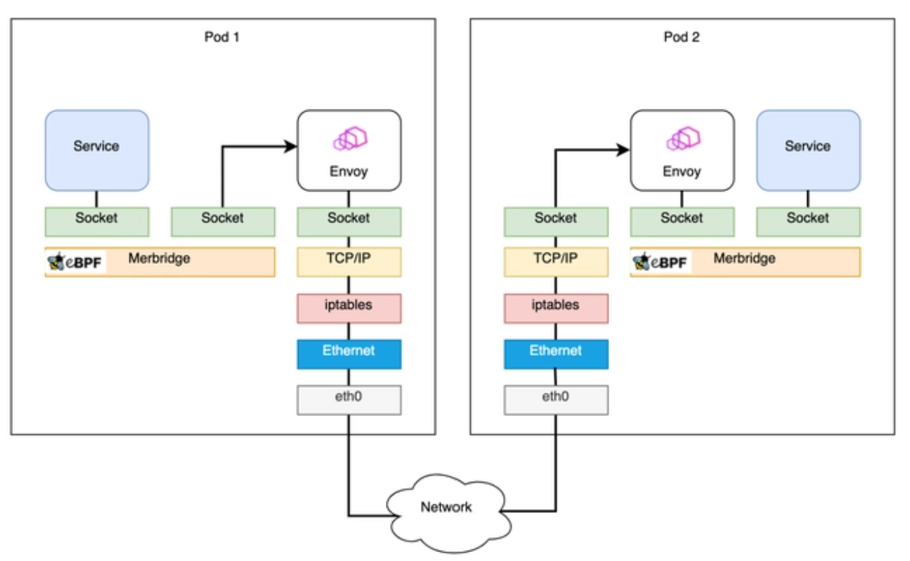

# eBPF 開發實踐：使用 sockops 加速網絡請求轉發

eBPF（擴展的伯克利數據包過濾器）是 Linux 內核中的一個強大功能，可以在無需更改內核源代碼或重啟內核的情況下，運行、加載和更新用戶定義的代碼。這種功能讓 eBPF 在網絡和系統性能分析、數據包過濾、安全策略等方面有了廣泛的應用。

本教程將關注 eBPF 在網絡領域的應用，特別是如何使用 sockops 類型的 eBPF 程序來加速本地網絡請求的轉發。這種應用通常在使用軟件負載均衡器進行請求轉發的場景中很有價值，比如使用 Nginx 或 HAProxy 之類的工具。

在許多工作負載中，如微服務架構下的服務間通信，通過本機進行的網絡請求的性能開銷可能會對整個應用的性能產生顯著影響。由於這些請求必須經過本機的網絡棧，其處理性能可能會成為瓶頸，尤其是在高併發的場景下。為了解決這個問題，sockops 類型的 eBPF 程序可以用於加速本地的請求轉發。sockops 程序可以在內核空間管理套接字，實現在本機上的套接字之間直接轉發數據包，從而降低了在 TCP/IP 棧中進行數據包轉發所需的 CPU 時間。

本教程將會通過一個具體的示例演示如何使用 sockops 類型的 eBPF 程序來加速網絡請求的轉發。為了讓你更好地理解如何使用 sockops 程序，我們將逐步介紹示例程序的代碼，並討論每個部分的工作原理。完整的源代碼和工程可以在 <https://github.com/eunomia-bpf/bpf-developer-tutorial/tree/main/src/29-sockops> 中找到。

## 利用 eBPF 的 sockops 進行性能優化

網絡連接本質上是 socket 之間的通訊，eBPF 提供了一個 [bpf_msg_redirect_hash](https://man7.org/linux/man-pages/man7/bpf-helpers.7.html) 函數，用來將應用發出的包直接轉發到對端的 socket，可以極大地加速包在內核中的處理流程。

這裡 sock_map 是記錄 socket 規則的關鍵部分，即根據當前的數據包信息，從 sock_map 中挑選一個存在的 socket 連接來轉發請求。所以需要先在 sockops 的 hook 處或者其它地方，將 socket 信息保存到 sock_map，並提供一個規則 (一般為四元組) 根據 key 查找到 socket。

Merbridge 項目就是這樣實現了用 eBPF 代替 iptables 為 Istio 進行加速。在使用 Merbridge (eBPF) 優化之後，出入口流量會直接跳過很多內核模塊，明顯提高性能，如下圖所示：



## 示例程序

此示例程序從發送者的套接字（出口）重定向流量至接收者的套接字（入口），**跳過 TCP/IP 內核網絡棧**。在這個示例中，我們假定發送者和接收者都在**同一臺**機器上運行。這個示例程序有兩個部分，它們共享一個 map 定義：

bpf_sockmap.h

```c
#include "vmlinux.h"
#include <bpf/bpf_endian.h>
#include <bpf/bpf_helpers.h>

#define LOCALHOST_IPV4 16777343

struct sock_key {
    __u32 sip;
    __u32 dip;
    __u32 sport;
    __u32 dport;
    __u32 family;
};

struct {
 __uint(type, BPF_MAP_TYPE_SOCKHASH);
 __uint(max_entries, 65535);
 __type(key, struct sock_key);
 __type(value, int);
} sock_ops_map SEC(".maps");
```

這個示例程序中的 BPF 程序被分為兩個部分 `bpf_redirect.bpf.c` 和 `bpf_contrack.bpf.c`。

- `bpf_contrack.bpf.c` 中的 BPF 代碼定義了一個套接字操作（`sockops`）程序，它的功能主要是當本機（使用 localhost）上的任意 TCP 連接被創建時，根據這個新連接的五元組（源地址，目標地址，源端口，目標端口，協議），在 `sock_ops_map` 這個 BPF MAP 中創建一個條目。這個 BPF MAP 被定義為 `BPF_MAP_TYPE_SOCKHASH` 類型，可以存儲套接字和對應的五元組。這樣使得每當本地 TCP 連接被創建的時候，這個連接的五元組信息也能夠在 BPF MAP 中找到。

- `bpf_redirect.bpf.c` 中的 BPF 代碼定義了一個網絡消息 (sk_msg) 處理程序，當本地套接字上有消息到達時會調用這個程序。然後這個 sk_msg 程序檢查該消息是否來自本地地址，如果是，根據獲取的五元組信息（源地址，目標地址，源端口，目標端口，協議）在 `sock_ops_map` 查找相應的套接字，並將該消息重定向到在 `sock_ops_map` 中找到的套接字上，這樣就實現了繞過內核網絡棧。

舉個例子，我們假設有兩個進程在本地運行，進程 A 綁定在 8000 端口上，進程 B 綁定在 9000 端口上，進程 A 向進程 B 發送消息。

1. 當進程 A 首次和進程 B 建立 TCP 連接時，觸發 `bpf_contrack.bpf.c` 中的 `sockops` 程序，這個程序將五元組 `{127.0.0.1, 127.0.0.1, 8000, 9000, TCP}` 存入 `sock_ops_map`，值為進程 A 的套接字。

2. 當進程 A 發送消息時，觸發 `bpf_redirect.bpf.c` 中的 `sk_msg` 程序，然後 `sk_msg` 程序將消息從進程 A 的套接字重定向到 `sock_ops_map` 中存儲的套接字（進程 A 的套接字）上，因此，消息被直接從進程 A 輸送到進程 B，繞過了內核網絡棧。

這個示例程序就是通過 BPF 實現了在本地通信時，快速將消息從發送者的套接字重定向到接收者的套接字，從而繞過了內核網絡棧，以提高傳輸效率。

bpf_redirect.bpf.c

```c
#include "bpf_sockmap.h"

char LICENSE[] SEC("license") = "Dual BSD/GPL";

SEC("sk_msg")
int bpf_redir(struct sk_msg_md *msg)
{
    if(msg->remote_ip4 != LOCALHOST_IPV4 || msg->local_ip4!= LOCALHOST_IPV4) 
        return SK_PASS;
    
    struct sock_key key = {
        .sip = msg->remote_ip4,
        .dip = msg->local_ip4,
        .dport = bpf_htonl(msg->local_port), /* convert to network byte order */
        .sport = msg->remote_port,
        .family = msg->family,
    };
    return bpf_msg_redirect_hash(msg, &sock_ops_map, &key, BPF_F_INGRESS);
}
```

bpf_contrack.bpf.c

```c
#include "bpf_sockmap.h"

char LICENSE[] SEC("license") = "Dual BSD/GPL";

SEC("sockops")
int bpf_sockops_handler(struct bpf_sock_ops *skops){
    u32 family, op;

 family = skops->family;
 op = skops->op;
 if (op != BPF_SOCK_OPS_PASSIVE_ESTABLISHED_CB
        && op != BPF_SOCK_OPS_ACTIVE_ESTABLISHED_CB) {
        return BPF_OK;
    }

    if(skops->remote_ip4 != LOCALHOST_IPV4 || skops->local_ip4!= LOCALHOST_IPV4) {
        return BPF_OK;
    }

 struct sock_key key = {
        .dip = skops->remote_ip4,
        .sip = skops->local_ip4,
        .sport = bpf_htonl(skops->local_port),  /* convert to network byte order */
        .dport = skops->remote_port,
        .family = skops->family,
    };

 bpf_printk(">>> new connection: OP:%d, PORT:%d --> %d\n", op, bpf_ntohl(key.sport), bpf_ntohl(key.dport));

 bpf_sock_hash_update(skops, &sock_ops_map, &key, BPF_NOEXIST);
    return BPF_OK;
}
```

### 編譯 eBPF 程序

這裡我們使用 libbpf 編譯這個 eBPF 程序。完整的源代碼和工程可以在 <https://github.com/eunomia-bpf/bpf-developer-tutorial/tree/main/src/29-sockops> 中找到。關於如何安裝依賴，請參考：<https://eunomia.dev/tutorials/11-bootstrap/>

```shell
# Compile the bpf program with libbpf
make
```

### 加載 eBPF 程序

我們編寫了一個腳本來加載 eBPF 程序，它會自動加載兩個 eBPF 程序並創建一個 BPF MAP：

```shell
sudo ./load.sh
```

這個腳本實際上完成了這些操作：

```sh
#!/bin/bash
set -x
set -e

sudo mount -t bpf bpf /sys/fs/bpf/

# check if old program already loaded
if [ -e "/sys/fs/bpf/bpf_sockops" ]; then
    echo ">>> bpf_sockops already loaded, uninstalling..."
    ./unload.sh
    echo ">>> old program already deleted..."
fi

# load and attach sock_ops program
sudo bpftool prog load bpf_contrack.bpf.o /sys/fs/bpf/bpf_sockops type sockops pinmaps /sys/fs/bpf/
sudo bpftool cgroup attach "/sys/fs/cgroup/" sock_ops pinned "/sys/fs/bpf/bpf_sockops"

# load and attach sk_msg program 
sudo bpftool prog load bpf_redirect.bpf.o "/sys/fs/bpf/bpf_redir" map name sock_ops_map pinned "/sys/fs/bpf/sock_ops_map"
sudo bpftool prog attach pinned /sys/fs/bpf/bpf_redir msg_verdict pinned /sys/fs/bpf/sock_ops_map
```

這是一個 BPF 的加載腳本。它的主要功能是加載和附加 BPF 程序到內核系統中，並將關聯的 BPF map 一併存儲（pin）到 BPF 文件系統中，以便 BPF 程序能訪問和操作這些 map。

讓我們詳細地看一下腳本的每一行是做什麼的。

1. `sudo mount -t bpf bpf /sys/fs/bpf/` 這一行用於掛載 BPF 文件系統，使得 BPF 程序和相關的 map 可以被系統訪問和操作。
2. 判斷條件 `[ -e "/sys/fs/bpf/bpf_sockops" ]` 是檢查是否已經存在 `/sys/fs/bpf/bpf_sockops` 文件，如果存在，則說明 `bpf_sockops` 程序已經被加載到系統中，那麼將會通過 `./unload.sh` 腳本將其卸載。
3. `sudo bpftool prog load bpf_contrack.bpf.o /sys/fs/bpf/bpf_sockops type sockops pinmaps /sys/fs/bpf/` 這一行是加載上文中 `bpf_contrack.bpf.c` 編譯得到的 BPF 對象文件 `bpf_contrack.bpf.o` 到 BPF 文件系統中，存儲至 `/sys/fs/bpf/bpf_sockops`，並且指定它的類型為 `sockops`。`pinmaps /sys/fs/bpf/` 是指定將加載的 BPF 程序相關的 map 存儲在 `/sys/fs/bpf/` 下。
4. `sudo bpftool cgroup attach "/sys/fs/cgroup/" sock_ops pinned "/sys/fs/bpf/bpf_sockops"` 這一行是將已經加載到 BPF 文件系統的 `bpf_sockops` 程序附加到 cgroup（此路徑為"/sys/fs/cgroup/"）。附加後，所有屬於這個 cgroup 的套接字操作都會受到 `bpf_sockops` 的影響。
5. `sudo bpftool prog load bpf_redirect.bpf.o "/sys/fs/bpf/bpf_redir" map name sock_ops_map pinned "/sys/fs/bpf/sock_ops_map"` 這一行是加載 `bpf_redirect.bpf.c` 編譯得到的 BPF 對象文件 `bpf_redirect.bpf.o` 到 BPF 文件系統中，存儲至 `/sys/fs/bpf/bpf_redir` ，並且指定它的相關 map為 `sock_ops_map`，這個map在 `/sys/fs/bpf/sock_ops_map` 中。
6. `sudo bpftool prog attach pinned /sys/fs/bpf/bpf_redir msg_verdict pinned /sys/fs/bpf/sock_ops_map` 這一行是將已經加載的 `bpf_redir` 附加到 `sock_ops_map` 上，附加方式為 `msg_verdict`，表示當該 map 對應的套接字收到消息時，將會調用 `bpf_redir` 程序處理。

綜上，此腳本的主要作用就是將兩個用於處理本地套接字流量的 BPF 程序分別加載到系統並附加到正確的位置，以便它們能被正確地調用，並且確保它們可以訪問和操作相關的 BPF map。

您可以使用 [bpftool utility](https://github.com/torvalds/linux/blob/master/tools/bpf/bpftool/Documentation/bpftool-prog.rst) 檢查這兩個 eBPF 程序是否已經加載。

```console
$ sudo bpftool prog show
63: sock_ops  name bpf_sockops_handler  tag 275467be1d69253d  gpl
 loaded_at 2019-01-24T13:07:17+0200  uid 0
 xlated 1232B  jited 750B  memlock 4096B  map_ids 58
64: sk_msg  name bpf_redir  tag bc78074aa9dd96f4  gpl
 loaded_at 2019-01-24T13:07:17+0200  uid 0
 xlated 304B  jited 233B  memlock 4096B  map_ids 58
```

### 使用 iperf3 或 curl 進行測試

運行 [iperf3](https://iperf.fr/) 服務器

```shell
iperf3 -s -p 5001
```

運行 [iperf3](https://iperf.fr/) 客戶端

```shell
iperf3 -c 127.0.0.1 -t 10 -l 64k -p 5001
```

或者也可以用 Python 和 curl 進行測試：

```sh
python3 -m http.server
curl http://0.0.0.0:8000/
```

### 收集追蹤

查看``sock_ops``追蹤本地連接建立

```console
$ ./trace_bpf_output.sh # 實際上就是 sudo cat /sys/kernel/debug/tracing/trace_pipe
iperf3-9516  [001] .... 22500.634108: 0: <<< ipv4 op = 4, port 18583 --> 4135
iperf3-9516  [001] ..s1 22500.634137: 0: <<< ipv4 op = 5, port 4135 --> 18583
iperf3-9516  [001] .... 22500.634523: 0: <<< ipv4 op = 4, port 19095 --> 4135
iperf3-9516  [001] ..s1 22500.634536: 0: <<< ipv4 op = 5, port 4135 --> 19095
```

當iperf3 -c建立連接後，你應該可以看到上述用於套接字建立的事件。如果你沒有看到任何事件，那麼 eBPF 程序可能沒有正確地附加上。

此外，當``sk_msg``生效後，可以發現當使用 tcpdump 捕捉本地lo設備流量時，只能捕獲三次握手和四次揮手流量，而iperf數據流量沒有被捕獲到。如果捕獲到iperf數據流量，那麼 eBPF 程序可能沒有正確地附加上。

```console
$ ./trace_lo_traffic.sh # tcpdump -i lo port 5001

# 三次握手
13:24:07.181804 IP localhost.46506 > localhost.5001: Flags [S], seq 620239881, win 65495, options [mss 65495,sackOK,TS val 1982813394 ecr 0,nop,wscale 7], length 0
13:24:07.181815 IP localhost.5001 > localhost.46506: Flags [S.], seq 1084484879, ack 620239882, win 65483, options [mss 65495,sackOK,TS val 1982813394 ecr 1982813394,nop,wscale 7], length 0
13:24:07.181832 IP localhost.46506 > localhost.5001: Flags [.], ack 1, win 512, options [nop,nop,TS val 1982813394 ecr 1982813394], length 0

# 四次揮手
13:24:12.475649 IP localhost.46506 > localhost.5001: Flags [F.], seq 1, ack 1, win 512, options [nop,nop,TS val 1982818688 ecr 1982813394], length 0
13:24:12.479621 IP localhost.5001 > localhost.46506: Flags [.], ack 2, win 512, options [nop,nop,TS val 1982818692 ecr 1982818688], length 0
13:24:12.481265 IP localhost.5001 > localhost.46506: Flags [F.], seq 1, ack 2, win 512, options [nop,nop,TS val 1982818694 ecr 1982818688], length 0
13:24:12.481270 IP localhost.46506 > localhost.5001: Flags [.], ack 2, win 512, options [nop,nop,TS val 1982818694 ecr 1982818694], length 0
```

### 卸載 eBPF 程序

```shell
sudo ./unload.sh
```

## 參考資料

最後，如果您對 eBPF 技術感興趣，並希望進一步瞭解和實踐，可以訪問我們的教程代碼倉庫 <https://github.com/eunomia-bpf/bpf-developer-tutorial> 和教程網站 <https://eunomia.dev/zh/tutorials/>

- <https://github.com/zachidan/ebpf-sockops>
- <https://github.com/merbridge/merbridge>

> 原文地址：<https://eunomia.dev/zh/tutorials/29-sockops/> 轉載請註明出處。
