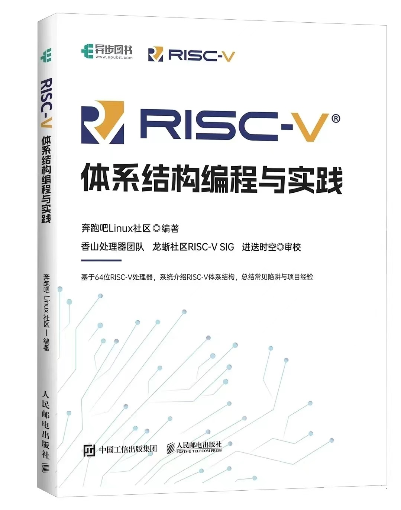
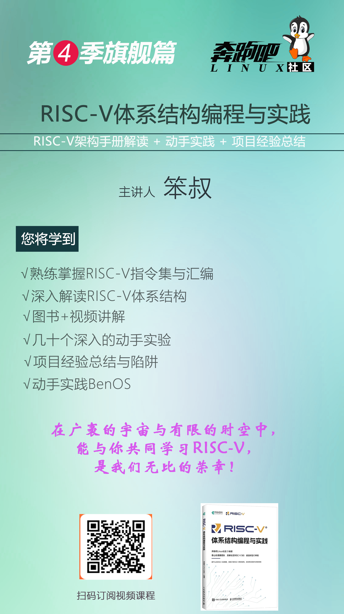
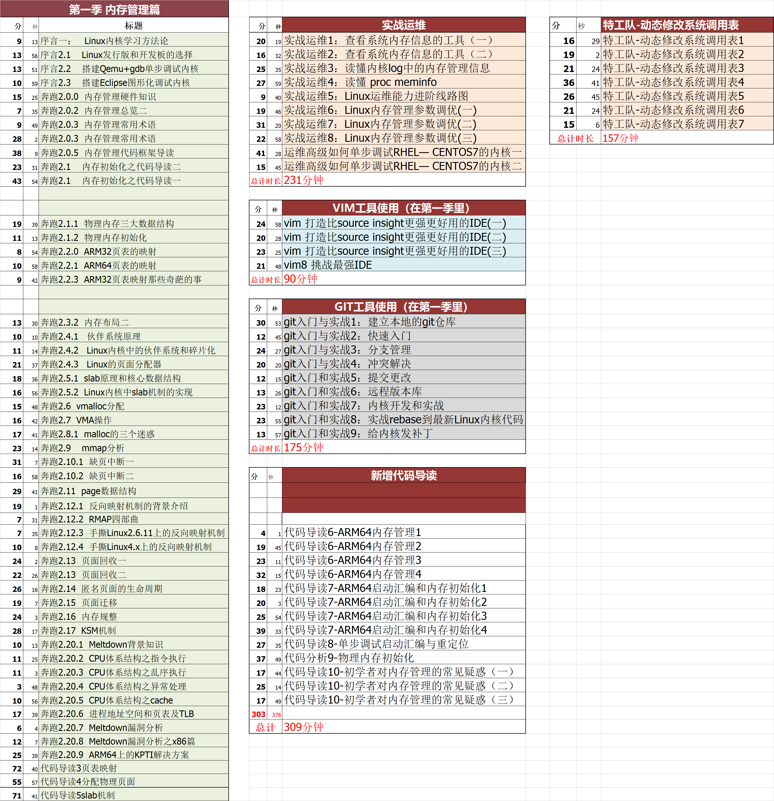
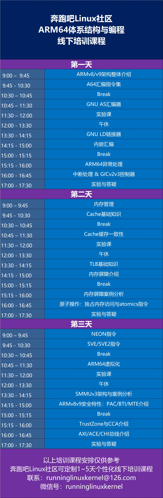

# 新書《RISC-V體系結構：編程與實踐》

本repo是《RISC-V體系結構編程與實踐》一書的配套實驗參考代碼和勘誤。    
1. master分支：是本書默認的實驗參考代碼，基於QEMU和NEMU。     
2. DongShanPI_D1分支：基於[DongShangPI D1s開發板](https://item.taobao.com/item.htm?&id=695941169493)驗證過的實驗參考代碼，由韋東山團隊提供技術支持。    

圖書購買地址: https://item.jd.com/13629613.html

訂閱視頻課程，請用微信掃描下面二維碼。     

# 本書特色：
1. 講解最新的RISC-V架構
2. 理論和實踐兼顧
3. 突出動手實踐，幾十個有趣和有深度實驗
4. 基於QEMU/NEMU/spike為實驗平臺
5. 總結常見陷阱與項目經驗

# 實驗參考代碼說明

實驗參考代碼僅供讀者做實驗參考使用。

本倉庫的另外一個鏡像地址：    
https://gitee.com/benshushu/riscv_programming_practice    
https://github.com/runninglinuxkernel/riscv_programming_practice   

# 實驗平臺與實驗環境說明

本書所有配套實驗默認採用如下兩個免費的模擬器：      
1）QEMU   
2）香山模擬器NEMU     

我們推薦使用我們提供的VMware/VirtualBox鏡像，下載方式：關注“奔跑吧Linux社區”微信公眾號，輸入“risc-v”獲取下載地址。   
配置如下：
1. 主機硬件平臺：Intel x86_64處理器兼容主機。
2. 主機操作系統：Ubuntu Linux 20.04。
3. GCC版本：9.3（riscv64-linux-gnu-gcc）。
4. QEMU版本：4.2.1

# RISC-V視頻課程

我們根據本書的目錄製作了視頻課程，為讀者提供 **圖書 + 視頻課程 + 實驗** 的多維度的教學體驗。訂閱視頻課程，請用微信掃描下面二維碼。

#  RISC-V原生筆記本
如果讀者想體驗RISC-V原生筆記本，可以購買全球首款RISC-V筆記本ROMA，內置4核高性能處理器，採用12nm/28nm封裝，支持GPU，NPU等加速功能, 支持多款流行的Linux發行版。

[瞭解ROMA筆記本](https://deepcomputing.io/roma-first-native-riscv-laptop/)

# 開發板
讀者如果想購買與本書實驗適配的開發板，推薦韋東山團隊製作的DongShanPI D1s開發板。 

[DongShanPI D1s + RISC-V圖書套餐 購買鏈接](https://item.taobao.com/item.htm?&id=695941169493)

本repo中的DongShanPI_D1分支是由韋東山團隊提供的，基於D1開發板適配本書的實驗參考代碼。(開發板相關問題請諮詢[百問網科技](https://www.100ask.net/))。   

# 目錄
第1章 RISC-V介紹  
第2章 搭建實驗環境    
第3章 RISC-V基礎指令集   
第4章 過程調用與棧   
第5章 GNU彙編器   
第6章 鏈接器   
第7章 GCC內嵌彙編   
第8章 異常處理   
第9章 中斷處理   
第10章 內存管理   
第11章 高速緩存基礎知識   
第12章 緩存一致性    
第13章 TLB管理    
第14章 原子操作    
第15章 內存屏障   
第16章 高速緩存與內存屏障   
第17章 操作系統相關話題     
第18章 可伸縮矢量計算RVV    
第19章 壓縮指令擴展     
第20章 虛擬化  

# 其他參考書

《Arm64體系結構編程與實踐》一書已經於2022年4月在人郵出版社出版，有興趣的小夥伴可以先閱讀此書。  

資料下載： 關注“奔跑吧linux社區”微信公眾號，輸入“arm64”領取。

https://github.com/runninglinuxkernel/arm64_programming_practice

# 其他視頻課程
配套視頻課程由奔跑吧Linux社區錄製完成。   
購買地址：     
1. 用微信掃描下面二維碼，進入“奔跑吧Linux社區”店鋪。    
      

2. 淘寶店鋪： https://shop115683645.taobao.com/   
3. 微店：https://weidian.com/?userid=1692165428   

1. 第3季課程海報

2. 第3季課程目錄

3. 第1季課程目錄

4. 第2季課程目錄

5. 線下佈道與培訓

奔跑吧Linux社區可以為廣大企業提供線下線上培訓與佈道，提供兩大部分的課程內容：
1. ARM64（ARMv8和v9架構）體系結構與編程  
2. RISC-V體系結構與編程  
3. Linux內核/驅動開發與調試  

講師：奔跑吧Linux社區金牌講師  
有興趣的可以聯繫：runninglinuxkernel@126.com    
或者微信號: runninglinuxkernel   
