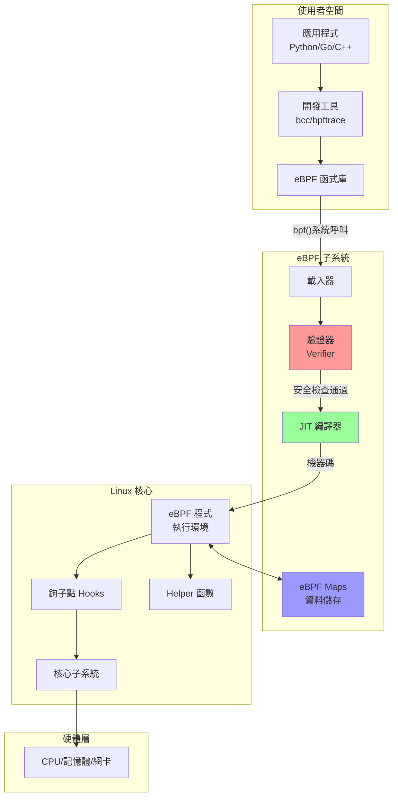
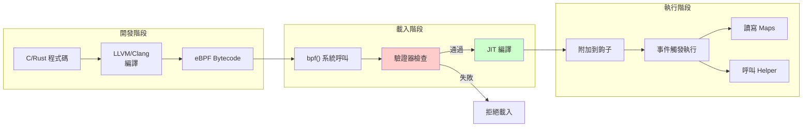
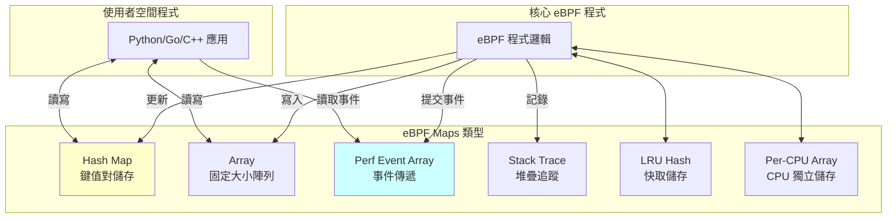

# eBPF 完整指南

## 目錄
- [什麼是 eBPF？](#什麼是-ebpf)
- [核心概念](#核心概念)
- [架構組件](#架構組件)
- [開發工具鏈](#開發工具鏈)
- [安全機制](#安全機制)
- [為什麼使用 eBPF？](#為什麼使用-ebpf)

## 什麼是 eBPF？

**eBPF (extended Berkeley Packet Filter)** 是一項革命性的技術，起源於 Linux 核心，它可以在特權上下文中（如作業系統核心）運行沙盒程序。

### 核心特點
- 🔒 **安全執行**：在核心中安全運行沙盒程序
- ⚡ **高效能**：通過 JIT 編譯達到原生程式碼效能  
- 🔧 **可擴展**：無需修改核心原始碼或載入核心模組
- 🎯 **事件驅動**：基於系統事件觸發執行

### eBPF vs BPF
- **BPF**：Berkeley Packet Filter - 原始的封包過濾器
- **eBPF**：extended BPF - 功能已遠超封包過濾
- **cBPF**：classic BPF - 用於區分原始 BPF

> 🐝 **eBee**：eBPF 的官方吉祥物，由 Vadim Shchekoldin 設計

## 核心概念

### 1. 系統架構圖

### 2. 鉤子點 (Hooks)

eBPF 程序可以附加到多種鉤子點：

| 鉤子類型 | 用途 | 觸發時機 |
|---------|------|----------|
| **系統呼叫** | 監控系統呼叫 | 進程呼叫系統 API 時 |
| **Kprobes** | 核心函數探針 | 核心函數執行時 |
| **Uprobes** | 使用者程式探針 | 應用程式函數執行時 |
| **Tracepoints** | 追蹤點 | 預定義的核心事件 |
| **XDP** | 快速封包處理 | 網卡收到封包時 |
| **TC** | 流量控制 | 網路封包進出時 |
| **Perf Events** | 效能事件 | CPU/記憶體事件發生時 |

### 3. eBPF 程式執行流程

## 架構組件

### 1. eBPF Maps

Maps 是核心與使用者空間的資料橋樑：

### 2. 驗證器 (Verifier)

驗證器確保 eBPF 程式的安全性：

### 3. JIT 編譯器

將 eBPF bytecode 轉換為機器碼：

### 4. Helper 函數

eBPF 程式通過 Helper 函數與核心互動：

| Helper 類別 | 功能範例 |
|------------|----------|
| **Map 操作** | `bpf_map_lookup_elem()`, `bpf_map_update_elem()` |
| **時間相關** | `bpf_ktime_get_ns()`, `bpf_get_current_time()` |
| **網路操作** | `bpf_redirect()`, `bpf_clone_redirect()` |
| **追蹤相關** | `bpf_probe_read()`, `bpf_get_stack()` |
| **隨機數** | `bpf_get_prandom_u32()` |
| **程序資訊** | `bpf_get_current_pid_tgid()`, `bpf_get_current_comm()` |

## 開發工具鏈

### 工具對比

### 各工具特點

| 工具 | 語言 | 學習曲線 | 部署複雜度 | 適用場景 |
|------|------|----------|------------|----------|
| **bpftrace** | DSL | 簡單 | 低 | 臨時診斷、一行指令 |
| **BCC** | Python/C | 中等 | 中 | 系統工具、原型開發 |
| **libbpf** | C/C++ | 陡峭 | 低 | 生產環境、高效能 |
| **eBPF Go** | Go | 中等 | 低 | Go 應用整合 |
| **Aya** | Rust | 中等 | 低 | Rust 應用、安全性 |

## 安全機制

### 多層安全保障

## 為什麼使用 eBPF？

### 傳統方式 vs eBPF

### eBPF 的革命性影響

類似於 JavaScript 對 Web 的影響：

| 層面 | Web (JavaScript) | Linux (eBPF) |
|------|-----------------|--------------|
| **之前** | 靜態 HTML | 固定核心功能 |
| **之後** | 動態 Web 應用 | 可程式化核心 |
| **安全** | 瀏覽器沙盒 | 驗證器 + 隔離 |
| **效能** | JIT 編譯 | JIT 編譯 |
| **部署** | 即時更新 | 動態載入 |

### 主要應用領域

1. **🌐 網路**
   - 高效能負載平衡
   - DDoS 防護
   - 網路監控

2. **🔍 可觀測性**
   - 系統追蹤
   - 效能分析
   - 應用監控

3. **🔒 安全**
   - 容器安全
   - 異常檢測
   - 存取控制

4. **⚡ 效能優化**
   - CPU 分析
   - 記憶體追蹤
   - I/O 優化

## 實際應用案例

### 知名專案

| 專案 | 用途 | 使用技術 |
|------|------|----------|
| **Cilium** | Kubernetes 網路 | Go + libbpf |
| **Falco** | 容器安全 | libbpf |
| **Pixie** | K8s 觀測性 | Go + BCC |
| **Katran** | Facebook 負載平衡 | C++ + libbpf |
| **bpftrace** | 系統追蹤 | C++ |

## 總結

eBPF 是 Linux 核心的**超能力**，它實現了：

✅ **安全性**：多層驗證與隔離機制  
✅ **高效能**：JIT 編譯，核心執行  
✅ **靈活性**：動態載入，無需重啟  
✅ **可觀測**：深入系統各層級  
✅ **創新性**：解耦核心與應用發展

> 💡 **核心理念**：在事情發生的地方直接處理，而不是等資料複製出來後再處理

---

📚 **延伸閱讀**：
- [eBPF.io 官方網站](https://ebpf.io)
- [eBPF & XDP 參考指南](https://docs.cilium.io/en/stable/bpf/)
- [Linux 核心 BPF 文件](https://www.kernel.org/doc/html/latest/bpf/)