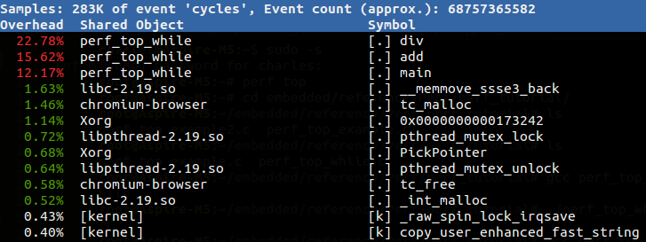
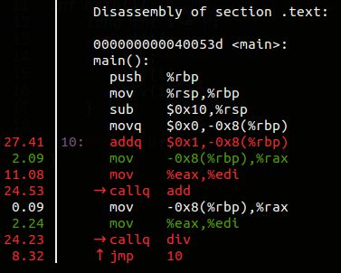

# Linux 效能分析工具: Perf

## 簡介

[Perf](https://perf.wiki.kernel.org/index.php/Main_Page) 全名是 Performance Event，是在 Linux 2.6.31 以後內建的系統效能分析工具，它隨著核心一併釋出。藉由 perf，應用程式可以利用 PMU (Performance Monitoring Unit), tracepoint 和核心內部的特殊計數器 (counter) 來進行統計，另外還能同時分析運行中的核心程式碼，從而更全面瞭解應用程式中的效能瓶頸。

相較於 [OProfile](https://en.wikipedia.org/wiki/OProfile) 和 [GProf](https://sourceware.org/binutils/docs/gprof/) ，perf 的優勢在於與 Linux Kernel 緊密結合，並可受益於最先納入核心的新特徵。perf 基本原理是對目標進行取樣，紀錄特定的條件下所偵測的事件是否發生以及發生的次數。例如根據 tick 中斷進行取樣，即在 tick 中斷內觸發取樣點，在取樣點裡判斷行程 (process) 當時的 context。假如一個行程 90% 的時間都花費在函式 foo() 上，那麼 90% 的取樣點都應該落在函式 foo() 的上下文中。

Perf 可取樣的事件非常多，可以分析 Hardware event，如 cpu-cycles、instructions 、cache-misses、branch-misses …等等。可以分析 Software event，如 page-faults、context-switches …等等，另外一種就是 Tracepoint event。知道了 cpu-cycles、instructions 我們可以瞭解 Instruction per cycle 是多少，進而判斷程式碼有沒有好好利用 CPU，cache-misses 可以曉得是否有善用 Locality of reference ，branch-misses 多了是否導致嚴重的 pipeline hazard？另外 Perf 還可以對函式進行採樣，瞭解效能卡在哪邊。

## 安裝

首先利用以下指令查看目前的 Kernel config 有沒有啟用 Perf。如果 PC 上是裝一般 Linux distro，預設值應該都有開啟。

```sh
＄ cat "/boot/config-`uname -r`" | grep "PERF_EVENT"
```

如果自己編譯核心可以參照[這篇文章](http://www.carbondesignsystems.com/virtual-prototype-blog/using-the-arm-performance-monitor-unit-pmu-linux-driver)來啟用 perf。

參考的環境是 Ubuntu 14.04，kernel 版本 3.16.0。有兩種方法可以安裝

1. 前面講到，perf 是 Linux 內建支持的效能優化工具，在 2.6.31 版本之後，我們可以直接到 [Linux Kernel Archives](https://www.kernel.org/) 下載對應版本的程式碼，解壓縮後到 `tools/perf` 裡面去編譯，通常過程中會有相依的套件需要安裝，依指示完成安裝後，編譯即可成功，最後再把編譯完成的 perf 移至 `/usr/bin` 中就可以使用了。 這種方法通常適用於更新過 kernel 的使用者，因為更新過 kernel 後會造成 distribution package 與 kernel version 不相符。一般使用者採用第二種方法即可。
2. 使用 apt-get 進行安裝。

```sh
$ sudo apt-get install linux-tools-common
```

接著輸入 perf list 或 perf top 檢查一下 perf 可不可以使用。

如果出現以下的訊息，表示還漏了些東西。

```
WARNING: perf not found for kernel 3.16.0-50
You may need to install the following packages for this specific kernel:
    linux-tools-3.16.0-50-generic
    linux-cloud-tools-3.16.0-50-generic
```

上面的 Kernel 版本可能和你不一樣，根據指示安裝起來即可。不放心的話可以使用`＄ uname -r`確認。

```sh
$ sudo apt-get install linux-tools-3.16.0-50-generic linux-cloud-tools-3.16.0-50-generic
```

1. 到這裡 perf 的安裝就完成了。不過這裡我再稍微補充一下，如果你不是切換到 root 的情況下輸入

```sh
$ perf top
```

其實會出現以下錯誤畫面。


kernel.perf_event_paranoid 是用來決定你在沒有 root 權限下 (Normal User) 使用 perf 時，你可以取得哪些 event data。預設值是 1 ，你可以輸入

```sh
$ cat /proc/sys/kernel/perf_event_paranoid
```

來查看權限值。一共有四種權限值:

`2` : 不允許任何量測。但部份用來查看或分析已存在的紀錄的指令仍可使用，如 perf ls、perf report、perf timechart、 perf trace。

`1` : 不允許 CPU events data。但可以使用 perf stat、perf record 並取得 Kernel profiling data。

`0` : 不允許 raw tracepoint access。但可以使用 perf stat、perf record 並取得 CPU events data。

`-1`: 權限全開。

最後如果要檢測 cache miss event ，需要先取消 kernel pointer 的禁用。

```sh
$ sudo sh -c " echo 0 > /proc/sys/kernel/kptr_restrict"
```

## 先來個範例暖身吧！

一開始，我們先使用第一次作業 「計算圓周率」 的程式來體會一下 perf 使用。 [perf_top_example.c]

```c
#include <stdio.h>
#include <unistd.h>

double compute_pi_baseline(size_t N) {
    double pi = 0.0;
    double dt = 1.0 / N;
    for (size_t i = 0; i < N; i++) {
        double x = (double) i / N;
        pi += dt / (1.0 + x * x);
    }
    return pi * 4.0;
}
int main() {
    printf("pid: %d\n", getpid());
    sleep(10);
    compute_pi_baseline(50000000);
    return 0;
}
```

將上述程式存檔為 perf_top_example.c，並執行：

```sh
g++ -c perf_top_example.c
g++ perf_top_example.o -o example
./example
```

執行上述程式後，可以取得一個 pid 值，再根據 pid 輸入

```sh
perf top -p $pid
```

應該會得到類似下面的結果：


預設的 performance event 是 「cycles」，所以這條指令可以分析出消耗 CPU 週期最多的部份，結果顯示函式 compute_pi_baseline() 佔了近 99.9％，跟預期一樣，此函式是程式中的「熱點」！有了一些感覺後，後面會詳細一點介紹 perf 用法。

## 背景知識

以下節錄上海交大通信與電子工程系的劉明寫的文章：

[Perf – Linux下的系統性能調優工具](https://www.ibm.com/developerworks/cn/linux/l-cn-perf1/)

[簡繁體中文詞彙對照：科技纇](https://zh.wikipedia.org/zh-tw/Wikipedia:繁簡分歧詞表#.E7.A7.91.E6.8A.80) (本課程斟酌修改詞彙，`==>` 開頭表示補充)

- **背景知識**

有些背景知識是分析性能問題時需要瞭解的。比如硬件 cache；再比如作業系統核心。應用程式的行為細節往往是和這些東西互相牽扯的，這些底層的東西會以意想不到的方式影響應用程式的性能，比如某些程式無法充分利用 cache，從而導致性能下降。比如不必要地呼叫過多的系統呼叫，造成頻繁的核心 / 使用者層級的切換 …等等。這裡只是為本文的後續內容做些概述，關於效能調校還有很多東西。

- **效能相關的處理器硬體特性，PMU 簡介**

當演算法已趨於最佳化，程式碼不斷精簡，人們調到最後，便需要斤斤計較了。cache、pipeline 等平時不大注意的東西也必須精打細算了。

- **硬體特性之 cache**

記憶體存取很快，但仍無法和處理器的指令執行速度相提並論。為了從記憶體中讀取指令 (instruction) 和資料 (data)，處理器需要等待，用處理器的時間來衡量，這種等待非常漫長。cache 是一種 SRAM，它的存取速率非常快，與處理器處理速度較為接近。因此將常用的資料保存在 cache 中，處理器便無須等待，從而提高效能。cache 的尺寸一般都很小，充分利用 cache 是軟體效能改善過程中，非常重要的部分。

- **硬體特性之 pipeline, superscalar, out-ot-order execution**

提昇效能最有效的方式之一就是平行 (parallelism)。處理器在設計時也儘可能地平行，比如 pipeline, superscalar, out-of-execution。

處理器處理一條指令需要分多個步驟完成，比如 fetch 指令，然後完成運算，最後將計算結果輸出到匯流排 (bus) 上。在處理器內部，這可以看作一個三級 pipeline，如下圖處理器 pipeline 所示：


指令從左邊進入處理器，上圖中的 pipeline 有三級，一個時鐘週期內可以同時處理三條指令，分別被 pipeline 的不同部分處理。

Superscalar 指一個時鐘週期觸發 (issue) 多條指令的 pipeline機器架構，比如 Intel 的 Pentium 處理器，內部有兩個執行單元，在一個時鐘週期內允許執行兩條指令。

==> 這樣稱為 dual-issue，可想像為一個 packet 裡同時有兩組 pipelined 的 instruction

==> 比方說，[Cortex-A5](http://www.arm.com/products/processors/cortex-a/cortex-a5.php) 和 Cortex-A8 一樣採用 ARMv7-A 指令集，但是 Cortex-A5 是 Cortext-A8/A9 的精簡版，有以下差異：

1.pipeline 自 13 stages 減為 8 stages 2.instruction 自 dual-issue 減為 single-issue 3.NEON/FPU 為選配 4.不具有 L2 Cache

此外，在處理器內部，不同指令所需要的執行時間和時鐘週期是不同的，如果嚴格按照程序的執行順序執行，那麼就無法充分利用處理器的 pipeline。因此指令有可能被亂序執行 (out-of-order execution)。

上述三種平行技術對所執行的指令有一個基本要求，即相鄰的指令相互沒有依賴關係。假如某條指令需要依賴前面一條指令的執行結果數據，那麼 pipeline 便失去作用，因為第二條指令必須等待第一條指令完成。因此好的軟體必須儘量避免產生這種程式碼。

- **硬體特性之 branch prediction**

branch prediction 指令對軟體效能影響較大。尤其是當處理器採用流水線設計之後，假設 pipeline 有三級，且目前進入 pipeline 的第一道指令為分支 (branch) 指令。假設處理器順序讀取指令，那麼如果分支的結果是跳躍到其他指令，那麼被處理器 pipeline 所 fetch 的後續兩條指令勢必被棄置 (來不及執行)，從而影響性能。為此，很多處理器都提供了 branch prediction，根據同一條指令的歷史執行記錄進行預測，讀取最可能的下一條指令，而並非順序讀取指令。

==> 搭配簡報: [Branch Prediction](http://www.cs.ucr.edu/~gupta/teaching/203A-09/My6.pdf)

branch prediction 對軟體架構有些要求，對於重複性的分支指令序列，branch prediction 硬體才能得到較好的預測結果，而對於類似 switch-case 一類的程式結構，則往往不易得到理想的預測結果。

==> 對照閱讀: [Fast and slow if-statements: branch prediction in modern processors](http://igoro.com/archive/fast-and-slow-if-statements-branch-prediction-in-modern-processors/)

==> 編譯器提供的輔助機制: [Branch Patterns, Using GCC](http://cellperformance.beyond3d.com/articles/2006/04/branch-patterns-using-gcc.html)

上面介紹的幾種處理器特性對軟體效能影響很大，然而依賴時鐘進行定期採樣的 profiler 模式無法闡述程式對這些處理器硬體特性的使用情況。處理器廠商針對這種情況，在硬體中加入了 PMU (performance monitor unit)。PMU 允許硬體針對某種事件設置 counter，此後處理器便開始統計該事件的發生次數，當發生的次數超過 counter 內設定的數值後，便產生中斷。比如 cache miss 達到某個值後，PMU 便能產生相應的中斷。一旦捕獲這些中斷，便可分析程式對這些硬體特性的使用率了。

- **Tracepoints**

Tracepoint 是散落在核心原始程式碼的一些 hook，一旦使能，在指定的程式碼被運行時，tracepoint 就會被觸發，這樣的特性可被各種 trace/debug 工具所使用，perf 就是這樣的案例。若你想知道在應用程式執行時期，核心記憶體管理模組的行為，即可透過潛伏在 slab 分配器中的 tracepoint。當核心運行到這些 tracepoint 時，便會通知 perf。

Perf 將 tracepoint 產生的事件記錄下來，生成報告，通過分析這些報告，效能分析調校的工程人員便可瞭解程式執行時期的核心種種細節，也能做出針對效能更準確的診斷。

## Perf 基本使用

前面有提到，Perf 能觸發的事件分為三類：

- **hardware** : 由 PMU 產生的事件，比如 cache-misses、cpu-cycles、instructions、branch-misses …等等，通常是當需要瞭解程序對硬體特性的使用情況時會使用。
- **software** : 是核心程式產生的事件，比如 context-switches、page-faults、cpu-clock、cpu-migrations …等等。
- **tracepoint** : 是核心中的靜態 tracepoint 所觸發的事件，這些 tracepoint 用來判斷在程式執行時期，核心的行為細節，比如 slab 記憶體配置器的配置次數等。

Perf 包含 20 幾種子工具集，不過我還沒碰過很多，我根據目前理解先介紹以下。 如果想看第一手資料

```sh
$ perf help <command>
```

\###perf list 這應該是大部分的人第一次安裝 perf 後所下的第一個指令，它能印出 perf 可以觸發哪些 event，不同 CPU 可能支援不同 hardware event，不同 kernel 版本支援的 software、tracepoint event 也不同。我的 perf 版本是`3.19.8`，所支援的 event 已經超過 1400 項（另外要列出 Tracepoint event 必須開啟 root 權限）。

```sh
$ perf list
```


### perf top

perf top 其實跟平常 Linux 內建的 top 指令很相似。它能夠「即時」的分析各個函式在某個 event 上的熱點，找出拖慢系統的凶手，就如同上面那個範例一樣。甚至，即使沒有特定的程序要觀察，你也可以直接下達 `$ perf top` 指令來觀察是什麼程序吃掉系統效能，導致系統異常變慢。譬如我執行一個無窮迴圈：

```c
int main() {
    long int i = 0;
    while(1) {
        i++;
        add(i);
        div(i);
    }
    return 0;
}
```

可以發現紅色熱點就出現了。右邊第一列為各函式的符號，左邊第一行是該符號引發的 event 在整個「監視域」中佔的比例，我們稱作該符號的熱度，監視域指的是 perf 監控的所有符號，預設值包括系統所有程序、核心以及核心 module 的函式，左邊第二行則為該符號所在的 Shared Object 。若符號旁顯示`[.]`表示其位於 User mode，`[k]`則為 kernel mode。



（當你關掉該程序之後，這個監視畫面 (tui 界面) 裡的該程序不會「馬上」消失，而是其 overhead 的比例一直減少然後慢慢離開列表）。

按下 `h`可以呼叫 help ，它會列出 perf top 的所有功能和對應按鍵。 我們來試看看 Annotate（註解），這功能可以進一步深入分析某個符號。使用方向鍵移到你有興趣的符號按下`a`。 它會顯示各條指令的 event 取樣率（耗時較多的部份就容易被 perf 取樣到）。



最後若你想要觀察其他 event ( 預設 cycles ) 和指定取樣頻率 ( 預設每秒4000次 ) :

```
$ perf top -e cache-misses -c 5000
```

### perf stat

相較於 top，使用 perf stat 往往是你已經有個要優化的目標，對這個目標進行特定或一系列的 event 檢查，進而瞭解該程序的效能概況。（event 沒有指定的話，預設會有十種常用 event。） 我們來對以下程式使用 perf stat 工具 分析 cache miss 情形

```c
static char array[10000][10000];
int main (void){
  int i, j;
  for (i = 0; i < 10000; i++)
    for (j = 0; j < 10000; j++)
       array[j][i]++;
  return 0;
}
```


```sh
$ perf stat --repeat 5 -e cache-misses,cache-references,instructions,cycles ./perf_stat_cache_miss
    Performance counter stats for './perf_stat_cache_miss' (5 runs):
    4,416,226        cache-misses        #    3.437 % of all cache refs    ( +-  0.27% )
    128,483,262      cache-references                                      ( +-  0.02% )
    2,123,281,496    instructions        #    0.65  insns per cycle        ( +-  0.02% )
    3,281,498,034    cycles                                                ( +-  0.21% )
        1.299352302 seconds time elapsed                                   ( +-  0.19% )
```

`--repeat <n>`或是`-r <n>` 可以重複執行 n 次該程序，並顯示每個 event 的變化區間。 `cache-misses,cache-references`和 `instructions,cycles`類似這種成對的 event，若同時出現 perf 會很貼心幫你計算比例。

根據這次 perf stat 結果可以明顯發現程序有很高的 cache miss，連帶影響 IPC 只有`0.65`。

如果我們善用一下存取的局部性，將 `i，j`對調改成`array[i][j]++`。

```
    Performance counter stats for './perf_stat_cache_miss' (5 runs):
    2,263,131        cache-misses        #   93.742 % of all cache refs    ( +-  0.53% )
    2,414,202        cache-references                                      ( +-  1.82% )
    2,123,275,176    instructions        #    1.98  insns per cycle        ( +-  0.03% )
    1,074,868,730    cycles                                                ( +-  1.96% )
        0.432727146 seconds time elapsed                                   ( +-  1.99% )
```

cache-references 從 `128,483,262`下降到 `2,414,202`，差了五十幾倍，執行時間也縮短為原來的三分之一！

\###perf record & perf report 有別於 stat，record 可以針對函式級別進行 event 統計，方便我們對程序「熱點」作更精細的分析和優化。 我們來對以下程式，使用 perf record 進行 branch 情況分析

```c
#define N 5000000
static int array[N] = { 0 };
void normal_loop(int a) {
    int i;
    for (i = 0; i < N; i++)
        array[i] = array[i]+a;
}
void unroll_loop(int a) {
    int i;
    for (i = 0; i < N; i+=5){
        array[i] = array[i]+1;
        array[i+1] = array[i+1]+a;
        array[i+2] = array[i+2]+a;
        array[i+3] = array[i+3]+a;
        array[i+4] = array[i+4]+a;
    }
}
int main() {
    normal_loop(1);
    unroll_loop(1);
    return 0;
}
```

```sh
$ perf record -e branch-misses:u,branch-instructions:u ./perf_record_example
$ perf report
```

`:u`是讓 perf 只統計發生在 user space 的 event。最後可以觀察到迴圈展開前後 branch-instructions 的差距。

另外，使用 record 有可能會碰到的問題是取樣頻率太低，有些函式的訊息沒有沒顯示出來（沒取樣到），這時可以使用 `-F <frequcncy>`來調高取樣頻率，可以輸入以下查看最大值，要更改也沒問題，但能調到多大可能還要查一下。

```sh
$ cat /proc/sys/kernel/perf_event_max_sample_rate
```

## 參考資料

- [Linux Performance](http://www.brendangregg.com/linuxperf.html)
- [Tutorial - Linux kernel profiling with perf](https://perf.wiki.kernel.org/index.php/Tutorial#Sample_analysis_with_perf_report) [Perf wiki]
- Perf - Linux下的系統性能調優工具 / 劉明 [IBM developerWorks]
  - [第一部分 - 簡介、背景知識、基本使用](https://www.ibm.com/developerworks/cn/linux/l-cn-perf1/)
  - [第二部分 - tracepoint、probe、sched、bench、lock、Kmem、timechart、使用 Script 增強 perf 的功能](http://www.ibm.com/developerworks/cn/linux/l-cn-perf2/index.html)
- [A Study of Performance Monitoring Unit, perf and perf_events subsystem](http://rts.lab.asu.edu/web_438/project_final/CSE_598_Performance_Monitoring_Unit.pdf) [PDF]
- [Perf FAQ](http://kernel.taobao.org/index.php?title=Documents/Perf_FAQ) [kernel.taobao.org]
- [Do I need root (admin) permissions to run userspace ‘perf’ tool?](http://unix.stackexchange.com/questions/14227/do-i-need-root-admin-permissions-to-run-userspace-perf-tool-perf-events-ar)
- [Using the ARM Performance Monitor Unit (PMU) Linux Driver](http://www.carbondesignsystems.com/virtual-prototype-blog/using-the-arm-performance-monitor-unit-pmu-linux-driver)
- [perf 性能分析實例——使用perf優化cache利用率](http://blog.csdn.net/trochiluses/article/details/17346803) [CSDN]

## Context Switches 

Context Switches  上下文切換，有時也被稱為處理程序切換(process switch)或任務切換。是一個重要的性能指標。

CPU從一個執行緒切換到另外一個執行緒，需要保存當前任務的運行環境，恢復將要運行任務的運行環境，必然帶來性能消耗。

Context Switches 上下文切換簡介

作業系統可以同時運行多個處理程序， 然而一顆CPU同時只能執行一項任務，作業系統利用時間片輪轉的方式，讓使用者感覺這些任務正在同時進行。 CPU給每個任務都服務一定的時間, 然後把當前任務的狀態保存下來, 在載入下一任務的狀態後, 繼續服務下一任務。任務的狀態保存及再載入, 這段過程就叫做上下文切換。

時間片輪轉的方式使多個任務在同一顆CPU上執行變成了可能, 但同時也帶來了保存現場和載入現場的直接消耗。

上下文切換的性能消耗

Context Switchs過高，導致CPU就像個搬運工一樣，頻繁在暫存器(CPU Register)和運行佇列(run queue)之間奔波，系統更多的時間都花費線上程切換上，而不是花在真正做有用工作的執行緒上。

直接消耗包括: CPU暫存器需要保存和載入, 系統調度器的程式碼需要執行, TLB實例需要重新載入, CPU 的pipeline需要刷掉。

間接消耗：多核的cache之間得共享資料。間接消耗對於程序的影響要看執行緒工作區運算元據的大小。

 性能分析查看Context Switches的方法

Linux中可以通過工具vmstat, dstat, pidstat來觀察CS的切換情況。vmstat, dstat只能觀察整個系統的切換情況，而pidstat可以更精確地觀察某個處理程序的上下文切換情況。


最常見的，在一些[排程](https://zh.wikipedia.org/wiki/排程)（scheduling）[演算法](https://zh.wikipedia.org/wiki/算法)內，其中行程有時候需要暫時離開CPU，讓另一個行程進來CPU運作。在先佔式多工系統中，每一個行程都將輪流執行不定長度的時間，這些時間段落稱為[時間片](https://zh.wikipedia.org/wiki/時間片)。如果行程並非自願讓出CPU(例如執行[I/O](https://zh.wikipedia.org/wiki/I/O)操作時，行程就需放棄CPU使用權)，當時限到時，系統將產生一個定時中斷，[作業系統](https://zh.wikipedia.org/wiki/操作系統)將排定由其它的行程來執行。此機制用以確保CPU不致被較依賴處理器[運算](https://zh.wikipedia.org/wiki/運算)的行程壟斷。若無定時中斷，除非行程自願讓出CPU，否則該行程將持續執行。對於擁有較多I/O[指令](https://zh.wikipedia.org/wiki/指令)的行程，往往執行不了多久，便需要讓出CPU；而較依賴處理器的行程相對而言I/O操作較少，反而能一直持續使用CPU，便形成了[壟斷](https://zh.wikipedia.org/wiki/獨佔)現象。

---

## 在 Linux 上使用 Perf 做效能分析(入門篇)

## 簡介

透過效能分析工具 (Profiler)，我們可以得知更多關於軟體的運行資訊，像是花了多少記憶體、多少 CPU Cycles、多少 Cache Misses、I/O 處理時間等等，這些資訊對我們去找到程式效能瓶頸很有幫助。想辦法找到那裡讓程式變慢，進而最大化效能，便是我們做效能分析的最大目的。

本文將介紹 Linux 上的 [perf](http://www.brendangregg.com/perf.html) 效能分析工具，藉由一個簡單的程式範例，示範如何使用 perf 去分析一隻程式，我們將會發現使用分析工具時能更輕易的發現問題根源。本文參考 Gabriel Krisman Bertaz 寫的 [Performance analysis in Linux](https://www.collabora.com/news-and-blog/blog/2017/03/21/performance-analysis-in-linux/)。


本文可以搭配我的教學影片：

<iframe width="560" height="315" src="https://www.youtube.com/embed/Mba2ONCA0kI" title="YouTube video player" frameborder="0" allow="accelerometer; autoplay; clipboard-write; encrypted-media; gyroscope; picture-in-picture" allowfullscreen="" style="color: rgb(119, 119, 119); font-family: &quot;Times New Roman&quot;; font-size: 19.2px; font-style: normal; font-variant-ligatures: normal; font-variant-caps: normal; font-weight: 400; letter-spacing: normal; orphans: 2; text-align: left; text-indent: 0px; text-transform: none; widows: 2; word-spacing: 0px; -webkit-text-stroke-width: 0px; white-space: normal; background-color: rgb(255, 255, 255); text-decoration-thickness: initial; text-decoration-style: initial; text-decoration-color: initial;"></iframe>


## 一個 Branch Prediction 的範例

Stack Overflow 上有一個很火的問題「[Why is processing a sorted array faster than processing an unsorted array?](https://stackoverflow.com/questions/11227809/)」。

問題的 Code 如下：

`test.cc`：

```c++
#include <algorithm>
#include <ctime>
#include <iostream>

int main()
{
    // 測試用陣列
    const int arr_len = 32768;
    int data[arr_len];

    for (int c = 0; c < arr_len; ++c)
        data[c] = std::rand() % 256;

    // std::sort(data, data + arr_len); // 是否排序
    
    long long sum = 0;

    for (int i = 0; i < 30000; ++i)
    {
        for (int c = 0; c < arr_len; ++c)
        {
            if (data[c] >= 128) { // 故意選 256 一半  
                sum += data[c];
            }
        }
    }

    std::cout << "sum = " << sum << std::endl;
}
```

首先我們先編譯未排序版本：

```shell
$ g++ test.cc -o unsort
```

接著我們把 `sort` 那行取消註解，再編譯一次：

```shell
$ g++ test.cc -o sort
```

先來看看執行時間：

```shell
$ time ./unsort
real    0m5.671s

$ time ./sort
real    0m1.932s
```

問題大意是說 `data` 如果排列過後，上面這段程式碼反而更快，如同我們實驗結果。我們知道排序的複雜度是 O(NlogN)�(�����)，所以應該會比沒排直接跑的 O(N)�(�) 還慢，但結果是排序後反而更快。

就結論來說，我們知道這個結果是因為 CPU 會做 **Branch Prediction**。白話來說就是上次如果 `if` 是 `true`，下次就先猜也是 `true`，CPU 可以藉由先猜來偷跑，猜對了的話就可以跑更快；但相對的猜錯的話偷跑的東西通通要丟掉，反而更浪費時間，稱為 Branch Miss(詳細原理可以參考「計算機組織」)。所以 Branch Prediction 算是一種雙面刃，如果可以一直讓條件判斷有相同結果就可以進而加速程式，反之判斷一直反覆不定就會導致一直「猜測」錯誤而變慢，因此在上面程式碼中排列過的版本反而比較快，因為猜測錯誤只會發生一次，就是在 `data` 剛好在 `128` 附近的位置，在那之前全部會是 `false`，而後都會是 `true`。

## Perf 效能分析工具

想要找到一段程式碼的問題通常不容易，就以上面的程式範例來說，假設我們朝演算法去分析就會走錯路，實際問題其實在計算機組織的原理。光是一段簡單的程式碼就讓我們可能找不到原因，更甭說碰到一個大的程式，裡面有各種問題存在，可能是演算法、記憶體快取、CPU 指令、網路連線、I/O 等等，這時我們需要一個分析程式來幫助我們。

Linux 上其實有很多工具可以使用：


不過本文將針對 perf 做介紹，並用上面程式來示範假設我們還不知道問題是因為 Branch Miss，如何用 perf 找到問題。

你可以用下面指令在 Ubuntu 上裝 perf：

```shell
$ sudo apt install linux-tools-$(uname -r) linux-tools-generic
```

或是你也可以考慮自己從 Linux Kernel 編譯 perf 來用：

```shell
$ sudo apt install flex bison libelf-dev libunwind-dev libaudit-dev libslang2-dev libdw-dev
$ git clone https://github.com/torvalds/linux --depth=1
$ cd linux/tools/perf/
$ make
$ make install
$ sudo cp perf /usr/bin
$ perf
```

安裝完 perf 後，你可能會需要設定系統權限，預設應該會使 perf 權限不足：

```shell
$ sudo su # As Root
$ sysctl -w kernel.perf_event_paranoid=-1
$ echo 0 > /proc/sys/kernel/kptr_restrict
$ exit
```

## 使用 perf

接著我們要測試的程式，為了讓 perf 能用，我們要加上 `-g3` 參數開啟除錯模式。

一樣是編譯 `test.cc`，首先是沒排序：

```shell
$ g++ test.cc -g3 -o unsort
```

接著是編譯有排序版本：

```shell
$ g++ test.cc -g3 -o sort
```

### Perf Record

我們現在想要知道為甚麼 `./unsort` 跑得比較慢，我們可以透過 `perf record` 來記錄程式執行的資訊。

```shell
$ perf record ./unsort
```

這樣 perf 會將 `./unsort` 跑的資料記錄在 `perf.data` 中，perf 其他指令可以用來讀取這個紀錄檔。

### Perf Annotate

我們可以用 `perf annotate` 來看結果：

```shell
$ perf annotate
```


perf 會自動跳到花費比較多的區塊，如上圖所示，左邊是執行時間比例，右邊是程式碼對照的 Assembly Code。你可以用上下方向鍵移動，或用 `h` 來看操作說明。

其實從這個 Assembly 時間比例就可以看出端倪，通常我們會去看哪邊花最多時間，然後去研究背後原因。這邊的關鍵是 `d8` 和 `cf` 這兩行，`addl` 其實就是在做 `sum += data[c]`，所以這兩行分別代表 Branch Prediction 猜對和猜錯的路徑。

這張圖「箭頭」標註的是 Branch Prediction **猜對**的路徑，可以看到 `d8` 行佔比幾乎是 0.0%。


這張圖「箭頭」標註的是 Branch Prediction **猜錯**的路徑，可以看到 `cf` 行佔比幾乎是 27.7%。


所以其實就可以發現整隻程式因為 Branch Misses 浪費很多時間。

這邊我們可以偷偷看一下 `./sort` 的結果：

```shell
$ perf record ./sort && perf annotate
```


因為不會有 Branch Miss，可以觀察到 `ee` 和 `f7` 的 `addl` 基本上沒佔多少時間。

### Perf Stat

直接看 Assembly 其實滿花時間的，如果想要直接「掌握大局」，可以考慮用 `perf stat`。

```shell
# 未排序版本
$ perf stat ./unsort
sum = 94479480000

 Performance counter stats for './unsort':

          5,671.51 msec task-clock                #    1.000 CPUs utilized
                24      context-switches          #    0.004 K/sec
                 0      cpu-migrations            #    0.000 K/sec
               147      page-faults               #    0.026 K/sec
    20,366,870,320      cycles                    #    3.591 GHz
    11,328,534,095      instructions              #    0.56  insn per cycle
     2,951,455,487      branches                  #  520.401 M/sec
       467,676,925      branch-misses             #   15.85% of all branches

       5.671777216 seconds time elapsed

       5.671781000 seconds user
       0.000000000 seconds sys

# 排序版本
$ perf stat ./sort
sum = 94479480000

 Performance counter stats for './sort':

          1,927.09 msec task-clock                #    1.000 CPUs utilized
                 6      context-switches          #    0.003 K/sec
                 0      cpu-migrations            #    0.000 K/sec
               146      page-faults               #    0.076 K/sec
     6,917,745,957      cycles                    #    3.590 GHz
    11,345,543,927      instructions              #    1.64  insn per cycle
     2,954,388,946      branches                  # 1533.084 M/sec
           268,192      branch-misses             #    0.01% of all branches

       1.927654198 seconds time elapsed

       1.927349000 seconds user
       0.000000000 seconds sys
```

`perf stat` 可以直接看到統計資料，如果有很高的 Context Switch、Page Fault、Branch Miss 都代表程式本身效能有待優化。

以 `unsort` 為例可以看到 Branch Miss 特別高 (排序版本會幾乎是 0)，這時我們就可以去看原本的程式哪邊有條件判斷，然後根據 Annotate 的時間比例，就可以快速找到問題點。另外從 Cycle 上我們也可以發現兩個版本差了三倍之多。

> 更多 perf 的用法可以參考 Brendan Gregg 的「[perf Examples](http://www.brendangregg.com/perf.html)」。另外這個 HackMD 的[筆記](https://hackmd.io/@1IzBzEXXRsmj6-nLXZ9opw/HkBl5kCSU)也挺不錯的。

## 結論

本文介紹 perf 的簡單用法，用簡單的範例程式示範如何去觀察效能並找出可能的問題原因。

我們常常因為程式效能不佳而需要分析效能，但找到問題的過程往往不容易，一段程式碼效能不佳可能是演算法與資料結構的問題，可能是作業系統 System Call 導致，也可能是因為處理器架構的關係。如同本文的程式範例，說明瞭演算法的複雜度不代表真實跑出來的速度，往往還需要去考慮作業系統或是硬體架構。善用效能分析工具才能讓我們更快找到問題點。
