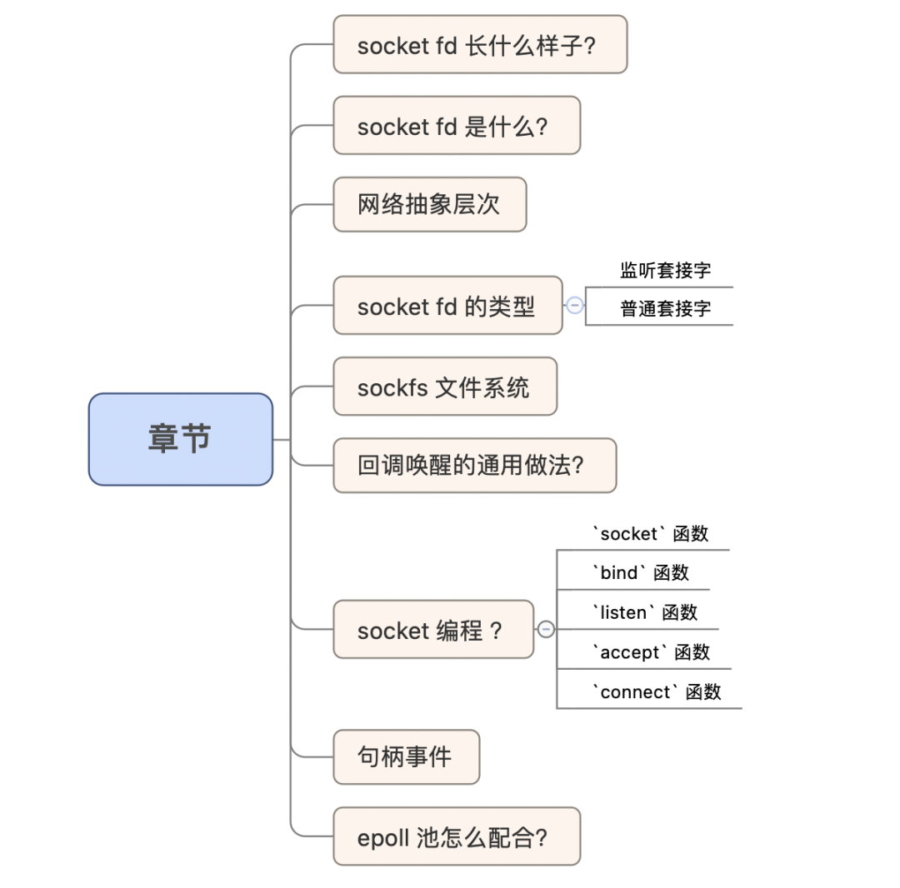
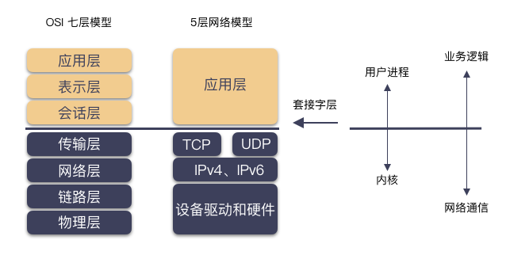
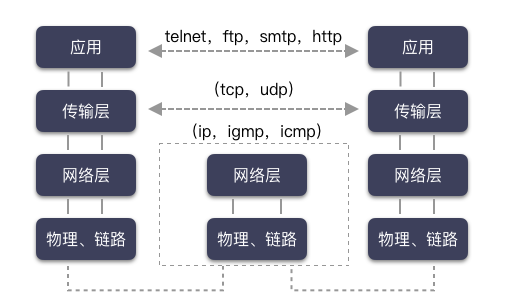
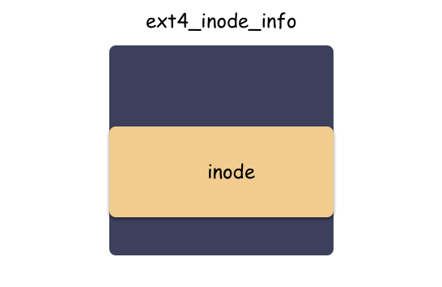
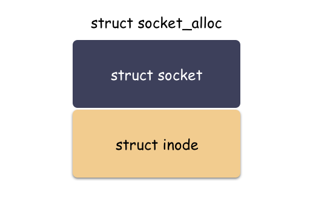
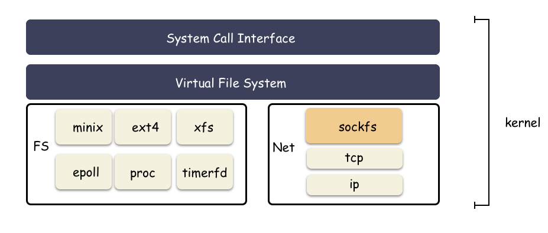
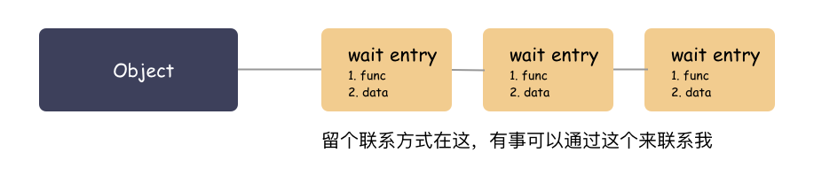
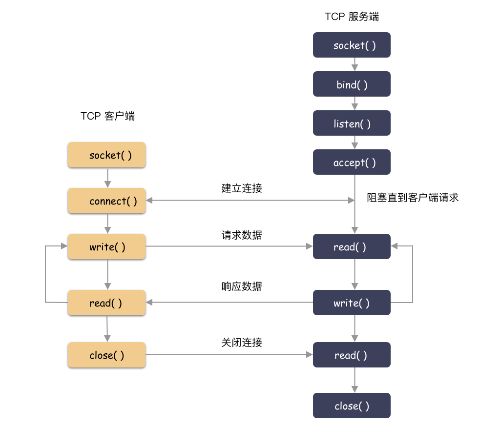
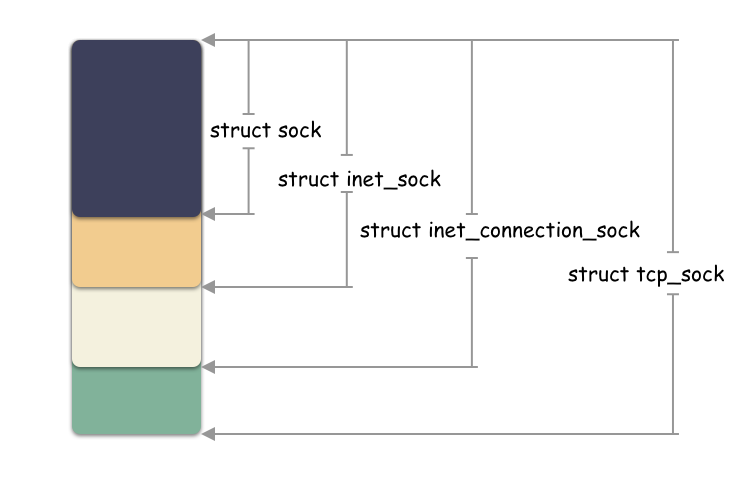
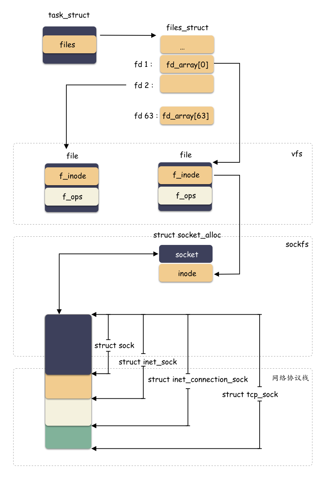

# 深入理解 Linux socket

**來源**：[https://mp.weixin.qq.com/s/yXO5hn2PiPmRWTXygnf8zQ](https://url.readfog.com/YGcNUp)




socket fd 長什麼樣子？

什麼是 socket fd ？粗糙的來講，就是網絡 fd，比如我們最常見的 C/S 客戶端服務端的編程模式，就是網絡通信的一種方式。撇開底層和協議細節，**網絡通信**和**文件讀寫**從接口上有本質區別嗎？

其實沒啥區別，不就是讀過來和寫過去嘛，簡稱 IO 。

我們先看一下 socket fd 是什麼樣子的？隨便找了個進程

```
root@ubuntu:~# ll /proc/1583/fd
total 0
lrwx------ 1 root root 64 Jul 19 12:37 7 -> socket:[18892]
lrwx------ 1 root root 64 Jul 19 12:37 8 -> socket:[18893]
```

這裡我們看到 fd 7、8 都是一個 socket fd，名字：`socket:[18892]`

整數句柄後面一般會跟一些信息，用於幫助我們瞭解這個 fd 是什麼。舉個例子，如果是文件 fd，那麼箭頭後面一般是路徑名稱。現在拆解一下這個名字：

- socket ：標識這是一個 socket 類型的 fd
- `[18892]` ：這個是一個 inode 號，能夠唯一標識本機的一條網絡連接；

**思考下，這個 inode 號，還能再哪裡能看到呢？**

在 proc 的 net 目錄下，因為我這個是一個走 tcp 的服務端，所以我們看一下  `/proc/net/tcp` 文件。這個文件裡面能看到所有的 tcp 連接的信息。

```
root@ubuntu:~# grep -i "18892" /proc/net/tcp
  18: 00000000:1F93 00000000:0000 0A 00000000:00000000 00:00000000 00000000     0        0 18892 1 ffff880197fba580 100 0 0 10 0                     
root@ubuntu:~# grep -i "18893" /proc/net/tcp
  28: 00000000:1F7C 00000000:0000 0A 00000000:00000000 00:00000000 00000000     0        0 18893 1 ffff880197fbad00 100 0 0 10 0
```

知識點又來了，`/proc/net/tcp` 這個文件記錄了 tcp 連接的信息，這份信息是非常有用的。包含了 TCP 連接的地址（16 進制顯示），inode 的信息，連接的狀態等等。

socket fd 是什麼？

**環境聲明**：

> Linux 內核版本 4.19 
>
> 為了方便，如果沒特意說明協議，默認 TCP 協議；

`socket` 可能你還沒反應過來，中文名：**套接字** 是不是更熟悉點。Linux 網絡編程甚至可以叫做套接字編程。

有些概念你必須捋一捋 。我們思考幾個小問題：

socket 跟 tcp/ip 有什麼區別？

就不該把這兩個東西放在一起比較討論，就不是一個東西。tcp/ip 是網絡協議棧，**socket 是操作系統為了方便網絡編程而設計出來的編程接口而已。**

理論基礎是各種網絡協議，協議棧呀，啥的。但是如果你要進行網絡編程，落到實處，對程序猿來講就是 socket 編程。

對於網絡的操作，由 socket 體現為 open -> read/write ->close 這樣的編程模式，這個統一到文件的一種形式。

> socket 的 open 就是 `socket(int domain, int type, int protocol)` ，和文件一樣，都是獲取一個句柄。

網絡抽象層次

網絡模型一般會對應到兩種：

- 完美理論的 **OSI 七層模型**；
- 現實應用的 5 層模型；

對應關係如下圖（取自 Unix 套接字編程）



不同層次做不同的事情，不斷的封裝，不斷的站在巨人的肩膀上，你將能做的更多。



今天，奇伢剖析的只聚焦在套接字這一層，這是程序猿摸得到的一層，位於所有網絡協議之上的一層封裝，**網絡編程又叫套接字編程**，這並不是空穴來風。

套接字，是內核對賊複雜的網絡協議棧的 API 封裝，使得程序猿能夠用極簡的姿勢進行網絡編程。比如寫一個基於 Tcp 的 C/S 的網絡程序，需要用到啥？我們大概暢想下：

1. 客戶端和服務端都用 `socket` 調用創建套接字；
2. 服務端用 `bind` 綁定監聽地址，用 `listen` 把套接字轉化為監聽套接字，用 `accept` 撈取一個客戶端來的連接；
3. 客戶端用 `connect` 進行建連，用 `write/read` 進行網絡 IO；

程序猿用著好簡單！因為內核把事扛了。

socket fd 的類型

上面我們提到了套接字，這是我們網絡編程的主體，套接字由 `socket()` 系統調用創建，但你可知套接字其實可分為兩種類型，監聽套接字和普通套接字。而監聽套接字是由 `listen()` 把 socket fd 轉化而成。

 **1**  **監聽套接字**

對於監聽套接字，不走數據流，只管理連接的建立。`accept` 將從全連接隊列獲取一個創建好的 socket（ 3 次握手完成），對於監聽套接字的可讀事件就是全連接隊列非空。對於監聽套接字，我們只在乎可讀事件。

 **2**  **普通套接字**

普通套接字就是走數據流的，也就是網絡 IO，針對普通套接字我們關注可讀可寫事件。在說 socket 的可讀可寫事件之前，我們先捋順套接字的讀寫大概是什麼樣子吧。

套接字層是內核提供給程序員用來網絡編程的，程序猿讀寫都是針對套接字而言，那麼 `write( socketfd, /* 參數 */)` 和 `read( socketfd, /* 參數 */)` 都會發生什麼呢？

- write 數據到 socketfd，大部分情況下，數據寫到 socket 的內存 buffer，就結束了，並沒有發送到對端網絡（異步發送）；
- read socketfd 的數據，也只是從 socket 的 內存 buffer 裡讀數據而已，而不是從網卡讀（雖然數據是從網卡一層層遞上來的）；

也就是說，程序猿而言，是跟 socket 打交道，內核屏蔽了底層的細節。

那說回來 socket 的可讀可寫事件就很容易理解了。

- socketfd 可讀：其實就是 socket buffer 內有數據（超過閾值 SO_RCLOWAT ）；
- socketfd 可寫：就是 socket buffer 還有空間讓你寫（閾值 SO_SNDLOWAT ）；

sockfs 文件系統

socket fd 為什麼能具備 “文件” 的語義，從而和 eventfd，ext2 fd 這樣的句柄一樣，統一提供對外 io 的樣子？

核心就是：sockfs ，這也是個文件系統，只不過普通用戶看不見，這是隻由內核管理的文件系統，位於 vfs 之下，為了封裝 socket 對上的文件語義。

```c
// net/socket.c
static int __init sock_init(void)
{
    // 註冊 sockfs 文件系統
    err = register_filesystem(&sock_fs_type);
    // 內核掛載
    sock_mnt = kern_mount(&sock_fs_type);
}
```

其中最關鍵的是 sock_mnt 這個全局變量裡面的超級塊的操作表 `sockfs_ops` 。

```c
// net/socket.c
static const struct super_operations sockfs_ops = {
    .alloc_inode    = sock_alloc_inode,
    .destroy_inode  = sock_destroy_inode,
    .statfs     = simple_statfs,
};
```

這個是每個文件系統的核心函數表，如上指明瞭 inode 的分配規則（這裡又將體現依次結構體內嵌組合 + 類型強轉的應用）。

讀者朋友還記得 inode 和 ext4_inode_info 的關係嗎？在 [**Linux fd 究竟是什麼？**](http://mp.weixin.qq.com/s?__biz=Mzg3NTU3OTgxOA==&mid=2247489347&idx=1&sn=e897fd2f3584fe0fe0c011d4e6503274&chksm=cf3e0786f8498e903b463ac2ddaac2a0fb4cebac7c6cbf02ff02348fbc71dcd80d09a26c4257&scene=21#wechat_redirect)一文中有提到這個：



inode 是 vfs 抽象的適配所有文件系統的結構體，但分配其實是有下層具體文件系統分配出來的，以 ext4 文件系統來說，使用 `ext4_alloc_inode` 函數分配出 `ext4_inode_info` 這個大結構體，然後返回的是 inode 的地址而已。

**劃重點：`struct inode` 內嵌於具體文件系統的 “inode” 裡，vfs 層使用的是 inode，ext4 層使用的是 `ext4_inode_info` ，不同層次通過地址的強制轉化類型來切換結構體。**

那麼類似，sockfs 也是如此，sockfs 作為文件系統，也有自己特色的 “inode”，這個類型就是 `struct socket_alloc` ，如下：

```c
struct socket_alloc {
    struct socket socket;
    struct inode vfs_inode;
};
```

這個結構體關聯 socket 和 inode 兩個角色，是 “文件” 抽象的核心之一。分配 `struct socket` 結構體其實是分配了 `struct socket_alloc` 結構體，然後返回了 `socket_alloc->socket` 字段的地址而已。



**劃重點：vfs 層用的時候給 inode 字段的地址，socket 層的時候給 socket 字段的地址。不同抽象層面對於同一個內存塊的理解不同，強制轉化類型，然後各自使用**

從文件的角度來看 socket，模塊如下：



回調喚醒的通用做法？

**先鋪墊一個小知識點：內核裡面有回調喚醒的實現，裡面有用到一種 wait queue 的做法，其實很簡單的原理。**

大白話原理：你要走可以，把聯繫方式留下，我搞好之後通知你（調用你留下的函數，傳入你留下的參數）。



拿 socket 來說，`struct sock` 裡面就有個字段 `sk_wq` ，這是個表頭，就是用來掛接等待對象的。

誰會掛？

就以 epoll 池來說，`epoll_ctl` 註冊 socket fd 的時候，就會掛一個 wait 對象到 `sk->sk_wq` 裡。回調參數為 `ep_poll_callback` ，參數為 `epitem` 。

這樣 epoll 給 socket 留下聯繫方式了（ wait 對象 ），socket 有啥事就可以隨時通知到 epoll 池了。

能有什麼事？

socket 可讀可寫了唄。sk buffer 裡面有數據可以讀，或者有空間可以寫了唄。對於監聽類型的 socket，有新的連接了唄。epoll 監聽的不就是這個嘛。

socket 編程 ？

**服務端：**

1. `socket( )` 創建出 socketfd；
2. `bind( )` 綁定一個端口（和客戶端約定好的知名端口號）；
3. `listen( )` 講套接字轉化成監聽套接字；
4. `accept( )` 等待客戶端的建連請求；
5. 建連之後 read/write 處理數據即可（一般和監聽線程併發）；

**客戶端：**

1. `socket( )` 創建出 socketfd；
2. `connect( )` 向指定機器、端口發起建連請求；
3. 建連之後，read/write 處理數據；



下面就幾個關鍵函數做個簡要實現。

 **1**  **socket 函數**

定義原型：

```c
#include<sys/socket.h>
int socket(int family, int type, int protocol)
```

**簡要跟蹤下內部實現**：

socket 系統調用對應了 `__sys_socket` 這個函數。這個函數主要做兩件事情：

1. 第一件事：調用 `socket_create` 函數創建好 socket 相關的結構體，主要是 `struct socket` ，還有與之關聯的 `socket sock` 結構，再往下就是具體網絡協議對應的結構體（旁白：這裡實現細節過於複雜，不在文章主幹，故略去 10 萬字）；
2. 第二件事：調用 `sock_map_fd` 函數創建好 `struct file` 這個結構體，並與第一步創建出的 `struct socket` 關聯起來；

**涉及的一些函數調用**：

```c
__sys_socket
    // 創建 struct socket 結構體
    -> sock_create
            // 創建 struct socket 結構，並且關聯特殊 inode
            -> sock_alloc
            // pf 是根據 family 從 net_families 這個全局表中取出的操作函數表，用來創建具體網絡協議結構的;  
            // 比如 IPv4 對應的 family 就是 AF_INET ，對應的函數是 inet_create
            // 在這裡面會賦值 sock->ops 為對應協議族的操作函數表（比如 inet_stream_ops）
            -> pf->create
                    // struct sock 結構體的創建（sk->sk_prot 的賦值就在這裡，比如 tcp_prot ）
                    -> sk_alloc
                    // struct sock 結構體的初始化(比如 sk_receive_queue, sk_write_queue, sk_error_queue 就是在這裡初始化的)
                    // 可讀寫的關鍵函數 sock_def_readable，sock_def_write_space 也是在這裡賦值的
                    -> sock_init_data
    // 創建 struct file 結構體，並且關聯 struct socket
    -> sock_map_fd
```

**先說 socket 函數：**：

1. `socket( )` 函數只負責創建出適配具體網絡協議的資源（內存、結構體、隊列等），並**沒有和具體地址綁定**；
2. `socket( )` 返回的是非負整數的 fd，與 `struct file` 對應，而 `struct file` 則與具體的 `struct socket` 關聯，從而實現**一切皆文件**的封裝的一部分（另一部分 inode 的創建處理在 sock_alloc 的函數裡體現）；

**再簡要說下內部細節：**

`sock_create` 函數裡，會根據協議族查找對應的操作表，以 AF_INET 協議族舉例，`pf->create` 是 `inet_create` ，主要做兩件事：

1. 把 `sock->ops` 按照協議類型賦值成**具體的函數操作表**，比如 tcp 的就是 `inet_stream_ops` ；
2. 創建了 `struct sock` 對象，並且把 `struct sock` 初始化，並和 `struct socket` 進行關聯；

著重提一點，`sock_init_data` 函數（ `net/core/sock.c` ）主要是初始化 `struct sock` 結構體的，提兩點最關鍵的：

**第一點：接收隊列和發送隊列在這裡初始化**；

- sk_receive_queue：套接字接收到的數據（sk_buff 裡面是純粹的用戶數據哦，沒有 header 啥信息）；
- sk_write_queue：套接字要發送的數據；
- sk_error_queue：掛接一些 pengding 的 error 信息；

**第二點：socket 的喚醒回調在這個地方設置**；

```
   sk->sk_data_ready   =   sock_def_readable;
   sk->sk_write_space  =   sock_def_write_space;
```

為什麼這裡很重要，因為這個跟 socket fd 可讀可寫的判斷邏輯，數據到了之後的喚醒路徑息息相關。簡述下回調鏈路（以套接字層為主幹，其他的流程簡略描述）：

```
sk->sk_data_ready（數據到了，該通知留下過聯繫方式的人了）
tcp_v4_rcv（具體協議棧處理函數）
軟中斷
硬中斷
```

**再說下結構體：**

繼續說 `struct sock` ，這個對象有意思了，這個也是以組合的方式往下兼容的，同一個地址強轉類型得到不同層面的結構體。原理就在於：他們是一塊連續的內存空間，起始地址相同。

```
sock -> inet_sock -> inet_connection_sock-> tcp_sock
```

示意圖：



**小思考：`struct socket` 和 `struct sock` 是兩個不同的結構體？**

是的。這兩個是不同的結構體。屬於**套接字層**的兩個維度的描述，一個面向上層，一個面向下層。

`struct socket` 在內核的註釋為：

> struct socket - general BSD socket

`struct sock` 在內核的註釋為：

> struct sock_common - minimal network layer representation of sockets

`struct socket` 是內核抽象出的一個通用結構體，主要作用是放置了一些跟 fs 相關的字段，而真正跟網絡通信相關的字段結構體是 `struct sock` 。它們內部有相互的指針，可以獲取到對方的地址。

`struct socket` 這個字段出生的時候其實就和一個 inode 結構體伴生出來的，由 socketfs  的 `sock_alloc_inode` 函數分配。

`struct sock` 這個結構體是 socket 套階字核心的結構（注意，還有個結構是 `struct socket`，這兩個是不同的結構體哦）。這個是對底下具體協議做的一層抽象封裝，比如在分配 `struct sock` 的時候，如果是 tcp 協議，那麼 `sk->sk_prot` 會賦值為 `tcp_prot` ，udp 協議賦值的是 `udp_prot` ，之後的一系列協議解析和處理就是調用到對應協議的回調函數。

**小思考：socket fd 可以和文件一樣用 `write(fd, /\*xxxx\*/ )` 這行的調用，為什麼？**

`write(fd, /*xxxx*/)` 進到內核首先是到 vfs 層，也就是調用到 `vfs_write` ，在這個裡面首先獲取到 file 這個結構體，然後調用下層註冊的回調，比如 `file->f_op->write_iter` ，`file->f_op->write` ，所以，關鍵在 `file->f_op` 這個字段，對吧？

**現在的問題是，這個字段是啥呢？**

這個字段在 file 結構體生成的時候，根據你的 “文件” 類型賦值的，這個在之前文件系統章節提過這個，比如 ext2 的文件，那麼就是 `ext2_file_operations` ，socketfd 是 `socket_file_ops`。

```
vfs_write    =>  
                -> socket_file_ops （sockfs）
                -> ext2_file_operations （ext2）
                -> ext4_file_operations （ext4）
                -> eventfd_fops
```

可以看下 `socket_file_ops` 的定義：

```
static const struct file_operations socket_file_ops = {
    .llseek =   no_llseek,
    .read_iter =    sock_read_iter,
    .write_iter =   sock_write_iter,
    .poll =     sock_poll,
    // ...
}
```

所以，`vfs_write` 調用到的將是 `sock_write_iter`，而這個裡面就是調用到 `sock_sendmsg` ，從而走到網絡相關的處理流程。

```
// sock_sendmsg 實際調用；
static inline int sock_sendmsg_nosec(struct socket *sock, struct msghdr *msg)
{
    int ret = sock->ops->sendmsg(sock, msg, msg_data_left(msg));
    return ret;
}
```

還記得上面在 socket 初始化的時候 `socket->ops` 和 `sock->sk_prot` 兩個回調函數操作表的賦值嗎（ tcp ）：

- `socket->ops` => `inet_stream_ops`
- `sock->sk_prot` => `tcp_prot`

這樣從 vfs 進來，轉接到具體的協議處理模塊去了。

 **2**  **bind 函數**

對應內核 `__sys_bind` 函數，做的事情很簡單：

1. 先通過 fd 找到對應的 `struct socket` 結構體；
2. 然後把 address 和 socket 綁定對應起來（調用 `sock->ops->bind` 函數）；

tcp 連接的對應的 bind 函數是 `inet_bind`，裡面做的事情很簡單，就是簡單的查一下端口有沒有被佔用，沒有被佔用的話端口就賦值給 `inet_sock->inet_sport` 這個字段。

`inet_sock` 則是由 sk 強轉類型得到。

思考個小問題：在上面的圖中，`bind` 這個函數只在服務端用到？

**為啥客戶端沒用這個函數呢？**

其實，客戶端也是可以用 bind 這個函數，**但是沒必要**。

理解下 bind 函數的作用：給這個 socketfd 綁定地址（IP:Port）用的。客戶端不需要是因為：如果沒設置，內核在建連的時候會自動選一個臨時的端口號作為本次 TCP 連接的地址。一般客戶端也不在意端口號，只要能和服務端正常通信就好，所以客戶端一般沒有 bind 調用。

服務端必須要用這個是因為服務端必須提前明確指定監聽的 IP 和 Port （不然誰知道向哪裡發起連接呢）。

 **3**  **listen 函數**

其實 `socket( )` 創建出來的套接字並無客戶端和服務端之分，是 `listen` 函數讓 socket 有了不一樣的屬性，成為監聽套接字。

listen 系統調用主要做兩件事：

1. 通過 fd 找到 `struct socket` 結構體；
2. 調用 `sock->ops->listen` 函數（對應 `inet_listen` ）；

`inet_listen` 做啥了？內核註釋：

> Move a socket into listening state.

簡單看下 `inet_listen` 的實現功能：

1. 檢查 socket 狀態，類型，必須為流式套接字才能轉化成監聽套接字；
2. 調用 `inet_csk_listen_start` ；

`inet_csk_listen_start` 做啥了？

1. 初始化請求隊列 `icsk->icsk_accept_queue` ；
2. 套接字狀態設置成 `TCP_LISTEN`；
3. 獲取到之前 bind 的端口，如果沒有設置，那麼就會用個臨時的端口；
4. 把監聽套接字加入到全局 hash 表中；

**劃重點：套接字的轉變就在於此。**

 **4**  **accept 函數**

inet_accept （ `net/ipv4/af_inet.c` ）註釋：

> Accept a pending connection. The TCP layer now gives BSD semantics.

這個主要是從隊列 `icsk->icsk_accept_queue` 中取請求，如果隊列為空，就看 socket 是否設置了非阻塞標識，非阻塞的就直接報錯 EAGAIN，否則阻塞線程等待。

所以，監聽套接字的可讀事件是啥？

icsk_accept_queue 隊列非空。

這個隊列什麼時候被填充的？

```
tcp_child_process
    -> tcp_rcv_state_process
```

這個也是底層網絡協議回調往上調用的，tcp 三次握手之後，建立好的連接就在一個隊列中 accept_queue ，隊列非空則為只讀。由 tcp 的協議棧往上調用，對應到 socket 層，還是會調用到 `sk->sk_data_ready` 。

這裡還是以 epoll 管理監聽套接字來舉例。這個跟上面講的數據來了一樣，都是把掛接在 socket 本身上的 wait 對象進行喚醒（調用回調），這樣就會到 `ep_poll_callback` ，`ep_poll_callback` 就會把監聽套接字對應的 ep_item 掛到 epoll 的 ready 隊列中，並且喚醒阻塞在 epoll_wait 的線程，從而實現了監聽套接字的讀事件的觸發的流程。

 **5**  **connect 函數**

這個沒啥講的，就是由客戶端向服務端發起連接的時候調用，一般也和 epoll 配合不起來，略過。

句柄事件

在 [**深入剖析 epoll 篇**](http://mp.weixin.qq.com/s?__biz=Mzg3NTU3OTgxOA==&mid=2247492165&idx=1&sn=b7556601db1d4118ea9188945cb891aa&chksm=cf3df280f84a7b96a6247a59218bc30ac2487d14905924a2e64568bfe21762157595316b909c&scene=21#wechat_redirect) 我們就提到過，epoll 池可以管理 socket fd ，用於監聽 socket fd 的可讀，可寫事件。那麼問題來了，socket fd 的可讀可寫事件分別是啥？代表了什麼含義？

這個要把服務端的監聽類型的 socket fd 和傳輸數據的 socket fd 分開來說。

**監聽類型的 fd：**

1. 有 client 建連，則觸發可讀事件；
2. 句柄被 close ，則觸發可讀事件；

**數據類型的 fd：**

1. sk buffer 有可讀的數據，觸發可讀事件；
2. sk buffer 有可寫的空間，觸發可寫事件；
3. 句柄杯 close，連接關閉的時候，也是可讀的；

還有，如果 socket 之上有 pending 的 error 待處理，那麼也會觸發可讀事件。

epoll 池怎麼配合？

最後，我們再回憶一下，epoll 池管理的 socket fd 是怎麼及時觸發喚醒的呢？

換句話說，socket fd 數據就緒之後，怎麼能及時的喚醒被阻塞在 epoll_wait 的線程？

還記得套接字 buffer 數據來了的時候的回調嗎？

調用的是 `sk->sk_data_ready` 這個函數指針，這個字段在 socket 初始化的時候被賦值為  `sock_def_readable` ，這個函數裡面會**依次調用**所有掛接到 socket 的 wait 隊列的對象（ 表頭：`sk->sk_wq` ），在這個 wait 隊列中存在和 epoll 關聯的秘密。

回憶下，在  深入剖析 epoll 篇 提到，epoll_ctl 的時候，在把 socket fd 註冊進 epoll 池的時候，會把一個 wait 對象掛接到這個 socket 的 `sk->sk_wq` 中 ，回調函數就是 `ep_poll_callback` 。

這個 wait 對象就是數據就緒時候的聯繫方式，這樣把 socket 數據就緒的流程和 epoll 關聯上了。

也就是說，`sk->sk_data_ready` 會調用到 `ep_poll_callback` ，`ep_poll_callback` 這個函數處理很簡單，做兩件事情：

1. 把 socket 對應的 ep_item 掛接到就緒隊列中；
2. 把阻塞在 `epoll_wait` 的線程（Linux 進程和線程本質無區別）投遞到就緒隊列中，等待內核調度（也就是所謂的喚醒，實現機制很簡單，就是 `epoll_wait` 阻塞切走之前，會創建出一個 wait 對象，掛到 epoll 池上，後續喚醒就能以此為依據）；

```
ep_poll_callback
sk->sk_data_ready
tcp_v4_rcv（具體協議棧處理函數）
軟中斷
硬中斷

數據來了
```

## **最後用一張簡要的圖展示結構體之間的關係：**



總結

1. vfs 下有一個 **sockfs 的抽象層，是把 socket 抽象成 “文件” fd 的關鍵之一**；
2. socket fd 能夠和文件 IO 一樣，使用 write/read 等系統調用，就得益於 vfs 幫你做的轉接。那 `socket()` 函數調用是不是就和 open 文件 fd 的效果是一樣的呀？是的，都是構建並關聯各種內核結構體；
3. epoll 池能管理 socketfd，因為 socket fd 實現 poll 接口；
4. epoll_ctl 註冊 socket fd 的時候，掛了個 wait 對象在 socket 的 sk_wq 裡，所以數據就緒的時候，socket 才能通知到 epoll；
5. epoll_wait 切走的時候掛了個 wait 對象在 epoll 上，所以 epoll 就緒的時候，才能有機會喚醒阻塞的線程；
6. **套接字由 `socket()` 創建出來**，客戶端和服務端都是，`listen()` 調用可以把套接字轉化成監聽套接字；
7. 監聽套接字一般只監聽可讀事件，關注連接的建立，普通套接字走數據流，關注數據的讀寫事件；

後記

網絡模塊賊複雜，但是套接字編程賊簡單，我們先從套接字編程入手，慢慢掌握吧。**先理解 socket fd 是什麼，邁出第一步。**