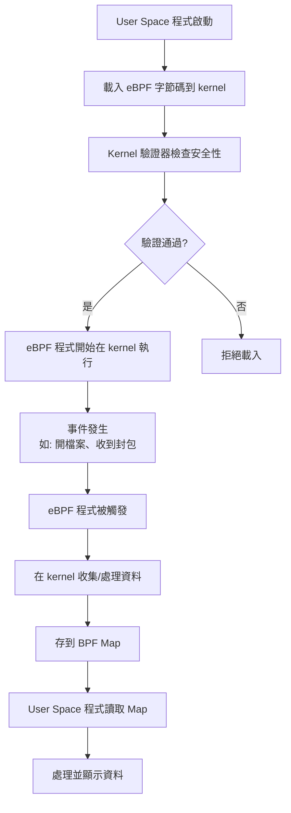

# eBPF 完整解析指南

## 目錄
- [什麼是 eBPF？](#什麼是-ebpf)
- [為什麼 eBPF 這麼受歡迎？](#為什麼-ebpf-這麼受歡迎)
- [eBPF 的應用領域](#ebpf-的應用領域)
- [語言層次架構](#語言層次架構)
- [Kernel eBPF vs User Space 程式](#kernel-ebpf-vs-user-space-程式)
- [實際運作流程](#實際運作流程)
- [為什麼要這樣設計？](#為什麼要這樣設計)

## 什麼是 eBPF？

eBPF (Extended Berkeley Packet Filter) 是 Linux 內核的一個革命性功能，可以想像成**「內核的安全插件系統」**。

### 傳統方式 vs eBPF

**傳統修改內核行為：**
1. 修改內核原始碼
2. 重新編譯內核
3. 重新啟動系統
4. 祈禱不會當機

**使用 eBPF：**
- ✅ 在系統運行時動態載入程式
- ✅ 不需要重啟
- ✅ 有驗證器保證安全
- ✅ 不會讓系統崩潰

> 💡 **簡單比喻**：如果 Linux 內核是電腦的「大腦」，eBPF 就像是可以安全植入大腦的「小助手程式」，能在最底層觀察和修改系統行為。

## 為什麼 eBPF 這麼受歡迎？

eBPF 能在內核層（最底層）工作，因此具有極高的效率和強大的功能。

### 主要優勢

1. **超高效能**：在內核層處理，避免資料複製
2. **安全性**：有驗證器確保不會搞壞系統  
3. **即時性**：不用重啟就能載入新功能
4. **可程式化**：能依需求客製化行為

### 採用企業

Netflix、Facebook、Google、Cloudflare 等大型企業都在使用 eBPF 解決各種問題。

## eBPF 的應用領域

### 1. 網路處理（最熱門）

#### 防火牆/DDoS 防護
```c
// 在網路卡收到封包的瞬間就能決定要不要丟掉
int firewall(struct xdp_md *ctx) {
    struct iphdr *ip = parse_ip_header(ctx);
    if (ip->saddr == BLOCKED_IP) {
        return XDP_DROP;  // 直接丟掉，超快！
    }
    return XDP_PASS;
}
```

#### 負載平衡
- Facebook 的 **Katran**
- Cloudflare 的負載平衡器
- 每秒處理數百萬個請求

#### 容器網路
- **Cilium**：Kubernetes 網路管理
- 比傳統 iptables 快很多

### 2. 系統監控和追蹤

#### 效能分析
```c
// 追蹤函式執行時間
int measure_function(struct pt_regs *ctx) {
    u64 timestamp = bpf_ktime_get_ns();
    bpf_map_update(&start_times, &pid, &timestamp);
    return 0;
}
```

#### 安全監控
- **Falco**：雲原生運行時安全
- **Tracee**：運行時安全和取證工具
- 即時偵測可疑行為

### 3. 可觀測性

- **Pixie**：Kubernetes 可觀測性
- **Hubble**：網路和安全可觀測性
- 不需要改程式碼就能收集指標

## 語言層次架構

### 三層架構圖

```
┌─────────────────────────────────────────┐
│         第三層：User Space               │
│   控制程式（Python/Go/Rust/C++等）        │
│   - 載入 eBPF 程式                       │
│   - 讀取收集的資料                        │
│   - 顯示結果給使用者                      │
└─────────────────────────────────────────┘
                    ↓ 
              系統呼叫 bpf()
                    ↓
═══════════════════════════════════════════
┌─────────────────────────────────────────┐
│         第二層：eBPF 程式                │
│   用 C/Rust 寫的程式                     │
│   - 在內核中執行                         │
│   - 收集資料、過濾、決策                  │
└─────────────────────────────────────────┘
                    ↓
              編譯（LLVM/Clang）
                    ↓
┌─────────────────────────────────────────┐
│         第一層：eBPF 字節碼              │
│   類似組合語言的低階指令                  │
│   內核只認識這個                         │
└─────────────────────────────────────────┘
```

### 各語言的角色

| 語言 | 可以寫 Kernel eBPF | 可以寫 User Space 控制程式 | 說明 |
|------|-------------------|------------------------|------|
| **C** | ✅ | ✅ | 最原生的方式 |
| **Rust** | ✅ (via Aya) | ✅ | 新興選擇，更安全 |
| **Go** | ❌ | ✅ | 只能控制，不能進 kernel |
| **Python** | ❌ | ✅ | 透過 BCC 控制 |
| **JavaScript** | ❌ | ✅ | 可以控制但少見 |
| **Java** | ❌ | ✅ | 可以控制但少見 |

## Kernel eBPF vs User Space 程式

這是兩個**完全不同**的程式！

### 完整範例：檔案監控工具

#### Part 1: Kernel eBPF 程式（C 語言）

```c
// trace_open.c - 在 kernel 裡執行
#include <linux/bpf.h>
#include <linux/ptrace.h>

// 定義共享的 Map
struct {
    __uint(type, BPF_MAP_TYPE_HASH);
    __uint(max_entries, 1024);
    __type(key, u32);
    __type(value, u64);
} open_count SEC(".maps");

// 當有程式呼叫 open() 時觸發
SEC("kprobe/sys_open")
int trace_open(struct pt_regs *ctx) {
    u32 pid = bpf_get_current_pid_tgid() >> 32;
    u64 *count, init_val = 1;
    
    count = bpf_map_lookup_elem(&open_count, &pid);
    if (count) {
        (*count)++;
    } else {
        bpf_map_update_elem(&open_count, &pid, &init_val, BPF_ANY);
    }
    
    return 0;
}
```

#### Part 2: User Space 控制程式（多種語言）

**Python 版本：**
```python
#!/usr/bin/env python3
# monitor.py - 在使用者空間執行
from bcc import BPF
import time

# 載入 eBPF 程式到 kernel
b = BPF(src_file="trace_open.c")

print("監控檔案開啟中... Ctrl+C 結束")

while True:
    time.sleep(1)
    
    # 從 kernel 的 map 讀取資料
    open_count = b["open_count"]
    
    print("\n=== 檔案開啟統計 ===")
    for pid, count in open_count.items():
        print(f"PID {pid.value}: 開啟了 {count.value} 次檔案")
    
    open_count.clear()
```

**Go 版本：**
```go
// monitor.go - 在使用者空間執行
package main

import (
    "fmt"
    "time"
    "github.com/cilium/ebpf"
)

func main() {
    // 載入編譯好的 eBPF 程式
    spec, _ := ebpf.LoadCollectionSpec("trace_open.o")
    coll, _ := ebpf.NewCollection(spec)
    
    // 取得 map 的參考
    openCount := coll.Maps["open_count"]
    
    for {
        time.Sleep(1 * time.Second)
        
        var pid uint32
        var count uint64
        iter := openCount.Iterate()
        
        fmt.Println("\n=== 檔案開啟統計 ===")
        for iter.Next(&pid, &count) {
            fmt.Printf("PID %d: 開啟了 %d 次檔案\n", pid, count)
        }
    }
}
```

### 關鍵差異比較

| 特性 | **Kernel eBPF 程式** | **User Space 控制程式** |
|-----|---------------------|------------------------|
| **執行位置** | Kernel 內部 | 一般使用者空間 |
| **語言選擇** | 只能 C/Rust | 任何語言 |
| **功能** | 收集資料、過濾、決策 | 載入、管理、顯示 |
| **限制** | 超嚴格（見下方） | 一般程式，無特殊限制 |
| **大小** | 很小（KB 等級） | 可以很大 |
| **權限** | 需要 root 或 CAP_BPF | 載入時需要權限 |

### Kernel eBPF 程式的限制

⚠️ **重要限制：**
- ❌ 不能有無限迴圈
- ❌ 不能動態分配記憶體
- ❌ 不能呼叫任意函式
- ❌ 程式大小有限制（最大 1MB）
- ❌ 必須在有限步驟內結束
- ✅ 只能用特定的 BPF 輔助函式

## 實際運作流程



## 為什麼要這樣設計？

### 1. 安全性考量
- Kernel 崩潰 = 整個系統掛掉
- 必須嚴格限制能在 kernel 執行的程式碼
- 驗證器確保 eBPF 程式絕對安全

### 2. 效能考量
- Kernel 程式必須極快
- 不能有 GC 暫停
- 不能有動態記憶體分配

### 3. 分工明確
| 元件 | 職責 | 比喻 |
|-----|------|------|
| **Kernel eBPF** | 快速、即時的資料收集 | 現場的間諜 |
| **User Space** | 資料分析、視覺化、儲存 | 指揮中心 |

## 主要框架和工具

### BCC (BPF Compiler Collection)
最流行的框架，支援 Python 和 C：
```python
from bcc import BPF

# 混合 Python 和 C
b = BPF(text="""
    int hello(void *ctx) {
        bpf_trace_printk("Hello World\\n");
        return 0;
    }
""")
```

### libbpf
原生 C 函式庫，最接近底層：
```c
struct bpf_object *obj;
obj = bpf_object__open("program.o");
bpf_object__load(obj);
```

### Aya (Rust)
純 Rust 實現，型別安全：
```rust
use aya::{Bpf, programs::KProbe};

let mut bpf = Bpf::load_file("program.o")?;
let program: &mut KProbe = bpf.program_mut("trace_open")?;
program.attach("sys_open", 0)?;
```

## BCC vs CO-RE 框架詳細比較

這是一個很好的問題！讓我解釋一下 BCC 和這些 CO-RE 框架之間的主要差異：

### BCC 確實是框架，但有重要區別

#### **BCC (BPF Compiler Collection)**
BCC 是一個 eBPF 開發框架，但它採用的是**執行時編譯**模式：

**特點：**
- **執行時編譯**：在目標機器上即時編譯 eBPF 程式
- **需要核心標頭檔**：必須在目標系統上安裝 kernel headers
- **依賴較重**：需要 LLVM/Clang 工具鏈（通常超過 100MB）
- **Python/C++ 前端**：主要透過 Python 撰寫控制邏輯
- **便於快速原型開發**：程式碼簡單，適合學習和實驗

**BCC 的工作流程：**
```
開發機器                     目標機器
   │                           │
   └──── Python/C 程式 ────────┤
                               │
                               ├─> 載入時編譯 eBPF 程式
                               ├─> 需要 kernel headers
                               ├─> 需要 LLVM/Clang
                               └─> 執行
```

#### **CO-RE 框架（libbpf 等）**
CO-RE（Compile Once, Run Everywhere）是一種新的開發模式：

**特點：**
- **預編譯**：開發時編譯一次，產生可攜式的二進位檔案
- **無需核心標頭檔**：執行時不需要 kernel headers
- **輕量級部署**：只需要很小的執行時函式庫（幾 MB）
- **BTF 依賴**：利用核心的 BTF（BPF Type Format）資訊實現可攜性
- **生產環境友善**：適合大規模部署

**CO-RE 的工作流程：**
```
開發機器                     目標機器
   │                           │
   ├─> 編譯 eBPF 程式          │
   ├─> 產生 .o 檔案            │
   └──── 二進位檔案 ──────────┤
                               │
                               ├─> 直接載入
                               ├─> 使用 BTF 重定位
                               ├─> 只需小型 libbpf
                               └─> 執行
```

### 主要差異對比

| 特性 | BCC | CO-RE (libbpf等) |
|------|-----|------------------|
| **編譯時機** | 執行時編譯 | 開發時預編譯 |
| **部署依賴** | 需要 kernel headers + LLVM | 只需小型執行時函式庫 |
| **可攜性** | 差（依賴目標系統環境） | 好（一次編譯，到處執行） |
| **啟動速度** | 慢（需要編譯） | 快（直接載入） |
| **資源佔用** | 大（100MB+） | 小（幾MB） |
| **生產部署** | 不理想 | 理想 |
| **開發難度** | 簡單 | 相對複雜 |
| **核心版本要求** | 較低（3.15+） | 較高（5.2+ 建議） |

### 實際程式碼比較

**BCC 範例：**
```python
from bcc import BPF

# eBPF 程式直接嵌入 Python 字串中
prog = """
int trace_open(struct pt_regs *ctx) {
    bpf_trace_printk("File opened\\n");
    return 0;
}
"""

# 執行時編譯
b = BPF(text=prog)
b.attach_kprobe(event="sys_open", fn_name="trace_open")
```

**CO-RE (libbpf) 範例：**
```c
// trace_open.bpf.c - 預先編譯
#include <vmlinux.h>
#include <bpf/bpf_helpers.h>

SEC("kprobe/sys_open")
int trace_open(struct pt_regs *ctx) {
    bpf_printk("File opened\n");
    return 0;
}

// 編譯命令：
// clang -O2 -target bpf -c trace_open.bpf.c -o trace_open.bpf.o
```

```c
// loader.c - 載入程式
#include <bpf/libbpf.h>

int main() {
    struct bpf_object *obj;
    
    // 直接載入預編譯的 .o 檔案
    obj = bpf_object__open_file("trace_open.bpf.o", NULL);
    bpf_object__load(obj);
    // ...
}
```

### 各框架的定位

- **libbpf**：官方 C 函式庫，CO-RE 的基礎
- **Cilium/ebpf**：Go 語言的 CO-RE 框架
- **libbpf-rs**：Rust 語言的 libbpf 綁定
- **eunomia-bpf**：簡化的 eBPF 開發框架，支援多語言
- **Aya**：純 Rust 實現，支援 CO-RE

### 選擇建議

**使用 BCC 的場景：**
- 🎓 學習和實驗 eBPF
- 🔧 快速原型開發
- 🐛 開發環境中的調試工具
- 📊 一次性的系統分析任務

**使用 CO-RE 的場景：**
- 🏭 生產環境部署
- 📦 容器/雲原生環境
- 🔒 安全產品開發
- 📱 嵌入式系統
- 🚀 需要快速啟動的場景

### 遷移路徑

如果你已經使用 BCC，想要遷移到 CO-RE：

1. **評估核心版本**：確保目標系統支援 BTF（5.2+）
2. **選擇框架**：根據你的語言偏好選擇 libbpf/Cilium/Aya
3. **重寫 eBPF 程式**：將 BCC 的內嵌 C 程式碼獨立出來
4. **調整載入邏輯**：使用新框架的 API 載入預編譯程式
5. **測試可攜性**：在不同核心版本上測試

簡單來說，BCC 像是「直譯式語言」，而 CO-RE 像是「編譯式語言」。兩者都是框架，但設計理念和使用場景有很大差異。選擇哪個取決於你的具體需求：如果是學習或快速實驗，BCC 是很好的起點；如果是生產部署，CO-RE 是更好的選擇。

## 總結

eBPF 是一項革命性的技術，它讓我們能夠：
1. **安全地**擴展內核功能
2. **高效地**處理網路和系統事件
3. **靈活地**觀察和修改系統行為

透過嚴格的限制和驗證機制，eBPF 在提供強大功能的同時保證了系統安全性，這就是為什麼它成為現代 Linux 系統中不可或缺的技術。

---

📚 **延伸閱讀：**
- [ebpf.io](https://ebpf.io/) - eBPF 官方網站
- [Cilium BPF Reference Guide](http://docs.cilium.io/en/latest/bpf/) - 深入的 eBPF 文檔
- [Brendan Gregg's eBPF Page](https://www.brendangregg.com/ebpf.html) - 效能分析大師的 eBPF 資源
