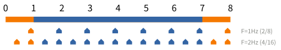
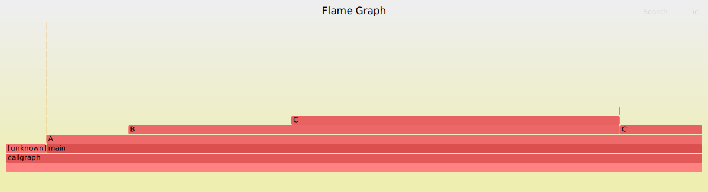

# 運用 Perf 分析程式效能並改善

## 簡介
在對程式進行最佳化之前，必須先測量其執行狀況，才能有針對性地解決效能問題。[Perf](https://perfwiki.github.io/) 的全名為 Performance Event，是一款自 Linux v2.6.31 起內建於系統中的效能分析工具，並隨核心一同釋出。透過 Perf，使用者可藉由 PMU (Performance Monitoring Unit)、tracepoint，以及核心內部的特殊計數器 (counter) 來收集效能資料，並能同時分析運行中的核心程式碼，從而全面掌握應用程式的效能瓶頸。

與 [OProfile](https://en.wikipedia.org/wiki/OProfile) 和 [GProf](https://sourceware.org/binutils/docs/gprof/) 相比，Perf 的優勢在於其與 Linux 核心的緊密結合，並且能充分利用核心中的最新功能特性。Perf 的運作原理是透過對目標進行取樣，記錄在特定條件下事件的發生與發生次數。例如，Perf 可根據 tick 中斷進行取樣，在每次 tick 中斷時觸發取樣點，並記錄行程 (process) 在該時間點的執行上下文 (context)。如果一個行程 90% 的時間花費在函式 `foo()` 上，那麼大約 90% 的取樣點便會集中在函式 `foo()` 的執行上下文中。

Perf 支援多種事件的取樣，包括硬體事件 (Hardware events)，如 cpu-cycles, instructions, cache-misses, branch-misses 等；軟體事件 (Software events)，如 page-faults, context-switches 等；及 Tracepoint 事件。藉由這些資料，我們可深入分析程式效能問題。例如，藉由 cpu-cycles 和 instructions，可計算每個 cycle 執行的指令數 (instruction per cycle)，進一步判斷程式碼是否充分利用 CPU 資源。cache-misses 可以揭示程式是否妥善利用了 Locality of reference；而 branch-misses 過多則可能導致嚴重的 pipeline hazard。此外，Perf 還能針對特定函式進行取樣，精確定位效能瓶頸所在的程式碼位置，為問題的解決提供關鍵依據。

## 使用 perf_events 分析程式效能
> 修改自[羅根學習筆記](https://zh-blog.logan.tw/2019/07/10/analyze-program-performance-with-perf-events/)

### perf_events
`perf_events` 是 Linux 核心內建的系統效能分析工具。`perf_events` 一開始的主要功能是存取硬體效能計數器，所以最早的名字是 Performance Counters for Linux (PCL)。隨著功能不斷擴充，`perf_events` 能處理的事件來源已經不限於硬體效能計數器，所以改名為 `perf_events`。

有時候 `perf_events` 也被簡稱為 Perf。然而因為 Perf 作為一個單字是難以搜尋的常見字𢑥，所以 [Vince Weaver](https://web.eece.maine.edu/~vweaver/projects/perf_events/) 與 [Brendan Gregg](https://www.brendangregg.com/) 通常使用 `perf_events` 稱呼這套工具。

`perf_events` 這套工具分為三個部分：
* 在 User Space 的 `perf` 命令
* 在 Kernel Space 負責處理和儲存事件記錄的機制
* 在 Kernel Space 的事件來源：硬體效能計數器、中斷、Page Fault、系統呼叫、KProbe、UProbe、FTrace、Trace Point 等等。

如果負載大多數時間都在執行狀態（**CPU-bound 負載**），最常使用的事件來源是硬體效能計數器。如果負載要花不少時間從硬碟或網路讀寫資料（**IO-bound 負載**）或者是要和其他負載共用特定資源（例如：Mutex、Semaphore 等），則建議改用 FTrace、Trace Point、KProbe 與 UProbe 等事件來源。

### 取樣測量
取樣測量的基本概念就是透過記錄下來的樣本回推程式的真實狀況。以下圖為例，假設上方的長條圖是各個函式的執行時間，下方的五邊型是取樣記錄。圖中，分別以 1 Hz 與 2 Hz 的頻率取樣。我們可從樣本的比例，大約知道 25% 的時間是花費在橘色函式，75% 的時間是花費在藍色函式。

取樣測量最大的優點就是**測量過程的額外負擔可透過取樣頻率調整**。使用者可選用適當的取樣頻率，降低觀察者效應的影響，進而減少測量誤差。如果想要測量的事件數量超過一定的數量級，又沒有外部裝置能記錄事件，通常就只能採用取樣測量。

取樣測量的準確度主要受二個因素影響：**樣本的代表性**與**樣本的數量**。

樣本的代表性可再分為二個層面：樣本是否均勻的分散在總體執行時間、取樣頻率是否會剛好和觀察對象本身的週期同調（Lockstep）。關於前者，Linux 核心的預設行為就是儘可能均勻地取樣，所以使用者不用太擔心。後者則能透過指定不同的目標頻率來減少發生的機會。常用的頻率是 97、997、9973 等質數。

從樣本數量來看，取樣頻率頻率的高低也會影響精準度。一般而言，取樣頻率要比「重要事件的發生頻率」還高才能從樣本觀察到這個重要事件。然而取樣率越高，額外負擔也越高，觀察者效應也越顯著，所以我們必須選定一個適當的頻率。

以下圖為例，假設第 1 列 (Real Events) 是所有發生過的事件。第 2 列是頻率為 1 Hz 的樣本。第 3 列是頻率為 4 Hz 的樣本，其中空心圈代表該時段沒有樣本。如果只看第 2 列，我們會誤以為事件均勻地分部於橘色與藍色函式。然而，第 3 列告訴我們橘色函式產生的事件並不多。大多數的事件是藍色函式產生的。

另外，受限於實作，`perf_events` 的取樣頻率的上限大約是 10,000 Hz（數量級）。這個數值可透過 `/proc/sys/kernel/perf_event_max_sample_rate` 修改。但是如果 Linux 核心在取樣過程中發現整個系統無法支撐指定的取樣頻率，Linux 核心會自動降低取樣頻率。

取樣測量也有它的缺點。其中一個是取樣測量通常以執行時間作為母體。所以比較不容易觀察到輸入輸出或同步造成的效能問題。其二是取樣測量的基本理論是以統計樣本次數回推真實的行為，我們難以從樣本回推真實各種事件的順序。如果效能問題和事件發生的順序有關，取樣測量比較沒有辦法告訴我們問題的來源。雖然有上述問題，取樣測量還是很好的效能測量方法。它的低額外負擔和可指定取樣頻率還是讓它成為效能測量的首選。

### 硬體效能計數器
許多 CPU 會內建**效能監控單元**（Performance Monitoring Unit）有時候簡記為 PMU。它能提供 Cycles、Instructions Retired、Cache Misses、L1 I-Cache Load Misses、L1 D-Cache Load Misses、Last Level Cache Misses 等重要資訊。

因為一般的手機或桌上型電腦 CPU 的時脈大約是 1.8-2.3 GHz，事件發生的頻率可能也是以 GHz 為單位，所以 CPU 內建的 PMU 通常是若干個[效能計數器](https://en.wikipedia.org/wiki/Hardware_performance_counter)（Performance Counter）取樣指定事件。在開始測量效能前，使用者（或作業系統）可為每個效能計數器設定一個週期（Period）。在測量過程中，每當指定事件發生時，效能計數器就會減 1。當效能計數器減到 0 的時候，效能計數器就會觸發中斷，然後作業系統的中斷處理程序就會記錄當時的狀況。

雖然從硬體設計的角度來看，以週期取樣比較容易實作，然而對於使用者而言，將取樣點平均分散在整個程式的執行時間是較常使用的取樣方式。以下圖的極端例子舉例，如果週期固定是 4，只有第 1 個時間間隔會有樣本。比較理想的方式是將取樣點分散在 4 個時間間隔。

`perf_events` 可讓使用者以一個目標頻率（Frequency）取樣指定事件，實作原理是讓 Linux 核心自動地調整週期。如果上個時間間隔內有太多事件樣本，則提高週期；反之，如果上個時間間隔內的事件樣本過少，則減少週期。以下圖為例，假設以 1 Hz 為目標頻率，`perf_events` 可能會先假設週期為 3，並在第 1 個時間間隔取得一個樣本。然而在第 2 秒結束時，`perf_events` 會發現它錯過一個樣本，因此將週期下調為 1。下調週期後，第 3 與 4 時間間隔就能順利取得樣本。


在物理學的用語中，一個波的週期（每次需要多少秒）和頻率（每秒需要多少次）互為倒數，不過在 `perf_events` 這套工具內，它們分別指稱不同的東西：
* **週期**指的是從「開始」到「記錄樣本」之間，事件的發生次數。
* **目標頻率**指的是 `perf_events` 每秒應該要剛好取得多少樣本。

週期與目標頻率的關係如下圖所示。灰色為所有發生過的事件。黑色為記錄到的事件樣本（共 4 個）。因為目標頻率為 4 Hz，所以 `perf_events` 每 0.25 秒可設定不同的週期。下圖的週期依序為 4 個、3 個、1 個、2 個事件。

另外，效能計數器的統計次數有時候會落在「觸發事件的指令」的後方。稍後的例子中，有些 L1 Data Cache Miss 會被記錄在 `add` 與 `cmp` 二個只使用暫存器的指令上。這個現象在 Intel 技術文件中被稱為 `Skid`（滑行）。以開車類比，就像是踩下煞車後，車子還會滑行一小段距離。這是因為高速 CPU 通常都有比較多層的 Pipeline、一道指令通常會再拆分為多個 Micro-Ops（微指令）、再加上 Out-of-Order Execution （亂序執行）會先執行準備就緒的 Micro-Ops，CPU 要準確地追蹤「觸發事件的指令」要花費不少成本（下圖為示意圖），因此部分事件會被記錄在稍後的指令。使用者在解讀事件數量的時候，務必要考慮 Skid 現象。

最後，效能計數器的數量是有限的。部分效能計數器有時會有指定用途，使得通用效能計數器（General-purpose Performance Counter）又更少了。如果同時測量過多的事件種類，Linux 會以分時多工的方式共用同一個效能計數器。因為這會稍微影響精確度，所以應盡可能減少非必要的事件種類。

### 準備工作
本文後半部會介紹如何使用 `perf_events` 找出簡單矩陣乘法的問題。但在此之前，我們必需先安裝 perf 命令並取得一些重要的參考資料。

#### 安裝

```shell
$ sudo apt-get update
```

在 Debian 上，執行以下命令安裝 `perf` 命令：
```shell
$ sudo apt-get install linux-perf
```

在 Ubuntu 上，執行以下命令安裝 `perf` 命令：
```shell
$ sudo apt-get install \
    linux-tools-generic linux-tools-$(uname -r)
```

備註：`perf` 命令會隨著 Linux 核心版本而有所變動，所以上面的命令同時安裝 `linux-tools-generic` 與 `linux-tools-$(uname -r)`。其中的 `$(uname -r)` 會被代換為使用中的 Linux 核心版本。如果你更新了 Ubuntu 的 Linux 核心，`perf` 命令可能會印出以下錯誤訊息。重新執行以上命令即可解決問題。

```shell
$ sudo perf
WARNING: perf not found for kernel 4.18.0-25

  You may need to install the following packages for this
  specific kernel:
    linux-tools-4.18.0-25-generic
    linux-cloud-tools-4.18.0-25-generic

  You may also want to install one of the following packages to
  keep up to date:
    linux-tools-generic
    linux-cloud-tools-generic
```

若在未切換到 root 的情況下，執行 `perf top` 命令，可能會遇到以下錯誤畫面：


或者：


這是因為 `kernel.perf_event_paranoid` 用來決定在沒有 root 權限的情況下 (即一般使用者)，你可使用 Perf 取得哪些事件資料 (event data)。該參數的預設值為 `1`，可用以下命令查看目前的權限設定：
```shell
$ cat /proc/sys/kernel/perf_event_paranoid
```  

若需要修改設定，可藉由以下命令調整：
```shell
$ sudo sysctl kernel.perf_event_paranoid=<parameter>
```  

該參數的權限值共有四種設定，分別如下：
- **`2`**：不允許執行任何效能量測。但某些用於查看或分析現有紀錄的命令仍然可使用，例如 `perf ls`, `perf report`, `perf timechart`, `perf trace`
- **`1`**：不允許取得 CPU 事件資料 (CPU events data)，但可用 `perf stat`, `perf record` 並取得 Kernel profiling 資料
- **`0`**：不允許存取原始 tracepoint，但可使用 `perf stat`、`perf record` 並取得 CPU 事件資料。
- **`-1`**：開放所有權限，無限制

此外，若需要檢測 cache miss 等事件，還需取消 kernel pointer 的限制，可執行以下命令：
```shell
$ sudo sh -c "echo 0 > /proc/sys/kernel/kptr_restrict"
```  

### 常用命令概覽
`perf` 命令有很多子命令（sub-command）。本文只涵蓋以下 4 個重要命令：

| 命令                          | 說明                                                  |
| ----------------------------- | ----------------------------------------------------- |
| `perf list` | 列出 Linux 核心與硬體支援的事件種 類。 |
| `perf stat [-e [events]] [cmd]` | 執行指定程式。執行結束後，印出各 事件的總體統計數據。 <br> (選項 `-e` 用以指定要測量的 事件種類。各事件種類以 `,` 分隔。) |
| `perf record [-e [events]] [-g] [cmd]` | 執行指定程式。執行過程中，取樣並記 錄各事件。這個命令能讓我們能大略 知道事件的發生地點。<br>(選項 `-e` 用以指定要測量的事件種類。各事件種類以 , 分隔；選項 `-g` 讓 `perf record` 在記錄事件時，同時記錄取樣點的 Stack Trace；選項 `-o` 用以指定一個檔案名稱作為事件記錄儲存位置。預設值為 `perf.data`) |
| `perf report [-g graph,0.5,caller]` | 讀取 perf record 的記錄。 <br> (選項 `-g` 用以指定樹狀圖的繪製方式。 `graph,0.5,caller` 代表以 呼叫者（Caller）作為親代節點，以被呼叫者（Callee）作為子節點。這是最新版 `perf` 命令的預設值；選項 `-i` 用以指定一個檔案名稱作為事件記錄讀取來源。預設值為 `perf.data`。) |

備註：若測量標的沒有安全疑慮，以上所有命令都建議透過 `sudo` 執行。

### 背景知識

在分析效能問題時，基礎背景知識不可或缺。例如硬體層面的快取 (cache) 機制或作業系統核心的運作原理。應用程式的行為往往會與這些底層機制互相影響，而這些機制則可能以意想不到的方式左右效能表現。例如，某些程式因無法充分利用快取而導致性能下降，或者因不必要地執行過多系統呼叫，造成頻繁的核心與使用者層級切換，進而影響效率。這些內容僅為後續討論效能調校做簡要概述，實際上效能最佳化的範疇還涉及更多技術細節。

雖然記憶體存取速度很快，但與微處理器執行指令的速度相比仍顯得緩慢。為了從記憶體中讀取指令和資料，微處理器需要等待，而在微處理器的時鐘頻率中，這種等待時間顯得尤為漫長。快取是種高速靜態記憶體（SRAM），其存取速率非常接近微處理器的運行速度。將常用的資料儲存在快取中，能大幅減少微處理器的等待時間，從而提升效能。由於快取的容量通常較小，如何有效利用快取是提升軟體效能的重要環節。

提升效能最有效的方式之一是利用平行化（Parallelism）。微處理器的設計中大量提高平行程度，例如管線化 (pipeline)、超純量 (superscalar) 和亂序執行 (out-of-order execution)。

管線化是指將指令處理過程分成多個步驟，例如從記憶體取指令（fetch）、執行運算（execute）、將結果輸出到匯流排（bus）等，分別由不同的硬體單元負責。在三級管線化的情況下，微處理器可以在一個時鐘週期內同時處理三條指令，分別處於管線化的不同階段，如下圖：


超純量架構則進一步提升效能，允許一個時鐘週期內觸發（issue）多條指令。例如，Intel Pentium 微處理器內部有二個執行單元，可同時處理兩條指令，這被稱為 dual-issue。

不同的微處理器架構可能因設計簡化而存在差異。例如 Arm [Cortex-A5](https://developer.arm.com/Processors/Cortex-A5) 相較於 Cortex-A8 和 Cortex-A9，是 Armv7-A 指令集的精簡實作，其差異包括：
1. Pipeline 從 13 階段縮減為 8 階段
2. Instruction 從 dual-issue 減為 single-issue
3. NEON/FPU 成為可選的特徵
4. 無 L2 Cache

此外，亂序執行是微處理器為充分利用管線化資源而採用的技術。由於不同指令的執行時間不同，若嚴格按照程式的執行順序，Pipeline 的效率可能無法最大化。因此，微處理器允許指令以亂序方式執行，只要相鄰指令之間不存在依賴關係即可。若某指令需要等待前一條指令的運算結果，管線就會停頓，影響效能。良好的程式設計應儘量避免這類情況的發生。

Branch Prediction 是影響效能的重要因素，尤其是在採用 Pipeline 設計的微處理器中。例如，若 pipeline 的第一級執行的是分支(branch) 指令，若分支判定結果導致跳躍到其他指令，Pipeline 已讀取的後續指令便需棄置，導致效能損失。

Branch Prediction 的硬體機制透過歷史記錄預測下一條可能的指令，而非按照指令的順序讀取。對於具有固定模式的分支指令，Branch Prediction 通常能取得較高的命中率，但對於像 `switch`-`case` 這類結構，預測效果則較差。

延伸閱讀: [現代處理器設計：原理和關鍵特徵](https://hackmd.io/@sysprog/cpu-basics)

#### 程式碼
`perf_events` 一直有很多改動，因此相關資料一直不是很齊全。有時說明文件還會和最新版的 `perf_events` 有細微差異。所以如果使用 `perf_events` 的過程中遇上任何問題，最終還是要從程式碼尋找答案。`perf_events` 的程式碼存放於 Linux 核心的 Git 版本庫。可用以下命令取得所有程式碼與開發記錄：
```shell
$ git clone git://git.kernel.org/pub/scm/linux/kernel/git/torvalds/linux.git
```

以下列出幾個重點檔案與目錄：
* [tools/perf](https://git.kernel.org/pub/scm/linux/kernel/git/torvalds/linux.git/tree/tools/perf) 包含 perf 命令的程式碼與說明文件。
* [tools/perf/design.txt](https://git.kernel.org/pub/scm/linux/kernel/git/torvalds/linux.git/tree/tools/perf/design.txt) 包含 perf 命令與 Linux 核心之間的介面。
* [kernel/events](https://git.kernel.org/pub/scm/linux/kernel/git/torvalds/linux.git/tree/kernel/events) 包含 perf_events 的框架。可在這裡找到 Linux 核心怎麼取樣事件、怎麼處理記錄。
* [kernel/trace](https://git.kernel.org/pub/scm/linux/kernel/git/torvalds/linux.git/tree/kernel/trace) 包含 Linux 追蹤框架的實作。
* [include/trace](https://git.kernel.org/pub/scm/linux/kernel/git/torvalds/linux.git/tree/include/trace) 包含 Linux 追蹤框架的標頭檔案。
* [include/uapi/linux/perf_event.h](https://git.kernel.org/pub/scm/linux/kernel/git/torvalds/linux.git/tree/include/uapi/linux/perf_event.h) 包含許多 perf_events 常數。
* [arch/x86/events/intel](https://git.kernel.org/pub/scm/linux/kernel/git/torvalds/linux.git/tree/arch/x86/events/intel) 包含 Intel CPU 的效能計數器實作。另外，也能在這個目錄找到「事件名稱」和「硬體事件編號」的對應表，以便查尋 Intel 的處埋器架構手冊。
* [arch/x86/events/amd](https://git.kernel.org/pub/scm/linux/kernel/git/torvalds/linux.git/tree/arch/x86/events/amd) 包含 AMD CPU 的效能計數器實作。
* [arch/arm64/kernel/perf_event.c](https://git.kernel.org/pub/scm/linux/kernel/git/torvalds/linux.git/tree/arch/arm64/kernel/perf_event.c) 包含 AArch64 CPU 的效能計數器實作。

#### 處理器架構手冊
效能計數器大多和 CPU 的設計緊密結合，每個產品線或微架構常會有細微的差異。因此手邊有一份處理器架構手冊便是很重要的事。以下僅列出一些常見 CPU 的處理器架構手冊：
* Intel x86
    * [Intel 64 and IA-32 Architectures Software Developer Manuals](https://software.intel.com/en-us/articles/intel-sdm) 第三部第 18 章 Performance Monitoring 與第 19 章 Performance Monitoring Events
    * [Intel Processor Event Reference](https://download.01.org/perfmon/index/)
* AMD x86-64
    * [AMD64 Architecture Programmer's Manual Volume 2: System Programming](https://developer.amd.com/resources/developer-guides-manuals/) 第 17 章 Hardware Performance Monitoring and Control
* ARM AArch64
    * [Armv8-M Architecture Reference Manual](http://infocenter.arm.com/help/index.jsp?topic=/com.arm.doc.ddi0553b.g/index.html) 第 B14 章 The Performance Monitoring Unit Extension Control

### 牛刀小試
以下以「計算圓周率」為例，說明 perf 的使用。
- [ ] `perf_top_example.c`
```c
#include <stdio.h>
#include <unistd.h>
double compute_pi_baseline(size_t N)
{
    double pi = 0.0;
    double dt = 1.0 / N;
    for (size_t i = 0; i < N; i++) {
        double x = (double) i / N;
        pi += dt / (1.0 + x * x);
    }
    return pi * 4.0;
}
int main()
{
    printf("pid: %d\n", getpid());
    sleep(10);
    compute_pi_baseline(50000000);
    return 0;
}
```

將上述程式存檔為 `perf_top_example.c`，避免程式太快執行完，我們可指定在背景執行，如此才能透過 `perf top` 進行分析，執行太快來不及可以加：
```shell
$ gcc -std=c99 -c perf_top_example.c
$ gcc perf_top_example.o -o example
$ ./example &
```

執行上述程式後，可以取得一個 pid 值，再根據 pid 輸入 
```shell
$ perf top -p $pid
```

應該會得到類似下面的結果：


預設的 performance event 是 "cycles"，所以這條命令可分析出消耗 CPU 週期最多的部份，結果顯示函式 `compute_pi_baseline()` 佔了近 99.9％，符合預期，此函式是程式中的「熱點」。

### 測量矩陣相乘程式效能
:::spoiler 實驗環境
```shell
$ cat /etc/os-release
VERSION_ID="24.04"
VERSION="24.04.1 LTS (Noble Numbat)"
VERSION_CODENAME=noble

$ lscpu
Architecture:             x86_64
CPU op-mode(s):         32-bit, 64-bit
Address sizes:          46 bits physical, 48 bits virtual
Byte Order:             Little Endian
CPU(s):                   24
On-line CPU(s) list:    0-23
Vendor ID:                GenuineIntel
Model name:             13th Gen Intel(R) Core(TM) i7-13700

$ gcc --version
gcc (Ubuntu 13.3.0-6ubuntu2~24.04) 13.3.0
```
:::

以下提供簡單的矩陣相乘程式 [matrix-v1.c](https://zh-blog.logan.tw/static/sourcecode/2019/07/10/matrix-v1.c)：
```c
#include <stdio.h>
#include <stdlib.h>
#include <string.h>
#include <stdint.h>

#define N 1024
#define NUM_ROUNDS 5

static int32_t a[N][N];
static int32_t b[N][N];
static int32_t c[N][N];

__attribute__((noinline))
static void load_matrix() {
    FILE *fp = fopen("input.dat", "rb");
    if (!fp) {
        abort();
    }
    if (fread(a, sizeof(a), 1, fp) != 1) {
        abort();
    }
    if (fread(b, sizeof(b), 1, fp) != 1) {
        abort();
    }
    fclose(fp);
}

__attribute__((noinline))
static void mult() {
    size_t i, j, k;
    for (i = 0; i < N; ++i) {
        for (j = 0; j < N; ++j) {
          for (k = 0; k < N; ++k) {
            c[i][j] += a[i][k] * b[k][j];
          }
        }
    }
}

__attribute__((always_inline))
static inline void escape(void *p) {
    __asm__ volatile ("" : : "r"(p) : "memory");
}

int main() {
    int r;
    load_matrix();
    for (r = 0; r < NUM_ROUNDS; ++r) {
        memset(c, '\0', sizeof(c));
        escape(c);
        mult();
        escape(c);
    }
    return 0;
}
```
這個程式會從 input.dat 讀取 2 個 1024 * 1024 的 `int32_t` 矩陣。接著會執行 5 次 `mult` 函式。

為了方便觀察，這個範例程式有一些平常寫程式不會用到的東西：
* `__attribute__((noinline))` 確保編譯器在最佳化模式下也不會把 `load_matrix` 與 `mult` 函式 Inline 進 `main` 函式。
* `__attribute__((always_inline))` 確保編譯器一定會把 `escape` 函式 `Inline` 進 `main` 函式。
* escape 函式裡面只有一行 Inline Assembly。它確保編譯器不會把一些「結果沒被用到的計算」視為 Dead Code（死碼）。這是 [Chandler Carruth 於 CppCon 2015 介紹的技巧](https://www.youtube.com/watch?v=nXaxk27zwlk)。這在撰寫 Micro Benchmark 的時候很實用。

當然，一般測量程式效能的時候不會刻意加這些程式碼。不過作為範例，它們能簡化實驗結果。

#### 第一步：編譯 [matrix-v1.c](https://zh-blog.logan.tw/static/sourcecode/2019/07/10/matrix-v1.c)：
```
$ gcc matrix-v1.c -o matrix-v1 [-mno-sse2] -Wall -O2 -g -fno-omit-frame-pointer
```
注意：根據編譯器版本的不同，編譯時請適時的加入 `-mno-sse2` 參數，避免編譯器使用 [SSE](https://en.wikipedia.org/wiki/Streaming_SIMD_Extensions) 指令集

注意：這裡作者指定了 `-O2` 最佳化層級。一般測量程式效能應儘量使用最佳化過後的執行檔。唯一的例外是 `-fno-omit-frame-pointer`。這個選項能讓 `perf_events` 簡單地記錄 Stack Trace。雖然 `-fno-omit-frame-pointer` 會稍微降低程式本身的效能，但和其他方法相比，這是一個比較平衡的選項。最後，作者還指定 `-g` 以產生除錯資訊，方便 `perf` 命令標注蒐集的資料。


#### 第二步：產生矩陣測試資料：
```shell
$ dd if=/dev/urandom of=input.dat bs=$((8 * 1024 * 1024)) count=1
```

#### 第三步：以 perf stat 取得總體統計數據：
```shell
$ sudo perf stat -e cycles,instructions ./matrix-v1

 Performance counter stats for './matrix-v1':

     8,257,295,521      cpu_atom/cycles/                                                        (0.03%)
    53,805,621,962      cpu_core/cycles/                                                        (99.97%)
     7,236,717,620      cpu_atom/instructions/           #    0.88  insn per cycle              (0.03%)
    37,782,271,451      cpu_core/instructions/           #    4.58  insn per cycle              (99.97%)

      10.397060010 seconds time elapsed

      10.382124000 seconds user
       0.015000000 seconds sys
```

`perf stat` 提供的數據中，Insn Per Cycle 指標看起來有問題。現代 CPU 一個 Cycle 通常能完成多道指令，目前 P-core 只有 4.58。但目前為止還不知道為什麼，需要更多資訊。

#### 第四步：以 `perf record -g` 取樣：
```shell
$ sudo perf record -g ./matrix-v1
```

#### 第五步：以 `perf report` 讀取報告：
```shell
$ sudo perf report -g graph,0.5,caller
```

根據實驗環境的不同，此實驗在 Intel i7 (13 代) 上進行，此處理器有 P-Core 與 E-Core 兩種核，因此會看到以下這個畫面，其中 `cpu_core` 是主要執行任務的 P-Core 的種類，因此選擇 `cpu_core/cycles/` 後按下 「Enter」：


接著會看到以下畫面：


看到 `mult` 函式花去最多時間後，將游標以「向下鍵」移至 `mult`，按下按鍵 a，接著會顯示以下畫面：


因為 `imul` （與之後的幾道指令）花的時間特別久。`imul` 的 (%rax) 運算元會把矩陣 b 的資料搬進 CPU。因此可以懷疑資料無法即時送給 CPU，但是現在還沒有足夠的證據，所以接著使用 `perf list` 尋找合適的事件種類。

#### 第六步：以 perf list 查詢合適的事件種類：
由於此實驗環境是在 Intel i7 (13 代) 上，因此會看到以下這個畫面，其中 cpu_core 是我們主要關心的核。

```shell
sudo perf list

List of pre-defined events (to be used in -e or -M):

  branch-instructions OR branches                    [Hardware event]
  branch-misses                                      [Hardware event]
  bus-cycles                                         [Hardware event]
  cache-misses                                       [Hardware event]
  cache-references                                   [Hardware event]
  cpu-cycles OR cycles                               [Hardware event]
  instructions                                       [Hardware event]
  ref-cycles                                         [Hardware event]

  ... 中略 ...
    
cpu_atom:
  L1-dcache-loads OR cpu_atom/L1-dcache-loads/
  L1-dcache-stores OR cpu_atom/L1-dcache-stores/
  L1-icache-loads OR cpu_atom/L1-icache-loads/
  L1-icache-load-misses OR cpu_atom/L1-icache-load-misses/
  LLC-loads OR cpu_atom/LLC-loads/
  LLC-load-misses OR cpu_atom/LLC-load-misses/
  LLC-stores OR cpu_atom/LLC-stores/
  LLC-store-misses OR cpu_atom/LLC-store-misses/
  dTLB-loads OR cpu_atom/dTLB-loads/
  dTLB-load-misses OR cpu_atom/dTLB-load-misses/
  dTLB-stores OR cpu_atom/dTLB-stores/
  dTLB-store-misses OR cpu_atom/dTLB-store-misses/
  iTLB-load-misses OR cpu_atom/iTLB-load-misses/
  branch-loads OR cpu_atom/branch-loads/
  branch-load-misses OR cpu_atom/branch-load-misses/

cpu_core:
  L1-dcache-loads OR cpu_core/L1-dcache-loads/
  L1-dcache-load-misses OR cpu_core/L1-dcache-load-misses/
  L1-dcache-stores OR cpu_core/L1-dcache-stores/
  L1-icache-load-misses OR cpu_core/L1-icache-load-misses/
  LLC-loads OR cpu_core/LLC-loads/
  LLC-load-misses OR cpu_core/LLC-load-misses/
  LLC-stores OR cpu_core/LLC-stores/
  LLC-store-misses OR cpu_core/LLC-store-misses/
  dTLB-loads OR cpu_core/dTLB-loads/
  dTLB-load-misses OR cpu_core/dTLB-load-misses/
  dTLB-stores OR cpu_core/dTLB-stores/
  dTLB-store-misses OR cpu_core/dTLB-store-misses/
  iTLB-load-misses OR cpu_core/iTLB-load-misses/
  branch-loads OR cpu_core/branch-loads/
  branch-load-misses OR cpu_core/branch-load-misses/
```

從列表中，可以看到 L1-dcache-load-misses OR cpu_core/L1-dcache-load-misses/ 好像符合需求，下次執行 perf record 的時候把它加進測量清單。

注意：由於此實驗室在 Intel i7 (13 代) 處理器上進行，而 L1-dcache-load-misses 在 E-Core 上沒有辦法被監測，因此必須指定 cpu_core/L1-dcache-load-misses/ 作為事件來源。

#### 第七步：重新使用 `perf record` 記錄 cycles、instructions 與 L1-dcache-load-miss 的事件次數：
```
$ sudo perf record -g -e cycles,instructions,cpu_core/L1-dcache-load-misses/ ./matrix-v1
```

#### 第八步：再次以 perf report 讀取報告：
```
$ sudo perf report -g graph,0.5,caller
```

因為同時測量了 3 個事件種類，這次 `perf report` 要先選擇事件種類（以「向上下鍵」移動和「Enter 鍵」選擇）：


接著，將游標以「向下鍵」移至 mult，按下按鍵 a：


再按下 t 將左側的數字從 Percent 切換成 Period，也就是 L1 Data Cache Miss 數量的估計值：


從畫面上可以看到可以算在 `b[k][j]` 上的 Cache Miss 有 `imul`、`add` 和 `cmp` 指令。三者加總為 5,234,653,990。如果將這個數值除以迴圈迭代次數 5 * 1024 * 1024 * 1024，可以推得 97.50% 的 b[k][j] 都會產生 L1 Data Cache Load Miss。換句話說，L1 Data Cache 完全沒有發揮效用。

| 指令 | 次數 |
| ----------------- | ------------- |
| imul (%rax), %edx | 49,777,420 |
| add $0x1000, %rax | 4,597,298,292 |
| add $0x4, %rcx | 23,076,434 |
| add %edx, %esi | 4,863,234 |
| cmp %rdi, %rax | 559,638,610 |
| 總和 | 5,234,653,990 |
| 平均 (除以 5 * 1024 * 1024 * 1024) | 97.50% |

作出上述假設後，作者將程式改寫為 [matrix-v2.c](https://zh-blog.logan.tw/static/sourcecode/2019/07/10/matrix-v2.c)，讓它執行矩陣乘法之前先轉置矩陣 b：

```c
static int32_t bT[N][N];

__attribute__((noinline))
static void transpose() {
  size_t i, j;
  for (i = 0; i < N; ++i) {
    for (j = 0; j < N; ++j) {
      bT[i][j] = b[j][i];
    }
  }
}

__attribute__((noinline))
static void mult() {
  size_t i, j, k;
  transpose();
  for (i = 0; i < N; ++i) {
    for (j = 0; j < N; ++j) {
      for (k = 0; k < N; ++k) {
        c[i][j] += a[i][k] * bT[j][k];
      }
    }
  }
}
```

#### 第九步：用同樣的命令編譯 [matrix-v2.c](https://zh-blog.logan.tw/static/sourcecode/2019/07/10/matrix-v2.c)：
```
$ gcc matrix-v2.c -o matrix-v2 [-mno-sse2] -Wall -O2 -g -fno-omit-frame-pointer
```

#### 第十步：再次使用 perf stat 測量 matrix-v2 的總體統計數據：
```
$ sudo perf stat -e  cycles,instructions,cpu_core/L1-dcache-load-misses/ ./matrix-v2

 Performance counter stats for './matrix-v2':

     1,325,464,815      cpu_atom/cycles/                                                        (0.15%)
     8,540,868,422      cpu_core/cycles/                                                        (99.85%)
     1,172,231,725      cpu_atom/instructions/           #    0.88  insn per cycle              (0.15%)
    32,378,684,263      cpu_core/instructions/           #   24.43  insn per cycle              (99.85%)
       254,865,271      cpu_core/L1-dcache-load-misses/                                         (99.85%)

       1.670041936 seconds time elapsed

       1.653160000 seconds user
       0.017001000 seconds sys
```

與之前相比，Insn Per Cycle、L1 Data Cache Miss、總花費時間都有大幅進步：

| 項目                 | matrix-v1 | matrix-v2   | 差異百分比 |
| -------------------- | --------- | ----------- | ---------- |
| Insn Per Cycle（個） | 4.58  | 24.43 | 433% |
| L1 Data Cache Miss (次) | 5,234,653,990 | 254,865,271 | -95% |
| 總花費時間大幅（秒） | 10.40 | 1.67 | -84% |

這大致上驗證上述的假設：原本的程式幾乎沒有得到 L1 Data Cache 的好處，導致 CPU 花費不少時間等待資料。如果透過轉置矩陣讓資料的存取方式有比較好的 Spatial Locality 就能大幅改進範例程式的效能。

當然，如果要嚴謹的驗證假設，應該還要用 perf record 和 perf report 檢查 imul 的 L1 Data Cache Miss 數量。不過限於篇幅就留給讀者練習：

```shell
$ sudo perf record -g \
    -e cycles,instructions,cpu_core/L1-dcache-load-misses/ \
    ./matrix-v2

$ sudo perf report -g graph,0.5,caller
```

### 小節
本文從取樣測量的原理談起，接著再介紹硬體效能計數器。建立基本概念後，本文後半部分介紹了 4 個常見的 `perf` 命令。最後以矩陣相乘示範如何測量與改進程式效能。

## 簡介 perf_events 與 Call Graph
> 取自[羅根學習筆記](https://zh-blog.logan.tw/2019/10/06/intro-to-perf-events-and-call-graph/)

Call Graph 是幫助 Perf Events 使用者判讀效能瓶頸成因的重要工具。Call Graph 優雅地結合「**花去最多執行時間的熱區**」與「**為什麼要執行熱區內的程式碼**」進而讓使用者能快速判斷程式有沒有改進空間。本文會從 Call Graph 的基本概念著手，再介紹記錄 Stack Trace 的注意事項與判讀 Call Graph 的方式。最後，本文會以一個文字處理程式示範如何利用 Call Graph 找出效能問題。

### Call Graph 概論
`perf report` 印出的 **Call Graph（函式呼叫圖）** 是以各個樣本的 **Stack Trace（堆疊追蹤）** 為基礎繪製而成的樹狀圖。因此本節會依序介紹 Stack Trace 與兩種不同的 Call Graph。

#### Stack Trace
**Stack Trace（堆疊追蹤）** 有時又稱 Call Chain（呼叫鏈）是特定時間下 Call Stack（呼叫堆疊）的記錄。舉例來說，如果在下方程式執行到函式 `c` 的時候記錄 Call Stack，記錄到的 Stack Trace 會是 `main -> a -> b -> c`：
```c
int main()
{
    a();
    return 0;
}

void a()
{
    b();
}

void b()
{
    c();
}

void c()
{
    // Dump Stack Trace
}
```

Stack Trace 包含「呼叫者（Caller）」與「被呼叫者（Callee）」之間的關係。在程序式程式設計（Procedural Programming）之中，呼叫者與被呼叫者之間通常有一定的因果關係，所以 **Stack Trace 是尋找效能問題發生原因的重要工具**。如果說最常被取樣的指令（Instruction）位址是程式執行的熱區，最常出現的 Stack Trace 就是程式進入熱區的原因。

稍早提到 `perf record` 會以特定頻率取樣開發者想要測量的事件。我們能讓 `perf record` 在每次取樣時一併記錄 Stack Trace，進而蒐集大量 Stack Trace。以下方示意圖為例，橫軸為時間順序，縱軸為堆疊的變化過程，圓圈為事件的取樣點：
```
  o  o  o  o  o  o  o  o  o  o  o  o  o  o  o  o  o
+--------------------------------------------------+
|main                                              |
+--+-----------------------+-----------------------+
   |a                      |a                      |
   +--+--------+--+--------+--+--------+--+--------+
      |b       |c |b       |  |b       |c |b       |
      +--+--+--+--+--+--+--+  +--+--+--+--+--+--+--+
         |c |c |     |c |c |     |c |c |     |c |c |
         +--+--+     +--+--+     +--+--+     +--+--+
```

因為 Stack Trace 數量龐大，所以下一步是統計各種 Stack Trace 的樣本個數。如下表所示：

| Stack Trace | 樣本數 | 百分比 |
| ----------- | ------ | ------ |
| main | 1 | 5.9 |
| main -> a | 2 | 11.8 |
| main -> a -> b | 4 | 23.5 |
| main -> a -> b -> c | 8 | 47.1 |
| main -> a -> c | 2 | 11.8 |

這個統計圖表有兩種不同的解讀方式：
* 由上而下的解讀，稱為 Caller-based Call Graph
    * 從「第一個呼叫者（First Caller）」往「最後一個被呼叫者（Last Callee）」處理 Stack Trace 並繪製 Call Graph。
* 由下而上的解讀，稱為 Callee-based Call Graph。
    * 從「最後一個被呼叫者（Last Callee）」往「第一個呼叫者（First Caller）」處理 Stack Trace 並繪製 Call Graph。

這兩種解讀方式各有長處，本文僅以以下兩小節分述兩種方法的思路與使用方法。

#### Caller-based Call Graph
第一種解讀方式是**由上而下（Top Down）** 解讀統計數據。此方法會合併有**共同呼叫者**的 Stack Trace。換句話說，就是將 `x -> y -> z` 的個數加到 `x -> y` 的累計數量：

| Stack Trace | 樣本數 | 百分比 | 累計 | 累計百分比 |
| ----------- | ----- | ----- | --- | -------- |
| main | 1 | 5.9 | 17 | 100.0 |
| main -> a | 2 | 11.8 | 16 | 94.1 |
| main -> a -> b | 4 | 23.5 | 12 | 70.6 |
| main -> a -> b -> c | 8 | 47.1 | 8 | 47.1 |
| main -> a -> c | 2 | 11.8 | 2 | 11.8 |

或者可以畫出以下 Caller-based Call Graph（以「呼叫者」為基礎的呼叫圖）：
```
           Total   Self
+@ main    100.0     5.9
 +@ a       94.1    11.8
  +@ b      70.6    23.5
  |+@ c     47.1    47.1
  +@ c      11.8    11.8
```

每個 Caller-based Call Graph 的節點通常會有一組數字：
* **Self** 是結束於該節點的 Stack Trace 佔總體數量的百分比。
* **Total** 是所有有共同前綴的 Stack Trace 佔總體數量的百分比。通常程式的執行起點（例如：main 或 _start）應該要很接近 100%。

Caller-based Call Graph 能讓我們知道每個函式呼叫執行的過程中會觸發多少事件。如果記錄的事件種類是 `cycles`，Caller-based Call Graph 就會呈現每個函式呼叫的執行時間百分比。改進程式效能的時候，我們可以從比例最高的函式開始分析與最佳化。

舉例來說，假設測量對象是一個 3D 影像渲染程式。渲染每個畫面的過程都會經過 Vertex Processing、Primitive Assembly、Rasterization、Fragment Shader 與 Per-Sample Processing。下圖為一個簡單的示意圖：
```
VVVVVVVVVVVVVVV PPPPP RRRRR FFFFFFFFFFFFFFFFFFFF SSSSS
```

如果要改進這個程式的效能可以先從 Fragment Shader 下手（40%）、再嘗試 Vertix Processing（30%）、之後再嘗試其他部分。之所以從佔比最高的部分開始是因為整體改進幅度受限於該部分原本所佔比例。舉例來說，如果減少 50% 的 Fragment Shader 執行時間，總體時間就能減少 20%。然而，同樣是減少 50% 的 Rasterization 執行時間，總體時間只能減少 5%。

Caller-based Call Graph 也可以反過來解讀。若因為某種原因其中一部分沒有辦法再進一步最佳化，我們就能知道效能改進的上限。以上面的例子，如果 Fragment Shader 和 Vertex Shader 都沒有辦法再最佳化，效能改進的上限就是減少 30% 的時間（假設剩下來計算都可以省下來）。

**小結：** Caller-based Call Graph 適合用來判讀能被分割為若干模組、各個模組獨立性高、且各模組都有自己的領域知識的程式。它讓我們可以從改進上限較高的模組開始分析與最佳化。

#### Callee-based Call Graph
第二種解讀方式是**由下而上（Bottom Up）** 解讀統計數據。首先先反轉 Stack Trace，然後以最後一個被呼叫者分組排序，將 Stack Trace 個數較高者排在上面：

| 組別 | Stack Trace | 樣本數 | 百分比 | 組別樣本數 | 組別百分比 |
| ---- | ---------- | ----- | ----- | -------- | --------- |
| c    | c <- b <- a <- main | 8 | 47.1 | 10 | 58.8 |
|      | c <- a <- main | 2 | 11.8 |  |  |
| b    | b <- a <- main | 4 | 23.5 | 4 | 23.5 |
| a    | a <- main | 2 | 11.8 | 2 | 11.8 |
| main | main | 1 | 5.9 | 1 | 5.9 |

接著，再將每組 Stack Trace 合併為 **Callee-based Call Graph**（以「被呼叫者」為基礎的呼叫圖）：
```
           total   self / parent = fractal
~~~~~~~~~~~~~~~~~~~~~~~~~~~~~~~~~~~~~~~~~~
@ c         58.8   58.8 /  100.0 =    58.8
+@ b        47.1   47.1 /   58.8 =    80.0
|+@ a       47.1   47.1 /   47.1 =   100.0
| +@ main   47.1   47.1 /   47.1 =   100.0
+@ a        11.8   11.8 /   58.8 =    20.0
 +@ main    11.8   11.8 /   11.8 =   100.0
~~~~~~~~~~~~~~~~~~~~~~~~~~~~~~~~~~~~~~~~~~
@ b         23.5   23.5 /  100.0 =    23.5
+@ a        23.5   23.5 /   23.5 =   100.0
 +@ main    23.5   23.5 /   23.5 =   100.0
~~~~~~~~~~~~~~~~~~~~~~~~~~~~~~~~~~~~~~~~~~
@ a         11.8   11.8 /  100.0 =    11.8
+@ main     11.8   11.8 /   11.8 =   100.0
~~~~~~~~~~~~~~~~~~~~~~~~~~~~~~~~~~~~~~~~~~
@main        5.9    5.9 /  100.0 =     5.9
```

Callee-based Call Graph 呈現的重點有二個：
* 每個函式各自觸發多少事件
* 每個函式各自被誰呼叫、每種呼叫方式佔有多少比例

以上面的例子來說，我們可以知道有 58.8% 的樣本落在函式 `c`。在 58.8% 之中，80.0% 是來自函式 `b`，20.0% 是來自函式 `a`。所以我們可以先思考函式 `b` 是否一定要呼叫函式 `c`，分析完 `c <- b <- a <- main` 之後，再分析下一種 Stack Trace。

這種分析方法讓我們能深入探究重要函式的使用情境。舉例來說，一個文字處理程式可能會多次呼叫 `strcmp` 與 `strcpy` 等字串處理函式。作為 C 語言標準函式庫的一部分，`strcmp` 與 `strcpy` 通常都已經被仔細地最佳化過，應該沒有多少改進空間。然而我們能分析這些函式的呼叫者，看看是否能從呼叫者得到額外的資訊（例如：輸入資料有一定規則或者有其它資料結構能更有效率地解決相同的問題等等），再進一步減少非必要的函式呼叫。一般而言，如果樣本大多落於基礎函式之中，Callee-based Call Graph 會是比較合適的呈現方式。

由下而上分析程式效能時，Callee-based Call Graph 會是比 Caller-based Call Graph 合理的選擇。因為 Stack Trace 之中相鄰的函式比較有因果關係，距離較遠的函式比較沒有因果關係。以下面的例子來說，strchr 和 normalizePath 的關聯比較大，和 main 的關聯比較小，因此分析為什麼要呼叫 strchr 的時候，從「最後一個被呼叫者」往「第一個呼叫者」逐步分析會比較有用：

```
   main
-> parseFile
-> parseIncludeDirective
-> normalizePath
-> strchr
```

在這個例子之中，如果使用 Caller-based Call Graph，`normalizePath` 會散落在不同的呼叫者之下，使我們無法快速看出大部分 `strchr` 的呼叫者都是 `normalizePath`：
```
+---@ main
    |
    +---@ parseFile
        |
        +---@ handleError
        |   |
        |   +---@ printDiagnostic
        |       |
        |       +---@ normalizePath
        |           |
        |           +---@ strchr
        |
        +---@ parseIncludeDirective
        |   |
        |   +---@ normalizePath
        |       |
        |       +---@ strchr
        |
        +---@ parseLocationDirective
            |
            +---@ normalizePath
                |
                +---@ strchr
```

對照 Callee-based Call Graph 會把 `normalizePath` 整理在一起：

```
+---@ strchr
    |
    +---@ normalizePath
        |
        +---@ parseIncludeDirective
        |   |
        |   +---@ parseFile
        |       |
        |       +---@ main
        |
        +---@ parseLocationDirective
        |   |
        |   +---@ parseFile
        |       |
        |       +---@ main
        |
        +---@ printDiagnostic
            |
            +---@ handleError
                |
                +---@ parseFile
                    |
                    +---@ main
```

由此可知，當我們要分析為什麼一個函式會被呼叫時，Callee-based Call Graph 會是比較合理的選擇。

**小結：** Callee-based Call Graph 的強項是分析為什麼特定函式（熱區或效能瓶頸）會被呼叫。該函式呼叫的前後文為何。

### Perf Events 與 Call Graph
本節會從概論轉向實際的 Perf Events。我會先介紹使用 perf record 命令記錄 Stack Trace 的注意事項，再介紹 perf report 命令與 Call Graph 相關的選項。

#### 記錄 Stack Trace
同上所述，`perf record` 命令能取樣並記錄「測量對象的執行狀態」
```shell
$ sudo perf record [-g] [--call graph [fp,dwarf,lbr]] [command]
```

選項 `-g` 會讓 `perf record` 在記錄各個樣本的時候，同時記錄取樣點的 Stack Trace：
```shell
$ sudo perf record -g ./callgraph
```

其次，使用者可以透過 --call-graph 選項指定走訪 Stack Trace 的方法：
```shell
$ sudo perf record -g --call-graph [fp,dwarf,lbr] ./callgraph
```

目前 `perf record` 支援 3 種方法：
* **fp（預設值）**
    * 此方法是利用 Frame Pointer 走訪每個 Frame 並記錄呼叫堆疊上的函式。通常 CPU 會有一個暫存器記錄呼叫堆疊最後一個 Frame 的起始位址，每個 Frame 會記錄前一個 Frame 的起始位址，所以只要依序走訪每個 Frame 就能得到 Stack Trace。
    * **優點：** 這個方法能得到準確的 Stack Trace 且額外負擔亦可接受。
    * **缺點：** 這個方法假設所有函式都遵循特定呼叫約定（Calling Convention）。如果有函式沒有遵循呼叫約定，`perf record` 就可能得到不完整的 Stack Trace。
    * 此外，部分計算機結構（包含 x86 與 x86-64）的編譯器在最佳化模式下會省略 Frame Pointer。如果要讓 `perf record` 正確地記錄 Stack Trace，編譯待測程式時必須加上 `-fno-omit-frame-pointer` 選項。

* **dwarf**
    * 這個方法是利用 [Dwarf](https://dwarfstd.org/) 除錯資訊走訪每個 Frame。Dwarf 除錯資訊是將「正在執行的指令位址」對應到「Frame 解讀方法」的資料結構。只要有指令位址 `perf record` 就知道如何找到當前 Frame 的起始位址與前一個 Frame 的起始位置。
    * 優點： 這個方法產生的 Stack Trace 最詳盡。Inline 函式也能被正確地列在 Stack Trace 裡面（以 `(inlined)` 標記）。
    * 缺點： 這個方法在記錄 Stack Trace 時，需要花時間解讀除錯資訊，因此這個方法的額外負擔最高、需要最久的記錄時間。此外，這個方法產生的記錄檔案也是最大的。
    * 其次，這個方法需要額外的除錯資訊，編譯待測程式時必須加上 `-g` 選項。這個方法不適合用於測量大型程式，因為除錯資訊的大小通常比程式本身大若干倍。考量觀察者效應，過大的除錯資訊可能增加測量結果的不準確度。

* **lbr**
    * LBR 是 Last Branch Record（最後分支記錄）的縮寫。這個方法是讓處理器記錄 Branch Instruction（分支指令）跳躍的「來源位址」與「目標位址」。每當處理器執行一個 `call` 指令之後，就將該 `call` 指令的來源位址與目標位址記錄於 LBR 暫存器。同樣地，每當處理器執行一個 `ret` 指令之後，就會從 LBR 暫存器移除最後一組記錄。最後 `perf record` 會將 LBR 暫存器每一組記錄的來源位址與最後一組的目標位址整理成 Stack Trace。
    * **優點：** 這個方法的額外負擔很低，而且不需調整編譯器選項。
    * **缺點：** 因為硬體能保留的分支記錄結果是有限的，所以當堆疊深度過深時，會得到不完整的 Stack Trace。這可能會引入一些不確定性。其次，就我目前所知，只有 Haswell 微架構之後的 Intel 處理器才支援以 Last Branch Record 記錄 Call Stack。

編譯器選項也會影響 Stack Trace 記錄。以下列出 3 個會影響 Stack Trace 的編譯器選項：
* `-fno-omit-frame-pointer` 會阻止編譯器省略「設定 Frame Pointer」的指令。如前所述，如果要以 fp 模式記錄 Stack Trace，就必須在編譯待測程式時加上此選項。
* `-fno-optimize-sibling-calls` 會阻止編譯器施行 Sibling Call Optimization。關於 Sibling Call 的解釋請參考下面敘述。
* `-fno-inline` 會阻止編譯器將「函式呼叫」代換「為被呼叫者的程式碼」。
    * 在最佳化模式下，編譯器會嘗試將函式呼叫改寫為 Inline Function（內嵌函式）的程式碼。然而，如果使用 `fp` 或 `lbr` 記錄 Stack Trace，這些 Inline Function 就無法被記錄於 Stack Trace 上。
    * 雖然測量效能時不建議關閉 Function Inlining（函式內嵌展開），但是如果你需要詳細的 Stack Trace，你可以加上 `-fno-inline`。如果不想要全面關閉 Function Inlining，也可以將想要測試的函式標上 `__attribute__((noinline))` 屬性，編譯器就不會內嵌該函式。
    
:::spoiler Sibling Call Optimization 解釋
當一個函式的最後一個述句是回傳另一個函式的回傳值時，我們稱該述句為 Tail Call（如下方 `example1`）。若該函式的的參數型別（Argument Type）與回傳型別（Return Type）與被呼叫者一致，則將該類 Tail Call 細分為 Sibling Call（如下方 `example2`）。因為 Sibling Call 已經是這個函式的最後步驟，所以這個函式的 Frame 其實是可以被重複利用的。Sibling Call Optimization 就是讓被呼叫者直接覆蓋呼叫者的 Frame。

這個最佳化會讓 `perf record` 記錄到不存在於程式碼的 Stack Trace。以下方的 `main` 函式為例，理論上應該不會有 `main -> dest2`，然而因為 Sibling Call Optimization，中間的 `example2` 函式會被覆蓋，從而產生不應存在的 Stack Trace。

當 Sibling Call 讓 Call Graph 看起來不太正確時，可以在編譯待測程式時加上 `-fno-optimize-sibling-calls`。
```c
int example1(int a) {
    // ...
    return dest1(a, a + 1);  // Tail Call
}

int example2(int a) {
    // ...
    return dest2(a + 1);  // Sibling Call
}

int main() {
    int x = example2(5);
    // ...
}
```
:::


#### 實際操作 1.
現在讓我們以範例程式展示各種選項的差異。本節使用的範例程式為 [callgraph.c](https://zh-blog.logan.tw/static/sourcecode/2019/10/06/callgraph.c)，部分程式碼節錄如下：
```c
__attribute__((noinline))
void D()
{
    COMPUTE(1, 'D');
}

__attribute__((noinline))
void C()
{
    D();
    COMPUTE(NUM_ROUNDS, 'C');
}

__attribute__((noinline))
void B()
{
    COMPUTE(NUM_ROUNDS, 'B');
    C();
    C();
}

__attribute__((noinline))
void A()
{
    COMPUTE(NUM_ROUNDS, 'A');
    B();
    C();
    B();
}

int main()
{
    COMPUTE(NUM_ROUNDS, 'M');
    A();
    A();
    return 0;
}
```

使用以下命令編譯程式碼：
```shell
$ gcc -g -O2 -fno-omit-frame-pointer \
      callgraph.c -o callgraph
```

接著分別使用以下 `perf record` 命令測量 `callgraph` 的效能：
```shell
$ sudo perf record -g --call-graph fp \
      -o callgraph.fp.perf.data ./callgraph

$ sudo perf record -g --call-graph dwarf \
      -o callgraph.dwarf.perf.data ./callgraph

$ sudo perf record -g --call-graph lbr \
      -o callgraph.lbr.perf.data ./callgraph
```

第一個明顯的差異是記綠檔案的大小：
```shell
$ ls -lh callgraph.*.perf.data
-rw------- 1 root root  45M Feb 12 20:23 callgraph.dwarf.perf.data
-rw------- 1 root root 635K Feb 12 20:22 callgraph.fp.perf.data
-rw------- 1 root root 940K Feb 12 20:23 callgraph.lbr.perf.data
```

上面的結果顯示「dwarf 產生的記錄檔案」會比「fp 或 lbr 產生的記檔案」大兩個數量級。「lbr 產生的記錄檔案」會稍微比「fp 產生的記錄檔案」大。順帶一提，記錄檔案並不是越大越好，有時候小的記錄檔案也能提供精準且詳細的資訊。所以以實務經驗來說，正常規模的程式不太可能使用 dwarf 記錄 Stack Trace。

接著，我們可以用以下命令觀察記錄檔案的內容（下節會再進一步介紹）：
```shell
$ sudo perf report --stdio -i [filename]
```

為了方便比較，以下輸出都只節選以 `_start` 函式（一個執行檔第一個被執行的函式）開始的 Call Graph。

由於實驗是在 Intel i7 (13 代) 上進行，因此行程可能會在 P-core 或 E-Core 這兩種核間切換，以下為 dwarf 格式的記錄檔案 (E-core 的資訊在上面，P-core 的資訊在下面)：

```shell
$ sudo perf report --stdio -i callgraph.dwarf.perf.data
# To display the perf.data header info, please use --header/--header-only options.
#
#
# Total Lost Samples: 0
#
# Samples: 7  of event 'cpu_atom/cycles/P'
# Event count (approx.): 232584
#
# Children      Self  Command    Shared Object      Symbol
# ........  ........  .........  .................  ...................................
#
   100.00%     0.00%  perf-exec  [kernel.kallsyms]  [k] entry_SYSCALL_64_after_hwframe
            |
            ---entry_SYSCALL_64_after_hwframe
               do_syscall_64
               x64_sys_call
               __x64_sys_execve
               do_execveat_common.isra.0
               bprm_execve
               bprm_execve.part.0
               exec_binprm
               search_binary_handler
               load_elf_binary

... 中略 ...

    99.96%     5.91%  callgraph  callgraph          [.] main
            |
            |--94.05%--main
            |          |
            |          |--58.79%--A
            |          |          |
            |          |          |--23.58%--C
            |          |          |
            |          |           --23.46%--B
            |          |                     |
            |          |                      --11.77%--C
            |          |
            |          |--23.44%--B
            |          |          |
            |          |           --11.76%--C
            |          |
            |           --11.79%--C
            |
             --5.87%--_start
                       __libc_start_main_impl (inlined)
                       __libc_start_call_main
                       main
```

其次是 fp 產生的記錄檔案：
```shell
$ sudo perf report --stdio -i callgraph.fp.perf.data
# To display the perf.data header info, please use --header/--header-only options.
#
#
# Total Lost Samples: 0
#
# Samples: 8  of event 'cpu_atom/cycles/P'
# Event count (approx.): 3199549
#
# Children      Self  Command    Shared Object         Symbol
# ........  ........  .........  ....................  ..................................
#
    75.24%    75.24%  callgraph  ld-linux-x86-64.so.2  [.] do_lookup_x
            |
            ---_dl_start_user
               _dl_start
               _dl_sysdep_start
               dl_main
               _dl_relocate_object
               _dl_lookup_symbol_x
               do_lookup_x


... 中略 ...

# Samples: 5K of event 'cpu_core/cycles/P'
# Event count (approx.): 6996931088
#
# Children      Self  Command    Shared Object      Symbol
# ........  ........  .........  .................  ...................................
#
    99.98%     0.00%  callgraph  callgraph          [.] _start
            |
            ---_start
               __libc_start_main@@GLIBC_2.34
               __libc_start_call_main
               main
               |
               |--58.77%--A
               |          |
               |          |--23.49%--B
               |          |          |
               |          |           --11.73%--C
               |          |
               |           --23.45%--C
               |
               |--23.49%--B
               |          |
               |           --11.73%--C
               |
                --11.73%--C
```

最後是 lbr 產生的記錄檔案：

```shell
$ sudo perf report --stdio -i callgraph.lbr.perf.data
# To display the perf.data header info, please use --header/--header-only options.
#
#
# Total Lost Samples: 0
#
# Samples: 10  of event 'cpu_atom/cycles/P'
# Event count (approx.): 4490435
#
# Children      Self  Command    Shared Object      Symbol
# ........  ........  .........  .................  .................................
#
    68.89%    68.89%  callgraph  callgraph          [.] main
            |
            ---_start
               __libc_start_main@@GLIBC_2.34
               __libc_start_call_main
               main

    68.89%     0.00%  callgraph  callgraph          [.] _start
            |
            ---_start
               
... 中略 ...

# Samples: 5K of event 'cpu_core/cycles/P'
# Event count (approx.): 6997125628
#
# Children      Self  Command    Shared Object      Symbol
# ........  ........  .........  .................  ..................................
#
    99.95%     5.89%  callgraph  callgraph          [.] main
            |
             --94.06%--main
                       |
                       |--82.23%--A
                       |          |
                       |          |--35.22%--B
                       |          |          |
                       |          |           --11.79%--C
                       |          |
                       |           --11.82%--C
                       |
                        --11.80%--B
                                  C
```

先忽略 dwarf 與 lbr 使用時間最高的是 `main` 而不是 `_start`，主要觀察以上 P-core 的結果，我們能注意到 fp 和 dwarf 兩種方法產生的結果相似，而 lbr 產生的結果與其他兩者不同。然而，三種方法的結果都和程式碼有所出入。這些差異都是 Sibling Call Optimization 造成的：

* 對於 `fp` 和 `dwarf` 而言，Sibling Call Optimization 會重覆利用同一個 Frame，因此部分函式的呼叫者變成 `A` 函式。
* 對於 `lbr` 而言，Sibling Call Optimization 會將 Sibling Call 原本會使用的 `call` 與 `ret` 指令代換為 `jmp` 指令。因此有些 Stack Trace 會令人感到困惑。

舉例來說，`_start -> __libc_start_main -> main -> B -> C` 對應到「A 函式第二次呼叫 B 函式」且「B 函式第一次呼叫 C 函式」。此時，LBR 暫存器上的記錄依序為：

| 來源位址 | 目標位址          |
| -------- | ----------------- |
| _start   | __libc_start_main |
| __libc_start_main | main |
| main | A |
| B | C |


若只截取每組記錄的來源位址與最後一組的目標位址，Stack Trace 就會變成 `main -> B -> C`。

為了看到比較合理的 Stack Trace，請加上 -fno-optimize-sibing-calls 並重新編譯 [callgraph.c](https://zh-blog.logan.tw/static/sourcecode/2019/10/06/callgraph.c)：

```shell
$ gcc -g -O2 -fno-omit-frame-pointer -fno-optimize-sibling-calls \
      callgraph.c -o callgraph
```

重新再測量一次：

```shell
$ sudo perf record -g --call-graph fp \
      -o callgraph.fp.perf.data ./callgraph
```

這次的結果大致上與程式碼相符：

```
# Samples: 5K of event 'cpu_core/cycles/P'
# Event count (approx.): 6947446806
#
# Children      Self  Command    Shared Object      Symbol                             
# ........  ........  .........  .................  ...................................
#
   100.00%     0.00%  callgraph  callgraph          [.] _start
            |
            ---_start
               __libc_start_main@@GLIBC_2.34
               __libc_start_call_main
               main
               |          
                --94.70%--A
                          |          
                          |--71.03%--B
                          |          |          
                          |           --47.29%--C
                          |          
                           --11.82%--C
```

以此例而言，在關閉 Sibling Call Optimization 之後，三種記錄 Stack Trace 的方法都會得到類似的結果。上面只以 fp 為例，dwarf 與 lbr 就留給讀者練習。

#### 呈現 Call Graph
使用 perf report 呈現 Call Graph 的命令如下：

```shell
$ sudo perf report \
      [--tui|--stdio] \
      [--children|--no-children] \
      [-g [fractal|graph],0.5,[caller|callee]] \
      -i perf.data
```

`--tui` 與 `--stdio` 是兩種不同的輸出模式：
* `--tui` 會提供一個互動式純文字介面讓使用者選擇要展開的節點。
* `--stdio` 會直接將所有結果一次印出。

一般常用的模式 `--tui`，這也是 `perf report` 的預設值：
```shell
$ sudo perf report --tui -i callgraph.fp.perf.data
```


有時候 `--stdio` 會有比較完整的資訊，下圖是 `--stdio` 的執行輸出：
```shell
$ sudo perf report --stdio -i callgraph.fp_new.perf.data
 
 ... 中略 ...
 
    99.98%     0.00%  callgraph  callgraph          [.] _start
            |
            ---_start
               __libc_start_main@@GLIBC_2.34
               __libc_start_call_main
               main
               |
                --94.06%--A
                          |
                          |--70.52%--B
                          |          |
                          |           --46.95%--C
                          |
                           --11.73%--C
```

因為截取 `--stdio` 的輸出結果比較容易，所以本文大部分的例子都是使用 `perf report --stdio` 產生的。

其次，如果指定 `--children` 選項，`perf report` 會將「被呼叫者」的樣本數量加進「呼叫者」的統計數字。反之，如果指定 `--no-children` 選項，`perf record` 就不會累加統計數字。在 2013 年之後，`perf report` 的預設值是 `--children`。

接著 `-g` 選項是用以指定 Call Graph 的繪製參數。通常我們會指定三個參數（以逗號分開）：

* 第一個參數是**各個節點百分比**的計算方法。如果指定 graph 則會直接顯示該節點佔總體樣本數的比例。如果指定 fractal 會顯示一個節點和其他平輩節點相比所佔的比例。
* 第二個參數是繪製 Call Graph 的**閾值**。如果一個 Stack Trace 的數量與總體樣本數相比低於閾值，則忽略該 Stack Trace。此數值以百分比表示。如果指定的數值為 0.5，則佔比低於 0.5% 的 Stack Trace 會被忽略。
* 第三個參數是 Stack Trace 的走訪順序。如果指定 `caller` 就會顯示 Caller-based Call Graph。反之，如果指定 `callee` 則會顯示 Callee-based Call Graph。

`-g` 選項的預設值會受 `--[no-]children` 選項影響：
| 選項 | `-g` 預設值 |
| ---- | ----------- |
| `--children` | `graph,0.5,caller` |
| `--no-children` | `graph,0.5,callee` |

#### 實際操作 2.
請先以上一小節的方法編譯並執行 [callgraph.c](https://zh-blog.logan.tw/static/sourcecode/2019/10/06/callgraph.c)：

```shell
$ gcc -g -O2 -fno-omit-frame-pointer -fno-optimize-sibling-calls \
      callgraph.c -o callgraph

$ sudo perf record -g --call-graph fp \
      -o callgraph.fp.perf.data ./callgraph
```

第一個實驗先以 `--children` 搭配 `-g graph,0.5,caller` 觀察 Call Graph：
```shell
$ sudo perf report -i callgraph.fp.perf.data --stdio \
      --children -g graph,0.5,caller

... 中略 ...

# Samples: 5K of event 'cpu_core/cycles/P'
# Event count (approx.): 6947446806
#
# Children      Self  Command    Shared Object      Symbol                             
# ........  ........  .........  .................  ...................................
#
   100.00%     0.00%  callgraph  callgraph          [.] _start
            |
            ---_start
               __libc_start_main@@GLIBC_2.34
               __libc_start_call_main
               main
               |          
                --94.70%--A
                          |          
                          |--71.03%--B
                          |          |          
                          |           --47.29%--C
                          |          
                           --11.82%--C
```

這個 Call Graph 沒有函式 `D`，因為 `main -> A -> B -> C -> D` 的比例低於 0.5%。如果將 `-g` 選項的門檻值下調至 0.1，就看得到函式 `D`：

```shell
$ sudo perf report -i callgraph.fp.perf.data --stdio \
      --children -g graph,0.1,caller
      
... 中略 ...

# Samples: 5K of event 'cpu_core/cycles/P'
# Event count (approx.): 6947446806
#
# Children      Self  Command    Shared Object      Symbol                             
# ........  ........  .........  .................  ...................................
#
   100.00%     0.00%  callgraph  callgraph          [.] _start
            |
            ---_start
               __libc_start_main@@GLIBC_2.34
               __libc_start_call_main
               main
               |          
                --94.70%--A
                          |          
                          |--71.03%--B
                          |          |          
                          |          |--47.29%--C
                          |          |          
                          |           --0.19%--D
                          |          
                           --11.82%--C
```

如果進一步將門檻值下調至 0.0，則會看到 Linux 核心處理中斷的函式：

```shell
$ sudo perf report -i callgraph.fp.perf.data --stdio \
      --children -g graph,0.0,caller

... 中略 ...

# Samples: 5K of event 'cpu_core/cycles/P'
# Event count (approx.): 6947446806
#
# Children      Self  Command    Shared Object      Symbol                             
# ........  ........  .........  .................  ...................................
#
   100.00%     0.00%  callgraph  callgraph          [.] _start
            |
            ---_start
               __libc_start_main@@GLIBC_2.34
               __libc_start_call_main
               main
               |          
               |--94.70%--A
               |          |          
               |          |--71.03%--B
               |          |          |          
               |          |          |--47.29%--C
               |          |          |          
               |          |           --0.19%--D
               |          |          
               |          |--11.82%--C
               |          |          
               |           --0.04%--D
               |          
               |--0.04%--asm_sysvec_apic_timer_interrupt
               |          sysvec_apic_timer_interrupt
               |          __sysvec_apic_timer_interrupt
               |          hrtimer_interrupt
```

因為這些函式比例很低，反而會在視覺上干擾 Call Graph 判讀工作，所以我們通常還是會指定一個門檻值。

先前的例子我們都只截取以 `_start` 為起點的 Call Graph。現在我們把目光轉向函式 `B` 與函式 `C` 的 Call Graph：

```shell
$ sudo perf report -i callgraph.fp.perf.data --stdio \
      --children -g graph,0.5,caller

... 中略 ...

    71.03%    23.56%  callgraph  callgraph          [.] B
            |          
            |--47.47%--B
            |          |          
            |           --47.29%--C
            |          
             --23.56%--_start
                       __libc_start_main@@GLIBC_2.34
                       __libc_start_call_main
                       main
                       A
                       B

    59.11%    59.11%  callgraph  callgraph          [.] C
            |
            ---_start
               __libc_start_main@@GLIBC_2.34
               __libc_start_call_main
               main
               A
               |          
               |--47.29%--B
               |          C
               |          
                --11.82%--C
```

在 Caller-based Call Graph 模式下，`perf report` 會以「Stack Trace 是否以該函式結束」分為兩類：

* 第一類是結尾不是該函式的 Stack Trace。perf report 會從該函式第一次出現的位置合併此類 Stack Trace。這呈現的是該函式裡面的函式呼叫各佔去多少比例。
    * 函式 `B` 的 Call Graph 顯示函式 `B` 裡面的函式呼叫大多都是呼叫函式 `C`。
    * 函式 `C` 的 Call Graph 顯示函式 `C` 只出現於 Stack Trace 的結尾。（嚴格的說，其實函式 `C` 有呼叫函式 `D`，但是因為低於門檻值而被省略。）
* 第二類是結尾是該函式的 Stack Trace。`perf report` 會以 `_start` 函式為起點，繪製其他函式是如何呼叫該函式。
    * 函式 `B` 的 Call Graph 顯示所有結束於函式 `B` 的 Stack Trace 都是以 `_start -> __libc_start_main -> A -> B` 開頭。
    * 函式 `C` 的 Call Graph 將函式 `C` 的 Stack Trace 分為兩類：47.29% 的 Stack Trace 有經過函式 `B`，11.82% 的 Stack Trace 是直接從函式 `A` 跳至函式 `C`。

<!-- 我自己在判讀 Caller-based Call Graph 的時候會著重第一類 Stack Trace。因為我想知道的是一個函式是如何被分拆為若干個函式呼叫。其次，我想要知道各個函式呼叫佔去多少比例，以方便我決定要分析哪一部分。 -->

<!-- 除了比例總和（Self）之外，我幾乎不看第二類 Stack Trace 產生的 Call Graph，因為 Caller-based Call Graph 會傾向把該函式被呼叫的原因打散到不同的子樹。如果想要知道一個函式為什麼被呼叫，Callee-based Call Graph 會是比較好的選擇。 -->

第二個實驗請改用 `--no-children` 搭配 `-g graph,0.5,callee` 觀察 Call Graph：

```shell
$ sudo perf report -i callgraph.fp.perf.data --stdio \
      --no-children -g graph,0.5,callee

... 中略 ...

# Samples: 5K of event 'cpu_core/cycles/P'
# Event count (approx.): 6947446806
#
# Overhead  Command    Shared Object      Symbol                     
# ........  .........  .................  ...........................
#
    59.11%  callgraph  callgraph          [.] C
            |
            ---C
               |          
               |--47.29%--B
               |          A
               |          main
               |          __libc_start_call_main
               |          __libc_start_main@@GLIBC_2.34
               |          _start
               |          
                --11.82%--A
                          main
                          __libc_start_call_main
                          __libc_start_main@@GLIBC_2.34
                          _start


```

在 `perf report` 會先以各個函式的樣本數量排序各個函式的 Callee-based Call Graph。取樣點比較多的函式就會被排在前面。接著以 Stack Trace 的最後一個「被呼叫者」為起點，繪製每個 Call Graph。以上圖為例，以函式 `C` 結束的 Stack Trace 佔總樣本數的 59.11%。由函式 `B` 呼叫函式 `C` 的 Stack Trace 佔總樣本數的 47.29%。直接由函式 `A` 呼叫函式 `C` 的 Stack Trace 佔總樣本數的 11.82%。

看到這個 Callee-based Call Graph 之後，我們能思考：函式 `B` 一定要呼叫函式 `C` 嗎？有沒有更有效率的方法能實作函式 `B` 的功能？

在判讀 Callee-based Call Graph 的時候，我們有時候會想要知道平輩節點的相對關係。只要指定 `-g fractal,0.5,callee` 選項，`perf report` 就能幫我們換算比例：

```shell
$ sudo perf report -i callgraph.fp.perf.data --stdio \
    --no-children -g fractal,0.5,callee

# Samples: 5K of event 'cpu_core/cycles/P'
# Event count (approx.): 6947446806
#
# Overhead  Command    Shared Object      Symbol                     
# ........  .........  .................  ...........................
#
    59.11%  callgraph  callgraph          [.] C
            |
            ---C
               |          
               |--80.01%--B
               |          A
               |          main
               |          __libc_start_call_main
               |          __libc_start_main@@GLIBC_2.34
               |          _start
               |          
                --19.99%--A
                          main
                          __libc_start_call_main
                          __libc_start_main@@GLIBC_2.34
                          _start

```

這個 Call Graph 顯示：在以函式 `C` 結束的 Stack Trace 之中，80.01% 是由函式 `B` 呼叫，19.99% 是由函式 `A` 呼叫。有時候平輩節點之間的比例會比總體比例好用，我在分析效能的時候有時會交互使用。

備註：上面的範例 `--children` 都是搭配 `-g *,*,caller` 而 `--no-children` 都是搭配 `-g *,*,callee`。實際上 `perf report` 能夠任意指定，這部分留給讀者自行研究。


### Flame Graph
Flame Graph（火焰圖）是 Caller-based Call Graph 的變型。它是由 Brendan Gregg 開發並發揚光大。他的同事開發了[d3-flame-graph](https://github.com/spiermar/d3-flame-graph)，使用JavaScript的D3版本有更多的互動性。Flame Graph 的橫軸是事件數量百分比，縱軸是呼叫堆疊。每個函式呼叫都會依照 Stack Trace 數量百分比繪製橫向長條。最下面是各個 Stack Trace 第一個呼叫者，最上面是各個 Stack Trace 最後一個被呼叫者。有同樣前綴的 Stack Trace 都會被整理在一起。因為 Flame Graph 直接產生 SVG 向量圖，所以使用者可以迅速看出佔比最高的 Stack Trace。若函式名稱比較長，使用者也可以將滑鼠游標指向各個長條圖，其代表的函式名稱會顯示在右下方：




#### 實際操作

首先，請先下載 FlameGraph 的程式碼：

```shell
$ git clone https://github.com/brendangregg/FlameGraph
```

接著，將 FlameGraph 目錄加到 PATH 環境變數：

```shell
$ export PATH=$(pwd)/FlameGraph:$PATH
```

再來，錄製 perf_events 的記錄檔案：
```shell
$ sudo perf record -g --call-graph lbr -e cpu_core/cycles/ ./callgraph
```
最後，以 perf script 讀取 perf_events 記錄檔案，再交由 `stackcollapse-perf.pl` 與 `flamegraph.pl` 後製：

```
$ sudo perf script -i perf.data | \
    stackcollapse-perf.pl --all | \
    flamegraph.pl --color=java --hash > flamegraph.svg
```

產生的 `flamegraph.svg` 就是與記錄檔案對應的 Flame Graph（如上圖）。

### 綜合練習：文字處理程式

現在我們以一個文字處理程式（[textprocessor1.c](https://zh-blog.logan.tw/static/sourcecode/2019/10/06/textprocessor1.c)）示範如何最佳化一個實際的程式。這個程式會將每一行以空白分割為「鍵（Key）」與「值（Value）」，以每行的「鍵」分組，將每行的「值」加進對應的組別。輸出時，以字典順序排序「鍵」與「值」，並分組印出。

以下是一個簡單的範例輸入：

```
BB y
AA x
AA xx
AA x
BB x
```

對應的輸出結果為：

```
AA
        x
        x
        xx
BB
        x
        y
```

受限與篇幅，本文僅簡述 [textprocessor1.c](https://zh-blog.logan.tw/static/sourcecode/2019/10/06/textprocessor1.c) 的架構：

* `string_list` 是儲存「值」的串列。
    * `string_list_new` 會配置與建構一個 `string_list` 物件。
    * `string_list_delete` 會解構與釋放一個 `string_list` 物件。
    * `string_list_append` 會在 `string_list` 尾端加上一個值。
    * `string_list_reserve` 是用以確保 `string_list` 有充足空位的函式。
* string_map 是儲存鍵值對應的資料結構。
    * `string_map_new` 會配置與建構一個 `string_map` 物件。
    * `string_map_delete` 會解構與釋放一個 `string_map` 物件。
    * `string_map_add` 會將一組鍵值加進 `string_map` 物件。如果 `string_map` 已經有該鍵，則會直接將值加進對應的 `string_list` 物件。如果 `string_map` 還沒有該鍵，則會在 `string_map` 新增一筆記錄指向一個新的 `string_list` 物件，並將值加進該 `string_list`。

現在開始進行分析：

第一步，請先下載並編譯 [textprocessor1.c](https://zh-blog.logan.tw/static/sourcecode/2019/10/06/textprocessor1.c)：

```shell
$ gcc -O2 -fno-omit-frame-pointer -fno-inline -g \
      textprocessor1.c -o textprocessor1

```

第二步，請下載 [gen_test_data.py](https://zh-blog.logan.tw/static/sourcecode/2019/10/06/gen_test_data.py) 以產生測試資料：
```shell
$ python3 gen_test_data.py > input.txt
```

第三步，以 `perf stat` 測量時間：
```shell
$ sudo perf stat \
      ./textprocessor1 input.txt /dev/null


 Performance counter stats for './textprocessor1 input.txt /dev/null':

            812.30 msec task-clock                       #    0.999 CPUs utilized
                58      context-switches                 #   71.402 /sec
                 4      cpu-migrations                   #    4.924 /sec
           106,021      page-faults                      #  130.520 K/sec
       992,093,716      cpu_atom/cycles/                 #    1.221 GHz                         (0.04%)
     4,174,120,079      cpu_core/cycles/                 #    5.139 GHz                         (99.95%)
       666,575,620      cpu_atom/instructions/           #    0.67  insn per cycle              (0.05%)
    10,854,098,969      cpu_core/instructions/           #   10.94  insn per cycle              (99.95%)
       117,997,016      cpu_atom/branches/               #  145.263 M/sec                       (0.05%)
     2,341,315,420      cpu_core/branches/               #    2.882 G/sec                       (99.95%)
         7,735,229      cpu_atom/branch-misses/          #    6.56% of all branches             (0.05%)
        15,242,570      cpu_core/branch-misses/          #   12.92% of all branches             (99.95%)
             TopdownL1 (cpu_core)                 #     27.2 %  tma_backend_bound
                                                  #     10.8 %  tma_bad_speculation
                                                  #     19.5 %  tma_frontend_bound
                                                  #     42.5 %  tma_retiring             (99.95%)
             TopdownL1 (cpu_atom)                 #     34.9 %  tma_bad_speculation
                                                  #     19.2 %  tma_retiring             (0.05%)
                                                  #      4.9 %  tma_backend_bound
                                                  #      4.9 %  tma_backend_bound_aux
                                                  #     41.1 %  tma_frontend_bound       (0.05%)

       0.813383550 seconds time elapsed

       0.667897000 seconds user
       0.144977000 seconds sys
```

第四步，以 `perf record -g --call-graph lbr` 取樣：

```shell
$ sudo perf record -g --call-graph lbr \
      -o textprocessor1.lbr.perf.data \
      ./textprocessor1 input.txt /dev/null
```

第五步，以 `perf report --children` 觀察 `Caller-based Call Graph`：

```shell
$ sudo perf report --stdio --children \
      -i textprocessor1.lbr.perf.data

... 中略 ...

# Samples: 3K of event 'cpu_core/cycles/P'
# Event count (approx.): 4316323188
#
# Children      Self  Command         Shared Object         Symbol
# ........  ........  ..............  ....................  ...................................
#
    98.95%     0.00%  textprocessor1  textprocessor1        [.] _start
            |
            ---_start
               __libc_start_main@@GLIBC_2.34
               __libc_start_call_main
               main
               |
               |--46.74%--string_map_add
               |          |
               |           --30.57%--strcmp@plt
               |
               |--11.97%--string_list_append
               |          |
               |          |--10.57%--__strdup
               |          |          |
               |          |           --9.85%--malloc
               |          |                     _int_malloc
               |          |                     |
               |          |                     |--6.22%--0xffffffffabc00bc7
               |          |                     |          |
               |          |                     |           --6.16%--0xffffffffaba2a6c3
```

可以看到 `string_map_add` 函式呼叫的 `strcmp` 函式佔去 30.75%，值得進一步分析。（備註：這個 Call Graph 有很多 `0xffffffff8c2010ee` 之類的函式。這些其實是 Linux 核心內部的函式，可以暫時忽略。）

第六步，反過來用 `perf report --no-children` 觀察 Callee-based Call Graph：

```shell
$ sudo perf report --stdio --no-children \
      -i textprocessor1.lbr.perf.data

... 中略 ...

# Samples: 3K of event 'cpu_core/cycles/P'
# Event count (approx.): 4316323188
#
# Overhead  Command         Shared Object      Symbol
# ........  ..............  .................  ...................................
#
    31.07%  textprocessor1  libc.so.6          [.] __strcmp_avx2
            |
            |--20.20%--strcmp@plt
            |          string_map_add
            |          main
            |          __libc_start_call_main
            |          __libc_start_main@@GLIBC_2.34
            |          _start
            |
            |--5.37%--str_ptr_compare
            |          msort_with_tmp.part.0
            |          |
            |           --4.89%--msort_with_tmp.part.0
            |                     |
            |                      --4.62%--msort_with_tmp.part.0
            |                                |
            |                                 --4.24%--msort_with_tmp.part.0
            |                                           |
            |                                            --3.88%--msort_with_tmp.part.0
            |                                                      |
            |                                                       --3.55%--msort_with_tmp.part.0
            |                                                                 |
            |                                                                  --3.34%--msort_with_tmp.part.0
            |                                                                            |
            |                                                                             --3.04%--msort_with_tmp.part.0
            |                                                                                       |
            |                                                                                        --2.86%--msort_with_tmp.part.0
```

我們能看到 `string_map_add` 函式裡的 `strcmp` 函式呼叫確實是很大的問題。我們看看 [textprocessor1.c](https://zh-blog.logan.tw/static/sourcecode/2019/10/06/textprocessor1.c) 的程式碼：
```c
int string_map_add(string_map *self, const char *key,
                   const char *value) {
    assert(self != NULL);
    assert(key != NULL);
    assert(value != NULL);

    // Find the matching key and add the value to the list.
    size_t i;
    for (i = 0; i < self->num_elements; ++i) {
        if (strcmp(key, self->elements[i].key) == 0) {
            return string_list_append(self->elements[i].value, value);
        }
    }

    // ... skipped ...

    string_map_entry *ent = &self->elements[self->num_elements];
    ent->key = new_key;
    ent->value = new_list;
    self->num_elements++;
    return 1;
}
```

這段程式透過「循序搜尋」尋找對應的「鍵」。然而從演算法的時間複雜度來看，這是沒有效率的選擇。在不改變架構的前提下，我把 `string_map` 改以 Sorted Array 與 Binary Search 實作（[textprocessor2.c](https://zh-blog.logan.tw/static/sourcecode/2019/10/06/textprocessor2.c)）：
```c
int string_map_add(string_map *self, const char *key,
                   const char *value) {
    assert(self != NULL);
    assert(key != NULL);
    assert(value != NULL);
  
    // Find the matching key and add the value to the list.
    size_t start = 0;
    size_t end = self->num_elements;
    while (start < end) {
        size_t mid = start + (end - start) / 2;
        int cmp = strcmp(self->elements[mid].key, key);
        if (cmp == 0) {
            return string_list_append(self->elements[mid].value, value);
        } else if (cmp < 0) {
            start = mid + 1;
        } else {
            end = mid;
        }
    }

    // ... skipped ...

    memmove(self->elements + start + 1, self->elements + start,
            sizeof(string_map_entry) * (self->num_elements - start));
    string_map_entry *ent = &self->elements[start];
    ent->key = new_key;
    ent->value = new_list;
    self->num_elements++;
    return 1;
}
```

第七步，下載 [textprocessor2.c](https://zh-blog.logan.tw/static/sourcecode/2019/10/06/textprocessor2.c) 並重新編譯：
```shell
$ gcc -O2 -fno-omit-frame-pointer -fno-inline -g \
      textprocessor2.c -o textprocessor2
```

重新以 `perf stat` 測量：
```shell
$ sudo perf stat \
      ./textprocessor2 input.txt /dev/null
      
 Performance counter stats for './textprocessor2 input.txt /dev/null':

            500.63 msec task-clock                       #    0.998 CPUs utilized
                33      context-switches                 #   65.917 /sec
                 0      cpu-migrations                   #    0.000 /sec
           106,021      page-faults                      #  211.776 K/sec
     <not counted>      cpu_atom/cycles/                                                        (0.00%)
     2,511,937,476      cpu_core/cycles/                 #    5.018 GHz
     <not counted>      cpu_atom/instructions/                                                  (0.00%)
     3,231,332,682      cpu_core/instructions/
     <not counted>      cpu_atom/branches/                                                      (0.00%)
       620,255,881      cpu_core/branches/               #    1.239 G/sec
     <not counted>      cpu_atom/branch-misses/                                                 (0.00%)
        12,797,260      cpu_core/branch-misses/
             TopdownL1 (cpu_core)                 #     41.9 %  tma_backend_bound
                                                  #     17.6 %  tma_bad_speculation
                                                  #     18.4 %  tma_frontend_bound
                                                  #     22.1 %  tma_retiring

       0.501655191 seconds time elapsed

       0.336149000 seconds user
       0.165073000 seconds sys
```

很明顯地，使用的時間從 0.813 秒降到 0.502 秒（-38.25%），是一個好的開始。接著重新以 `perf report -g --call-graph lbr` 取樣：
```shell
$ sudo perf record -g --call-graph lbr \
      -o textprocessor2.lbr.perf.data \
      ./textprocessor2 input.txt /dev/null
```

第八步，再次使用 `perf report --no-children` 觀察 Callee-based Call Graph：

```shell
$ sudo perf report --stdio --no-children \
      -i textprocessor2.lbr.perf.data

... 中略 ...

# Samples: 1K of event 'cpu_core/cycles/P'
# Event count (approx.): 2469907230
#
# Overhead  Command         Shared Object      Symbol
# ........  ..............  .................  ...................................
#
    13.59%  textprocessor2  libc.so.6          [.] __strcmp_avx2
            |
            |--8.66%--str_ptr_compare
            |          msort_with_tmp.part.0
            |          |
            |          |--7.73%--msort_with_tmp.part.0
            |          |          |
            |          |          |--6.85%--msort_with_tmp.part.0
```

可以看到 `__strcmp_avx2` 從原本的 31.07% 下降至 13.59%。接著往下找其他的程式熱點，可以看到 `__strlen_avx2` 與 `unlink_chunk.isra.0` 分別佔用了 12.88% 與 5.88%。從 Call graph 中可以看出 `__strlen_avx2` 是 `strlen` 呼叫的函式，而 `unlink_chunk.isra.0` 是 `free` 呼叫的函式。

```shell
    12.88%  textprocessor2  libc.so.6          [.] __strlen_avx2
            |
             --12.83%--strlen@plt
                       |
                       |--12.05%--_IO_fputs
                       |          string_map_dump
                       |          main
                       |
                        --0.78%--__strdup
                                  string_list_append
                                  main

     5.88%  textprocessor2  libc.so.6          [.] unlink_chunk.isra.0
            |
             --5.83%--unlink_chunk.isra.0
                       _int_free_merge_chunk
                       cfree@GLIBC_2.2.5
                       string_list_delete
                       string_map_delete
                       main
```

第九步，針對這 `strlen` 與 `free` 函式的開銷進行分析，可以看到 `strlen` 與 `cfree` 的總開銷高達 13.03% 與 12.90%。
```shell
$ sudo perf report --stdio --children -g graph,0.5,callee  -i textprocessor2.lbr.perf.data

... 中略 ...

    13.03%     0.10%  textprocessor2  libc.so.6          [.] strlen@plt
            |
            ---strlen@plt
               |
               |--12.15%--_IO_fputs
               |          string_map_dump
               |          main
               |
                --0.88%--__strdup
                          string_list_append
                          main

    12.90%     1.46%  textprocessor2  libc.so.6          [.] cfree@GLIBC_2.2.5
            |
            |--11.45%--cfree@GLIBC_2.2.5
            |          |
            |           --11.13%--string_list_delete
            |                     string_map_delete
            |                     main
            |
             --1.35%--free@plt
                       string_list_delete
                       string_map_delete
                       main
```

以下先針對 `free` 函式進行改進，`free` 函式的主要工作是更新記憶體配置器的資料結構，使得之後的 `malloc` 函式呼叫能重複利用這些被釋放的記憶體。然而，對我們的範例程式而言，所有的 `free` 函式都是在程式最後的清理階段呼叫的，其實我們並不在乎這些記憶體能不能被重複使用。一個不負責任的作法是直接刪除所有的 `free` 函式呼叫。比較正規的作法是引入 [Arena Allocator](https://en.wikipedia.org/wiki/Region-based_memory_management)。Arena Allocator 會向 C 語言函式庫的記憶體配置器要求一大塊記憶體，然後自行管理記憶體。使用完畢之後，再一次歸還所有記憶體。[textprocessor3.c](https://zh-blog.logan.tw/static/sourcecode/2019/10/06/textprocessor3.c) 實作了一個簡單的 Arena Allocator，並將原本的 `malloc` 函式呼叫代換為 `arena_alloc` 函式呼叫：

```c
struct arena_allocator {
    char *buf_head;
    size_t begin;
};

arena_allocator *arena_new() {
    arena_allocator *self = (arena_allocator *)malloc(sizeof(arena_allocator));
    if (!self) {
        return NULL;
    }
    self->buf_head = NULL;
    self->begin = 0;
    return self;
}

void arena_delete(arena_allocator *self) {
    if (self) {
        void *cur = self->buf_head;
        while (cur != NULL) {
            void *next = *(void **)cur;
            free(cur);
            cur = next;
        }
        free(self);
    }
}

void *arena_alloc(arena_allocator *self, size_t size) {
    assert(self != NULL);

    size_t aligned_begin = ARENA_ALLOC_ALIGN(self->begin);
    size_t aligned_end = aligned_begin + size;

    if (self->buf_head && aligned_end <= ARENA_ALLOC_BUF_SIZE) {
        void *p = self->buf_head + aligned_begin;
        self->begin = aligned_end;
        return p;
    }

    size_t alloc_size = MAX(sizeof(void *) + size, ARENA_ALLOC_BUF_SIZE);
    char *buf = (char *)malloc(alloc_size);
    if (!buf) {
        return NULL;
    }
  
    *(void **)buf = self->buf_head;
    self->buf_head = buf;
    self->begin = sizeof(void *) + size;
    return buf + sizeof(void *);
}
```

第十步，下載 [textprocessor3.c](https://zh-blog.logan.tw/static/sourcecode/2019/10/06/textprocessor3.c) 並重新編譯：
```shell
$ gcc -O2 -fno-omit-frame-pointer -fno-inline -g \
      textprocessor3.c -o textprocessor3
```

重新以 `perf stat` 測量：

```shell
$ sudo perf stat \
      ./textprocessor3 input.txt /dev/null

 Performance counter stats for './textprocessor3 input.txt /dev/null':

            438.72 msec task-clock                       #    0.998 CPUs utilized
                25      context-switches                 #   56.984 /sec
                 0      cpu-migrations                   #    0.000 /sec
           106,643      page-faults                      #  243.076 K/sec
     <not counted>      cpu_atom/cycles/                                                        (0.00%)
     2,229,186,337      cpu_core/cycles/                 #    5.081 GHz
     <not counted>      cpu_atom/instructions/                                                  (0.00%)
     2,934,894,419      cpu_core/instructions/
     <not counted>      cpu_atom/branches/                                                      (0.00%)
       552,111,281      cpu_core/branches/               #    1.258 G/sec
     <not counted>      cpu_atom/branch-misses/                                                 (0.00%)
        12,133,144      cpu_core/branch-misses/
             TopdownL1 (cpu_core)                 #     38.3 %  tma_backend_bound
                                                  #     20.1 %  tma_bad_speculation
                                                  #     18.9 %  tma_frontend_bound
                                                  #     22.7 %  tma_retiring

       0.439652434 seconds time elapsed

       0.297293000 seconds user
       0.142140000 seconds sys
```

使用時間再次從 0.502 秒降到 0.440 秒(-12.35%)

第十一步，再次使用 `perf record -g --call-graph lbr` 取樣：

```shell
$ sudo perf record -g --call-graph lbr \
      -o textprocessor3.lbr.perf.data \
      ./textprocessor3 input.txt /dev/null
```

然後使用 `perf report --no-children` 觀察 Callee-based Call Graph：
```shell
$ sudo perf report --stdio --no-children \
      -i textprocessor3.lbr.perf.data

# Samples: 1K of event 'cpu_core/cycles/P'
# Event count (approx.): 2161349341
#
# Overhead  Command         Shared Object      Symbol
# ........  ..............  .................  .....................................
#
    19.08%  textprocessor3  libc.so.6          [.] __strcmp_avx2
            |
            |--11.75%--str_ptr_compare
            |          msort_with_tmp.part.0
            |          |
            
... 中略 ...

    15.01%  textprocessor3  libc.so.6          [.] __strlen_avx2
            |
            |--13.82%--strlen@plt
            |          _IO_fputs
            |          string_map_dump
            |          main
            |
             --1.13%--strlen@plt
                       string_list_append
                       main
```

現在開銷最高的函式是依舊是 `__strcmp_avx2`。然而呼叫它的呼叫者分別是 `string_map_sort` 與 `string_map_add`，在不改動資料結構的前提下，能最佳化的空間應該不大了。

接著，可以把目光轉向次高的函式 `__strlen_avx2`。它的呼叫者是 `fputs`。因為 `fputs` 的參數只有一個 C-style String，所以它必須呼叫 `strlen` 函式取得字串長度。

[textprocessor3.c](https://zh-blog.logan.tw/static/sourcecode/2019/10/06/textprocessor3.c) 在 `string_list_append` 的時候就會計算字串長度，或許我們可以記錄字串長度，再直接呼叫 `fwrite` 節省 `strlen`。在這個構想下，[textprocessor4.c](https://zh-blog.logan.tw/static/sourcecode/2019/10/06/textprocessor4.c) 定義了 `string`：

```c
struct string {
    size_t len;
    char str[];
};

int string_list_append(string_list *self, const char *str,
                       arena_allocator *allocator) {
    size_t len = strlen(str);
    string *new_str = (string *)arena_alloc(
          allocator, sizeof(string) + len + 1);
    if (!new_str) {
        return 0;
    }
    new_str->len = len;
    memcpy(new_str->str, str, len + 1);
  
    // ... skipped ...
}

void string_map_dump(string_map *self, FILE *fp) {
    size_t i, j;
    for (i = 0; i < self->num_elements; ++i) {
        // ... skipped ...
        for (j = 0; j < list->num_elements; ++j) {
            fputc('\t', fp);
            fwrite(list->elements[j]->str, list->elements[i]->len, 1, fp);
            fputc('\n', fp);
        }
    }
}
```

第十二步，下載 [textprocessor4.c](https://zh-blog.logan.tw/static/sourcecode/2019/10/06/textprocessor4.c) 並重新編譯：

```shell
$ gcc -O2 -fno-omit-frame-pointer -fno-inline -g \
      textprocessor4.c -o textprocessor4
```

重新以 `perf stat` 測量：

```shell
$ sudo perf stat \
      ./textprocessor4 input.txt /dev/null
      
 Performance counter stats for './textprocessor4 input.txt /dev/null':

            434.81 msec task-clock                       #    0.998 CPUs utilized
                27      context-switches                 #   62.096 /sec
                 0      cpu-migrations                   #    0.000 /sec
           108,207      page-faults                      #  248.859 K/sec
     <not counted>      cpu_atom/cycles/                                                        (0.00%)
     2,161,759,324      cpu_core/cycles/                 #    4.972 GHz
     <not counted>      cpu_atom/instructions/                                                  (0.00%)
     2,852,426,902      cpu_core/instructions/
     <not counted>      cpu_atom/branches/                                                      (0.00%)
       528,809,322      cpu_core/branches/               #    1.216 G/sec
     <not counted>      cpu_atom/branch-misses/                                                 (0.00%)
        11,600,551      cpu_core/branch-misses/
             TopdownL1 (cpu_core)                 #     39.8 %  tma_backend_bound
                                                  #     17.8 %  tma_bad_speculation
                                                  #     19.3 %  tma_frontend_bound
                                                  #     23.0 %  tma_retiring

       0.435682790 seconds time elapsed

       0.289234000 seconds user
       0.146118000 seconds sys
```

使用的時間好像是從 0.439652434 秒降到 0.435682790 秒 (-0.9%)。然而這其實是測量誤差。多跑幾次偶爾會有 [textprocessor4.c](https://zh-blog.logan.tw/static/sourcecode/2019/10/06/textprocessor4.c) 跑的比較慢的數據（儘管差異不大）。我們可以用 `perf record` 取樣，分析為何前面的最佳化沒有發揮作用：
 
 ```shell
 $ sudo perf record -g --call-graph lbr \
      -o textprocessor4.lbr.perf.data \
      ./textprocessor4 input.txt /dev/null

$ sudo perf report --stdio --no-children \
      -i textprocessor4.lbr.perf.data
      
... 中略 ...

# Samples: 1K of event 'cpu_core/cycles/P'
# Event count (approx.): 2132676292
#
# Overhead  Command         Shared Object      Symbol
# ........  ..............  .................  ...................................
#
    19.71%  textprocessor4  libc.so.6          [.] __strcmp_avx2
            |
            |--13.65%--string_ptr_compare
            |          msort_with_tmp.part.0
            |          |
            |          |--12.56%--msort_with_tmp.part.0
            |          |          |
            |          |          |--11.48%--msort_with_tmp.part.0
            
... 中略 ...
    18.81%  textprocessor4  libc.so.6          [.] __memmove_avx_unaligned_erms
            |
            |--12.21%--__mempcpy@plt
            |          |
            |          |--11.24%--_IO_file_xsputn@@GLIBC_2.2.5
            |          |          _IO_fwrite
            |          |          string_map_dump
            |          |          main
            |          |
            |           --0.97%--_IO_default_xsputn
            |                     _IO_file_xsputn@@GLIBC_2.2.5
            |                     _IO_fwrite
            |                     string_map_dump
            |                     main
            |
```

對照 [textprocessor3.c](https://zh-blog.logan.tw/static/sourcecode/2019/10/06/textprocessor3.c) 的 Call Graph：

```shell
$ sudo perf report --stdio --no-children \
      -i textprocessor3.lbr.perf.data
      
... 中略 ...

# Samples: 1K of event 'cpu_core/cycles/P'
# Event count (approx.): 2161349341
#
# Overhead  Command         Shared Object      Symbol
# ........  ..............  .................  .....................................
#
    19.08%  textprocessor3  libc.so.6          [.] __strcmp_avx2
            |
            |--11.75%--str_ptr_compare
            |          msort_with_tmp.part.0
            |          |
            |          |--10.91%--msort_with_tmp.part.0
            |          |          |
            |          |          |--9.90%--msort_with_tmp.part.0
            |          |          |          |
            |          |          |          |--9.30%--msort_with_tmp.part.0
            |          |          |          |          |
            |          |          |          |           --9.00%--msort_with_tmp.part.0
            
... 中略 ...

     6.98%  textprocessor3  libc.so.6          [.] __memmove_avx_unaligned_erms
            |
            |--3.15%--asm_exc_page_fault
            |          memcpy@plt
            |          |
            |           --2.83%--string_list_append
            |                     main
            |
            |--1.11%--memcpy@@GLIBC_2.14@plt
            |          |
            |           --1.00%--_IO_getline_info
            |                     _IO_fgets
```

我們能注意到在 [textprocessor3.c](https://zh-blog.logan.tw/static/sourcecode/2019/10/06/textprocessor3.c) 裡面的 `__memmove_avx_unaligned_erms` 跑得很快。一種可能性是因為 `strlen` 會把等下 `memmove` 會讀到的資料帶進快取（Cache），所以 `memmove` 函式幾乎不佔用任何時間。在既有測試資料下，[textprocessor4.c](https://zh-blog.logan.tw/static/sourcecode/2019/10/06/textprocessor4.c) 並不能帶來任何改進。如果「值」的字串長度會大於 L3 Cache 的大小，或許 [textprocessor4.c](https://zh-blog.logan.tw/static/sourcecode/2019/10/06/textprocessor4.c) 就能展示它的價值。

很多時候效能分析會和程式設計師想得不太一樣。直覺告訴我們指令的數量應該和執行時間成正比。若能減少 CPU 必須執行的指令，總執行時間應該會同步縮減。然而現代的計算機結構有很多機制能幫我們隱藏 Latency（延遲），如果我們最佳化的程式碼不在 Critical Path（關鍵路徑）上，總執行時間是不會有變化的。這再次提醒我們以系統化的方法分析程式效能的重要性。

扣除 `strlen` 函式之後，在不改動資料結構的前提下，已沒有多少簡單的最佳化。所以本節就在此告一個段落。當然這個程式一定還有不少改進空間。例如，嘗試紅黑樹、雜湊表等等比較複雜的資料結構。其次，[gen_test_data.py](https://zh-blog.logan.tw/static/sourcecode/2019/10/06/gen_test_data.py) 產生的測試資料非常固定。如果要更完整地測試程式效能，應該要產生不同長度的字串。這些就留給各位讀者練習。

小結：本節以一個簡單的文字處理程式展示程式效能的分析方法與兩種 Call Graph 的判讀方法。除此之外，也展示了一些平常分析程式時會遇到的狀況。最後，以一個「沒有用的最佳化」結尾。雖然這樣的結果可能會令人感到挫折，不過這就是效能分析工程師的日常生活。一個方法不成功，就分析為什麼不成功，之後建立假說、實驗、再改進方法。

### 小結
本文從 Call Graph 的原理談起，接著再介紹記錄 Stack Trace 的注意事項與Call Graph 的判讀方法。最後本文以一個實際的例子示範如何使用 Perf Events 分析與最佳化程式。


