# 演化式學習的基礎 — 基因演算法(GA)

出處　：　https://medium.com/@deborah.deng/%E6%BC%94%E5%8C%96%E5%BC%8F%E5%AD%B8%E7%BF%92%E7%9A%84%E5%9F%BA%E7%A4%8E-%E5%9F%BA%E5%9B%A0%E6%BC%94%E7%AE%97%E6%B3%95-6e1a1a068c1b

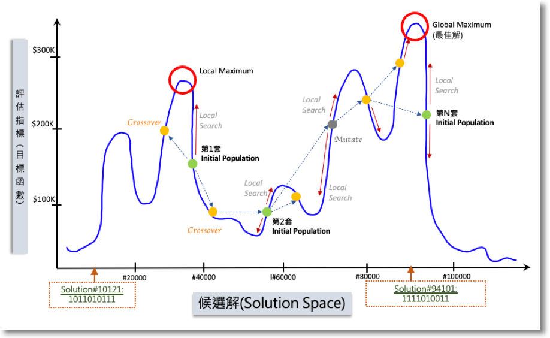

在新工作中掙紮了一年，為了重回寫作世界，把之前演講的內容整理成文稿來發表。作者本身專業是OR(作業研究)，念書時學GA是用來解優化問題；後來涉獵機器學習、AI應用。基本上「預測」這碼事也就是把預測數學模型運用「演算法」解算出來，再投入新資料把預測給算出來，在學習的過程中也有所謂優化問題，如「最小誤差」。所以GA也可應用於ML、AI中，差別在於**OR的應用多半是現實問題**，而**ML/AI的應用傾向於純數學**。但作者認為 — 瞭解OR能夠對瞭解ML、AI有更深入的理解。

本文分為三大主題，從「優化問題」開始、再簡單介紹「GA(基因演算法)」的流程及方法，最後說明GA在「機器學習」上的應用方式。希望能幫助到想要往相關領域發展或評估應用的朋友們。有任何問題或指教，歡迎在下方留言。

# **優化問題概述**

數學上的「優化問題(Optimization Problems)」是將現實世界的「決策」轉化為數學式子(模型)，再運用各種「演算法」將「最佳解」給找出來，這個過程稱為「解算(Solving)」。這麼講可能有點模糊，以下我們用「購屋、租屋」這件事來描繪什麼是個「優化問題」，又如何找到「最佳解」：

## **房屋搜尋**

在臺灣的朋友必定不陌生，找房子大概會到591這樣的網站搜索，美國的話一般會到Redfin、Zillows等。當然網站介面上提供一系列的篩選條件，使用者點選後，下方即出現篩選結果。使用者再依據自己的喜好，在清單上過濾，最後找到幾個想要繼續探索的標的 — 這個過程即是「決策優化」的過程。我猜大家在過濾清單時，腦中一定浮現各式條件，有些可能不在網站提供的條件中。在看到清單，到挑出有興趣的那幾個標的，即是「優化問題」涵蓋的範圍；而最後決定下來的那些標的，也就是每個人心中的「最佳解」。

不過，問題瞭解後得轉換成數學式子，才能開始計算。所以在「建構」優化問題時有2大區塊須加以定義：「欲決定的問題」及「追求標的的限制條件」，其後才能據以定義模型中的「**目標函**數」及「**限制式**」，請參考以下範例：

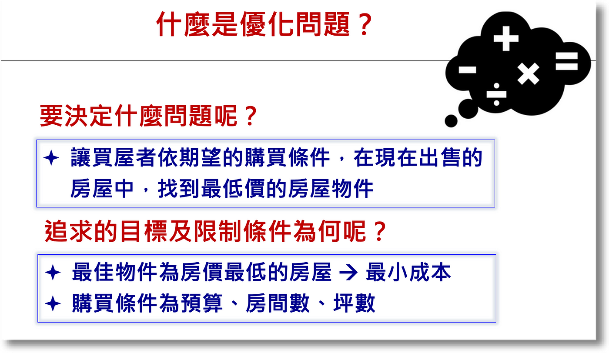

凡事變成數學，就得轉換成**數字可描述或代表**的。比如在「欲決定的問題」中，就必須充分定義心中的「最佳解」是什麼光景，有些人追求「最低房價」、有些人追求「最佳生活機能」或「交通便利」。而限制式中也各不相同，有些可能要「最小坪數」，有些人只要「一房一廳」，這些就Case-By-Case，需要花時間瞭解。所以一個優化模型的建立，在**前期**是需要**與使用者充分溝通**，以確保後續模型建置的正確性。

## **優化問題到模型建置**

問題定義之後需將模型建置的幾項「要素」加以確立，分別是「決策變數」、「目標函數」及「限制式」。範例如下：

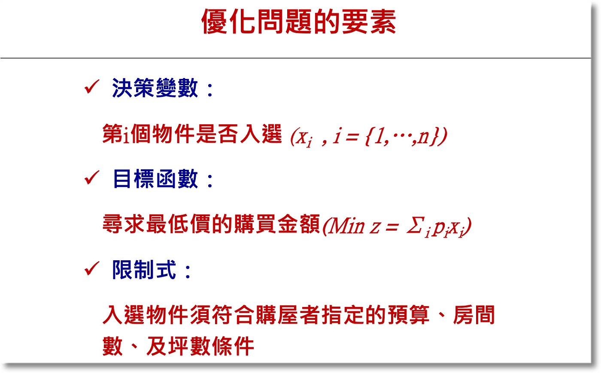

用「房屋搜尋」問題來說明，我們想知道的是：「現有房源中，有哪些是符合我們的標的」；假設現有有5間房屋，我們想知道是第2間符合我們的期望、還是第5間符合，用數學變數來代表這樣的解答其實很簡單 — 用(0,1)即可：第1間符合 *x1*=1, 不符合*x1*=0；第2間符合*x2*=1, 不符合*x2*=0 — 最後的最佳解即用(0,1,0,0,0)代表第2間符何，而(0,0,0,0,1)代表第5間符合。而「**決策變數**」則以(*x1, x2, x3, x4, x5*)來代表。

決策變數定好了就可開始定義「**目標函數**」，這時我們需思考「決策」或「決定」的「評估標準」為何？如前述，有些人可以能要價格評估、有些人是以「質化」的標準如環境良好、交通便利等方式評估。因為目標函數的最終目標是用最大化或最小化來評估各方案，所以必須先搞清楚評估準則為何，再依準則來轉換目標函數，之後解算模型時才能產出正確的結果。用最簡單的最低房價做為評估準則，則前述5間房情境的目標函數即是：*p1\*x1 + p2\*x2 + … + p5\*5* ，*p1, p2,…, p5*代表各房之價格。

現實生活總有諸多限制，所以描繪現實決策的數學模型也要有「**限制式**」。如房屋網站中的搜尋條件，如果只要2臥房的標的，則優化限制需要有 *r1\*x1 <= R、 r2\*x2 <= R、……、r5\*x5 <= R，where R=2*。這樣，如果第1間房是最低價，但其僅有1間臥房，此標的即在優化過成中排除。限制式係按需要納入，可以有很多條。

以下即是一個房屋評估的優化決策模型 — 找出符合預算、坪數及房數期望的最低價房屋標的：

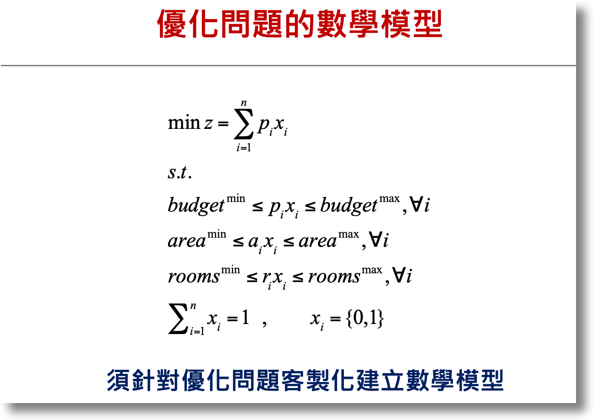

另外讓大家比較有感(不要被一串數學式子嚇到)，用個例子來說明。假設A先生想用不超過**1500萬**的預算找到至少**15坪**、**2間房**最低價物件，用3個方案來做選擇的情境如下，可看出符合所有條件的最佳方案是下是A物件：

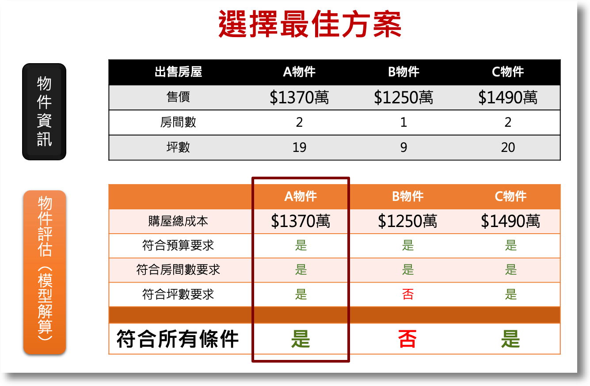

不過，只有3個物件還容易用心算，現實中10幾個物件、或者成千上萬的方案要怎麼找最佳解呢？還有，限制條件在限實生活中可不只3項，更多更複雜又怎麼辦呢？這就是在OR領域中要學演算法的原因了。

# **淺談基因演算法**

說到演算法，我想大家國中都學過**二元一次**或**三元一次方程式**(解雞免同籠的那種)；演算法其實類似其求解方法，經過一系列的運算，最後得出x及y的值。在解算上述的優化問題時，最基本的叫Simplex Method，是用矩陣運算將決策變數一一推算 — 這種方法叫做**解析解(Analytic Solution)**，好處是**保證找得出最佳解**，但壞處是**運算時間長**。尤其在前面提及的優化問題情境中，可能包括千百個變數，有時候在解算時會發現掉入**NP-Hard**的麻煩中 — 也就是電腦計算時間非常長，無法在合理的時間內完成求解。

## 演算法可快速解算NP-Hard問題

下圖是一個針對「太陽能選址評估」的情境；圖中僅有2個用地、3個饋線，試想用地數、饋線數增加時將達到的方案數量，用電腦算也要算很久很久(課本上的例子都說會算好幾年了) — 這就是所為的**NP-Hard**：

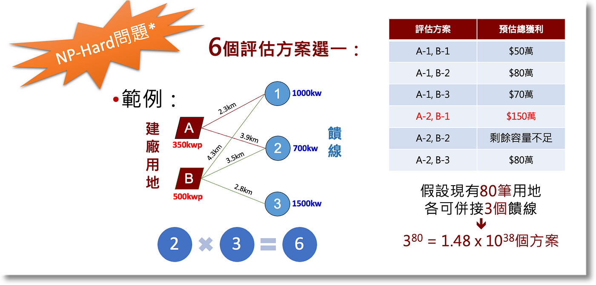

> 想深入探討的讀者可參考這篇：「[Non-deterministic Polynomial-time Hardness](https://en.wikipedia.org/wiki/NP-hardness) in **computational complexity theory」。**

又提一下網路商店的應用(如亞馬遜)，試想在幾百個倉庫中要找到最佳出貨點，每次出貨時求解時間要1週，大概沒要人想要採用這種系統吧。因此，科學家們發明出Metaheuristics的演算法來解決這個困難，而今天要介紹的「基因演算法(Genetic Algorithm)」即是其中一種。

## GA的定義及機制

> [維基百科](https://en.wikipedia.org/wiki/Genetic_algorithm)中描述：In computer science and operations research, a genetic algorithm (GA) is a metaheuristic inspired by the process of natural selection that belongs to the larger class of evolutionary algorithms (EA). Genetic algorithms are commonly used to generate high-quality solutions to optimization and search problems by relying on biologically inspired operators such as mutation, crossover and selection.

Meta-是「之後」的意思，而heuristic則是「搜尋」 — 這類演算法有個特點， 在隨機搜尋之後，都有個方法導向最佳解，達到快速解算的目的。而基因演算法即是模仿「生物演化」的方式，先挑選2個隨機解當父母，再分別切割出傳承染色體，再進行配對。以「物競天擇」之天然選擇概念，將優良基因衍生至下一代，藉以產生優良後代， 逐步找到最佳解。

而所謂基因、染色體等概念可參考下圖，基因(Gene)組成染色體(Chromosome)，各式染色體組成群體(Population)。而不同染色體透過隨機抽樣、切割，再組成新的染色體，不斷繁衍：

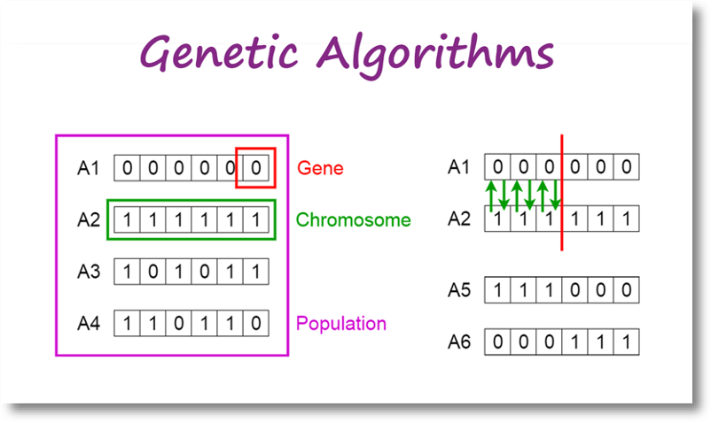

> 上圖及後續說明圖片來源為： Toward Data Science — [Intro to Genetic Algorithm by Vijini Mallawaarachchi ](https://towardsdatascience.com/introduction-to-genetic-algorithms-including-example-code-e396e98d8bf3)，也是篇說明簡潔的文章可以參考。

用找房情境來說明，基因代表的即是入選與否，以0或1表示。而染色體則是整個解(或方案)，如(0,0,0,1,0)或(0,1,0,0,0) 分別代表第4物件入選及第2物件入選。而整體流程如下圖，基本上就是多少小孩，突變產生優良基因、有效保留優良基因，持續繁衍：

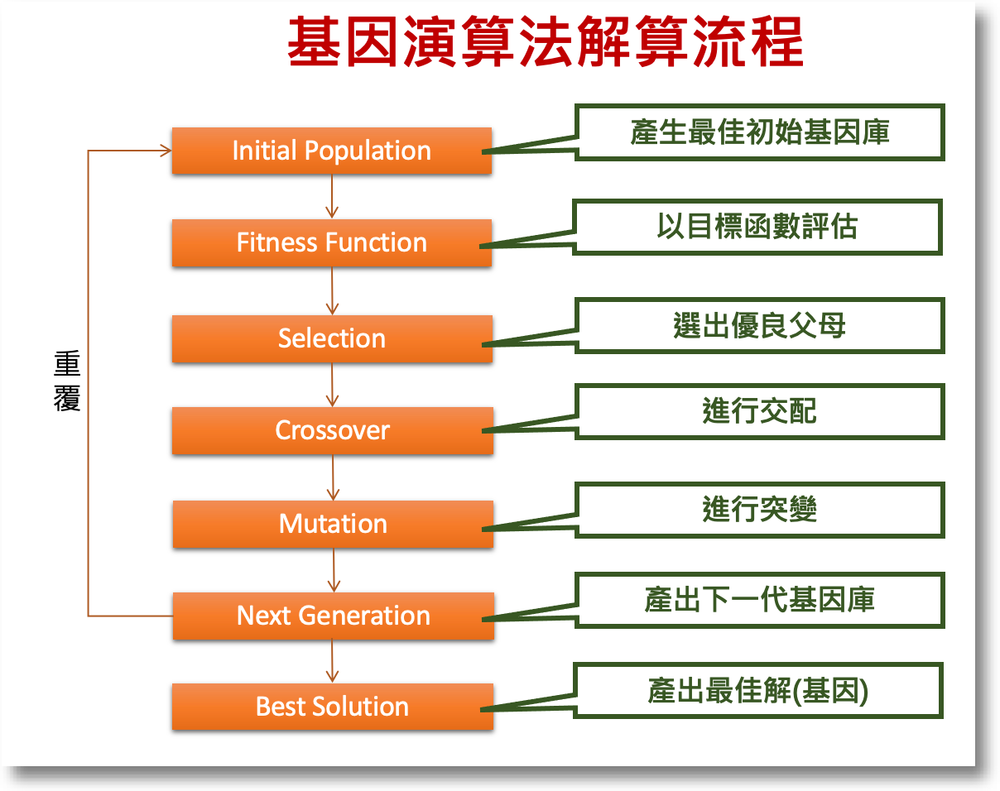

在繁衍後代時，先隨機選押切割點，將父母基因切割、進行交配(互換)，即可產出子代：

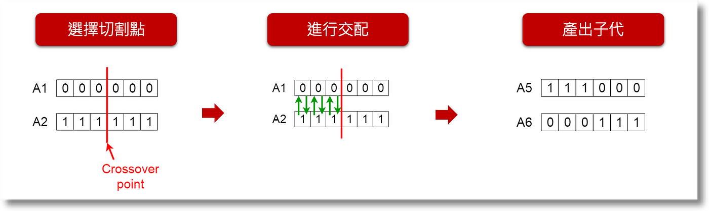

而突變則用隨機選擇並改變部分基因，來產出子代如下圖：

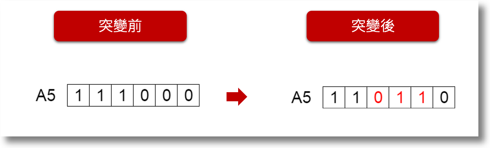

產出子代後演算法用目標函數或Fitness Function進行評估，若子代比較好則保留(如找到更低價的方案)，沒有則棄之。但一代代的子孫繁衍後可能會出現一種情況 — 落入Local Optimal (*見置頂圖*)，這也是需要進行突變的原因之一，可以幫助搜尋跳出現有搜尋範圍，繼續往Global Optimal前進。

# **基因演算法與機器學習**

最後來說明怎麼在機器學習上應用GA — 基本上分為2大類：特徵選取(Feature Selection)及模型調校(Model Tuning)。分別簡單說如下：

## **特徵選取(Feature Selection)**

先用個小例子介紹一下預測模型。近年綠能產業很熱門，不如說說太陽能發電量預測吧！發電量與天氣習習相關，所以可以用日射量、氣溫、濕度、風向、降雨量等氣象資料來建立預測模型。預測模型在數學上用 *y=B1\*X1+B2\*X2+…+Bn\*Xn*來表示，所謂「建模」就是用收集到的資料(訓模資料)丟進模型中，再用**演算法**找出最佳的係數( *B1, B2,…Bn*)，最後再用新資料投入建好的模型中，預測未來。接下來用下圖說明：

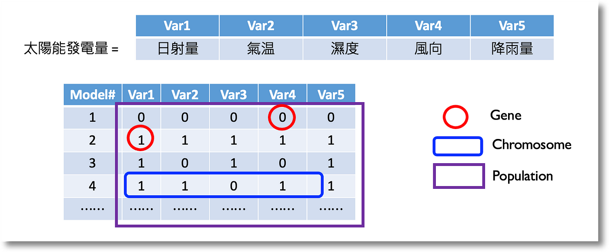

假設我們的訓模資料有5個欄位(變數)，但不見得所有變數都是必要的，所以建模的過程會選擇某幾個變數投入，建成不同的模型後，再比較各模型的準確度 — 這個過程即是「特徵選取」。5個變數能建出的模型共有：5 + 10 + 10 + 5 + 1 (分別為選取1, 2, 3, 4, 5個變數) ＝ 31種組合 → population；而0與1仍代表該變數是否被選取 →基因；5個變數被選取的組合 → 染色體。這樣的概念下就可以運用基因演算法，隨機從Population中選擇父母，再進行交配、突變等過程，經由比較預測模型的Fitness function來決定最佳模型。

> 當然，31個組合有點不符現實，通常會有成千上百的選擇。有興趣細節的讀者也可參考這篇： [Feature Selection using Genetic Algorithms in R](https://towardsdatascience.com/feature-selection-using-genetic-algorithms-in-r-3d9252f1aa66)。

## **模型調校(Model Tuning)**

另一種應用是模型調校，我想很多人一定聽過如隨機森林、類神經網路、XGBoost等等 — 這些是偉大的電腦科學家發明的各式機器學習演算法，而每種方法按其原理有各式超參數(Hyperparameters)可以調校 — 有興趣可以參考這個網站：[Available Models in R Caret Package](https://topepo.github.io/caret/available-models.html) — 其中羅列了滿完整的機器學習模型及其參數。

以類神經網路(Neural Network)來說，可調整的超參有*Learning rate、Number of layers、*Batch Size等等。而每個參數中又有好幾種選擇，各種組合加幾來也有幾百個模型可以選。下圖列出部份組合，大家應可感受到數量的龐大了吧！

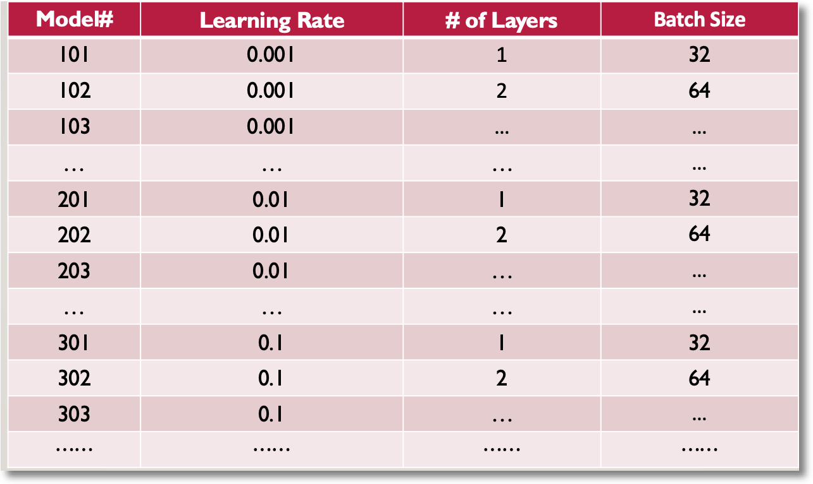

> 目前這篇已經很長了，我就不多介紹，大家可以參考「[Hyperparameters Tuning in Neural Networks](https://www.scaler.com/topics/deep-learning/neural-network-hyperparameters-tuning/)」及「[Fine-Tuning A Neural Network Explained](https://deeplizard.com/learn/video/5T-iXNNiwIs)」。

各式的組合整理出來，應可讓大家聯想回GA的例子。還好有電腦的發明及科學家的努力，現在可以利用這些工具來搜索這組合數非常恐怖多的問題。用以上各種模型作為GA的基因及染色體，接下來就可按下圖GA的步驟產出數個NN模型，繁衍、評估、直到找到最佳模型 — 也就是最後產出的預測模型了。

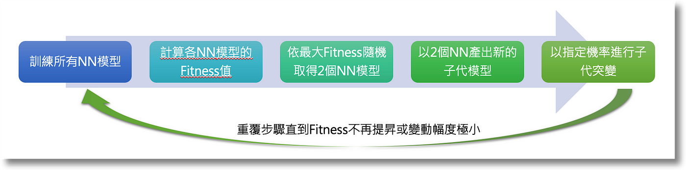

> 想了解細節的讀者，可以參考資料來源：「[Genetic Algorithms + Neural Networks = Best of Both Worlds](https://towardsdatascience.com/gas-and-nns-6a41f1e8146d)」。

# 後記

大體來說，GA適合的情境即是在大量選擇中尋求最佳解答，雖說這只是Metaheuristics中的一種方法，但作者認為容易理解，所以也容易學會及執行。但要跟大家強調一點，這類搜尋法的優點是「快」，但是「**不保證」能找到「最佳解」**。這也是在應用時需要注意的事，通常我們會找幾個能用Analytics solution解出來的案例來比較，確保開發出來的演算法能夠找到最接近最佳解的答案！

本文內容原為2021年臺灣人工智慧發展協會之[AI女力講座](https://www.accupass.com/event/2101121009461651035414)；雖日期稍久，但內容為基礎原理無大礙；作者希望用淺顯的語言、簡單的例子，讓各界有心朝AI發展的同好們能更容易瞭解AI背後的運作機制。另外，也可作為瞭解更高深的[Evolutionary Programming](https://en.wikipedia.org/wiki/Evolutionary_programming#:~:text=Evolutionary programming is one of,parameters are allowed to evolve.) 的跳板。如有任何指教，歡迎留言討論。感謝您閱讀。
