# **快速上手YOLO：利用 Roboflow 和 Ultralytics HUB 完成模型訓練與管理**(上)

https://medium.com/@andy6804tw/%E5%BF%AB%E9%80%9F%E4%B8%8A%E6%89%8Byolo-%E5%88%A9%E7%94%A8-roboflow-%E5%92%8C-ultralytics-hub-%E5%AE%8C%E6%88%90%E6%A8%A1%E5%9E%8B%E8%A8%93%E7%B7%B4%E8%88%87%E7%AE%A1%E7%90%86-%E4%B8%8A-37acd110a8a0

在訓練人工智慧模型時，我們通常會選擇在自己的電腦或工作站上進行。然而，許多人可能會嘗試利用雲端運算工具，例如 Colab 進行訓練。但是使用過 Colab 的人都知道，訓練過程可能會變得複雜且不易管理，且檔案分散難以整理。因此，在本文中我們將介紹如何利用 [Ultralytics HUB](https://www.ultralytics.com/hub) 來協助我們進行模型訓練和管理。我們將透過數據管理平台 [Roboflow](https://roboflow.com/)，將資料匯入 Ultralytics HUB，並連動 Colab 進行模型訓練。同時 Ultralytics HUB 平台提供了視覺化圖表，方便我們觀察和分析訓練過程中的各項指標。

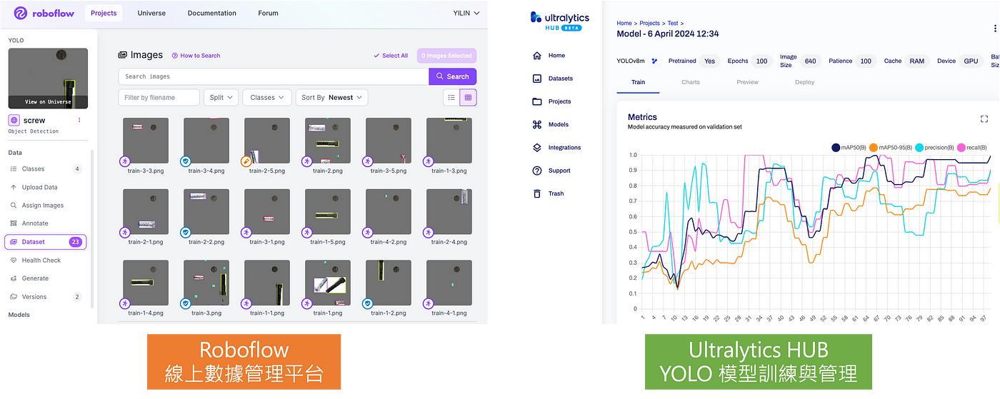

# Roboflow 線上數據管理平台

Roboflow 是一個專門管理影像數據的平台，目標是幫助使用者更有效地管理和處理圖像數據。它的主要功能包括數據標註、數據清理、數據轉換和數據管理。使用者可以透過 Roboflow 快速標註圖像，進行數據增強和轉換，並輕鬆地將準備好的數據集用於模型訓練。除了數據管理之外，Roboflow 平台還提供了許多不同用戶所公開的資料集。這些資料集涵蓋了各種不同的主題和應用領域，包括物件偵測、影像分割和分類等。使用者可以透過 Roboflow 平台輕鬆地瀏覽這些資料集，找到符合自己需求的資料，並加速他們的研究和開發過程。

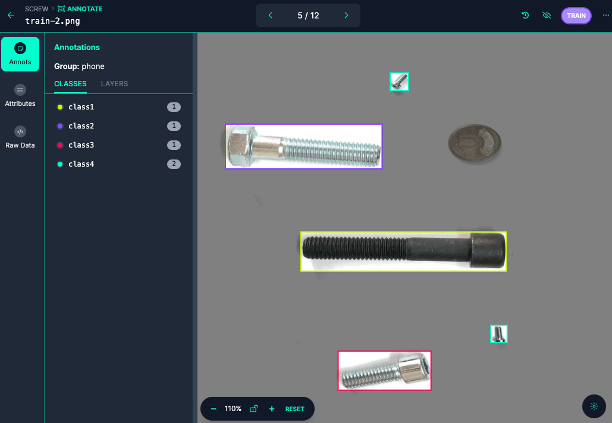

**數據集功能：**

- 數據導入與導出：Roboflow支持多種數據導入和導出選項，包括CSV、COCO、Pascal VOC、YOLO、TensorFlow等。這使得從其他平台導入數據到Roboflow變得輕鬆，或導出數據以供其他工具和框架使用。
- 數據集管理：Roboflow讓管理數據集變得輕鬆，具有版本控制、數據驗證和數據過濾等功能。還可以合併數據集、刪除重複數據等。
- 數據增強：Roboflow包含各種數據增強技術，幫助提高模型的準確性。可以對圖像添加噪聲、模糊、裁剪、旋轉、翻轉等技術。

**影像標註功能：**

- 物件檢測：使用Roboflow，可以對圖像進行物件檢測的標註，並在物件周圍畫出邊界框並為其標記類別名稱。Roboflow支持多種標註類型，包括點、線和多邊形。
- 圖像分割：圖像分割是Roboflow支持的另一種標註任務，可以將圖像中的每個像素都標記為一個類別名稱。這對於語義分割和實例分割等任務很有用。
- 分類：Roboflow還支持圖像分類任務，可以根據其內容將圖像分類到不同的類別中。
- 標註工具：Roboflow包含多種標註工具，以使標註過程更快速、高效。這些工具包括自動標註，其中Roboflow根據現有標註提出標註建議，以及AI標註，其中Roboflow根據圖像內容提出標註建議。
- 協作標註：Roboflow還包括協作功能，您可以邀請其他人標註您的數據集或審查標註。這使得在大型數據集上工作或與他人合作進行標註任務變得輕鬆。

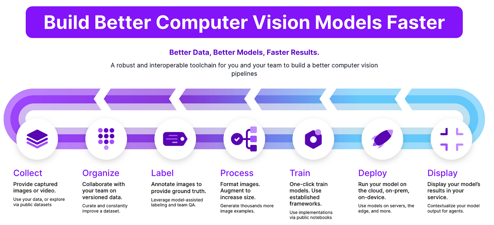

Roboflow 平台的使用非常直觀且易於上手。以下是使用 Roboflow 平台的基本步驟：

- 註冊帳號
- 建立新專案
- 上傳數據
- 標記數據
- 導出數據集

完成註冊後，請登入 [Roboflow](https://roboflow.com/)。首先，平台會要求建立一個 Workspace，然後選擇使用免費版本的 Public Plan 方案。

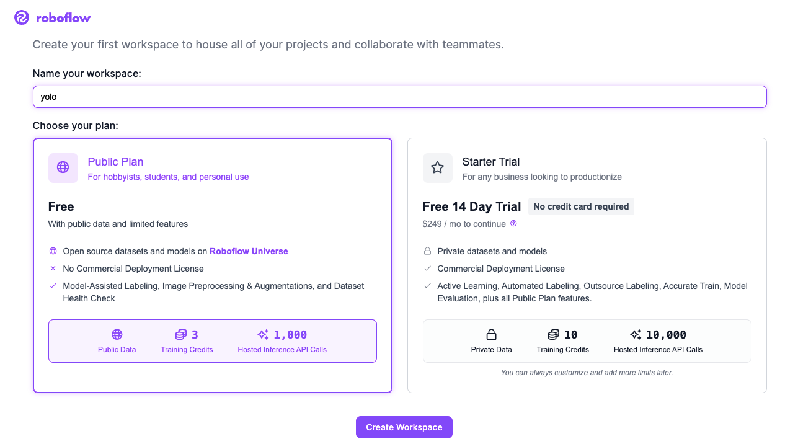

成功建立一個Workspace後才能夠在該空間中新增一個專案。

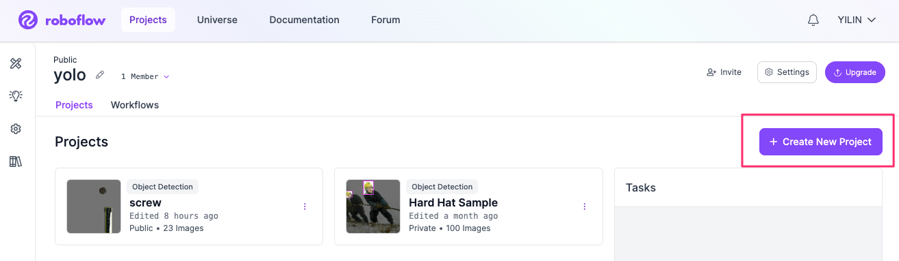

該平台提供了四種專案類型，分別是物件檢測（Object Detection）、分類（Classification）、實例分割（Instance Segmentation）和特徵點檢測（Keypoint Detection）。在這裡，我們選擇第一個物件檢測專案。

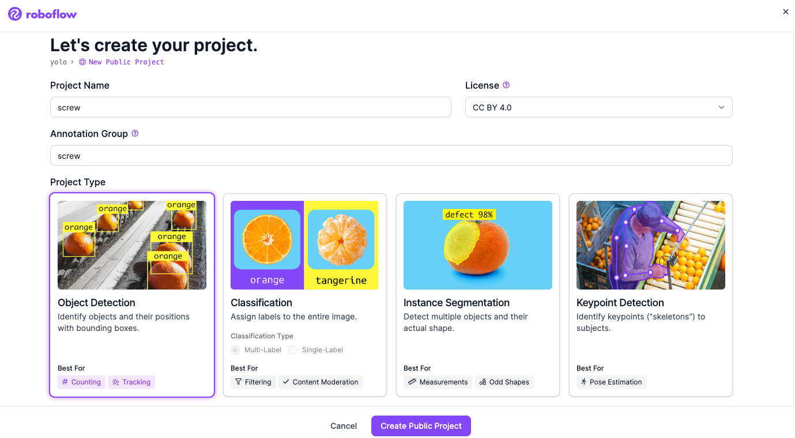

在左側工具列提供了許多數據管理選項，包括標籤的命名管理、影像上傳、指派影像標註任務、資料集匯出管理。最後 Roboflow 還提供了強大的視覺化工具和分析功能，幫助使用者了解數據集的特徵和統計訊息，使更好地維護資料品質。首先我們先將手上的資料集上傳到該專案中，上傳成功後點選 `Save and Continue` 按鈕。

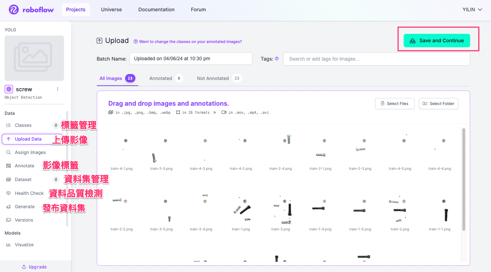

接著系統會指引你下個步驟，在 Roboflow 服務中提供了三種資料標籤的流程。免費的用戶可以直接選第三個擇手動標籤選項。並且可以指派其他使用者一起對這個專案進行協同標籤的任務。

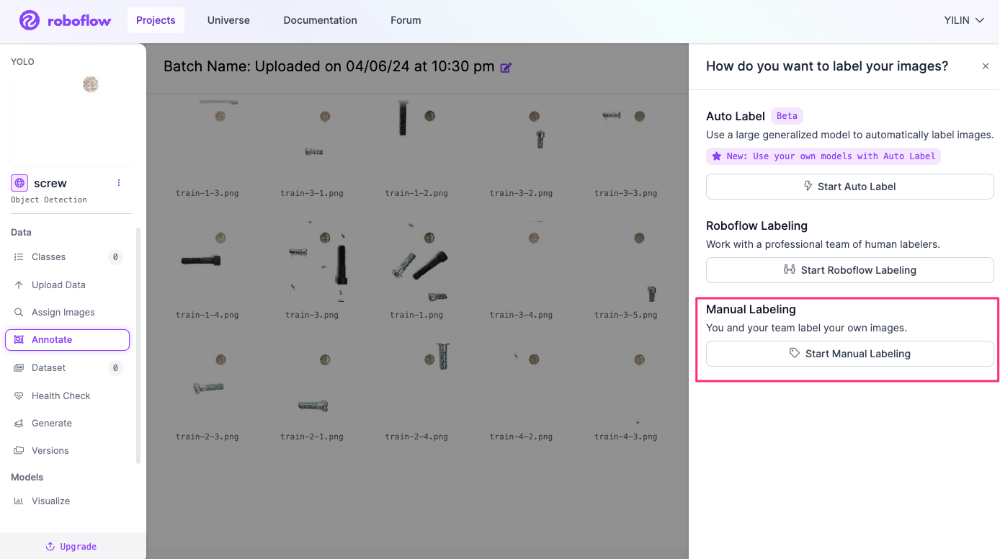

點選 Start Annotation 即可進入標籤頁面進行人工標籤。

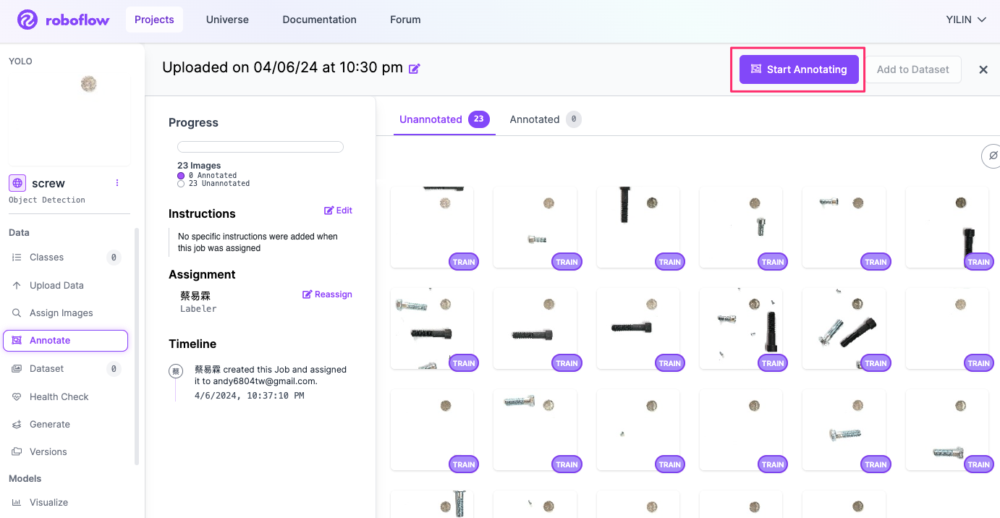

編輯頁面有點類似修圖軟體，首先針對想要預測的物體用 bounding box 圍起來，同時每個圍好的框必須都給予一個正確的類別。

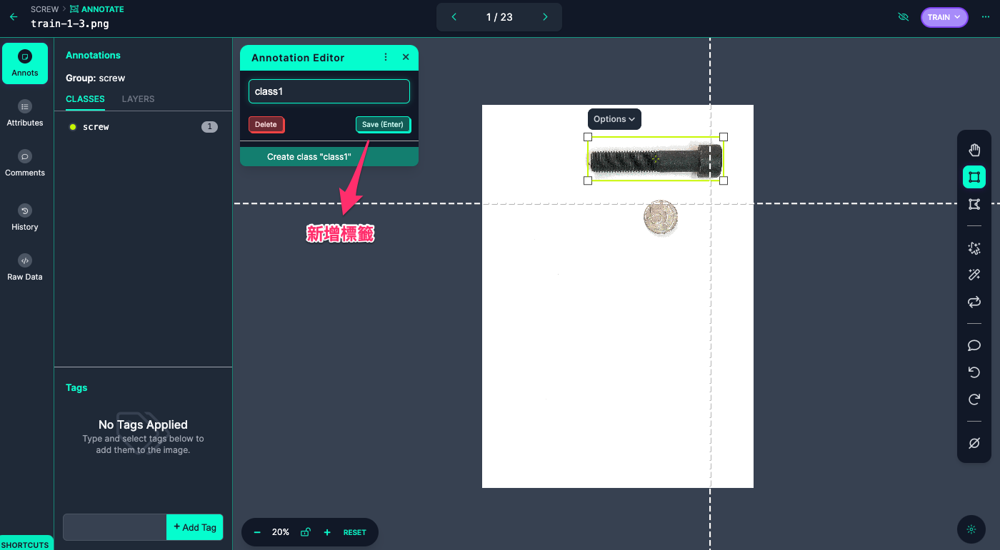

每個類別標籤顏色都可以對應到 bounding box 框框的顏色，讓用戶可以一眼就知道物件的相對應類別。

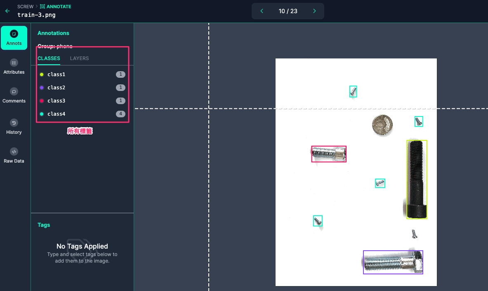

全部影像都標籤完成後即可點選 `Add images to Dataset`，並選擇比例自動切割訓練集、驗證集、測試集。

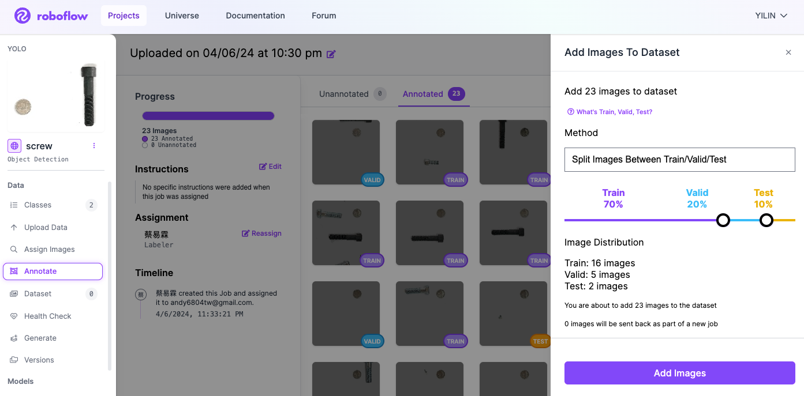

這時候就可以看到剛剛所切分的資料集在左側的 `Dataset` 選項中。

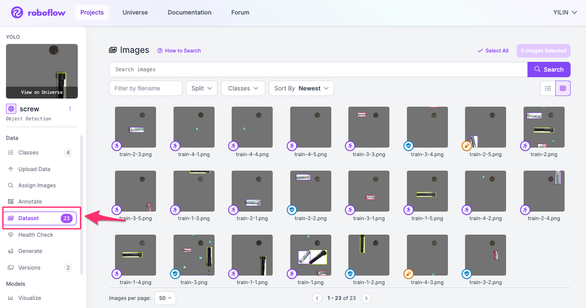

完成影像標記後，即可發布第一版本的資料集。點選左側工具列的 `Generate` 即可發布目前的資料集。發布過程分為以下五個步驟：

1. 選擇數據來源: 確認要發布的影像數量以及類別個數。
2. 切分資料集: 按照自己的偏好將數據切分為訓練集、驗證集和測試集。
3. 影像前處理: 總共分成十一種影像的預處理方法，可依照偏好添加。
4. 資料增強: 讓原本資料集隨機的產生不一樣的樣本使模型學到更豐富的資料，根據增強方式分成影像層級增強和邊界框層級增強。
5. 建立與發佈

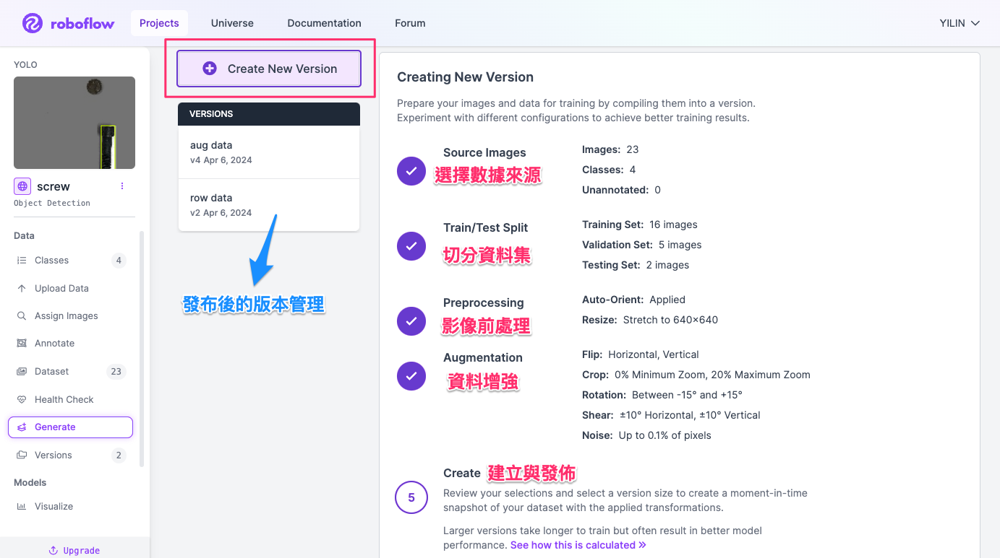

成功建立版本後即可點選 `Export Dataset` 按鈕匯出資料集。Roboflow 支援了許多不同的標註格式，例如JSON、TXT、XML等。並且可以直接將整包資料集匯出下載，或是可以直接利用 Roboflow API 的方式透過 Python 連結帳戶直接下載資料集與標籤。

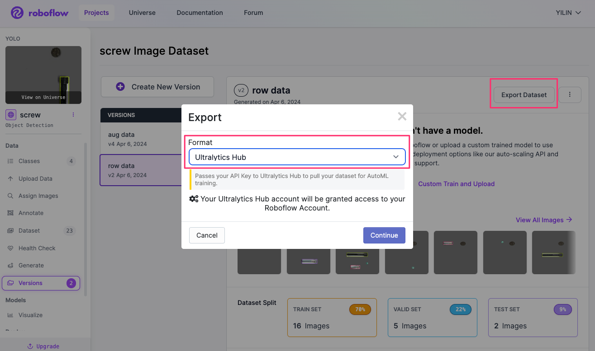

> *選擇 Train with Roboflow，可以直接使用內建的自動線上建模服務，一個帳號能免費使用一次模型訓練。*

如果想快速實現免費的線上無程式碼自動建模服務，可以參考下一篇文章。我們將介紹如何通過 Roboflow 與 Ultralytics HUB 進行連動，並利用 Colab 快速進行物件偵測模型的訓練。

# [快速上手YOLO：利用 Roboflow 和 Ultralytics HUB 完成模型訓練與管理(下)](https://medium.com/p/37acd110a8a0/edit)

在上一篇教學中我們已經透過數據管理平台 Roboflow 為資料集進行標籤管理。並整理好訓練用的訓練集與測試集。資料整理好之後，最後一步是透過 Roboflow 匯出資料集至 Ultralytics HUB。在匯入之前記得先註冊好 [Ultralytics HUB](https://hub.ultralytics.com/) 會員並登入。另外也可以從 [Roboflow Universe](https://roboflow.com/universe) 上找尋社群提供的免費公開資料集。

> 上一篇 [快速上手YOLO：利用 Roboflow 和 Ultralytics HUB 完成模型訓練與管理(上)](https://medium.com/@andy6804tw/快速上手yolo-利用-roboflow-和-ultralytics-hub-完成模型訓練與管理-上-37acd110a8a0)

選擇 Ultralytics HUB 進行匯出，網頁將自動轉跳到 Ultralytics HUB 網站，登入後即可在 Ultralytics HUB 管理和訓練模型。

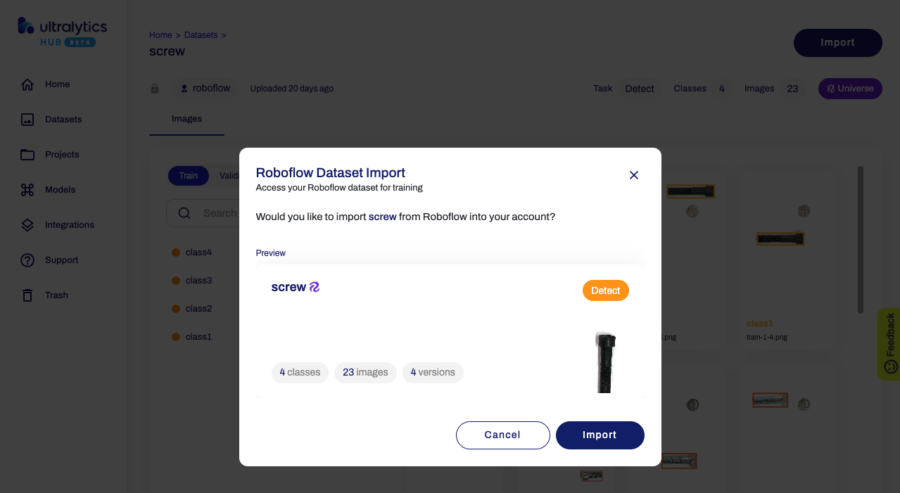

成功匯入(Import) 資料集之後即可，點選 Train Model 進行模型訓練。

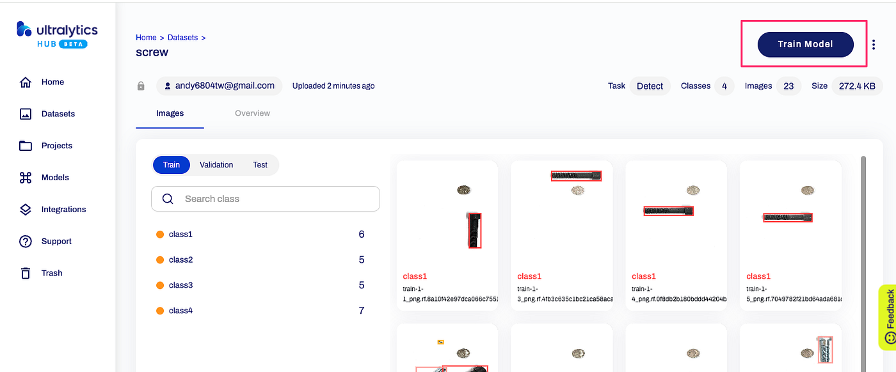

Ultralytics HUB 提供了廣泛的 YOLO 系列模型訓練平台，讓用戶可以輕鬆地訓練多種不同版本的YOLO（You Only Look Once）物件偵測模型。此平台不僅提供了豐富的訓練資源，還提供預訓練模型，使得用戶能夠更快速地開始物件偵測任務，大幅縮短了模型開發和部署的時間。Ultralytics 公司發布了 Yolov5 和 Yolov8，雖然未發表論文對技術上說明。但是這一套 No Code 系統大幅降低了對物件辨識任務的上手難度。我們可以在該平台選擇 YOLOv5 或 YOLOv8 不同大小的模型架構，並且選擇是否要使用預訓練模型。此外進階設定還能動態調整模型的超參數。

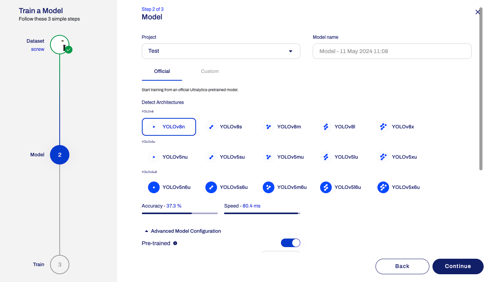

模型選擇好之後依據平台指示將上面三行程式碼貼到下方提供的 Colab 專案內執行即可。

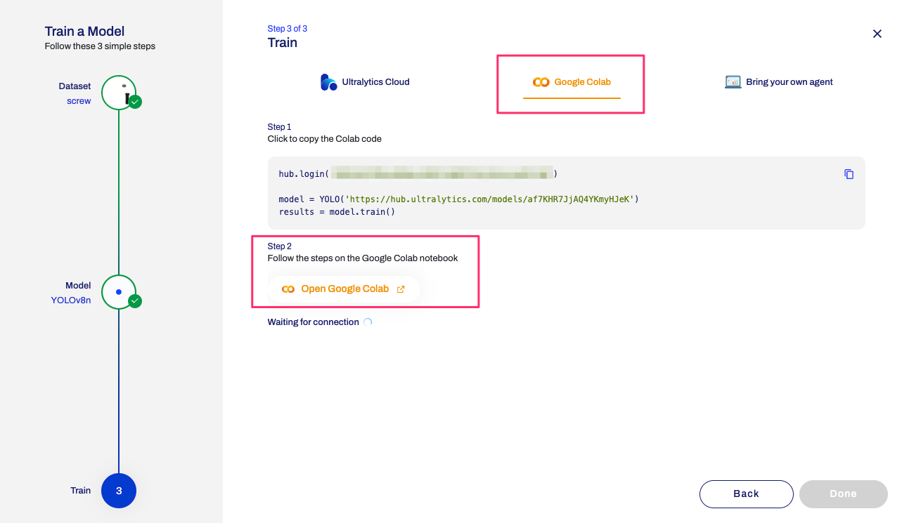

程式會先安裝一些必要的套件，然後會連接至 Ultralytics HUB。接著，它會將在 Colab 中訓練得到的結果傳送回 Ultralytics HUB。

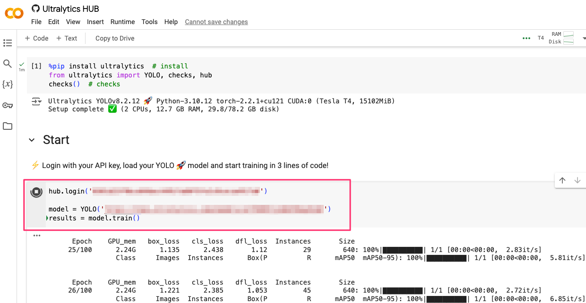

訓練過程中可以透過 Ultralytics HUB 即時地監控模型收斂情形。在本範例中訓練集共有16張影像 ，並且有四種不同類別，在 Colab Tesla T4 GPU 訓練 100 個 epoch 大約花費兩分鐘。

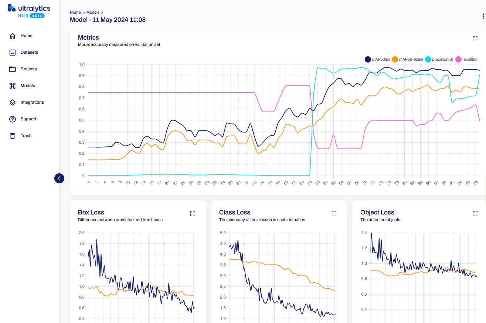

模型訓練完成後可以直接在平台上進行線上的預覽(Preview)推論，驗證模型訓練的成果。可以使用圖片上傳方式亦或是開啟電腦視訊鏡頭進行物件偵測。此外部署(Deploy)功能可以直接將模型打包匯出，例如 ONNX 格式。

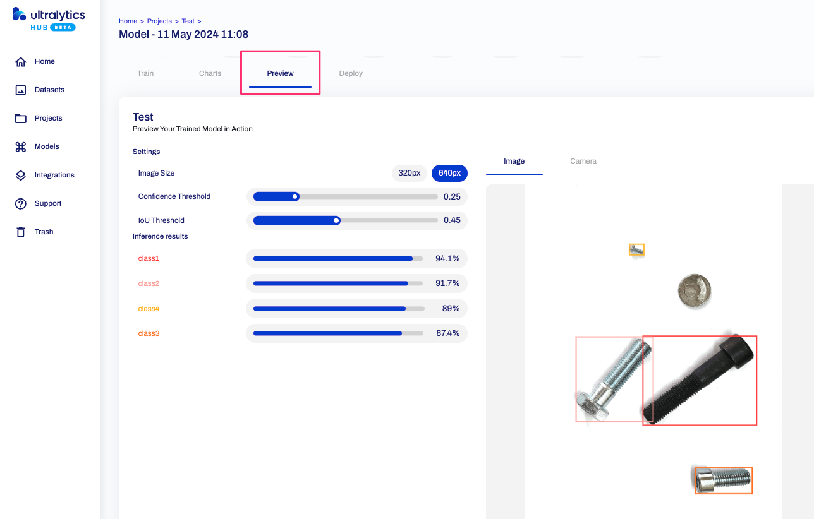

另外平台也提供了 Ultralytics Cloud API 方法，使用者可以透過 Python 呼叫已訓練好的模型並透過 HTTP Request POST 協議進行圖片上傳並回傳辨識結果。

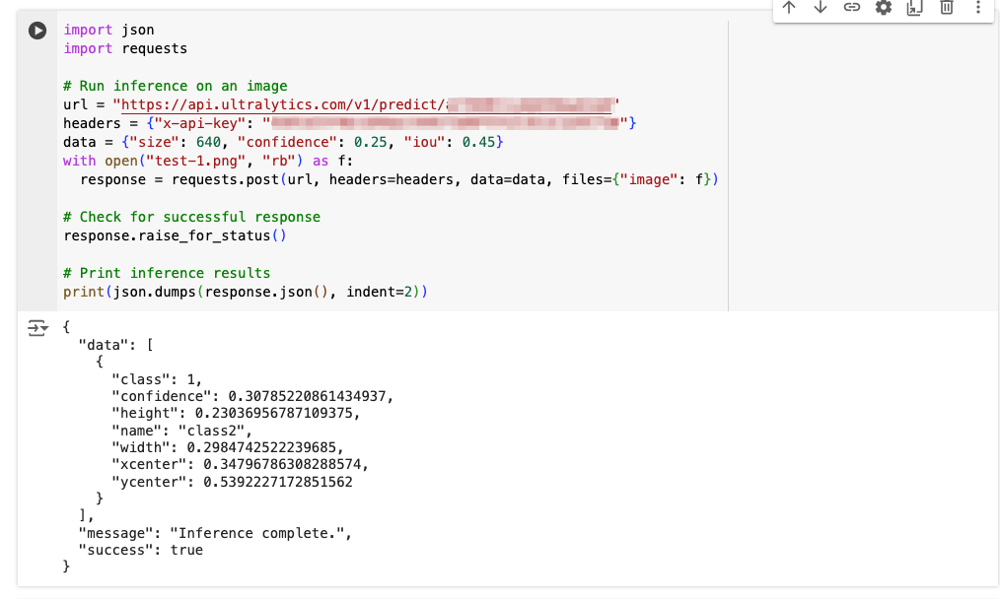

還記得 Roboflow 這個平台嗎？雖然他的 No Code 模型訓練服務要錢，但是他有免費提供自己訓練好的模型上傳至它們平台。並且依樣提供雲端API服務進行推論。有興趣的讀者可以期待下篇文章，教各位如何訓練 2024 最新的 Yolov9 並透過 Roboflow 管理模型。

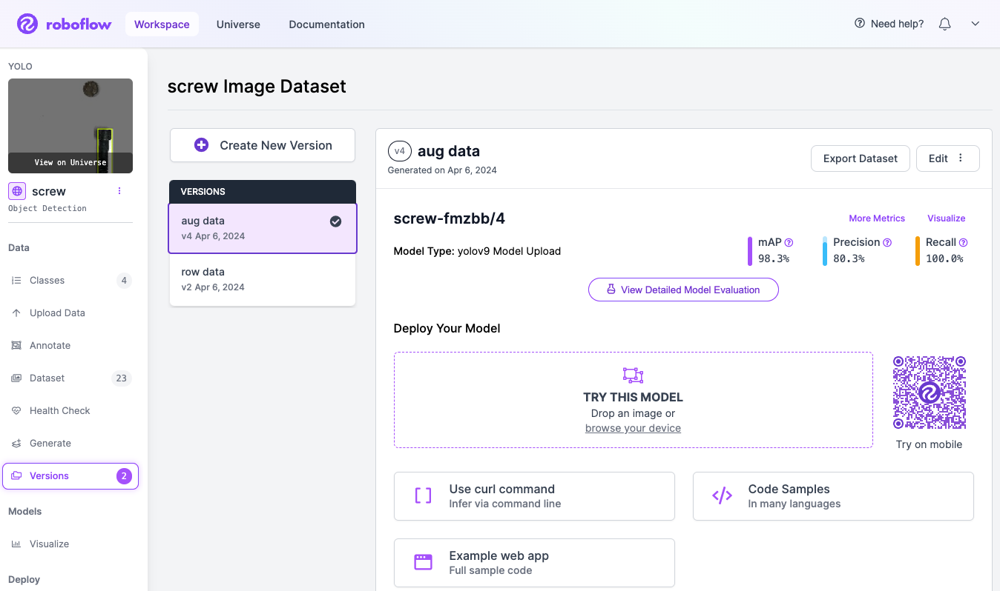
