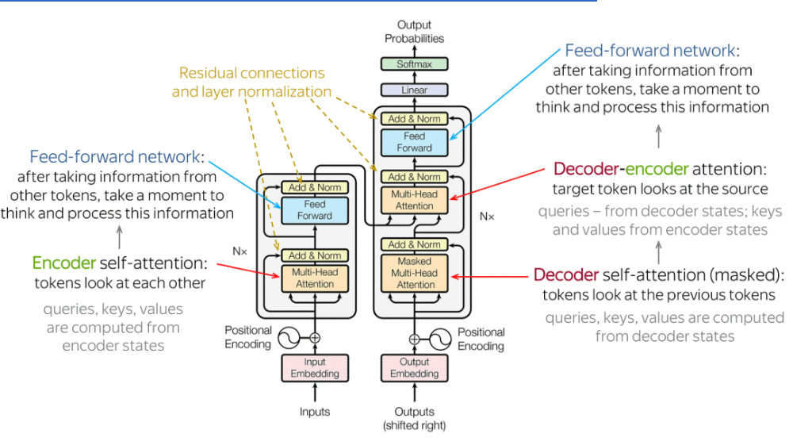

# 一讀就懂！用大白話講清楚 Transformer 的工作基礎流程



關於 Transformer 相信大家並不陌生，網上文章的相關描述大致如下：

**Transformer：一種基於自注意力機制的神經網路結構，通過並行計算和多層特徵抽取，有效解決了長序列依賴問題，實現了在自然語言處理等領域的突破。**

**Transformer 架構：主要由輸入部分（輸入輸出嵌入與位置編碼）、多層編碼器、多層解碼器以及輸出部分（輸出線性層與 Softmax）四大部分組成。**

很顯然上面的解釋，對於初學者是極其不友好的，一看一個不吱聲！我相信 90% 的同學只是想了解 Transformer 工作的基礎流程，而並不想了解其中的實現細節，那麼今天我就用一個生動的實例滿足大家的需求！

我是瀋陽人，我想向外地的老鐵們來介紹一下我的家鄉瀋陽，那麼 Transformer 生成瀋陽介紹的流程大致如下：

## 整體處理流程

```
輸入文字          Transformer 內部處理             輸出文字
─────────────────────────────────────────────────────────

"介紹瀋陽"  ──→ [ 分詞 ] ──→ [ 嵌入+位置編碼 ]
                                    │
                              ┌─────▼─────┐
                              │  編碼器 ×N  │ ← 反覆提煉理解
                              └─────┬─────┘
                                    │
                              ┌─────▼─────┐
                              │  解碼器 ×N  │ ← 逐字生成
                              └─────┬─────┘
                                    │
                              [ Softmax ]
                                    │
                                    ▼
                         "瀋陽是遼寧省的省會..."
```

## 首先把 Transformer 想像成一間智能廚房

- 廚師（AI 模型）看過無數本菜譜（訓練資料）
- 廚房裡有一群配合默契的幫廚（多頭注意力機制）
- 每個幫廚都盯著所有食材（輸入文字），但各自關注不同部分

## 然後要做「瀋陽介紹」這道菜時，按照下面的步驟進行

### 1. 理解訂單

拆解「瀋陽」、「家鄉」、「介紹」等關鍵詞。

### 2. 食材準備

從記憶庫調取相關資訊：

- **歷史**：清朝發祥地、故宮
- **地標**：彩電塔、中街
- **美食**：老邊餃子、雞架
- **季節**：四季分明

### 3. 分層加工

- 第一層幫廚：把「故宮」和「北京故宮」對比
- 第二層幫廚：把「雞架」和城市夜生活關聯
- 第三層幫廚：串聯工業歷史和現代轉型

### 4. 擺盤上菜

按照「總-分-總」結構：

- 開頭點題 → 分段詳述 → 抒情結尾

## 廚房比喻 vs 技術術語對照表

| 廚房比喻 | Transformer 術語 | 簡單解釋 |
|---|---|---|
| 菜譜 | 訓練資料 | 模型學過的大量文本 |
| 食材切塊 | Token 分詞 | 把句子拆成小單位 |
| 食材編號 | 嵌入 (Embedding) | 把文字轉成數字向量 |
| 座位號碼 | 位置編碼 | 讓模型知道詞的前後順序 |
| 幫廚團隊 | 多頭注意力 | 多個角度同時分析關聯 |
| 分層加工 | 編碼器堆疊 | 逐層提煉更深的理解 |
| 擺盤上菜 | 解碼器輸出 | 一個字一個字生成結果 |

## 編碼器 vs 解碼器的角色區分

Transformer 內部其實有兩個不同角色：

- **編碼器 (Encoder)**：負責「讀懂」輸入 — 像是讀題目的考生，反覆咀嚼題意
- **解碼器 (Decoder)**：負責「寫出」答案 — 像是動筆作答，邊寫邊回頭看題目
- GPT 系列只用解碼器，BERT 只用編碼器，原始 Transformer 兩個都用

## 補充一些特殊能力

- **同時看全桌調料**（並行處理）：不用像老式 RNN 那樣一個個字處理
- **自動加重點**（自注意力）：說到「老四季抻麵」時，自動關聯雞架文化
- **防跑題機制**（位置編碼）：確保先說地理位置再說歷史，順序合理

## 逐字生成：一個字一個字往外蹦

Transformer 不是一次生出整段文字，而是**一個字一個字產生**的：

> 就像廚師不是一次端出整桌菜，而是一道一道上：先生成「瀋」，根據「瀋」生成「陽」，再根據「瀋陽」生成「是」… 每個字都參考前面所有已生成的字來決定下一個字。

## 實際生成流程

實際生成時，就像有個看不見的瀋陽導遊在你大腦裡：

1. 先畫思維導圖（生成大綱）
2. 給每個景點配小故事（細節填充）
3. 最後用「歡迎來瀋陽」收尾（情感昇華）

整個過程比人寫作文快 n 倍，但會偶爾出現「瀋陽靠海」這種錯誤（因為學習資料有雜訊），這正是人類需要校對的原因。
