# 通俗易懂：白話講解 Transformer

## 前言

[Attention Is All You Need](https://arxiv.org/pdf/1706.03762.pdf) 是 Google 於 2017 年發表的論文，這篇論文提出了一種新的神經網路架構：Transformer，僅僅依賴於注意力機制就可處理序列資料，從而摒棄了 RNN 或 CNN。這個新的網路結構，刷爆了各大翻譯任務，同時創造了多項新的記錄（英-德的翻譯任務，相比之前的最好記錄提高了 2 個 BLEU 值）。而且，該模型的訓練耗時短，並且對大資料或者有限資料集均有良好表現。熟悉 NLP 領域的讀者也知道，目前大熱的 BERT 就是基於 Transformer 構建的，下面就來詳細的講解 Transformer 這一優秀的神經網路架構。

在講解 Transformer 之前，先講解一下 Transformer 出來之前如何進行神經網路機器翻譯。如果設計一個機器翻譯的網路，一般會採用 Encoder-Decoder 架構，編解碼器都是使用 RNN 作為基本的單元架構。輸入一個句子到 Encoder 中，將輸入轉化成一個 Context Vector，Context Vector 作為 Decoder 的輸入去預測輸出。整個方式的核心是應用 RNN 作為編解碼器的基本結構，通過編碼器把輸入資料編碼成一個低維的向量，而使用此低維的向量作為解碼器的輸入去預測結果。

雖然取得了不錯的效果，但是 RNN 的缺點有目共睹：

- 梯度消失（Vanishing）
- 梯度爆炸（Exploding）

而 Google 便提出了另一種解決方案來代替 RNN，這個解決方案便是 Attention。在仔細講解 Attention 之前，可以先來看看處理序列資料的一些解決方案，具體可以參考此博文：[《Attention is All You Need》淺讀](https://kexue.fm/archives/4765)，博主講解的淺顯易懂。

文中提及：深度學習做 NLP 的方法，基本上都是先將句子分詞，然後每個詞轉化為對應的詞向量序列。這樣一來，每個句子都對應的是一個矩陣 $X = (x_1, x_2, \ldots, x_t)$，其中 $x_i$ 都代表著第 $i$ 個詞的詞向量（行向量），維度為 $d$ 維，故 $X \in \mathbb{R}^{n \times d}$。這樣的話，問題就變成了編碼這些序列了。

第一個基本的思路是 RNN 層，RNN 的方案很簡單，遞迴式進行：

$$y_t = f(y_{t-1}, x_t)$$

不管是已經被廣泛使用的 LSTM、GRU 還是最近的 SRU，都並未脫離這個遞迴框架。RNN 結構本身比較簡單，也很適合序列建模，但 RNN 的明顯缺點之一就是無法並行，因此速度較慢，這是遞迴的天然缺陷。另外**博主認為 RNN 無法很好地學習到全域的結構資訊，因為它本質是一個馬爾可夫決策過程。**

第二個思路是 CNN 層，其實 CNN 的方案也是很自然的，窗口式遍歷，比如尺寸為 3 的卷積，就是：

$$y_t = f(x_{t-1}, x_t, x_{t+1})$$

在 Facebook 的論文中，純粹使用卷積也完成了 Seq2Seq 的學習，是卷積的一個精緻且極致的使用案例，熱衷卷積的讀者必須得好好讀讀這篇論文。CNN 方便並行，而且容易捕捉到一些全域的結構資訊。但是 CNN 還是有一些問題，那就是需要疊一定量的層數之後才可以獲取到較為全域的資訊。

Google 的大作《Attention Is All You Need》提供了第三個思路：**純 Attention！單靠注意力就可以！** RNN 要逐步遞迴才能獲得全域資訊，因此一般要雙向 RNN 才比較好；CNN 事實上只能獲取局部資訊，是通過層疊來增大感受野；Attention 的思路最為粗暴，它一步到位獲取了全域資訊！它的解決方案是：

$$y_t = f(x_t, A, B)$$

其中 $A$, $B$ 是另外一個序列（矩陣）。如果都取 $A = B = X$，那麼就稱為 Self Attention，它的意思是直接將 $x_t$ 與原來的每個詞進行比較，最後算出 $y_t$。

## Transformer Architecture

下圖是簡化的 Transformer 的模型架構示意圖，先來大概看一下這張圖，Transformer 模型的架構就是一個 seq2seq 架構，由多個 Encoder、Decoder 堆疊而成。

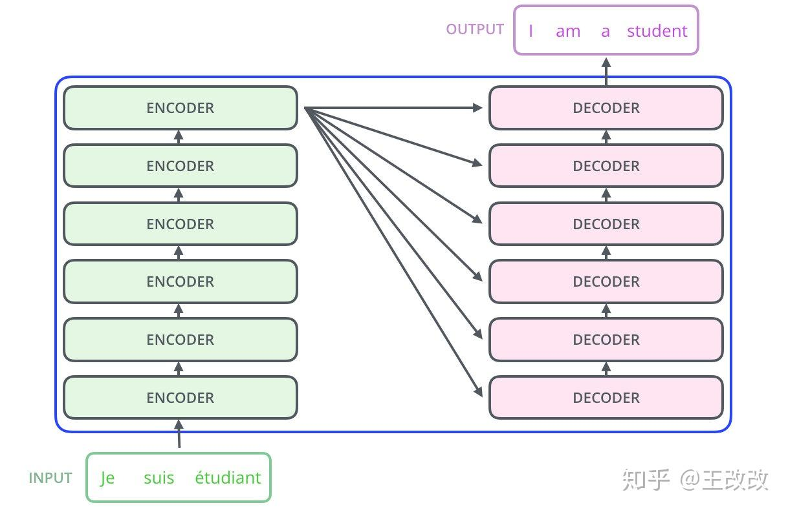

而每個 Encoder、Decoder 長什麼樣子可以看下圖，原本編解碼的基本單元是 RNN，這裡改用了 Self-Attention layer 和 Feed Forward，而 Decoder 則由 Self-Attention、Encoder-Decoder Attention、Feed Forward 組成。Transformer 其實就是 seq2seq model with self-attention。

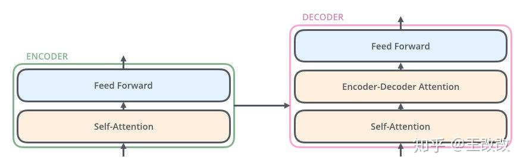

概括來說，我們輸入法語：je suis étudiant，經過六個 Encoder 後得到了類似於 Context Vector 的東西，然後將得到的向量放進 Decoder 中，每個 Decoder 會對上一個 Decoder 的輸出進行 Self-Attention 處理，同時會把得到的結果與 Encoder 傳遞過來的 Vector 進行 Encoder-Decoder Attention 處理，將結果放入前饋網路中，這算是一個 Decoder，而把六個 Decoder 疊加起來學習，便可得到最後的結果。這裡疊起來的編解碼器的數量不是固定的，至於 Encoder 和 Decoder 的工作原理在下面章節介紹。

## Encoder

下面是 Encoder 的示意圖，在這裡我們假設輸入的句子只有兩個詞，簡單高效的講解 Encoder 的工作原理。

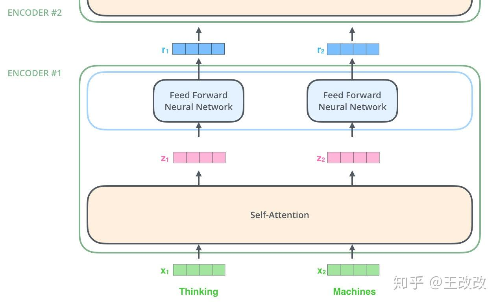

細節暫且不看，這個 Encoder 模組可以實現什麼功能呢？上圖所示，我們輸入了兩個編碼後的向量 $x_1$, $x_2$，其中 $x_1$ 是對單詞 Thinking 的表示，$x_2$ 是對 Machines 單詞的表示。通過 Encoder 模組得到了兩個向量 $r_1$, $r_2$，雖然 $r_1$, $r_2$ 也分別代表 Thinking、Machines 單詞的資訊，但是 $r_1$, $r_2$ 是加權後的結果，也就是說 $r_1$ 中不僅僅包含 Thinking 單詞的資訊，而且還有 Machines 單詞的資訊，只不過 Thinking 單詞資訊佔的比重**可能**很高，畢竟單詞和單詞本身的相關性是很高的（這裡為了方便理解，舉一個例子，具體權重如何分配的是模型學習出來的）。這裡用兩個詞語舉例子，如果輸入的句子單詞很多，可能不同單詞之間的相關度就不一樣，最後得到的 $r$ 向量分配的權重也就不同。

所以，原始輸入的向量 $x_1$、$x_2$ 各自包含各自的資訊，而最後得到的 $r_1$, $r_2$ 便分別包含了原始輸入所有向量的資訊，只是各佔的比重不同。試圖去學習到不同單詞之間的相關度有什麼作用呢？看下圖：

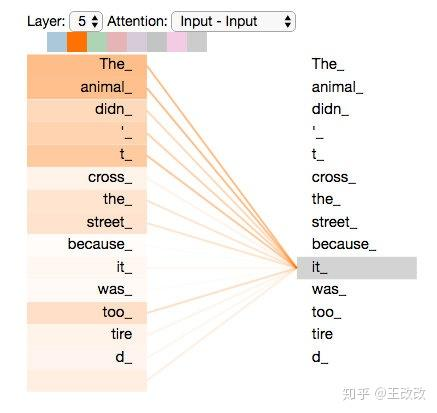

如上圖所示，很明顯，單詞 it 和 the animal 的相關度最高，這就是我們所期望的。因為本句話的語義 it 就是指的 the animal。

怎樣才能每個單詞的資訊按不同權重糅合起來呢？沒錯，Self-Attention 機制。

## Self-Attention

再看下圖這一個 Encoder 模組，此模組的 Self-Attention 中發生了資訊的融合，也就是在這期間按不同權重來組合新的向量。

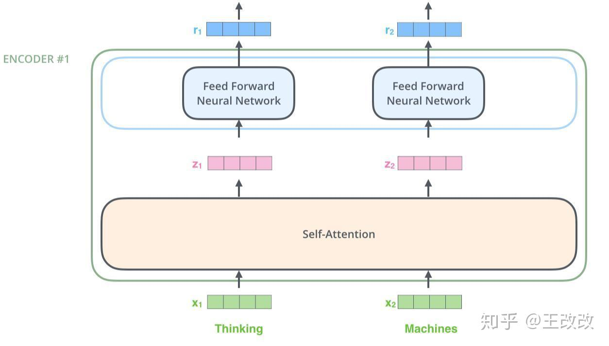

Self-Attention 中的細節如下圖所示，當單詞 Thinking、Machines 進行 Embedding 後，分別與矩陣 $W^Q$, $W^K$, $W^V$ 相乘。例如 Thinking 單詞 Embedding 後變成 $X_1$ 向量，此向量與 $W^Q$ 相乘後為 $q_1$ 向量，也稱為 Queries，$X_1$ 與 $W^K$ 相乘得到 $k_1$ 向量，以此類推。我們稱 $q_1$, $k_1$, $v_1$ 向量分別為 Queries、Keys、Values 向量。

輸入的每個單詞都可以通過**同一個矩陣**計算得到對應的 $q_i$, $k_i$, $v_i$ 向量，$x_1$ 通過下圖的過程生成 $z_1$。用 $q_1$ 即 Thinking 單詞的 Queries，分別與其它單詞的 $k$ 向量相乘，比如 $q_1 \cdot k_1 = 122$，$q_1 \cdot k_2 = 96$。然後用得到的值除以 $\sqrt{d_k}$（$d_k$ 為上方提及的矩陣的第一個維度）得到 14 和 12，對除法的結果進行 softmax，於是 Thinking 單詞對應的比例是 0.88，而 Machines 對應比率的是 0.12，接下來使用 softmax 後得到的比率與對應的 Values 向量相乘，便得到了 $v_1$ 和 $v_2$，$v_1 = 0.88 \times v_1$，$v_2 = 0.12 \times v_2$。由於 0.12 佔的比例較小，得到的 $v_2$ 向量顏色較淺。最後將得到的 $v_1$, $v_2$ 加起來便是 $z_1$。

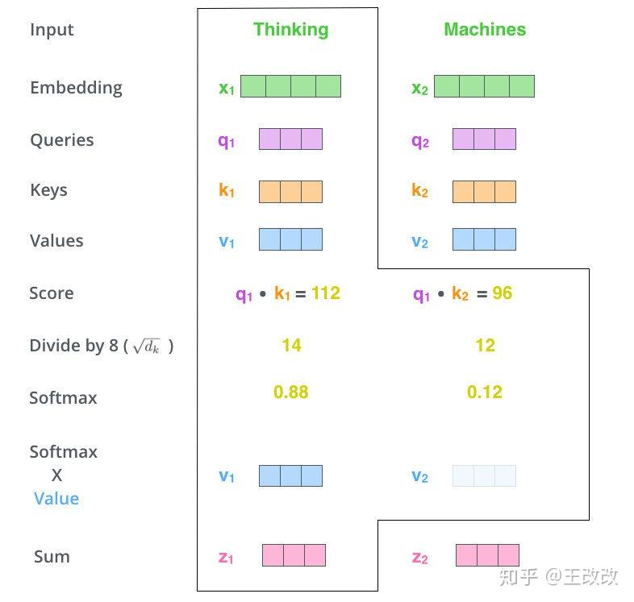

於是 $z_1$ 便包含了兩個單詞的資訊，只不過 Thinking 單詞的資訊佔的比重更大一些，而 Machines 單詞的資訊佔的比例較小。

同樣 $z_2$ 向量可以通過相同的方式計算出來，只不過計算 Score 的時候需要用 $q_2 \cdot k_1$，$q_2 \cdot k_2$。需要使用 $q_2$ 去分別乘 $k_1$ 和 $k_2$。除以 8 並且 Softmax 後可以與 $v_1$, $v_2$ 相乘，相加後便得到的 $z_2$，$z_2$ 包含了兩個單詞的向量，只不過各佔的比重不同。

### 向量化

到目前為止，還有一個效能上的問題，不知道大家有沒有發現。回顧下圖：

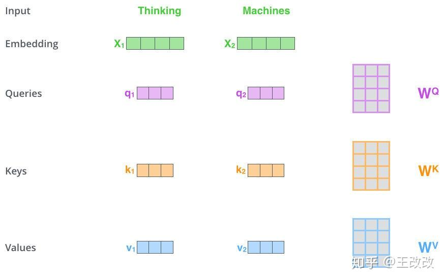

當我們計算 $q_1$, $k_1$, $v_1$ 的時候，我們需要用向量 $x_1$ 分別與三個矩陣 $W^Q$, $W^K$, $W^V$ 相乘，而計算 $q_2$, $k_2$, $v_2$ 的時候又得需要進行三次乘法。這裡僅僅有兩個詞就進行了 6 次運算。如果一個句子中有很多詞呢？那對效能是不是非常大的消耗？這裡就需要用到向量化的操作了，如下圖所示，不再拿 $x_1$, $x_2$ 分別去和三個矩陣相乘，而是將 $x_1$, $x_2$ 疊加起來看作一個新的矩陣 $X$，再去和三個矩陣相乘。得到三個新的矩陣 $Q$, $K$, $V$，這三個矩陣的每一行代表著一個詞轉化後的值。

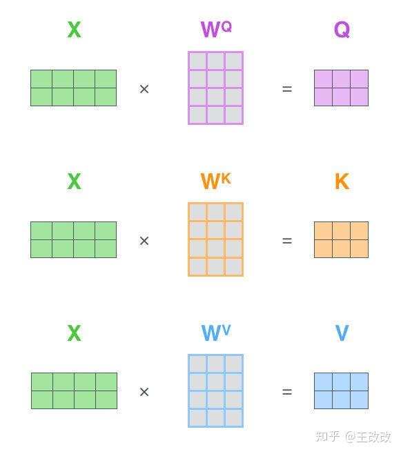

進行 $z$ 值計算的時候也可以用向量化的思想，最後的矩陣 $Z$ 就是 $z_1$ 和 $z_2$ 疊加在一起的結果。

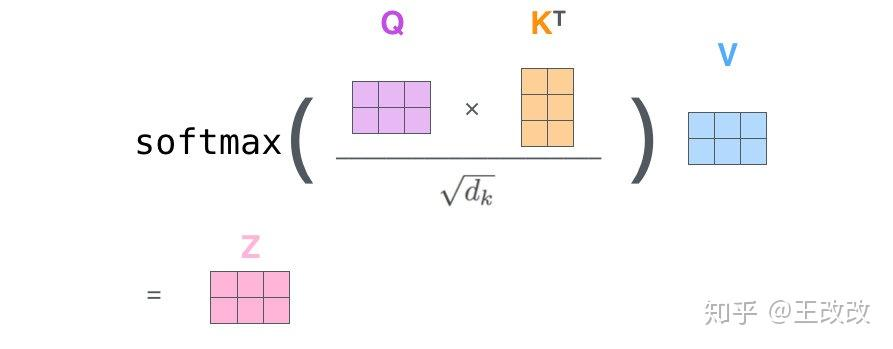

其中矩陣 $W^Q$, $W^K$, $W^V$ 是學習出來的，我們試圖去學習三個矩陣 $W^Q$, $W^K$, $W^V$，與 Embedding 向量相乘後得到 Query、Key、Value 向量。而期望得到的 Query、Key、Value 向量最契合當前的任務。因為矩陣 $W^Q$, $W^K$, $W^V$ 是學習出來的，所以得到的 Query、Key、Value 向量是比較抽象的。在這裡，我認為 $W^Q$, $W^K$, $W^V$ 矩陣的功能相當於抽取特徵。這裡的命名 Query、Key、Value 也非常有意思，大家自己想想每個向量的功能就能對應上了。這裡應該是借鑑了資訊檢索的相關思想。

### Multi-headed Attention

剛剛的例子，我們有三個矩陣 $W^Q$, $W^K$, $W^V$ 與單詞的 embedding 相乘，如果不僅僅是這三個矩陣呢？還有 $W_1^Q$, $W_1^K$, $W_1^V$, $W_2^Q$, $W_2^K$, $W_2^V$ 等等，這樣就不僅僅得到一個 $Z$，還會有 $Z_1$, $Z_2$ 等等。

如下圖所示：

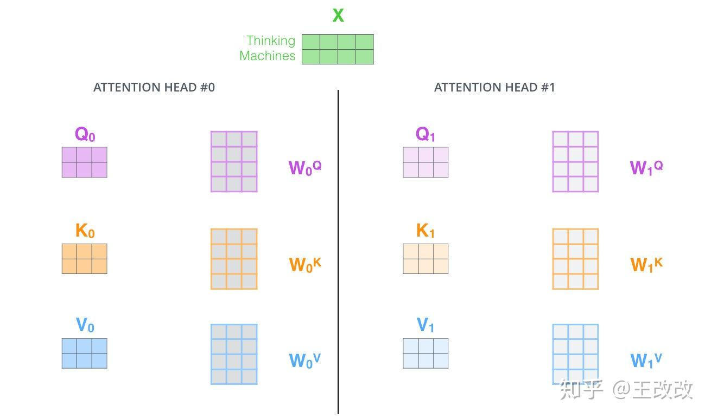

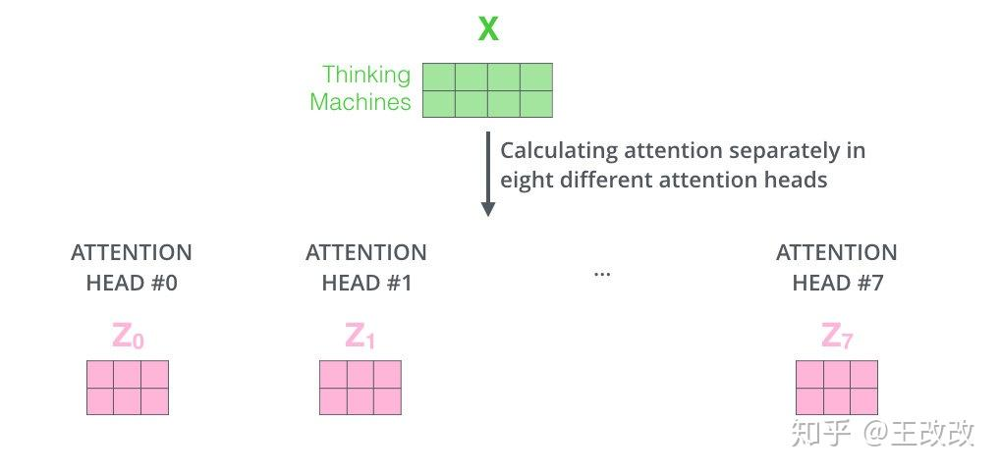

這樣就得到了多個 $Z$ 向量，由於每組的參數矩陣 $W_i^Q$, $W_i^K$, $W_i^V$ 是不一樣的，所以多個 $Z$ 向量的出現會使得資訊更加豐富。看下圖會幫助理解，如果不是多頭的注意力機制，it 和 the animal 是相關度最高的，這符合我們的預期。但根據句子中 it was too tired 可知，it 除了指代 the animal 還是 tired 的。如果再引入一個 attention layer，這個 layer 就可能捕獲 it 與 tired 的相關度。

所以，multi-headed attention 能夠使得資訊更加豐富。

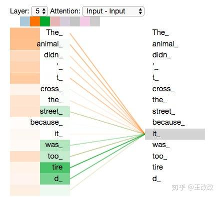

那麼問題來了，本來只能輸出一個向量，但是出現了多個向量，該怎麼把這些向量資訊進行融合呢？

其實很簡單，只需要三步：

1. 將 8 個向量 concat 起來得到長長的參數矩陣
2. 將該矩陣與一個參數矩陣 $W^0$ 進行相乘，該參數矩陣的長是一個 $Z$ 向量的長度，寬是 8 個 $Z$ 向量 concat 後的長度
3. 相乘的結果的形狀就是一個 $Z$ 向量的形狀

這樣我們通過一個參數矩陣完成了對 8 個向量的特徵提取。

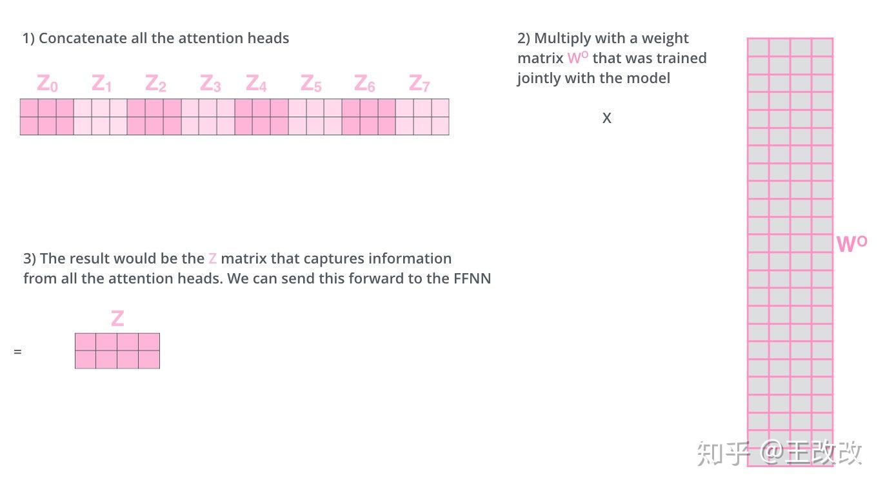

下圖就是 multi-headed attention 的全部流程：

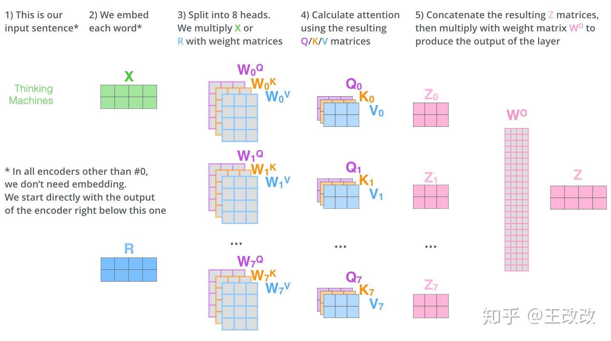

### Feed Forward

到這裡，再來回顧 Encoder 的細節。剛剛上文已經講解了怎麼把 $x_1$ 轉化為 $z_1$，接下來只需要**把學習到的 $z_i$ 和原始輸入進行融合和 Normalize 後**輸入到一個 Feed Forward Neural Network 中，相當於做了一個 skip-connection，也就是下圖中的虛線箭頭進行的操作。看下面的圖可得知，$z_i$ 進入 Feed Forward Neural Network 是單獨進行的，沒有揉合在一起。緊接著，Feed Forward Neural Network 的輸出和它的輸入再進行融合和 Layer Normalize 操作才得到了 $r_i$。

### Layer Normalization

接下來講解下 Layer Normalization。Normalization 有很多種，但是它們都有一個共同的目的，那就是把輸入轉化成均值為 0 方差為 1 的資料。我們在把資料送入激活函數之前進行 normalization（歸一化），因為我們不希望輸入資料落在激活函數的飽和區。

說到 normalization，那就肯定得提到 Batch Normalization。BN 的主要思想就是：在每一層的每一批資料上進行歸一化。我們可能會對輸入資料進行歸一化，但是經過該網路層的作用後，我們的資料已經不再是歸一化的了。隨著這種情況的發展，資料的偏差越來越大，我的反向傳播需要考慮到這些大的偏差，這就迫使我們只能使用較小的學習率來防止梯度消失或者梯度爆炸。

BN 的具體做法就是對每一小批資料，在批這個方向上做歸一化。如下圖所示：

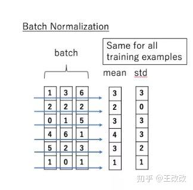

可以看到，右半邊求均值是沿著資料 batch_size 的方向進行的，其計算公式如下：

$$BN(x_i) = \alpha \times \frac{x_i - \mu_B}{\sqrt{\sigma^2_B + \epsilon}} + \beta$$

那麼什麼是 Layer Normalization 呢？它也是歸一化資料的一種方式，不過 LN 是在每一個樣本上計算均值和方差，而不是 BN 那種在批方向計算均值和方差！

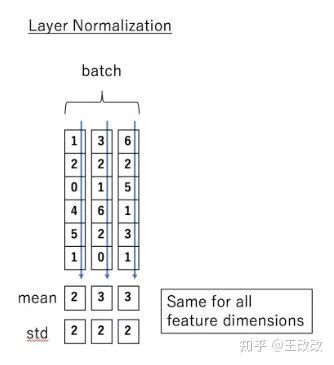

下面看一下 LN 的公式：

$$LN(x_i) = \alpha \times \frac{x_i - \mu_L}{\sqrt{\sigma^2_L + \epsilon}} + \beta$$

到此為止，把 Encoder 的一個單元的原理講清楚了，也就是如何將 $x_i$ 轉化為 $r_i$。

1. 對輸入的資料進行 Embedding 得到 $x_i$
2. 把 Embedding 後的結果**融入 Positional 資訊**後輸入到 Encoder 網路中
3. 輸入資訊輸入到 Attention layer 中來捕獲多維度的上下文資訊，得到 $z_i$
4. 將注意力學習到的結果和原始輸入進行融合後進入 Feed Forward 網路進一步學習
5. 前饋網路的結果也會和前饋網路的輸入做一個融合，類似於 skip-connection
6. 這樣便得到了一個 Encoder 單元後的結果 $r_i$

對於步驟 2 中融入 Positional 資訊是如何做到的，往後讀即可。

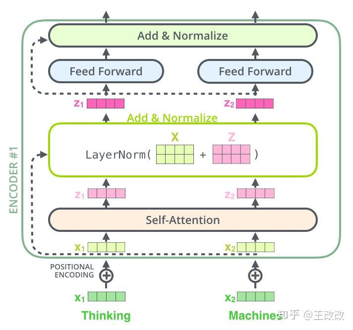

剛剛給出的一個 Encoder 的設計細節，Transformer 是可以有很多 Encoder 單元組合起來的，如下圖所示是兩個 Encoder 單元疊加起來：

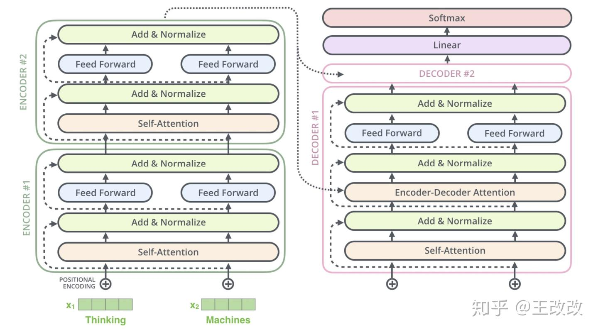

### Positional Encoding

循環神經網路每個時間步輸入一個單詞，通過這樣的迭代操作能夠捕獲輸入句子中單詞的位置資訊。但是 Transformer 模型沒有類似於循環神經網路的結構，所以必須提供每個單詞的位置資訊給 Transformer，這樣才能識別出語言中的順序關係。

所以，輸入進 Encoder 中的向量不僅僅是單詞的 embedding，而是單詞的 embedding 和位置向量 positional encoding 融合後的結果。位置向量 positional encoding 是如何構造的呢？

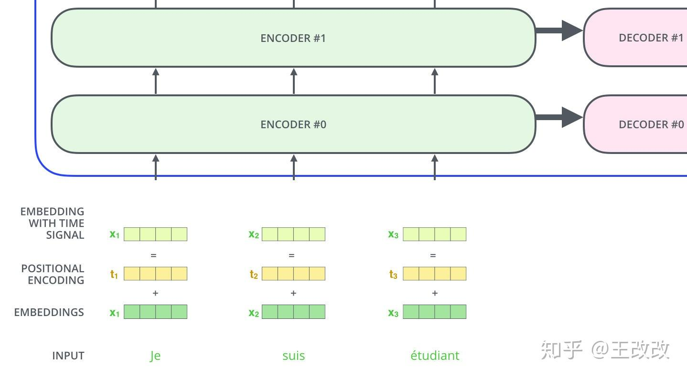

下圖是 paper 中的論述，如果讀不懂沒關係。

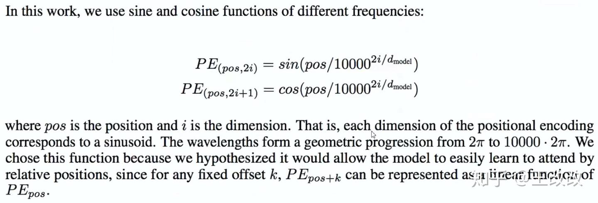

假設輸入的句子為："This tutorial is awesome"，如何去構造這個句子的 position encoding？首先我們知道構造出的 position encoding 是要和單詞的 embedding 相加的，所以假設詞的 embedding 和 position encoding 的維度都是 $d_{model}$。對於句子 "This tutorial is awesome" 來說，一個單詞的位置範圍為 $pos \in [0, L-1]$，$L$ 是句子的長度，假設 position encoding 的維度是 4，那麼這個單詞的 encoding 為：

$$e_w = \left[\sin\left(\frac{pos}{10000^0}\right), \cos\left(\frac{pos}{10000^0}\right), \sin\left(\frac{pos}{10000^{2/4}}\right), \cos\left(\frac{pos}{10000^{2/4}}\right)\right]$$

$$= \left[\sin(pos), \cos(pos), \sin\left(\frac{pos}{100}\right), \cos\left(\frac{pos}{100}\right)\right]$$

該 encoding 就是根據上圖中的公式構造出來的，其中位置為偶數時（0, 2, 4, ...）該維度上的值使用如下公式：

$$PE(pos, 2i) = \sin\left(\frac{pos}{10000^{2i/d_{model}}}\right)$$

奇數維度位置上採用如下的公式：

$$PE(pos, 2i+1) = \cos\left(\frac{pos}{10000^{2i/d_{model}}}\right)$$

至於為什麼要這樣做？這樣做是如何記錄位置資訊的呢？

我們把 0、1 看作一組，2、3 看作一組。每一組分別用 sin 和 cos 函數進行處理，進而能夠產生不同的週期性變化，隨著維度位置的序號不斷增大，$\frac{2i}{d_{model}}$ 也是變大的，那麼 $\frac{pos}{10000^{2i/d_{model}}}$ 的分母也是不斷變大的，再根據 sin、cos 函數的性質，那麼隨著維度位置序號的增大，週期變化會越來越慢，進而產生一種包含位置資訊的紋理。位置嵌入函數的週期從 $2\pi$ 到 $10000 \times 2\pi$ 變化，而每一個位置在不同維度上都會得到不同週期的 sin 和 cos 函數的取值組合，從而產生獨一的紋理位置資訊，模型從而學到位置之間的依賴關係和自然語言的時序特性。

下圖是對長度為 50 的句子，維度為 128 的 positional encoding 的視覺化，下圖中每一行代表一個 encoding 向量。最上面的一行是 position 為 0 的單詞的 encoding，最底下的一行是 position 為 50 的單詞的 encoding。根據下圖的紋理我們可以明顯的觀察到，隨著 position 的增大，靠前維度的值逐漸變小。這是符合我們的預期的。

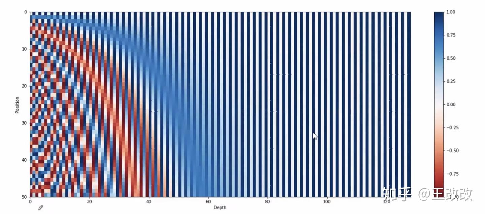

如果將上圖中每一行的 encoding 進行兩兩的點積操作就會得到下面的效果圖，點積操作可以計算兩個向量的相似程度。我們發現下圖中對角線的部分顏色最深，得到的值最大，這是因為對角線是向量本身進行點積，相似度肯定是最大的。而兩個 position 相差較大的數進行點積得到的值較小。通過下圖容易觀察到，從這個角度可以發現這種 position encoding 方式是有效的。

當然我認為 position encoding 不僅僅是這一種實現，可以有很多辦法。感興趣的可以看看這篇文章：[位置編碼探究](https://zhuanlan.zhihu.com/p/121126531)

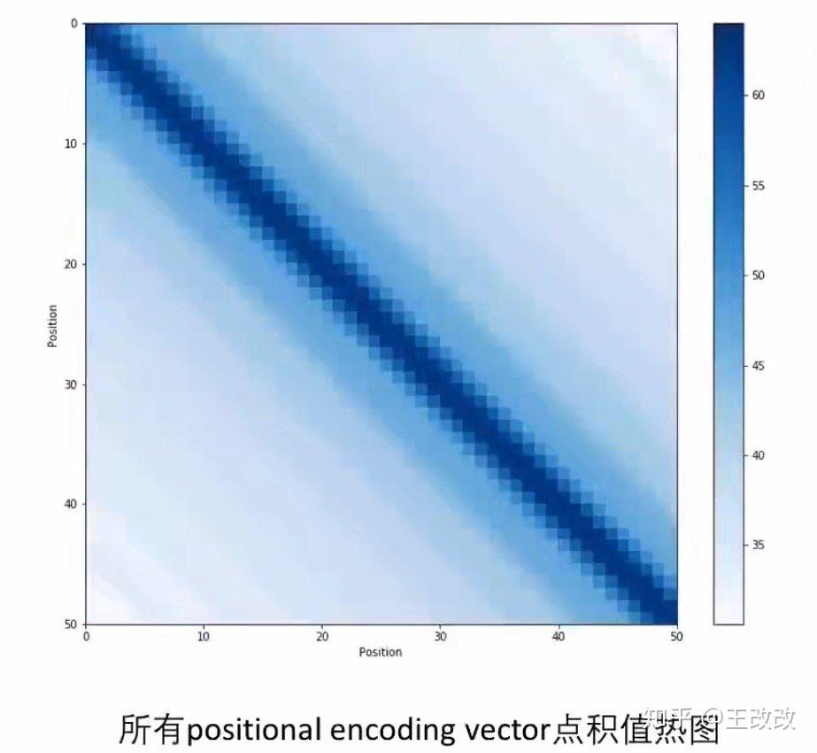

## Decoder

Decoder 中的模組和 Encoder 中的模組類似，都是 Attention 層、前饋網路層、融合歸一化層，不同的是 Decoder 中多了一個 Encoder-Decoder Attention 層。這裡先明確一下 Decoder 模組的輸入輸出和解碼過程：

- **輸出**：對應 $i$ 位置的輸出詞的機率分佈
- **輸入**：Encoder 模組的輸出 & 對應 $i-1$ 位置 Decoder 模組的輸出。所以中間的 Encoder-Decoder Attention 不是 self-attention，它的 K、V 來自 Encoder 模組，Q 來自上一位置 Decoder 模組的輸出
- **解碼**：**這裡要特別注意一下，編碼可以並行計算，一次性全部 encoding 出來，但解碼不是一次把所有序列解出來的，而是像 RNN 一樣一個一個解出來的**，因為要用上一個位置的輸入當作 attention 的 query

如下圖所示：

輸入序列經過 Encoder 部分，然後**將最上面的 Encoder 的輸出變換成一組 attention 向量 K 和 V**，這些向量會用於每個 Decoder 的 Encoder-Decoder Attention 層，有助於解碼器聚焦在輸入序列中的合適位置。

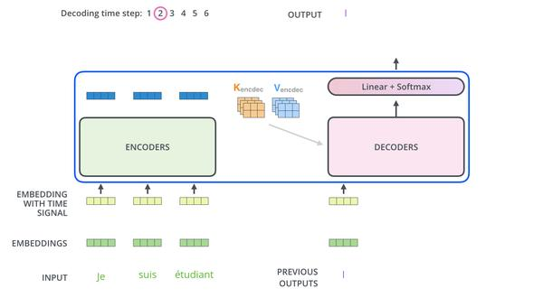

重複上面的過程，直到 Decoder 完成了輸出，每個時間步的輸出都在下一個時間步時餵入給最底部的 Decoder，同樣，在這些 Decoder 的輸入中也加入了位置編碼，來表示每個字的位置。

再來回顧這張圖，圈出來的 self-attention 是 masked self-attention。

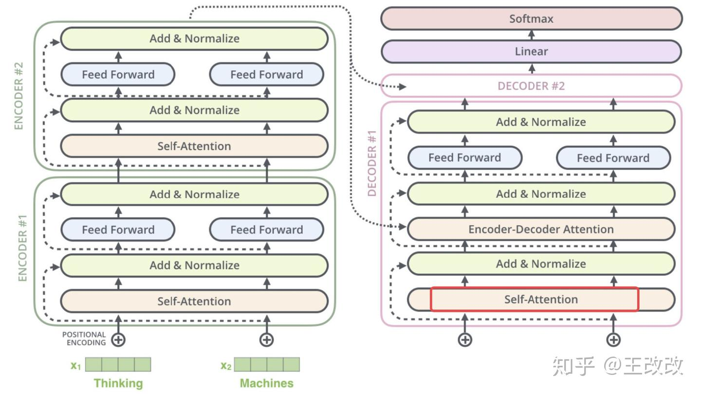

### Mask

mask 表示遮罩，它對某些值進行遮蓋，使其在參數更新時不產生效果。Transformer 模型裡面涉及兩種 mask，分別是 padding mask 和 sequence mask。

其中，padding mask 在所有的 scaled dot-product attention（具體該操作施加在哪個地方，可以看下圖）裡面都需要用到，而 sequence mask 只有在 Decoder 的 self-attention 裡面用到。

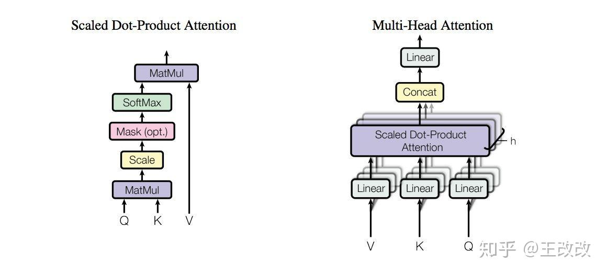

### Padding Mask

什麼是 padding mask 呢？因為每個批次輸入序列長度是不一樣的，也就是說，我們要對輸入序列進行對齊。具體來說，就是給在較短的序列後面填充 0。但是如果輸入的序列太長，則是截取左邊的內容，把多餘的直接捨棄。因為這些填充的位置，其實是沒什麼意義的，所以我們的 attention 機制不應該把注意力放在這些位置上，所以我們需要進行一些處理。

具體的做法是，把這些位置的值加上一個非常大的負數（負無窮），這樣的話，經過 softmax，這些位置的機率就會接近 0！

而我們的 padding mask 實際上是一個張量，每個值都是一個 Boolean，值為 false 的地方就是我們要進行處理的地方。

### Sequence Mask

sequence mask 是為了使得 Decoder 不能看見未來的資訊。也就是對於一個序列，在 time_step 為 $t$ 的時刻，我們的解碼輸出應該只能依賴於 $t$ 時刻之前的輸出，而不能依賴 $t$ 之後的輸出。因此我們需要想一個辦法，把 $t$ 之後的資訊給隱藏起來。

那麼具體怎麼做呢？也很簡單：產生一個上三角矩陣，上三角的值全為 0。把這個矩陣作用在每一個序列上，就可以達到我們的目的。

- 對於 Decoder 的 self-attention，裡面使用到的 scaled dot-product attention，同時需要 padding mask 和 sequence mask 作為 attn_mask，具體實現就是兩個 mask 相加作為 attn_mask。
- 其他情況，attn_mask 一律等於 padding mask。

### 參考連結

- [The Illustrated Transformer](http://jalammar.github.io/illustrated-transformer/)
- [terrifyzhao.github.io](https://terrifyzhao.github.io)
- [位置編碼探究](https://zhuanlan.zhihu.com/p/121126531)
- [a_journey_into_math_of_ml](https://github.com/aespresso/a_journey_into_math_of_ml)
- [Transformer 詳解](https://zhuanlan.zhihu.com/p/44121378)
