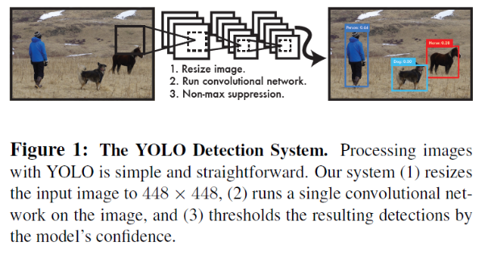
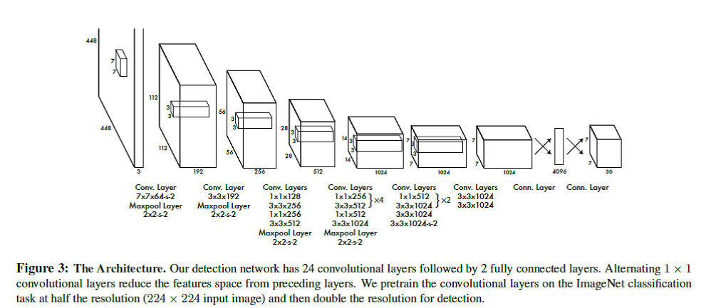
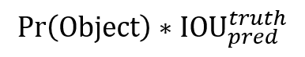
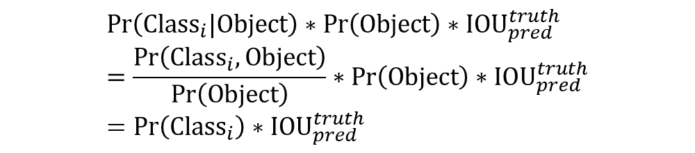
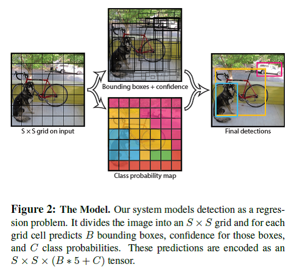
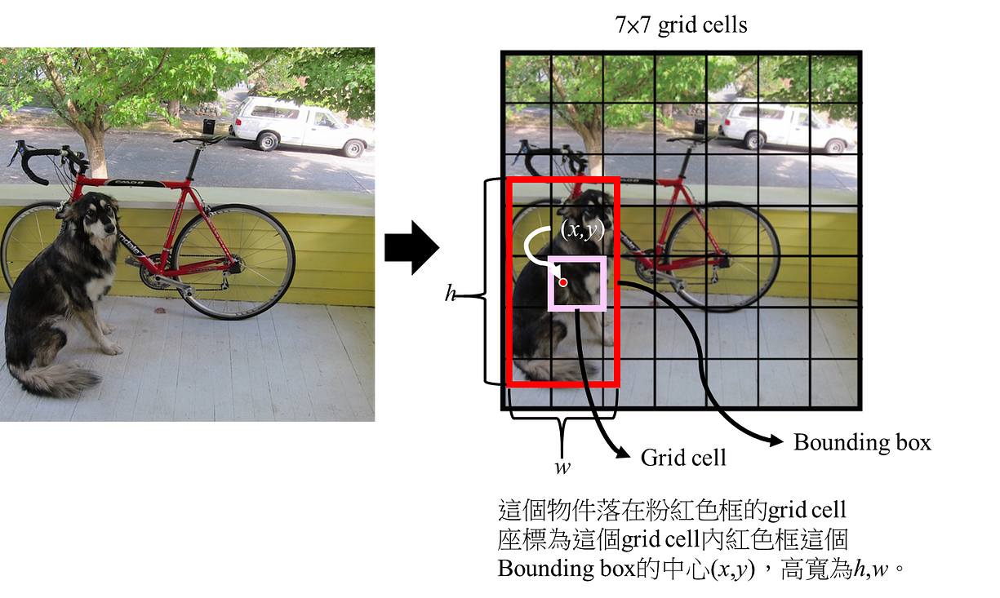
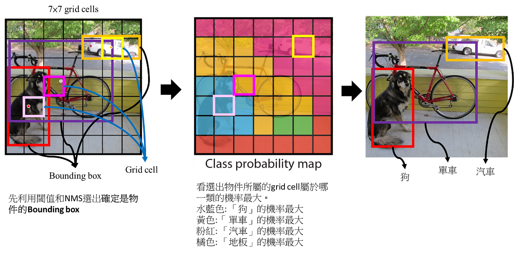
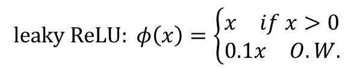
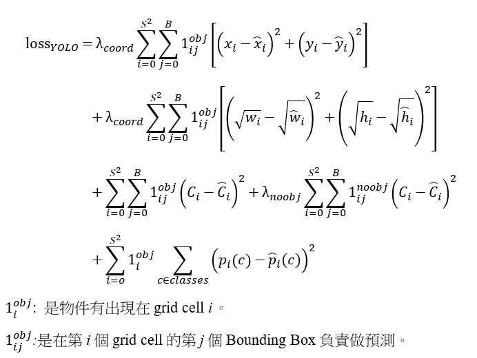

# 深度學習-物件偵測:You Only Look Once (YOLO)

https://chih-sheng-huang821.medium.com/%E6%B7%B1%E5%BA%A6%E5%AD%B8%E7%BF%92-%E7%89%A9%E4%BB%B6%E5%81%B5%E6%B8%AC-you-only-look-once-yolo-4fb9cf49453c

You Only Look Once (YOLO)這個字是作者取自於You only live once，YOLO是one stage的物件偵測方法，也就是只需要對圖片作一次 CNN架構便能夠判斷圖形內的物體位置與類別，因此提升辨識速度。對於one stage和two stage是什麼可以參考: [**深度學習-什麼是one stage，什麼是two stage 物件偵測**](https://medium.com/@chih.sheng.huang821/深度學習-什麼是one-stage-什麼是two-stage-物件偵測-fc3ce505390f)

三個YOLO重要的步驟

1.Resize輸入的圖到448*448

2. 執行一個卷積神經網路
3. 基於模型輸出的信心程度(Confidence)依據閾值和Non-max suppression得到偵測結果

這篇文章結構會分成

- **YOLO用的卷積神經網路**
- **YOLO物件偵測怎麼做的**
- **YOLO怎麼training**

# **YOLO用的卷積神經網路**

YOLO的卷積網路架構是來自GoogleNet的模型，YOLO的網路有24卷積層(convolutional layer)和2層全連結層(fully connected layer)，和GoogleNet不同的地方在於作者在某些3×3的卷積層前面用1×1的卷積層來減少filter數量，整體架構如下圖。

> Note: 1×1的卷積層通常拿來做降維度的作用，可以減低計算量，且不影響太多mAP。有興趣可以參考: [**卷積神經網路(Convolutional neural network, CNN): 1×1卷積計算在做什麼**](https://medium.com/@chih.sheng.huang821/卷積神經網路-convolutional-neural-network-cnn-1-1卷積計算在做什麼-7d7ebfe34b8)

# **YOLO物件偵測怎麼做的**

白話說就是:
YOLO在物件偵測部分基本上就是將圖拆成很多個grid cell，然後在每個grid cell進行2個bounding box的預測和屬於哪個類別的機率預測，最後用閾值和NMS (Non-Maximum Suppression) 的方式得到結果。

實際做法:
YOLO如何**得到很多個可能物件的信心程度、機率和bounding boxes**。

假設輸入圖的大小是100×100，總共偵測*C*個物件，YOLO最後輸出的tensor的大小是*S*×*S*×(*B*×5+*C*)←後面會開始講這個東西怎麼來的。

1. YOLO會把圖先平均分成*S*×*S*格，這邊假設S = 5，圖會被平均分成5×5格(如上左圖)，每一格在英文被稱為grid cell (大小為20×20)。

> 整體的概念就是**如果要「被偵測的物件中心」落在哪一個grid cell，那個grid cell就要負責偵測這個物件**。

2. 每個grid cell必須要負責預測「***B\*個bounding boxes」**和「**屬於每個類別的機率」**，每個bounding box會帶有**5個預設值(x, y, w, h, and confidence)**

(x, y)用來表示某一個物件在這個grid cell的中心座標，這個物件相對應的寬高分別為w, h。而confidence則是用來表示這個物件是否為一個物件的信心程度(confidence score)。

Confidence score在YOLO這篇文章內計算方式被定義為

所以從公式看就很直覺，如果在某個grid cell沒有任何物件，這時候confidence score就會是0，反之如果物件在grid cell內，最好的情況就是confidence score等於預測的bounding box和ground truth的IOU (intersection over union)。實際上confidence預測是預測bounding box和ground truth的IOU。

2.1 每個grid cell還需要負責預測「屬於每個類別的機率」，所以每個grid cell還會有C個條件機率(conditional class probabilities，Pr(Class|Object))，從公式很明顯就知道這個條件機率就是「這個grid cell內包含有一個物件這個物件屬於某一類的機率」。

> 這邊有一個地方跟新的方法不同的地方，也是這邊被後來YOLO版本修正的地方→YOLO的每個grid cell只預測一組類別的條件機率，換言之每個grid cell雖然有B個bounding box，但實際上只從B個bounding box中預測一個物件和這個物件屬於哪一類的機率。

2.2 這測試(test)階段時，實際上每個bounding box會得到一組class-specific confidence scores，計算方式如下:

3. 作者舉PASCAL VOC在執行YOLO的例子，他設定S=7，B=2，PASCAL VOC有20個物件的類別，所以C=20。一開始有說YOLO最後的tensor為*S*×*S*×(*B*×5+*C*)。以VOC的例子來說輸出為7×7×(2×5+20)= 7×7×30。

I. 這邊的7×7就是7×7個grid cell，每一個grid cell都會對應到原始圖的相對位置。
II. 2×5就是兩個Bounding box各自帶有5個數值分別為bounding box的中心座標(x,y)和寬長(w, h)和confidence score。
III. 20就是屬於20個類別的機率。

## Bounding box怎麼找物件和分類

下圖為YOLO作者放在論文中的解釋最後Bounding box怎麼找物件和分類的圖。

一般論文篇幅有限，加上作者會認為會看物件偵測的人基本上有一點common sense，所以會一張圖解釋所有的東西，這邊我把圖拆掉來說明。

1. Bounding Box在每個grid cell怎麼看，如下圖，紅色點為這個被偵測可能是物件的中心點，相對應的長寬可以框出紅色的框，這個就是Bounding box。

> Note: 我這段話寫「紅色點為這個被偵測**可能**是物件的中心點」，原因是我實際框出來的是狗的位置，但實際上YOLO的輸出Bounding box在每個grid cell是一定存在，所以有可能Bounding box框出的是背景，但YOLO的每個Bounding box都帶有一個confidence score，這個confidence score可以來決定這個Bounding box是否真的是物件。→基本上大多數的物件偵測都是這樣做。

2. 根據YOLO作者的想法整張圖一共最多有98個Bounding Box，也就是實際最多只能偵測98個物件，然後全部候選的Bounding box的(中心座標、長寬和confidence score)根據閾值和NMS選出這張圖所有的物件(如下圖的紅色框、紫色框和土黃色框)。

Note: 在YOLO作者的例子(7×7×(2×5+20))，共有7×7=49個grid cell，每個grid cell最多有2個Bounding box，所以全部候選的bounding box共有7×7×2=98個。

這98個Bounding Box的Confidence score先經由一個閾值(threshold)，先幹掉一些確定不是物件的Bounding box，可以減少後面NMS的計算。然後後面再用NMS(之後會再介紹NMS)的方式把一些重疊的Bounding Box做一個消除，重覆執行直到每個類別都完成，剩下來的Bounding Box就是選出來的物件。

3. YOLO同時間的輸出來還有(7×7×20)，這個代表每一個grid cell內每一類的機率，這時候取機率最大的那一類代表這個grid cell的類別(下中圖)。
4. 這時候結合「步驟2選出的物件」和「步驟3對應的grid cell是什麼類別」，就可以決定這個選出的物件屬於什麼類別(下右圖)。

# **YOLO怎麼training**

## **Pretain**:

YOLO作者用ImageNet 1000-class competition dataset來pretrain模型，但作者只訓練前20卷積層(上面paper節錄的Figure 3)後面接上一個average-pooling layer和一個全連結層(top-5 accuracy為88%)。

> 這邊蠻好玩的，作者自己做了一個稱為Darknet的framework來做全部的training和inference(只能說大神都很強)。

## **Bounding Box正規化**

YOLO的最後一層預測的是類別機率和bounding box等
在YOLO訓練前會先依據輸入圖的長寬，正規化(normalize)bounding box的長寬，因此bounding box的長寬會介於0~1之間。
Bounding box的中心座標(x,y)是在特定grid cell的偏移(offset)，所以座標也會介於0~1之間。

## **Activation function**

整個YOLO架構除了最後一層用線性輸出為，每一層都會搭配leaky rectified linear activation (leaky ReLU)

## **Loss function**

一般都用平方誤差和(sum-squared error)當作loss function，原因是容易最佳化(可以參考倒傳遞相關文章)。作者認為此方法不能完美校正去最大化目標的平均精度(average precision)，主要原因是每項目的error(比如bounding box的定位誤差(localization error)和分類的誤差(class error))都佔有一樣的比重，所以結果不太好(我猜作者應該是試過equal weight，所以他在文章寫in every image many grid cells do not contain any object.)，而且物件偵測多數情況，大多數的grid cell內是沒有物件的(在梯度求解的時候容易將有物件的cell壓過去)，所以容易導致confidence幾乎趨近於0，也因為如此容易造成模型不穩定。

為了解決這個問題，作者

1. 增加了在bounding box座標預測的loss權重 (λcoord=5)
2. 減低那些不包含物件的Box，confidence預測時的權重(λnoobj=0.5)

YOLO multi-part loss function定義如下，老實說一開始都很難看的懂(實際上真的很難看的懂@@):

如此一來此loss function只會針對物件如果有出現在某個grid cell下進行懲罰分類錯誤。並且只會針對有責任於偵測Ground truth box的預測者進行懲罰bounding box錯誤，也就是grid cell中有最高IOU的預測者。

## **結論**

Performance 這部分直接看論文吧。

這邊作者有提到YOLO的Limitations → 所以才有[YOLOv2](https://arxiv.org/abs/1612.08242)出來啊。

1. 第一點也是我前面有提到YOLO對Bounding box有很強烈的空間限制，也就是每個grid cell只有最多只有2個bounding box和一個類別，也是因為這點所以如果有兩個以上的物件在空間上離的非常近會導致模型無法有效偵測到，比如說有一群鳥(一群小物件)。
2. 第二bounding box的預測是從資料學來的，所以如果訓練好的模型要去預測其他新物件或是比例很怪的物件，可能就沒有辦法框的很好。這部份原因來自於YOLO本身有很多層的Pooling (downsampling)，最後得到的feature用來預測bounding box，相較於原始圖在空間上是比較粗略的。
3. 最後一點，作者提出的loss function在小物件和大物件的Bounding Box都用一樣的比重，但實際上在計算IOU時，小物件只要差一點點，定位(localization)的error影響就會很大，相對的大物件而言就比較沒有太大差異，作者提到主要的錯誤都是來自不正確的定位(incorrect localizations)。
