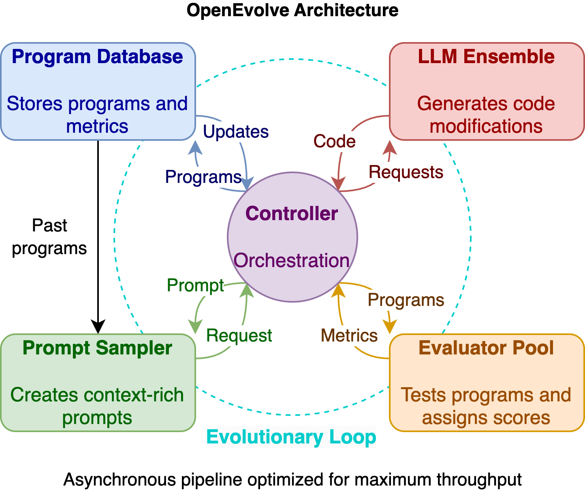

# OpenEvolve 架構與核心技術總覽

> 目的：說清楚 OpenEvolve 的整體架構、資料流程、核心技術與可擴充點，方便快速理解與二次開發。



## 1. 專案定位與核心概念
OpenEvolve 是一個以 **LLM 驅動的演化式程式優化系統**。核心思想是：
- 使用 **MAP-Elites + Islands** 維持多樣性
- 用 **LLM 產生候選程式**
- 用 **Evaluator 量測品質**
- 透過 **迭代、評估、選擇與遷移** 找到更好的解

## 1.1 核心原理（詳細）

### 1.1.1 問題建模
OpenEvolve 把「改善程式」視為黑箱優化問題：\n
- **搜尋空間**：由 LLM 產生的程式變體（diff 或 full rewrite）\n
- **評估函數**：使用者提供的 evaluator（可含多維 metrics）\n
- **目標**：最大化 fitness（預設 `combined_score`，或數值 metrics 平均）\n
- **約束**：code length、語言語法、evaluator 規則、diff 規則\n

### 1.1.2 MAP-Elites（Quality-Diversity）
核心不是單一最優解，而是「多樣高品質解的分佈」。\n
流程概念：\n
1. 定義特徵維度 `feature_dimensions`（可用 evaluator metrics 或內建 `complexity/diversity/score`）\n
2. 每個維度切分成 bins → 形成網格（MAP）\n
3. 每次產生新程式 → 對映到某格\n
4. 若該格空缺或新解更好 → 替換為 elite\n
\n
效果：\n
- 避免只追求單一指標造成早熟收斂\n
- 同時保存「好但風格不同」的解\n

### 1.1.3 Islands（分群族群 + 遷移）
MAP-Elites 內再切成多個 Islands：\n
- 每個 island 有自己的 elite map 與 population\n
- 形成半隔離的「演化實驗」，保持多樣性\n
- 透過 migration 定期交換 top programs\n
\n
效果：\n
- 防止單一 island 內過早陷入局部最優\n
- 讓探索與利用並行進行\n

### 1.1.4 LLM 作為「變異算子」
傳統演化靠 mutation/crossover，這裡用 LLM：\n
- **Prompt** 含父代程式 + metrics + inspirations + artifacts\n
- 產生 diff 或 full rewrite → 子代\n
- LLM 的「知識」相當於高階變異器，能生成非局部改動\n

### 1.1.5 Fitness 與 Feature 分離
核心做法：\n
- **Fitness**：用於比較好壞（預設 `combined_score` 或平均值）\n
- **Features**：用於分佈多樣性（`feature_dimensions`）\n
\n
好處：\n
- 允許不同「風格區域」都能保留好的解\n

### 1.1.6 Cascade Evaluation（成本控制）
Evaluator 支援 `evaluate_stage1/2/3`：\n
- Stage1 快速檢查，篩掉差的\n
- Stage2/3 成本較高但更精確\n
\n
好處：\n
- 降低昂貴評估成本\n
- 在大型演化中可提升 throughput\n

### 1.1.7 Artifacts Feedback Loop
Evaluator 可以回傳 artifacts：\n
- stderr / timeout / profiling / warnings\n
- 這些會回到 prompt，形成「錯誤驅動的學習回饋」\n
\n
效果：\n
- LLM 能避開重複錯誤\n
- 讓改動更有方向感\n

### 1.1.8 Novelty Filtering
若啟用 embedding：\n
- 計算新程式 embedding\n
- 與 island 內程式比 cosine similarity\n
- 太相似 → 透過 LLM novelty judge 再判斷\n
\n
效果：\n
- 避免生成大量近似程式\n
- 提升探索效率\n

### 1.1.9 Diff-based Evolution 的穩定性
diff-based 提供：\n
- 明確指定「搜尋/替換」範圍\n
- 降低 LLM 改壞其餘程式碼的機率\n
- 更適合大型程式碼或需要精細控制的任務\n

## 2. 高階架構（模組分層）

### 2.1 入口層（CLI / Library）
- CLI：`openevolve-run.py` → `openevolve/cli.py`
- Library API：`openevolve/api.py`（`run_evolution` / `evolve_function`）

### 2.2 控制層（Controller）
- `openevolve/controller.py`
- 職責：
  - 初始化配置與資源
  - 建立核心元件（LLM / Prompt / Evaluator / Database / Trace）
  - 啟動平行演化流程
  - 管理 checkpoint、best program、log

### 2.3 演化流程層（Parallel / Iteration）
- `openevolve/process_parallel.py`
- `openevolve/iteration.py`（單機共享 DB 版本）
- 職責：
  - 取樣 parent + inspirations
  - 建 Prompt → 呼叫 LLM
  - 解析 diff 或 full rewrite
  - 評估子代並回寫 DB

### 2.4 評估層（Evaluator）
- `openevolve/evaluator.py`
- 支援：
  - 直接評估 (`evaluate`)
  - Cascade 評估（`evaluate_stage1/2/3`）
  - LLM Feedback 評估
  - Artifacts side-channel（stderr、profiling、warnings…）

### 2.5 資料層（Database / Program）
- `openevolve/database.py`
- `Program` 資料結構承載 code/metrics/metadata/artifacts/embedding
- MAP-Elites grid + Islands + Archive + Best tracking

### 2.6 LLM 層
- `openevolve/llm/*`
- `LLMEnsemble`：加權取樣多模型
- `OpenAILLM`：OpenAI-compatible API + 手動模式
- 支援 reasoning model 參數與 seed

### 2.7 Prompt 系統
- `openevolve/prompt/*`
- `PromptSampler` 根據 metrics、歷史程式、artifacts 產生 prompt
- `TemplateManager` 載入 `openevolve/prompts/defaults/*`

### 2.8 擴充與視覺化
- Evolution Trace：`openevolve/evolution_trace.py`
- Visualizer：`scripts/visualizer.py`（Flask UI）

## 3. 核心資料流程（從輸入到輸出）

1. **啟動**（CLI 或 API）
   - 讀入初始程式與 evaluator
   - 載入 `Config`（`configs/default_config.yaml` 是完整模板）

2. **初始化元件**（`OpenEvolve.__init__`）
   - `LLMEnsemble` / `PromptSampler` / `Evaluator` / `ProgramDatabase`
   - 設定 log / output / checkpoint
   - optional：`EvolutionTracer`

3. **初始程式評估**
   - 初始 program 先進行評估 → 作為 baseline 進 DB

4. **迭代演化（Parallel Controller）**
   - 每個 iteration：
     1) 從 **Island** 中挑 parent + inspirations
     2) `PromptSampler` 組 prompt
     3) LLM 產生 diff 或 full rewrite
     4) 評估子代（含 cascade / LLM feedback）
     5) 子代入庫（MAP-Elites + Archive + Best tracking）
     6) 需要時做 Migration

5. **產出結果**
   - `openevolve_output/best/` 保存 best program
   - `openevolve_output/checkpoints/` 保存 checkpoint
   - optional：trace / artifacts

## 4. 核心資料結構

### 4.1 Program（`openevolve/database.py`）
- `id` / `code` / `metrics` / `parent_id`
- `changes_description`：大程式碼模式的 diff 描述
- `metadata`：包含 island、parent_metrics 等
- `artifacts`：錯誤/執行資訊 side-channel
- `embedding`：Novelty 判斷用

### 4.2 EvaluationResult（`openevolve/evaluation_result.py`）
- `metrics`：評估分數（數值）
- `artifacts`：任意文字/二進位資料
- 允許 evaluator 回傳 dict 或 `EvaluationResult`

### 4.3 Config（`openevolve/config.py`）
- LLM / Prompt / Database / Evaluator 全部集中管理
- 支援 env var（`${OPENAI_API_KEY}`）

## 5. 核心技術重點

### 5.1 MAP-Elites + Islands
- MAP-Elites 用於維持多樣性
- Islands 將族群分群，避免快速收斂
- Migration 定期交換菁英
- `feature_dimensions` 以 metrics 或內建 complexity/diversity/score 作為維度

### 5.2 LLM Ensemble
- 多模型加權取樣
- 可設定 primary/secondary 或直接 models list

### 5.3 Diff-based Evolution
- 預設要求 LLM 產生 SEARCH/REPLACE diff
- 減少 hallucination，提升局部修正可控性

### 5.4 Cascade Evaluation
- `evaluate_stage1/2/3` 逐步增加評估難度
- 減少昂貴測試次數

### 5.5 Artifacts Side-Channel
- 評估結果可附帶 stderr / warnings / profiling
- 會進入 prompt，形成 error-driven feedback loop

### 5.6 Novelty Filtering
- Embedding + cosine similarity
- 若相似度過高，使用 LLM novelty judge

### 5.7 Evolution Trace
- 可輸出 JSONL/JSON/HDF5
- 用於 RL 訓練或分析

## 6. 目錄導覽（重要檔案）

- `openevolve/`：核心程式
  - `controller.py`：主控
  - `process_parallel.py`：多行程演化
  - `database.py`：MAP-Elites + Islands
  - `evaluator.py`：評估管線
  - `llm/`：LLM 介面
  - `prompt/`：prompt 建構
  - `evolution_trace.py`：trace 記錄
- `configs/`：範例設定
- `examples/`：各種任務案例
- `scripts/visualizer.py`：視覺化 UI

## 7. 輸出與儲存格式

- Output 目錄預設為 `initial_program` 同層的 `openevolve_output/`
- 常見結構：
  - `best/`：最佳程式碼與 `best_program_info.json`
  - `checkpoints/checkpoint_N/`：
    - `metadata.json`
    - `programs/*.json`
    - `best_program.*` + `best_program_info.json`
  - `logs/`：執行 log

## 8. 擴充點

- **自訂 evaluator**：回傳 metrics + artifacts
- **自訂 feature dimensions**：由 evaluator 回傳 raw metrics
- **自訂 prompt templates**：指定 `prompt.template_dir`
- **自訂 LLM client**：`LLMModelConfig.init_client`
- **手動模式**：`llm.manual_mode` 啟動 human-in-the-loop queue

## 9. 可能的限制與注意事項

- LLM API 必須 OpenAI-compatible
- Embedding novelty 檢測需要對應 embedding model
- Cascade 評估需自行實作 `evaluate_stage1/2/3`
- 若 evaluator 沒回 `combined_score`，系統會用數值 metrics 平均值當 fitness

---

## 10. 安裝與編譯

### 10.1 環境需求

- Python >= 3.10
- pip 套件管理工具
- (建議) 虛擬環境 (venv 或 conda)

### 10.2 安裝步驟

#### 方法 1：從 PyPI 安裝（推薦）

```bash
# 安裝最新穩定版本
pip install openevolve

# 或安裝開發依賴（包含測試、格式化工具等）
pip install openevolve[dev]
```

#### 方法 2：從源碼安裝（開發模式）

```bash
# 1. Clone 專案
git clone https://github.com/algorithmicsuperintelligence/openevolve.git
cd openevolve

# 2. 安裝開發模式（可編輯）
pip install -e ".[dev]"

# 3. 驗證安裝
python -c "import openevolve; print(openevolve.__version__)"
```

#### 方法 3：使用 Makefile（開發者）

```bash
# 安裝所有依賴
make install

# 運行測試
make test

# 代碼格式化
make lint
```

### 10.3 配置 API Key

OpenEvolve 支援任何 OpenAI-compatible API，包括：
- Google Gemini (免費額度可用)
- OpenAI GPT models
- Anthropic Claude
- 本地 LLM (通過 vLLM, Ollama 等)

```bash
# 設定環境變數
export OPENAI_API_KEY="your-api-key-here"

# 或在配置文件中指定
# configs/*.yaml 中的 llm.models[].api_key: "${OPENAI_API_KEY}"
```

### 10.4 驗證安裝

```bash
# 檢查版本
pip show openevolve

# 運行最小範例
cd examples/function_minimization
python ../../openevolve-run.py initial_program.py evaluator.py --config config.yaml --iterations 10
```

---

## 11. 實際範例：函數最小化 (Function Minimization)

本節示範如何使用 OpenEvolve 進行完整的演化流程。

### 11.1 範例說明

**目標**：演化一個優化算法，找到複雜非凸函數的全局最小值

**測試函數**：
```python
f(x, y) = sin(x) * cos(y) + sin(x*y) + (x^2 + y^2)/20
```

**全局最小值**：約在 (-1.704, 0.678)，函數值約 -1.519

### 11.2 專案結構

```bash
examples/function_minimization/
├── initial_program.py   # 初始算法（簡單隨機搜尋）
├── evaluator.py         # 評估器（測試算法品質）
├── config.yaml          # 演化配置
├── requirements.txt     # Python 依賴
└── README.md           # 詳細說明
```

### 11.3 完整運行步驟

#### 步驟 1：進入範例目錄

```bash
cd examples/function_minimization
```

#### 步驟 2：設定 API Key

```bash
# 使用 Google Gemini (免費)
export OPENAI_API_KEY="your-gemini-api-key"

# 取得 API Key: https://aistudio.google.com/apikey
```

#### 步驟 3：運行演化（基礎）

```bash
# 運行 50 次迭代
python ../../openevolve-run.py \
  initial_program.py \
  evaluator.py \
  --config config.yaml \
  --iterations 50
```

#### 步驟 4：運行演化（進階選項）

```bash
# 指定輸出目錄
python ../../openevolve-run.py \
  initial_program.py \
  evaluator.py \
  --config config.yaml \
  --iterations 100 \
  --output-dir ./my_evolution_results

# 從 checkpoint 恢復
python ../../openevolve-run.py \
  initial_program.py \
  evaluator.py \
  --config config.yaml \
  --checkpoint ./my_evolution_results/checkpoints/checkpoint_50 \
  --iterations 50

# 啟用視覺化追蹤
python ../../openevolve-run.py \
  initial_program.py \
  evaluator.py \
  --config config.yaml \
  --iterations 50 \
  --trace
```

### 11.4 預期輸出

#### 終端輸出範例

```
[OpenEvolve] Starting evolution...
[OpenEvolve] Initial program evaluated: combined_score=0.234
[OpenEvolve] Iteration 1/50: best_score=0.345
[OpenEvolve] Iteration 5/50: best_score=0.512
[OpenEvolve] Iteration 10/50: best_score=0.678 (New best!)
[OpenEvolve] Iteration 20/50: best_score=0.834
...
[OpenEvolve] Evolution complete!
[OpenEvolve] Best program saved to: openevolve_output/best/best_program.py
```

#### 輸出目錄結構

```
openevolve_output/
├── best/
│   ├── best_program.py          # 最佳演化程式
│   └── best_program_info.json   # 最佳程式指標
├── checkpoints/
│   ├── checkpoint_10/
│   │   ├── metadata.json
│   │   ├── programs/*.json
│   │   └── best_program.py
│   ├── checkpoint_20/
│   └── ...
└── logs/
    └── evolution.log
```

#### 演化結果範例

**初始算法（隨機搜尋）**：
- Combined Score: ~0.234
- 策略：完全隨機採樣，無記憶

**演化後算法（模擬退火）**：
- Combined Score: ~0.922
- 策略：溫度控制、自適應步長、停滯檢測
- 改善幅度：**約 3.9 倍**

**關鍵演化發現**：
1. 自動發現了**模擬退火**算法（Simulated Annealing）
2. 引入**溫度參數**允許爬坡移動，逃離局部最小值
3. 實現**自適應步長**，根據進展動態調整探索範圍
4. 添加**停滯檢測**，當長時間無改善時增加探索力度

### 11.5 視覺化結果

```bash
# 啟動視覺化伺服器
python ../../scripts/visualizer.py --path openevolve_output/checkpoints/checkpoint_50/

# 瀏覽器開啟 http://localhost:5000
# 可以看到：
# - 演化樹狀圖
# - 程式碼差異對比
# - 指標變化曲線
# - Islands 分佈熱力圖
```

### 11.6 自訂配置

編輯 `config.yaml` 調整演化行為：

```yaml
# 修改 LLM 模型
llm:
  models:
    - model_id: gemini-2.0-flash-exp
      api_base: https://generativelanguage.googleapis.com/v1beta/openai/
      weight: 1.0

# 調整演化策略
prompt:
  diff_based_evolution: true  # true=差分演化, false=完整重寫
  max_parents_to_sample: 3    # 每次取樣的父代數量

# Islands 配置
database:
  num_islands: 4              # Island 數量
  migration_interval: 10      # 每 N 代執行一次遷移
```

### 11.7 進階使用：Library API

```python
from openevolve.api import evolve_function
import numpy as np

# 定義評估函數
def evaluate_function(x, y):
    return np.sin(x) * np.cos(y) + np.sin(x*y) + (x**2 + y**2)/20

# 定義初始算法
def initial_algorithm(iterations=1000, bounds=(-5, 5)):
    best_x = np.random.uniform(bounds[0], bounds[1])
    best_y = np.random.uniform(bounds[0], bounds[1])
    best_value = evaluate_function(best_x, best_y)

    for _ in range(iterations):
        x = np.random.uniform(bounds[0], bounds[1])
        y = np.random.uniform(bounds[0], bounds[1])
        value = evaluate_function(x, y)
        if value < best_value:
            best_value = value
            best_x, best_y = x, y

    return best_x, best_y, best_value

# 執行演化
result = evolve_function(
    initial_algorithm,
    evaluator=my_evaluator,  # 自定義評估器
    iterations=50,
    system_message="Optimize this algorithm for finding global minimum"
)

print(f"Best algorithm:\n{result.best_program.code}")
print(f"Best score: {result.best_program.metrics['combined_score']}")
```

### 11.8 常見問題排查

| 問題 | 解決方案 |
|------|----------|
| `ImportError: No module named 'openevolve'` | 執行 `pip install openevolve` |
| `API key not set` | 設定 `export OPENAI_API_KEY="your-key"` |
| 演化無進展 | 增加 `iterations`、調整 `temperature`、檢查 evaluator |
| 記憶體不足 | 減少 `num_islands` 或 `parallel_workers` |
| LLM 回傳錯誤程式碼 | 啟用 `diff_based_evolution: true` |

---

## 12. 建議閱讀順序（快速上手）

1. `README.md`（概覽 + quick start）
2. `configs/default_config.yaml`（完整參數）
3. `openevolve/controller.py`（主流程）
4. `openevolve/process_parallel.py`（平行演化）
5. `openevolve/database.py`（MAP-Elites / Islands）
6. `openevolve/evaluator.py`（評估流程）
