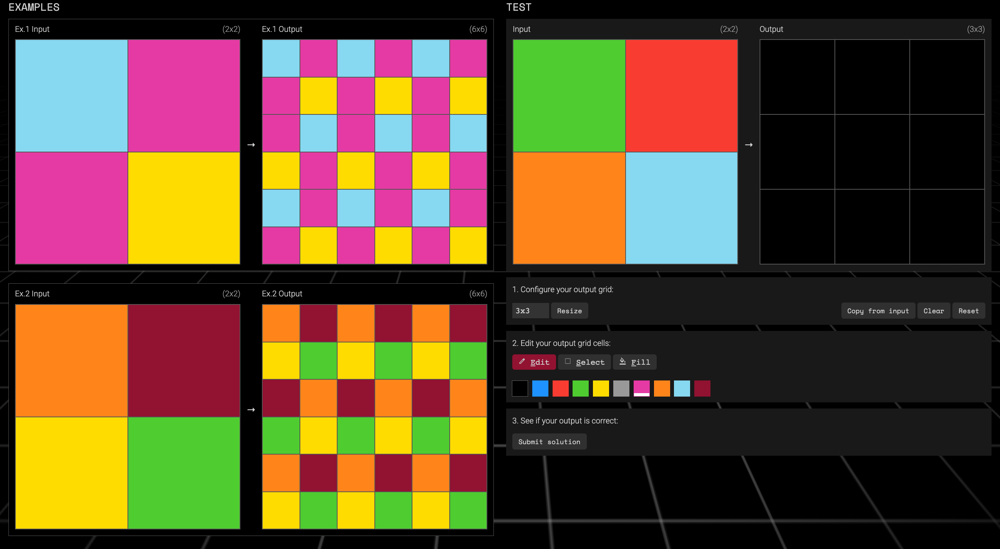

# ARC Benchmark example

This example demonstrates how one can use OpenEvolve to solve tasks from the [ARC-AGI benchmark](https://arcprize.org/)

## Problem Description

At the core of ARC-AGI benchmark design is the principle of "Easy for Humans, Hard for AI."

In each task, you are provided with a few "train" examples consisting of input-output grid pairs. These pairs have a common underlying transformation that maps the inputs to the outputs. Your objective is to learn this underlying transformation and successfully apply it to the test input(s). You are allowed to make 2 attempts and is any one of them is 100% matching the expected output, you have "passed". This metric is also known as "pass@2 accuracy". Below is an example of such a task ([Task 00576224](https://arcprize.org/tasks/00576224/)). For more examples and information, refer to the [ARC-AGI benchmark](https://arcprize.org/) website.




## Getting Started

Download the arc-prize-2025 dataset from [Kaggle](https://www.kaggle.com/competitions/arc-prize-2025/data).

Set the correct dataset root and API key in `examples/arc_benchmark/run_evolution.sh` by editing the lines:
```bash
export OPENAI_API_KEY="your-gemini-api-key"
export DATA_ROOT="../../data/arc-prize-2025"
```

If you want to use the 'training' or 'test' ARC tasks instead of the default 'evaluation' tasks, edit the following lines in `examples/arc_benchmark/run_evolution.sh`
```bash
TASK_FILE="evaluation" # Options: training, evaluation, test (default: evaluation)
...
export ARC_TASK_FILE=$TASK_FILE
```

To run this example, with default task (Task 0 from arc-agi_evaluation_challenges.json):

```bash
cd examples/arc_benchmark
chmod +x ./run_evolution.sh
./run_evolution.sh 0    # Replace the 0 with your favorite task number
```
The order of Task IDs is the same as the order on [this link](https://arcprize.org/tasks/). ('evaluation' set Task 0 = Task ID 0934a4d8)

## Example Task 0934a4d8


Base Gemini-3-Pro fails to solve this task (https://arcprize.org/tasks/0934a4d8/)

After just 2 iterations of OpenEvolve using `examples/arc_benchmark/initial_program.py` as a seed program, it manages to discover the solution in the following python program:

```python
# EVOLVE-BLOCK-START

import numpy as np

def transform_grid_attempt_1(grid):
    """
    Transformation logic:
    1. Identify the bounding box of the '8' values (mask) in the grid.
    2. The output grid has the same dimensions as this bounding box.
    3. For each cell (r, c) in the bounding box:
       a. Calculate the vertically symmetric row: target_r = (Height + 1) - r.
          If target_r is valid and grid[target_r, c] is not 8, use it.
       b. Otherwise, use the diagonally transposed position: grid[c, r].
    """
    arr = _validate_grid(grid)
    rows, cols = np.where(arr == 8)
    
    if len(rows) == 0:
        return arr
        
    min_r, max_r = np.min(rows), np.max(rows)
    min_c, max_c = np.min(cols), np.max(cols)
    
    height = max_r - min_r + 1
    width = max_c - min_c + 1
    
    out = np.zeros((height, width), dtype=np.int32)
    
    N = arr.shape[0]
    # Reflection constant determined to be N + 1 (31 for 30x30)
    reflection_constant = N + 1
    
    for r in range(min_r, max_r + 1):
        for c in range(min_c, max_c + 1):
            target_r = reflection_constant - r
            
            val = 8
            if 0 <= target_r < N:
                val = arr[target_r, c]
            
            if val == 8:
                # Fallback to diagonal transpose
                # Ensure indices are within bounds (though for square grids they should be)
                if 0 <= c < N and 0 <= r < arr.shape[1]:
                    val = arr[c, r]
            
            out[r - min_r, c - min_c] = val
            
    return out

def transform_grid_attempt_2(grid):
    """
    Similar to attempt 1 but with an additional fallback strategy.
    Strategies:
    1. Vertical reflection: grid[31-r, c]
    2. Diagonal transpose: grid[c, r]
    3. Horizontal reflection: grid[r, 31-c]
    """
    arr = _validate_grid(grid)
    rows, cols = np.where(arr == 8)
    
    if len(rows) == 0:
        return arr
        
    min_r, max_r = np.min(rows), np.max(rows)
    min_c, max_c = np.min(cols), np.max(cols)
    
    out = np.zeros((max_r - min_r + 1, max_c - min_c + 1), dtype=np.int32)
    N = arr.shape[0]
    M = arr.shape[1]
    
    for r in range(min_r, max_r + 1):
        for c in range(min_c, max_c + 1):
            val = 8
            
            # 1. Vertical reflection
            tr = (N + 1) - r
            if 0 <= tr < N:
                val = arr[tr, c]
            
            # 2. Diagonal transpose
            if val == 8:
                if 0 <= c < N and 0 <= r < M:
                    val = arr[c, r]
            
            # 3. Horizontal reflection
            if val == 8:
                tc = (M + 1) - c
                if 0 <= tc < M:
                    val = arr[r, tc]
                    
            out[r - min_r, c - min_c] = val
            
    return out

# EVOLVE-BLOCK-END
```

Both the attempts of the solution successfully solve all the train examples as well as the test example. The relevant output files are `examples/arc_benchmark/outputs/evaluation_task_0/best/best_program_info.json` and `examples/arc_benchmark/outputs/evaluation_task_0/best/post_evolution_evaluation_result.json`.

```json
{
  "id": "ce48590c-4448-45b9-83f4-9e0a85424033",
  "generation": 1,
  "iteration": 2,
  "timestamp": 1767790991.5850093,
  "parent_id": "90c2a0c2-e3bd-4aa4-9bdc-1ab1b9326f97",
  "metrics": {
    "runs_successfully": 1.0,
    "combined_score": 1.0,
    "train_example_0_pass_at_2": 1,
    "train_example_0_attempt_0": true,
    "train_example_0_attempt_1": true,
    "train_example_1_pass_at_2": 1,
    "train_example_1_attempt_0": true,
    "train_example_1_attempt_1": true,
    "train_example_2_pass_at_2": 1,
    "train_example_2_attempt_0": true,
    "train_example_2_attempt_1": true,
    "train_example_3_pass_at_2": 1,
    "train_example_3_attempt_0": true,
    "train_example_3_attempt_1": true
  },
  "language": "python",
  "saved_at": 1767791374.6249106
}

{
    "metrics": {
        "runs_successfully": 1.0,
        "combined_score": 1.0,
        "test_example_0_pass_at_2": 1,
        "test_example_0_attempt_0": true,
        "test_example_0_attempt_1": true
    },
    "artifacts": {}
}
```
