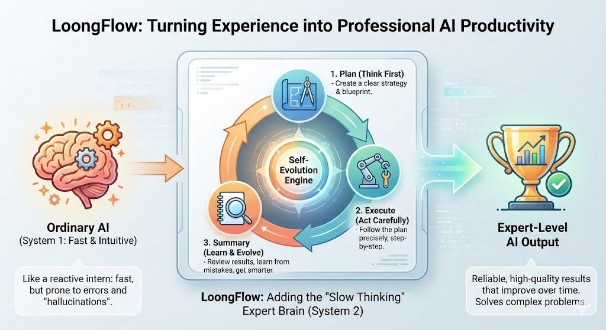
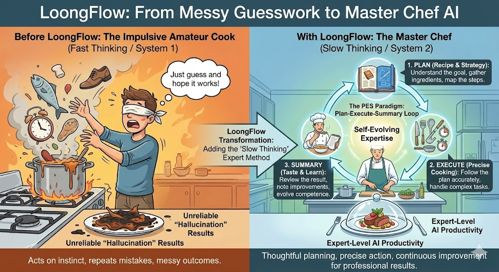
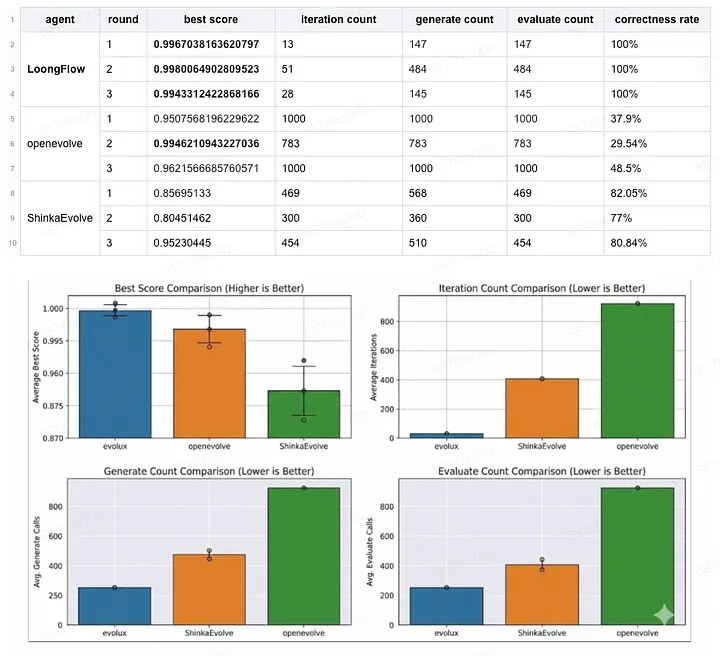
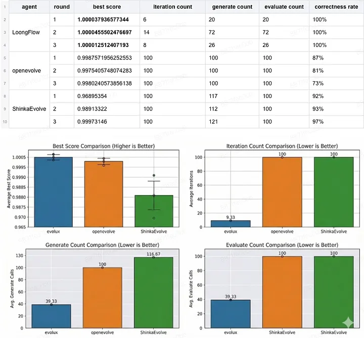

# LoongFlow 與 OpenEvolve：從暴力進化到思考型代理

在 DeepMind 推出 AlphaEvolve 之後，AI 社群對「進化代理」的概念愈來愈感興趣。這類系統的核心承諾很直接：代理不只會執行程式碼，還能隨著迭代持續改進程式碼，最後產生人類工程師未必會先想到的解法。

一段時間以來，OpenEvolve 一直是這個方向中相當有代表性的開源實作。它的路線接近「適者生存」：大量產生程式碼變異，反覆評估，再保留表現較好的版本。這種方法可以運作，但在複雜、長週期的任務上，經常會碰到計算成本高、結果不穩定，以及容易卡在局部最佳解等問題。

[LoongFlow](https://github.com/baidu-baige/LoongFlow) 想解決的正是這些痛點。它不只把自己定位成進化框架，而是更進一步把自己定義成會「思考」與「學習」的代理系統。它把原本偏向隨機變異的流程，改造成結構化的 PES（Planning、Execution、Summary）範式，主張代理可以像研究者一樣規劃、執行、反思，再把結果累積成可重用的經驗。

本文整理 LoongFlow 與 OpenEvolve 的核心差異，並根據公開說明比較兩者在效率、穩定性與架構設計上的分野。

## 核心理念：盲目變異 vs. 專家直覺

LoongFlow 與 OpenEvolve 的根本差異，不在於兩者都會寫程式碼，而在於它們如何面對「前一次失敗」。

### OpenEvolve：偏向暴力搜尋的進化流程

OpenEvolve 的設計接近經典進化演算法：

- 產生程式碼變異。
- 執行評估。
- 保留表現較好的候選。
- 再次變異並重複流程。

這種模式的優點是直接、容易理解，也適合做概念驗證。不過它的主要限制也很明顯：系統未必真的知道哪裡做錯、為什麼失敗，只是持續嘗試不同變體。換句話說，它比較像在大型搜尋空間裡做試錯，而不是在建立可累積的問題理解。

### LoongFlow：以 PES 範式導入結構化反思

LoongFlow 以 PES 範式取代單純的隨機變異流程：

1. **Planning**：先分析任務、歷史結果與先驗知識，制定這一輪的策略。
2. **Execution**：依照策略完成程式碼實作與驗證，必要時做局部修正。
3. **Summary**：針對這一輪的結果做多維度回顧，記錄哪些做法有效、哪些無效，以及原因是什麼。

這裡最關鍵的是第三步。LoongFlow 不只是保留分數較高的候選，而是把成功與失敗的訊息都轉化成可延續的結構化記憶。這讓後續迭代不必重複踩同樣的坑。

### 一個直觀類比

如果把 OpenEvolve 想成不斷測試大量材料的發明家，那 LoongFlow 更像是先分析材料特性，再推導出更可能成功候選的研究者。兩者都可能找到答案，但後者通常能用更少次數接近目標。

## 基準測試比較：效率與穩定性

LoongFlow 團隊用圓形 packing 問題，將 LoongFlow 與 OpenEvolve、ShinkaEvolve 做正面比較。這是一類常見的數學最佳化任務，適合觀察代理在多輪進化中的搜尋效率與收斂品質。

### 實驗 1：效率與穩定性

- 模型：DeepSeek-R1-0528
- 時限：24 小時
- 指標：
  - 最終得分
  - 達成最佳得分所需的生成呼叫次數

這組實驗的重點有兩個：

1. **效率差距明顯**：LoongFlow 平均約用 258 次生成呼叫就解出問題；OpenEvolve 則接近 927 次，約為前者的 4 倍。
2. **穩定性更高**：LoongFlow 在公開描述中達到 100% 成功率，能穩定收斂到 0.99 以上分數；OpenEvolve 則出現部分執行停留在 0.95 到 0.96，未能完成收斂。

### 實驗 2：受限資源測試

- 模型：Gemini-3-Pro
- 限制：最多 100 次迭代
- 目標：比較在緊縮運算預算下，哪個代理學得更快

這組結果更能看出學習速度差異：

1. **LoongFlow 是唯一突破 1.0 歸一化分數門檻的框架**。
2. **LoongFlow 收斂更快**：平均約 39 次生成呼叫就完成任務；OpenEvolve 與 ShinkaEvolve 即使耗盡 100 次迭代，仍未完全解出問題。

### 為什麼這些結果重要

這些數字背後對應到的是兩種不同的成本結構：

- OpenEvolve 更依賴大量試錯，會把算力花在重複探索上。
- LoongFlow 透過總結與記憶，讓後續輪次更有方向感。

如果任務本身需要長時間探索，或模型呼叫成本高，這種差異會被放大得非常明顯。

## 深入剖析：LoongFlow 為什麼會贏

從架構角度來看，LoongFlow 的優勢主要來自三個地方。

### 1. 進化樹與全域記憶

OpenEvolve 會保留高分候選，但對失敗上下文的保留比較有限。LoongFlow 則結合進化樹與 MAP-Elites 這類多樣性維持機制，把不同類型的候選解都保存下來。這能降低代理過早收斂到單一路徑的風險，也讓它在需要跳脫局部最佳解時，仍有其他候選方向可回溯。

### 2. 角色分工的子代理

LoongFlow 並不是單純要求一個 LLM「表現更好」，而是把工作拆成不同角色：

- **規劃者**：負責高層策略與任務拆解。
- **執行者**：負責實作、驗證與局部修正。
- **總結者**：負責分析分數變化、回收經驗與整理教訓。

這種設計的價值在於，系統不必把所有認知工作都塞給單一代理，而是讓不同角色專注在不同問題上。

### 3. 不只做數學題，而是往真實工作流延伸

OpenEvolve 經常被拿來展示數學或演算法類問題的進化能力。LoongFlow 則試圖把同樣的方法延伸到更貼近實務的機器學習工程流程，例如：

- 載入資料
- 交叉驗證
- 特徵工程
- 模型訓練
- 結果整合
- 工作流編排

公開說明中提到，LoongFlow 在 MLE-bench 上取得 22 面金牌。這一點的意義不只是分數，而是它試圖證明：當資料、流程與驗證標準都變得更混亂時，具備記憶與反思能力的代理更有機會維持穩定表現。

## 結論：進化代理開始走向「會思考」

如果把 OpenEvolve 看成進化代理的第一代代表，那麼 LoongFlow 更像是往第二代邁進的嘗試。它保留了進化式搜尋的優點，但不再滿足於盲目變異，而是加入規劃、執行與反思這種更像研究流程的結構。

這不代表暴力搜尋沒有價值。對某些問題來說，大量探索仍然有效，而且實作門檻較低。不過當任務變得更複雜、呼叫成本更高、週期更長時，只有不斷試錯通常不夠，系統必須從歷史中學到東西。

LoongFlow 的核心價值就在這裡：它試圖把代理從「大量猜測」推向「基於經驗的推理」。如果這條路成立，未來的演化代理就不只是更快，而是更接近真正能累積知識的自動化研究夥伴。

## 參考資料

- GitHub：<https://github.com/baidu-baige/LoongFlow>
- 技術報告：<https://arxiv.org/abs/2512.24077>
- 背景對照：<https://github.com/codelion/openevolve>
