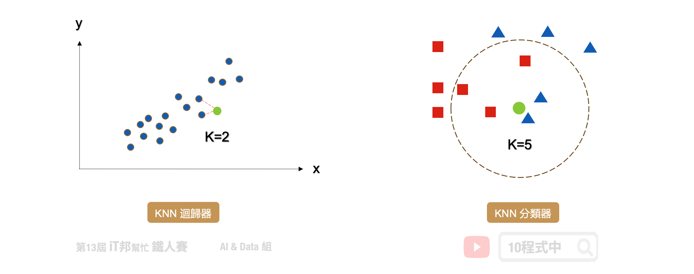
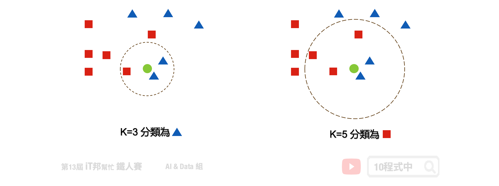
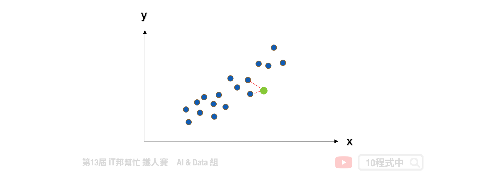
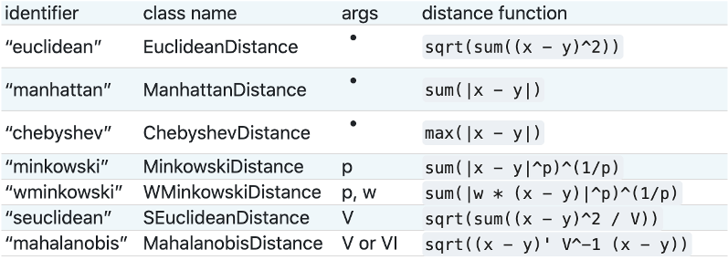
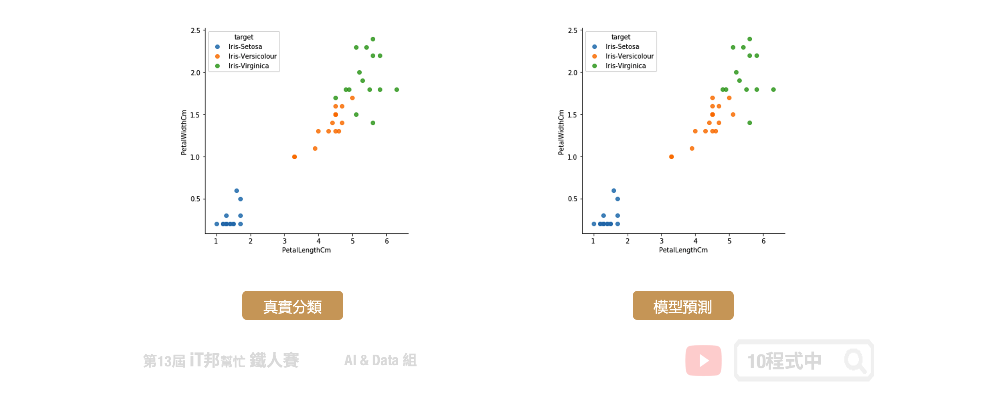

# 近朱者赤，近墨者黑 - KNN
## 今日學習目標

- K-近鄰演算法介紹 
    - KNN 演算法解析
    - KNN 於分類器和迴歸器的做法
    - 比較 KNN 與 k-means 差異
- 實作 KNN 分類器與迴歸器
    - 實作 KNN 分類器，觀察不同 k 值會對分類結果造成什麼影響
    - 實作 KNN 迴歸迴器

## K-近鄰演算法 (KNN)
KNN 的全名 K Nearest Neighbor 是屬於機器學習中的 Supervised learning 其中一種算法，顧名思義就是 k 個最接近你的`鄰居`。分類的標準是由鄰居「多數表決」決定的。在 Sklearn 中 KNN 可以用作分類或迴歸的模型。



## KNN 分類器
在分類問題中 KNN 演算法採多數決標準，利用 k 個最近的鄰居來判定新的資料是在哪一群。其演算法流程非常簡單，首先使用者先決定 k 的大小。接著計算目前該筆新的資料與鄰近的資料間的距離。第三步找出跟自己最近的 k 個鄰居，查看哪一組鄰居數量最多，就加入哪一組。

1. 決定 k 值
2. 求每個鄰居跟自己之間的距離
3. 找出跟自己最近的 k 個鄰居，查看哪一組鄰居數量最多，就加入哪一組
> 如果還是沒辦法決定在哪一組，回到第一步調整 k 值，再繼續

k 的大小會影響模型最終的分類結果。以下圖為例，假設綠色點是新的資料。當 k 等於 3 時會搜尋離綠色點最近的鄰居，我們可以發現藍色三角形為預測的結果。當 k 設為 5 的時候結果又不一樣了，我們發現距離最近的三個鄰居為紅色正方形。



## KNN 迴歸器
KNN 同時也能運用在迴歸問題上面。迴歸模型輸出的結果是一個連續性數值，其預測該值是 k 個最近鄰居輸出的平均值。以下圖為例當 k=2 時，假設我們有一個輸入特徵 x 要預測的輸出為 y。當有一筆新的 x 進來的時候， KNN 迴歸器會尋找鄰近 2 個 x 的輸出做平均當作是該筆資料的預測結果。




## KNN 度量距離的方法
要判斷那些是鄰居的話，首先要量化相似度，而歐幾里得距離 (Euclidean distance) 是比較常用的方法來量度相似度。除此之外還有明可夫斯基距離(Sklearn 預設)、曼哈頓距離、柴比雪夫距離、夾角餘弦、漢明距離、傑卡德相似係數 都可以評估距離的遠近。



## KNN 與 k-means 勿混淆
KNN 的缺點是對資料的局部結構非常敏感，因此調整適當的 k 值極為重要。另外大家很常將 KNN 與 K-means 混淆，雖然兩者都有 k 值要設定但其實兩者無任何關聯。KNN 的 k 是設定鄰居的數量採多數決作為輸出的依據。而 K-means 的 k 是設定集群的類別中心點數量。


## [程式實作]
## KNN 分類器
採用鳶尾花朵資料集做為分類範例，使用 Sklearn 建立 k-nearest neighbors(KNN) 模型。以下是 KNN 常見的模型操作參數：

Parameters:
- n_neighbors: 設定鄰居的數量(k)，選取最近的k個點，預設為5。
- algorithm: 搜尋數演算法{'auto'，'ball_tree'，'kd_tree'，'brute'}，可選。
- metric: 計算距離的方式，預設為歐幾里得距離。

Attributes:
- classes_: 取得類別陣列。
- effective_metric_: 取得計算距離的公式。

Methods:
- fit: 放入X、y進行模型擬合。
- predict: 預測並回傳預測類別。
- score: 預測成功的比例。

```py
from sklearn.neighbors import KNeighborsClassifier

# 建立 KNN 模型
knnModel = KNeighborsClassifier(n_neighbors=3)
# 使用訓練資料訓練模型
knnModel.fit(X_train,y_train)
# 使用訓練資料預測分類
predicted = knnModel.predict(X_train)
```

### 使用Score評估模型
我們可以直接呼叫 `score()` 直接計算模型預測的準確率。

```py
# 預測成功的比例
print('訓練集: ',knnModel.score(X_train,y_train))
print('測試集: ',knnModel.score(X_test,y_test))
```

執行結果：
```
訓練集:  0.9619047619047619
測試集:  0.9555555555555556
```

我們可以查看訓練好的模型在測試集上的預測能力，下圖中左邊的是測試集的真實分類，右邊的是模型預測的分類結果。從圖中可以發現藍色的 `Setosa` 完整的被分類出來，而橘色與綠色的分佈是緊密相連在交界處分類的結果比較不穩定。但最終預測結果結果在訓練集與測試集都有百分之95以上的準確率。



## KNN 迴歸器
KNN 不僅能夠作為分類器，也可以做迴歸連續性的數值預測。其預測值為k個最近鄰居的值的平均值。

Parameters:
- n_neighbors: 設定鄰居的數量(k)，選取最近的k個點，預設為5。
- algorithm: 搜尋數演算法{'auto'，'ball_tree'，'kd_tree'，'brute'}，可選。
- metric: 計算距離的方式，預設為歐幾里得距離。

Attributes:
- classes_: 取得類別陣列。
- effective_metric_: 取得計算距離的公式。

Methods:
- fit: 放入X、y進行模型擬合。
- predict: 預測並回傳預測類別。
- score: 預測成功的比例。


```py
from sklearn.neighbors import KNeighborsRegressor

# 建立 KNN 模型
knnModel = KNeighborsRegressor(n_neighbors=3)
# 使用訓練資料訓練模型
knnModel.fit(x,y)
# 使用訓練資料預測
predicted= knnModel.predict(x)
```

### 模型評估
Sklearn 中 KNN 迴歸模型的 score 函式是 R2 score，可作為模型評估依據，其數值越接近於1代表模型越佳。除了 R2 score 還有其他許多迴歸模型的評估方法，例如： MSE、MAE、RMSE。

```py
from sklearn import metrics
print('R2 score: ', knnModel.score(x, y))
mse = metrics.mean_squared_error(y, predicted)
print('MSE score: ', mse)
```


本系列教學內容及範例程式都可以從我的 [GitHub](https://github.com/andy6804tw/2021-13th-ironman) 取得！